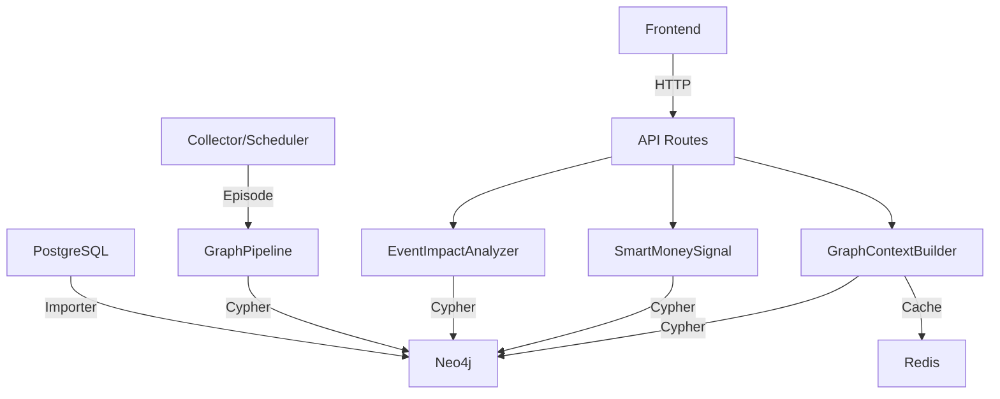

## 产品概述

补齐 QuantDinger Graphiti 全链路知识图谱集成方案中尚未完成的核心模块，使股票/加密/预测市场三大领域的图谱能力从“骨架可用”推进到“功能闭环”。

## 核心功能

1. **领域本体定义**：为股票、加密货币、预测市场三大领域建立 Pydantic 本体模型，统一实体属性规范
2. **事件影响链分析**：实现资产间传染路径查询、事件影响链追踪、级联风险评估
3. **聪明钱信号聚合**：跨领域聚合预测市场聪明钱方向、加密鲸鱼积累信号、股票机构资金流向
4. **数据导入器完善**：填充 stock/crypto/polymarket importer 中的 placeholder fetch 方法，使其能从现有 PostgreSQL 表读取真实数据并入图
5. **定时采集调度**：为 `CollectorScheduler` 增加 APScheduler 集成，实现每小时增量新闻入图、每日全量元数据同步
6. **图谱分析 API 扩展**：新增传染路径、聪明钱信号、事件影响链三个 REST 端点
7. **前端增强**：在现有知识图谱分析页面中新增传染路径、聪明钱信号、事件影响链展示面板，并补齐 API 封装与 Vuex 状态管理
8. **集成测试**：编写端到端测试，验证股票新闻 PoC 全链路可运行

## Tech Stack

- **后端**：Python 3.12 + Flask + SQLAlchemy 2.0 + Neo4j 5.x (Cypher) + APScheduler + Redis
- **前端**：Vue 2 + Vuex + Ant Design Vue + ECharts (力导向图)
- **图谱框架**：本地 `graphiti_core/` + Neo4j Bolt Driver
- **测试**：pytest + 现有 `conftest.py`

## Implementation Approach

1. **自下而上分层推进**：先补齐本体定义和 importer（数据底座），再构建分析服务（业务逻辑），最后扩展 API 和前端（交互层），测试收尾
2. **本体定义复用现有模式**：参考 `app/graph/entities.py` 中 `StockCompany`、`CryptoAsset` 等已有实体，在 `app/graph/ontologies/` 下建立更完整的三大领域本体，确保与 Graphiti `Entity` 基类兼容
3. **分析服务基于 Cypher + 降级**：`EventImpactAnalyzer` 和 `SmartMoneySignal` 的核心逻辑通过 `app/graph/connection.run_cypher` 执行图查询，天然继承 Neo4j 不可用时返回空结果的降级行为
4. **Importer placeholder 利用现有 Repository**：`_fetch_institutions()`、`_fetch_accounts()`、`_fetch_trades()` 等空方法将接入已有 Repository（`MarketSymbolRepository`、`PolymarketRepository` 等）查询真实数据，不再留空
5. **调度器轻量封装**：在现有 `CollectorScheduler` 基础上引入 `BackgroundScheduler`，将 `run_market_collection` 注册为定时任务，避免改造现有 Flask 应用启动流程
6. **前端增量增强**：基于现有 `graph-analysis/index.vue` 的 Ant Design Vue 布局，新增三个卡片区块，复用已有的 `ForceGraph` 组件做传染路径可视化

## Architecture Design



## Directory Structure Summary

### 新建文件

```
backend/app/graph/ontologies/__init__.py          # 本体模块入口
backend/app/graph/ontologies/stock.py             # Company/Executive/Institution
backend/app/graph/ontologies/crypto.py            # CryptoAsset/Protocol/CryptoAccount
backend/app/graph/ontologies/polymarket.py        # PredictionMarket/MarketOutcome
backend/app/services/event_impact_analyzer.py     # 事件影响链分析器
backend/app/services/smart_money_signal.py        # 聪明钱信号聚合器
backend/tests/test_graph_integration.py           # 端到端集成测试
```

### 修改文件

```
backend/app/graph/importers/stock_importer.py     # [MODIFY] 填充 _fetch_institutions/_fetch_holdings
backend/app/graph/importers/crypto_importer.py    # [MODIFY] 填充 _fetch_accounts/_fetch_holdings
backend/app/graph/importers/polymarket_importer.py# [MODIFY] 填充 _fetch_trades
backend/app/collectors/scheduler.py               # [MODIFY] APScheduler 定时调度
backend/app/routes/graph_analysis.py              # [MODIFY] 新增 /contagion-path /smart-money /event-impact
frontend/src/api/graph.js                         # [MODIFY] 新增 getContagionPath / getSmartMoney / getEventImpact
frontend/src/store/modules/graph.js               # [MODIFY] 新增 mutations/actions 映射
frontend/src/views/graph-analysis/index.vue       # [MODIFY] 新增传染路径/聪明钱/事件影响面板
```

## Implementation Notes

- **降级安全**：所有新引入的 Cypher 查询都通过 `run_cypher` 执行，该函数在 Neo4j 不可用时返回 `[]`，不会阻塞主链路
- **缓存复用**：`SmartMoneySignal` 和 `EventImpactAnalyzer` 的结果通过 `GraphCacheGateway` 缓存，TTL 遵循 `GraphConfig` 配置
- **查询限制**：所有 Cypher 查询显式带 `LIMIT`（默认 10-50），避免大图遍历拖垮性能
- **Importer 幂等性**：继续使用 `BaseGraphImporter._run_merge_nodes/_run_merge_relationships` 的 `MERGE` 语义，重复执行不产生重复数据
- **前端兼容性**：新增 API 和 Vuex 状态字段均使用独立命名空间，不影响现有 `graph-analysis` 页面功能

## 设计架构

在现有 `graph-analysis/index.vue`（Ant Design Vue + ECharts 力导向图）基础上增量增强，保持整体布局风格一致。

## 设计内容

### 新增功能区块（位于现有“关联资产”和“近期事件”行下方）

1. **传染路径分析卡片** (`a-card`)：左侧输入两个品种，右侧展示力导向图传播路径，使用 `ForceGraph` 组件
2. **聪明钱信号卡片** (`a-card`)：展示 Polymarket 聪明钱排行/鲸鱼积累/机构流向，使用 `a-statistic` + `a-progress` + `a-table`
3. **事件影响链卡片** (`a-card`)：展示某事件 UID 的多跳影响，使用 `a-timeline` + `a-tag` 标注影响强度

### 交互增强

- 搜索表单增加“分析类型”切换（上下文/传染路径/聪明钱/事件影响），保持单页应用体验
- 所有新增卡片支持独立刷新与加载状态

## 响应式

- 大屏（≥1280px）：三列并排
- 中屏（≥768px）：两列并排
- 小屏：单列堆叠

## Agent Extensions

### SubAgent

- **code-explorer**
- Purpose: 在实现 importer placeholder 填充和前端视图增强时，跨文件搜索现有 Repository 接口、前端组件 props 定义和 API 封装模式，确保新增代码与现有架构一致
- Expected outcome: 提供 `MarketSymbolRepository`、`PolymarketRepository` 等现有类的可用方法清单；提供前端 `ForceGraph` 组件的完整 props 接口；验证 `app/routes/__init__.py` 中蓝图注册方式