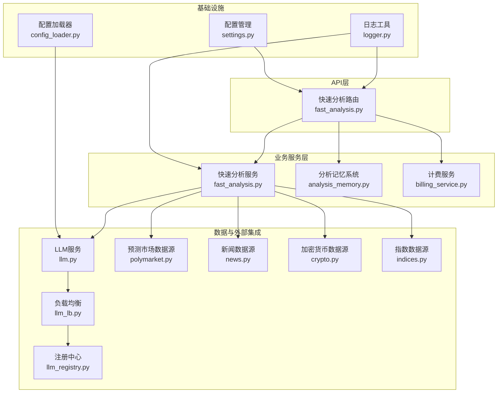
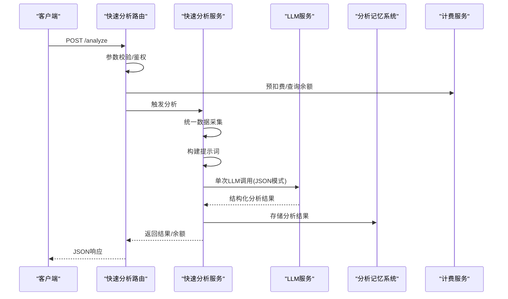
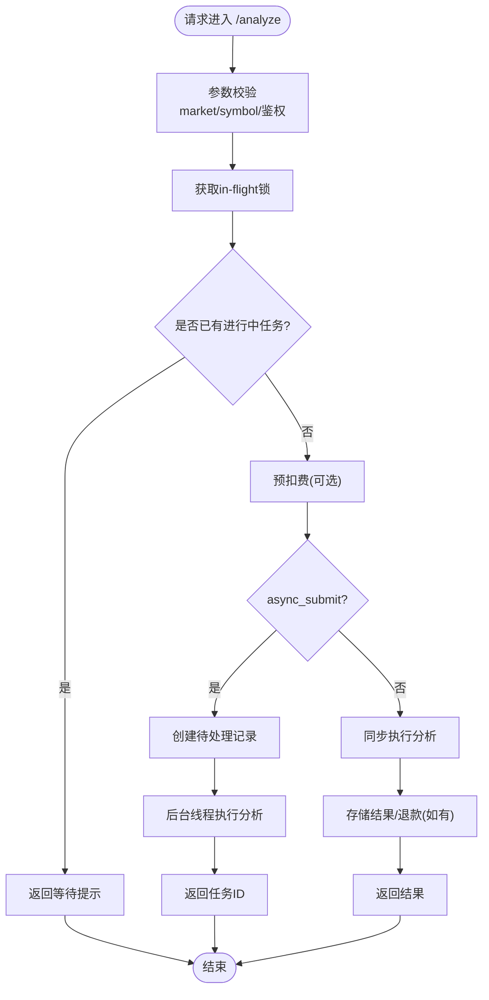
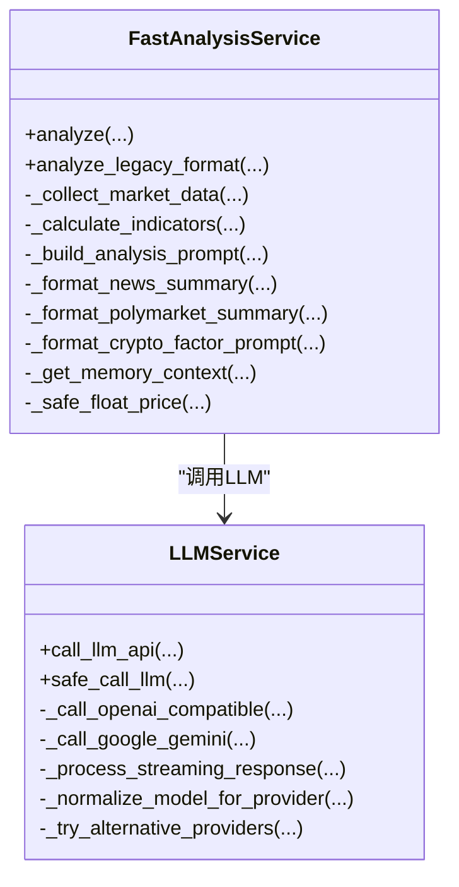
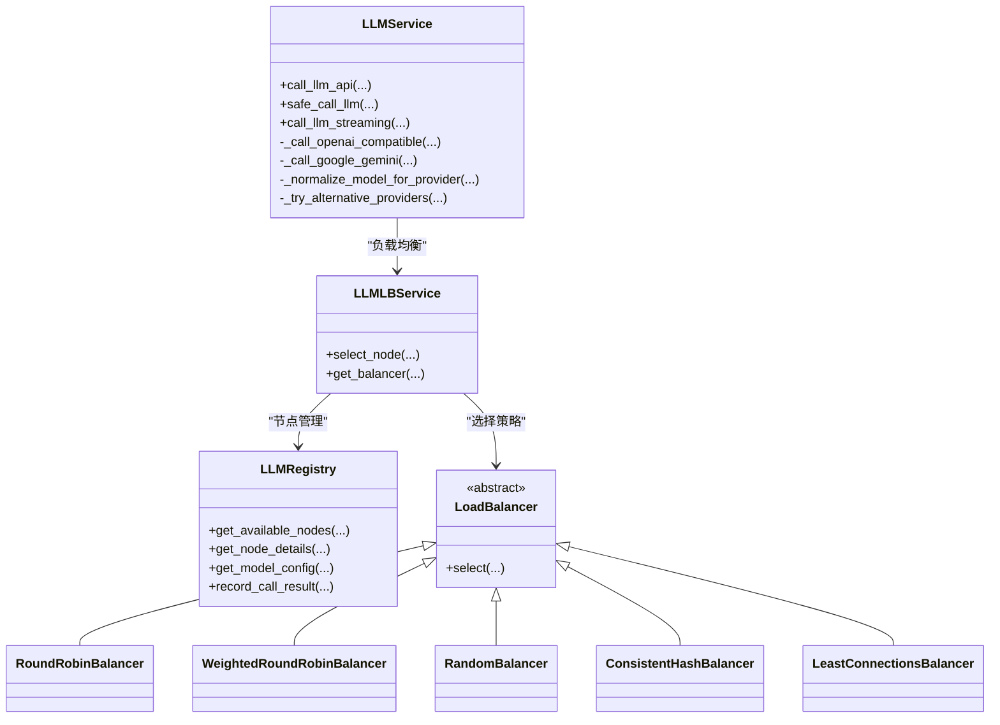
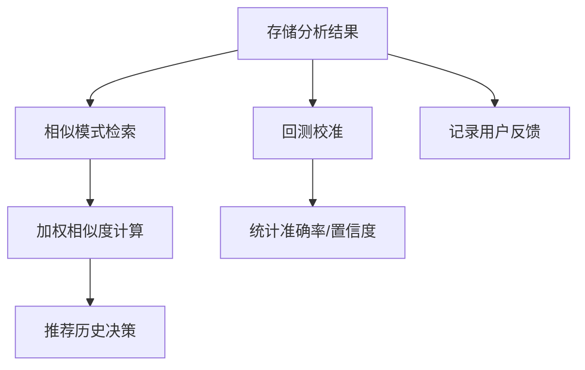
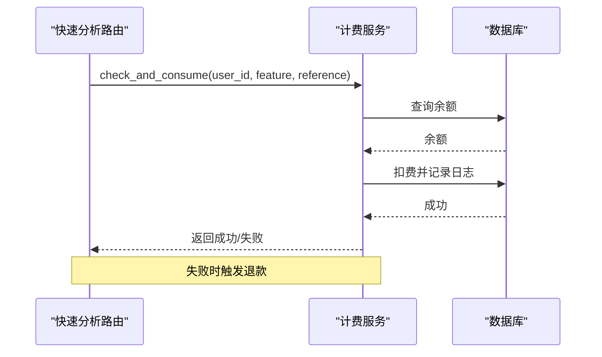
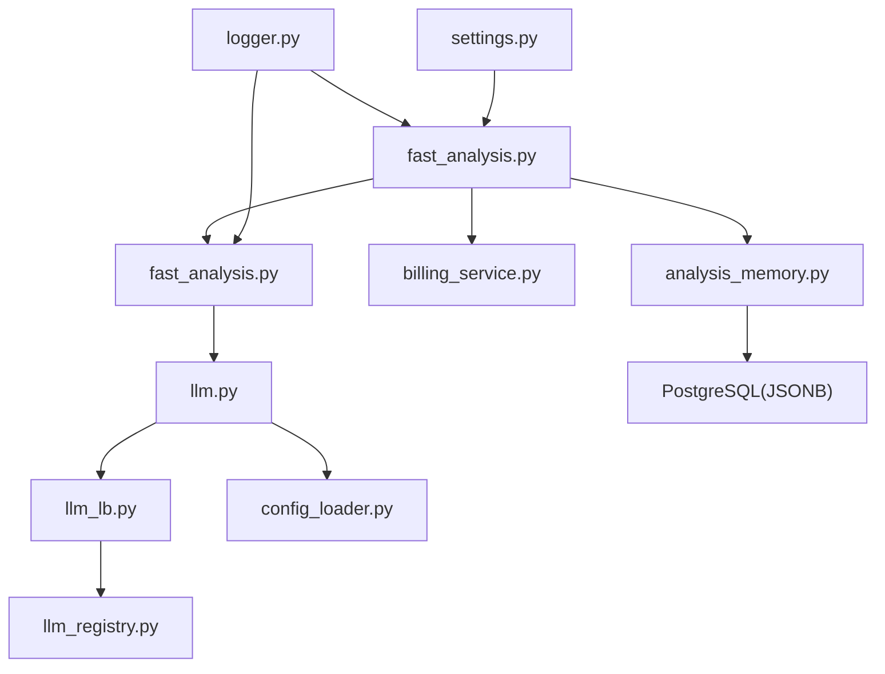

# AI分析服务

<cite>
**本文档引用的文件**
- [fast_analysis.py](file://backend_api_python/app/routes/fast_analysis.py)
- [fast_analysis.py](file://backend_api_python/app/services/fast_analysis.py)
- [llm.py](file://backend_api_python/app/services/llm.py)
- [llm_lb.py](file://backend_api_python/app/services/llm_lb.py)
- [llm_registry.py](file://backend_api_python/app/services/llm_registry.py)
- [analysis_memory.py](file://backend_api_python/app/services/analysis_memory.py)
- [billing_service.py](file://backend_api_python/app/services/billing_service.py)
- [news.py](file://backend_api_python/app/data_providers/news.py)
- [crypto.py](file://backend_api_python/app/data_providers/crypto.py)
- [indices.py](file://backend_api_python/app/data_providers/indices.py)
- [polymarket.py](file://backend_api_python/app/data_sources/polymarket.py)
- [logger.py](file://backend_api_python/app/utils/logger.py)
- [settings.py](file://backend_api_python/app/config/settings.py)
- [config_loader.py](file://backend_api_python/app/utils/config_loader.py)
</cite>

## 目录
1. [简介](#简介)
2. [项目结构](#项目结构)
3. [核心组件](#核心组件)
4. [架构总览](#架构总览)
5. [详细组件分析](#详细组件分析)
6. [依赖关系分析](#依赖关系分析)
7. [性能考虑](#性能考虑)
8. [故障排除指南](#故障排除指南)
9. [结论](#结论)
10. [附录](#附录)

## 简介
本文件面向AI分析服务的快速分析功能，系统性阐述其架构设计、消息格式处理与响应解析机制，详细说明分析请求的构建过程、LLM调用流程与结果处理逻辑，并覆盖分析报告生成规则、JSON模式验证与错误恢复机制。同时提供配置选项、性能调优与监控指标的使用指南，帮助开发者与运维人员高效部署与维护该服务。

## 项目结构
AI分析服务采用分层架构，围绕快速分析路由、分析服务、LLM调用、内存存储与计费系统展开，配合数据源与工具模块，形成高内聚、低耦合的服务体系。

**图表来源**
- [fast_analysis.py:113-346](file://backend_api_python/app/routes/fast_analysis.py#L113-L346)
- [fast_analysis.py:186-761](file://backend_api_python/app/services/fast_analysis.py#L186-L761)
- [llm.py:73-728](file://backend_api_python/app/services/llm.py#L73-L728)
- [llm_lb.py:143-169](file://backend_api_python/app/services/llm_lb.py#L143-L169)
- [llm_registry.py:11-169](file://backend_api_python/app/services/llm_registry.py#L11-L169)
- [analysis_memory.py:36-779](file://backend_api_python/app/services/analysis_memory.py#L36-L779)
- [polymarket.py:17-800](file://backend_api_python/app/data_sources/polymarket.py#L17-L800)
- [news.py:13-70](file://backend_api_python/app/data_providers/news.py#L13-L70)
- [crypto.py:118-169](file://backend_api_python/app/data_providers/crypto.py#L118-L169)
- [indices.py:30-87](file://backend_api_python/app/data_providers/indices.py#L30-L87)
- [logger.py:9-63](file://backend_api_python/app/utils/logger.py#L9-L63)
- [settings.py:1-99](file://backend_api_python/app/config/settings.py#L1-L99)
- [config_loader.py:24-161](file://backend_api_python/app/utils/config_loader.py#L24-L161)

**章节来源**
- [fast_analysis.py:113-346](file://backend_api_python/app/routes/fast_analysis.py#L113-L346)
- [fast_analysis.py:186-761](file://backend_api_python/app/services/fast_analysis.py#L186-L761)

## 核心组件
- 快速分析路由：提供分析入口、历史查询、反馈提交等REST接口，内置防重复执行与异步任务支持。
- 快速分析服务：统一数据采集、提示工程、LLM调用、结果解析与报告生成。
- LLM服务与负载均衡：多提供商适配、自动切换、节点权重与熔断策略。
- 分析记忆系统：持久化分析结果、相似模式检索、回测校准与用户反馈。
- 计费服务：基于积分的消费控制与退款机制。
- 数据源与工具：新闻、预测市场、加密货币、指数等多源数据整合。

**章节来源**
- [fast_analysis.py:113-346](file://backend_api_python/app/routes/fast_analysis.py#L113-L346)
- [fast_analysis.py:186-761](file://backend_api_python/app/services/fast_analysis.py#L186-L761)
- [llm.py:73-728](file://backend_api_python/app/services/llm.py#L73-L728)
- [analysis_memory.py:36-779](file://backend_api_python/app/services/analysis_memory.py#L36-L779)
- [billing_service.py:47-747](file://backend_api_python/app/services/billing_service.py#L47-L747)

## 架构总览
快速分析服务采用“路由-服务-数据-LLM-存储”的分层设计。路由层负责鉴权、参数校验与异步调度；服务层负责数据采集、提示构造与LLM调用；LLM层支持多提供商与负载均衡；存储层负责分析历史与相似模式检索。

**图表来源**
- [fast_analysis.py:166-320](file://backend_api_python/app/routes/fast_analysis.py#L166-L320)
- [fast_analysis.py:486-761](file://backend_api_python/app/services/fast_analysis.py#L486-L761)
- [llm.py:470-728](file://backend_api_python/app/services/llm.py#L470-L728)
- [analysis_memory.py:175-235](file://backend_api_python/app/services/analysis_memory.py#L175-L235)
- [billing_service.py:450-515](file://backend_api_python/app/services/billing_service.py#L450-L515)

## 详细组件分析

### 快速分析路由与请求处理
- 请求参数：market、symbol、language、model、timeframe、async_submit等。
- 防重复执行：基于用户+标的+周期的in-flight锁，避免重复扣费与并发分析。
- 异步模式：创建待处理记录，后台线程执行分析，完成后写回结果。
- 计费集成：预扣费、失败自动退款、余额查询。
- 历史查询与反馈：支持按标的查询历史、分页查看、删除与反馈提交。

**图表来源**
- [fast_analysis.py:166-346](file://backend_api_python/app/routes/fast_analysis.py#L166-L346)
- [fast_analysis.py:41-89](file://backend_api_python/app/routes/fast_analysis.py#L41-L89)

**章节来源**
- [fast_analysis.py:113-346](file://backend_api_python/app/routes/fast_analysis.py#L113-L346)

### 快速分析服务：数据采集与提示工程
- 数据采集：统一使用市场数据采集器，涵盖价格、技术指标、基本面、宏观、新闻、预测市场与衍生因子。
- 技术指标计算：RSI、MACD、MA趋势、支撑阻力、波动率等，提供明确的信号与数值。
- 提示工程：严格约束的系统提示与用户提示，强制语言、决策优先级、价格边界与JSON输出格式。
- JSON模式验证：LLM返回内容经安全解析，失败时回退默认结构并记录报告。
- 历史模式检索：基于相似技术条件的历史决策，辅助当前判断。

**图表来源**
- [fast_analysis.py:186-761](file://backend_api_python/app/services/fast_analysis.py#L186-L761)
- [llm.py:73-796](file://backend_api_python/app/services/llm.py#L73-L796)

**章节来源**
- [fast_analysis.py:203-761](file://backend_api_python/app/services/fast_analysis.py#L203-L761)

### LLM服务与负载均衡
- 多提供商支持：OpenRouter、OpenAI、Google Gemini、DeepSeek、Grok、OLLAMA等。
- 模型解析与规范化：自动识别/转换模型前缀，避免发送不兼容模型名。
- 失败处理：403/402等错误自动切换备用提供商；回退模型与超时配置。
- 负载均衡：支持轮询、加权轮询、随机、一致性哈希、最少连接等策略。
- 注册中心：数据库节点管理、熔断与统计上报。

**图表来源**
- [llm.py:470-796](file://backend_api_python/app/services/llm.py#L470-L796)
- [llm_lb.py:143-169](file://backend_api_python/app/services/llm_lb.py#L143-L169)
- [llm_registry.py:11-169](file://backend_api_python/app/services/llm_registry.py#L11-L169)

**章节来源**
- [llm.py:73-796](file://backend_api_python/app/services/llm.py#L73-L796)
- [llm_lb.py:24-169](file://backend_api_python/app/services/llm_lb.py#L24-L169)
- [llm_registry.py:11-169](file://backend_api_python/app/services/llm_registry.py#L11-L169)

### 分析记忆系统与历史检索
- 存储结构：JSONB字段存储原因、评分、指标快照与原始结果，支持后续校准与可视化。
- 相似模式检索：基于RSI、MACD信号、MA趋势、波动等级的加权相似度计算。
- 回测校准：定期对比历史决策与实际收益，统计准确率与置信度分布。
- 用户反馈：记录用户对分析结果的反馈，用于持续优化。

**图表来源**
- [analysis_memory.py:175-235](file://backend_api_python/app/services/analysis_memory.py#L175-L235)
- [analysis_memory.py:512-583](file://backend_api_python/app/services/analysis_memory.py#L512-L583)
- [analysis_memory.py:608-779](file://backend_api_python/app/services/analysis_memory.py#L608-L779)

**章节来源**
- [analysis_memory.py:36-779](file://backend_api_python/app/services/analysis_memory.py#L36-L779)

### 计费服务与退款机制
- 功能计费：统一配置开关与各功能单价，支持按标的数量乘积计费。
- 预扣费与退款：分析开始前预扣，失败或异常自动退款，余额查询与日志记录。
- VIP与会员：会员状态不影响全局免扣，仅用于权益展示与周期性积分发放。

**图表来源**
- [billing_service.py:450-515](file://backend_api_python/app/services/billing_service.py#L450-L515)
- [fast_analysis.py:25-39](file://backend_api_python/app/routes/fast_analysis.py#L25-L39)
- [fast_analysis.py:287-304](file://backend_api_python/app/routes/fast_analysis.py#L287-L304)

**章节来源**
- [billing_service.py:47-747](file://backend_api_python/app/services/billing_service.py#L47-L747)
- [fast_analysis.py:25-39](file://backend_api_python/app/routes/fast_analysis.py#L25-L39)

### 数据源与外部集成
- 新闻数据：按语言聚合搜索，去重与截断，支持中文与英文。
- 预测市场：Polymarket数据源，支持热门市场、详情查询、关键词搜索与缓存。
- 加密货币与指数：多源聚合与回退，提供价格、涨跌幅与市场概览。

**章节来源**
- [news.py:13-70](file://backend_api_python/app/data_providers/news.py#L13-L70)
- [polymarket.py:17-800](file://backend_api_python/app/data_sources/polymarket.py#L17-L800)
- [crypto.py:118-169](file://backend_api_python/app/data_providers/crypto.py#L118-L169)
- [indices.py:30-87](file://backend_api_python/app/data_providers/indices.py#L30-L87)

## 依赖关系分析
- 路由依赖：鉴权装饰器、分析服务、计费服务、分析记忆系统。
- 服务依赖：LLM服务、数据采集器、分析记忆系统。
- LLM依赖：负载均衡、注册中心、配置加载器。
- 存储依赖：PostgreSQL JSONB字段、索引与事务。
- 配置依赖：环境变量与配置加载器，支持运行时热更新。

**图表来源**
- [fast_analysis.py:1-89](file://backend_api_python/app/routes/fast_analysis.py#L1-L89)
- [fast_analysis.py:1-25](file://backend_api_python/app/services/fast_analysis.py#L1-L25)
- [llm.py:1-20](file://backend_api_python/app/services/llm.py#L1-L20)
- [llm_lb.py:1-20](file://backend_api_python/app/services/llm_lb.py#L1-L20)
- [llm_registry.py:1-10](file://backend_api_python/app/services/llm_registry.py#L1-L10)
- [analysis_memory.py:1-20](file://backend_api_python/app/services/analysis_memory.py#L1-L20)
- [config_loader.py:24-60](file://backend_api_python/app/utils/config_loader.py#L24-L60)
- [logger.py:9-28](file://backend_api_python/app/utils/logger.py#L9-L28)
- [settings.py:1-30](file://backend_api_python/app/config/settings.py#L1-L30)

**章节来源**
- [fast_analysis.py:1-89](file://backend_api_python/app/routes/fast_analysis.py#L1-L89)
- [fast_analysis.py:1-25](file://backend_api_python/app/services/fast_analysis.py#L1-L25)
- [llm.py:1-20](file://backend_api_python/app/services/llm.py#L1-L20)
- [llm_lb.py:1-20](file://backend_api_python/app/services/llm_lb.py#L1-L20)
- [llm_registry.py:1-10](file://backend_api_python/app/services/llm_registry.py#L1-L10)
- [analysis_memory.py:1-20](file://backend_api_python/app/services/analysis_memory.py#L1-L20)
- [config_loader.py:24-60](file://backend_api_python/app/utils/config_loader.py#L24-L60)
- [logger.py:9-28](file://backend_api_python/app/utils/logger.py#L9-L28)
- [settings.py:1-30](file://backend_api_python/app/config/settings.py#L1-L30)

## 性能考虑
- 数据采集超时：统一采集器超时参数，避免阻塞分析流程。
- LLM调用优化：单次调用+JSON模式，减少上下文长度与往返次数。
- 负载均衡策略：根据QPS与SLA选择加权轮询或最少连接；一致性哈希保证用户视角稳定性。
- 缓存与索引：分析记忆系统建立必要索引，热点查询走索引；Polymarket数据源缓存提升响应速度。
- 异步执行：长耗时分析走后台线程，避免阻塞主线程；in-flight锁防止重复执行。
- 日志与监控：统一日志级别与文件滚动，结合LLM调用统计与错误率监控。

[本节为通用指导，无需特定文件引用]

## 故障排除指南
- LLM调用失败：检查API密钥配置、提供商可用性与限额；关注403/402错误的自动切换与回退模型。
- 分析结果为空：确认数据采集器返回数据、提示词构造与JSON解析链路；查看日志中的解析失败记录。
- 计费异常：核对计费开关、功能单价与余额；失败时自动退款，检查退款日志。
- 并发冲突：确认in-flight锁生效，避免重复扣费与重复分析；必要时调整锁TTL。
- 数据源异常：检查Polymarket、新闻、加密货币与指数数据源的可用性与超时设置。

**章节来源**
- [llm.py:638-683](file://backend_api_python/app/services/llm.py#L638-L683)
- [llm.py:685-722](file://backend_api_python/app/services/llm.py#L685-L722)
- [fast_analysis.py:25-39](file://backend_api_python/app/routes/fast_analysis.py#L25-L39)
- [fast_analysis.py:95-111](file://backend_api_python/app/routes/fast_analysis.py#L95-L111)
- [billing_service.py:450-515](file://backend_api_python/app/services/billing_service.py#L450-L515)

## 结论
快速分析服务通过统一数据采集、强约束提示工程与单次LLM调用，实现了高性能、可扩展的AI分析能力。结合负载均衡、分析记忆与计费系统，形成从请求到结果的闭环。建议在生产环境中合理配置超时与重试、启用缓存与索引、完善监控与告警，以获得稳定可靠的分析体验。

[本节为总结性内容，无需特定文件引用]

## 附录

### 配置选项与环境变量
- LLM提供商与模型：OPENROUTER_API_KEY、OPENAI_API_KEY、GOOGLE_API_KEY、DEEPSEEK_API_KEY、GROK_API_KEY、LLM_PROVIDER、OPENAI_COMPATIBLE_*等。
- 应用配置：LOG_LEVEL、RATE_LIMIT、ENABLE_CACHE、ENABLE_REQUEST_LOG等。
- 计费配置：BILLING_ENABLED、BILLING_COST_AI_ANALYSIS等。
- 数据源超时与重试：DATA_SOURCE_TIMEOUT、DATA_SOURCE_RETRY、DATA_SOURCE_RETRY_BACKOFF等。

**章节来源**
- [config_loader.py:60-148](file://backend_api_python/app/utils/config_loader.py#L60-L148)
- [settings.py:66-91](file://backend_api_python/app/config/settings.py#L66-L91)
- [billing_service.py:24-44](file://backend_api_python/app/services/billing_service.py#L24-L44)

### 性能调优建议
- LLM调用：启用合适的超时与回退模型，合理设置温度与最大令牌数。
- 负载均衡：根据节点质量与容量设置权重，启用熔断与失败统计。
- 数据采集：为不同数据源设置差异化超时，启用必要的缓存策略。
- 存储：为高频查询字段建立索引，定期清理历史数据与归档日志。

[本节为通用指导，无需特定文件引用]

### 监控指标使用指南
- LLM调用统计：记录调用次数、成功率、平均延迟与错误类型，用于SLA与成本分析。
- 分析历史：监控分析数量、平均耗时、准确率与置信度分布，评估模型效果。
- 计费与退款：跟踪扣费与退款事件，确保账务一致性。
- 日志级别：生产环境建议INFO级别，关键模块可适当放宽至DEBUG以定位问题。

**章节来源**
- [llm_registry.py:112-169](file://backend_api_python/app/services/llm_registry.py#L112-L169)
- [analysis_memory.py:608-779](file://backend_api_python/app/services/analysis_memory.py#L608-L779)
- [billing_service.py:450-515](file://backend_api_python/app/services/billing_service.py#L450-L515)
- [logger.py:9-34](file://backend_api_python/app/utils/logger.py#L9-L34)