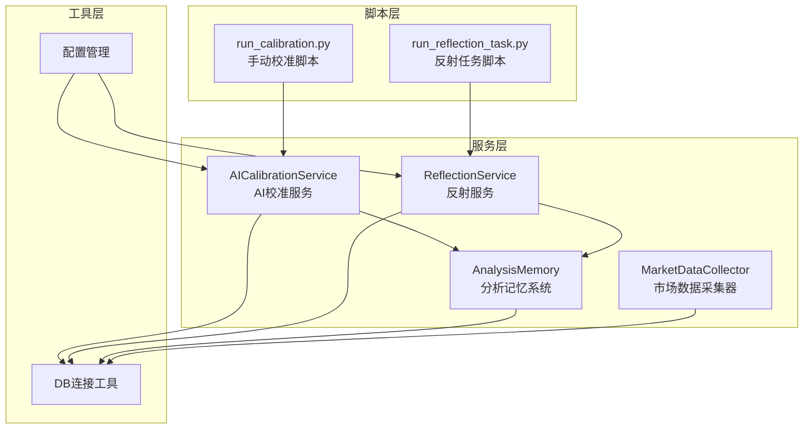
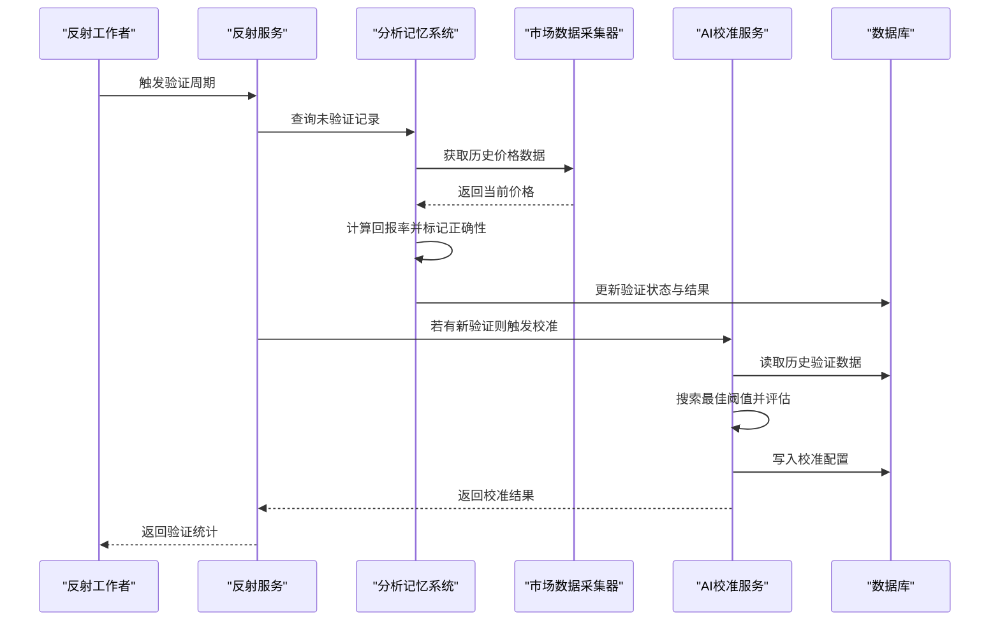
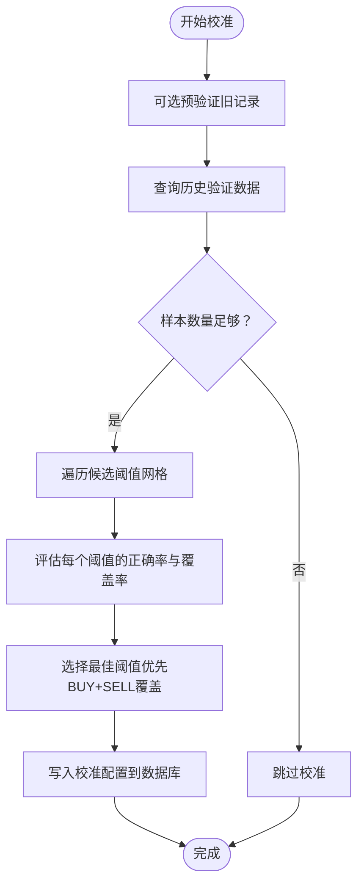
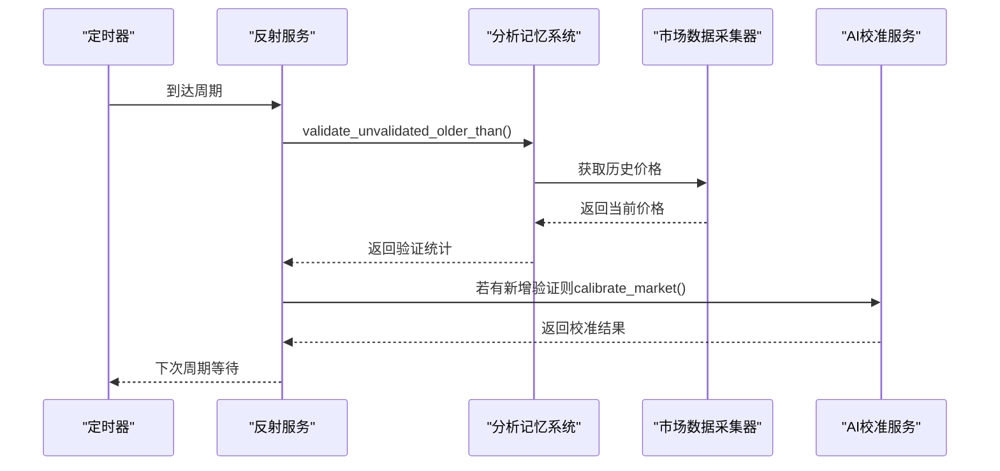
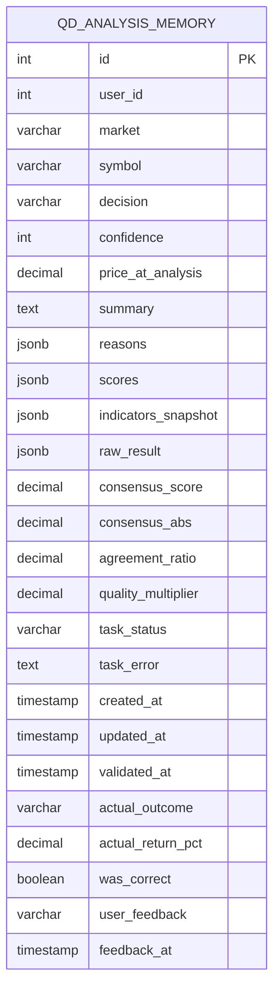
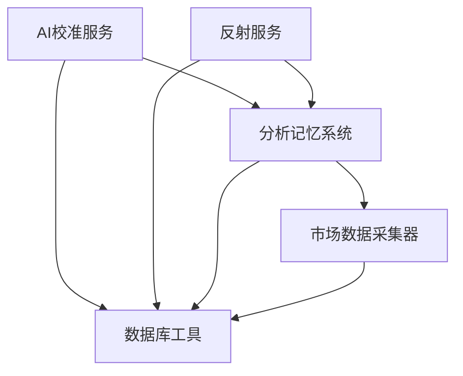

# AI校准与反射机制

<cite>
**本文档引用的文件**
- [ai_calibration.py](file://backend_api_python/app/services/ai_calibration.py)
- [reflection.py](file://backend_api_python/app/services/reflection.py)
- [analysis_memory.py](file://backend_api_python/app/services/analysis_memory.py)
- [market_data_collector.py](file://backend_api_python/app/services/market_data_collector.py)
- [db.py](file://backend_api_python/app/utils/db.py)
- [run_calibration.py](file://backend_api_python/scripts/run_calibration.py)
- [run_reflection_task.py](file://backend_api_python/scripts/run_reflection_task.py)
- [settings.py](file://backend_api_python/app/config/settings.py)
- [data_sources.py](file://backend_api_python/app/config/data_sources.py)
</cite>

## 目录
1. [简介](#简介)
2. [项目结构](#项目结构)
3. [核心组件](#核心组件)
4. [架构概览](#架构概览)
5. [详细组件分析](#详细组件分析)
6. [依赖关系分析](#依赖关系分析)
7. [性能考量](#性能考量)
8. [故障排除指南](#故障排除指南)
9. [结论](#结论)
10. [附录](#附录)

## 简介
本文件系统性阐述QuantDinger项目中的AI校准与反射机制，涵盖以下要点：
- AI校准的必要性：通过历史验证结果自动调整决策阈值，使快速分析服务具备“自适应”能力。
- 校准流程：离线批量校准与在线反射验证相结合，自动选择最优阈值并持久化配置。
- 效果评估：基于正确率、覆盖率与样本统计的多维评估指标。
- 反射机制：定期回溯未验证的历史决策，进行回填验证，并触发校准。
- 学习能力与适应性：通过持续验证与阈值优化，提升AI决策的准确性与鲁棒性。
- 参数配置：环境变量驱动的校准参数、反射周期与市场范围控制。
- 性能指标跟踪：通过内存表记录实际回报率与正确性，支持后续分析与可视化。

## 项目结构
AI校准与反射机制主要分布在后端Python服务中，涉及服务层、工具层与脚本层：
- 服务层：AI校准服务、反射服务、分析记忆系统、市场数据采集器
- 工具层：数据库连接工具、配置管理
- 脚本层：手动执行校准与反射任务的入口脚本

**图表来源**
- [ai_calibration.py:57-342](file://backend_api_python/app/services/ai_calibration.py#L57-L342)
- [reflection.py:22-101](file://backend_api_python/app/services/reflection.py#L22-L101)
- [analysis_memory.py:36-800](file://backend_api_python/app/services/analysis_memory.py#L36-L800)
- [market_data_collector.py:34-800](file://backend_api_python/app/services/market_data_collector.py#L34-L800)
- [db.py:19-66](file://backend_api_python/app/utils/db.py#L19-L66)
- [run_calibration.py:18-36](file://backend_api_python/scripts/run_calibration.py#L18-L36)
- [run_reflection_task.py:11-34](file://backend_api_python/scripts/run_reflection_task.py#L11-L34)

**章节来源**
- [ai_calibration.py:1-342](file://backend_api_python/app/services/ai_calibration.py#L1-L342)
- [reflection.py:1-101](file://backend_api_python/app/services/reflection.py#L1-L101)
- [analysis_memory.py:1-949](file://backend_api_python/app/services/analysis_memory.py#L1-L949)
- [market_data_collector.py:1-2217](file://backend_api_python/app/services/market_data_collector.py#L1-L2217)
- [db.py:1-66](file://backend_api_python/app/utils/db.py#L1-L66)
- [run_calibration.py:1-36](file://backend_api_python/scripts/run_calibration.py#L1-L36)
- [run_reflection_task.py:1-34](file://backend_api_python/scripts/run_reflection_task.py#L1-L34)

## 核心组件
- AI校准服务：负责离线校准，基于历史验证数据搜索最佳阈值，写入校准表并返回评估结果。
- 反射服务：周期性验证未验证的历史决策，回填正确性与实际回报率，并在有新验证时触发校准。
- 分析记忆系统：持久化AI分析结果，记录共识分数、质量倍数、协议比率等，并支持相似模式检索与回填验证。
- 市场数据采集器：为验证过程提供历史价格数据，计算回报率并判定决策正确性。
- 数据库工具：统一PostgreSQL连接接口，确保各服务稳定访问数据库。
- 脚本入口：提供手动执行校准与反射任务的能力，便于运维与测试。

**章节来源**
- [ai_calibration.py:57-342](file://backend_api_python/app/services/ai_calibration.py#L57-L342)
- [reflection.py:22-101](file://backend_api_python/app/services/reflection.py#L22-L101)
- [analysis_memory.py:36-800](file://backend_api_python/app/services/analysis_memory.py#L36-L800)
- [market_data_collector.py:34-800](file://backend_api_python/app/services/market_data_collector.py#L34-L800)
- [db.py:19-66](file://backend_api_python/app/utils/db.py#L19-L66)

## 架构概览
AI校准与反射机制的整体工作流如下：

**图表来源**
- [reflection.py:27-75](file://backend_api_python/app/services/reflection.py#L27-L75)
- [analysis_memory.py:701-778](file://backend_api_python/app/services/analysis_memory.py#L701-L778)
- [market_data_collector.py:228-284](file://backend_api_python/app/services/market_data_collector.py#L228-L284)
- [ai_calibration.py:163-311](file://backend_api_python/app/services/ai_calibration.py#L163-L311)
- [db.py:19-66](file://backend_api_python/app/utils/db.py#L19-L66)

## 详细组件分析

### AI校准服务（AICalibrationService）
- 目标：基于历史验证结果，自动寻找最优决策阈值，使快速分析服务具备自适应能力。
- 关键流程：
  - 预验证：可选地优先验证旧的未验证记录，提高样本质量。
  - 数据获取：查询指定市场的验证记录，包含共识分数与实际回报率。
  - 阈值搜索：遍历候选绝对阈值网格，评估正确率与覆盖率。
  - 决策规则：根据回报率与预测决策计算正确性，避免过度保守或激进。
  - 结果持久化：将最佳阈值与质量阈值写入校准表，支持按市场查询。
- 输出：返回校准结果对象，包含市场、阈值、准确率、覆盖率、样本数等。

**图表来源**
- [ai_calibration.py:163-311](file://backend_api_python/app/services/ai_calibration.py#L163-L311)

**章节来源**
- [ai_calibration.py:57-342](file://backend_api_python/app/services/ai_calibration.py#L57-L342)

### 反射服务（ReflectionService）
- 目标：周期性验证历史AI决策，回填正确性与回报率，并在有新增验证时触发校准。
- 关键流程：
  - 验证循环：查询超过最小年龄的未验证记录，调用市场数据采集器计算回报率并标记正确性。
  - 校准触发：若本次验证产生新记录，则按配置的市场列表逐一执行离线校准。
  - 后台运行：通过守护线程按间隔周期运行，支持环境变量控制开关与间隔。
- 适用场景：自动化回填验证，减少人工干预，持续优化阈值。

**图表来源**
- [reflection.py:27-75](file://backend_api_python/app/services/reflection.py#L27-L75)
- [analysis_memory.py:701-778](file://backend_api_python/app/services/analysis_memory.py#L701-L778)
- [market_data_collector.py:228-284](file://backend_api_python/app/services/market_data_collector.py#L228-L284)
- [ai_calibration.py:163-311](file://backend_api_python/app/services/ai_calibration.py#L163-L311)

**章节来源**
- [reflection.py:22-101](file://backend_api_python/app/services/reflection.py#L22-L101)

### 分析记忆系统（AnalysisMemory）
- 目标：持久化AI分析结果，支持相似模式检索与回填验证。
- 关键能力：
  - 表结构：包含决策、置信度、共识分数、质量倍数、协议比率、验证状态、实际回报率等字段。
  - 验证回填：按时间窗口批量回填未验证记录，计算回报率并标记正确性。
  - 相似模式检索：基于技术指标相似度（RSI、MACD、MA趋势、波动率）匹配历史模式，辅助学习。
  - 任务生命周期：支持创建待处理任务、最终化结果与失败标记。
- 数据模型（简化）：

**图表来源**
- [analysis_memory.py:53-81](file://backend_api_python/app/services/analysis_memory.py#L53-L81)

**章节来源**
- [analysis_memory.py:36-800](file://backend_api_python/app/services/analysis_memory.py#L36-L800)

### 市场数据采集器（MarketDataCollector）
- 目标：为验证过程提供可靠的历史价格数据，支持不同市场与数据源。
- 关键能力：
  - 实时价格与K线：统一通过K线服务获取，支持回退逻辑。
  - 技术指标：本地计算RSI、MACD、布林带、ATR等，保证稳定性。
  - 宏观与情绪：可选获取宏观数据与新闻情绪，增强分析维度。
- 在验证流程中的作用：根据分析时的价格与当前价格计算回报率，判定决策正确性。

**章节来源**
- [market_data_collector.py:228-510](file://backend_api_python/app/services/market_data_collector.py#L228-L510)

### 数据库工具（DB连接工具）
- 目标：提供统一的PostgreSQL连接接口，确保各服务稳定访问数据库。
- 关键特性：重导出PostgreSQL连接函数，提供数据库可用性检查与初始化。

**章节来源**
- [db.py:19-66](file://backend_api_python/app/utils/db.py#L19-L66)

### 脚本入口
- 手动校准脚本：支持通过环境变量指定市场列表，逐个执行离线校准并输出统计。
- 反射任务脚本：加载后端环境变量，执行一次验证周期并打印统计信息，适合通过定时任务调度。

**章节来源**
- [run_calibration.py:18-36](file://backend_api_python/scripts/run_calibration.py#L18-L36)
- [run_reflection_task.py:11-34](file://backend_api_python/scripts/run_reflection_task.py#L11-L34)

## 依赖关系分析
- 服务间耦合：
  - AI校准服务依赖分析记忆系统获取历史验证数据，依赖数据库工具进行持久化。
  - 反射服务依赖分析记忆系统进行回填验证，并在有新增验证时触发校准。
  - 分析记忆系统依赖市场数据采集器获取历史价格，依赖数据库工具进行CRUD操作。
- 外部依赖：
  - PostgreSQL数据库：存储分析记忆与校准配置。
  - 外部数据源：通过K线服务与第三方API获取价格与技术指标。
- 循环依赖：
  - 服务间无直接循环依赖，通过工具层解耦。

**图表来源**
- [ai_calibration.py:57-342](file://backend_api_python/app/services/ai_calibration.py#L57-L342)
- [reflection.py:22-101](file://backend_api_python/app/services/reflection.py#L22-L101)
- [analysis_memory.py:36-800](file://backend_api_python/app/services/analysis_memory.py#L36-L800)
- [market_data_collector.py:34-800](file://backend_api_python/app/services/market_data_collector.py#L34-L800)
- [db.py:19-66](file://backend_api_python/app/utils/db.py#L19-L66)

**章节来源**
- [ai_calibration.py:57-342](file://backend_api_python/app/services/ai_calibration.py#L57-L342)
- [reflection.py:22-101](file://backend_api_python/app/services/reflection.py#L22-L101)
- [analysis_memory.py:36-800](file://backend_api_python/app/services/analysis_memory.py#L36-L800)
- [market_data_collector.py:34-800](file://backend_api_python/app/services/market_data_collector.py#L34-L800)
- [db.py:19-66](file://backend_api_python/app/utils/db.py#L19-L66)

## 性能考量
- 数据访问优化：
  - 分析记忆表建立复合索引，加速按市场、符号、验证状态与时间的查询。
  - 校准服务使用批量查询与限制返回条数，避免长时间锁表。
- 计算复杂度：
  - 校准阈值搜索为线性遍历候选阈值网格，时间复杂度与样本数和阈值数量成正比。
  - 相似模式检索基于多指标加权相似度，注意限制返回条数以控制排序成本。
- 并发与稳定性：
  - 市场数据采集器使用线程池并行获取核心数据，降低整体延迟。
  - 反射工作者使用守护线程与可中断等待，避免资源泄漏。
- 环境变量控制：
  - 通过环境变量灵活控制校准与反射的开关、周期、市场范围与样本阈值，便于在不同环境中平衡性能与精度。

[本节为通用性能讨论，不直接分析具体文件]

## 故障排除指南
- 校准失败：
  - 检查数据库连接与表存在性，确认校准表索引是否创建成功。
  - 确认历史验证数据是否充足，样本数需满足最小阈值。
- 反射验证异常：
  - 查看分析记忆系统回填统计，关注错误计数与失败原因。
  - 确认市场数据采集器能否正常获取历史价格，检查外部API配额与网络状况。
- 线程与守护进程：
  - 反射工作者线程重复启动保护，确保只运行一个实例。
  - 如需停止，可通过事件标志进行优雅退出。
- 环境变量：
  - 确认反射与校准的开关、间隔、市场列表与样本阈值设置合理。

**章节来源**
- [ai_calibration.py:88-90](file://backend_api_python/app/services/ai_calibration.py#L88-L90)
- [reflection.py:88-101](file://backend_api_python/app/services/reflection.py#L88-L101)
- [analysis_memory.py:775-778](file://backend_api_python/app/services/analysis_memory.py#L775-L778)

## 结论
AI校准与反射机制通过“验证—回填—校准”的闭环，实现了AI决策的自我优化与适应性改进。分析记忆系统提供稳定的验证数据基础，市场数据采集器保障价格数据的可靠性，AI校准服务与反射服务分别承担离线优化与周期性验证的职责。配合完善的参数配置与脚本入口，系统能够在不同市场与环境下实现自动化、可追踪的自我优化。

[本节为总结性内容，不直接分析具体文件]

## 附录

### 配置与参数清单
- 校准相关（环境变量）：
  - ENABLE_OFFLINE_AI_CALIBRATION：启用离线校准（默认true）
  - AI_CALIBRATION_MARKET(S)：校准目标市场（单个或多个，逗号分隔，默认Crypto）
  - AI_CALIBRATION_LOOKBACK_DAYS：回溯天数（默认30）
  - AI_CALIBRATION_MIN_SAMPLES：最小样本数（默认80）
  - AI_CALIBRATION_CANDIDATE_ABS_THRESHOLDS：候选绝对阈值列表（逗号分隔，默认网格）
- 反射相关（环境变量）：
  - ENABLE_REFLECTION_WORKER：启用反射工作者（默认true）
  - REFLECTION_WORKER_INTERVAL_SEC：反射周期（秒，默认86400）
  - REFLECTION_MIN_AGE_DAYS：最小验证年龄（默认7）
  - REFLECTION_VALIDATE_LIMIT：每次验证上限（默认200）

**章节来源**
- [ai_calibration.py:132-145](file://backend_api_python/app/services/ai_calibration.py#L132-L145)
- [reflection.py:77-101](file://backend_api_python/app/services/reflection.py#L77-L101)

### 校准参数与规则说明
- 默认阈值：买入阈值、卖出阈值、最小共识绝对阈值、质量持有阈值。
- 阈值搜索：遍历候选绝对阈值网格，评估正确率与覆盖率，优先选择覆盖更广且准确率更高的组合。
- 决策规则：基于回报率与预测决策判断正确性，避免过度保守或激进。

**章节来源**
- [ai_calibration.py:37-42](file://backend_api_python/app/services/ai_calibration.py#L37-L42)
- [ai_calibration.py:132-162](file://backend_api_python/app/services/ai_calibration.py#L132-L162)

### 反射规则与学习能力
- 验证规则：根据决策与回报率判断正确性，支持多市场一致性验证。
- 学习能力：通过持续回填验证与阈值优化，逐步提升决策准确性与鲁棒性。
- 适应性改进：支持多市场、多时间框架的阈值独立配置，适应不同市场特征。

**章节来源**
- [analysis_memory.py:608-700](file://backend_api_python/app/services/analysis_memory.py#L608-L700)
- [reflection.py:27-75](file://backend_api_python/app/services/reflection.py#L27-L75)

### 性能指标跟踪
- 校准指标：最佳准确率、覆盖率（BUY/SELL/HOLD）、样本数、新增验证数。
- 验证指标：验证总数、正确数、错误数、准确率百分比。
- 建议：结合前端仪表板展示校准与验证统计，便于监控系统表现。

**章节来源**
- [ai_calibration.py:301-310](file://backend_api_python/app/services/ai_calibration.py#L301-L310)
- [analysis_memory.py:622-699](file://backend_api_python/app/services/analysis_memory.py#L622-L699)

### 最佳实践与监控策略
- 最佳实践：
  - 定期运行反射任务，确保历史记录及时回填验证。
  - 根据市场波动性调整校准周期与阈值网格。
  - 在生产环境启用离线校准，结合手动脚本进行周期性校验。
- 监控策略：
  - 关注校准准确率与覆盖率变化趋势，异常波动时触发告警。
  - 监控反射工作者线程健康状态与数据库连接池使用情况。
  - 记录并可视化验证统计，辅助业务决策与系统优化。

[本节为通用指导，不直接分析具体文件]