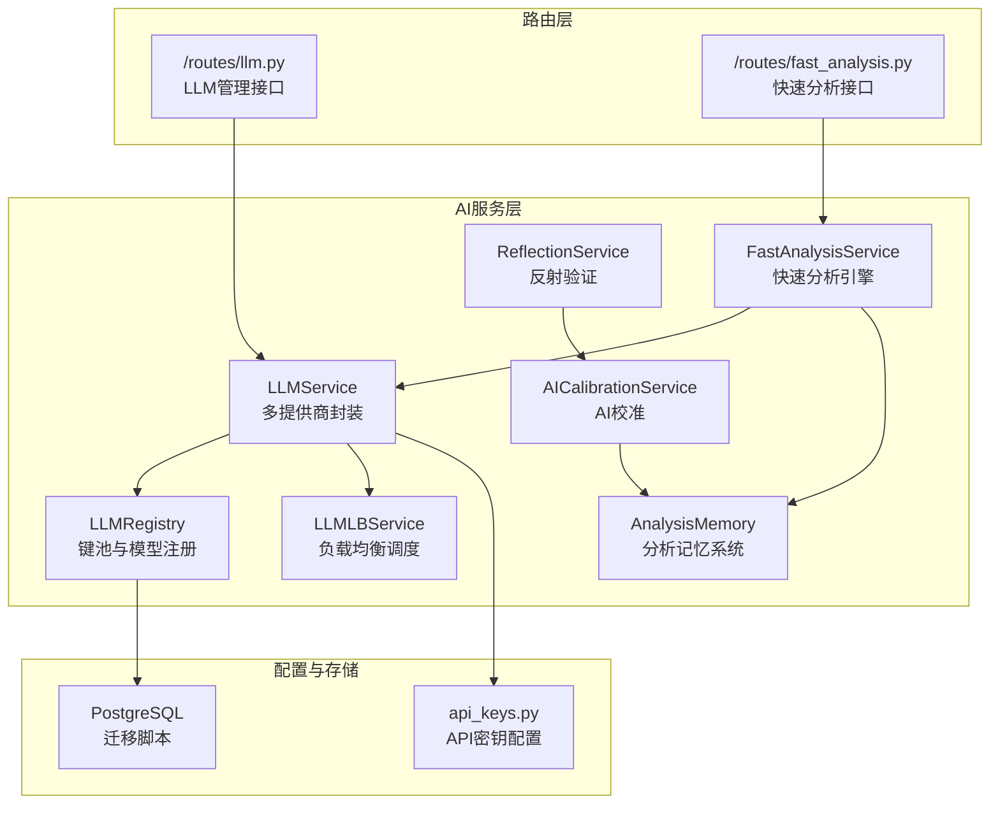
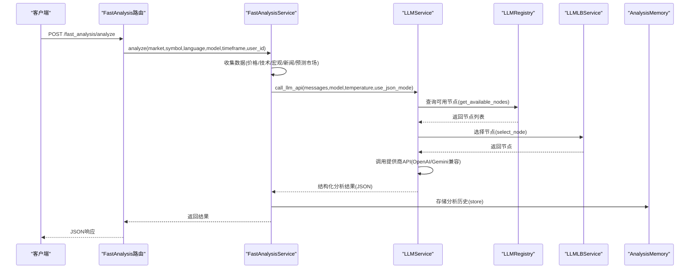
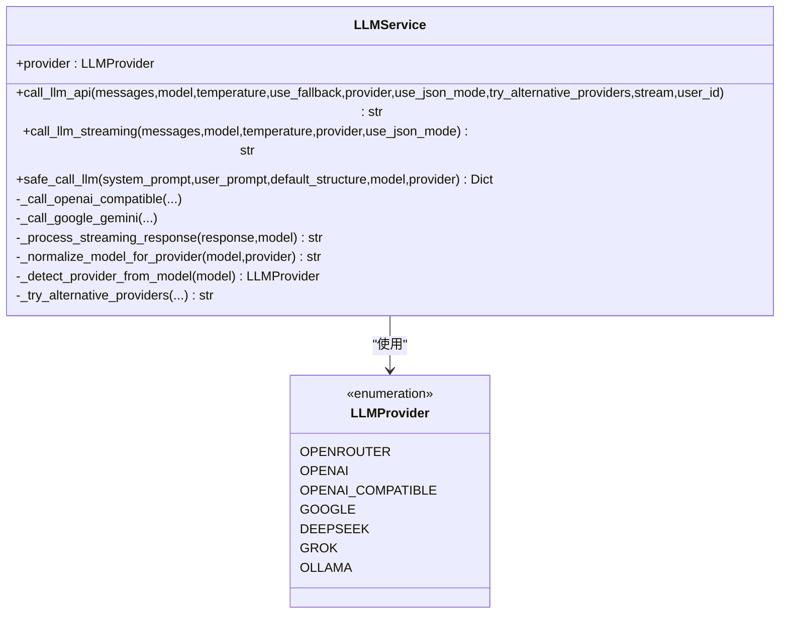
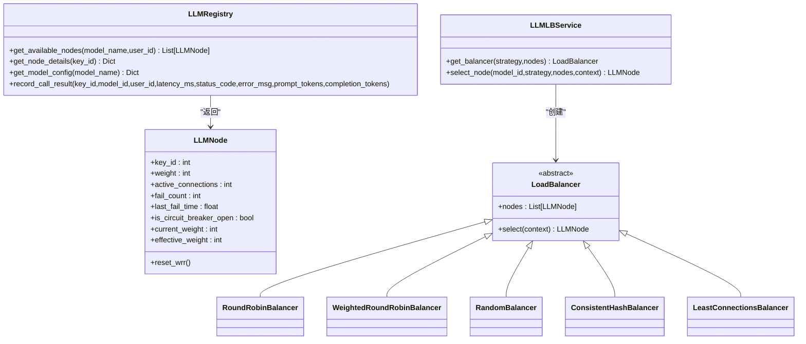
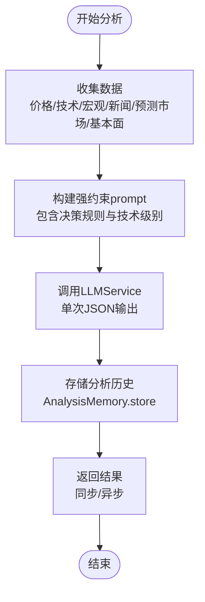
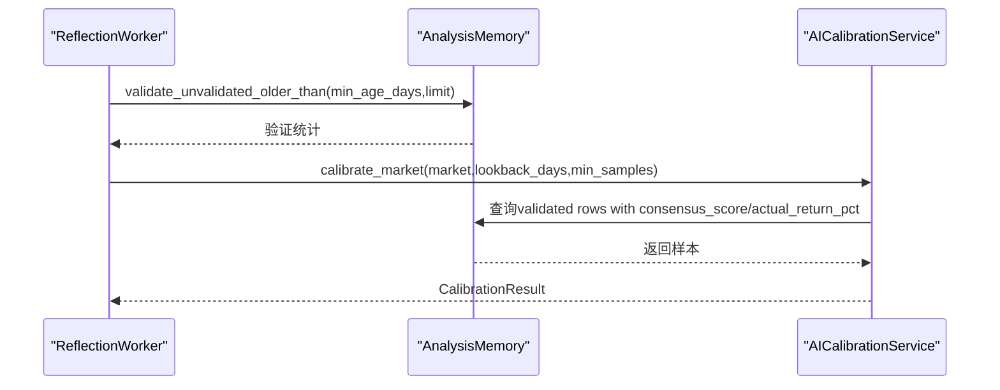
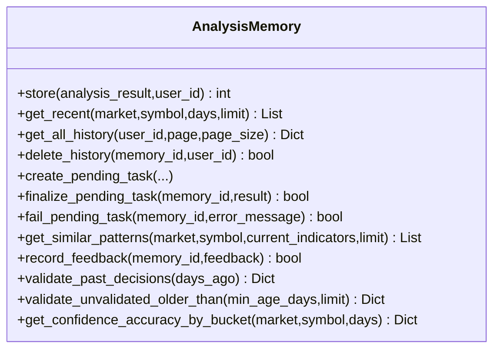
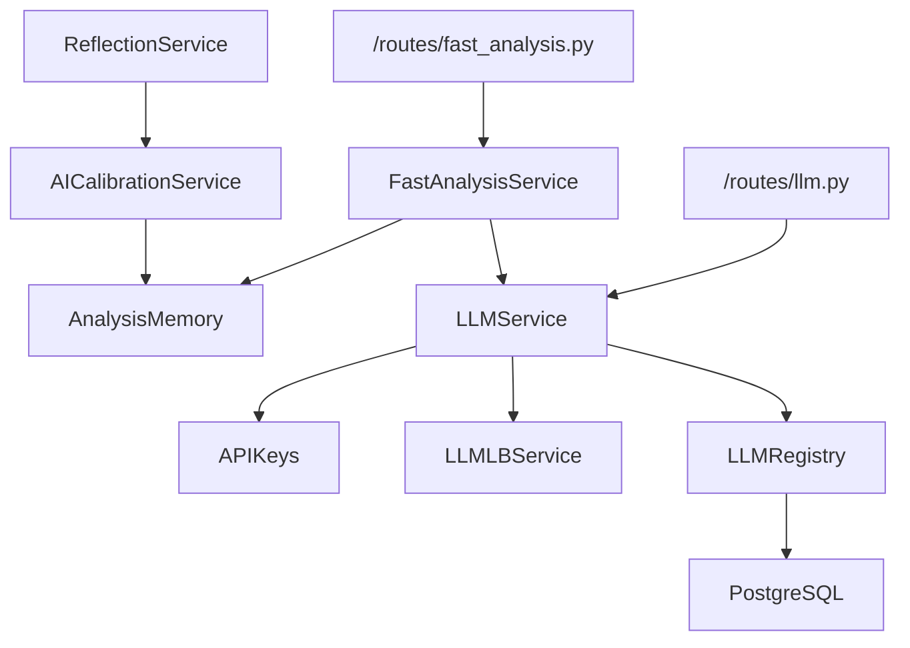

# AI集成系统

<cite>
**本文档引用的文件**
- [llm.py](file://backend_api_python/app/services/llm.py)
- [llm_lb.py](file://backend_api_python/app/services/llm_lb.py)
- [llm_registry.py](file://backend_api_python/app/services/llm_registry.py)
- [llm.py](file://backend_api_python/app/routes/llm.py)
- [fast_analysis.py](file://backend_api_python/app/services/fast_analysis.py)
- [analysis_memory.py](file://backend_api_python/app/services/analysis_memory.py)
- [fast_analysis.py](file://backend_api_python/app/routes/fast_analysis.py)
- [reflection.py](file://backend_api_python/app/services/reflection.py)
- [ai_calibration.py](file://backend_api_python/app/services/ai_calibration.py)
- [api_keys.py](file://backend_api_python/app/config/api_keys.py)
- [llm_lb_setup.sql](file://backend_api_python/migrations/llm_lb_setup.sql)
</cite>

## 目录
1. [简介](#简介)
2. [项目结构](#项目结构)
3. [核心组件](#核心组件)
4. [架构总览](#架构总览)
5. [详细组件分析](#详细组件分析)
6. [依赖关系分析](#依赖关系分析)
7. [性能考虑](#性能考虑)
8. [故障排除指南](#故障排除指南)
9. [结论](#结论)
10. [附录](#附录)

## 简介
QuantDinger AI集成系统是一个面向量化交易与金融分析的多LLM提供商集成平台，具备以下能力：
- 多LLM提供商统一接入：OpenRouter、OpenAI、Google Gemini、DeepSeek、Grok、本地Ollama等
- 快速分析服务：单次LLM调用、统一数据采集、结构化输出
- 负载均衡与键池管理：基于数据库的API Key注册表、节点权重与熔断策略
- AI校准与反射机制：离线验证历史决策、自动阈值校准、持续学习
- 历史记忆与复用：分析历史存储、相似模式检索、反馈闭环
- 监控与统计：调用日志、成功率、延迟、错误追踪

## 项目结构
后端采用Python Flask微服务架构，AI相关逻辑集中在`app/services`目录，路由集中在`app/routes`目录，数据库迁移脚本位于`migrations`目录。

**图表来源**
- [llm.py:73-813](file://backend_api_python/app/services/llm.py#L73-L813)
- [llm_lb.py:143-169](file://backend_api_python/app/services/llm_lb.py#L143-L169)
- [llm_registry.py:11-169](file://backend_api_python/app/services/llm_registry.py#L11-L169)
- [fast_analysis.py:186-2805](file://backend_api_python/app/services/fast_analysis.py#L186-L2805)
- [analysis_memory.py:36-949](file://backend_api_python/app/services/analysis_memory.py#L36-L949)
- [reflection.py:22-101](file://backend_api_python/app/services/reflection.py#L22-L101)
- [ai_calibration.py:57-342](file://backend_api_python/app/services/ai_calibration.py#L57-L342)
- [llm.py:1-723](file://backend_api_python/app/routes/llm.py#L1-L723)
- [fast_analysis.py:1-1004](file://backend_api_python/app/routes/fast_analysis.py#L1-L1004)
- [api_keys.py:148-164](file://backend_api_python/app/config/api_keys.py#L148-L164)
- [llm_lb_setup.sql:1-67](file://backend_api_python/migrations/llm_lb_setup.sql#L1-L67)

**章节来源**
- [llm.py:1-813](file://backend_api_python/app/services/llm.py#L1-L813)
- [llm_lb.py:1-169](file://backend_api_python/app/services/llm_lb.py#L1-L169)
- [llm_registry.py:1-169](file://backend_api_python/app/services/llm_registry.py#L1-L169)
- [llm.py:1-723](file://backend_api_python/app/routes/llm.py#L1-L723)
- [fast_analysis.py:1-2805](file://backend_api_python/app/services/fast_analysis.py#L1-L2805)
- [analysis_memory.py:1-949](file://backend_api_python/app/services/analysis_memory.py#L1-L949)
- [reflection.py:1-101](file://backend_api_python/app/services/reflection.py#L1-L101)
- [ai_calibration.py:1-342](file://backend_api_python/app/services/ai_calibration.py#L1-L342)
- [api_keys.py:1-164](file://backend_api_python/app/config/api_keys.py#L1-L164)
- [llm_lb_setup.sql:1-67](file://backend_api_python/migrations/llm_lb_setup.sql#L1-L67)

## 核心组件
- LLMService：统一多提供商LLM调用，支持模型归一化、响应格式化、流式输出、备用模型与提供商切换、错误处理与回退
- LLMLBService：多种负载均衡策略（轮询、加权轮询、随机、一致性哈希、最少连接），结合节点权重与熔断状态
- LLMRegistry：数据库驱动的API Key注册表，提供可用节点查询、节点详情获取、调用结果记录与熔断控制
- FastAnalysisService：统一数据采集（K线、宏观、新闻、预测市场、基本面）、单次LLM调用、结构化输出、历史记忆检索与复用
- AnalysisMemory：分析历史持久化、相似模式检索、结果验证与反馈
- AICalibrationService：离线校准，基于历史验证结果搜索最优阈值，更新市场级决策规则
- ReflectionService：周期性验证历史决策并触发校准，形成学习闭环

**章节来源**
- [llm.py:73-813](file://backend_api_python/app/services/llm.py#L73-L813)
- [llm_lb.py:143-169](file://backend_api_python/app/services/llm_lb.py#L143-L169)
- [llm_registry.py:11-169](file://backend_api_python/app/services/llm_registry.py#L11-L169)
- [fast_analysis.py:186-2805](file://backend_api_python/app/services/fast_analysis.py#L186-L2805)
- [analysis_memory.py:36-949](file://backend_api_python/app/services/analysis_memory.py#L36-L949)
- [ai_calibration.py:57-342](file://backend_api_python/app/services/ai_calibration.py#L57-L342)
- [reflection.py:22-101](file://backend_api_python/app/services/reflection.py#L22-L101)

## 架构总览
系统采用“路由-服务-存储”分层，AI分析流程从路由入口进入，经过快速分析服务整合多源数据，调用LLMService进行推理，利用AnalysisMemory记录与复用历史，通过AICalibrationService与ReflectionService实现持续优化。

**图表来源**
- [fast_analysis.py:113-346](file://backend_api_python/app/routes/fast_analysis.py#L113-L346)
- [fast_analysis.py:186-2805](file://backend_api_python/app/services/fast_analysis.py#L186-L2805)
- [llm.py:470-684](file://backend_api_python/app/services/llm.py#L470-L684)
- [llm_registry.py:17-68](file://backend_api_python/app/services/llm_registry.py#L17-L68)
- [llm_lb.py:163-169](file://backend_api_python/app/services/llm_lb.py#L163-L169)
- [analysis_memory.py:175-235](file://backend_api_python/app/services/analysis_memory.py#L175-L235)

## 详细组件分析

### LLMService 组件分析
- 多提供商支持：OpenRouter、OpenAI、Google Gemini、DeepSeek、Grok、本地Ollama
- 模型归一化：根据当前提供商提取或映射模型名，避免跨提供商模型不兼容
- 响应格式：默认请求JSON输出，兼容不同提供商的响应结构
- 错误处理：HTTP状态码分类处理（402/403/404/429等），自动尝试备用模型与替代提供商
- 流式输出：支持SSE流式响应，增强用户体验
- 安全调用：提供安全解析方法，处理LLM输出中的JSON异常

**图表来源**
- [llm.py:22-126](file://backend_api_python/app/services/llm.py#L22-L126)
- [llm.py:470-751](file://backend_api_python/app/services/llm.py#L470-L751)

**章节来源**
- [llm.py:73-813](file://backend_api_python/app/services/llm.py#L73-L813)

### 负载均衡与键池管理
- LLMNode：抽象API Key节点，包含权重、活动连接数、失败计数、熔断状态与平滑加权轮询参数
- LoadBalancer基类：定义选择算法接口
- 多种策略：轮询、加权轮询、随机、一致性哈希、最少连接
- LLMLBService：按策略实例化负载均衡器，选择节点
- LLMRegistry：查询可用节点、获取节点详情（含解密后的API Key）、记录调用结果与熔断

**图表来源**
- [llm_lb.py:7-169](file://backend_api_python/app/services/llm_lb.py#L7-L169)
- [llm_registry.py:11-169](file://backend_api_python/app/services/llm_registry.py#L11-L169)

**章节来源**
- [llm_lb.py:1-169](file://backend_api_python/app/services/llm_lb.py#L1-L169)
- [llm_registry.py:1-169](file://backend_api_python/app/services/llm_registry.py#L1-L169)

### 快速分析服务
- 数据采集：统一的MarketDataCollector，支持价格/K线、技术指标、宏观数据、新闻、预测市场、基本面
- 单次LLM调用：强约束prompt，要求输出结构化JSON，包含决策、置信度、入场/止损/止盈、评分等
- 技术信号：RSI、MACD、MA趋势、支撑阻力、ATR波动率等
- 宏观与新闻：美元指数(DXY)、恐慌指数(VIX)、利率、地缘政治事件检测
- 记忆复用：相似模式检索，历史正确性与实际回报率统计
- 输出格式：兼容新旧两种格式，支持异步提交与后台执行

**图表来源**
- [fast_analysis.py:203-232](file://backend_api_python/app/services/fast_analysis.py#L203-L232)
- [fast_analysis.py:486-761](file://backend_api_python/app/services/fast_analysis.py#L486-L761)
- [analysis_memory.py:175-235](file://backend_api_python/app/services/analysis_memory.py#L175-L235)

**章节来源**
- [fast_analysis.py:1-2805](file://backend_api_python/app/services/fast_analysis.py#L1-L2805)
- [fast_analysis.py:1-1004](file://backend_api_python/app/routes/fast_analysis.py#L1-L1004)

### AI校准与反射机制
- ReflectionService：周期性验证历史未验证决策，计算准确率，必要时触发AI校准
- AICalibrationService：基于共识分数与实际回报率，搜索最优绝对阈值，写入校准表
- 自动阈值：根据市场类型（如Crypto）自动调整买入/卖出阈值与持有质量阈值
- 离线校准：服务启动时可执行一次离线校准，提升初始性能

**图表来源**
- [reflection.py:27-75](file://backend_api_python/app/services/reflection.py#L27-L75)
- [ai_calibration.py:163-311](file://backend_api_python/app/services/ai_calibration.py#L163-L311)
- [analysis_memory.py:701-778](file://backend_api_python/app/services/analysis_memory.py#L701-L778)

**章节来源**
- [reflection.py:1-101](file://backend_api_python/app/services/reflection.py#L1-L101)
- [ai_calibration.py:1-342](file://backend_api_python/app/services/ai_calibration.py#L1-L342)
- [analysis_memory.py:608-778](file://backend_api_python/app/services/analysis_memory.py#L608-L778)

### 历史记忆与复用
- AnalysisMemory：持久化分析结果，支持最近历史查询、分页查询、删除、相似模式检索
- 相似模式：基于RSI、MACD信号、MA趋势、波动等级的加权相似度计算
- 验证与反馈：定期回测决策准确性，记录用户反馈，形成闭环

**图表来源**
- [analysis_memory.py:36-949](file://backend_api_python/app/services/analysis_memory.py#L36-L949)

**章节来源**
- [analysis_memory.py:1-949](file://backend_api_python/app/services/analysis_memory.py#L1-L949)

### LLM管理与监控路由
- 提供商管理：列出、创建、更新提供商（名称、编码、API类型、基础URL、状态）
- API Key管理：列出、创建、更新API Key（权重、状态、备注、公开性、加密存储）
- 模型管理：列出、创建、更新模型（负载均衡策略、重试次数、超时、状态）
- 监控统计：24小时调用统计（总调用次数、平均延迟、成功率）

**章节来源**
- [llm.py:1-723](file://backend_api_python/app/routes/llm.py#L1-L723)

## 依赖关系分析

**图表来源**
- [llm.py:1-813](file://backend_api_python/app/services/llm.py#L1-L813)
- [llm_registry.py:1-169](file://backend_api_python/app/services/llm_registry.py#L1-L169)
- [llm_lb.py:1-169](file://backend_api_python/app/services/llm_lb.py#L1-L169)
- [fast_analysis.py:1-2805](file://backend_api_python/app/services/fast_analysis.py#L1-L2805)
- [analysis_memory.py:1-949](file://backend_api_python/app/services/analysis_memory.py#L1-L949)
- [reflection.py:1-101](file://backend_api_python/app/services/reflection.py#L1-L101)
- [ai_calibration.py:1-342](file://backend_api_python/app/services/ai_calibration.py#L1-L342)
- [llm.py:1-723](file://backend_api_python/app/routes/llm.py#L1-L723)
- [fast_analysis.py:1-1004](file://backend_api_python/app/routes/fast_analysis.py#L1-L1004)

**章节来源**
- [llm.py:1-813](file://backend_api_python/app/services/llm.py#L1-L813)
- [llm_registry.py:1-169](file://backend_api_python/app/services/llm_registry.py#L1-L169)
- [llm_lb.py:1-169](file://backend_api_python/app/services/llm_lb.py#L1-L169)
- [fast_analysis.py:1-2805](file://backend_api_python/app/services/fast_analysis.py#L1-L2805)
- [analysis_memory.py:1-949](file://backend_api_python/app/services/analysis_memory.py#L1-L949)
- [reflection.py:1-101](file://backend_api_python/app/services/reflection.py#L1-L101)
- [ai_calibration.py:1-342](file://backend_api_python/app/services/ai_calibration.py#L1-L342)
- [llm.py:1-723](file://backend_api_python/app/routes/llm.py#L1-L723)
- [fast_analysis.py:1-1004](file://backend_api_python/app/routes/fast_analysis.py#L1-L1004)

## 性能考虑
- 负载均衡策略选择
  - 加权轮询：适合不同API Key质量差异较大的场景
  - 一致性哈希：保证同一用户（基于用户ID）固定到同一节点，便于限流与资源隔离
  - 最少连接：动态分配到当前最空闲节点，降低热点
- 超时与重试
  - 模型配置支持超时与重试次数，避免单点故障放大
  - 熔断机制：连续失败达到阈值（如5次）自动熔断，防止雪崩
- 流式输出
  - 支持SSE流式响应，减少前端等待时间，提升交互体验
- 数据缓存与索引
  - PostgreSQL索引覆盖调用日志、API Key状态、模型与提供商关系，加速查询
- 并发与异步
  - 快速分析支持异步提交，后台线程执行，避免阻塞主请求

[本节为通用指导，无需特定文件引用]

## 故障排除指南
- API密钥配置
  - 确认环境变量或配置文件中对应提供商密钥已正确设置
  - 若显式指定提供商但未配置相应密钥，会抛出明确错误提示
- 403/402错误
  - 可能由API密钥无效、余额不足、无模型权限导致
  - 系统会自动尝试替代提供商或备用模型
- 空内容或非JSON响应
  - LLMService提供安全解析与回退策略，若解析失败，返回默认结构并记录错误
- 负载均衡与熔断
  - 检查API Key状态与失败计数，确认是否被熔断
  - 调整权重与策略，观察成功率与延迟变化
- 监控与日志
  - 通过LLM管理路由查看24小时统计，定位异常高峰与错误类型
  - AnalysisMemory记录验证与反馈，辅助问题定位

**章节来源**
- [llm.py:246-289](file://backend_api_python/app/services/llm.py#L246-L289)
- [llm.py:638-683](file://backend_api_python/app/services/llm.py#L638-L683)
- [llm.py:753-796](file://backend_api_python/app/services/llm.py#L753-L796)
- [llm.py:663-723](file://backend_api_python/app/routes/llm.py#L663-L723)
- [llm_registry.py:112-164](file://backend_api_python/app/services/llm_registry.py#L112-L164)

## 结论
QuantDinger AI集成系统通过多LLM提供商统一接入、快速分析引擎、负载均衡与键池管理、AI校准与反射机制，以及历史记忆与复用，构建了高可用、可扩展、可自学习的AI分析平台。系统在性能、可靠性与易维护性方面均具备良好设计，适合在量化交易与金融分析场景中部署与演进。

[本节为总结性内容，无需特定文件引用]

## 附录

### 数据库表结构概览
- qd_llm_provider：提供商信息（名称、编码、基础URL、API类型、状态）
- qd_llm_api_key：API Key（提供商关联、权重、状态、拥有者、公开性、失败计数、最后使用时间、指标）
- qd_llm_model：模型信息（提供商关联、模型名、显示名、负载均衡策略、重试次数、超时、状态）
- qd_llm_call_log：调用日志（API Key关联、模型关联、用户ID、Token用量、延迟、状态码、错误信息）
- qd_analysis_memory：分析记忆（市场、符号、决策、置信度、价格、摘要、原因、评分、指标快照、原始结果、共识分数、验证状态）
- qd_ai_calibration：AI校准（市场、买入阈值、卖出阈值、最小共识绝对值覆盖、质量持有阈值、验证时间）

**章节来源**
- [llm_lb_setup.sql:1-67](file://backend_api_python/migrations/llm_lb_setup.sql#L1-L67)

### API调用最佳实践
- 模型选择
  - 优先使用与目标市场匹配的模型前缀（如openai/gpt-4o），系统会自动归一化
  - 未指定模型时使用提供商默认模型，必要时启用备用模型
- 负载均衡策略
  - 根据业务需求选择策略：一致性哈希用于用户绑定，加权轮询用于资源差异化
  - 动态调整权重与超时，平衡吞吐与稳定性
- 错误处理
  - 捕获HTTP状态码与JSON解析异常，记录详细错误信息
  - 在403/402等常见错误时自动切换替代提供商
- 监控与告警
  - 关注成功率、平均延迟、错误分布，及时发现异常
  - 定期运行反射验证与AI校准，保持决策阈值与市场特性同步

**章节来源**
- [llm.py:470-684](file://backend_api_python/app/services/llm.py#L470-L684)
- [llm_lb.py:143-169](file://backend_api_python/app/services/llm_lb.py#L143-L169)
- [llm_registry.py:112-164](file://backend_api_python/app/services/llm_registry.py#L112-L164)
- [reflection.py:27-75](file://backend_api_python/app/services/reflection.py#L27-L75)
- [ai_calibration.py:163-311](file://backend_api_python/app/services/ai_calibration.py#L163-L311)