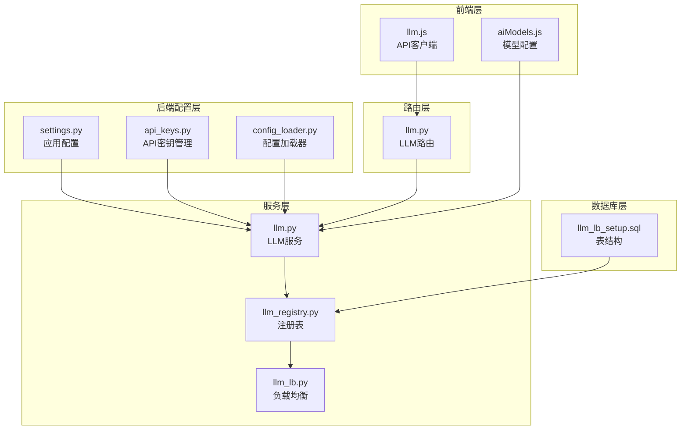
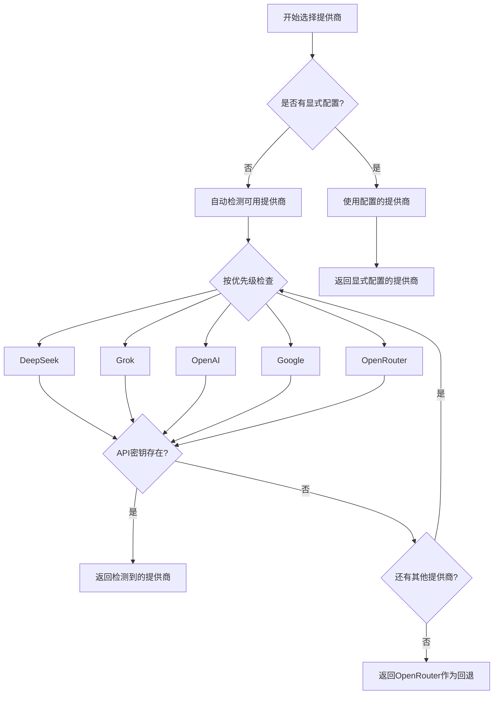
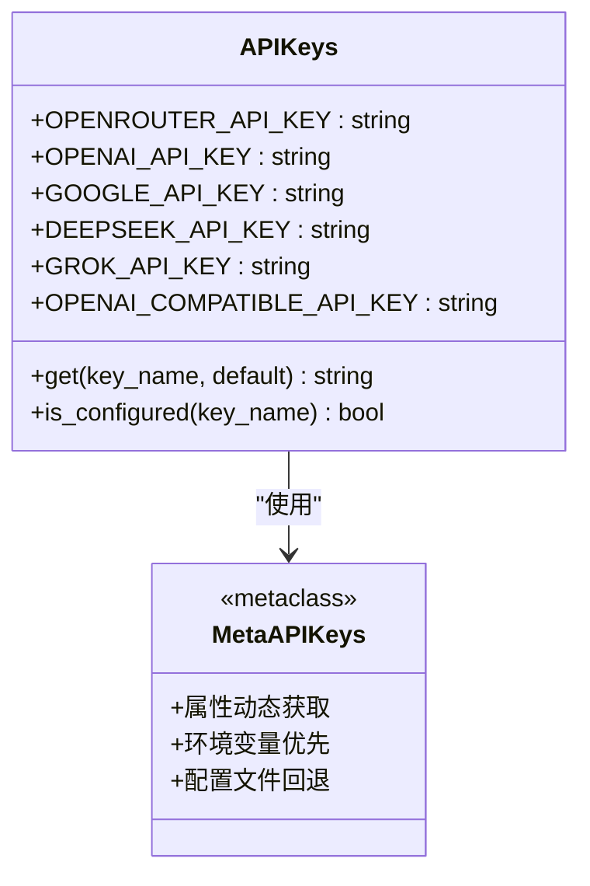
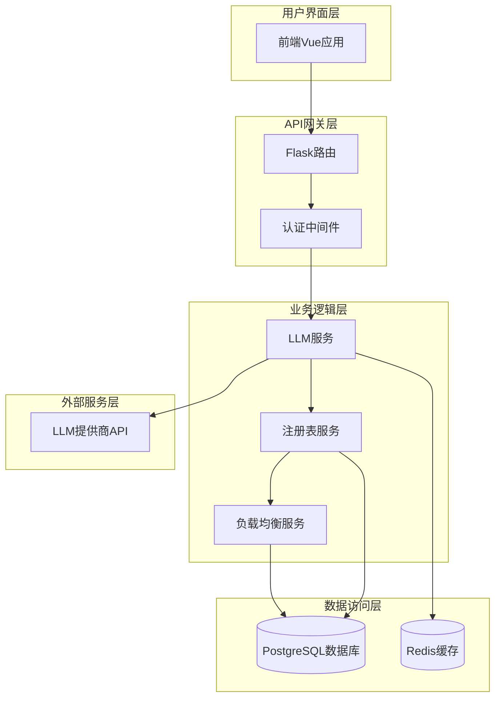
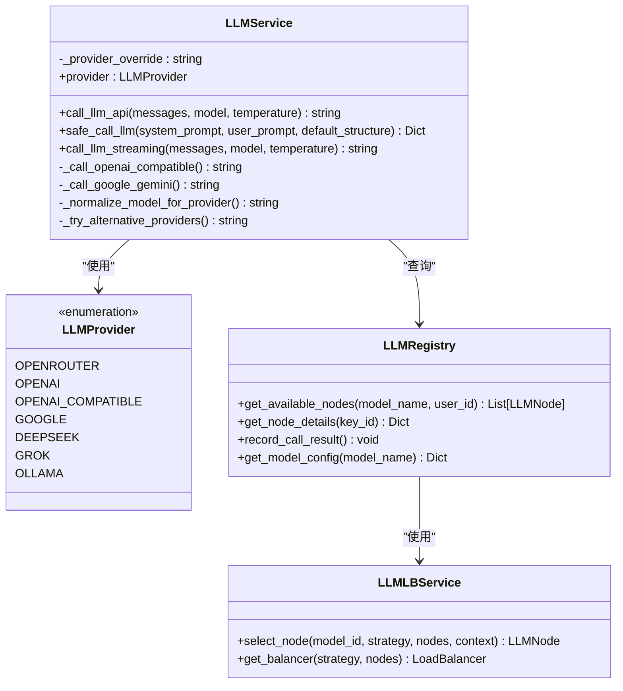
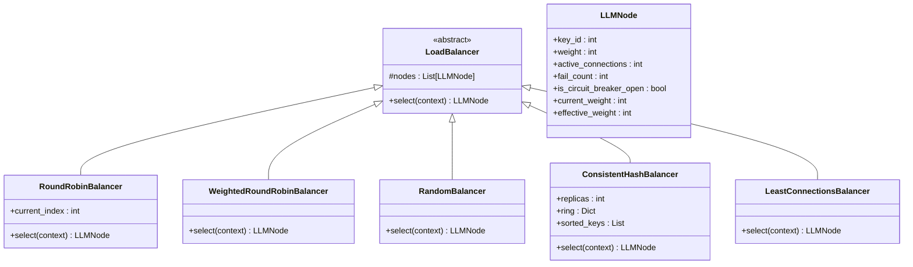
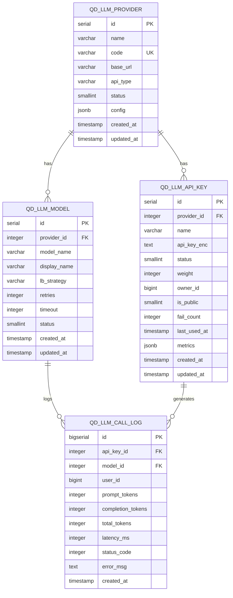
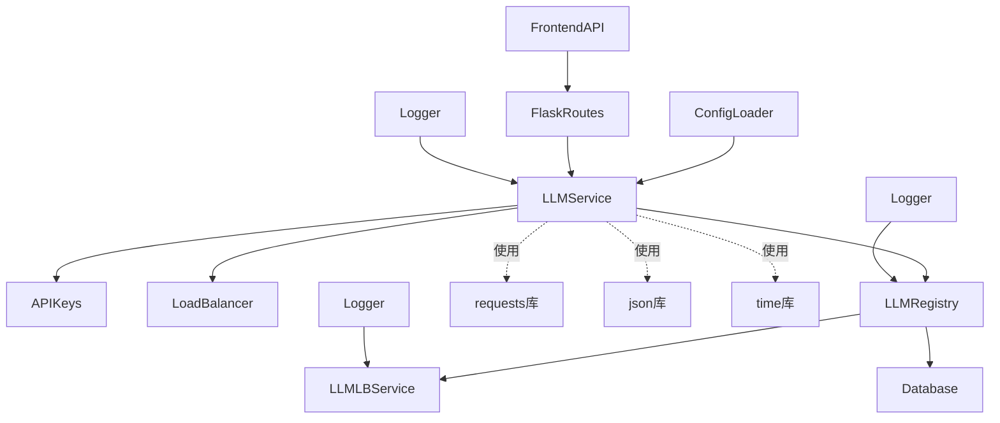
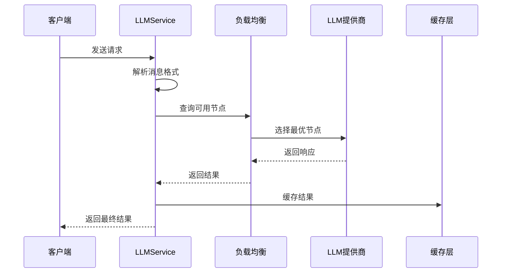
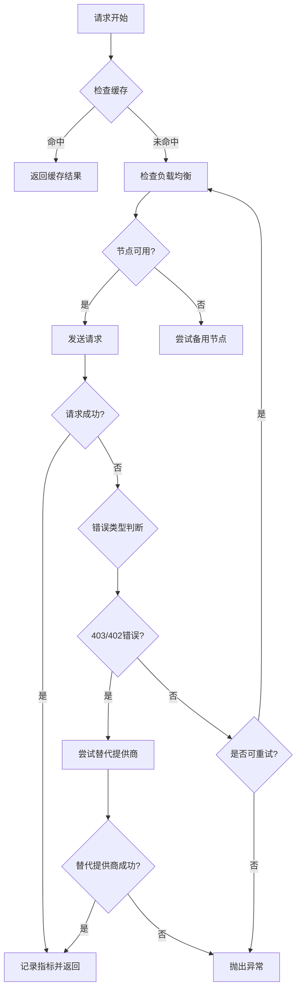

# LLM提供商集成

<cite>
**本文档引用的文件**
- [settings.py](file://backend_api_python/app/config/settings.py)
- [api_keys.py](file://backend_api_python/app/config/api_keys.py)
- [config_loader.py](file://backend_api_python/app/utils/config_loader.py)
- [llm.py](file://backend_api_python/app/services/llm.py)
- [llm_registry.py](file://backend_api_python/app/services/llm_registry.py)
- [llm_lb.py](file://backend_api_python/app/services/llm_lb.py)
- [llm.py](file://backend_api_python/app/routes/llm.py)
- [llm.js](file://frontend/src/api/llm.js)
- [aiModels.js](file://frontend/src/config/aiModels.js)
- [llm_lb_setup.sql](file://backend_api_python/migrations/llm_lb_setup.sql)
- [README.md](file://README.md)
</cite>

## 目录
1. [简介](#简介)
2. [项目结构](#项目结构)
3. [核心组件](#核心组件)
4. [架构概览](#架构概览)
5. [详细组件分析](#详细组件分析)
6. [依赖关系分析](#依赖关系分析)
7. [性能考虑](#性能考虑)
8. [故障排除指南](#故障排除指南)
9. [结论](#结论)
10. [附录](#附录)

## 简介

QuantDinger的LLM提供商集成为AI分析和策略生成提供了强大的多供应商支持。该系统支持OpenRouter、OpenAI、Google Gemini、DeepSeek、Grok和Ollama等主流LLM提供商，通过智能选择逻辑、自动检测机制和负载均衡实现高可用性和高性能。

该集成系统的核心目标是为量化交易工作流提供可靠的AI分析能力，支持从市场研究到策略开发的完整流程。系统采用模块化设计，支持动态配置、故障转移和性能优化。

## 项目结构

LLM提供商集成主要分布在以下目录结构中：



**图表来源**
- [settings.py:1-99](file://backend_api_python/app/config/settings.py#L1-L99)
- [api_keys.py:1-164](file://backend_api_python/app/config/api_keys.py#L1-L164)
- [config_loader.py:1-252](file://backend_api_python/app/utils/config_loader.py#L1-L252)
- [llm.py:1-813](file://backend_api_python/app/services/llm.py#L1-L813)
- [llm_registry.py:1-169](file://backend_api_python/app/services/llm_registry.py#L1-L169)
- [llm_lb.py:1-169](file://backend_api_python/app/services/llm_lb.py#L1-L169)
- [llm.py:1-723](file://backend_api_python/app/routes/llm.py#L1-L723)
- [llm.js:1-90](file://frontend/src/api/llm.js#L1-L90)
- [aiModels.js:1-42](file://frontend/src/config/aiModels.js#L1-L42)
- [llm_lb_setup.sql:1-67](file://backend_api_python/migrations/llm_lb_setup.sql#L1-L67)

**章节来源**
- [settings.py:1-99](file://backend_api_python/app/config/settings.py#L1-L99)
- [api_keys.py:1-164](file://backend_api_python/app/config/api_keys.py#L1-L164)
- [config_loader.py:1-252](file://backend_api_python/app/utils/config_loader.py#L1-L252)

## 核心组件

### 支持的LLM提供商

系统支持以下LLM提供商，每个都具有特定的配置要求和特性：

| 提供商 | 类型 | 默认模型 | 基础URL | 特殊配置 |
|--------|------|----------|---------|----------|
| OpenRouter | OpenAI兼容 | openai/gpt-4o | https://openrouter.ai/api/v1 | HTTP-Referer头 |
| OpenAI | 直接API | gpt-4o | https://api.openai.com/v1 | 标准OpenAI格式 |
| Google Gemini | Google API | gemini-1.5-flash | https://generativelanguage.googleapis.com/v1beta | Gemini特定格式 |
| DeepSeek | OpenAI兼容 | deepseek-chat | https://api.deepseek.com/v1 | 自定义模型名称 |
| Grok | OpenAI兼容 | grok-beta | https://api.x.ai/v1 | xAI专用格式 |
| Ollama | 本地部署 | qwen2.5:7b | http://localhost:11434/v1 | 本地API |

### 提供商选择逻辑



**图表来源**
- [llm.py:107-125](file://backend_api_python/app/services/llm.py#L107-L125)

### API密钥管理系统

系统采用统一的API密钥管理机制，支持环境变量和配置文件两种方式：



**图表来源**
- [api_keys.py:7-164](file://backend_api_python/app/config/api_keys.py#L7-L164)

**章节来源**
- [llm.py:22-70](file://backend_api_python/app/services/llm.py#L22-L70)
- [api_keys.py:64-121](file://backend_api_python/app/config/api_keys.py#L64-L121)

## 架构概览

LLM提供商集成采用分层架构设计，确保高内聚、低耦合和可扩展性：



**图表来源**
- [llm.py:73-126](file://backend_api_python/app/services/llm.py#L73-L126)
- [llm_registry.py:11-16](file://backend_api_python/app/services/llm_registry.py#L11-L16)
- [llm.py:1-10](file://backend_api_python/app/routes/llm.py#L1-L10)

## 详细组件分析

### LLM服务核心实现

LLM服务是整个集成系统的核心，负责提供商选择、API调用和错误处理：



**图表来源**
- [llm.py:73-800](file://backend_api_python/app/services/llm.py#L73-L800)
- [llm_registry.py:11-169](file://backend_api_python/app/services/llm_registry.py#L11-L169)
- [llm_lb.py:143-169](file://backend_api_python/app/services/llm_lb.py#L143-L169)

### 负载均衡系统

系统实现了多种负载均衡算法，支持高可用性和性能优化：



**图表来源**
- [llm_lb.py:24-169](file://backend_api_python/app/services/llm_lb.py#L24-L169)

### 数据库架构设计

系统使用PostgreSQL存储提供商、API密钥和模型配置信息：



**图表来源**
- [llm_lb_setup.sql:3-67](file://backend_api_python/migrations/llm_lb_setup.sql#L3-L67)

**章节来源**
- [llm.py:470-684](file://backend_api_python/app/services/llm.py#L470-L684)
- [llm_registry.py:17-169](file://backend_api_python/app/services/llm_registry.py#L17-L169)
- [llm_lb.py:1-169](file://backend_api_python/app/services/llm_lb.py#L1-L169)

## 依赖关系分析

### 组件间依赖关系



**图表来源**
- [llm.py:1-19](file://backend_api_python/app/services/llm.py#L1-L19)
- [llm_registry.py:1-9](file://backend_api_python/app/services/llm_registry.py#L1-L9)
- [llm_lb.py:1-5](file://backend_api_python/app/services/llm_lb.py#L1-L5)

### 外部依赖分析

系统对外部依赖的管理遵循最小化原则：

| 依赖库 | 版本 | 用途 | 替代方案 |
|--------|------|------|----------|
| requests | 最新稳定版 | HTTP请求 | aiohttp (异步) |
| flask | 最新稳定版 | Web框架 | FastAPI (性能更优) |
| psycopg2 | 最新稳定版 | PostgreSQL驱动 | asyncpg (异步) |
| redis | 最新稳定版 | 缓存和队列 | memory (开发环境) |
| python-jose | 最新稳定版 | JWT处理 | jwcrypto (更安全) |

**章节来源**
- [llm.py:6-16](file://backend_api_python/app/services/llm.py#L6-L16)
- [config_loader.py:1-18](file://backend_api_python/app/utils/config_loader.py#L1-L18)

## 性能考虑

### 请求处理流程优化



**图表来源**
- [llm.py:496-557](file://backend_api_python/app/services/llm.py#L496-L557)
- [llm_lb.py:164-169](file://backend_api_python/app/services/llm_lb.py#L164-L169)

### 性能优化策略

1. **连接池管理**: 使用持久连接减少握手开销
2. **请求超时控制**: 合理设置超时时间避免资源泄露
3. **并发处理**: 支持多线程和异步处理模式
4. **缓存策略**: 实现多级缓存减少重复请求
5. **负载均衡**: 基于权重的轮询算法优化资源分配

### 错误处理和重试机制

系统实现了多层次的错误处理和故障转移：



**图表来源**
- [llm.py:638-683](file://backend_api_python/app/services/llm.py#L638-L683)

**章节来源**
- [llm.py:685-722](file://backend_api_python/app/services/llm.py#L685-L722)

## 故障排除指南

### 常见问题诊断

| 问题类型 | 症状 | 可能原因 | 解决方案 |
|----------|------|----------|----------|
| API密钥错误 | 401/403状态码 | 密钥无效或过期 | 检查.env文件中的API密钥 |
| 模型不可用 | 404状态码 | 模型名称错误 | 验证模型名称格式 |
| 超时错误 | 408/504状态码 | 网络延迟或服务器繁忙 | 增加超时时间或重试次数 |
| 额度不足 | 402状态码 | 余额不足或配额用尽 | 充值或升级套餐 |
| 熔断器打开 | 连续失败导致服务降级 | 多次请求失败 | 检查提供商状态或等待恢复 |

### 调试工具和监控

系统提供了完整的监控和调试功能：

1. **调用统计**: 记录所有API调用的详细信息
2. **性能指标**: 监控响应时间和成功率
3. **错误日志**: 详细的错误信息和堆栈跟踪
4. **熔断器状态**: 实时监控服务健康状况

**章节来源**
- [llm.py:1156-1163](file://backend_api_python/app/services/llm.py#L1156-L1163)
- [llm.py:663-723](file://backend_api_python/app/routes/llm.py#L663-L723)

## 结论

QuantDinger的LLM提供商集成为量化交易工作流提供了强大而灵活的AI能力。通过多供应商支持、智能选择逻辑、负载均衡和故障转移机制，系统能够在保证高可用性的同时提供优秀的性能表现。

该集成系统的设计充分考虑了生产环境的需求，包括安全性、可扩展性和可维护性。通过模块化的架构设计和完善的监控机制，用户可以轻松地管理和优化AI分析服务。

未来的发展方向包括支持更多LLM提供商、实现更智能的模型选择算法、增强实时监控能力以及提供更丰富的配置选项。

## 附录

### 配置参考

#### 环境变量配置

```bash
# LLM提供商配置
LLM_PROVIDER=openrouter
OPENROUTER_API_KEY=your_openrouter_key
OPENAI_API_KEY=your_openai_key
GOOGLE_API_KEY=your_google_key
DEEPSEEK_API_KEY=your_deepseek_key
GROK_API_KEY=your_grok_key

# 自定义基础URL (可选)
OPENAI_BASE_URL=https://api.openai.com/v1
DEEPSEEK_BASE_URL=https://api.deepseek.com/v1
GROK_BASE_URL=https://api.x.ai/v1

# 模型配置
OPENROUTER_MODEL=openai/gpt-4o
OPENAI_MODEL=gpt-4o
GOOGLE_MODEL=gemini-1.5-flash
DEEPSEEK_MODEL=deepseek-chat
GROK_MODEL=grok-beta

# 超时和重试配置
LLM_TIMEOUT=120
LLM_RETRIES=3
```

#### 前端模型配置

前端支持统一的模型映射系统，使用OpenRouter风格的`provider/model`命名：

```javascript
// 前端模型映射示例
const MODEL_MAP = {
  'openai/gpt-4o': 'OpenAI: GPT-4o',
  'google/gemini-1.5-flash': 'Google: Gemini Flash',
  'deepseek/deepseek-chat': 'DeepSeek: Chat',
  'x-ai/grok-beta': 'xAI: Grok Beta'
};
```

### 最佳实践

1. **提供商选择**: 根据使用场景选择合适的提供商
2. **密钥管理**: 使用环境变量存储敏感信息
3. **负载均衡**: 合理配置权重和超时参数
4. **监控告警**: 设置适当的监控和告警机制
5. **故障转移**: 配置多个提供商以提高可用性