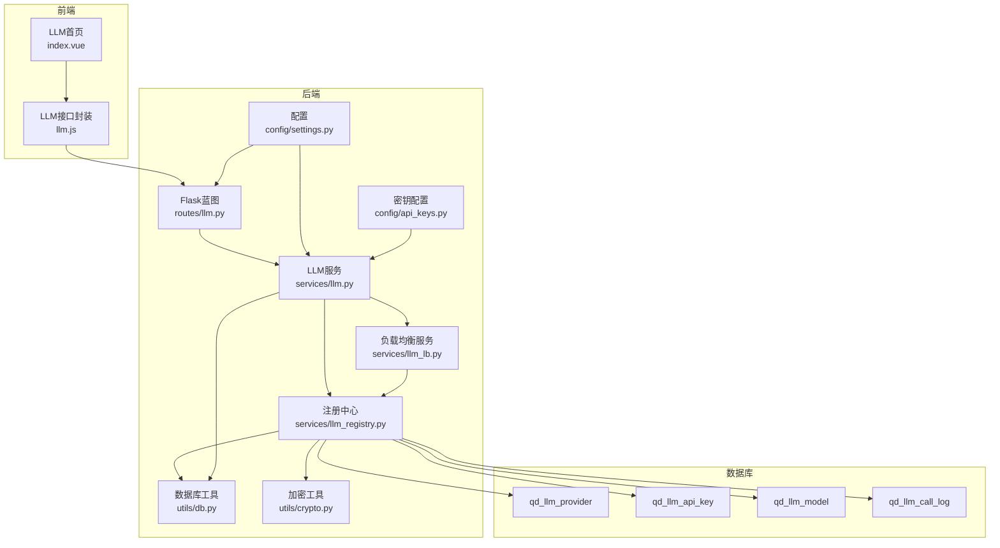
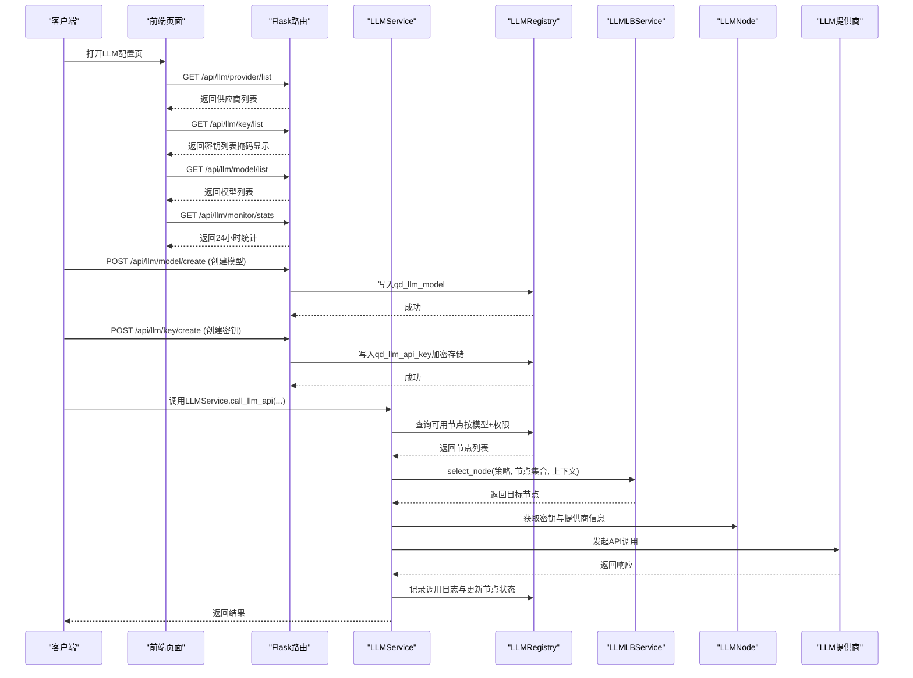
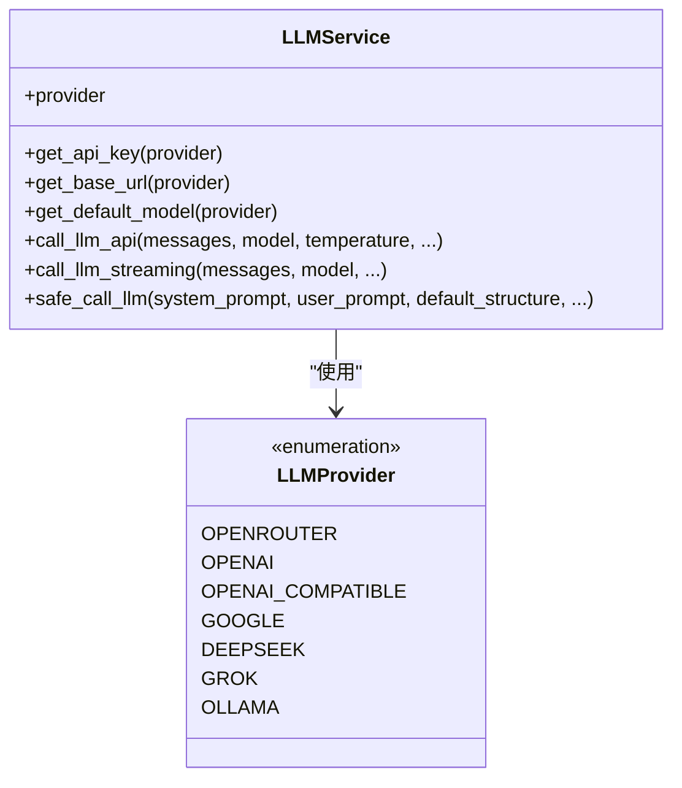
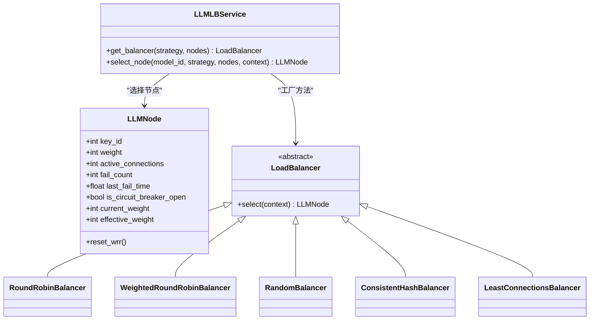
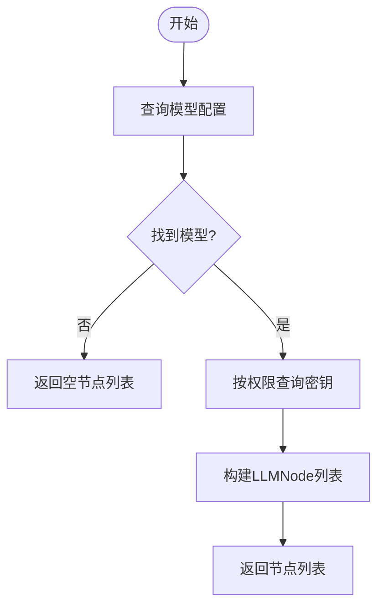
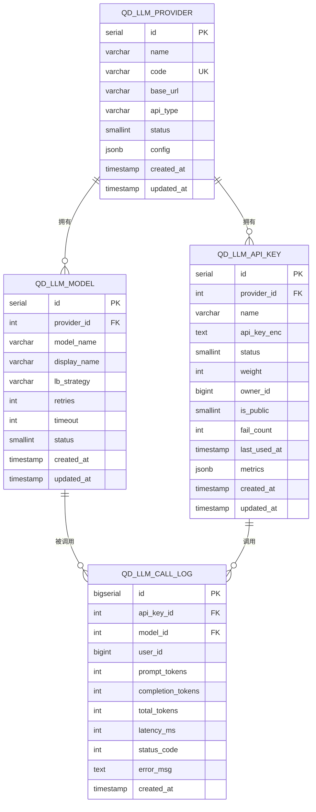
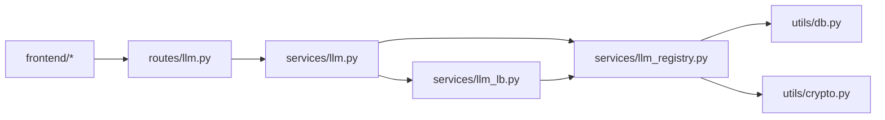

# LLM负载均衡系统

<cite>
**本文引用的文件列表**
- [llm.py](file://backend_api_python/app/routes/llm.py)
- [llm.py](file://backend_api_python/app/services/llm.py)
- [llm_lb.py](file://backend_api_python/app/services/llm_lb.py)
- [llm_registry.py](file://backend_api_python/app/services/llm_registry.py)
- [llm_lb_setup.sql](file://backend_api_python/migrations/llm_lb_setup.sql)
- [db.py](file://backend_api_python/app/utils/db.py)
- [crypto.py](file://backend_api_python/app/utils/crypto.py)
- [settings.py](file://backend_api_python/app/config/settings.py)
- [api_keys.py](file://backend_api_python/app/config/api_keys.py)
- [run.py](file://backend_api_python/run.py)
- [index.vue](file://frontend/src/views/llm/index.vue)
- [llm.js](file://frontend/src/api/llm.js)
- [LLM 负载均衡调用系统设计方案.md](file://docs/LLM 负载均衡调用系统设计方案.md)
</cite>

## 目录
1. [简介](#简介)
2. [项目结构](#项目结构)
3. [核心组件](#核心组件)
4. [架构总览](#架构总览)
5. [详细组件分析](#详细组件分析)
6. [依赖关系分析](#依赖关系分析)
7. [性能考量](#性能考量)
8. [故障排查指南](#故障排查指南)
9. [结论](#结论)
10. [附录](#附录)

## 简介
本文件面向QuantDinger项目的LLM负载均衡系统，系统通过多供应商、多密钥、多模型的组合，实现对不同LLM提供商（如OpenAI、OpenRouter、Google Gemini、DeepSeek、Grok、Ollama）的统一接入与智能调度。系统提供多种负载均衡算法（加权轮询、随机、一致性哈希、最少连接、轮询），内置熔断与健康检查机制，并通过数据库记录调用日志与性能指标，支持前端可视化配置与监控。

## 项目结构
系统采用前后端分离架构：
- 后端：Flask蓝图路由 + 服务层（LLMService、LLMLBService、LLMRegistry）
- 数据层：PostgreSQL数据库，包含供应商、密钥、模型、调用日志四张表
- 前端：Vue组件负责LLM配置与监控页面的展示与交互

图表来源
- [llm.py:1-723](file://backend_api_python/app/routes/llm.py#L1-L723)
- [llm.py:1-813](file://backend_api_python/app/services/llm.py#L1-L813)
- [llm_lb.py:1-169](file://backend_api_python/app/services/llm_lb.py#L1-L169)
- [llm_registry.py:1-169](file://backend_api_python/app/services/llm_registry.py#L1-L169)
- [db.py:1-66](file://backend_api_python/app/utils/db.py#L1-L66)
- [crypto.py:1-78](file://backend_api_python/app/utils/crypto.py#L1-L78)
- [settings.py:1-99](file://backend_api_python/app/config/settings.py#L1-L99)
- [api_keys.py:1-164](file://backend_api_python/app/config/api_keys.py#L1-L164)
- [llm_lb_setup.sql:1-67](file://backend_api_python/migrations/llm_lb_setup.sql#L1-L67)

章节来源
- [llm.py:1-723](file://backend_api_python/app/routes/llm.py#L1-L723)
- [llm.py:1-813](file://backend_api_python/app/services/llm.py#L1-L813)
- [llm_lb.py:1-169](file://backend_api_python/app/services/llm_lb.py#L1-L169)
- [llm_registry.py:1-169](file://backend_api_python/app/services/llm_registry.py#L1-L169)
- [llm_lb_setup.sql:1-67](file://backend_api_python/migrations/llm_lb_setup.sql#L1-L67)
- [db.py:1-66](file://backend_api_python/app/utils/db.py#L1-L66)
- [crypto.py:1-78](file://backend_api_python/app/utils/crypto.py#L1-L78)
- [settings.py:1-99](file://backend_api_python/app/config/settings.py#L1-L99)
- [api_keys.py:1-164](file://backend_api_python/app/config/api_keys.py#L1-L164)
- [run.py:1-134](file://backend_api_python/run.py#L1-L134)
- [index.vue:1-58](file://frontend/src/views/llm/index.vue#L1-L58)
- [llm.js:1-90](file://frontend/src/api/llm.js#L1-L90)

## 核心组件
- 路由层（Flask蓝图）：提供供应商、密钥、模型的增删改查与监控统计接口
- 服务层（LLMService）：统一LLM调用入口，支持多供应商、多模型、多密钥、多策略
- 负载均衡（LLMLBService + LoadBalancer家族）：提供多种调度算法与节点状态管理
- 注册中心（LLMRegistry）：负责节点发现、密钥解密、调用结果记录与熔断控制
- 数据层：PostgreSQL表结构与索引，支持高并发查询与统计
- 工具层：数据库连接、加密解密、配置加载
- 前端：LLM配置与监控页面，对接后端REST接口

章节来源
- [llm.py:1-723](file://backend_api_python/app/routes/llm.py#L1-L723)
- [llm.py:1-813](file://backend_api_python/app/services/llm.py#L1-L813)
- [llm_lb.py:1-169](file://backend_api_python/app/services/llm_lb.py#L1-L169)
- [llm_registry.py:1-169](file://backend_api_python/app/services/llm_registry.py#L1-L169)
- [llm_lb_setup.sql:1-67](file://backend_api_python/migrations/llm_lb_setup.sql#L1-L67)
- [db.py:1-66](file://backend_api_python/app/utils/db.py#L1-L66)
- [crypto.py:1-78](file://backend_api_python/app/utils/crypto.py#L1-L78)
- [settings.py:1-99](file://backend_api_python/app/config/settings.py#L1-L99)
- [api_keys.py:1-164](file://backend_api_python/app/config/api_keys.py#L1-L164)
- [index.vue:1-58](file://frontend/src/views/llm/index.vue#L1-L58)
- [llm.js:1-90](file://frontend/src/api/llm.js#L1-L90)

## 架构总览
系统以“模型-密钥-节点”三层抽象组织负载均衡：
- 模型层：定义负载策略、重试次数、超时等配置
- 密钥层：按模型维度聚合可用密钥，支持权重、权限与熔断
- 节点层：抽象为LLMNode，承载权重、活跃连接数、失败计数、熔断状态等

图表来源
- [llm.py:1-723](file://backend_api_python/app/routes/llm.py#L1-L723)
- [llm.py:470-751](file://backend_api_python/app/services/llm.py#L470-L751)
- [llm_lb.py:143-169](file://backend_api_python/app/services/llm_lb.py#L143-L169)
- [llm_registry.py:17-169](file://backend_api_python/app/services/llm_registry.py#L17-L169)

## 详细组件分析

### 路由层（Flask蓝图）
- 提供供应商、密钥、模型的增删改查接口，以及监控统计接口
- 支持管理员与普通用户的权限区分（密钥列表按权限过滤）
- 接口返回统一格式，便于前端处理

章节来源
- [llm.py:13-723](file://backend_api_python/app/routes/llm.py#L13-L723)

### 服务层（LLMService）
- 多供应商支持：OpenRouter、OpenAI、Google Gemini、DeepSeek、Grok、Ollama
- 智能模型解析：支持OpenRouter风格的“前缀/模型名”格式，自动映射到对应提供商
- 负载均衡集成：当模型配置存在LB策略时，优先走注册中心与负载均衡服务
- 错误处理与回退：403/402等错误可自动切换备用提供商；支持备用模型与重试
- 流式输出：支持SSE流式响应，逐步拼接内容

图表来源
- [llm.py:22-181](file://backend_api_python/app/services/llm.py#L22-L181)

章节来源
- [llm.py:1-813](file://backend_api_python/app/services/llm.py#L1-L813)

### 负载均衡服务（LLMLBService + LoadBalancer家族）
- 节点抽象：LLMNode包含权重、活跃连接数、失败计数、熔断状态、平滑权重等
- 策略实现：
  - 加权轮询（Smooth WRR）：Nginx风格，按有效权重累加与回扣
  - 轮询：简单顺序轮转
  - 随机：带权重的加权随机
  - 一致性哈希：基于上下文键（如user_id）进行哈希，保证同用户相对稳定
  - 最少连接：选择活跃连接数最小的节点
- 线程安全：使用锁保护节点选择过程

图表来源
- [llm_lb.py:7-169](file://backend_api_python/app/services/llm_lb.py#L7-L169)

章节来源
- [llm_lb.py:1-169](file://backend_api_python/app/services/llm_lb.py#L1-L169)

### 注册中心（LLMRegistry）
- 节点发现：按模型名与用户权限查询可用密钥，构建LLMNode列表
- 节点详情：解密密钥与合并提供商信息
- 调用记录：插入调用日志，更新密钥失败计数与熔断状态
- 配置查询：按模型名查询LB策略、重试次数、超时等

图表来源
- [llm_registry.py:18-68](file://backend_api_python/app/services/llm_registry.py#L18-L68)

章节来源
- [llm_registry.py:1-169](file://backend_api_python/app/services/llm_registry.py#L1-L169)

### 数据层（PostgreSQL）
- 供应商表：供应商基础信息与状态
- 密钥表：加密存储的API Key、权重、权限、失败计数、熔断状态
- 模型表：模型名、LB策略、重试次数、超时、状态
- 调用日志表：记录每次调用的耗时、状态码、错误信息

图表来源
- [llm_lb_setup.sql:1-67](file://backend_api_python/migrations/llm_lb_setup.sql#L1-L67)

章节来源
- [llm_lb_setup.sql:1-67](file://backend_api_python/migrations/llm_lb_setup.sql#L1-L67)

### 工具层
- 数据库连接：统一PostgreSQL连接池与事务管理
- 加密解密：基于PBKDF2派生密钥，AES-256-GCM加密存储密钥
- 配置加载：支持.env与附加配置文件，动态读取LLM提供商与模型配置

章节来源
- [db.py:1-66](file://backend_api_python/app/utils/db.py#L1-L66)
- [crypto.py:1-78](file://backend_api_python/app/utils/crypto.py#L1-L78)
- [settings.py:1-99](file://backend_api_python/app/config/settings.py#L1-L99)
- [api_keys.py:1-164](file://backend_api_python/app/config/api_keys.py#L1-L164)

### 前端集成
- 页面：LLM首页包含供应商、密钥、模型、统计四个标签页
- 接口：封装了供应商、密钥、模型的增删改查与统计接口
- 权限：管理员可见全部密钥，普通用户仅见公开或本人密钥

章节来源
- [index.vue:1-58](file://frontend/src/views/llm/index.vue#L1-L58)
- [llm.js:1-90](file://frontend/src/api/llm.js#L1-L90)

## 依赖关系分析
- 路由层依赖服务层与工具层，负责对外暴露REST接口
- 服务层依赖注册中心与负载均衡服务，实现调度与容错
- 注册中心依赖数据库与加密工具，负责数据持久化与安全
- 负载均衡服务独立于业务逻辑，仅依赖节点抽象
- 前端通过API封装与后端交互，不直接访问数据库

图表来源
- [llm.py:1-723](file://backend_api_python/app/routes/llm.py#L1-L723)
- [llm.py:1-813](file://backend_api_python/app/services/llm.py#L1-L813)
- [llm_lb.py:1-169](file://backend_api_python/app/services/llm_lb.py#L1-L169)
- [llm_registry.py:1-169](file://backend_api_python/app/services/llm_registry.py#L1-L169)
- [db.py:1-66](file://backend_api_python/app/utils/db.py#L1-L66)
- [crypto.py:1-78](file://backend_api_python/app/utils/crypto.py#L1-L78)

章节来源
- [llm.py:1-723](file://backend_api_python/app/routes/llm.py#L1-L723)
- [llm.py:1-813](file://backend_api_python/app/services/llm.py#L1-L813)
- [llm_lb.py:1-169](file://backend_api_python/app/services/llm_lb.py#L1-L169)
- [llm_registry.py:1-169](file://backend_api_python/app/services/llm_registry.py#L1-L169)
- [db.py:1-66](file://backend_api_python/app/utils/db.py#L1-L66)
- [crypto.py:1-78](file://backend_api_python/app/utils/crypto.py#L1-L78)

## 性能考量
- 负载均衡策略选择
  - 加权轮询：适合资源差异明显的密钥权重场景
  - 最少连接：适合长连接或流式场景，降低热点节点压力
  - 一致性哈希：适合需要会话粘性的场景（如用户维度）
  - 随机：简单高效，适合均质资源
  - 轮询：最简单，适合均质资源
- 超时与重试
  - 模型级超时与重试次数可配置，避免单次调用阻塞影响整体吞吐
- 熔断与健康检查
  - 连续失败达到阈值自动熔断，防止雪崩效应
  - 熔断恢复：等待一段时间后尝试一次成功即恢复
- 数据库索引
  - 为密钥状态、模型外键、调用日志时间等建立索引，提升查询效率
- 线程安全
  - 负载均衡选择过程使用锁，避免并发竞争导致的调度偏差

章节来源
- [llm.py:470-751](file://backend_api_python/app/services/llm.py#L470-L751)
- [llm_lb.py:1-169](file://backend_api_python/app/services/llm_lb.py#L1-L169)
- [llm_registry.py:112-169](file://backend_api_python/app/services/llm_registry.py#L112-L169)
- [llm_lb_setup.sql:62-67](file://backend_api_python/migrations/llm_lb_setup.sql#L62-L67)

## 故障排查指南
- API密钥问题
  - 403/402常见于密钥无效、余额不足或无模型权限，需检查密钥配置与提供商后台
  - 系统会自动尝试备用提供商，若仍失败，检查其他提供商密钥
- 熔断状态
  - 密钥连续失败达到阈值会被熔断，查看密钥状态是否为“熔断”
  - 熔断恢复：等待熔断时间后自动尝试一次成功即恢复
- 调用日志与统计
  - 通过监控接口查看24小时内的调用次数、平均耗时、成功率
  - 结合错误信息定位具体失败原因
- 权限与可见性
  - 普通用户只能看到公开密钥或自己的密钥
  - 管理员可查看全部密钥与统计

章节来源
- [llm.py:638-722](file://backend_api_python/app/services/llm.py#L638-L722)
- [llm_registry.py:112-169](file://backend_api_python/app/services/llm_registry.py#L112-L169)
- [llm.py:663-723](file://backend_api_python/app/routes/llm.py#L663-L723)

## 结论
该LLM负载均衡系统通过清晰的三层抽象与多样化的调度策略，实现了对多供应商、多密钥、多模型的统一调度与容错。结合熔断、健康检查与调用统计，系统具备良好的稳定性与可观测性。配合前端配置与监控界面，能够满足生产环境下的运维与调优需求。

## 附录
- 设计方案参考：系统设计方案文档明确了数据库设计、后端实现要点与前端功能规划
- 启动流程：应用入口负责加载环境变量、代理配置与应用实例创建

章节来源
- [LLM 负载均衡调用系统设计方案.md:1-91](file://docs/LLM 负载均衡调用系统设计方案.md#L1-L91)
- [run.py:1-134](file://backend_api_python/run.py#L1-L134)