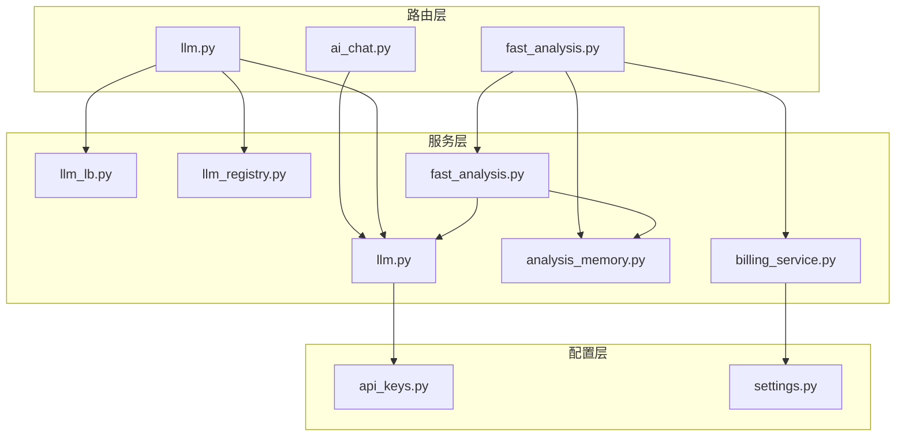
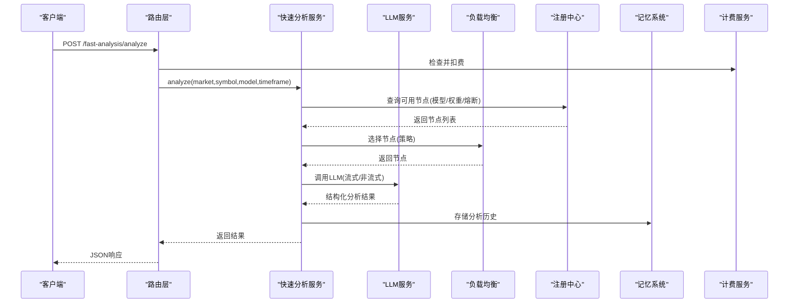
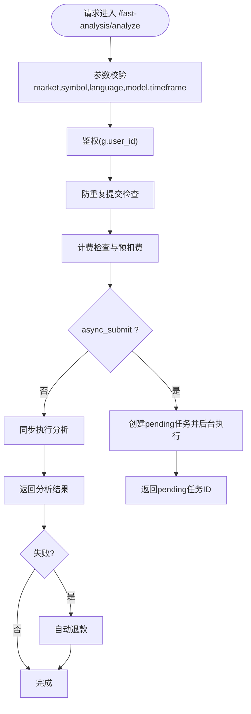
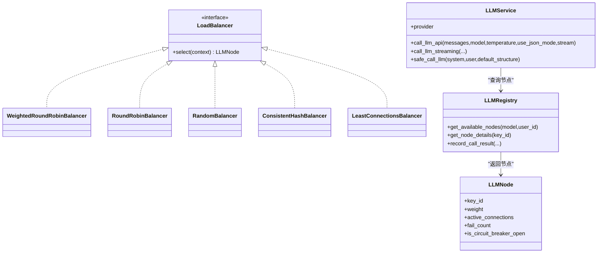
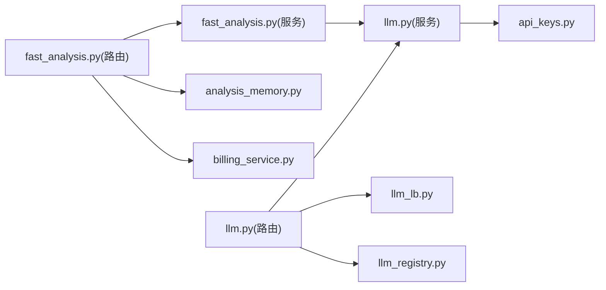

# AI分析API

<cite>
**本文档引用的文件**
- [ai_chat.py](file://backend_api_python/app/route/ai_chat.py)
- [fast_analysis.py](file://backend_api_python/app/route/fast_analysis.py)
- [llm.py](file://backend_api_python/app/route/llm.py)
- [llm.py](file://backend_api_python/app/services/llm.py)
- [llm_lb.py](file://backend_api_python/app/services/llm_lb.py)
- [llm_registry.py](file://backend_api_python/app/services/llm_registry.py)
- [fast_analysis.py](file://backend_api_python/app/services/fast_analysis.py)
- [analysis_memory.py](file://backend_api_python/app/services/analysis_memory.py)
- [api_keys.py](file://backend_api_python/app/config/api_keys.py)
- [settings.py](file://backend_api_python/app/config/settings.py)
- [billing_service.py](file://backend_api_python/app/services/billing_service.py)
- [FRONTEND_FAST_ANALYSIS.md](file://docs/FRONTEND_FAST_ANALYSIS.md)
- [LLM 负载均衡调用系统设计方案.md](file://docs/LLM 负载均衡调用系统设计方案.md)
- [LLM_STREAMING_USAGE.md](file://backend_api_python/LLM_STREAMING_USAGE.md)
</cite>

## 目录
1. [简介](#简介)
2. [项目结构](#项目结构)
3. [核心组件](#核心组件)
4. [架构总览](#架构总览)
5. [详细组件分析](#详细组件分析)
6. [依赖关系分析](#依赖关系分析)
7. [性能考虑](#性能考虑)
8. [故障排除指南](#故障排除指南)
9. [结论](#结论)
10. [附录](#附录)

## 简介
本文件为QuantDinger平台的AI分析API详细文档，覆盖以下能力：
- AI聊天接口（兼容层）
- 快速分析接口（高并发、结构化输出）
- LLM多提供商集成与负载均衡
- AI代码生成、策略建议与市场预测能力
- 任务创建、进度查询与结果获取机制
- 负载均衡、错误处理与性能监控
- 使用限制、计费模式与最佳实践

## 项目结构
后端采用Flask微服务架构，AI分析相关路由集中在`routes`目录，核心业务逻辑位于`services`目录，配置与密钥管理位于`config`目录。

**图表来源**
- [ai_chat.py:1-131](file://backend_api_python/app/route/ai_chat.py#L1-L131)
- [fast_analysis.py:1-800](file://backend_api_python/app/route/fast_analysis.py#L1-L800)
- [llm.py:1-723](file://backend_api_python/app/route/llm.py#L1-L723)
- [llm.py:1-800](file://backend_api_python/app/services/llm.py#L1-L800)
- [llm_lb.py:1-169](file://backend_api_python/app/services/llm_lb.py#L1-L169)
- [llm_registry.py:1-169](file://backend_api_python/app/services/llm_registry.py#L1-L169)
- [fast_analysis.py:1-800](file://backend_api_python/app/services/fast_analysis.py#L1-L800)
- [analysis_memory.py:1-800](file://backend_api_python/app/services/analysis_memory.py#L1-L800)
- [billing_service.py:1-747](file://backend_api_python/app/services/billing_service.py#L1-L747)
- [api_keys.py:1-164](file://backend_api_python/app/config/api_keys.py#L1-L164)
- [settings.py:1-99](file://backend_api_python/app/config/settings.py#L1-L99)

**章节来源**
- [ai_chat.py:1-131](file://backend_api_python/app/route/ai_chat.py#L1-L131)
- [fast_analysis.py:1-800](file://backend_api_python/app/route/fast_analysis.py#L1-L800)
- [llm.py:1-723](file://backend_api_python/app/route/llm.py#L1-L723)

## 核心组件
- 路由层：提供REST API入口，负责鉴权、参数校验与错误响应。
- LLM服务：统一多提供商调用、模型选择、流式/非流式输出、负载均衡与熔断。
- 快速分析服务：统一数据采集、单次LLM调用、结构化输出与历史记忆。
- 计费服务：统一积分扣费、余额查询、会员权益与消费记录。
- 记忆系统：分析历史存储、相似模式检索与回测验证。

**章节来源**
- [llm.py:1-800](file://backend_api_python/app/services/llm.py#L1-L800)
- [fast_analysis.py:1-800](file://backend_api_python/app/services/fast_analysis.py#L1-L800)
- [analysis_memory.py:1-800](file://backend_api_python/app/services/analysis_memory.py#L1-L800)
- [billing_service.py:1-747](file://backend_api_python/app/services/billing_service.py#L1-L747)

## 架构总览
AI分析API采用“路由层-服务层-配置层”的分层设计，LLM服务作为核心枢纽，贯穿多提供商、多模型与多策略调用链。

**图表来源**
- [fast_analysis.py:113-346](file://backend_api_python/app/route/fast_analysis.py#L113-L346)
- [fast_analysis.py:186-761](file://backend_api_python/app/services/fast_analysis.py#L186-L761)
- [llm.py:470-727](file://backend_api_python/app/services/llm.py#L470-L727)
- [llm_lb.py:143-169](file://backend_api_python/app/services/llm_lb.py#L143-L169)
- [llm_registry.py:11-169](file://backend_api_python/app/services/llm_registry.py#L11-L169)
- [analysis_memory.py:175-235](file://backend_api_python/app/services/analysis_memory.py#L175-L235)
- [billing_service.py:450-515](file://backend_api_python/app/services/billing_service.py#L450-L515)

## 详细组件分析

### AI聊天接口（兼容层）
- 路由：提供最小兼容层，返回占位回复，便于前端兼容旧版。
- 用途：在本地单机模式下避免前端调用失败，后续可接入真实聊天能力。

**章节来源**
- [ai_chat.py:15-131](file://backend_api_python/app/route/ai_chat.py#L15-L131)

### 快速分析接口
- 功能：对任意标的进行高性能分析，返回结构化决策与交易计划。
- 特性：
  - 支持异步提交与后台执行，避免阻塞。
  - 防重复提交保护（in-flight锁）。
  - 计费与退款机制（预扣费、失败自动退款）。
  - 历史查询与删除、反馈收集。
- 输出：包含决策、置信度、摘要、技术分析、基本面分析、情绪分析、关键风险、交易计划（入场/止损/止盈）、时间框架、评分等。

**图表来源**
- [fast_analysis.py:113-346](file://backend_api_python/app/route/fast_analysis.py#L113-L346)
- [fast_analysis.py:41-89](file://backend_api_python/app/route/fast_analysis.py#L41-L89)
- [billing_service.py:450-515](file://backend_api_python/app/services/billing_service.py#L450-L515)

**章节来源**
- [fast_analysis.py:113-800](file://backend_api_python/app/route/fast_analysis.py#L113-L800)
- [analysis_memory.py:396-511](file://backend_api_python/app/services/analysis_memory.py#L396-L511)
- [FRONTEND_FAST_ANALYSIS.md:1-63](file://docs/FRONTEND_FAST_ANALYSIS.md#L1-L63)

### LLM多提供商集成与负载均衡
- 支持提供商：OpenRouter、OpenAI、Google Gemini、DeepSeek、Grok、OpenAI-Compatible、Ollama。
- 模型选择策略：
  - 显式指定：支持OpenRouter风格的“提供商/模型名”格式。
  - 自动检测：根据API Key存在情况与优先级自动选择。
  - 配置优先：可通过环境变量或配置文件覆盖默认提供商。
- 负载均衡策略：轮询、加权轮询、随机、一致性哈希、最少连接。
- 熔断与健康：连续失败触发熔断，自动恢复；记录调用日志与成功率。
- 流式/非流式：统一接口支持流式输出，增强用户体验与长文本生成。

**图表来源**
- [llm.py:73-796](file://backend_api_python/app/services/llm.py#L73-L796)
- [llm_lb.py:24-169](file://backend_api_python/app/services/llm_lb.py#L24-L169)
- [llm_registry.py:11-169](file://backend_api_python/app/services/llm_registry.py#L11-L169)

**章节来源**
- [llm.py:22-796](file://backend_api_python/app/services/llm.py#L22-L796)
- [llm_lb.py:1-169](file://backend_api_python/app/services/llm_lb.py#L1-L169)
- [llm_registry.py:1-169](file://backend_api_python/app/services/llm_registry.py#L1-L169)
- [LLM 负载均衡调用系统设计方案.md:1-91](file://docs/LLM 负载均衡调用系统设计方案.md#L1-L91)
- [LLM_STREAMING_USAGE.md:1-260](file://backend_api_python/LLM_STREAMING_USAGE.md#L1-L260)

### AI代码生成、策略建议与市场预测
- 代码生成：通过LLM服务调用，支持流式输出，适配长文本生成场景。
- 策略建议：快速分析服务整合技术面、宏观、新闻与预测市场数据，输出结构化交易建议。
- 市场预测：利用预测市场事件概率作为情绪与预期指标，辅助决策。

**章节来源**
- [fast_analysis.py:486-761](file://backend_api_python/app/services/fast_analysis.py#L486-L761)
- [llm.py:729-751](file://backend_api_python/app/services/llm.py#L729-L751)

### 计费与使用限制
- 计费开关与功能单价：通过环境变量配置，支持AI分析、AI代码生成、深度分析等功能。
- 余额检查与预扣费：调用前检查余额，失败自动退款。
- 会员权益：支持月卡、年卡、终身卡，含积分奖励与周期性发放。

**章节来源**
- [billing_service.py:24-97](file://backend_api_python/app/services/billing_service.py#L24-L97)
- [billing_service.py:450-515](file://backend_api_python/app/services/billing_service.py#L450-L515)
- [billing_service.py:202-335](file://backend_api_python/app/services/billing_service.py#L202-L335)

## 依赖关系分析
- 路由层依赖服务层与工具层（鉴权、日志、数据库）。
- 服务层之间耦合度低，通过接口与配置解耦。
- LLM服务依赖配置层（API Key、提供商基地址、模型默认值）。
- 快速分析服务依赖LLM服务与记忆系统，形成闭环。

**图表来源**
- [fast_analysis.py:1-800](file://backend_api_python/app/route/fast_analysis.py#L1-L800)
- [fast_analysis.py:1-800](file://backend_api_python/app/services/fast_analysis.py#L1-L800)
- [analysis_memory.py:1-800](file://backend_api_python/app/services/analysis_memory.py#L1-L800)
- [billing_service.py:1-747](file://backend_api_python/app/services/billing_service.py#L1-L747)
- [llm.py:1-800](file://backend_api_python/app/services/llm.py#L1-L800)
- [llm_lb.py:1-169](file://backend_api_python/app/services/llm_lb.py#L1-L169)
- [llm_registry.py:1-169](file://backend_api_python/app/services/llm_registry.py#L1-L169)
- [api_keys.py:1-164](file://backend_api_python/app/config/api_keys.py#L1-L164)

**章节来源**
- [fast_analysis.py:1-800](file://backend_api_python/app/route/fast_analysis.py#L1-L800)
- [llm.py:1-723](file://backend_api_python/app/route/llm.py#L1-L723)

## 性能考虑
- 负载均衡策略：根据场景选择加权轮询、最少连接或一致性哈希，提升稳定性与可预测性。
- 流式输出：降低首字延迟，改善用户体验；对长文本生成尤为友好。
- 防重复提交：通过in-flight锁避免重复扣费与资源浪费。
- 超时与重试：模型配置支持超时与重试，提升鲁棒性。
- 前端对接：遵循接口字段约定，避免错误绑定导致的UI问题。

**章节来源**
- [llm_lb.py:143-169](file://backend_api_python/app/services/llm_lb.py#L143-L169)
- [LLM_STREAMING_USAGE.md:1-260](file://backend_api_python/LLM_STREAMING_USAGE.md#L1-L260)
- [fast_analysis.py:95-111](file://backend_api_python/app/route/fast_analysis.py#L95-L111)
- [FRONTEND_FAST_ANALYSIS.md:1-63](file://docs/FRONTEND_FAST_ANALYSIS.md#L1-L63)

## 故障排除指南
- API Key配置错误：检查对应提供商的环境变量或配置文件，确认Key有效且账户有权限。
- 403/402错误：通常表示API Key无效、余额不足或无模型访问权限，需在提供商平台检查。
- 熔断与失败：注册中心会记录失败次数并触发熔断，等待自动恢复或修复后重试。
- 计费失败：检查计费开关与余额，失败时自动退款，确保不影响后续调用。
- 前端显示异常：遵循字段约定，确保止损/止盈与决策方向一致，避免几何关系错误。

**章节来源**
- [llm.py:638-683](file://backend_api_python/app/services/llm.py#L638-L683)
- [llm_registry.py:112-169](file://backend_api_python/app/services/llm_registry.py#L112-L169)
- [billing_service.py:450-515](file://backend_api_python/app/services/billing_service.py#L450-L515)
- [FRONTEND_FAST_ANALYSIS.md:1-63](file://docs/FRONTEND_FAST_ANALYSIS.md#L1-L63)

## 结论
QuantDinger的AI分析API通过统一的LLM服务与快速分析服务，实现了多提供商、多模型、多策略的灵活调用与高可用部署。配合完善的计费、负载均衡与监控体系，能够满足高频、高可靠性的AI分析需求，并为后续扩展（如实时流式推送、智能决策记录与回放）提供了良好基础。

## 附录

### API定义概览
- 快速分析
  - POST /api/fast-analysis/analyze
  - GET /api/fast-analysis/history
  - GET /api/fast-analysis/history/all
  - DELETE /api/fast-analysis/history/{memory_id}
  - POST /api/fast-analysis/feedback
- LLM配置与监控
  - GET /api/llm/provider/list
  - POST /api/llm/provider/create
  - PUT /api/llm/provider/update
  - GET /api/llm/key/list
  - POST /api/llm/key/create
  - PUT /api/llm/key/update
  - GET /api/llm/model/list
  - POST /api/llm/model/create
  - PUT /api/llm/model/update
  - GET /api/llm/monitor/stats

**章节来源**
- [fast_analysis.py:113-800](file://backend_api_python/app/route/fast_analysis.py#L113-L800)
- [llm.py:13-723](file://backend_api_python/app/route/llm.py#L13-L723)