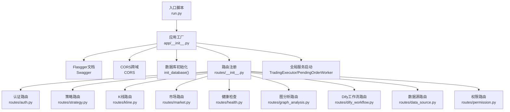
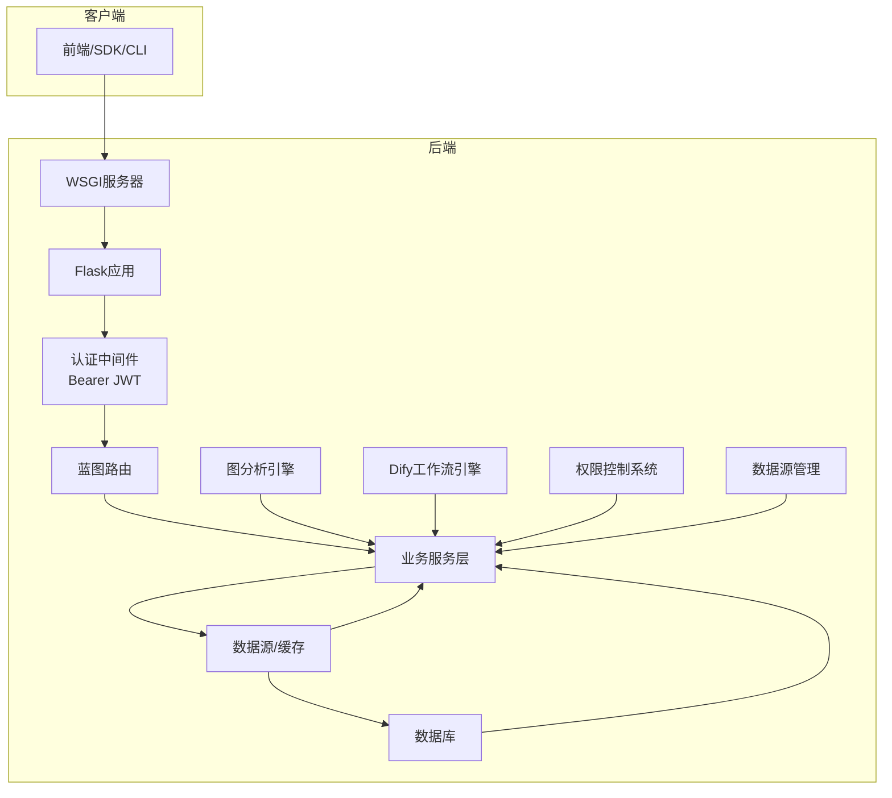
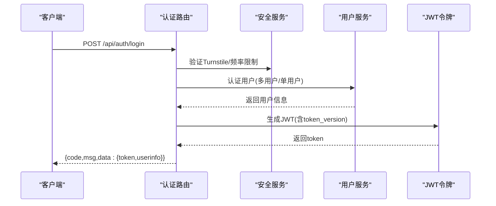
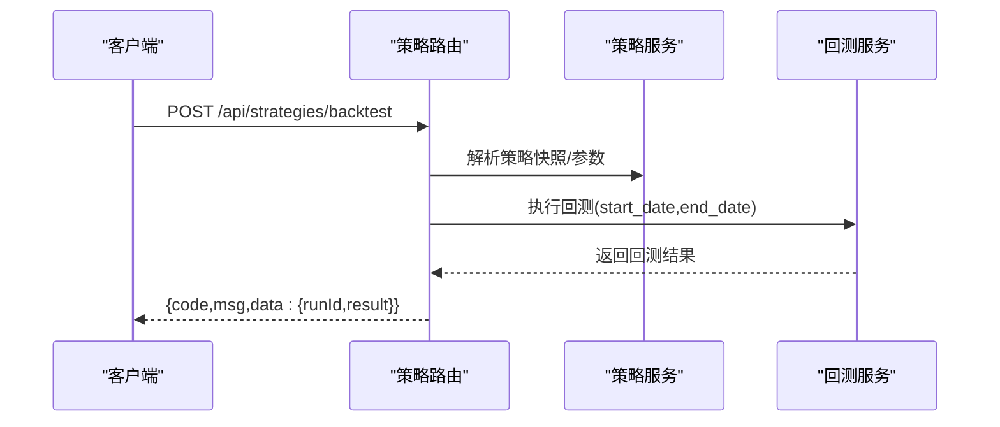
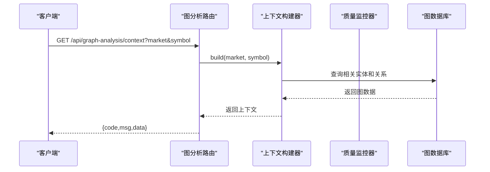
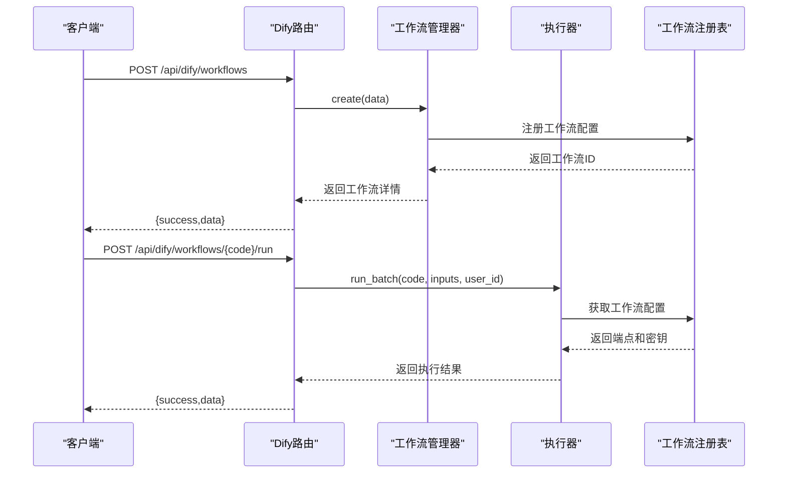
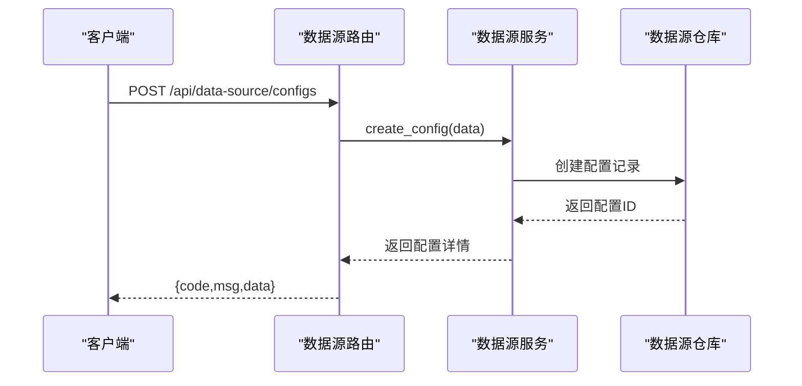
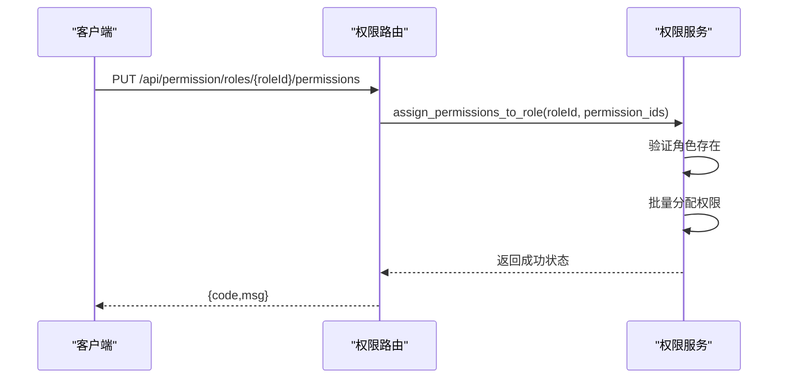
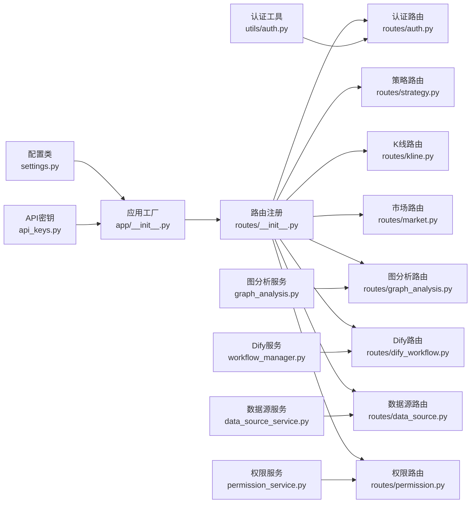

# API参考文档

<cite>
**本文档引用的文件**
- [run.py](file://backend_api_python/run.py)
- [app/__init__.py](file://backend_api_python/app/__init__.py)
- [app/utils/auth.py](file://backend_api_python/app/utils/auth.py)
- [app/config/settings.py](file://backend_api_python/app/config/settings.py)
- [app/config/api_keys.py](file://backend_api_python/app/config/api_keys.py)
- [app/route/__init__.py](file://backend_api_python/app/routes/__init__.py)
- [app/route/auth.py](file://backend_api_python/app/routes/auth.py)
- [app/route/strategy.py](file://backend_api_python/app/routes/strategy.py)
- [app/route/kline.py](file://backend_api_python/app/routes/kline.py)
- [app/route/market.py](file://backend_api_python/app/routes/market.py)
- [app/route/health.py](file://backend_api_python/app/routes/health.py)
- [app/route/graph_analysis.py](file://backend_api_python/app/routes/graph_analysis.py)
- [app/route/dify_workflow.py](file://backend_api_python/app/routes/dify_workflow.py)
- [app/route/data_source.py](file://backend_api_python/app/routes/data_source.py)
- [app/route/permission.py](file://backend_api_python/app/routes/permission.py)
- [app/models/dify.py](file://backend_api_python/app/models/dify.py)
- [app/models/permission.py](file://backend_api_python/app/models/permission.py)
- [app/models/data_source_meta.py](file://backend_api_python/app/models/data_source_meta.py)
- [app/services/dify/workflow_manager.py](file://backend_api_python/app/services/dify/workflow_manager.py)
- [app/services/dify/workflow_executor.py](file://backend_api_python/app/services/dify/workflow_executor.py)
- [app/services/permission_service.py](file://backend_api_python/app/services/permission_service.py)
- [app/services/data_source_service.py](file://backend_api_python/app/services/data_source_service.py)
- [frontend/src/api/dify.js](file://frontend/src/api/dify.js)
- [frontend/src/api/datasource.js](file://frontend/src/api/datasource.js)
- [frontend/src/api/permission.js](file://frontend/src/api/permission.js)
</cite>

## 更新摘要
**变更内容**
- 新增图分析API模块，提供知识图谱上下文、相关资产查询、事件查询等功能
- 新增Dify工作流API模块，支持工作流的CRUD、执行和日志管理
- 新增数据源管理API模块，涵盖数据源配置、API密钥、数据集和查询缓存管理
- 新增权限管理API模块，提供RBAC权限系统的完整接口
- 更新路由注册，将新模块集成到主应用中

## 目录
1. [简介](#简介)
2. [项目结构](#项目结构)
3. [核心组件](#核心组件)
4. [架构总览](#架构总览)
5. [详细组件分析](#详细组件分析)
6. [依赖关系分析](#依赖关系分析)
7. [性能考虑](#性能考虑)
8. [故障排除指南](#故障排除指南)
9. [结论](#结论)
10. [附录](#附录)

## 简介
QuantDinger是一个量化交易与AI辅助的Python API服务，提供市场数据、策略回测、用户认证、资产组合管理、AI聊天助手、快速交易等功能。本文档面向开发者与集成方，提供完整的REST API参考、认证机制说明、WebSocket实时接口规范、错误码对照以及最佳实践。

**更新** 新增图分析API、Dify工作流API、数据源管理API、权限管理API等新功能模块，扩展了系统的AI分析能力和数据管理能力。

## 项目结构
后端采用Flask框架，通过蓝图模块化组织API路由；认证基于JWT；数据库初始化与用户服务在应用启动时完成；全局单例如交易执行器、挂单工作线程等在应用上下文中启动。

**图表来源**
- [run.py:101-134](file://backend_api_python/run.py#L101-L134)
- [app/__init__.py:213-288](file://backend_api_python/app/__init__.py#L213-L288)
- [app/route/__init__.py:30-68](file://backend_api_python/app/routes/__init__.py#L30-L68)

**章节来源**
- [run.py:101-134](file://backend_api_python/run.py#L101-L134)
- [app/__init__.py:213-288](file://backend_api_python/app/__init__.py#L213-L288)
- [app/route/__init__.py:30-68](file://backend_api_python/app/routes/__init__.py#L30-L68)

## 核心组件
- 应用工厂与安全JSON提供者：确保输出符合RFC 8259，避免NaN/Infinity导致前端解析失败。
- 认证与授权：基于Bearer JWT，支持角色与权限校验，支持单客户端登录（token版本号）。
- 配置系统：集中管理主机、端口、调试、密钥、速率限制、功能开关等。
- API密钥管理：统一从环境变量与附加配置加载第三方API密钥。
- 蓝图路由：按功能域划分，统一前缀与安全装饰器。
- **新增** 图分析引擎：基于知识图谱的上下文构建、关系查询和质量监控。
- **新增** Dify工作流引擎：支持AI工作流的注册、配置、执行和日志管理。
- **新增** 数据源管理：提供数据源配置、API密钥、数据集和查询缓存的完整生命周期管理。
- **新增** 权限控制系统：基于RBAC的权限、角色和用户管理。

**章节来源**
- [app/__init__.py:16-52](file://backend_api_python/app/__init__.py#L16-L52)
- [app/utils/auth.py:18-158](file://backend_api_python/app/utils/auth.py#L18-L158)
- [app/config/settings.py:10-99](file://backend_api_python/app/config/settings.py#L10-L99)
- [app/config/api_keys.py:7-164](file://backend_api_python/app/config/api_keys.py#L7-L164)

## 架构总览
QuantDinger后端以Flask为核心，通过蓝图模块化组织各业务域API；认证中间件统一拦截并注入用户上下文；服务层负责具体业务逻辑；数据源层负责外部数据接入与缓存；全局服务在应用启动时初始化并运行。

[此图为概念性架构示意，不直接映射具体源文件，故无"图表来源"]

## 详细组件分析

### 认证与授权
- 认证方式：Bearer JWT，头部格式为Authorization: Bearer <token>。
- 登录流程：支持用户名密码与邮箱验证码两种登录方式；登录成功后返回token与用户信息。
- 权限控制：支持admin/manager/user四种角色，可按需进行角色与权限校验。
- 单客户端登录：通过token版本号实现踢出旧会话，保障账户安全。

**图表来源**
- [app/route/auth.py:156-325](file://backend_api_python/app/routes/auth.py#L156-L325)
- [app/utils/auth.py:18-158](file://backend_api_python/app/utils/auth.py#L18-L158)

**章节来源**
- [app/route/auth.py:115-325](file://backend_api_python/app/routes/auth.py#L115-L325)
- [app/utils/auth.py:18-158](file://backend_api_python/app/utils/auth.py#L18-L158)

### 健康检查
- 提供服务状态与API可用性检查接口，便于容器编排与负载均衡探针使用。

**章节来源**
- [app/route/health.py:10-109](file://backend_api_python/app/routes/health.py#L10-L109)

### 市场与K线数据
- K线查询：支持多市场、多周期、分页与时间戳过滤。
- 实时价格：支持批量获取自选股价格，内部使用线程池并发拉取。
- 符号搜索：支持关键词搜索与热门符号推荐。

**图表来源**
- [app/route/kline.py:17-132](file://backend_api_python/app/routes/kline.py#L17-L132)
- [app/route/market.py:642-752](file://backend_api_python/app/routes/market.py#L642-L752)

**章节来源**
- [app/route/kline.py:17-207](file://backend_api_python/app/routes/kline.py#L17-L207)
- [app/route/market.py:232-396](file://backend_api_python/app/routes/market.py#L232-L396)
- [app/route/market.py:642-752](file://backend_api_python/app/routes/market.py#L642-L752)

### 策略与回测
- 策略模板：提供预置策略模板，支持分类与难度筛选。
- 策略管理：列出、详情、创建、删除等。
- 回测执行：支持指定日期范围与参数覆盖，返回回测结果与运行ID。

**图表来源**
- [app/route/strategy.py:467-611](file://backend_api_python/app/routes/strategy.py#L467-L611)

**章节来源**
- [app/route/strategy.py:251-349](file://backend_api_python/app/routes/strategy.py#L251-L349)
- [app/route/strategy.py:370-465](file://backend_api_python/app/routes/strategy.py#L370-L465)
- [app/route/strategy.py:467-611](file://backend_api_python/app/routes/strategy.py#L467-L611)

### 图分析API
**新增** 提供基于知识图谱的分析能力，支持图上下文构建、相关资产查询、事件查询和Cypher查询。

- 图上下文获取：为指定交易符号构建结构化的知识图谱上下文。
- LLM格式化：将图上下文转换为LLM友好的文本格式。
- 相关资产查询：查询与给定符号相关的其他资产。
- 最近事件查询：获取影响特定交易符号的最近事件。
- 自定义Cypher查询：执行只读Cypher查询（写操作被拒绝）。
- 图质量报告：返回知识图谱的数据质量与就绪状态报告。

**图表来源**
- [app/route/graph_analysis.py:16-66](file://backend_api_python/app/routes/graph_analysis.py#L16-L66)
- [app/route/graph_analysis.py:69-125](file://backend_api_python/app/routes/graph_analysis.py#L69-L125)

**章节来源**
- [app/route/graph_analysis.py:16-338](file://backend_api_python/app/routes/graph_analysis.py#L16-L338)

### Dify工作流API
**新增** 提供AI工作流的完整生命周期管理，支持工作流注册、配置、执行和日志追踪。

- 工作流CRUD：创建、获取、更新、删除Dify工作流配置。
- 工作流执行：支持批处理和流式执行模式。
- 执行日志：追踪工作流执行状态、耗时、错误信息等。
- 输入输出模式：支持结构化输入参数和输出结果。

**图表来源**
- [app/route/dify_workflow.py:25-58](file://backend_api_python/app/routes/dify_workflow.py#L25-L58)
- [app/route/dify_workflow.py:274-353](file://backend_api_python/app/routes/dify_workflow.py#L274-L353)

**章节来源**
- [app/route/dify_workflow.py:25-429](file://backend_api_python/app/routes/dify_workflow.py#L25-L429)
- [app/services/dify/workflow_manager.py:19-37](file://backend_api_python/app/services/dify/workflow_manager.py#L19-L37)
- [app/services/dify/workflow_executor.py:36-69](file://backend_api_python/app/services/dify/workflow_executor.py#L36-L69)

### 数据源管理API
**新增** 提供数据源配置的完整生命周期管理，包括配置、API密钥、数据集和查询缓存的CRUD操作。

- 数据源配置：创建、获取、更新、删除数据源配置。
- API密钥管理：支持公共和私有密钥，支持密钥状态管理和健康追踪。
- 数据集元数据：管理数据集的返回结构、字段模式和覆盖范围。
- 查询缓存：提供查询结果缓存、清理和统计功能。

**图表来源**
- [app/route/data_source.py:62-77](file://backend_api_python/app/routes/data_source.py#L62-L77)
- [app/route/data_source.py:126-145](file://backend_api_python/app/routes/data_source.py#L126-L145)

**章节来源**
- [app/route/data_source.py:28-371](file://backend_api_python/app/routes/data_source.py#L28-L371)
- [app/services/data_source_service.py:74-131](file://backend_api_python/app/services/data_source_service.py#L74-L131)

### 权限管理API
**新增** 基于RBAC的权限控制系统，提供权限、角色和用户管理的完整接口。

- 权限CRUD：创建、获取、更新、删除权限节点。
- 角色CRUD：创建、获取、更新、删除角色。
- 角色-权限分配：为角色分配多个权限。
- 用户-角色分配：为用户分配多个角色。
- 当前用户信息：获取用户的菜单权限树和权限编码列表。

**图表来源**
- [app/route/permission.py:194-210](file://backend_api_python/app/routes/permission.py#L194-L210)
- [app/route/permission.py:217-246](file://backend_api_python/app/routes/permission.py#L217-L246)

**章节来源**
- [app/route/permission.py:21-277](file://backend_api_python/app/routes/permission.py#L21-L277)
- [app/services/permission_service.py:65-126](file://backend_api_python/app/services/permission_service.py#L65-L126)

### WebSocket实时接口
- 连接处理：前端通过WebSocket与后端建立长连接，用于推送实时行情、订单状态、交易信号等。
- 消息格式：采用JSON结构，包含消息类型、主题标识与数据体。
- 事件类型：包括但不限于实时K线、深度行情、账户资金变动、策略信号等。
- 订阅与退订：支持按市场/符号/事件类型订阅，支持批量退订。

[本节为概念性说明，未直接分析具体源文件，故无"章节来源"与"图表来源"]

## 依赖关系分析
- 应用工厂依赖Flasgger进行API文档生成，启用CORS并初始化数据库与管理员账户。
- 认证中间件依赖配置中的SECRET_KEY与用户服务，实现token签发与校验。
- 路由蓝图按功能域注册，统一前缀与安全装饰器。
- 服务层依赖数据源工厂与缓存管理器，实现数据获取与缓存策略。
- **新增** 图分析服务依赖图数据库连接和质量监控器。
- **新增** Dify工作流服务依赖工作流注册表和外部AI服务客户端。
- **新增** 数据源服务依赖多种数据源提供程序和加密工具。
- **新增** 权限服务依赖RBAC模型和用户角色关系。

**图表来源**
- [app/__init__.py:232-249](file://backend_api_python/app/__init__.py#L232-L249)
- [app/route/__init__.py:30-68](file://backend_api_python/app/routes/__init__.py#L30-L68)
- [app/utils/auth.py:18-158](file://backend_api_python/app/utils/auth.py#L18-L158)
- [app/config/settings.py:10-99](file://backend_api_python/app/config/settings.py#L10-L99)
- [app/config/api_keys.py:7-164](file://backend_api_python/app/config/api_keys.py#L7-L164)

**章节来源**
- [app/__init__.py:232-249](file://backend_api_python/app/__init__.py#L232-L249)
- [app/route/__init__.py:30-68](file://backend_api_python/app/routes/__init__.py#L30-L68)
- [app/utils/auth.py:18-158](file://backend_api_python/app/utils/auth.py#L18-L158)
- [app/config/settings.py:10-99](file://backend_api_python/app/config/settings.py#L10-L99)
- [app/config/api_keys.py:7-164](file://backend_api_python/app/config/api_keys.py#L7-L164)

## 性能考虑
- JSON序列化：内置安全JSON提供者，自动将NaN/Infinity转换为null，避免前端解析异常。
- 并发与缓存：市场路由批量获取价格使用线程池并发，K线服务内部具备缓存机制。
- 数据库连接：服务层按需获取连接，避免阻塞；注意合理设置DB连接池大小。
- 速率限制：配置项支持全局速率限制，结合安全服务实现登录与验证码发送的频率控制。
- 启动优化：策略恢复与后台任务仅在必要时启动，避免不必要的资源占用。
- **新增** 图分析性能：图查询使用索引优化，支持批量查询和结果缓存。
- **新增** Dify工作流：支持异步执行和结果缓存，避免重复计算。
- **新增** 数据源管理：API密钥加密存储，支持负载均衡和健康检查。

[本节为通用性能建议，不直接分析具体源文件，故无"章节来源"]

## 故障排除指南
- 认证失败：检查Authorization头是否正确，确认token未过期且与当前token版本一致。
- 数据为空：检查市场/符号参数是否正确，部分周期可能需要付费订阅。
- 速率限制：登录与验证码发送受频率限制，注意等待冷却时间。
- 启动异常：确认SECRET_KEY非默认值，数据库初始化成功，管理员账户存在。
- **新增** 图分析错误：检查图数据库连接，确认查询语法正确。
- **新增** Dify工作流错误：验证工作流配置、端点和API密钥的有效性。
- **新增** 数据源配置错误：检查数据源连接测试结果，确认凭据正确。

**章节来源**
- [app/utils/auth.py:146-158](file://backend_api_python/app/utils/auth.py#L146-L158)
- [app/route/kline.py:104-117](file://backend_api_python/app/routes/kline.py#L104-L117)
- [app/route/auth.py:223-227](file://backend_api_python/app/routes/auth.py#L223-L227)
- [run.py:109-120](file://backend_api_python/run.py#L109-L120)

## 结论
QuantDinger提供了完善的REST API与认证体系，覆盖市场数据、策略回测、用户管理等核心功能。通过蓝图模块化设计与JWT认证，系统具备良好的扩展性与安全性。**更新** 新增的图分析、Dify工作流、数据源管理和权限管理模块进一步增强了系统的AI分析能力和数据管理能力。建议在生产环境中严格配置密钥与速率限制，并根据业务需求调整并发与缓存策略。

[本节为总结性内容，不直接分析具体源文件，故无"章节来源"]

## 附录

### 接口列表与规范

- 健康检查
  - 方法与路径：GET /api/health
  - 认证：无需
  - 响应：包含服务状态与时间戳的标准结构

- 认证
  - 登录
    - 方法与路径：POST /api/auth/login
    - 请求体：用户名/账号、密码、Turnstile token
    - 响应：token与用户信息
  - 邮箱验证码登录
    - 方法与路径：POST /api/auth/login-code
    - 请求体：邮箱、验证码、Turnstile token、邀请码
    - 响应：token与用户信息（新用户会自动创建）
  - 发送验证码
    - 方法与路径：POST /api/auth/send-code
    - 请求体：邮箱、类型、Turnstile token
    - 响应：发送状态
  - 注册
    - 方法与路径：POST /api/auth/register
    - 请求体：邮箱、验证码、用户名、密码、Turnstile token、邀请码
    - 响应：注册状态

- 策略
  - 列表模板
    - 方法与路径：GET /api/strategy/templates
    - 查询：category、difficulty
    - 响应：模板列表
  - 获取模板
    - 方法与路径：GET /api/strategy/templates/{key}
    - 响应：模板详情
  - 列表策略
    - 方法与路径：GET /api/strategy/strategies
    - 响应：当前用户策略列表
  - 策略详情
    - 方法与路径：GET /api/strategy/strategies/detail
    - 查询：id
    - 响应：策略详情
  - 运行回测
    - 方法与路径：POST /api/strategy/strategies/backtest
    - 请求体：strategyId、startDate、endDate、overrideConfig
    - 响应：runId与回测结果
  - 回测历史
    - 方法与路径：GET /api/strategy/strategies/backtest/history
    - 查询：strategyId/id、limit、offset、symbol、market、timeframe
    - 响应：历史记录列表
  - 获取回测运行
    - 方法与路径：GET /api/strategy/strategies/backtest/get
    - 查询：runId
    - 响应：运行详情

- K线与价格
  - 获取K线
    - 方法与路径：GET /api/indicator/kline
    - 查询：market、symbol、timeframe、limit、before_time/beforeTime
    - 响应：K线数据
  - 获取最新价格
    - 方法与路径：GET /api/indicator/price
    - 查询：market、symbol
    - 响应：价格数据

- 市场与自选股
  - 公共配置
    - 方法与路径：GET /api/market/config
    - 响应：前端可用模型列表等
  - 市场类型
    - 方法与路径：GET /api/market/types
    - 响应：支持的市场类型列表
  - 符号搜索
    - 方法与路径：GET /api/market/symbols/search
    - 查询：market、keyword、limit
    - 响应：搜索结果
  - 热门符号
    - 方法与路径：GET /api/market/symbols/hot
    - 查询：market、limit
    - 响应：热门符号
  - 获取自选股
    - 方法与路径：GET /api/market/watchlist/get
    - 认证：需要
    - 响应：当前用户自选股
  - 添加自选股
    - 方法与路径：POST /api/market/watchlist/add
    - 认证：需要
    - 请求体：market、symbol、name
    - 响应：操作结果
  - 删除自选股
    - 方法与路径：POST /api/market/watchlist/remove
    - 认证：需要
    - 请求体：symbol
    - 响应：操作结果
  - 批量获取自选股价格
    - 方法与路径：GET /api/market/watchlist/prices
    - 查询：watchlist(JSON数组字符串)
    - 响应：批量价格数据

- **新增** 图分析
  - 获取图上下文
    - 方法与路径：GET /api/graph-analysis/context
    - 查询：market、symbol
    - 响应：图上下文数据
  - 获取LLM格式化上下文
    - 方法与路径：GET /api/graph-analysis/context/llm
    - 查询：market、symbol
    - 响应：LLM友好格式的上下文
  - 查找相关资产
    - 方法与路径：GET /api/graph-analysis/related
    - 查询：market、symbol
    - 响应：相关资产列表
  - 获取最近事件
    - 方法与路径：GET /api/graph-analysis/events
    - 查询：symbol、limit
    - 响应：最近事件列表
  - 执行Cypher查询
    - 方法与路径：POST /api/graph-analysis/cypher
    - 请求体：query、params
    - 响应：查询结果
  - 获取图质量报告
    - 方法与路径：GET /api/graph-analysis/quality
    - 响应：质量报告

- **新增** Dify工作流
  - 列出工作流
    - 方法与路径：GET /api/dify/workflows
    - 认证：需要
    - 响应：工作流列表
  - 创建工作流
    - 方法与路径：POST /api/dify/workflows
    - 认证：需要
    - 请求体：code、name、description、config
    - 响应：创建工作流
  - 获取工作流详情
    - 方法与路径：GET /api/dify/workflows/{code}
    - 认证：需要
    - 响应：工作流详情
  - 更新工作流
    - 方法与路径：PUT /api/dify/workflows/{code}
    - 认证：需要
    - 请求体：更新字段
    - 响应：更新后的工作流
  - 删除工作流
    - 方法与路径：DELETE /api/dify/workflows/{code}
    - 认证：需要
    - 响应：删除状态
  - 执行工作流
    - 方法与路径：POST /api/dify/workflows/{code}/run
    - 认证：需要
    - 请求体：inputs、streaming
    - 响应：执行结果
  - 获取工作流日志
    - 方法与路径：GET /api/dify/workflows/{code}/logs
    - 认证：需要
    - 查询：limit
    - 响应：日志列表

- **新增** 数据源管理
  - 列出数据源配置
    - 方法与路径：GET /api/data-source/configs
    - 认证：需要
    - 查询：layer、market_category、enabled、search、page、page_size
    - 响应：配置列表
  - 获取数据源配置
    - 方法与路径：GET /api/data-source/configs/{config_id}
    - 认证：需要
    - 响应：配置详情
  - 创建数据源配置
    - 方法与路径：POST /api/data-source/configs
    - 认证：需要（管理员）
    - 请求体：source_code、source_name、layer、enabled等
    - 响应：创建的配置
  - 更新数据源配置
    - 方法与路径：PUT /api/data-source/configs/{config_id}
    - 认证：需要（管理员）
    - 请求体：更新字段
    - 响应：更新后的配置
  - 删除数据源配置
    - 方法与路径：DELETE /api/data-source/configs/{config_id}
    - 认证：需要（管理员）
    - 响应：删除状态
  - 测试数据源连接
    - 方法与路径：POST /api/data-source/configs/{config_id}/test
    - 认证：需要（管理员）
    - 响应：连接测试结果
  - 列出API密钥
    - 方法与路径：GET /api/data-source/keys
    - 认证：需要
    - 查询：source_config_id、key_type、status、page、page_size
    - 响应：密钥列表
  - 获取API密钥
    - 方法与路径：GET /api/data-source/keys/{key_id}
    - 认证：需要
    - 响应：密钥详情
  - 创建API密钥
    - 方法与路径：POST /api/data-source/keys
    - 认证：需要
    - 请求体：source_config_id、key_value、key_type等
    - 响应：创建的密钥
  - 更新API密钥
    - 方法与路径：PUT /api/data-source/keys/{key_id}
    - 认证：需要
    - 请求体：更新字段
    - 响应：更新后的密钥
  - 删除API密钥
    - 方法与路径：DELETE /api/data-source/keys/{key_id}
    - 认证：需要
    - 响应：删除状态
  - 列出数据集
    - 方法与路径：GET /api/data-source/datasets
    - 认证：需要
    - 查询：source_id、dataset_code、search、page、page_size
    - 响应：数据集列表
  - 获取数据集
    - 方法与路径：GET /api/data-source/datasets/{dataset_id}
    - 认证：需要
    - 响应：数据集详情
  - 创建数据集
    - 方法与路径：POST /api/data-source/datasets
    - 认证：需要（管理员）
    - 请求体：source_id、dataset_code、dataset_name等
    - 响应：创建的数据集
  - 更新数据集
    - 方法与路径：PUT /api/data-source/datasets/{dataset_id}
    - 认证：需要（管理员）
    - 请求体：更新字段
    - 响应：更新后的数据集
  - 删除数据集
    - 方法与路径：DELETE /api/data-source/datasets/{dataset_id}
    - 认证：需要（管理员）
    - 响应：删除状态
  - 获取配置数据集
    - 方法与路径：GET /api/data-source/configs/{config_id}/datasets
    - 认证：需要
    - 响应：数据集列表
  - 列出查询缓存
    - 方法与路径：GET /api/data-source/cache
    - 认证：需要（管理员）
    - 查询：source_code、status、page、page_size
    - 响应：缓存列表
  - 删除查询缓存
    - 方法与路径：DELETE /api/data-source/cache/{cache_id}
    - 认证：需要（管理员）
    - 响应：删除状态
  - 清理过期缓存
    - 方法与路径：POST /api/data-source/cache/cleanup
    - 认证：需要（管理员）
    - 请求体：max_age_hours
    - 响应：清理统计

- **新增** 权限管理
  - 获取权限树
    - 方法与路径：GET /api/permission/tree
    - 认证：需要
    - 查询：buttons
    - 响应：权限树
  - 获取权限
    - 方法与路径：GET /api/permission/{perm_id}
    - 认证：需要
    - 响应：权限详情
  - 创建权限
    - 方法与路径：POST /api/permission
    - 认证：需要（管理员）
    - 请求体：name、permission_code、type等
    - 响应：创建的权限
  - 更新权限
    - 方法与路径：PUT /api/permission/{perm_id}
    - 认证：需要（管理员）
    - 请求体：更新字段
    - 响应：更新后的权限
  - 删除权限
    - 方法与路径：DELETE /api/permission/{perm_id}
    - 认证：需要（管理员）
    - 响应：删除状态
  - 列出角色
    - 方法与路径：GET /api/permission/roles
    - 认证：需要
    - 查询：page、page_size
    - 响应：角色列表
  - 获取所有角色
    - 方法与路径：GET /api/permission/roles/all
    - 认证：需要
    - 响应：角色列表
  - 获取角色
    - 方法与路径：GET /api/permission/roles/{role_id}
    - 认证：需要
    - 响应：角色详情（含权限ID列表）
  - 创建角色
    - 方法与路径：POST /api/permission/roles
    - 认证：需要（管理员）
    - 请求体：name、role_code、description等
    - 响应：创建的角色
  - 更新角色
    - 方法与路径：PUT /api/permission/roles/{role_id}
    - 认证：需要（管理员）
    - 请求体：更新字段
    - 响应：更新后的角色
  - 删除角色
    - 方法与路径：DELETE /api/permission/roles/{role_id}
    - 认证：需要（管理员）
    - 响应：删除状态
  - 为角色分配权限
    - 方法与路径：PUT /api/permission/roles/{role_id}/permissions
    - 认证：需要（管理员）
    - 请求体：permission_ids
    - 响应：分配状态
  - 获取用户角色
    - 方法与路径：GET /api/permission/users/{user_id}/roles
    - 认证：需要（管理员）
    - 响应：角色列表
  - 为用户分配角色
    - 方法与路径：PUT /api/permission/users/{user_id}/roles
    - 认证：需要（管理员）
    - 请求体：role_ids
    - 响应：分配状态
  - 获取我的菜单
    - 方法与路径：GET /api/permission/my/menu
    - 认证：需要
    - 响应：菜单权限树
  - 获取我的权限编码
    - 方法与路径：GET /api/permission/my/codes
    - 认证：需要
    - 响应：权限编码列表

**章节来源**
- [app/route/health.py:10-109](file://backend_api_python/app/routes/health.py#L10-L109)
- [app/route/auth.py:156-688](file://backend_api_python/app/routes/auth.py#L156-L688)
- [app/route/strategy.py:251-761](file://backend_api_python/app/routes/strategy.py#L251-L761)
- [app/route/kline.py:17-207](file://backend_api_python/app/routes/kline.py#L17-L207)
- [app/route/market.py:53-752](file://backend_api_python/app/routes/market.py#L53-L752)
- [app/route/graph_analysis.py:16-338](file://backend_api_python/app/routes/graph_analysis.py#L16-L338)
- [app/route/dify_workflow.py:25-429](file://backend_api_python/app/routes/dify_workflow.py#L25-L429)
- [app/route/data_source.py:28-371](file://backend_api_python/app/routes/data_source.py#L28-L371)
- [app/route/permission.py:21-277](file://backend_api_python/app/routes/permission.py#L21-L277)

### 认证与安全
- 认证方式：Bearer JWT，头部格式为Authorization: Bearer <token>。
- 角色与权限：admin/manager/user，支持按权限校验。
- 单客户端登录：通过token版本号实现踢出旧会话。
- 安全配置：支持Turnstile人机验证、登录频率限制、验证码发送频率限制。
- **新增** 管理员权限：数据源管理、权限管理、查询缓存清理等操作需要管理员权限。

**章节来源**
- [app/utils/auth.py:18-239](file://backend_api_python/app/utils/auth.py#L18-L239)
- [app/route/auth.py:115-688](file://backend_api_python/app/routes/auth.py#L115-L688)

### 错误码对照
- 通用结构：{code, msg, data}
- 成功：code=1
- 失败：code=0
- 未认证：401
- 权限不足：403
- 请求错误：400
- 速率限制：429
- 服务器错误：500
- **新增** 工作流执行错误：501（流式模式需要异步端点）

**章节来源**
- [app/route/auth.py:143-149](file://backend_api_python/app/routes/auth.py#L143-L149)
- [app/route/auth.py:223-227](file://backend_api_python/app/routes/auth.py#L223-L227)
- [app/route/kline.py:104-117](file://backend_api_python/app/routes/kline.py#L104-L117)

### API使用示例与客户端实现指南
- 客户端实现要点
  - 统一在请求头添加Authorization: Bearer <token>。
  - 对于需要认证的接口，先调用登录或验证码登录获取token。
  - 批量请求时注意并发与超时控制，避免阻塞。
  - 对于K线与价格接口，合理设置limit与时间范围，避免过大请求。
  - **新增** 图分析接口：确保图数据库连接正常，查询参数正确。
  - **新增** Dify工作流接口：正确配置工作流端点和API密钥。
  - **新增** 数据源管理接口：管理员权限才能进行配置和缓存操作。
  - **新增** 权限管理接口：使用RBAC模型进行权限控制。
- 示例流程
  - 登录获取token -> 调用策略回测 -> 订阅自选股价格 -> 处理回调事件。
  - **新增** 图分析：获取图上下文 -> LLM格式化 -> 执行相关资产查询。
  - **新增** Dify工作流：注册工作流 -> 配置端点 -> 执行工作流 -> 查看日志。
  - **新增** 数据源管理：配置数据源 -> 创建API密钥 -> 管理数据集 -> 清理缓存。
  - **新增** 权限管理：创建角色 -> 分配权限 -> 分配用户角色 -> 获取菜单权限。

[本节为通用指导，不直接分析具体源文件，故无"章节来源"]