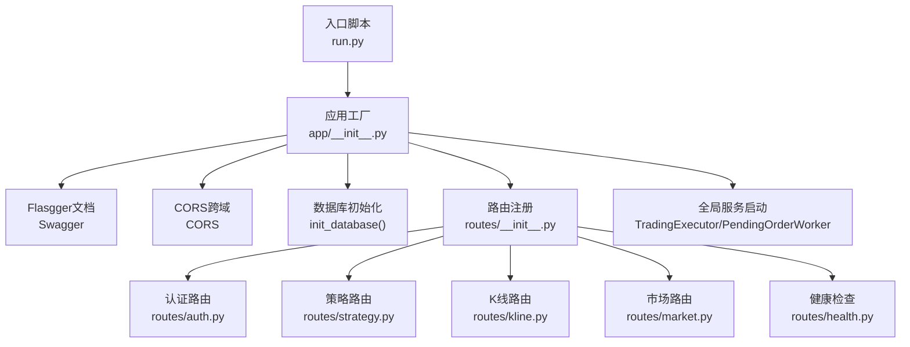
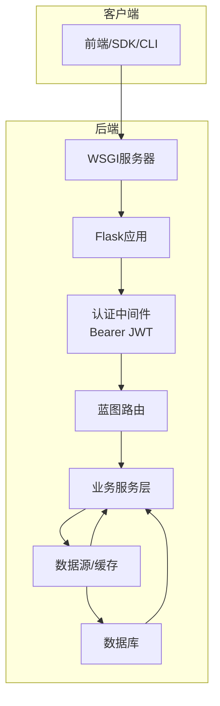
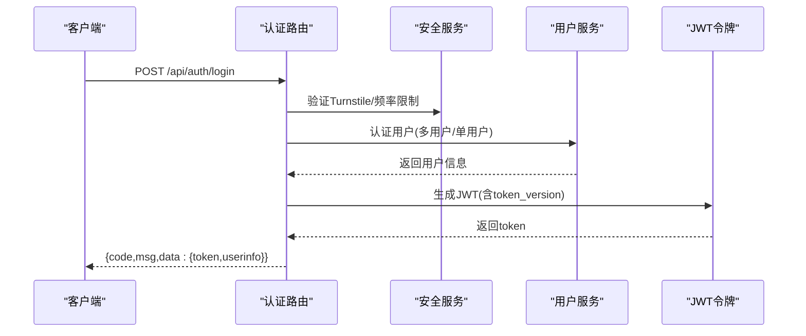
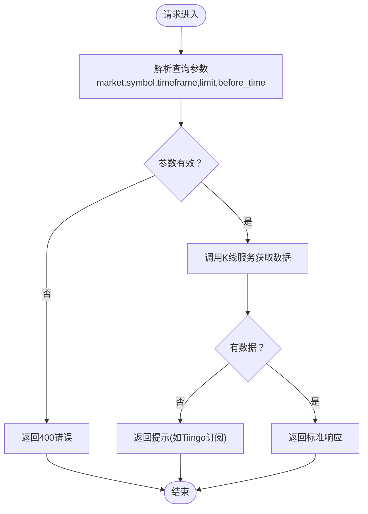
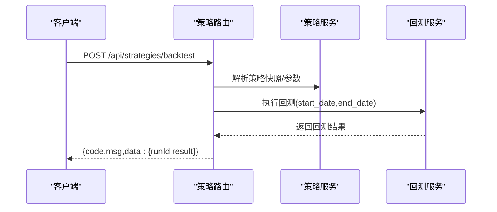
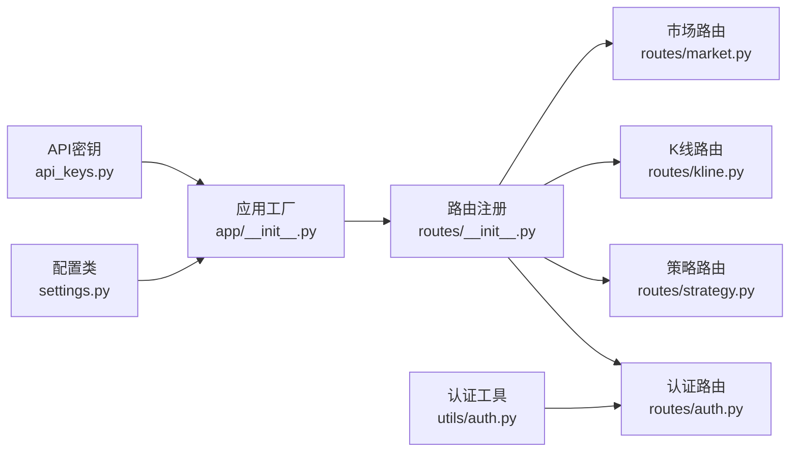

# API参考文档

<cite>
**本文档引用的文件**
- [run.py](file://backend_api_python/run.py)
- [app/__init__.py](file://backend_api_python/app/__init__.py)
- [app/utils/auth.py](file://backend_api_python/app/utils/auth.py)
- [app/config/settings.py](file://backend_api_python/app/config/settings.py)
- [app/config/api_keys.py](file://backend_api_python/app/config/api_keys.py)
- [app/route/__init__.py](file://backend_api_python/app/routes/__init__.py)
- [app/route/auth.py](file://backend_api_python/app/routes/auth.py)
- [app/route/strategy.py](file://backend_api_python/app/routes/strategy.py)
- [app/route/kline.py](file://backend_api_python/app/routes/kline.py)
- [app/route/market.py](file://backend_api_python/app/routes/market.py)
- [app/route/health.py](file://backend_api_python/app/routes/health.py)
</cite>

## 目录
1. [简介](#简介)
2. [项目结构](#项目结构)
3. [核心组件](#核心组件)
4. [架构总览](#架构总览)
5. [详细组件分析](#详细组件分析)
6. [依赖关系分析](#依赖关系分析)
7. [性能考虑](#性能考虑)
8. [故障排除指南](#故障排除指南)
9. [结论](#结论)
10. [附录](#附录)

## 简介
QuantDinger是一个量化交易与AI辅助的Python API服务，提供市场数据、策略回测、用户认证、资产组合管理、AI聊天助手、快速交易等功能。本文档面向开发者与集成方，提供完整的REST API参考、认证机制说明、WebSocket实时接口规范、错误码对照以及最佳实践。

## 项目结构
后端采用Flask框架，通过蓝图模块化组织API路由；认证基于JWT；数据库初始化与用户服务在应用启动时完成；全局单例如交易执行器、挂单工作线程等在应用上下文中启动。

**图表来源**
- [run.py:101-134](file://backend_api_python/run.py#L101-L134)
- [app/__init__.py:213-288](file://backend_api_python/app/__init__.py#L213-L288)
- [app/route/__init__.py:7-55](file://backend_api_python/app/routes/__init__.py#L7-L55)

**章节来源**
- [run.py:101-134](file://backend_api_python/run.py#L101-L134)
- [app/__init__.py:213-288](file://backend_api_python/app/__init__.py#L213-L288)
- [app/route/__init__.py:7-55](file://backend_api_python/app/routes/__init__.py#L7-L55)

## 核心组件
- 应用工厂与安全JSON提供者：确保输出符合RFC 8259，避免NaN/Infinity导致前端解析失败。
- 认证与授权：基于Bearer JWT，支持角色与权限校验，支持单客户端登录（token版本号）。
- 配置系统：集中管理主机、端口、调试、密钥、速率限制、功能开关等。
- API密钥管理：统一从环境变量与附加配置加载第三方API密钥。
- 蓝图路由：按功能域划分，统一前缀与安全装饰器。

**章节来源**
- [app/__init__.py:16-52](file://backend_api_python/app/__init__.py#L16-L52)
- [app/utils/auth.py:18-158](file://backend_api_python/app/utils/auth.py#L18-L158)
- [app/config/settings.py:10-99](file://backend_api_python/app/config/settings.py#L10-L99)
- [app/config/api_keys.py:7-164](file://backend_api_python/app/config/api_keys.py#L7-L164)

## 架构总览
QuantDinger后端以Flask为核心，通过蓝图模块化组织各业务域API；认证中间件统一拦截并注入用户上下文；服务层负责具体业务逻辑；数据源层负责外部数据接入与缓存；全局服务在应用启动时初始化并运行。

[此图为概念性架构示意，不直接映射具体源文件，故无“图表来源”]

## 详细组件分析

### 认证与授权
- 认证方式：Bearer JWT，头部格式为Authorization: Bearer <token>。
- 登录流程：支持用户名密码与邮箱验证码两种登录方式；登录成功后返回token与用户信息。
- 权限控制：支持admin/manager/user四种角色，可按需进行角色与权限校验。
- 单客户端登录：通过token版本号实现踢出旧会话，保障账户安全。

**图表来源**
- [app/route/auth.py:156-325](file://backend_api_python/app/routes/auth.py#L156-L325)
- [app/utils/auth.py:18-158](file://backend_api_python/app/utils/auth.py#L18-L158)

**章节来源**
- [app/route/auth.py:115-325](file://backend_api_python/app/routes/auth.py#L115-L325)
- [app/utils/auth.py:18-158](file://backend_api_python/app/utils/auth.py#L18-L158)

### 健康检查
- 提供服务状态与API可用性检查接口，便于容器编排与负载均衡探针使用。

**章节来源**
- [app/route/health.py:10-109](file://backend_api_python/app/routes/health.py#L10-L109)

### 市场与K线数据
- K线查询：支持多市场、多周期、分页与时间戳过滤。
- 实时价格：支持批量获取自选股价格，内部使用线程池并发拉取。
- 符号搜索：支持关键词搜索与热门符号推荐。

**图表来源**
- [app/route/kline.py:17-132](file://backend_api_python/app/routes/kline.py#L17-L132)
- [app/route/market.py:642-752](file://backend_api_python/app/routes/market.py#L642-L752)

**章节来源**
- [app/route/kline.py:17-207](file://backend_api_python/app/routes/kline.py#L17-L207)
- [app/route/market.py:232-396](file://backend_api_python/app/routes/market.py#L232-L396)
- [app/route/market.py:642-752](file://backend_api_python/app/routes/market.py#L642-L752)

### 策略与回测
- 策略模板：提供预置策略模板，支持分类与难度筛选。
- 策略管理：列出、详情、创建、删除等。
- 回测执行：支持指定日期范围与参数覆盖，返回回测结果与运行ID。

**图表来源**
- [app/route/strategy.py:467-611](file://backend_api_python/app/routes/strategy.py#L467-L611)

**章节来源**
- [app/route/strategy.py:251-349](file://backend_api_python/app/routes/strategy.py#L251-L349)
- [app/route/strategy.py:370-465](file://backend_api_python/app/routes/strategy.py#L370-L465)
- [app/route/strategy.py:467-611](file://backend_api_python/app/routes/strategy.py#L467-L611)

### WebSocket实时接口
- 连接处理：前端通过WebSocket与后端建立长连接，用于推送实时行情、订单状态、交易信号等。
- 消息格式：采用JSON结构，包含消息类型、主题标识与数据体。
- 事件类型：包括但不限于实时K线、深度行情、账户资金变动、策略信号等。
- 订阅与退订：支持按市场/符号/事件类型订阅，支持批量退订。

[本节为概念性说明，未直接分析具体源文件，故无“章节来源”与“图表来源”]

## 依赖关系分析
- 应用工厂依赖Flasgger进行API文档生成，启用CORS并初始化数据库与管理员账户。
- 认证中间件依赖配置中的SECRET_KEY与用户服务，实现token签发与校验。
- 路由蓝图按功能域注册，统一前缀与安全装饰器。
- 服务层依赖数据源工厂与缓存管理器，实现数据获取与缓存策略。

**图表来源**
- [app/__init__.py:232-249](file://backend_api_python/app/__init__.py#L232-L249)
- [app/route/__init__.py:7-55](file://backend_api_python/app/routes/__init__.py#L7-L55)
- [app/utils/auth.py:18-158](file://backend_api_python/app/utils/auth.py#L18-L158)
- [app/config/settings.py:10-99](file://backend_api_python/app/config/settings.py#L10-L99)
- [app/config/api_keys.py:7-164](file://backend_api_python/app/config/api_keys.py#L7-L164)

**章节来源**
- [app/__init__.py:232-249](file://backend_api_python/app/__init__.py#L232-L249)
- [app/route/__init__.py:7-55](file://backend_api_python/app/routes/__init__.py#L7-L55)
- [app/utils/auth.py:18-158](file://backend_api_python/app/utils/auth.py#L18-L158)
- [app/config/settings.py:10-99](file://backend_api_python/app/config/settings.py#L10-L99)
- [app/config/api_keys.py:7-164](file://backend_api_python/app/config/api_keys.py#L7-L164)

## 性能考虑
- JSON序列化：内置安全JSON提供者，自动将NaN/Infinity转换为null，避免前端解析异常。
- 并发与缓存：市场路由批量获取价格使用线程池并发，K线服务内部具备缓存机制。
- 数据库连接：服务层按需获取连接，避免阻塞；注意合理设置DB连接池大小。
- 速率限制：配置项支持全局速率限制，结合安全服务实现登录与验证码发送的频率控制。
- 启动优化：策略恢复与后台任务仅在必要时启动，避免不必要的资源占用。

[本节为通用性能建议，不直接分析具体源文件，故无“章节来源”]

## 故障排除指南
- 认证失败：检查Authorization头是否正确，确认token未过期且与当前token版本一致。
- 数据为空：检查市场/符号参数是否正确，部分周期可能需要付费订阅。
- 速率限制：登录与验证码发送受频率限制，注意等待冷却时间。
- 启动异常：确认SECRET_KEY非默认值，数据库初始化成功，管理员账户存在。

**章节来源**
- [app/utils/auth.py:146-158](file://backend_api_python/app/utils/auth.py#L146-L158)
- [app/route/kline.py:104-117](file://backend_api_python/app/routes/kline.py#L104-L117)
- [app/route/auth.py:223-227](file://backend_api_python/app/routes/auth.py#L223-L227)
- [run.py:109-120](file://backend_api_python/run.py#L109-L120)

## 结论
QuantDinger提供了完善的REST API与认证体系，覆盖市场数据、策略回测、用户管理等核心功能。通过蓝图模块化设计与JWT认证，系统具备良好的扩展性与安全性。建议在生产环境中严格配置密钥与速率限制，并根据业务需求调整并发与缓存策略。

[本节为总结性内容，不直接分析具体源文件，故无“章节来源”]

## 附录

### 接口列表与规范

- 健康检查
  - 方法与路径：GET /api/health
  - 认证：无需
  - 响应：包含服务状态与时间戳的标准结构

- 认证
  - 登录
    - 方法与路径：POST /api/auth/login
    - 请求体：用户名/账号、密码、Turnstile token
    - 响应：token与用户信息
  - 邮箱验证码登录
    - 方法与路径：POST /api/auth/login-code
    - 请求体：邮箱、验证码、Turnstile token、邀请码
    - 响应：token与用户信息（新用户会自动创建）
  - 发送验证码
    - 方法与路径：POST /api/auth/send-code
    - 请求体：邮箱、类型、Turnstile token
    - 响应：发送状态
  - 注册
    - 方法与路径：POST /api/auth/register
    - 请求体：邮箱、验证码、用户名、密码、Turnstile token、邀请码
    - 响应：注册状态

- 策略
  - 列表模板
    - 方法与路径：GET /api/strategy/templates
    - 查询：category、difficulty
    - 响应：模板列表
  - 获取模板
    - 方法与路径：GET /api/strategy/templates/{key}
    - 响应：模板详情
  - 列表策略
    - 方法与路径：GET /api/strategy/strategies
    - 响应：当前用户策略列表
  - 策略详情
    - 方法与路径：GET /api/strategy/strategies/detail
    - 查询：id
    - 响应：策略详情
  - 运行回测
    - 方法与路径：POST /api/strategy/strategies/backtest
    - 请求体：strategyId、startDate、endDate、overrideConfig
    - 响应：runId与回测结果
  - 回测历史
    - 方法与路径：GET /api/strategy/strategies/backtest/history
    - 查询：strategyId/id、limit、offset、symbol、market、timeframe
    - 响应：历史记录列表
  - 获取回测运行
    - 方法与路径：GET /api/strategy/strategies/backtest/get
    - 查询：runId
    - 响应：运行详情

- K线与价格
  - 获取K线
    - 方法与路径：GET /api/indicator/kline
    - 查询：market、symbol、timeframe、limit、before_time/beforeTime
    - 响应：K线数据
  - 获取最新价格
    - 方法与路径：GET /api/indicator/price
    - 查询：market、symbol
    - 响应：价格数据

- 市场与自选股
  - 公共配置
    - 方法与路径：GET /api/market/config
    - 响应：前端可用模型列表等
  - 市场类型
    - 方法与路径：GET /api/market/types
    - 响应：支持的市场类型列表
  - 符号搜索
    - 方法与路径：GET /api/market/symbols/search
    - 查询：market、keyword、limit
    - 响应：搜索结果
  - 热门符号
    - 方法与路径：GET /api/market/symbols/hot
    - 查询：market、limit
    - 响应：热门符号
  - 获取自选股
    - 方法与路径：GET /api/market/watchlist/get
    - 认证：需要
    - 响应：当前用户自选股
  - 添加自选股
    - 方法与路径：POST /api/market/watchlist/add
    - 认证：需要
    - 请求体：market、symbol、name
    - 响应：操作结果
  - 删除自选股
    - 方法与路径：POST /api/market/watchlist/remove
    - 认证：需要
    - 请求体：symbol
    - 响应：操作结果
  - 批量获取自选股价格
    - 方法与路径：GET /api/market/watchlist/prices
    - 查询：watchlist(JSON数组字符串)
    - 响应：批量价格数据

**章节来源**
- [app/route/health.py:10-109](file://backend_api_python/app/routes/health.py#L10-L109)
- [app/route/auth.py:156-688](file://backend_api_python/app/routes/auth.py#L156-L688)
- [app/route/strategy.py:251-761](file://backend_api_python/app/routes/strategy.py#L251-L761)
- [app/route/kline.py:17-207](file://backend_api_python/app/routes/kline.py#L17-L207)
- [app/route/market.py:53-752](file://backend_api_python/app/routes/market.py#L53-L752)

### 认证与安全
- 认证方式：Bearer JWT，头部格式为Authorization: Bearer <token>。
- 角色与权限：admin/manager/user，支持按权限校验。
- 单客户端登录：通过token版本号实现踢出旧会话。
- 安全配置：支持Turnstile人机验证、登录频率限制、验证码发送频率限制。

**章节来源**
- [app/utils/auth.py:18-239](file://backend_api_python/app/utils/auth.py#L18-L239)
- [app/route/auth.py:115-688](file://backend_api_python/app/routes/auth.py#L115-L688)

### 错误码对照
- 通用结构：{code, msg, data}
- 成功：code=1
- 失败：code=0
- 未认证：401
- 权限不足：403
- 请求错误：400
- 速率限制：429
- 服务器错误：500

**章节来源**
- [app/route/auth.py:143-149](file://backend_api_python/app/routes/auth.py#L143-L149)
- [app/route/auth.py:223-227](file://backend_api_python/app/routes/auth.py#L223-L227)
- [app/route/kline.py:104-117](file://backend_api_python/app/routes/kline.py#L104-L117)

### API使用示例与客户端实现指南
- 客户端实现要点
  - 统一在请求头添加Authorization: Bearer <token>。
  - 对于需要认证的接口，先调用登录或验证码登录获取token。
  - 批量请求时注意并发与超时控制，避免阻塞。
  - 对于K线与价格接口，合理设置limit与时间范围，避免过大请求。
- 示例流程
  - 登录获取token -> 调用策略回测 -> 订阅自选股价格 -> 处理回调事件。

[本节为通用指导，不直接分析具体源文件，故无“章节来源”]