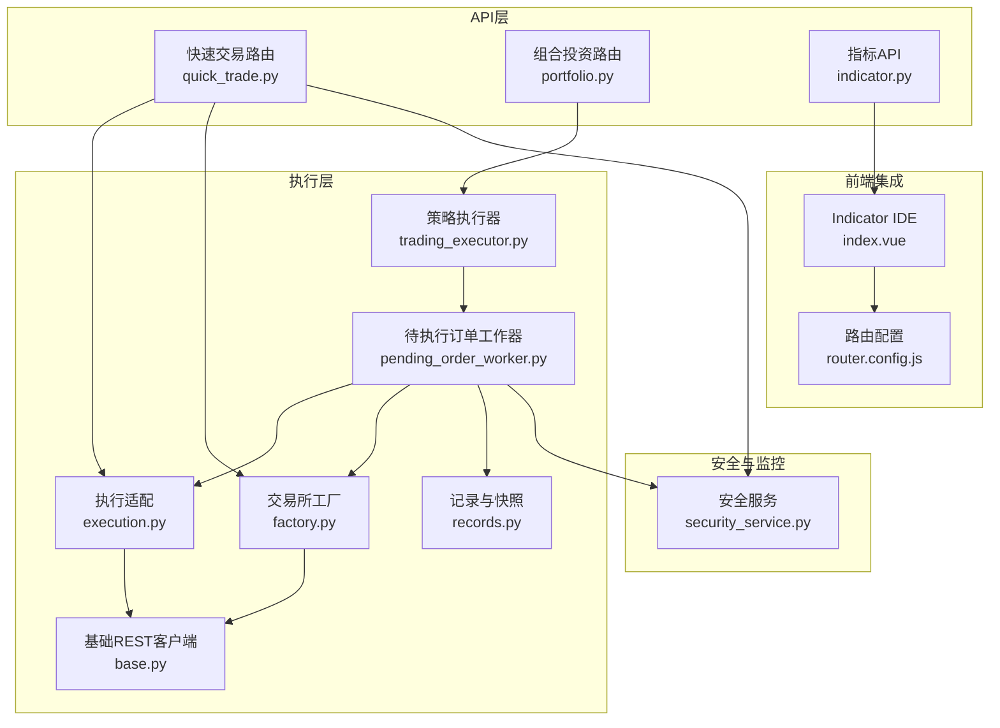
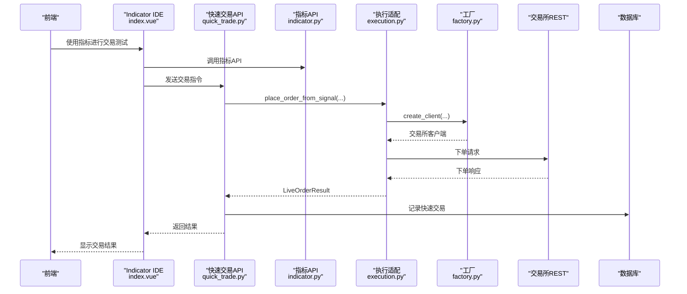
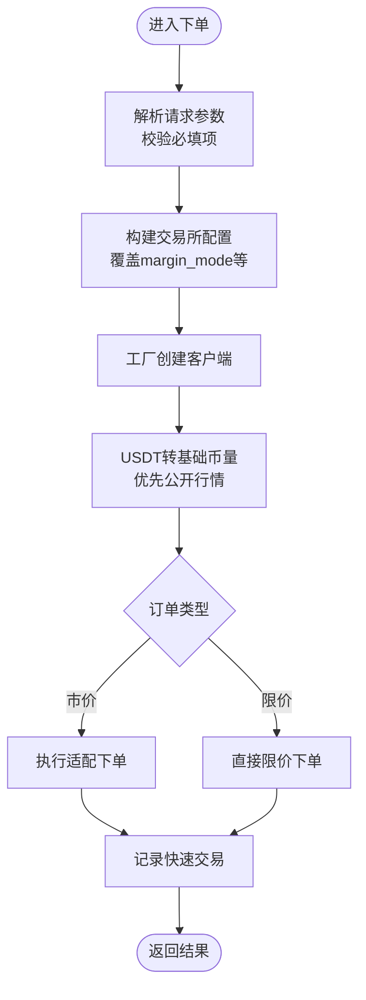
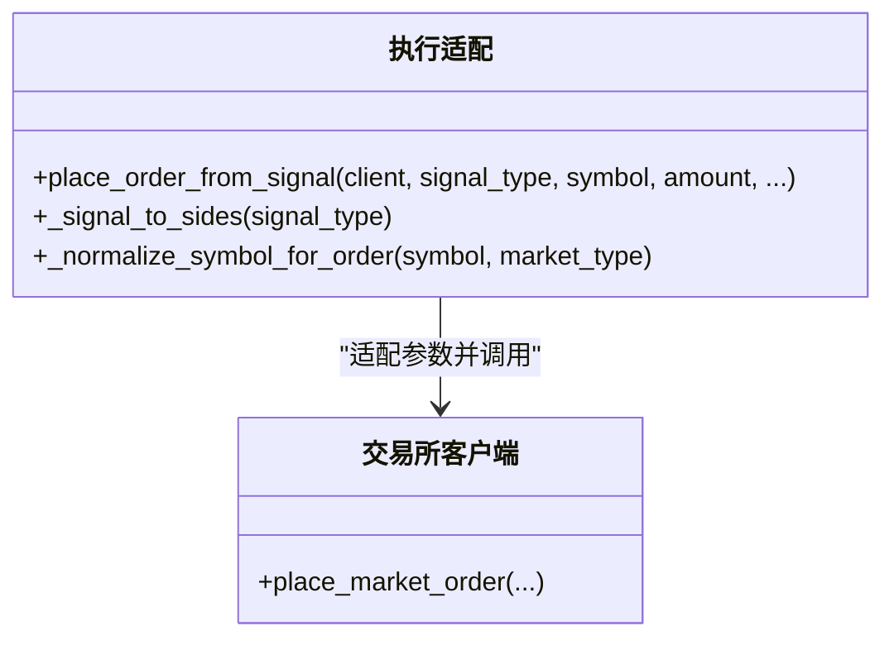
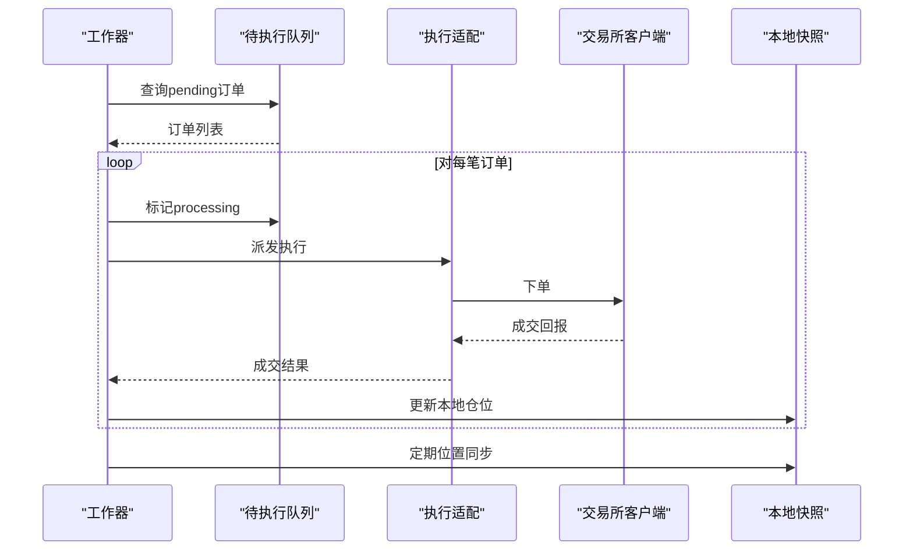
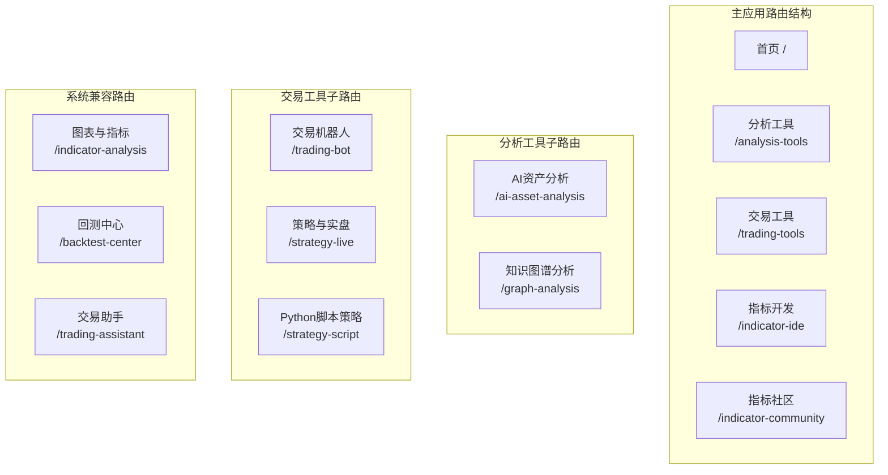
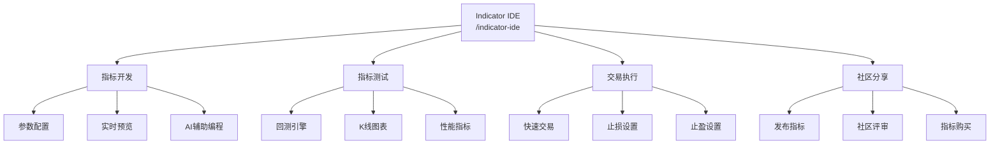
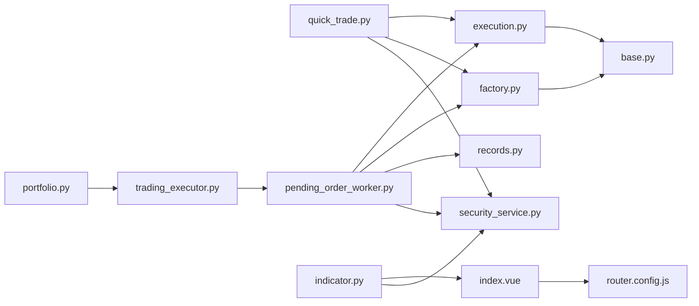

# 交易执行API

<cite>
**本文档引用的文件**
- [quick_trade.py](file://backend/app/routes/quick_trade.py)
- [execution.py](file://backend/app/services/live_trading/execution.py)
- [factory.py](file://backend/app/services/live_trading/factory.py)
- [base.py](file://backend/app/services/live_trading/base.py)
- [records.py](file://backend/app/services/live_trading/records.py)
- [pending_order_worker.py](file://backend/app/services/pending_order_worker.py)
- [trading_executor.py](file://backend/app/services/trading_executor.py)
- [portfolio.py](file://backend/app/routes/portfolio.py)
- [security_service.py](file://backend/app/services/security_service.py)
- [router.config.js](file://frontend/src/config/router.config.js)
- [index.vue](file://frontend/src/views/indicator-ide/index.vue)
- [indicator.py](file://backend/app/route/indicator.py)
</cite>

## 更新摘要
**所做更改**
- 更新前端路由结构，反映Indicator IDE功能整合到主应用架构
- 新增Indicator IDE与交易执行API的集成说明
- 更新路由配置和导航结构的相关文档
- 增强指标开发工具与交易执行系统的协同工作流程

## 目录
1. [简介](#简介)
2. [项目结构](#项目结构)
3. [核心组件](#核心组件)
4. [架构总览](#架构总览)
5. [详细组件分析](#详细组件分析)
6. [前端路由结构调整](#前端路由结构调整)
7. [Indicator IDE功能整合](#indicator-ide功能整合)
8. [依赖关系分析](#依赖关系分析)
9. [性能考虑](#性能考虑)
10. [故障排除指南](#故障排除指南)
11. [结论](#结论)

## 简介
本文件面向QuantDinger项目的交易执行API，系统性梳理快速交易、订单管理、仓位监控、多交易所统一执行接口、订单类型支持与执行算法、实时报价、止损止盈与风控、交易记录与账户资金管理、以及安全与异常处理机制。文档以代码为依据，提供分层说明、可视化图示与实践建议，帮助开发者与运维人员快速理解与扩展系统。

**更新** 本次更新反映了前端路由结构的重大调整，Indicator IDE功能已完全整合到主应用架构中，成为交易执行生态系统的重要组成部分。

## 项目结构
交易执行相关的核心模块分布如下：
- 快速交易路由：提供手动/即时下单、余额查询、历史查询等接口
- 实盘执行服务：统一信号到交易所下单的适配层
- 交易所工厂：根据配置创建不同交易所客户端
- 基础REST客户端：统一HTTP请求封装与证书校验
- 仓位与交易记录：本地快照与回放
- 待执行订单工作器：轮询待执行队列并执行实盘
- 策略执行器：策略信号生成与执行调度
- 组合投资组合路由：手动持仓与监控
- 安全服务：人机验证、登录防护与审计
- Indicator IDE：指标开发与交易策略创建平台

**图表来源**
- [quick_trade.py](file://backend/app/routes/quick_trade.py)
- [execution.py](file://backend/app/services/live_trading/execution.py)
- [factory.py](file://backend/app/services/live_trading/factory.py)
- [base.py](file://backend/app/services/live_trading/base.py)
- [records.py](file://backend/app/services/live_trading/records.py)
- [pending_order_worker.py](file://backend/app/services/pending_order_worker.py)
- [trading_executor.py](file://backend/app/services/trading_executor.py)
- [portfolio.py](file://backend/app/routes/portfolio.py)
- [security_service.py](file://backend/app/services/security_service.py)
- [router.config.js](file://frontend/src/config/router.config.js)
- [index.vue](file://frontend/src/views/indicator-ide/index.vue)
- [indicator.py](file://backend/app/route/indicator.py)

**章节来源**
- [quick_trade.py](file://backend/app/routes/quick_trade.py)
- [execution.py](file://backend/app/services/live_trading/execution.py)
- [factory.py](file://backend/app/services/live_trading/factory.py)
- [base.py](file://backend/app/services/live_trading/base.py)
- [records.py](file://backend/app/services/live_trading/records.py)
- [pending_order_worker.py](file://backend/app/services/pending_order_worker.py)
- [trading_executor.py](file://backend/app/services/trading_executor.py)
- [portfolio.py](file://backend/app/routes/portfolio.py)
- [security_service.py](file://backend/app/services/security_service.py)
- [router.config.js](file://frontend/src/config/router.config.js)
- [index.vue](file://frontend/src/views/indicator-ide/index.vue)
- [indicator.py](file://backend/app/route/indicator.py)

## 核心组件
- 快速交易API：提供手动下单、余额查询、历史查询、头寸查询等接口；内置错误提示解析与USDT转基础币量转换逻辑
- 执行适配层：将策略信号映射为具体交易所下单参数，统一对接多交易所
- 交易所工厂：根据配置动态创建客户端，支持多交易所REST接口
- 基础REST客户端：统一HTTP请求、超时、证书校验与错误处理
- 待执行订单工作器：轮询待执行队列，执行实盘下单与本地仓位同步
- 仓位与交易记录：本地位置快照与成交记录，支持最佳努力一致性
- 策略执行器：策略线程驱动、信号去重、脚本上下文与参数归一化
- 组合投资路由：手动持仓增删改查、实时报价与收益计算
- Indicator IDE：指标开发工具，支持AI辅助编程、参数配置和策略回测
- 安全服务：Turnstile验证、登录尝试记录与封禁、验证码频率限制

**章节来源**
- [quick_trade.py](file://backend/app/routes/quick_trade.py)
- [execution.py](file://backend/app/services/live_trading/execution.py)
- [factory.py](file://backend/app/services/live_trading/factory.py)
- [base.py](file://backend/app/services/live_trading/base.py)
- [pending_order_worker.py](file://backend/app/services/pending_order_worker.py)
- [records.py](file://backend/app/services/live_trading/records.py)
- [trading_executor.py](file://backend/app/services/trading_executor.py)
- [portfolio.py](file://backend/app/routes/portfolio.py)
- [security_service.py](file://backend/app/services/security_service.py)
- [index.vue](file://frontend/src/views/indicator-ide/index.vue)
- [indicator.py](file://backend/app/route/indicator.py)

## 架构总览
交易执行采用"策略信号 → 待执行队列 → 实盘执行"的解耦架构。策略执行器负责生成信号并写入队列；待执行订单工作器轮询队列，通过执行适配层与交易所工厂完成下单；同时维护本地仓位快照，定期与交易所进行最佳努力对账。

**更新** 现在集成了Indicator IDE功能，用户可以在开发指标的同时直接进行交易执行测试，实现从指标开发到实盘执行的一体化工作流程。

**图表来源**
- [quick_trade.py](file://backend/app/routes/quick_trade.py)
- [execution.py](file://backend/app/services/live_trading/execution.py)
- [factory.py](file://backend/app/services/live_trading/factory.py)
- [index.vue](file://frontend/src/views/indicator-ide/index.vue)
- [indicator.py](file://backend/app/route/indicator.py)

**章节来源**
- [quick_trade.py](file://backend/app/routes/quick_trade.py)
- [execution.py](file://backend/app/services/live_trading/execution.py)
- [factory.py](file://backend/app/services/live_trading/factory.py)
- [index.vue](file://frontend/src/views/indicator-ide/index.vue)
- [indicator.py](file://backend/app/route/indicator.py)

## 详细组件分析

### 快速交易API
- 接口能力
  - 下单：支持市价/限价，自动USDT转基础币量，杠杆设置，止盈止损参数透传
  - 余额查询：统一解析多交易所余额响应
  - 历史查询：快速交易历史记录
  - 头寸查询：匹配UI符号与交易所ID，支持永续后缀
- 关键特性
  - 错误提示友好化：基于正则匹配常见错误，返回国际化提示键
  - USDT转换：优先使用交易所公开行情，失败时记录严重警告
  - 客户端配置：支持跨交易所参数覆盖与margin_mode设置
  - 订单ID：生成符合OKX规范的client_order_id
- 数据持久化：记录原始USDT金额、成交均价、状态等

**图表来源**
- [quick_trade.py](file://backend/app/routes/quick_trade.py)

**章节来源**
- [quick_trade.py](file://backend/app/routes/quick_trade.py)

### 执行适配层（统一信号到下单）
- 信号到方向映射：open_long/add_long → buy/long；close_long/reduce_long → sell/long
- 符号规范化：统一处理裸符号、冒号后缀与大小写
- 多交易所参数适配：针对Binance/OKX/Bitget/Bybit/KuCoin/Gate/Kraken/Deepcoin/HTX等差异参数进行归一化
- 特殊处理：OKX需inst_id；Bitget需product_type；Bybit需pos_side；KuCoin/Gate需按方向转换quote/base

**图表来源**
- [execution.py](file://backend/app/services/live_trading/execution.py)

**章节来源**
- [execution.py](file://backend/app/services/live_trading/execution.py)

### 交易所工厂
- 支持交易所：Binance/OKX/Bitget/Bybit/Coinbase/Kraken/KuCoin/Gate/Deepcoin/HTX，以及IBKR/MT5
- 动态创建：根据exchange_id与market_type选择对应客户端
- 演示模式：支持enable_demo_trading参数切换测试网
- 参数兼容：统一base_url、recv_window_ms、broker_referer等

**章节来源**
- [factory.py](file://backend/app/services/live_trading/factory.py)

### 基础REST客户端
- 统一请求封装：超时、URL拼接、JSON解析
- 证书校验：支持LIVE_TRADING_SSL_VERIFY与CA Bundle路径
- 错误处理：TLS错误日志、非JSON响应兜底

**章节来源**
- [base.py](file://backend/app/services/live_trading/base.py)

### 待执行订单工作器
- 轮询与批处理：批量拉取待执行订单，标记processing并派发
- 位置同步：定期与交易所对账，删除幽灵仓位、更新size与entry_price
- 通知与回放：signal模式发送通知；live模式执行下单
- 异常处理：失败标记、重试与日志记录

**图表来源**
- [pending_order_worker.py](file://backend/app/services/pending_order_worker.py)

**章节来源**
- [pending_order_worker.py](file://backend/app/services/pending_order_worker.py)

### 仓位与交易记录
- 本地快照：插入/更新/删除策略仓位，支持最高/最低价格跟踪
- 成交记录：标准化symbol、计算价值与手续费，支持策略维度统计
- 符号归一：统一BTCUSDT/BTC/USDT等格式，提升查找命中率

**章节来源**
- [records.py](file://backend/app/services/live_trading/records.py)

### 策略执行器
- 线程模型：每个策略独立线程，受最大线程数限制
- 信号去重：基于策略ID、符号、信号类型与时间戳的去重缓存
- 脚本上下文：将脚本输出转换为执行信号，支持网格/定投机器人模式
- 资金与权益：根据初始资金与当前头寸计算权益，供脚本使用

**章节来源**
- [trading_executor.py](file://backend/app/services/trading_executor.py)

### 组合投资路由
- 手动持仓：增删改查、标签与分组、批量并发价格获取
- 实时报价：优先实时ticker，降级分钟/日线K线；内置请求间隔与速率限制
- 收益计算：按多头/空头计算市值、成本、盈亏与百分比

**章节来源**
- [portfolio.py](file://backend/app/routes/portfolio.py)

### Indicator IDE功能
- 指标开发：支持Python代码编写、参数配置、实时预览
- AI辅助编程：通过LLM生成和修复指标代码，提供质量提示
- 交易集成：直接从指标界面进行快速交易，支持止损止盈设置
- 回测功能：内置K线图表和回测引擎，支持参数优化
- 社区分享：支持指标发布、评分和社区交流

**章节来源**
- [index.vue](file://frontend/src/views/indicator-ide/index.vue)
- [indicator.py](file://backend/app/route/indicator.py)

### 安全服务
- Turnstile验证：可选的人机验证，失败时拒绝
- 登录防护：IP与账号维度失败次数统计与封禁
- 验证码频率限制：邮箱与IP维度的验证码发送频率控制
- 审计日志：记录安全事件，支持清理过期记录

**章节来源**
- [security_service.py](file://backend/app/services/security_service.py)

## 前端路由结构调整

### 新路由结构
前端路由已完全重构，将Indicator IDE功能整合到主应用架构中：

**图表来源**
- [router.config.js](file://frontend/src/config/router.config.js)

### 路由配置特点
- **统一导航**：所有功能集中在主应用中，提供一致的用户体验
- **兼容性保持**：保留旧路由重定向，确保现有链接正常工作
- **功能整合**：Indicator IDE与交易工具紧密集成，支持从指标开发到交易执行的无缝流程
- **权限控制**：基于角色的访问控制，确保功能可见性和安全性

**章节来源**
- [router.config.js](file://frontend/src/config/router.config.js)

## Indicator IDE功能整合

### 集成架构
Indicator IDE已完全融入主应用路由系统，提供完整的指标开发和交易执行环境：

**图表来源**
- [index.vue](file://frontend/src/views/indicator-ide/index.vue)
- [router.config.js](file://frontend/src/config/router.config.js)

### 核心功能特性
- **一体化开发环境**：在同一界面中完成指标开发、测试和交易执行
- **实时交易集成**：开发的指标可直接用于实时交易决策
- **参数化配置**：支持动态参数调整和实时效果预览
- **AI智能辅助**：提供代码生成、修复和质量优化建议
- **社区生态**：支持指标分享、评价和商业化

**章节来源**
- [index.vue](file://frontend/src/views/indicator-ide/index.vue)
- [indicator.py](file://backend/app/route/indicator.py)

## 依赖关系分析
- 快速交易API依赖执行适配层与工厂，间接依赖基础REST客户端
- 待执行订单工作器依赖执行适配层、工厂与记录模块
- 策略执行器通过工作器与数据库交互，间接依赖记录模块
- 组合投资路由依赖K线服务与并发执行器
- Indicator IDE通过指标API与后端交互，支持实时交易功能
- 前端路由系统统一管理所有功能模块的访问权限和导航结构
- 安全服务为所有路由提供统一的安全能力

**更新** 新增Indicator IDE与交易执行API的双向依赖关系，体现两者在实际使用中的紧密集成。

**图表来源**
- [quick_trade.py](file://backend/app/routes/quick_trade.py)
- [execution.py](file://backend/app/services/live_trading/execution.py)
- [factory.py](file://backend/app/services/live_trading/factory.py)
- [base.py](file://backend/app/services/live_trading/base.py)
- [pending_order_worker.py](file://backend/app/services/pending_order_worker.py)
- [records.py](file://backend/app/services/live_trading/records.py)
- [trading_executor.py](file://backend/app/services/trading_executor.py)
- [portfolio.py](file://backend/app/routes/portfolio.py)
- [security_service.py](file://backend/app/services/security_service.py)
- [index.vue](file://frontend/src/views/indicator-ide/index.vue)
- [router.config.js](file://frontend/src/config/router.config.js)
- [indicator.py](file://backend/app/route/indicator.py)

**章节来源**
- [quick_trade.py](file://backend/app/routes/quick_trade.py)
- [execution.py](file://backend/app/services/live_trading/execution.py)
- [factory.py](file://backend/app/services/live_trading/factory.py)
- [base.py](file://backend/app/services/live_trading/base.py)
- [pending_order_worker.py](file://backend/app/services/pending_order_worker.py)
- [records.py](file://backend/app/services/live_trading/records.py)
- [trading_executor.py](file://backend/app/services/trading_executor.py)
- [portfolio.py](file://backend/app/routes/portfolio.py)
- [security_service.py](file://backend/app/services/security_service.py)
- [index.vue](file://frontend/src/views/indicator-ide/index.vue)
- [router.config.js](file://frontend/src/config/router.config.js)
- [indicator.py](file://backend/app/route/indicator.py)

## 性能考虑
- 并发与限流
  - 快速交易API对公开行情获取设置了超时与降级策略，避免阻塞
  - 组合投资路由使用线程池并发获取价格，并内置请求间隔，降低API限流风险
  - Indicator IDE的AI代码生成功能支持流式响应，避免长时间阻塞
- 线程与资源
  - 策略执行器限制最大线程数，防止资源耗尽
  - 待执行订单工作器支持批量处理，减少数据库压力
  - 前端路由懒加载机制，优化应用启动性能
- 缓存与去重
  - 价格缓存与信号去重缓存降低重复计算与网络请求
  - 指标代码缓存和参数记忆功能提升开发效率
- 日志与可观测性
  - 统一日志记录与资源状态打印，便于定位性能瓶颈
  - Indicator IDE提供详细的代码质量和性能分析报告

## 故障排除指南
- 常见错误提示
  - 余额不足/保证金不足：检查账户可用余额与最小下单量
  - 价格无效/偏离：检查限价与市价波动范围
  - 请求过于频繁：遵循交易所限流规则，合理设置重试间隔
  - API密钥/权限：确认密钥有效、签名正确、IP白名单
  - 仓位冲突/仅减仓：检查是否已有反向仓位
  - 网络/超时：检查代理与证书配置
  - 交易所维护：关注交易所公告
- 快速交易下单失败
  - 查看错误提示键，结合日志定位原因
  - USDT转换失败会记录严重警告，需检查行情API连通性
- 仓位不同步
  - 启用位置同步开关，定期触发同步
  - 检查策略允许交易的symbol列表，避免同步无关头寸
- Indicator IDE相关问题
  - 代码验证失败：检查语法错误和参数配置
  - AI生成失败：确认LLM服务配置和积分余额
  - 交易执行异常：检查指标逻辑和止损止盈设置
- 安全与风控
  - Turnstile未配置时将跳过验证，建议启用以增强安全性
  - 登录失败过多会被临时封禁，注意IP与账号维度的失败阈值

**章节来源**
- [quick_trade.py](file://backend/app/routes/quick_trade.py)
- [pending_order_worker.py](file://backend/app/services/pending_order_worker.py)
- [security_service.py](file://backend/app/services/security_service.py)
- [index.vue](file://frontend/src/views/indicator-ide/index.vue)
- [indicator.py](file://backend/app/route/indicator.py)

## 结论
QuantDinger的交易执行API通过"策略信号 → 待执行队列 → 实盘执行"的架构实现了多交易所统一接入与高内聚低耦合的设计。快速交易API提供便捷的手动下单体验，执行适配层与工厂保证了跨交易所一致性，待执行订单工作器与本地快照提供了稳健的实盘执行与对账能力。

**更新** 本次架构升级显著增强了系统的集成度和用户体验。Indicator IDE功能的完全整合使得用户能够从指标开发到实盘执行形成完整的工作流程，前端路由结构的优化确保了功能的统一管理和访问控制。配合安全服务与性能优化策略，系统在易用性、稳定性与安全性方面达到良好平衡。

建议在生产环境中启用Turnstile验证、合理配置限流与重试策略，并定期审查位置同步与日志监控。对于Indicator IDE功能，建议充分利用其AI辅助编程能力和实时交易集成功能，以提升指标开发和交易执行的效率。