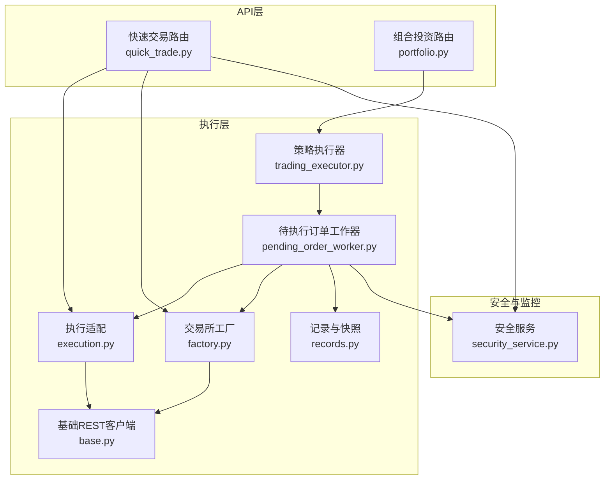
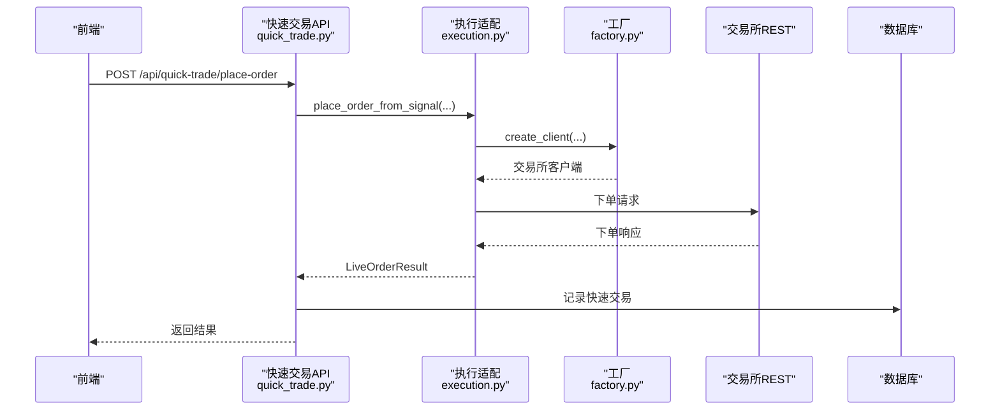
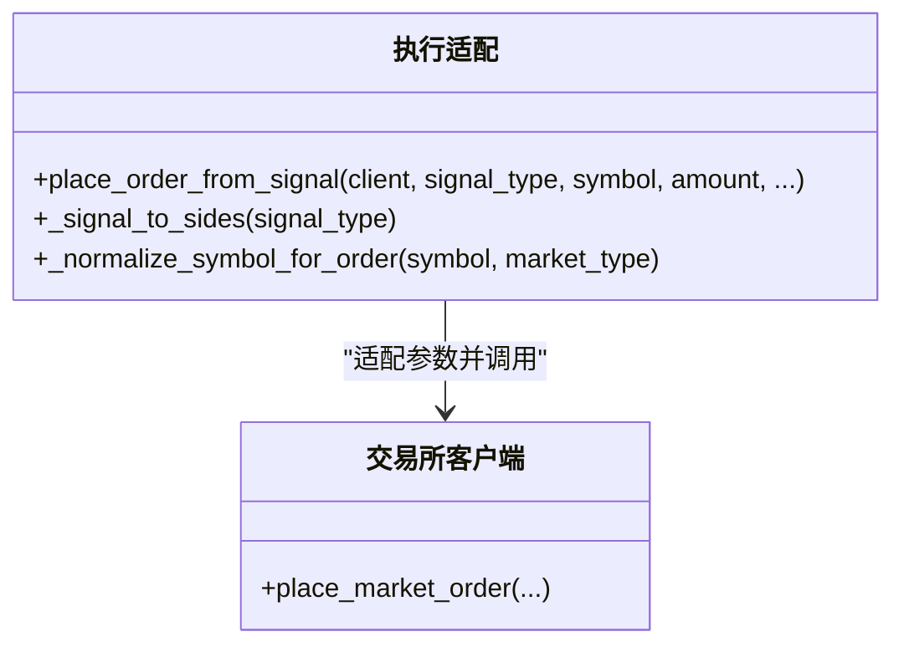
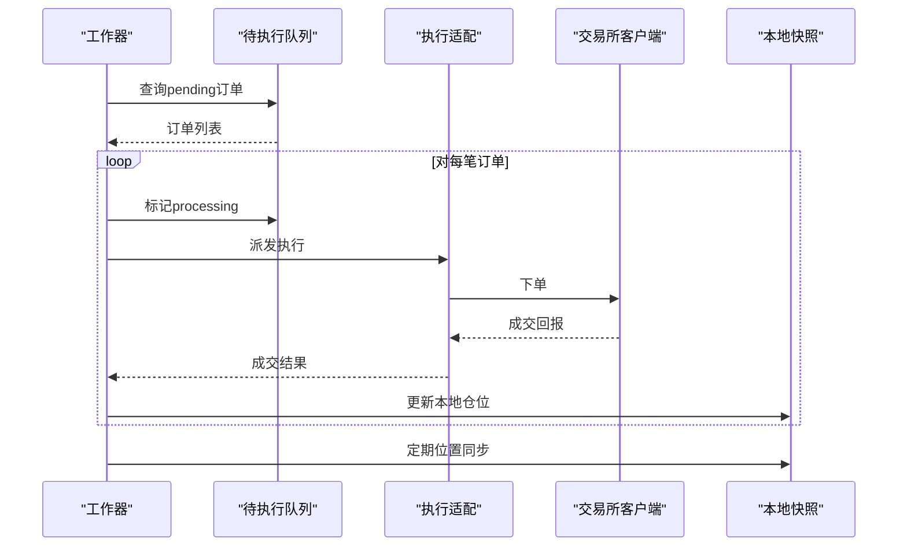
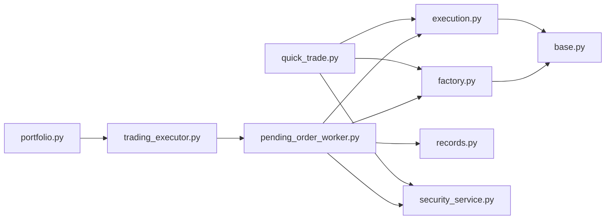

# 交易执行API

<cite>
**本文档引用的文件**
- [quick_trade.py](file://backend_api_python/app/routes/quick_trade.py)
- [execution.py](file://backend_api_python/app/services/live_trading/execution.py)
- [factory.py](file://backend_api_python/app/services/live_trading/factory.py)
- [base.py](file://backend_api_python/app/services/live_trading/base.py)
- [records.py](file://backend_api_python/app/services/live_trading/records.py)
- [pending_order_worker.py](file://backend_api_python/app/services/pending_order_worker.py)
- [trading_executor.py](file://backend_api_python/app/services/trading_executor.py)
- [portfolio.py](file://backend_api_python/app/routes/portfolio.py)
- [security_service.py](file://backend_api_python/app/services/security_service.py)
</cite>

## 目录
1. [简介](#简介)
2. [项目结构](#项目结构)
3. [核心组件](#核心组件)
4. [架构总览](#架构总览)
5. [详细组件分析](#详细组件分析)
6. [依赖关系分析](#依赖关系分析)
7. [性能考虑](#性能考虑)
8. [故障排除指南](#故障排除指南)
9. [结论](#结论)

## 简介
本文件面向QuantDinger项目的交易执行API，系统性梳理快速交易、订单管理、仓位监控、多交易所统一执行接口、订单类型支持与执行算法、实时报价、止损止盈与风控、交易记录与账户资金管理、以及安全与异常处理机制。文档以代码为依据，提供分层说明、可视化图示与实践建议，帮助开发者与运维人员快速理解与扩展系统。

## 项目结构
交易执行相关的核心模块分布如下：
- 快速交易路由：提供手动/即时下单、余额查询、历史查询等接口
- 实盘执行服务：统一信号到交易所下单的适配层
- 交易所工厂：根据配置创建不同交易所客户端
- 基础REST客户端：统一HTTP请求封装与证书校验
- 仓位与交易记录：本地快照与回放
- 待执行订单工作器：轮询待执行队列并执行实盘
- 策略执行器：策略信号生成与执行调度
- 组合投资组合路由：手动持仓与监控
- 安全服务：人机验证、登录防护与审计

**图表来源**
- [quick_trade.py:1-1707](file://backend_api_python/app/routes/quick_trade.py#L1-L1707)
- [execution.py:1-426](file://backend_api_python/app/services/live_trading/execution.py#L1-L426)
- [factory.py:1-355](file://backend_api_python/app/services/live_trading/factory.py#L1-L355)
- [base.py:1-158](file://backend_api_python/app/services/live_trading/base.py#L1-L158)
- [records.py:1-280](file://backend_api_python/app/services/live_trading/records.py#L1-L280)
- [pending_order_worker.py:1-2439](file://backend_api_python/app/services/pending_order_worker.py#L1-L2439)
- [trading_executor.py:1-3833](file://backend_api_python/app/services/trading_executor.py#L1-L3833)
- [portfolio.py:1-1794](file://backend_api_python/app/routes/portfolio.py#L1-L1794)
- [security_service.py:1-399](file://backend_api_python/app/services/security_service.py#L1-L399)

**章节来源**
- [quick_trade.py:1-1707](file://backend_api_python/app/routes/quick_trade.py#L1-L1707)
- [execution.py:1-426](file://backend_api_python/app/services/live_trading/execution.py#L1-L426)
- [factory.py:1-355](file://backend_api_python/app/services/live_trading/factory.py#L1-L355)
- [base.py:1-158](file://backend_api_python/app/services/live_trading/base.py#L1-L158)
- [records.py:1-280](file://backend_api_python/app/services/live_trading/records.py#L1-L280)
- [pending_order_worker.py:1-2439](file://backend_api_python/app/services/pending_order_worker.py#L1-L2439)
- [trading_executor.py:1-3833](file://backend_api_python/app/services/trading_executor.py#L1-L3833)
- [portfolio.py:1-1794](file://backend_api_python/app/routes/portfolio.py#L1-L1794)
- [security_service.py:1-399](file://backend_api_python/app/services/security_service.py#L1-L399)

## 核心组件
- 快速交易API：提供手动下单、余额查询、历史查询、头寸查询等接口；内置错误提示解析与USDT转基础币量转换逻辑
- 执行适配层：将策略信号映射为具体交易所下单参数，统一对接多交易所
- 交易所工厂：根据配置动态创建客户端，支持多交易所REST接口
- 基础REST客户端：统一HTTP请求、超时、证书校验与错误处理
- 待执行订单工作器：轮询待执行队列，执行实盘下单与本地仓位同步
- 仓位与交易记录：本地位置快照与成交记录，支持最佳努力一致性
- 策略执行器：策略线程驱动、信号去重、脚本上下文与参数归一化
- 组合投资路由：手动持仓增删改查、实时报价与收益计算
- 安全服务：Turnstile验证、登录尝试记录与封禁、验证码频率限制

**章节来源**
- [quick_trade.py:1-1707](file://backend_api_python/app/routes/quick_trade.py#L1-L1707)
- [execution.py:1-426](file://backend_api_python/app/services/live_trading/execution.py#L1-L426)
- [factory.py:1-355](file://backend_api_python/app/services/live_trading/factory.py#L1-L355)
- [base.py:1-158](file://backend_api_python/app/services/live_trading/base.py#L1-L158)
- [pending_order_worker.py:1-2439](file://backend_api_python/app/services/pending_order_worker.py#L1-L2439)
- [records.py:1-280](file://backend_api_python/app/services/live_trading/records.py#L1-L280)
- [trading_executor.py:1-3833](file://backend_api_python/app/services/trading_executor.py#L1-L3833)
- [portfolio.py:1-1794](file://backend_api_python/app/routes/portfolio.py#L1-L1794)
- [security_service.py:1-399](file://backend_api_python/app/services/security_service.py#L1-L399)

## 架构总览
交易执行采用“策略信号 → 待执行队列 → 实盘执行”的解耦架构。策略执行器负责生成信号并写入队列；待执行订单工作器轮询队列，通过执行适配层与交易所工厂完成下单；同时维护本地仓位快照，定期与交易所进行最佳努力对账。

**图表来源**
- [quick_trade.py:348-608](file://backend_api_python/app/routes/quick_trade.py#L348-L608)
- [execution.py:123-311](file://backend_api_python/app/services/live_trading/execution.py#L123-L311)
- [factory.py:59-218](file://backend_api_python/app/services/live_trading/factory.py#L59-L218)

**章节来源**
- [quick_trade.py:348-608](file://backend_api_python/app/routes/quick_trade.py#L348-L608)
- [execution.py:123-311](file://backend_api_python/app/services/live_trading/execution.py#L123-L311)
- [factory.py:59-218](file://backend_api_python/app/services/live_trading/factory.py#L59-L218)

## 详细组件分析

### 快速交易API
- 接口能力
  - 下单：支持市价/限价，自动USDT转基础币量，杠杆设置，止盈止损参数透传
  - 余额查询：统一解析多交易所余额响应
  - 历史查询：快速交易历史记录
  - 头寸查询：匹配UI符号与交易所ID，支持永续后缀
- 关键特性
  - 错误提示友好化：基于正则匹配常见错误，返回国际化提示键
  - USDT转换：优先使用交易所公开行情，失败时记录严重警告
  - 客户端配置：支持跨交易所参数覆盖与margin_mode设置
  - 订单ID：生成符合OKX规范的client_order_id
- 数据持久化：记录原始USDT金额、成交均价、状态等

**图表来源**
- [quick_trade.py:348-570](file://backend_api_python/app/routes/quick_trade.py#L348-L570)

**章节来源**
- [quick_trade.py:1-1707](file://backend_api_python/app/routes/quick_trade.py#L1-L1707)

### 执行适配层（统一信号到下单）
- 信号到方向映射：open_long/add_long → buy/long；close_long/reduce_long → sell/long
- 符号规范化：统一处理裸符号、冒号后缀与大小写
- 多交易所参数适配：针对Binance/OKX/Bitget/Bybit/KuCoin/Gate/Kraken/Deepcoin/HTX等差异参数进行归一化
- 特殊处理：OKX需inst_id；Bitget需product_type；Bybit需pos_side；KuCoin/Gate需按方向转换quote/base

**图表来源**
- [execution.py:85-311](file://backend_api_python/app/services/live_trading/execution.py#L85-L311)

**章节来源**
- [execution.py:1-426](file://backend_api_python/app/services/live_trading/execution.py#L1-L426)

### 交易所工厂
- 支持交易所：Binance/OKX/Bitget/Bybit/Coinbase/Kraken/KuCoin/Gate/Deepcoin/HTX，以及IBKR/MT5
- 动态创建：根据exchange_id与market_type选择对应客户端
- 演示模式：支持enable_demo_trading参数切换测试网
- 参数兼容：统一base_url、recv_window_ms、broker_referer等

**章节来源**
- [factory.py:1-355](file://backend_api_python/app/services/live_trading/factory.py#L1-L355)

### 基础REST客户端
- 统一请求封装：超时、URL拼接、JSON解析
- 证书校验：支持LIVE_TRADING_SSL_VERIFY与CA Bundle路径
- 错误处理：TLS错误日志、非JSON响应兜底

**章节来源**
- [base.py:1-158](file://backend_api_python/app/services/live_trading/base.py#L1-L158)

### 待执行订单工作器
- 轮询与批处理：批量拉取待执行订单，标记processing并派发
- 位置同步：定期与交易所对账，删除幽灵仓位、更新size与entry_price
- 通知与回放：signal模式发送通知；live模式执行下单
- 异常处理：失败标记、重试与日志记录

**图表来源**
- [pending_order_worker.py:91-800](file://backend_api_python/app/services/pending_order_worker.py#L91-L800)

**章节来源**
- [pending_order_worker.py:1-2439](file://backend_api_python/app/services/pending_order_worker.py#L1-L2439)

### 仓位与交易记录
- 本地快照：插入/更新/删除策略仓位，支持最高/最低价格跟踪
- 成交记录：标准化symbol、计算价值与手续费，支持策略维度统计
- 符号归一：统一BTCUSDT/BTC/USDT等格式，提升查找命中率

**章节来源**
- [records.py:1-280](file://backend_api_python/app/services/live_trading/records.py#L1-L280)

### 策略执行器
- 线程模型：每个策略独立线程，受最大线程数限制
- 信号去重：基于策略ID、符号、信号类型与时间戳的去重缓存
- 脚本上下文：将脚本输出转换为执行信号，支持网格/定投机器人模式
- 资金与权益：根据初始资金与当前头寸计算权益，供脚本使用

**章节来源**
- [trading_executor.py:1-3833](file://backend_api_python/app/services/trading_executor.py#L1-L3833)

### 组合投资路由
- 手动持仓：增删改查、标签与分组、批量并发价格获取
- 实时报价：优先实时ticker，降级分钟/日线K线；内置请求间隔与速率限制
- 收益计算：按多头/空头计算市值、成本、盈亏与百分比

**章节来源**
- [portfolio.py:1-1794](file://backend_api_python/app/routes/portfolio.py#L1-L1794)

### 安全服务
- Turnstile验证：可选的人机验证，失败时拒绝
- 登录防护：IP与账号维度失败次数统计与封禁
- 验证码频率限制：邮箱与IP维度的验证码发送频率控制
- 审计日志：记录安全事件，支持清理过期记录

**章节来源**
- [security_service.py:1-399](file://backend_api_python/app/services/security_service.py#L1-L399)

## 依赖关系分析
- 快速交易API依赖执行适配层与工厂，间接依赖基础REST客户端
- 待执行订单工作器依赖执行适配层、工厂与记录模块
- 策略执行器通过工作器与数据库交互，间接依赖记录模块
- 组合投资路由依赖K线服务与并发执行器
- 安全服务为所有路由提供统一的安全能力

**图表来源**
- [quick_trade.py:1-1707](file://backend_api_python/app/routes/quick_trade.py#L1-L1707)
- [execution.py:1-426](file://backend_api_python/app/services/live_trading/execution.py#L1-L426)
- [factory.py:1-355](file://backend_api_python/app/services/live_trading/factory.py#L1-L355)
- [base.py:1-158](file://backend_api_python/app/services/live_trading/base.py#L1-L158)
- [pending_order_worker.py:1-2439](file://backend_api_python/app/services/pending_order_worker.py#L1-L2439)
- [records.py:1-280](file://backend_api_python/app/services/live_trading/records.py#L1-L280)
- [trading_executor.py:1-3833](file://backend_api_python/app/services/trading_executor.py#L1-L3833)
- [portfolio.py:1-1794](file://backend_api_python/app/routes/portfolio.py#L1-L1794)
- [security_service.py:1-399](file://backend_api_python/app/services/security_service.py#L1-L399)

**章节来源**
- [quick_trade.py:1-1707](file://backend_api_python/app/routes/quick_trade.py#L1-L1707)
- [execution.py:1-426](file://backend_api_python/app/services/live_trading/execution.py#L1-L426)
- [factory.py:1-355](file://backend_api_python/app/services/live_trading/factory.py#L1-L355)
- [base.py:1-158](file://backend_api_python/app/services/live_trading/base.py#L1-L158)
- [pending_order_worker.py:1-2439](file://backend_api_python/app/services/pending_order_worker.py#L1-L2439)
- [records.py:1-280](file://backend_api_python/app/services/live_trading/records.py#L1-L280)
- [trading_executor.py:1-3833](file://backend_api_python/app/services/trading_executor.py#L1-L3833)
- [portfolio.py:1-1794](file://backend_api_python/app/routes/portfolio.py#L1-L1794)
- [security_service.py:1-399](file://backend_api_python/app/services/security_service.py#L1-L399)

## 性能考虑
- 并发与限流
  - 快速交易API对公开行情获取设置了超时与降级策略，避免阻塞
  - 组合投资路由使用线程池并发获取价格，并内置请求间隔，降低API限流风险
- 线程与资源
  - 策略执行器限制最大线程数，防止资源耗尽
  - 待执行订单工作器支持批量处理，减少数据库压力
- 缓存与去重
  - 价格缓存与信号去重缓存降低重复计算与网络请求
- 日志与可观测性
  - 统一日志记录与资源状态打印，便于定位性能瓶颈

[本节为通用指导，无需特定文件引用]

## 故障排除指南
- 常见错误提示
  - 余额不足/保证金不足：检查账户可用余额与最小下单量
  - 价格无效/偏离：检查限价与市价波动范围
  - 请求过于频繁：遵循交易所限流规则，合理设置重试间隔
  - API密钥/权限：确认密钥有效、签名正确、IP白名单
  - 仓位冲突/仅减仓：检查是否已有反向仓位
  - 网络/超时：检查代理与证书配置
  - 交易所维护：关注交易所公告
- 快速交易下单失败
  - 查看错误提示键，结合日志定位原因
  - USDT转换失败会记录严重警告，需检查行情API连通性
- 仓位不同步
  - 启用位置同步开关，定期触发同步
  - 检查策略允许交易的symbol列表，避免同步无关头寸
- 安全与风控
  - Turnstile未配置时将跳过验证，建议启用以增强安全性
  - 登录失败过多会被临时封禁，注意IP与账号维度的失败阈值

**章节来源**
- [quick_trade.py:34-69](file://backend_api_python/app/routes/quick_trade.py#L34-L69)
- [pending_order_worker.py:138-636](file://backend_api_python/app/services/pending_order_worker.py#L138-L636)
- [security_service.py:72-110](file://backend_api_python/app/services/security_service.py#L72-L110)

## 结论
QuantDinger的交易执行API通过“策略信号 → 待执行队列 → 实盘执行”的架构实现了多交易所统一接入与高内聚低耦合的设计。快速交易API提供便捷的手动下单体验，执行适配层与工厂保证了跨交易所一致性，待执行订单工作器与本地快照提供了稳健的实盘执行与对账能力。配合安全服务与性能优化策略，系统在易用性、稳定性与安全性方面达到良好平衡。建议在生产环境中启用Turnstile验证、合理配置限流与重试策略，并定期审查位置同步与日志监控。