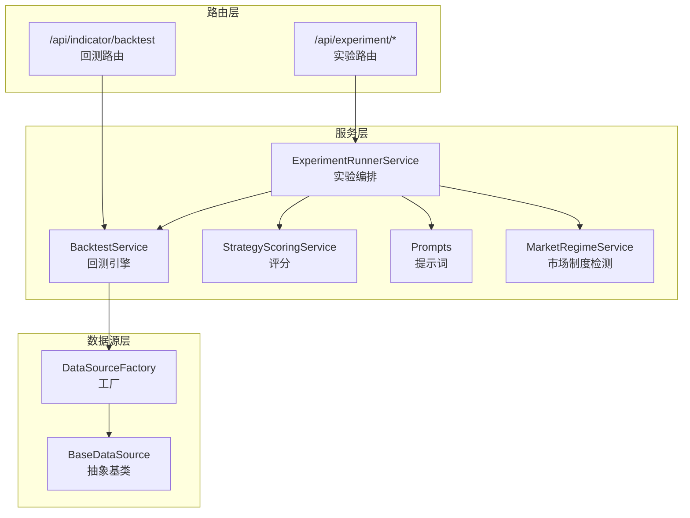
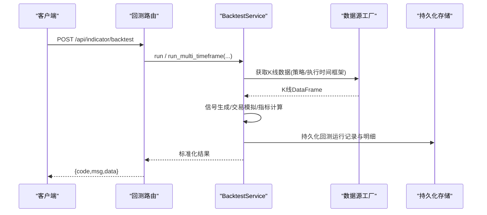
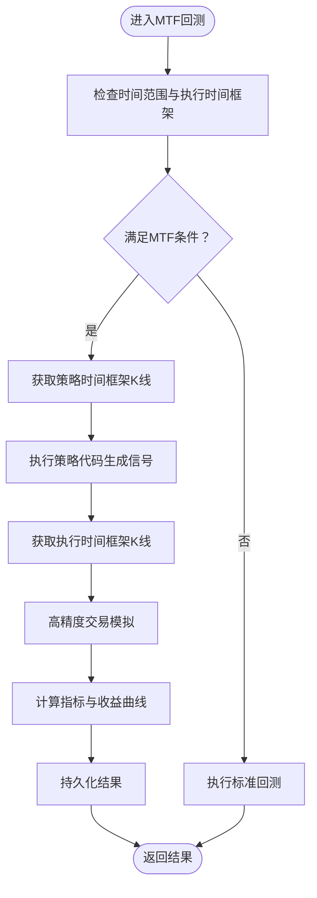
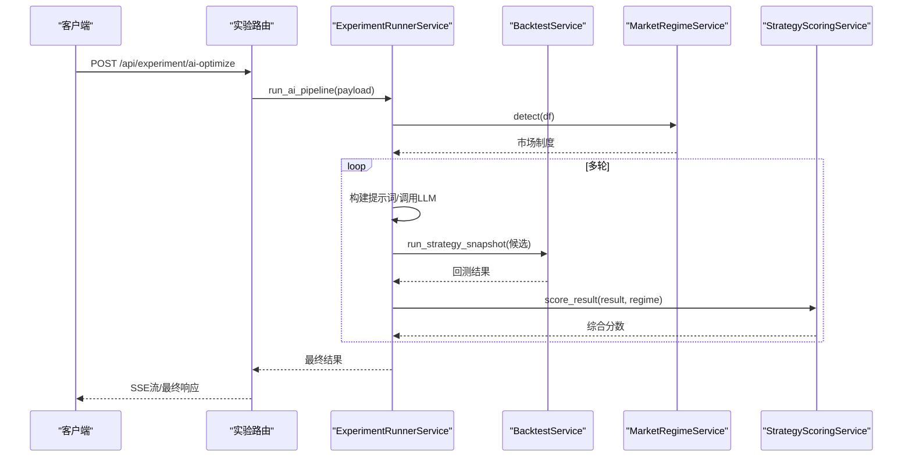
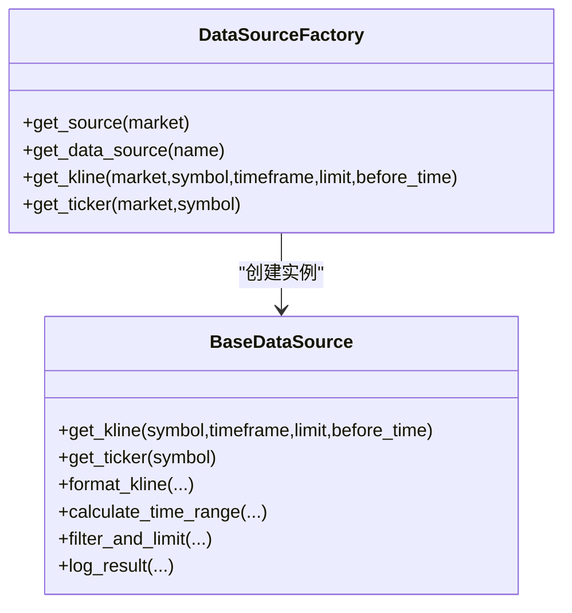
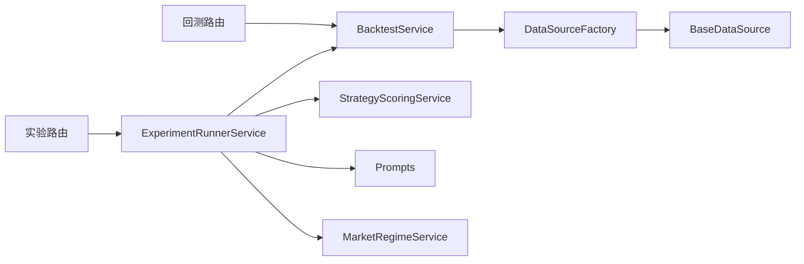

# 回测API

<cite>
**本文档引用的文件**
- [app/routes/backtest.py](file://backend_api_python/app/routes/backtest.py)
- [app/services/backtest.py](file://backend_api_python/app/services/backtest.py)
- [app/routes/experiment.py](file://backend_api_python/app/routes/experiment.py)
- [app/services/experiment/runner.py](file://backend_api_python/app/services/experiment/runner.py)
- [app/services/experiment/scoring.py](file://backend_api_python/app/services/experiment/scoring.py)
- [app/services/experiment/prompts.py](file://backend_api_python/app/services/experiment/prompts.py)
- [app/services/experiment/regime.py](file://backend_api_python/app/services/experiment/regime.py)
- [app/data_sources/factory.py](file://backend_api_python/app/data_sources/factory.py)
- [app/data_sources/base.py](file://backend_api_python/app/data_sources/base.py)
- [app/__init__.py](file://backend_api_python/app/__init__.py)
- [app/routes/__init__.py](file://backend_api_python/app/routes/__init__.py)
</cite>

## 目录
1. [简介](#简介)
2. [项目结构](#项目结构)
3. [核心组件](#核心组件)
4. [架构总览](#架构总览)
5. [详细组件分析](#详细组件分析)
6. [依赖关系分析](#依赖关系分析)
7. [性能考量](#性能考量)
8. [故障排查指南](#故障排查指南)
9. [结论](#结论)
10. [附录](#附录)

## 简介
本文件系统性梳理 QuantDinger 后端的回测API能力，覆盖历史数据回测、参数优化与实验管理接口，包括：
- 回测任务创建、状态查询、结果获取与性能分析
- 多市场数据获取、时间范围选择与数据预处理
- 多时间框架（MTF）高精度回测与标准回测切换
- 实验管线（AI驱动/结构化搜索）与参数空间探索
- 结果数据格式、图表展示与统计指标说明
- 并行回测与大规模数据处理的优化建议

## 项目结构
后端采用 Flask + Blueprints 的模块化组织方式，回测与实验相关的核心模块如下：
- 路由层：负责HTTP接口定义与鉴权
- 服务层：封装回测引擎、实验编排、评分与提示词构建
- 数据源层：抽象多市场数据获取与缓存

**图示来源**
- [app/routes/backtest.py](file://backend_api_python/app/routes/backtest.py)
- [app/services/backtest.py](file://backend_api_python/app/services/backtest.py)
- [app/routes/experiment.py](file://backend_api_python/app/routes/experiment.py)
- [app/services/experiment/runner.py](file://backend_api_python/app/services/experiment/runner.py)
- [app/services/experiment/scoring.py](file://backend_api_python/app/services/experiment/scoring.py)
- [app/services/experiment/prompts.py](file://backend_api_python/app/services/experiment/prompts.py)
- [app/services/experiment/regime.py](file://backend_api_python/app/services/experiment/regime.py)
- [app/data_sources/factory.py](file://backend_api_python/app/data_sources/factory.py)
- [app/data_sources/base.py](file://backend_api_python/app/data_sources/base.py)

**章节来源**
- [app/routes/__init__.py](file://backend_api_python/app/routes/__init__.py)
- [app/__init__.py](file://backend_api_python/app/__init__.py)

## 核心组件
- 回测路由与服务
  - 提供回测任务创建、历史查询、详情获取与精度信息查询
  - 支持标准回测与多时间框架（MTF）高精度回测
- 实验路由与编排
  - 提供市场制度检测、AI多轮优化、结构化网格/随机搜索、保存最佳策略等
- 数据源工厂与抽象
  - 统一多市场（加密、美股、期货、外汇等）数据访问与缓存
- 评分与提示词
  - 将回测结果转换为可比较的综合分数，构建LLM优化提示词

**章节来源**
- [app/routes/backtest.py](file://backend_api_python/app/routes/backtest.py)
- [app/services/backtest.py](file://backend_api_python/app/services/backtest.py)
- [app/routes/experiment.py](file://backend_api_python/app/routes/experiment.py)
- [app/services/experiment/runner.py](file://backend_api_python/app/services/experiment/runner.py)
- [app/services/experiment/scoring.py](file://backend_api_python/app/services/experiment/scoring.py)
- [app/services/experiment/prompts.py](file://backend_api_python/app/services/experiment/prompts.py)
- [app/services/experiment/regime.py](file://backend_api_python/app/services/experiment/regime.py)
- [app/data_sources/factory.py](file://backend_api_python/app/data_sources/factory.py)
- [app/data_sources/base.py](file://backend_api_python/app/data_sources/base.py)

## 架构总览
回测API的典型调用链：
- 客户端发起回测请求（或进入实验管线）
- 路由层校验鉴权并解析参数
- 服务层执行回测或实验编排
- 数据源层按市场类型拉取K线数据
- 回测引擎计算指标并持久化结果
- 返回标准化结果给客户端

**图示来源**
- [app/routes/backtest.py](file://backend_api_python/app/routes/backtest.py)
- [app/services/backtest.py](file://backend_api_python/app/services/backtest.py)
- [app/data_sources/factory.py](file://backend_api_python/app/data_sources/factory.py)

## 详细组件分析

### 回测路由与接口
- 接口概览
  - 获取回测精度信息：GET /api/indicator/backtest/precision-info
  - 创建回测任务：POST /api/indicator/backtest
  - 查询回测历史：GET /api/indicator/backtest/history
  - 获取回测详情：GET /api/indicator/backtest/get
- 关键参数
  - indicatorCode/indicatorId：策略代码或ID
  - symbol/market/timeframe：标的、市场、策略时间框架
  - startDate/endDate：回测起止日期
  - initialCapital/commission/slippage/leverage/tradeDirection：资金与交易假设
  - strategyConfig：策略配置（风控、仓位、加仓/减仓等）
  - enableMtf/persist：是否启用MTF、是否持久化
- 行为特性
  - 标准回测：按策略时间框架生成信号，按策略时间框架执行
  - MTF回测：策略时间框架生成信号，1分钟/5分钟高精度执行，自动范围限制与降级
  - 历史与详情：支持分页查询与按条件过滤
  - 精度信息：根据时间范围自动推荐执行时间框架

**章节来源**
- [app/routes/backtest.py](file://backend_api_python/app/routes/backtest.py)
- [app/services/backtest.py](file://backend_api_python/app/services/backtest.py)

### 回测服务与引擎
- 执行时间框架选择
  - 仅加密市场支持高精度回测
  - 15天内：1分钟；15-365天：5分钟；更长：不支持高精度
- 多时间框架回测
  - 策略时间框架用于信号生成
  - 执行时间框架用于精确交易模拟（1分钟/5分钟）
  - 不满足条件时自动降级为标准回测
- 交易模拟与指标计算
  - 支持止盈止损、移动止盈、杠杆、滑点与手续费
  - 计算收益曲线、交易明细、关键指标（总收益、年化收益、胜率、最大回撤、夏普比率、盈亏比等）
- 结果持久化
  - 回测运行记录、交易明细、净值点位分别入库
  - 支持按用户、指标/策略ID、市场、时间框架等维度查询

**图示来源**
- [app/services/backtest.py](file://backend_api_python/app/services/backtest.py)

**章节来源**
- [app/services/backtest.py](file://backend_api_python/app/services/backtest.py)

### 实验与参数优化
- 市场制度检测
  - 基于特征提取与规则分类，输出趋势/震荡/区间收敛/高波动等制度标签
- 实验编排
  - AI多轮优化：构建提示词，调用LLM生成候选参数集，批量回测、评分、排序、早停
  - 结构化搜索：在指定参数空间内进行网格/随机搜索
  - 保存最佳策略：将最优候选持久化为策略记录
- 评分体系
  - 综合return、annualReturn、sharpe、profitFactor、winRate、drawdown、stability等维度
  - 支持按制度拟合度加权
- 提示词工程
  - 从策略代码中抽取可调参数注解，结合制度与历史结果指导参数探索方向

**图示来源**
- [app/routes/experiment.py](file://backend_api_python/app/routes/experiment.py)
- [app/services/experiment/runner.py](file://backend_api_python/app/services/experiment/runner.py)
- [app/services/experiment/regime.py](file://backend_api_python/app/services/experiment/regime.py)
- [app/services/experiment/scoring.py](file://backend_api_python/app/services/experiment/scoring.py)

**章节来源**
- [app/routes/experiment.py](file://backend_api_python/app/routes/experiment.py)
- [app/services/experiment/runner.py](file://backend_api_python/app/services/experiment/runner.py)
- [app/services/experiment/regime.py](file://backend_api_python/app/services/experiment/regime.py)
- [app/services/experiment/scoring.py](file://backend_api_python/app/services/experiment/scoring.py)
- [app/services/experiment/prompts.py](file://backend_api_python/app/services/experiment/prompts.py)

### 数据源与多市场支持
- 工厂模式
  - 根据市场类型返回对应数据源实例（加密、美股、港股、期货、外汇等）
  - 提供便捷方法：获取K线、获取实时报价
- 抽象基类
  - 统一K线格式、时间范围计算、数据过滤与限制、延迟检测日志
- 缓存与限速
  - 内存K线缓存（带TTL），避免重复外部调用
  - 速率限制器（在具体数据源实现中）

**图示来源**
- [app/data_sources/base.py](file://backend_api_python/app/data_sources/base.py)
- [app/data_sources/factory.py](file://backend_api_python/app/data_sources/factory.py)

**章节来源**
- [app/data_sources/base.py](file://backend_api_python/app/data_sources/base.py)
- [app/data_sources/factory.py](file://backend_api_python/app/data_sources/factory.py)

## 依赖关系分析
- 路由到服务
  - 回测路由依赖 BacktestService
  - 实验路由依赖 ExperimentRunnerService
- 服务到数据源
  - BacktestService 通过 DataSourceFactory 获取各市场K线
- 服务内聚与耦合
  - BacktestService 内部职责清晰：数据获取、信号生成、交易模拟、指标计算、持久化
  - 实验编排服务组合多个子服务（评分、提示词、制度检测）
- 外部依赖
  - 数据源实现依赖外部交易所/数据提供商API
  - 实验管线可选依赖 LLM 服务（用于AI多轮优化）

**图示来源**
- [app/routes/backtest.py](file://backend_api_python/app/routes/backtest.py)
- [app/services/backtest.py](file://backend_api_python/app/services/backtest.py)
- [app/routes/experiment.py](file://backend_api_python/app/routes/experiment.py)
- [app/services/experiment/runner.py](file://backend_api_python/app/services/experiment/runner.py)
- [app/services/experiment/scoring.py](file://backend_api_python/app/services/experiment/scoring.py)
- [app/services/experiment/prompts.py](file://backend_api_python/app/services/experiment/prompts.py)
- [app/services/experiment/regime.py](file://backend_api_python/app/services/experiment/regime.py)
- [app/data_sources/factory.py](file://backend_api_python/app/data_sources/factory.py)
- [app/data_sources/base.py](file://backend_api_python/app/data_sources/base.py)

**章节来源**
- [app/routes/backtest.py](file://backend_api_python/app/routes/backtest.py)
- [app/services/backtest.py](file://backend_api_python/app/services/backtest.py)
- [app/routes/experiment.py](file://backend_api_python/app/routes/experiment.py)
- [app/services/experiment/runner.py](file://backend_api_python/app/services/experiment/runner.py)
- [app/data_sources/factory.py](file://backend_api_python/app/data_sources/factory.py)

## 性能考量
- 数据获取与缓存
  - 使用内存K线缓存（带TTL）减少重复外部调用
  - 根据时间框架设定不同TTL（分钟/半小时）
- 时间范围限制
  - MTF回测对1分钟/5分钟回测窗口设定上限，避免超大数据量
- 指标计算
  - 使用向量化计算（pandas/numpy）提升效率
- 并行与异步
  - 实验管线支持SSE流式进度推送，便于长时间任务的可观测性
- 存储与索引
  - 对回测运行表与明细表建立必要索引，支持高频查询

[本节为通用性能建议，无需特定文件引用]

## 故障排查指南
- 常见错误与定位
  - 参数缺失/非法：检查必填字段与类型转换
  - 时间范围超限：查看回测范围限制与提示信息
  - 数据不可用：确认目标市场与时间框架数据源可用性
  - 回测失败：查看持久化失败记录中的错误消息
- 日志与审计
  - 路由层与服务层均记录详细日志，便于追踪请求与异常
  - 回测请求包含用户ID、指标/策略ID、时间窗等关键信息，便于审计
- 结果核验
  - 使用历史查询接口核对运行记录
  - 通过详情接口获取完整结果与明细

**章节来源**
- [app/routes/backtest.py](file://backend_api_python/app/routes/backtest.py)
- [app/services/backtest.py](file://backend_api_python/app/services/backtest.py)

## 结论
QuantDinger 的回测API提供了从单策略回测到多轮参数优化的完整能力：
- 支持多市场、多时间框架、高精度执行与标准回测的灵活切换
- 通过实验管线实现AI驱动与结构化参数搜索，显著提升策略优化效率
- 完整的结果持久化与标准化指标，便于后续分析与可视化
- 面向大规模数据与并行任务的工程化设计，兼顾性能与可维护性

[本节为总结性内容，无需特定文件引用]

## 附录

### 接口清单与规范

- 回测接口
  - GET /api/indicator/backtest/precision-info
    - 查询目标时间范围内建议的执行时间框架与精度信息
  - POST /api/indicator/backtest
    - 创建回测任务，支持MTF与标准回测
  - GET /api/indicator/backtest/history
    - 查询当前用户的回测历史（分页、多维过滤）
  - GET /api/indicator/backtest/get?runId=...
    - 获取指定回测运行的详情

- 实验接口
  - POST /api/experiment/regime/detect
    - 检测当前市场制度
  - POST /api/experiment/ai-optimize
    - AI多轮优化（SSE流式）
  - POST /api/experiment/ai-optimize-sync
    - AI多轮优化（同步）
  - POST /api/experiment/structured-tune
    - 结构化网格/随机搜索
  - POST /api/experiment/save-strategy
    - 保存最佳实验候选为策略

- 请求头与鉴权
  - 所有受保护接口需携带 Bearer Token

- 响应结构
  - 统一为 {code,msg,data} 形态，code=1表示成功

**章节来源**
- [app/routes/backtest.py](file://backend_api_python/app/routes/backtest.py)
- [app/routes/experiment.py](file://backend_api_python/app/routes/experiment.py)

### 回测结果数据格式与指标说明
- 结果字段（示例）
  - totalReturn：总收益百分比
  - annualReturn：年化收益百分比
  - maxDrawdown：最大回撤百分比
  - sharpeRatio：夏普比率
  - profitFactor：盈亏比
  - winRate：胜率
  - totalTrades：总交易次数
  - equityCurve：净值曲线点序列
  - trades：逐笔交易明细
  - executionAssumptions：执行假设（含MTF开关与原因）
  - precision_info：精度信息（是否启用MTF、执行时间框架、估算K线数等）

**章节来源**
- [app/services/backtest.py](file://backend_api_python/app/services/backtest.py)

### 图表展示与统计指标建议
- 净值曲线图：X轴为时间，Y轴为净值累计值
- 收益分布直方图：展示每笔收益分布
- 回撤图：展示最大回撤路径与时序回撤
- 指标面板：总收益、年化收益、胜率、最大回撤、夏普比率、盈亏比、交易次数
- 风险调整指标：结合波动率与最大回撤评估稳定性

[本节为可视化建议，无需特定文件引用]

### 并行回测与大规模数据处理优化建议
- 并行策略
  - 实验管线内部使用线程池/进程池并行回测候选
  - SSE流式推送进度，避免阻塞主线程
- 数据批处理
  - 合理设置时间窗口与K线数量，避免一次性加载过多数据
  - 利用缓存与索引加速历史查询
- 资源隔离
  - 将实验与回测任务分离到独立队列或进程
  - 控制并发度，避免触发外部数据源限流

[本节为通用优化建议，无需特定文件引用]