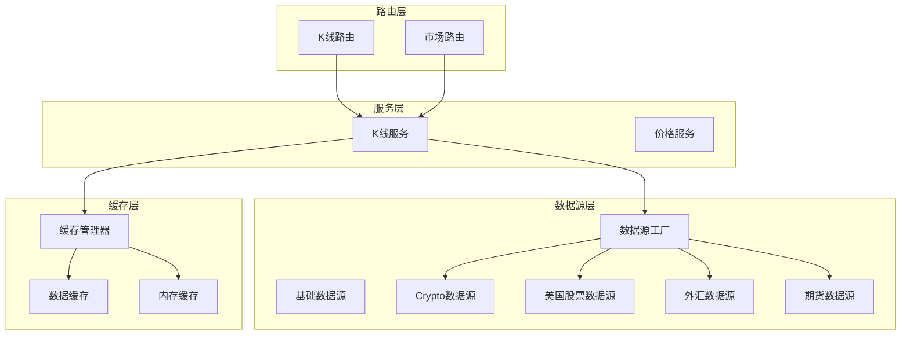
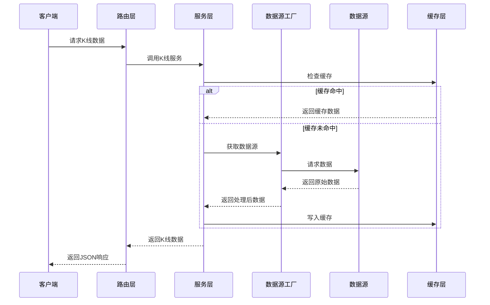
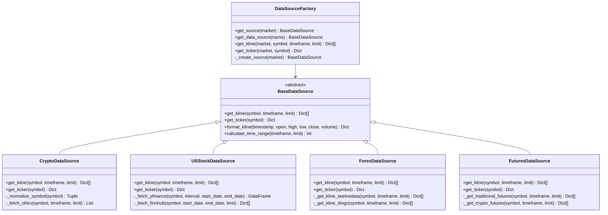
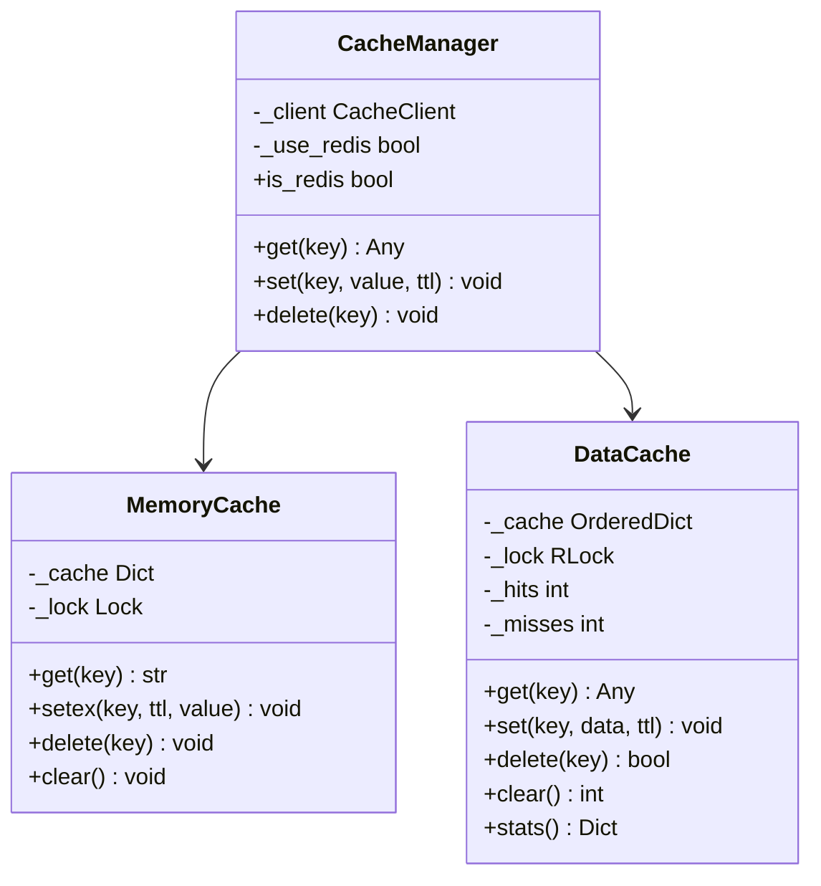
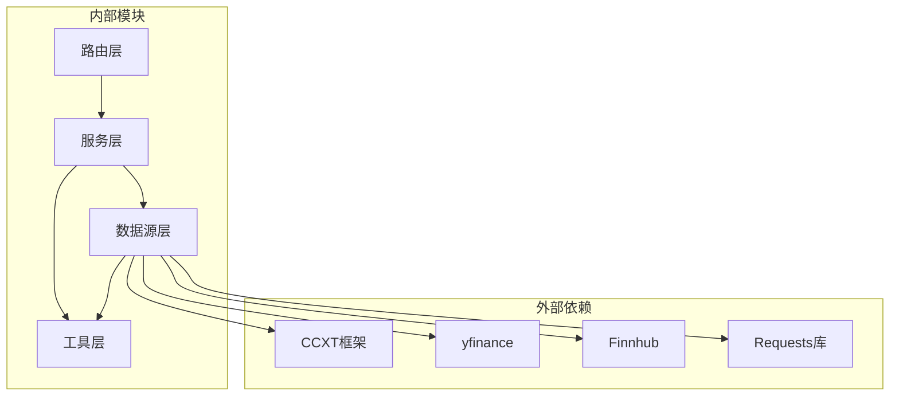
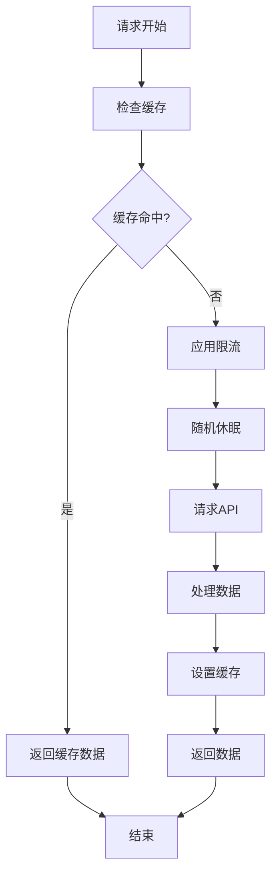
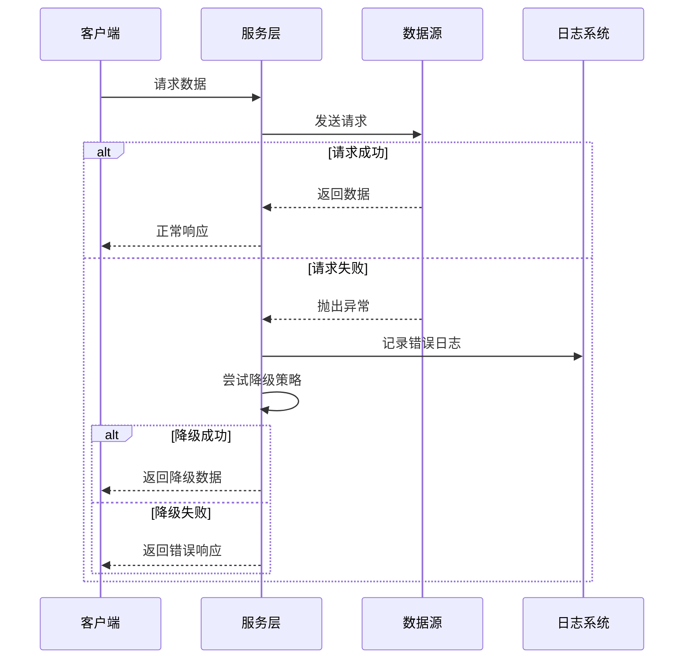

# 市场数据API

<cite>
**本文档引用的文件**
- [kline.py](file://backend_api_python/app/routes/kline.py)
- [market.py](file://backend_api_python/app/routes/market.py)
- [kline.py](file://backend_api_python/app/services/kline.py)
- [factory.py](file://backend_api_python/app/data_sources/factory.py)
- [base.py](file://backend_api_python/app/data_sources/base.py)
- [cache_manager.py](file://backend_api_python/app/data_sources/cache_manager.py)
- [cache.py](file://backend_api_python/app/utils/cache.py)
- [crypto.py](file://backend_api_python/app/data_sources/crypto.py)
- [us_stock.py](file://backend_api_python/app/data_sources/us_stock.py)
- [forex.py](file://backend_api_python/app/data_sources/forex.py)
- [futures.py](file://backend_api_python/app/data_sources/futures.py)
- [rate_limiter.py](file://backend_api_python/app/data_sources/rate_limiter.py)
- [data_sources.py](file://backend_api_python/app/config/data_sources.py)
</cite>

## 目录
1. [简介](#简介)
2. [项目结构](#项目结构)
3. [核心组件](#核心组件)
4. [架构概览](#架构概览)
5. [详细组件分析](#详细组件分析)
6. [依赖关系分析](#依赖关系分析)
7. [性能考虑](#性能考虑)
8. [故障排除指南](#故障排除指南)
9. [结论](#结论)

## 简介

QuantDinger 是一个综合性的量化交易系统，市场数据API是其核心功能之一。该API提供了统一的接口来获取各类金融市场的数据，包括K线数据、实时行情和市场概况。

本系统支持多个金融市场：
- **加密货币市场**：通过CCXT框架支持多家交易所
- **美国股票市场**：使用yfinance和finnhub
- **外汇市场**：支持多种货币对
- **期货市场**：包括传统期货和加密货币期货

## 项目结构

系统采用模块化的架构设计，主要分为以下几个层次：

**图表来源**
- [kline.py:17-132](file://backend_api_python/app/routes/kline.py#L17-L132)
- [market.py:642-752](file://backend_api_python/app/routes/market.py#L642-L752)
- [factory.py:13-72](file://backend_api_python/app/data_sources/factory.py#L13-L72)

**章节来源**
- [kline.py:1-207](file://backend_api_python/app/routes/kline.py#L1-L207)
- [market.py:1-964](file://backend_api_python/app/routes/market.py#L1-L964)

## 核心组件

### K线数据API

K线数据API提供了统一的接口来获取各种金融产品的K线数据。支持的时间周期包括1分钟、5分钟、15分钟、30分钟、1小时、4小时、1天和1周。

**主要特性：**
- 支持多市场数据聚合
- 实时缓存机制
- 历史数据分页获取
- 错误处理和降级策略

### 实时行情API

实时行情API提供了最新的市场价格信息，包括当前价格、涨跌额和涨跌幅等数据。

**数据来源优先级：**
1. Ticker API（最实时）
2. 1分钟K线数据
3. 日线K线数据

### 市场概况API

市场概况API提供了市场级别的信息，包括热门标的、自选股管理和批量价格查询等功能。

**章节来源**
- [kline.py:14-191](file://backend_api_python/app/services/kline.py#L14-L191)

## 架构概览

系统采用分层架构设计，确保了良好的可扩展性和维护性：

**图表来源**
- [kline.py:17-132](file://backend_api_python/app/routes/kline.py#L17-L132)
- [kline.py:21-65](file://backend_api_python/app/services/kline.py#L21-L65)
- [factory.py:74-105](file://backend_api_python/app/data_sources/factory.py#L74-L105)

## 详细组件分析

### 数据源工厂

数据源工厂是整个系统的核心组件，负责根据市场类型动态创建相应的数据源实例。

**图表来源**
- [factory.py:13-72](file://backend_api_python/app/data_sources/factory.py#L13-L72)
- [base.py:27-63](file://backend_api_python/app/data_sources/base.py#L27-L63)
- [crypto.py:16-53](file://backend_api_python/app/data_sources/crypto.py#L16-L53)
- [us_stock.py:17-57](file://backend_api_python/app/data_sources/us_stock.py#L17-L57)
- [forex.py:95-119](file://backend_api_python/app/data_sources/forex.py#L95-L119)
- [futures.py:60-90](file://backend_api_python/app/data_sources/futures.py#L60-L90)

**章节来源**
- [factory.py:13-134](file://backend_api_python/app/data_sources/factory.py#L13-L134)
- [base.py:27-171](file://backend_api_python/app/data_sources/base.py#L27-L171)

### 缓存管理系统

系统实现了多层次的缓存机制，包括内存缓存和Redis缓存，以及专门针对实时数据和K线数据的缓存策略。

**图表来源**
- [cache.py:49-129](file://backend_api_python/app/utils/cache.py#L49-L129)
- [cache_manager.py:44-175](file://backend_api_python/app/data_sources/cache_manager.py#L44-L175)

**章节来源**
- [cache.py:17-129](file://backend_api_python/app/utils/cache.py#L17-L129)
- [cache_manager.py:27-233](file://backend_api_python/app/data_sources/cache_manager.py#L27-L233)

### 加密货币数据源

加密货币数据源使用CCXT框架，支持多家主流交易所，包括Binance、OKX、Bybit、Bitget、Gate.io、MEXC、Kraken、Coinbase等。

**主要特性：**
- 符号自动规范化
- 多交易所支持
- 分页获取历史数据
- 代理支持

**章节来源**
- [crypto.py:16-388](file://backend_api_python/app/data_sources/crypto.py#L16-L388)

### 美国股票数据源

美国股票数据源结合了yfinance和finnhub的优势，提供最实时的市场数据。

**数据源优先级：**
1. Finnhub（实时数据，需要API密钥）
2. yfinance fast_info（快速数据）
3. yfinance info（完整数据）
4. 1分钟K线回退

**章节来源**
- [us_stock.py:17-318](file://backend_api_python/app/data_sources/us_stock.py#L17-L318)

### 外汇数据源

外汇数据源实现了三级降级策略，确保在任何情况下都能提供数据。

**降级策略：**
1. **Twelve Data**（首选，需要API密钥）
2. **Tiingo**（备用，需要API密钥）
3. **yfinance**（最后备用）

**特殊处理：**
- 支持黄金（XAUUSD）和白银（XAGUSD）等贵金属
- 1分钟数据需要付费订阅
- 周线和月线数据通过日线聚合

**章节来源**
- [forex.py:95-690](file://backend_api_python/app/data_sources/forex.py#L95-L690)

### 期货数据源

期货数据源支持两种类型的期货交易：

1. **传统期货**：黄金（GC）、白银（SI）、原油（CL）、天然气（NG）、玉米（ZC）、小麦（ZW）等
2. **加密货币期货**：通过CCXT支持的加密货币衍生品

**章节来源**
- [futures.py:60-465](file://backend_api_python/app/data_sources/futures.py#L60-L465)

## 依赖关系分析

系统中的组件依赖关系如下：

**图表来源**
- [factory.py:50-69](file://backend_api_python/app/data_sources/factory.py#L50-L69)
- [crypto.py:7-48](file://backend_api_python/app/data_sources/crypto.py#L7-L48)
- [us_stock.py:8-56](file://backend_api_python/app/data_sources/us_stock.py#L8-L56)

**章节来源**
- [factory.py:1-134](file://backend_api_python/app/data_sources/factory.py#L1-L134)

## 性能考虑

### 缓存策略

系统实现了多层次的缓存策略来优化性能：

1. **实时数据缓存**：20分钟TTL，适合高频访问的实时数据
2. **K线数据缓存**：5分钟TTL，针对历史数据的缓存
3. **股票信息缓存**：24小时TTL，适合不经常变化的基础信息

### 请求限流

为了遵守各数据提供商的API限制，系统实现了智能的请求限流机制：

**图表来源**
- [rate_limiter.py:83-160](file://backend_api_python/app/data_sources/rate_limiter.py#L83-L160)

### 并发处理

系统使用线程池来并发处理多个数据请求，提高整体性能：

- **自选股价格批量查询**：使用ThreadPoolExecutor并行获取
- **线程数控制**：通过环境变量`MARKET_EXECUTOR_WORKERS`配置
- **超时保护**：每个请求都有30秒超时限制

**章节来源**
- [market.py:642-752](file://backend_api_python/app/routes/market.py#L642-L752)
- [rate_limiter.py:1-273](file://backend_api_python/app/data_sources/rate_limiter.py#L1-L273)

## 故障排除指南

### 常见问题及解决方案

1. **API密钥配置问题**
   - 检查环境变量是否正确设置
   - 确认API密钥具有相应权限
   - 查看日志中的具体错误信息

2. **数据获取失败**
   - 检查网络连接状态
   - 验证目标市场的API可用性
   - 查看降级策略是否正常工作

3. **缓存问题**
   - 清理缓存：调用`CacheManager.clear()`
   - 检查缓存配置参数
   - 验证Redis连接状态

4. **性能问题**
   - 调整线程池大小
   - 优化请求频率
   - 检查缓存命中率

### 错误处理机制

系统实现了完善的错误处理机制：

**图表来源**
- [kline.py:115-189](file://backend_api_python/app/services/kline.py#L115-L189)
- [factory.py:103-132](file://backend_api_python/app/data_sources/factory.py#L103-L132)

**章节来源**
- [kline.py:115-189](file://backend_api_python/app/services/kline.py#L115-L189)
- [factory.py:103-132](file://backend_api_python/app/data_sources/factory.py#L103-L132)

## 结论

QuantDinger的市场数据API提供了一个强大而灵活的解决方案，能够满足量化交易的各种需求。系统的主要优势包括：

1. **多市场支持**：统一接口支持加密货币、股票、外汇和期货市场
2. **高可用性**：多重降级策略确保数据获取的可靠性
3. **高性能**：智能缓存和并发处理机制优化性能
4. **易扩展**：模块化设计便于添加新的数据源和功能

通过合理配置和使用，用户可以构建稳定可靠的量化交易系统，满足各种复杂的交易策略需求。