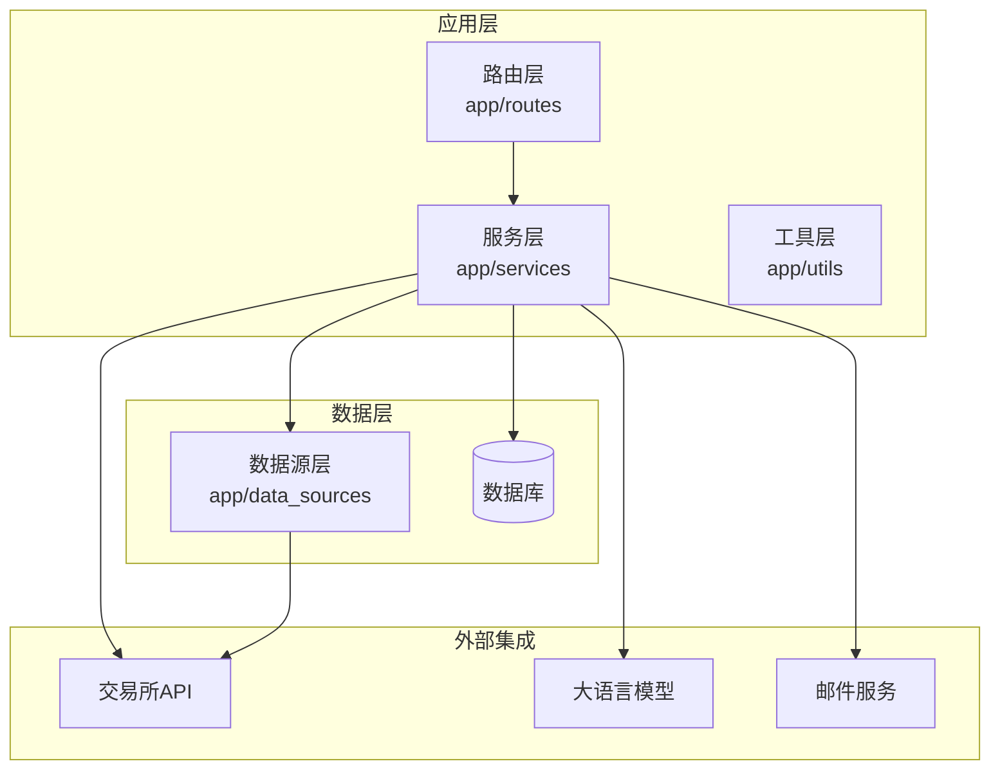
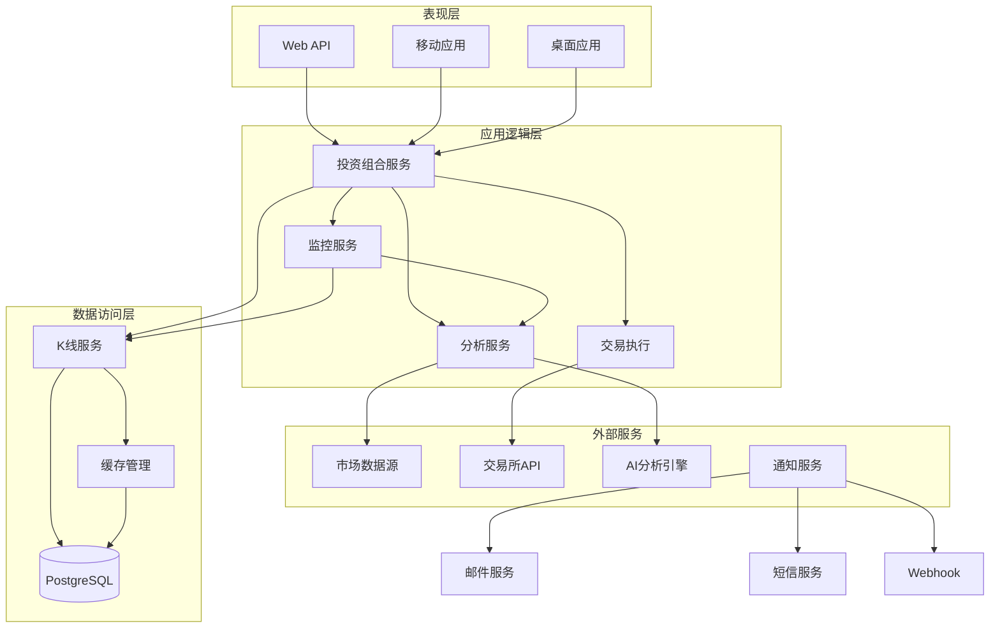
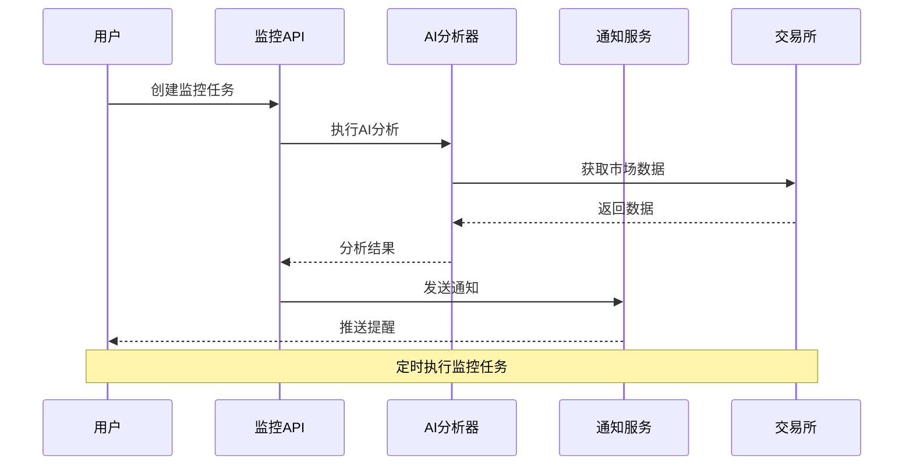
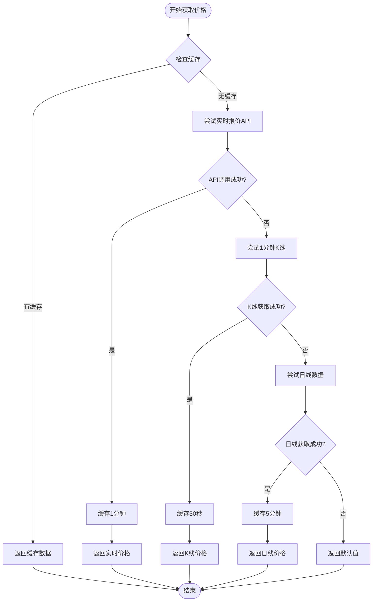
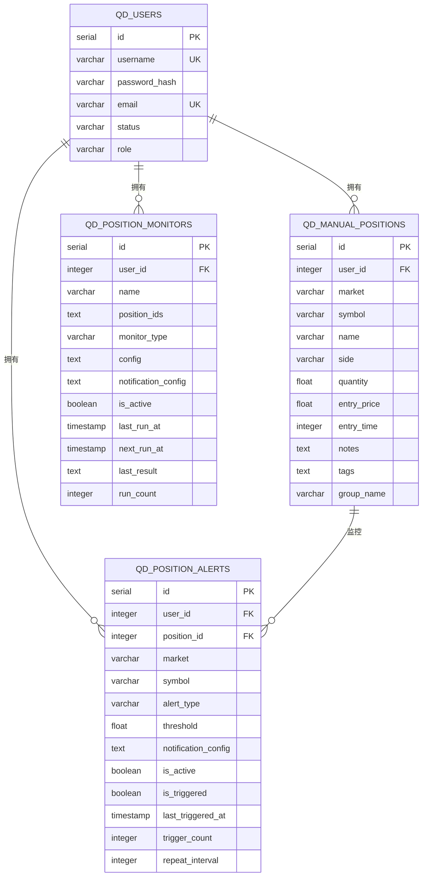
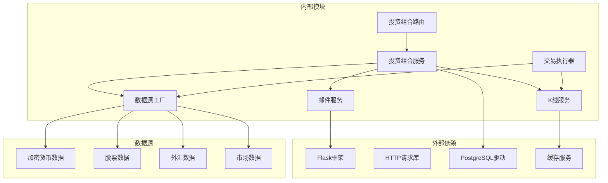

# 投资组合管理API

<cite>
**本文档引用的文件**
- [backend_api_python/app/routes/portfolio.py](file://backend_api_python/app/routes/portfolio.py)
- [backend_api_python/app/services/portfolio_monitor.py](file://backend_api_python/app/services/portfolio_monitor.py)
- [backend_api_python/app/services/kline.py](file://backend_api_python/app/services/kline.py)
- [backend_api_python/app/data_sources/factory.py](file://backend_api_python/app/data_sources/factory.py)
- [backend_api_python/app/utils/db.py](file://backend_api_python/app/utils/db.py)
- [backend_api_python/migrations/init.sql](file://backend_api_python/migrations/init.sql)
- [backend_api_python/app/services/fast_analysis.py](file://backend_api_python/app/services/fast_analysis.py)
- [backend_api_python/app/services/email_service.py](file://backend_api_python/app/services/email_service.py)
- [backend_api_python/app/services/live_trading/base.py](file://backend_api_python/app/services/live_trading/base.py)
- [backend_api_python/app/services/trading_executor.py](file://backend_api_python/app/services/trading_executor.py)
</cite>

## 目录
1. [简介](#简介)
2. [项目结构](#项目结构)
3. [核心组件](#核心组件)
4. [架构概览](#架构概览)
5. [详细组件分析](#详细组件分析)
6. [依赖关系分析](#依赖关系分析)
7. [性能考虑](#性能考虑)
8. [故障排除指南](#故障排除指南)
9. [结论](#结论)

## 简介

QuantDinger投资组合管理API是一个完整的量化交易系统后端，专注于为用户提供全方位的投资组合管理功能。该系统基于Python Flask框架构建，采用现代化的微服务架构设计，集成了实时数据获取、AI智能分析、风险监控和自动化交易执行等功能。

系统的核心目标是为用户提供以下关键能力：
- **资产配置管理**：支持多市场、多类型的资产配置和权重管理
- **持仓查询分析**：实时获取持仓信息、盈亏计算和市场分布分析
- **收益分析统计**：提供详细的收益计算、风险评估和绩效指标
- **AI智能监控**：基于机器学习的实时监控和预警通知
- **多账户管理**：支持用户级别的多账户隔离和资金分配
- **实时交易执行**：集成多种交易所的实时交易功能

## 项目结构

后端API采用模块化的目录结构，主要分为以下几个核心部分：

**图表来源**
- [backend_api_python/app/routes/portfolio.py:1-50](file://backend_api_python/app/routes/portfolio.py#L1-L50)
- [backend_api_python/app/services/portfolio_monitor.py:1-30](file://backend_api_python/app/services/portfolio_monitor.py#L1-L30)

**章节来源**
- [backend_api_python/app/routes/portfolio.py:1-100](file://backend_api_python/app/routes/portfolio.py#L1-L100)
- [backend_api_python/app/services/kline.py:1-50](file://backend_api_python/app/services/kline.py#L1-L50)

## 核心组件

### 投资组合路由模块

投资组合管理API的核心路由模块位于`app/routes/portfolio.py`，提供了完整的RESTful接口集合：

#### 主要功能模块

1. **手动持仓管理**：支持用户手动添加、更新、删除和查询持仓
2. **投资组合概览**：提供总资产值、总盈亏和市场分布的综合统计
3. **AI监控系统**：基于机器学习的智能监控和预警通知
4. **价格监控**：实时价格跟踪和阈值提醒

#### 接口设计特点

- **认证保护**：所有接口均需要Bearer Token认证
- **并发处理**：使用线程池进行并行价格获取，避免API限流
- **缓存机制**：智能缓存策略减少重复请求
- **错误处理**：完善的异常捕获和错误响应

**章节来源**
- [backend_api_python/app/routes/portfolio.py:140-290](file://backend_api_python/app/routes/portfolio.py#L140-L290)
- [backend_api_python/app/routes/portfolio.py:595-754](file://backend_api_python/app/routes/portfolio.py#L595-L754)

### K线数据服务

K线数据服务位于`app/services/kline.py`，提供了统一的数据访问接口：

#### 核心特性

- **多数据源支持**：支持加密货币、美股、外汇、期货等多种市场
- **智能降级**：优先使用实时报价API，降级使用K线数据
- **缓存优化**：针对不同时间周期设置合适的缓存策略
- **实时价格获取**：提供最新的市场价格数据

**章节来源**
- [backend_api_python/app/services/kline.py:74-190](file://backend_api_python/app/services/kline.py#L74-L190)

### 数据源工厂

数据源工厂位于`app/data_sources/factory.py`，实现了灵活的数据源选择机制：

#### 设计模式

- **工厂模式**：根据市场类型动态创建相应的数据源实例
- **抽象接口**：统一不同数据源的访问接口
- **扩展性**：易于添加新的市场类型和数据源

**章节来源**
- [backend_api_python/app/data_sources/factory.py:13-72](file://backend_api_python/app/data_sources/factory.py#L13-L72)

## 架构概览

系统采用分层架构设计，确保了良好的可维护性和扩展性：

**图表来源**
- [backend_api_python/app/services/portfolio_monitor.py:1-50](file://backend_api_python/app/services/portfolio_monitor.py#L1-L50)
- [backend_api_python/app/services/fast_analysis.py:186-200](file://backend_api_python/app/services/fast_analysis.py#L186-L200)

## 详细组件分析

### 投资组合监控系统

投资组合监控系统是整个API的核心组件之一，提供了智能化的投资组合管理功能。

#### 监控类型

系统支持三种主要的监控类型：

1. **AI智能分析监控**：基于机器学习的综合分析报告
2. **价格预警监控**：基于价格阈值的自动提醒
3. **盈亏监控**：基于盈亏百分比的条件触发

#### 监控流程

**图表来源**
- [backend_api_python/app/services/portfolio_monitor.py:281-386](file://backend_api_python/app/services/portfolio_monitor.py#L281-L386)
- [backend_api_python/app/routes/portfolio.py:1131-1232](file://backend_api_python/app/routes/portfolio.py#L1131-L1232)

#### AI分析功能

AI分析服务基于先进的机器学习算法，提供多维度的市场分析：

- **技术分析**：RSI、MACD、移动平均线等技术指标
- **基本面分析**：财务数据、公司信息等基本面因素
- **宏观环境分析**：经济指标、政策变化等宏观因素
- **新闻情感分析**：市场新闻和事件的影响评估

**章节来源**
- [backend_api_python/app/services/fast_analysis.py:486-761](file://backend_api_python/app/services/fast_analysis.py#L486-L761)
- [backend_api_python/app/services/portfolio_monitor.py:226-279](file://backend_api_python/app/services/portfolio_monitor.py#L226-L279)

### 价格获取和缓存机制

系统实现了高效的实时价格获取和缓存机制：

#### 价格获取策略

**图表来源**
- [backend_api_python/app/services/kline.py:74-190](file://backend_api_python/app/services/kline.py#L74-L190)

#### 并发控制机制

系统使用线程池和锁机制来控制并发请求：

- **线程池管理**：可配置的最大工作线程数
- **请求间隔控制**：避免过于频繁的API调用
- **速率限制**：防止触发外部API的限流机制

**章节来源**
- [backend_api_python/app/routes/portfolio.py:28-46](file://backend_api_python/app/routes/portfolio.py#L28-L46)
- [backend_api_python/app/services/kline.py:1-50](file://backend_api_python/app/services/kline.py#L1-L50)

### 数据库设计

系统使用PostgreSQL作为主要数据存储，支持完整的投资组合管理功能：

#### 核心数据表

**图表来源**
- [backend_api_python/migrations/init.sql:8-31](file://backend_api_python/migrations/init.sql#L8-L31)
- [backend_api_python/migrations/init.sql:195-220](file://backend_api_python/migrations/init.sql#L195-L220)

**章节来源**
- [backend_api_python/migrations/init.sql:1-100](file://backend_api_python/migrations/init.sql#L1-L100)

### 通知系统

系统集成了多渠道的通知服务，支持实时的监控提醒：

#### 支持的通知渠道

- **邮件通知**：基于SMTP协议的邮件发送服务
- **Telegram机器人**：通过Telegram API发送消息
- **Webhook集成**：支持自定义Webhook回调
- **站内通知**：系统内部的消息推送

#### 通知配置

系统提供了灵活的通知配置选项：

- **渠道选择**：用户可以选择一个或多个通知渠道
- **个性化设置**：支持用户的个性化通知偏好
- **频率控制**：可设置通知的触发频率和重复间隔

**章节来源**
- [backend_api_python/app/services/email_service.py:29-60](file://backend_api_python/app/services/email_service.py#L29-L60)
- [backend_api_python/app/services/portfolio_monitor.py:68-129](file://backend_api_python/app/services/portfolio_monitor.py#L68-L129)

## 依赖关系分析

系统采用了清晰的依赖关系设计，确保了模块间的松耦合：

**图表来源**
- [backend_api_python/app/routes/portfolio.py:1-25](file://backend_api_python/app/routes/portfolio.py#L1-L25)
- [backend_api_python/app/services/kline.py:1-15](file://backend_api_python/app/services/kline.py#L1-L15)

### 第三方服务集成

系统集成了多个第三方服务来增强功能：

#### 交易所API集成

- **主流加密货币交易所**：Binance、OKX、Bybit等
- **传统金融市场**：支持美股、外汇等市场数据
- **API限流管理**：智能的请求频率控制

#### AI分析服务

- **大语言模型**：提供专业的市场分析和建议
- **多语言支持**：支持中英文等多种语言
- **实时分析**：快速的市场数据分析能力

**章节来源**
- [backend_api_python/app/services/live_trading/base.py:95-157](file://backend_api_python/app/services/live_trading/base.py#L95-L157)
- [backend_api_python/app/services/fast_analysis.py:186-200](file://backend_api_python/app/services/fast_analysis.py#L186-L200)

## 性能考虑

系统在设计时充分考虑了性能优化：

### 缓存策略

- **多级缓存**：内存缓存、Redis缓存、数据库缓存
- **智能过期**：根据不同数据的时效性设置合适的过期时间
- **预加载机制**：提前加载可能需要的数据

### 并发处理

- **线程池管理**：合理控制并发数量，避免资源耗尽
- **异步处理**：对于耗时操作使用异步处理方式
- **连接池**：数据库和HTTP请求连接池优化

### 数据优化

- **批量操作**：支持批量数据获取和处理
- **增量更新**：只更新发生变化的数据
- **压缩传输**：减少网络传输的数据量

## 故障排除指南

### 常见问题及解决方案

#### 数据获取失败

**问题描述**：实时价格获取失败或返回默认值

**可能原因**：
- 外部API限流
- 网络连接问题
- 数据源不可用

**解决步骤**：
1. 检查网络连接状态
2. 查看API限流状态
3. 验证数据源可用性
4. 检查缓存配置

#### 监控任务执行失败

**问题描述**：AI监控任务无法正常执行

**可能原因**：
- LLM服务不可用
- 数据分析异常
- 通知服务配置错误

**解决步骤**：
1. 检查LLM服务状态
2. 验证AI分析配置
3. 测试通知服务连接
4. 查看错误日志

#### 性能问题

**问题描述**：API响应缓慢或系统负载过高

**可能原因**：
- 并发请求过多
- 缓存配置不当
- 数据库查询优化不足

**解决步骤**：
1. 调整线程池大小
2. 优化缓存策略
3. 分析慢查询日志
4. 考虑数据库分片

**章节来源**
- [backend_api_python/app/services/kline.py:132-188](file://backend_api_python/app/services/kline.py#L132-L188)
- [backend_api_python/app/services/portfolio_monitor.py:1-50](file://backend_api_python/app/services/portfolio_monitor.py#L1-L50)

## 结论

QuantDinger投资组合管理API是一个功能完整、架构清晰的量化交易系统后端。系统通过模块化的设计和灵活的扩展机制，为用户提供了全方位的投资组合管理功能。

### 主要优势

1. **功能完整性**：涵盖了从基础持仓管理到高级AI分析的完整功能链
2. **架构先进性**：采用现代化的微服务架构，具有良好的可扩展性
3. **性能优化**：通过缓存、并发控制等手段确保系统高性能运行
4. **安全性保障**：完善的认证授权和数据安全保障机制
5. **用户体验**：提供多语言支持和友好的错误处理机制

### 技术特色

- **多市场支持**：统一的数据访问接口支持多种金融市场的数据获取
- **AI智能分析**：基于机器学习的智能分析和决策建议
- **实时监控**：多维度的实时监控和预警通知系统
- **自动化交易**：集成多种交易所的自动化交易执行能力

该系统为量化交易者和投资组合管理者提供了一个强大而易用的技术平台，能够满足从个人投资者到专业机构的各种需求。