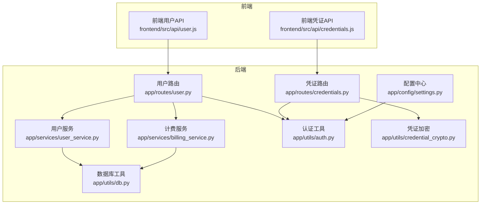
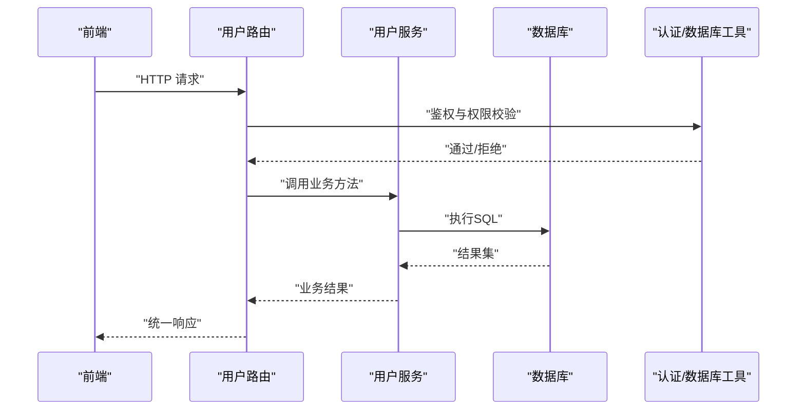
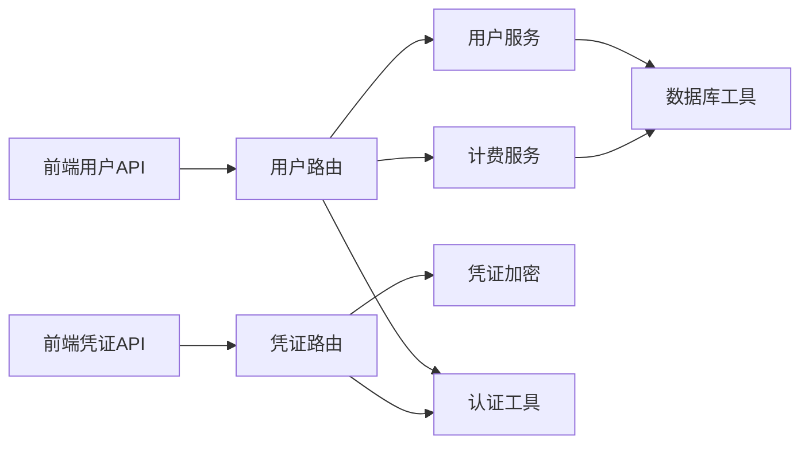

# 用户管理API

<cite>
**本文档引用的文件**
- [backend_api_python/app/routes/user.py](file://backend_api_python/app/routes/user.py)
- [backend_api_python/app/services/user_service.py](file://backend_api_python/app/services/user_service.py)
- [backend_api_python/app/routes/credentials.py](file://backend_api_python/app/routes/credentials.py)
- [backend_api_python/app/utils/auth.py](file://backend_api_python/app/utils/auth.py)
- [backend_api_python/app/utils/credential_crypto.py](file://backend_api_python/app/utils/credential_crypto.py)
- [backend_api_python/app/services/billing_service.py](file://backend_api_python/app/services/billing_service.py)
- [backend_api_python/app/utils/db.py](file://backend_api_python/app/utils/db.py)
- [backend_api_python/app/config/settings.py](file://backend_api_python/app/config/settings.py)
- [frontend/src/api/user.js](file://frontend/src/api/user.js)
- [frontend/src/api/credentials.js](file://frontend/src/api/credentials.js)
</cite>

## 目录
1. [简介](#简介)
2. [项目结构](#项目结构)
3. [核心组件](#核心组件)
4. [架构总览](#架构总览)
5. [详细组件分析](#详细组件分析)
6. [依赖关系分析](#依赖关系分析)
7. [性能考虑](#性能考虑)
8. [故障排除指南](#故障排除指南)
9. [结论](#结论)
10. [附录](#附录)

## 简介
本文件系统性梳理 QuantDinger 的用户管理API，覆盖以下范围：
- 用户信息查询、修改、删除接口
- 个人资料管理、账户设置与密码变更
- 凭证管理接口（交易所API密钥的添加、删除与查看）
- 用户权限控制、角色管理与批量导出
- 用户数据格式、字段约束与验证规则
- 前后端交互约定与错误码规范

该文档面向后端开发者、测试工程师与前端对接人员，帮助快速理解接口设计、数据流与安全机制。

## 项目结构
后端采用 Flask Blueprint 分层组织，用户管理相关代码主要位于：
- 路由层：`app/routes/user.py`、`app/routes/credentials.py`
- 业务服务层：`app/services/user_service.py`、`app/services/billing_service.py`
- 工具与安全：`app/utils/auth.py`、`app/utils/credential_crypto.py`、`app/utils/db.py`
- 配置中心：`app/config/settings.py`
- 前端API封装：`frontend/src/api/user.js`、`frontend/src/api/credentials.js`

**图表来源**
- [backend_api_python/app/routes/user.py:1-800](file://backend_api_python/app/routes/user.py#L1-L800)
- [backend_api_python/app/routes/credentials.py:1-460](file://backend_api_python/app/routes/credentials.py#L1-L460)
- [backend_api_python/app/services/user_service.py:1-701](file://backend_api_python/app/services/user_service.py#L1-L701)
- [backend_api_python/app/services/billing_service.py:1-747](file://backend_api_python/app/services/billing_service.py#L1-L747)
- [backend_api_python/app/utils/auth.py:1-239](file://backend_api_python/app/utils/auth.py#L1-L239)
- [backend_api_python/app/utils/credential_crypto.py:1-50](file://backend_api_python/app/utils/credential_crypto.py#L1-L50)
- [backend_api_python/app/utils/db.py:1-66](file://backend_api_python/app/utils/db.py#L1-L66)
- [frontend/src/api/user.js:1-294](file://frontend/src/api/user.js#L1-L294)
- [frontend/src/api/credentials.js:1-50](file://frontend/src/api/credentials.js#L1-L50)

**章节来源**
- [backend_api_python/app/routes/user.py:1-800](file://backend_api_python/app/routes/user.py#L1-L800)
- [backend_api_python/app/routes/credentials.py:1-460](file://backend_api_python/app/routes/credentials.py#L1-L460)
- [backend_api_python/app/services/user_service.py:1-701](file://backend_api_python/app/services/user_service.py#L1-L701)
- [backend_api_python/app/services/billing_service.py:1-747](file://backend_api_python/app/services/billing_service.py#L1-L747)
- [backend_api_python/app/utils/auth.py:1-239](file://backend_api_python/app/utils/auth.py#L1-L239)
- [backend_api_python/app/utils/credential_crypto.py:1-50](file://backend_api_python/app/utils/credential_crypto.py#L1-L50)
- [backend_api_python/app/utils/db.py:1-66](file://backend_api_python/app/utils/db.py#L1-L66)
- [frontend/src/api/user.js:1-294](file://frontend/src/api/user.js#L1-L294)
- [frontend/src/api/credentials.js:1-50](file://frontend/src/api/credentials.js#L1-L50)

## 核心组件
- 用户路由与服务
  - 用户列表、详情、创建、更新、删除、密码重置、角色查询、积分与VIP管理等接口均由用户路由与用户服务协作完成。
  - 权限控制通过装饰器实现，管理员专属接口均要求管理员身份。
- 凭证路由与加密
  - 支持列出、创建、删除、获取单条凭证；凭证内容以对称加密存储，解密仅在服务端进行。
- 计费服务
  - 提供积分余额、VIP状态、消费记录与管理员额度调整能力。
- 认证与授权
  - 基于 JWT 的 Bearer Token 认证，支持角色与权限校验，以及单点登录强制失效机制。

**章节来源**
- [backend_api_python/app/routes/user.py:41-800](file://backend_api_python/app/routes/user.py#L41-L800)
- [backend_api_python/app/services/user_service.py:56-701](file://backend_api_python/app/services/user_service.py#L56-L701)
- [backend_api_python/app/routes/credentials.py:32-460](file://backend_api_python/app/routes/credentials.py#L32-L460)
- [backend_api_python/app/services/billing_service.py:47-747](file://backend_api_python/app/services/billing_service.py#L47-L747)
- [backend_api_python/app/utils/auth.py:126-218](file://backend_api_python/app/utils/auth.py#L126-L218)

## 架构总览
用户管理API遵循“路由-服务-工具-数据库”的分层架构，关键流程如下：
- 前端通过 HTTP 请求访问后端 API
- 路由层解析请求参数，调用相应服务
- 服务层执行业务逻辑，必要时访问数据库
- 工具层提供认证、加密、数据库连接等通用能力
- 返回统一响应格式（code/msg/data）

**图表来源**
- [backend_api_python/app/routes/user.py:41-108](file://backend_api_python/app/routes/user.py#L41-L108)
- [backend_api_python/app/services/user_service.py:102-151](file://backend_api_python/app/services/user_service.py#L102-L151)
- [backend_api_python/app/utils/auth.py:126-171](file://backend_api_python/app/utils/auth.py#L126-L171)
- [backend_api_python/app/utils/db.py:19-31](file://backend_api_python/app/utils/db.py#L19-L31)

## 详细组件分析

### 用户管理接口（管理员）
- 列表与导出
  - GET `/api/users/list`：分页查询用户，支持关键词搜索
  - GET `/api/users/export`：导出用户列表为CSV
- 详情与CRUD
  - GET `/api/users/detail`：按ID获取用户详情
  - POST `/api/users/create`：创建用户（用户名必填，密码可为空）
  - PUT `/api/users/update`：更新用户（邮箱、昵称、头像、角色、状态、时区）
  - DELETE `/api/users/delete`：删除用户（禁止自删）
- 密码与角色
  - POST `/api/users/reset-password`：管理员重置密码（长度≥6）
  - GET `/api/users/roles`：获取可用角色及权限
- 积分与VIP（管理员）
  - POST `/api/users/set-credits`：设置用户积分（非负）
  - POST `/api/users/set-vip`：设置VIP（支持天数或截止时间）
  - GET `/api/users/credits-log`：获取积分变动日志

字段约束与验证要点
- 用户名：3-50字符，唯一
- 密码：若提供则至少6字符
- 角色：必须在预定义集合内
- 时区：长度≤64，符合IANA子集正则
- 积分：非负整数
- VIP截止时间：ISO格式或天数（>0）

**章节来源**
- [backend_api_python/app/routes/user.py:41-800](file://backend_api_python/app/routes/user.py#L41-L800)
- [backend_api_python/app/services/user_service.py:314-522](file://backend_api_python/app/services/user_service.py#L314-L522)

### 个人资料与账户设置（用户自服务）
- 个人信息
  - GET `/api/users/profile`：获取当前用户资料
  - PUT `/api/users/profile/update`：更新昵称、头像、时区
- 密码变更
  - POST `/api/users/change-password`：需提供旧密码（或允许首次设置）
- 通知设置
  - GET/PUT `/api/users/notification-settings`：获取与更新通知渠道
- 图表模板
  - GET/POST/DELETE `/api/users/chart-templates`：获取、保存、删除图表模板
- 我的积分日志
  - GET `/api/users/my-credits-log`：分页查询积分变动

**章节来源**
- [frontend/src/api/user.js:105-207](file://frontend/src/api/user.js#L105-L207)
- [backend_api_python/app/services/user_service.py:456-508](file://backend_api_python/app/services/user_service.py#L456-L508)

### 凭证管理接口（交易所API密钥）
- 列出凭证
  - GET `/api/credentials/list`：返回脱敏后的凭证摘要（含提示）
- 创建凭证
  - POST `/api/credentials/create`：支持多交易所配置
    - 通用字段：name、exchange_id
    - 交易所特有：IBKR（host/port/client_id/account）、MT5（server/login/password/terminal_path）、币安系/OKX/Bybit等（api_key/secret_key/passphrase/enable_demo_trading）
- 删除凭证
  - DELETE `/api/credentials/delete`：按ID删除
- 获取凭证
  - GET `/api/credentials/get`：返回解密后的完整配置（含exchange_id回填）
- 出口IP查询
  - GET `/api/credentials/egress-ip`：返回服务器出口公网IP，便于交易所白名单

加密与安全
- 凭证以JSON形式加密存储，使用 SECRET_KEY 派生的对称密钥
- 解密仅在服务端进行，返回时移除密文字段

**章节来源**
- [backend_api_python/app/routes/credentials.py:32-460](file://backend_api_python/app/routes/credentials.py#L32-L460)
- [backend_api_python/app/utils/credential_crypto.py:17-50](file://backend_api_python/app/utils/credential_crypto.py#L17-L50)

### 权限控制与角色管理
- 角色层级
  - viewer → user → manager → admin
- 权限映射
  - 不同角色具备不同功能权限（仪表盘、查看、指标、回测、策略、组合、设置、用户管理、凭证管理）
- 装饰器
  - @login_required：Bearer Token 必须
  - @admin_required：管理员
  - @manager_required：管理员或经理
  - @permission_required：基于角色的细粒度权限

单点登录与令牌版本
- 服务端维护 token_version 字段，每次强制失效旧令牌
- 验证流程：解码JWT后比对数据库中的当前版本

**章节来源**
- [backend_api_python/app/services/user_service.py:56-68](file://backend_api_python/app/services/user_service.py#L56-L68)
- [backend_api_python/app/utils/auth.py:126-218](file://backend_api_python/app/utils/auth.py#L126-L218)

### 计费与积分管理
- 查询用户积分与VIP状态
- 扣费与充值（含管理员调整）
- 积分日志分页查询
- VIP设置与续期（管理员）

**章节来源**
- [backend_api_python/app/services/billing_service.py:98-717](file://backend_api_python/app/services/billing_service.py#L98-L717)
- [backend_api_python/app/routes/user.py:563-800](file://backend_api_python/app/routes/user.py#L563-L800)

## 依赖关系分析
- 路由到服务：用户路由依赖用户服务与计费服务；凭证路由依赖凭证加密工具
- 服务到工具：用户服务与计费服务依赖数据库工具；认证工具贯穿所有路由
- 前端到后端：前端API封装统一指向后端路由

**图表来源**
- [frontend/src/api/user.js:1-294](file://frontend/src/api/user.js#L1-L294)
- [frontend/src/api/credentials.js:1-50](file://frontend/src/api/credentials.js#L1-L50)
- [backend_api_python/app/routes/user.py:1-800](file://backend_api_python/app/routes/user.py#L1-L800)
- [backend_api_python/app/routes/credentials.py:1-460](file://backend_api_python/app/routes/credentials.py#L1-L460)
- [backend_api_python/app/services/user_service.py:1-701](file://backend_api_python/app/services/user_service.py#L1-L701)
- [backend_api_python/app/services/billing_service.py:1-747](file://backend_api_python/app/services/billing_service.py#L1-L747)
- [backend_api_python/app/utils/auth.py:1-239](file://backend_api_python/app/utils/auth.py#L1-L239)
- [backend_api_python/app/utils/credential_crypto.py:1-50](file://backend_api_python/app/utils/credential_crypto.py#L1-L50)
- [backend_api_python/app/utils/db.py:1-66](file://backend_api_python/app/utils/db.py#L1-L66)

**章节来源**
- [backend_api_python/app/utils/db.py:19-31](file://backend_api_python/app/utils/db.py#L19-L31)
- [backend_api_python/app/utils/auth.py:126-218](file://backend_api_python/app/utils/auth.py#L126-L218)

## 性能考虑
- 分页查询：列表与日志接口均支持分页，避免一次性加载大量数据
- 缓存策略：计费配置带缓存（TTL=60秒），降低频繁读取开销
- 数据库连接：统一通过 PostgreSQL 工具获取连接，减少重复初始化
- 加密成本：凭证加密在服务端进行，建议在高并发场景下评估CPU占用

[本节为通用指导，无需特定文件引用]

## 故障排除指南
常见错误与定位
- 401 未授权
  - 缺失或无效 Bearer Token；检查 Authorization 头与签名密钥
- 403 权限不足
  - 非管理员访问管理员接口；确认角色与权限映射
- 400 参数错误
  - 用户名/密码/时区/积分/VIP参数不符合约束；检查字段长度与格式
- 500 服务器错误
  - 数据库异常或服务内部错误；查看后端日志

排查步骤
- 核对请求头：Authorization: Bearer <token>
- 校验参数：用户名长度、密码长度、时区格式、积分非负、VIP截止时间格式
- 检查加密：凭证创建时确保 SECRET_KEY 正确且一致
- 查看日志：后端日志记录详细错误堆栈

**章节来源**
- [backend_api_python/app/utils/auth.py:126-171](file://backend_api_python/app/utils/auth.py#L126-L171)
- [backend_api_python/app/services/user_service.py:344-350](file://backend_api_python/app/services/user_service.py#L344-L350)
- [backend_api_python/app/utils/credential_crypto.py:17-50](file://backend_api_python/app/utils/credential_crypto.py#L17-L50)

## 结论
QuantDinger 的用户管理API以清晰的分层架构实现了完善的用户生命周期管理、凭证安全存储与权限控制。通过统一的响应格式与严格的参数校验，保障了接口的稳定性与安全性。管理员与普通用户职责分离明确，既满足运营需求，又兼顾易用性与扩展性。

[本节为总结性内容，无需特定文件引用]

## 附录

### 接口一览与字段说明

- 用户管理（管理员）
  - GET /api/users/list：page/page_size/search
  - GET /api/users/export：search
  - GET /api/users/detail：id
  - POST /api/users/create：username/password/email/nickname/role/status/email_verified/referred_by
  - PUT /api/users/update：id + {email,nickname,avatar,role,status,timezone}
  - DELETE /api/users/delete：id
  - POST /api/users/reset-password：{user_id,new_password}
  - GET /api/users/roles：无
  - POST /api/users/set-credits：{user_id,credits,remark}
  - POST /api/users/set-vip：{user_id,vip_days或vip_expires_at,remark}
  - GET /api/users/credits-log：{user_id,page,page_size}

- 个人资料与账户设置（用户自服务）
  - GET /api/users/profile：无
  - PUT /api/users/profile/update：{nickname,avatar,timezone}
  - POST /api/users/change-password：{old_password,new_password}
  - GET/PUT /api/users/notification-settings：{default_channels,telegram_chat_id,email,discord_webhook,webhook_url,phone}
  - GET/POST/DELETE /api/users/chart-templates：{template_id/name/content}
  - GET /api/users/my-credits-log：{page,page_size}

- 凭证管理
  - GET /api/credentials/list：无
  - POST /api/credentials/create：{name,exchange_id,IBKR/MT5/币安系字段}
  - DELETE /api/credentials/delete：{id}
  - GET /api/credentials/get：{id}
  - GET /api/credentials/egress-ip：无

字段约束与验证
- 用户名：3-50字符，唯一
- 密码：若提供则≥6字符
- 角色：viewer/user/manager/admin
- 时区：长度≤64，符合 IANA 子集正则
- 积分：≥0
- VIP截止时间：ISO格式或正天数

**章节来源**
- [backend_api_python/app/routes/user.py:41-800](file://backend_api_python/app/routes/user.py#L41-L800)
- [backend_api_python/app/routes/credentials.py:32-460](file://backend_api_python/app/routes/credentials.py#L32-L460)
- [backend_api_python/app/services/user_service.py:314-522](file://backend_api_python/app/services/user_service.py#L314-L522)
- [backend_api_python/app/utils/credential_crypto.py:17-50](file://backend_api_python/app/utils/credential_crypto.py#L17-L50)