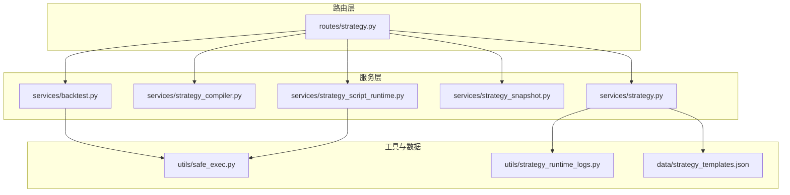
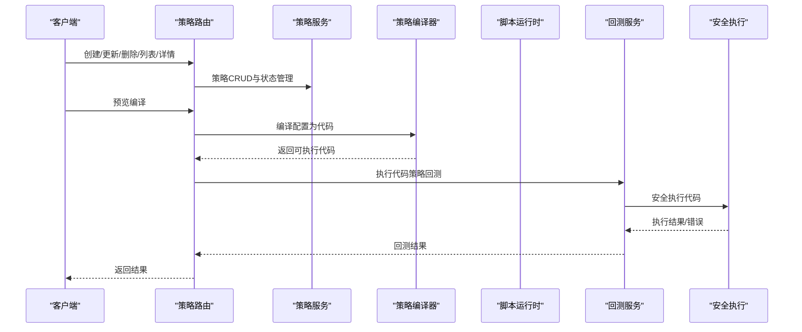
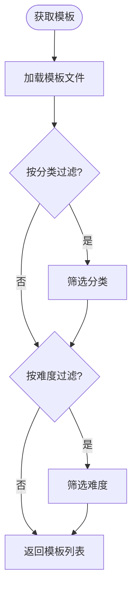
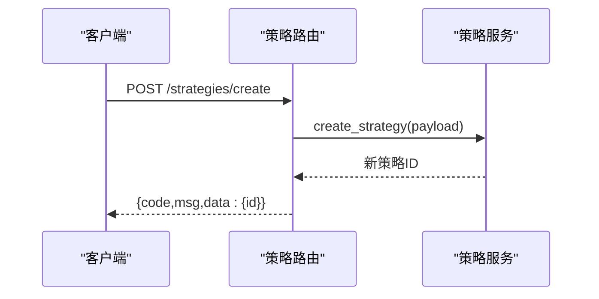
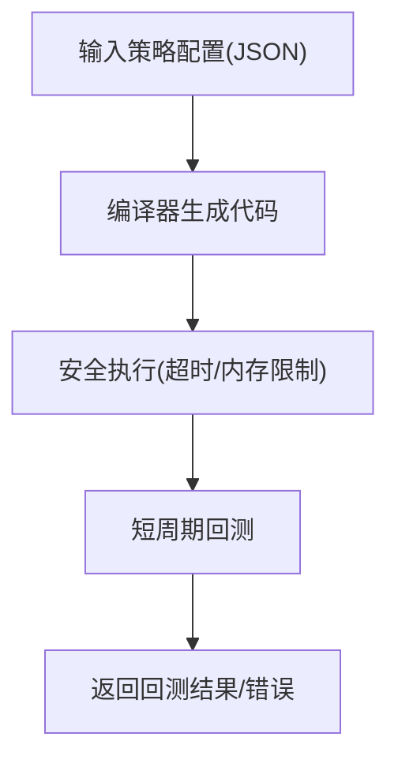
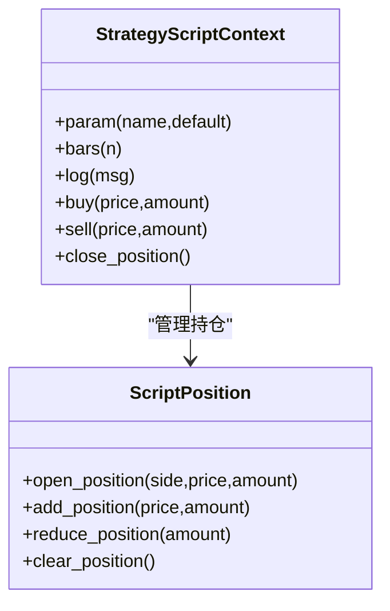
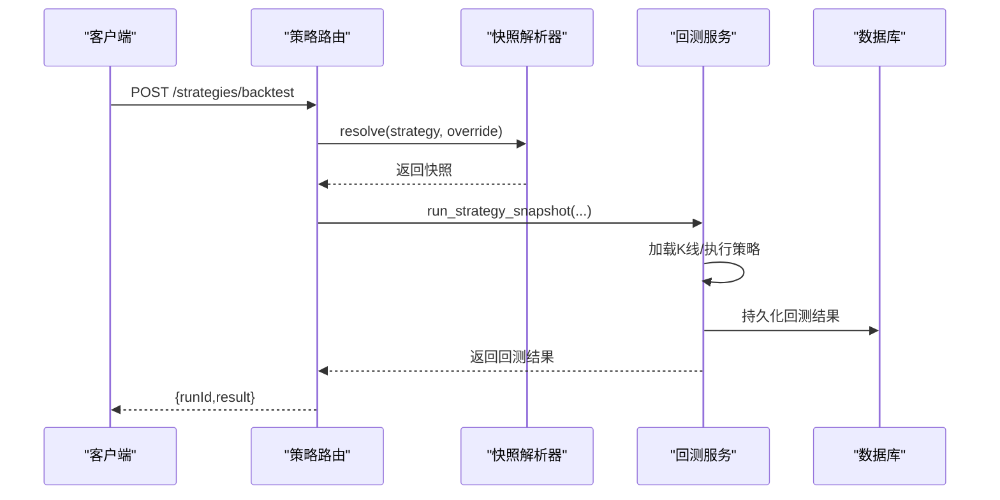
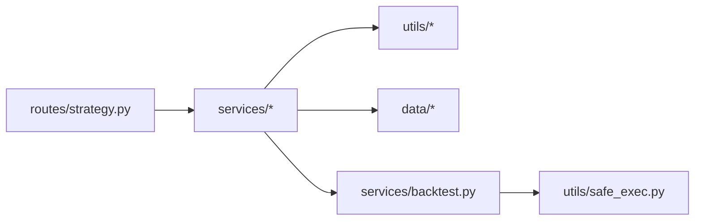

# 策略开发API

<cite>
**本文档引用的文件**
- [backend_api_python/app/routes/strategy.py](file://backend_api_python/app/routes/strategy.py)
- [backend_api_python/app/services/strategy.py](file://backend_api_python/app/services/strategy.py)
- [backend_api_python/app/services/strategy_compiler.py](file://backend_api_python/app/services/strategy_compiler.py)
- [backend_api_python/app/services/strategy_script_runtime.py](file://backend_api_python/app/services/strategy_script_runtime.py)
- [backend_api_python/app/services/strategy_snapshot.py](file://backend_api_python/app/services/strategy_snapshot.py)
- [backend_api_python/app/services/backtest.py](file://backend_api_python/app/services/backtest.py)
- [backend_api_python/app/data/strategy_templates.json](file://backend_api_python/app/data/strategy_templates.json)
- [backend_api_python/app/utils/safe_exec.py](file://backend_api_python/app/utils/safe_exec.py)
- [backend_api_python/app/utils/strategy_runtime_logs.py](file://backend_api_python/app/utils/strategy_runtime_logs.py)
</cite>

## 目录
1. [简介](#简介)
2. [项目结构](#项目结构)
3. [核心组件](#核心组件)
4. [架构总览](#架构总览)
5. [详细组件分析](#详细组件分析)
6. [依赖关系分析](#依赖关系分析)
7. [性能考虑](#性能考虑)
8. [故障排除指南](#故障排除指南)
9. [结论](#结论)
10. [附录](#附录)

## 简介
本文件面向策略开发者与平台使用者，系统化梳理策略开发API的设计与实现，覆盖策略创建、编辑、编译、测试、运行与监控的完整生命周期。重点说明以下能力：
- 策略类型：IndicatorStrategy（指标策略）与 ScriptStrategy（脚本策略）
- 策略模板获取、参数配置与版本管理
- 代码提交、语法检查、编译执行与错误报告机制
- 回测运行、历史查询与结果持久化
- 运行时沙箱执行与安全控制
- 通知与日志管理

## 项目结构
后端采用Flask蓝图组织策略相关路由，核心服务位于app/services目录，工具类位于app/utils目录，策略模板位于app/data目录。

**图表来源**
- [backend_api_python/app/routes/strategy.py:1-3044](file://backend_api_python/app/routes/strategy.py#L1-L3044)
- [backend_api_python/app/services/strategy.py:1-1245](file://backend_api_python/app/services/strategy.py#L1-L1245)
- [backend_api_python/app/services/strategy_compiler.py:1-689](file://backend_api_python/app/services/strategy_compiler.py#L1-L689)
- [backend_api_python/app/services/strategy_script_runtime.py:1-191](file://backend_api_python/app/services/strategy_script_runtime.py#L1-L191)
- [backend_api_python/app/services/strategy_snapshot.py:1-220](file://backend_api_python/app/services/strategy_snapshot.py#L1-L220)
- [backend_api_python/app/services/backtest.py:1-4938](file://backend_api_python/app/services/backtest.py#L1-L4938)
- [backend_api_python/app/data/strategy_templates.json:1-191](file://backend_api_python/app/data/strategy_templates.json#L1-L191)
- [backend_api_python/app/utils/safe_exec.py:1-471](file://backend_api_python/app/utils/safe_exec.py#L1-L471)
- [backend_api_python/app/utils/strategy_runtime_logs.py:1-30](file://backend_api_python/app/utils/strategy_runtime_logs.py#L1-L30)

**章节来源**
- [backend_api_python/app/routes/strategy.py:1-3044](file://backend_api_python/app/routes/strategy.py#L1-L3044)
- [backend_api_python/app/services/strategy.py:1-1245](file://backend_api_python/app/services/strategy.py#L1-L1245)
- [backend_api_python/app/services/strategy_compiler.py:1-689](file://backend_api_python/app/services/strategy_compiler.py#L1-L689)
- [backend_api_python/app/services/strategy_script_runtime.py:1-191](file://backend_api_python/app/services/strategy_script_runtime.py#L1-L191)
- [backend_api_python/app/services/strategy_snapshot.py:1-220](file://backend_api_python/app/services/strategy_snapshot.py#L1-L220)
- [backend_api_python/app/services/backtest.py:1-4938](file://backend_api_python/app/services/backtest.py#L1-L4938)
- [backend_api_python/app/data/strategy_templates.json:1-191](file://backend_api_python/app/data/strategy_templates.json#L1-L191)
- [backend_api_python/app/utils/safe_exec.py:1-471](file://backend_api_python/app/utils/safe_exec.py#L1-L471)
- [backend_api_python/app/utils/strategy_runtime_logs.py:1-30](file://backend_api_python/app/utils/strategy_runtime_logs.py#L1-L30)

## 核心组件
- 路由层（Blueprint）：集中定义策略相关的HTTP接口，负责鉴权、参数校验与响应封装
- 策略服务（StrategyService）：策略CRUD、运行状态管理、交易所连接测试、符号列表获取等
- 编译器（StrategyCompiler）：将JSON配置编译为可执行的Python策略代码
- 脚本运行时（StrategyScriptRuntime）：提供on_init/on_bar上下文与订单接口，支持沙箱执行
- 快照解析器（StrategySnapshotResolver）：将策略存储结构转换为回测引擎可消费的快照
- 回测服务（BacktestService）：加载K线、执行策略、计算指标、持久化回测结果
- 安全执行（SafeExec）：静态安全扫描、白名单内置函数、超时与内存限制、子进程隔离
- 模板数据（strategy_templates.json）：预置策略模板，含分类、难度、默认参数等

**章节来源**
- [backend_api_python/app/routes/strategy.py:1-3044](file://backend_api_python/app/routes/strategy.py#L1-L3044)
- [backend_api_python/app/services/strategy.py:1-1245](file://backend_api_python/app/services/strategy.py#L1-L1245)
- [backend_api_python/app/services/strategy_compiler.py:1-689](file://backend_api_python/app/services/strategy_compiler.py#L1-L689)
- [backend_api_python/app/services/strategy_script_runtime.py:1-191](file://backend_api_python/app/services/strategy_script_runtime.py#L1-L191)
- [backend_api_python/app/services/strategy_snapshot.py:1-220](file://backend_api_python/app/services/strategy_snapshot.py#L1-L220)
- [backend_api_python/app/services/backtest.py:1-4938](file://backend_api_python/app/services/backtest.py#L1-L4938)
- [backend_api_python/app/utils/safe_exec.py:1-471](file://backend_api_python/app/utils/safe_exec.py#L1-L471)
- [backend_api_python/app/data/strategy_templates.json:1-191](file://backend_api_python/app/data/strategy_templates.json#L1-L191)

## 架构总览
策略开发API围绕“路由-服务-工具”三层设计，策略生命周期从模板选择、参数配置、代码编译、语法检查、回测验证，到启动运行与日志通知贯穿始终。

**图表来源**
- [backend_api_python/app/routes/strategy.py:763-810](file://backend_api_python/app/routes/strategy.py#L763-L810)
- [backend_api_python/app/services/strategy_compiler.py:1-689](file://backend_api_python/app/services/strategy_compiler.py#L1-L689)
- [backend_api_python/app/services/backtest.py:1-4938](file://backend_api_python/app/services/backtest.py#L1-L4938)
- [backend_api_python/app/utils/safe_exec.py:1-471](file://backend_api_python/app/utils/safe_exec.py#L1-L471)

## 详细组件分析

### 策略模板与参数配置
- 模板获取：支持按分类与难度过滤，返回预置策略模板集合
- 默认参数：模板包含默认参数（如周期、时间框架、市场类别等），便于快速开始
- 参数映射：前端可直接传入覆盖参数，后端在快照解析阶段合并

**图表来源**
- [backend_api_python/app/routes/strategy.py:251-303](file://backend_api_python/app/routes/strategy.py#L251-L303)
- [backend_api_python/app/data/strategy_templates.json:1-191](file://backend_api_python/app/data/strategy_templates.json#L1-L191)

**章节来源**
- [backend_api_python/app/routes/strategy.py:251-303](file://backend_api_python/app/routes/strategy.py#L251-L303)
- [backend_api_python/app/data/strategy_templates.json:1-191](file://backend_api_python/app/data/strategy_templates.json#L1-L191)

### 策略创建与编辑
- 创建接口：接收用户ID、策略类型（默认IndicatorStrategy）、基础配置，写入数据库并返回ID
- 批量创建：支持多标的/多参数组合批量创建
- 更新接口：按ID更新策略配置，支持参数覆盖与状态变更
- 删除接口：支持单个或批量删除，同时停止运行中的策略

**图表来源**
- [backend_api_python/app/routes/strategy.py:763-810](file://backend_api_python/app/routes/strategy.py#L763-L810)
- [backend_api_python/app/services/strategy.py:766-800](file://backend_api_python/app/services/strategy.py#L766-L800)

**章节来源**
- [backend_api_python/app/routes/strategy.py:763-810](file://backend_api_python/app/routes/strategy.py#L763-L810)
- [backend_api_python/app/services/strategy.py:766-800](file://backend_api_python/app/services/strategy.py#L766-L800)

### 策略编译与预览
- 编译器：将JSON配置（参数、风控、加仓规则等）转换为可执行的Python策略代码
- 预览编译：先编译为代码，再进行短周期回测以验证逻辑正确性与性能表现
- 代码质量：内置质量检查（缺失函数、参数声明、交易意图等），提供提示与建议

**图表来源**
- [backend_api_python/app/services/strategy_compiler.py:1-689](file://backend_api_python/app/services/strategy_compiler.py#L1-L689)
- [backend_api_python/app/routes/strategy.py:1926-2008](file://backend_api_python/app/routes/strategy.py#L1926-L2008)
- [backend_api_python/app/utils/safe_exec.py:1-471](file://backend_api_python/app/utils/safe_exec.py#L1-L471)

**章节来源**
- [backend_api_python/app/services/strategy_compiler.py:1-689](file://backend_api_python/app/services/strategy_compiler.py#L1-L689)
- [backend_api_python/app/routes/strategy.py:1926-2008](file://backend_api_python/app/routes/strategy.py#L1926-L2008)
- [backend_api_python/app/utils/safe_exec.py:1-471](file://backend_api_python/app/utils/safe_exec.py#L1-L471)

### 代码安全与执行
- 安全扫描：正则+AST双重检查，禁止危险模块与函数调用
- 白名单内置：仅允许纯计算内置函数，禁用IO、反射、动态导入等
- 超时与内存：统一超时控制与内存上限，跨平台注入超时
- 子进程隔离：可选的子进程隔离执行，避免崩溃影响主进程
- 脚本运行时：提供on_init/on_bar上下文、参数读取、下单接口与日志记录

**图表来源**
- [backend_api_python/app/services/strategy_script_runtime.py:1-191](file://backend_api_python/app/services/strategy_script_runtime.py#L1-L191)

**章节来源**
- [backend_api_python/app/utils/safe_exec.py:1-471](file://backend_api_python/app/utils/safe_exec.py#L1-L471)
- [backend_api_python/app/services/strategy_script_runtime.py:1-191](file://backend_api_python/app/services/strategy_script_runtime.py#L1-L191)

### 回测与运行
- 快照解析：将策略配置转换为回测引擎可消费的快照（市场、符号、时间框架、风控、仓位、信号时机等）
- 多时间框架：根据回测范围自动选择1m/5m精度，支持信号与执行分离的精确模拟
- 结果持久化：回测运行记录、交易明细与净值曲线入库，支持历史查询与统计指标
- 启动/停止：通过TradingExecutor启动或停止策略，维护策略状态

**图表来源**
- [backend_api_python/app/routes/strategy.py:467-571](file://backend_api_python/app/routes/strategy.py#L467-L571)
- [backend_api_python/app/services/strategy_snapshot.py:116-220](file://backend_api_python/app/services/strategy_snapshot.py#L116-L220)
- [backend_api_python/app/services/backtest.py:1-4938](file://backend_api_python/app/services/backtest.py#L1-L4938)

**章节来源**
- [backend_api_python/app/routes/strategy.py:467-571](file://backend_api_python/app/routes/strategy.py#L467-L571)
- [backend_api_python/app/services/strategy_snapshot.py:116-220](file://backend_api_python/app/services/strategy_snapshot.py#L116-L220)
- [backend_api_python/app/services/backtest.py:1-4938](file://backend_api_python/app/services/backtest.py#L1-L4938)

### 通知与日志
- 通知管理：支持分页查询策略信号通知、未读计数、标记已读与清空
- 运行日志：策略运行期间的日志写入专用表，便于UI展示与排障

**章节来源**
- [backend_api_python/app/routes/strategy.py:2010-2399](file://backend_api_python/app/routes/strategy.py#L2010-L2399)
- [backend_api_python/app/utils/strategy_runtime_logs.py:1-30](file://backend_api_python/app/utils/strategy_runtime_logs.py#L1-L30)

## 依赖关系分析
- 路由依赖服务层：所有策略操作最终委托给StrategyService、BacktestService等
- 编译器与运行时：编译器输出代码交由脚本运行时与安全执行模块共同保障
- 快照解析：将策略存储结构标准化为回测引擎输入，降低耦合度
- 数据与模板：模板文件与数据库表配合，支撑策略的快速创建与参数化

**图表来源**
- [backend_api_python/app/routes/strategy.py:1-3044](file://backend_api_python/app/routes/strategy.py#L1-L3044)
- [backend_api_python/app/services/strategy.py:1-1245](file://backend_api_python/app/services/strategy.py#L1-L1245)
- [backend_api_python/app/services/backtest.py:1-4938](file://backend_api_python/app/services/backtest.py#L1-L4938)
- [backend_api_python/app/utils/safe_exec.py:1-471](file://backend_api_python/app/utils/safe_exec.py#L1-L471)
- [backend_api_python/app/data/strategy_templates.json:1-191](file://backend_api_python/app/data/strategy_templates.json#L1-L191)

**章节来源**
- [backend_api_python/app/routes/strategy.py:1-3044](file://backend_api_python/app/routes/strategy.py#L1-L3044)
- [backend_api_python/app/services/strategy.py:1-1245](file://backend_api_python/app/services/strategy.py#L1-L1245)
- [backend_api_python/app/services/backtest.py:1-4938](file://backend_api_python/app/services/backtest.py#L1-L4938)
- [backend_api_python/app/utils/safe_exec.py:1-471](file://backend_api_python/app/utils/safe_exec.py#L1-L471)
- [backend_api_python/app/data/strategy_templates.json:1-191](file://backend_api_python/app/data/strategy_templates.json#L1-L191)

## 性能考虑
- 回测时间框架自适应：根据回测跨度自动选择1m/5m精度，平衡性能与精度
- K线缓存：内存级K线缓存，减少重复外部API调用
- 批量操作：批量创建/启动/停止/删除策略，降低数据库往返开销
- 资源限制：安全执行模块提供超时与内存限制，防止长耗时或内存泄漏导致系统不稳定

[本节为通用指导，无需特定文件引用]

## 故障排除指南
- 代码安全拒绝：若被拒绝，检查是否使用了危险模块或函数，确认仅使用白名单内置与允许的库
- 语法错误：查看返回的语法错误位置与消息，修正语法后重试
- 缺少必要函数：确保策略包含on_bar函数；on_init可选，但需符合约定
- 回测范围超限：不同时间框架支持的最大回测天数不同，调整时间范围或时间框架
- 连接测试失败：检查API Key/Secret、IP白名单、市场类型与base_url一致性
- 通知/日志异常：确认数据库表存在且具备相应索引，必要时触发schema初始化

**章节来源**
- [backend_api_python/app/utils/safe_exec.py:358-471](file://backend_api_python/app/utils/safe_exec.py#L358-L471)
- [backend_api_python/app/routes/strategy.py:572-610](file://backend_api_python/app/routes/strategy.py#L572-L610)
- [backend_api_python/app/services/backtest.py:170-225](file://backend_api_python/app/services/backtest.py#L170-L225)

## 结论
该策略开发API以清晰的分层设计实现了从模板到运行的全生命周期管理。通过编译器与脚本运行时的配合，结合安全执行与回测服务，既保证了策略开发的灵活性，又确保了执行的安全性与稳定性。模板化与参数化设计降低了入门门槛，而通知与日志体系则提升了运维可观测性。

[本节为总结性内容，无需特定文件引用]

## 附录

### 接口清单与最佳实践
- 接口清单
  - 模板：GET /strategies/templates, GET /strategies/templates/:key
  - 列表与详情：GET /strategies, GET /strategies/detail
  - 创建/更新/删除/批量：POST /strategies/create, PUT /strategies/update, DELETE /strategies/delete, POST /strategies/batch-create, POST /strategies/batch-start, POST /strategies/batch-stop, DELETE /strategies/batch-delete
  - 回测：POST /strategies/backtest, GET /strategies/backtest/history, GET /strategies/backtest/get
  - 运行：POST /strategies/start, POST /strategies/stop
  - 预览编译：POST /strategies/preview-compile
  - 通知：GET /strategies/notifications, GET /strategies/notifications/unread-count, POST /strategies/notifications/read, POST /strategies/notifications/read-all, DELETE /strategies/notifications/clear
  - 交易所：POST /strategies/test-connection, POST /strategies/get-symbols
- 最佳实践
  - 使用模板作为起点，逐步调整参数
  - 在预览编译阶段进行小样本回测，验证逻辑正确性
  - 合理设置风控参数（止损、止盈、跟踪止损），避免过度回测过拟合
  - 对于脚本策略，严格遵循on_init/on_bar约定，避免使用未授权的内置与模块
  - 使用批量接口进行大规模策略部署与运维
  - 关注通知与日志，及时发现并处理异常

**章节来源**
- [backend_api_python/app/routes/strategy.py:251-2399](file://backend_api_python/app/routes/strategy.py#L251-L2399)
- [backend_api_python/app/data/strategy_templates.json:1-191](file://backend_api_python/app/data/strategy_templates.json#L1-L191)