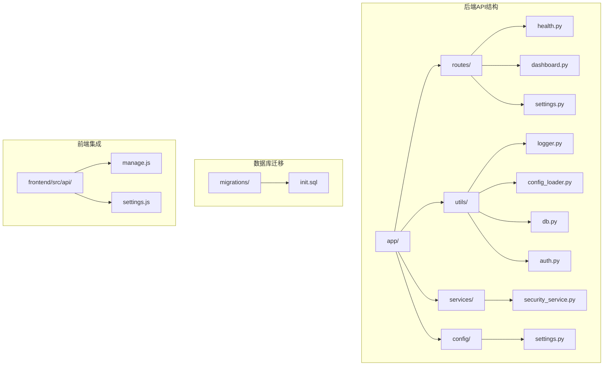
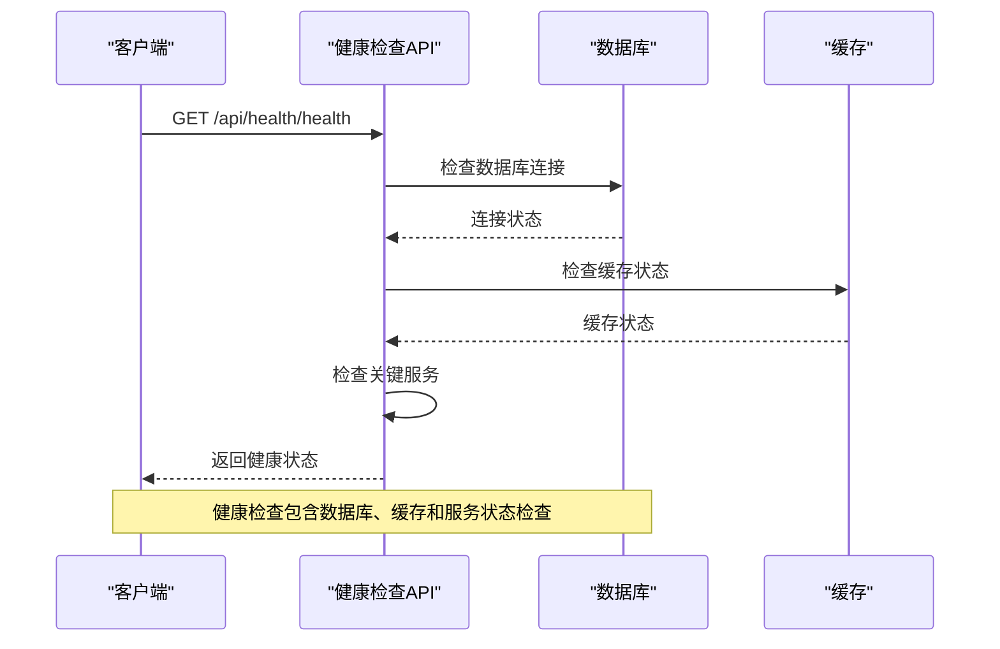
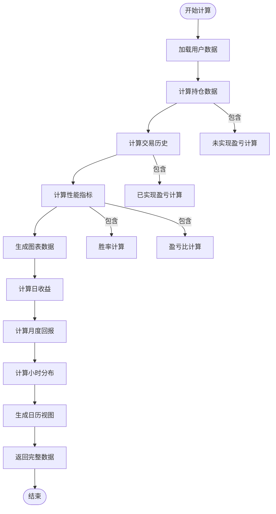
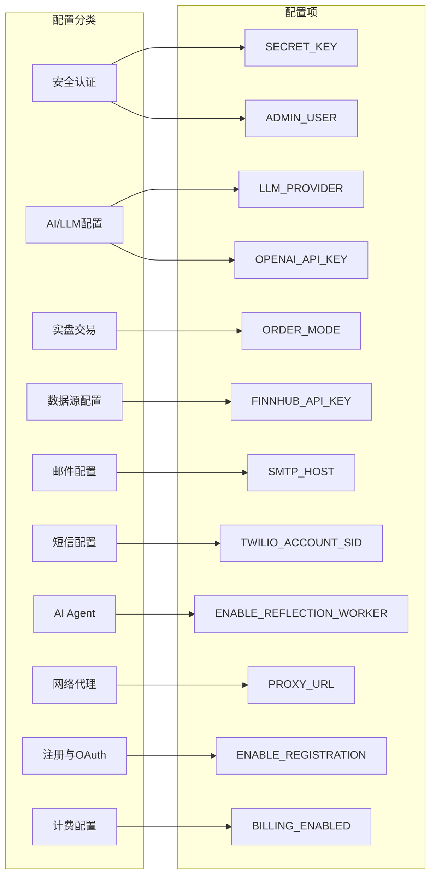
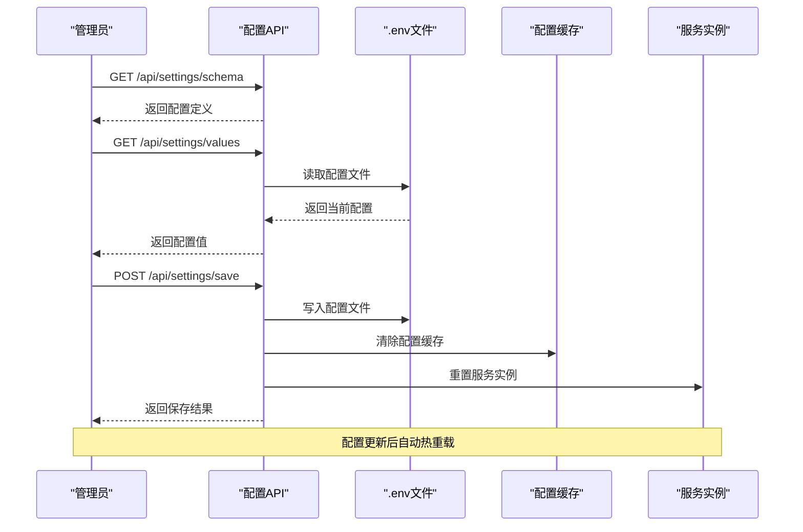
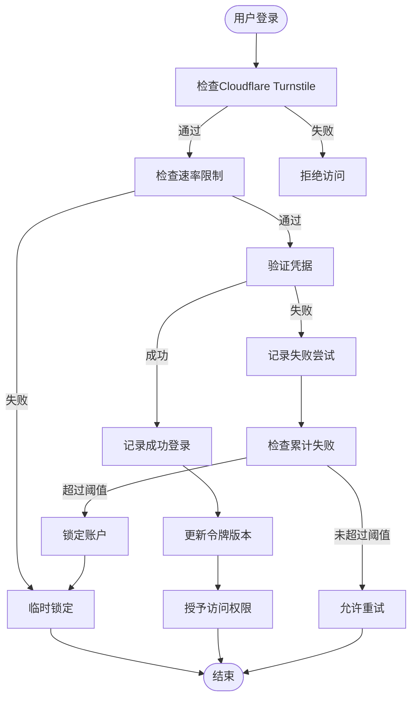
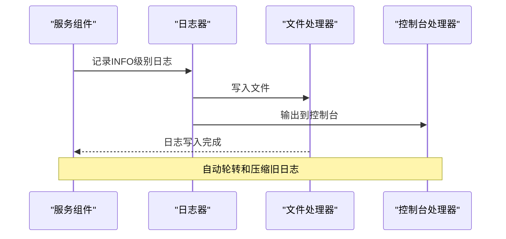
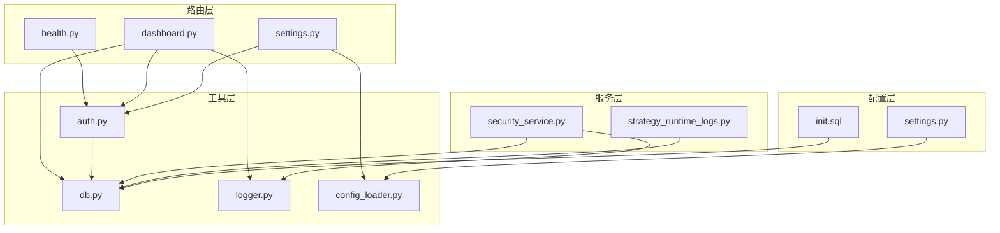

# 系统管理API

<cite>
**本文档引用的文件**
- [health.py](file://backend_api_python/app/routes/health.py)
- [dashboard.py](file://backend_api_python/app/routes/dashboard.py)
- [settings.py](file://backend_api_python/app/routes/settings.py)
- [logger.py](file://backend_api_python/app/utils/logger.py)
- [security_service.py](file://backend_api_python/app/services/security_service.py)
- [config_loader.py](file://backend_api_python/app/utils/config_loader.py)
- [db.py](file://backend_api_python/app/utils/db.py)
- [auth.py](file://backend_api_python/app/utils/auth.py)
- [settings.py](file://backend_api_python/app/config/settings.py)
- [init.sql](file://backend_api_python/migrations/init.sql)
- [strategy_runtime_logs.py](file://backend_api_python/app/utils/strategy_runtime_logs.py)
</cite>

## 目录
1. [简介](#简介)
2. [项目结构](#项目结构)
3. [核心组件](#核心组件)
4. [架构概览](#架构概览)
5. [详细组件分析](#详细组件分析)
6. [依赖关系分析](#依赖关系分析)
7. [性能考虑](#性能考虑)
8. [故障排除指南](#故障排除指南)
9. [结论](#结论)

## 简介

QuantDinger系统管理API是一套完整的后端管理系统，提供了全面的系统状态监控、配置管理和健康检查功能。该API基于Flask框架构建，采用PostgreSQL作为数据存储，支持实时仪表板数据获取、系统性能指标监控、资源使用情况查询、系统设置更新、日志管理和错误报告等功能。

系统管理API主要服务于量化交易系统的运维需求，包括但不限于：
- 系统健康状态监控和告警
- 实时仪表板数据展示
- 配置参数动态管理
- 安全认证和权限控制
- 日志记录和审计追踪
- 批量操作和定时任务管理
- 维护模式和紧急响应

## 项目结构

QuantDinger项目的后端API采用模块化设计，主要目录结构如下：



**图表来源**
- [health.py:1-109](file://backend_api_python/app/routes/health.py#L1-L109)
- [dashboard.py:1-843](file://backend_api_python/app/routes/dashboard.py#L1-L843)
- [settings.py:1-1418](file://backend_api_python/app/routes/settings.py#L1-L1418)

**章节来源**
- [health.py:1-109](file://backend_api_python/app/routes/health.py#L1-L109)
- [dashboard.py:1-843](file://backend_api_python/app/routes/dashboard.py#L1-L843)
- [settings.py:1-1418](file://backend_api_python/app/routes/settings.py#L1-L1418)

## 核心组件

### 健康检查服务
系统提供多层次的健康检查机制，确保服务可用性和稳定性。

### 仪表板管理
实时监控和展示系统关键指标，包括交易统计、持仓分析、收益表现等。

### 配置管理系统
集中化的配置管理，支持动态更新和热重载，涵盖安全认证、AI/LLM配置、数据源配置等。

### 安全服务
提供认证保护、速率限制、暴力破解防护等安全功能。

**章节来源**
- [health.py:46-109](file://backend_api_python/app/routes/health.py#L46-L109)
- [dashboard.py:307-800](file://backend_api_python/app/routes/dashboard.py#L307-L800)
- [settings.py:78-880](file://backend_api_python/app/routes/settings.py#L78-L880)
- [security_service.py:26-399](file://backend_api_python/app/services/security_service.py#L26-L399)

## 架构概览

系统采用分层架构设计，确保各组件职责清晰、耦合度低：

```mermaid
graph TB
subgraph "API层"
A[健康检查API]
B[仪表板API]
C[设置管理API]
end
subgraph "服务层"
D[安全服务]
E[配置加载器]
F[日志服务]
end
subgraph "工具层"
G[认证工具]
H[数据库连接]
I[策略日志]
end
subgraph "数据层"
J[PostgreSQL数据库]
K[配置文件(.env)]
end
A --> D
B --> E
C --> F
D --> H
E --> J
F --> J
G --> J
H --> J
I --> J
K --> E
```

**图表来源**
- [auth.py:126-171](file://backend_api_python/app/utils/auth.py#L126-L171)
- [db.py:19-25](file://backend_api_python/app/utils/db.py#L19-L25)
- [config_loader.py:24-50](file://backend_api_python/app/utils/config_loader.py#L24-L50)

系统架构特点：
- **模块化设计**：各功能模块相对独立，便于维护和扩展
- **安全优先**：内置多重安全防护机制
- **实时监控**：提供丰富的指标和统计数据
- **配置灵活**：支持动态配置和热重载
- **日志完整**：全面的安全审计和操作日志

## 详细组件分析

### 健康检查API

健康检查API提供系统状态监控功能，支持多种检查级别：

#### 接口定义

| 接口 | 方法 | 描述 |
|------|------|------|
| `/api/health` | GET | 基础健康检查 |
| `/api/health/health` | GET | 详细健康状态 |
| `/api/health/api/health` | GET | 兼容性检查 |

#### 健康检查流程



**图表来源**
- [health.py:46-77](file://backend_api_python/app/routes/health.py#L46-L77)

**章节来源**
- [health.py:10-109](file://backend_api_python/app/routes/health.py#L10-L109)

### 仪表板API

仪表板API提供实时的系统监控和数据分析功能：

#### 核心功能模块

| 模块 | 功能 | 描述 |
|------|------|------|
| `/api/dashboard/summary` | 概要信息 | 返回总资产、总收益、交易统计等关键指标 |
| `/api/dashboard/pendingOrders` | 待执行订单 | 返回待处理订单列表和状态 |
| `/api/dashboard/pendingOrders/{id}` | 删除订单 | 删除指定的待执行订单 |

#### 仪表板数据计算



**图表来源**
- [dashboard.py:127-254](file://backend_api_python/app/routes/dashboard.py#L127-L254)
- [dashboard.py:257-304](file://backend_api_python/app/routes/dashboard.py#L257-L304)

#### 性能指标计算

系统提供全面的性能分析指标：

| 指标类别 | 指标名称 | 计算公式 | 用途 |
|----------|----------|----------|------|
| 交易统计 | 总交易数 | 所有交易数量 | 整体活跃度 |
| 交易统计 | 胜率 | 获利交易数/总交易数 | 盈利能力评估 |
| 交易统计 | 盈亏比 | 总盈利/总亏损 | 风险收益比 |
| 收益分析 | 最大回撤 | 最大资金回撤额 | 风险控制 |
| 收益分析 | 年化收益率 | (最终资产/初始资产)^(252/天数)-1 | 投资回报 |
| 时间分析 | 小时分布 | 每小时交易次数和收益 | 交易时段分析 |

**章节来源**
- [dashboard.py:127-528](file://backend_api_python/app/routes/dashboard.py#L127-L528)

### 配置管理API

配置管理API提供集中化的系统配置管理功能：

#### 配置分类

系统配置按照功能模块进行分类管理：



**图表来源**
- [settings.py:78-880](file://backend_api_python/app/routes/settings.py#L78-L880)

#### 配置管理流程



**图表来源**
- [settings.py:1114-1206](file://backend_api_python/app/routes/settings.py#L1114-L1206)

**章节来源**
- [settings.py:78-1418](file://backend_api_python/app/routes/settings.py#L78-L1418)

### 安全服务

安全服务提供多层次的安全防护机制：

#### 安全功能模块

| 功能模块 | 描述 | 实现方式 |
|----------|------|----------|
| 认证保护 | JWT令牌验证 | 令牌签名和过期检查 |
| 速率限制 | 登录尝试限制 | 时间窗口内失败次数统计 |
| 验证码 | 邮箱验证码 | 频率限制和过期管理 |
| 安全审计 | 操作日志记录 | 完整的操作追踪 |
| 密码强度 | 密码复杂度验证 | 多项规则检查 |

#### 安全检查流程



**图表来源**
- [security_service.py:200-241](file://backend_api_python/app/services/security_service.py#L200-L241)

**章节来源**
- [security_service.py:26-399](file://backend_api_python/app/services/security_service.py#L26-L399)

### 日志管理

系统提供完整的日志管理功能：

#### 日志配置

| 配置项 | 默认值 | 描述 |
|--------|--------|------|
| LOG_LEVEL | INFO | 日志级别 |
| LOG_DIR | logs | 日志目录 |
| LOG_MAX_BYTES | 10MB | 单个日志文件大小 |
| LOG_BACKUP_COUNT | 5 | 备份数量 |

#### 日志记录流程



**图表来源**
- [logger.py:9-48](file://backend_api_python/app/utils/logger.py#L9-L48)

**章节来源**
- [logger.py:1-63](file://backend_api_python/app/utils/logger.py#L1-L63)

## 依赖关系分析

系统各组件之间的依赖关系如下：



**图表来源**
- [auth.py:1-239](file://backend_api_python/app/utils/auth.py#L1-L239)
- [db.py:1-66](file://backend_api_python/app/utils/db.py#L1-L66)
- [config_loader.py:1-252](file://backend_api_python/app/utils/config_loader.py#L1-L252)

**章节来源**
- [auth.py:1-239](file://backend_api_python/app/utils/auth.py#L1-L239)
- [db.py:1-66](file://backend_api_python/app/utils/db.py#L1-L66)
- [config_loader.py:1-252](file://backend_api_python/app/utils/config_loader.py#L1-L252)

## 性能考虑

系统在设计时充分考虑了性能优化：

### 数据库优化
- 使用PostgreSQL作为主要数据存储
- 合理的索引设计和查询优化
- 连接池管理和资源复用

### 缓存策略
- 配置缓存避免频繁文件读取
- 服务实例缓存减少初始化开销
- 适当的内存使用和垃圾回收

### 网络优化
- 合理的超时设置和重试机制
- 异步处理和队列管理
- 资源限制和防滥用机制

## 故障排除指南

### 常见问题及解决方案

| 问题类型 | 症状 | 可能原因 | 解决方案 |
|----------|------|----------|----------|
| 认证失败 | 401未授权 | 令牌过期或无效 | 重新登录获取新令牌 |
| 权限不足 | 403禁止访问 | 角色权限不够 | 联系管理员提升权限 |
| 数据库连接 | 连接超时 | 数据库不可用 | 检查数据库服务状态 |
| 配置更新 | 设置未生效 | 缓存未清除 | 手动触发配置重载 |
| 安全锁定 | 账户被锁定 | 多次登录失败 | 等待锁定解除或联系管理员 |

### 调试技巧

1. **启用详细日志**：设置`LOG_LEVEL=DEBUG`获取更详细的调试信息
2. **检查环境变量**：确认所有必需的环境变量已正确设置
3. **验证数据库连接**：使用`/api/health/health`接口检查数据库连接状态
4. **查看安全日志**：通过`qd_security_logs`表查看安全事件记录

**章节来源**
- [logger.py:9-33](file://backend_api_python/app/utils/logger.py#L9-L33)
- [security_service.py:362-399](file://backend_api_python/app/services/security_service.py#L362-L399)

## 结论

QuantDinger系统管理API提供了一套完整、安全、高效的系统管理解决方案。通过模块化的架构设计、多层次的安全防护、实时的监控能力和灵活的配置管理，该API能够满足量化交易系统的各种管理需求。

主要优势包括：
- **全面的监控功能**：实时掌握系统状态和性能指标
- **灵活的配置管理**：支持动态更新和热重载
- **强大的安全机制**：多层防护确保系统安全
- **完善的日志体系**：完整的审计和追踪能力
- **良好的扩展性**：模块化设计便于功能扩展

该API为QuantDinger平台的稳定运行提供了坚实的技术基础，能够有效支撑复杂的量化交易业务需求。