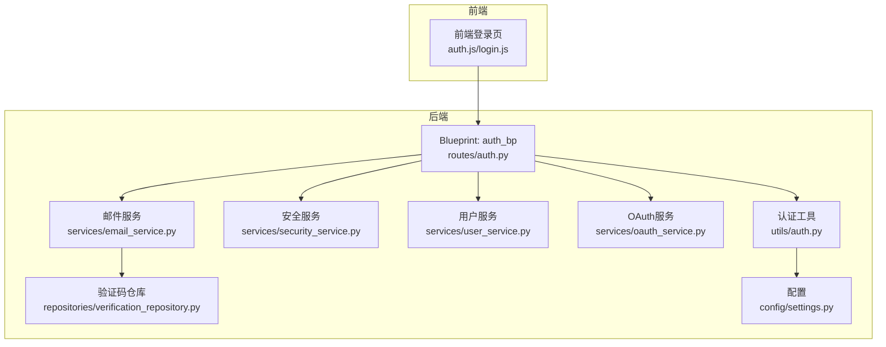
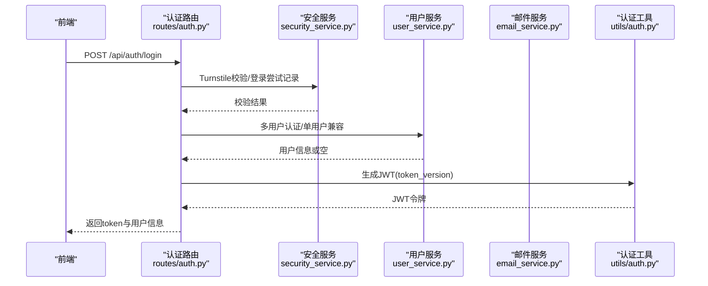
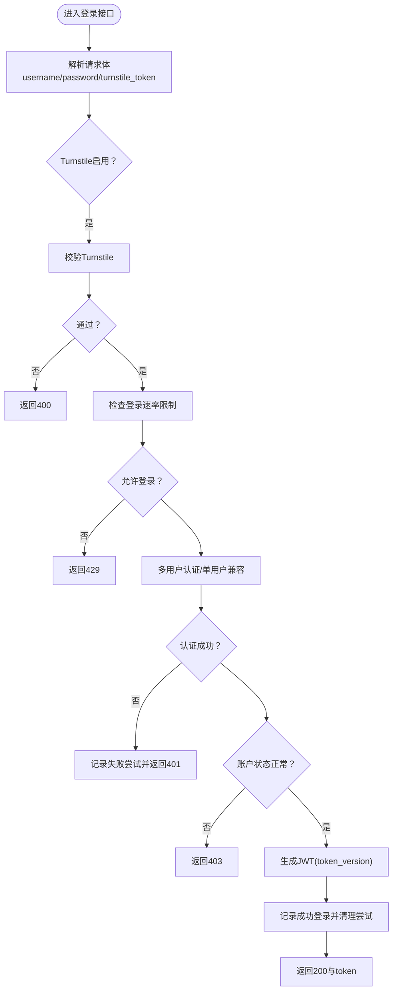
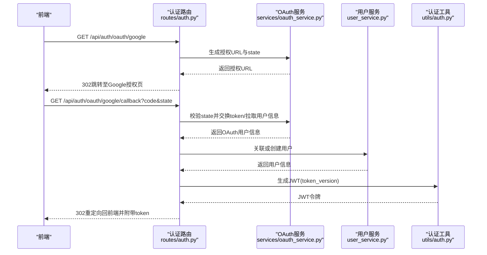
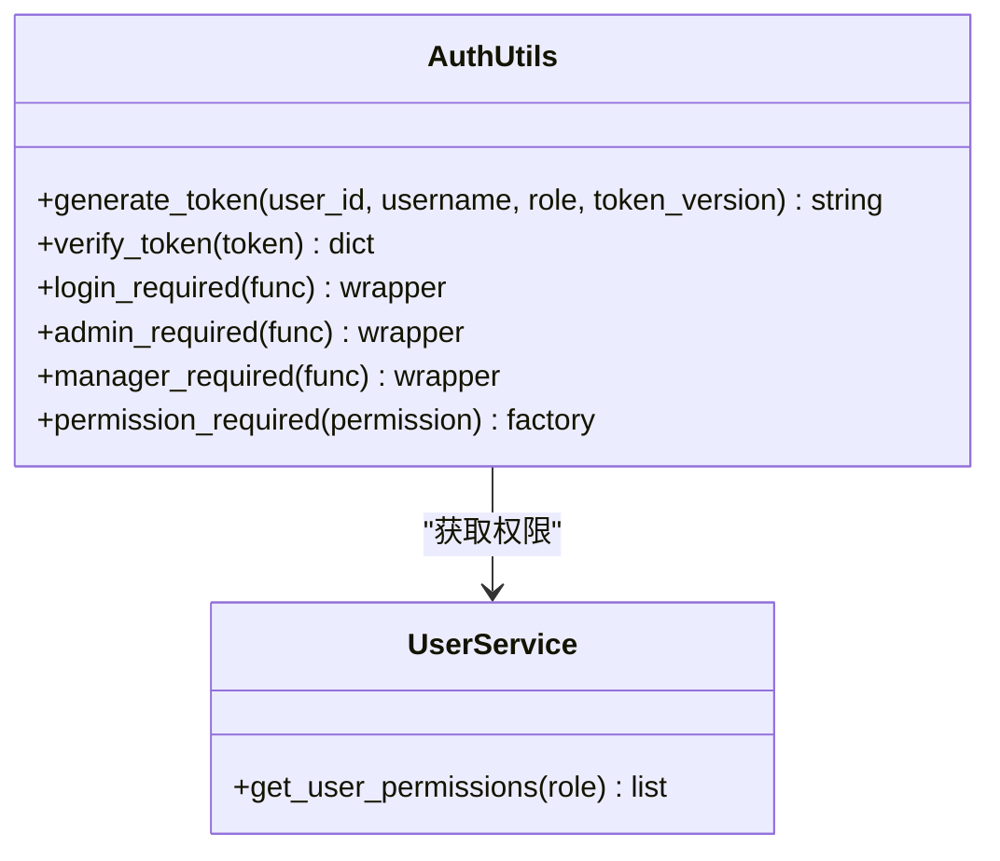
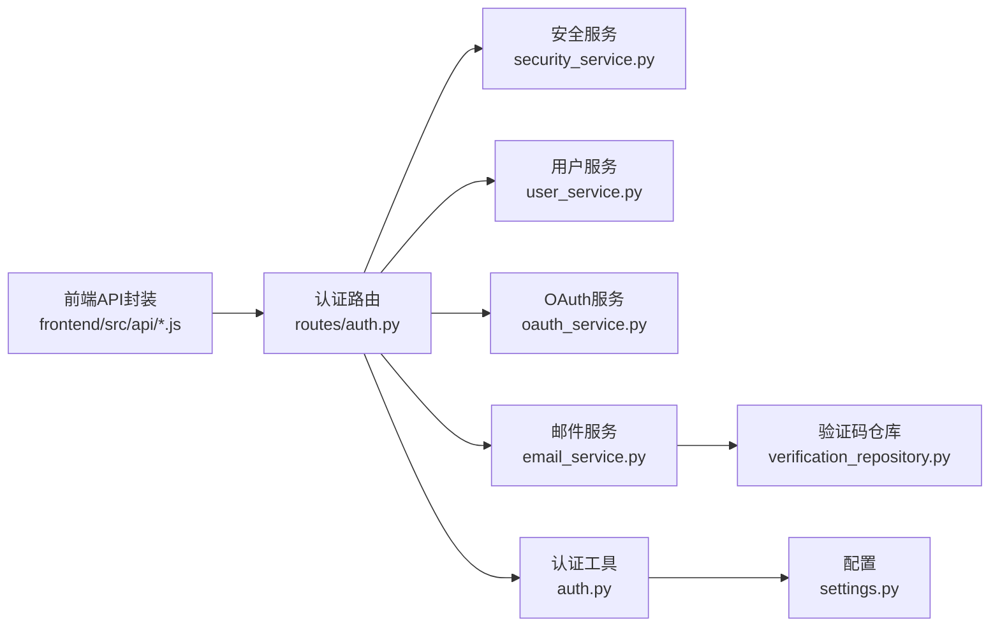

# 认证API

<cite>
**本文档引用的文件**
- [backend_api_python/app/routes/auth.py](file://backend_api_python/app/routes/auth.py)
- [backend_api_python/app/utils/auth.py](file://backend_api_python/app/utils/auth.py)
- [backend_api_python/app/services/oauth_service.py](file://backend_api_python/app/services/oauth_service.py)
- [backend_api_python/app/services/security_service.py](file://backend_api_python/app/services/security_service.py)
- [backend_api_python/app/services/user_service.py](file://backend_api_python/app/services/user_service.py)
- [backend_api_python/app/services/email_service.py](file://backend_api_python/app/services/email_service.py)
- [backend_api_python/app/database/repositories/verification_repository.py](file://backend_api_python/app/database/repositories/verification_repository.py)
- [backend_api_python/app/models/verification.py](file://backend_api_python/app/models/verification.py)
- [backend_api_python/app/config/settings.py](file://backend_api_python/app/config/settings.py)
- [backend_api_python/env.example](file://backend_api_python/env.example)
- [frontend/src/api/auth.js](file://frontend/src/api/auth.js)
- [frontend/src/api/login.js](file://frontend/src/api/login.js)
- [docs/OAUTH_CONFIG_EN.md](file://docs/OAUTH_CONFIG_EN.md)
- [docs/multi-user-setup.md](file://docs/multi-user-setup.md)
- [docs/CLOUD_DEPLOYMENT_EN.md](file://docs/CLOUD_DEPLOYMENT_EN.md)
</cite>

## 更新摘要
**所做更改**
- 新增验证码发送和密码修改API端点的详细文档
- 更新认证流程和安全验证机制说明
- 增强验证码类型支持和发送频率限制机制
- 完善密码修改的已登录用户流程说明
- 更新安全配置和错误处理机制

## 目录
1. [简介](#简介)
2. [项目结构](#项目结构)
3. [核心组件](#核心组件)
4. [架构总览](#架构总览)
5. [详细组件分析](#详细组件分析)
6. [依赖关系分析](#依赖关系分析)
7. [性能考虑](#性能考虑)
8. [故障排查指南](#故障排查指南)
9. [结论](#结论)
10. [附录](#附录)

## 简介
本文件为 QuantDinger 认证API的权威技术文档，覆盖用户登录、注册、登出、密码重置与修改、邮箱验证码发送与校验、第三方OAuth登录（Google/GitHub）、JWT令牌生成与校验、单客户端强制登录（token_version）、会话管理与权限验证等完整能力。文档同时提供错误码与处理方案、安全最佳实践与部署建议，并通过图示帮助读者快速理解认证流程。

## 项目结构
后端采用 Flask Blueprint 组织认证路由，核心逻辑位于 routes/auth.py；认证工具与装饰器位于 utils/auth.py；OAuth、安全策略与用户服务分别位于 services 子模块；前端通过统一的 API 封装发起认证请求。

**图表来源**
- [backend_api_python/app/routes/auth.py](file://backend_api_python/app/routes/auth.py)
- [backend_api_python/app/utils/auth.py](file://backend_api_python/app/utils/auth.py)
- [backend_api_python/app/services/security_service.py](file://backend_api_python/app/services/security_service.py)
- [backend_api_python/app/services/user_service.py](file://backend_api_python/app/services/user_service.py)
- [backend_api_python/app/services/oauth_service.py](file://backend_api_python/app/services/oauth_service.py)
- [backend_api_python/app/services/email_service.py](file://backend_api_python/app/services/email_service.py)
- [backend_api_python/app/database/repositories/verification_repository.py](file://backend_api_python/app/database/repositories/verification_repository.py)
- [backend_api_python/app/config/settings.py](file://backend_api_python/app/config/settings.py)

**章节来源**
- [backend_api_python/app/routes/auth.py](file://backend_api_python/app/routes/auth.py)
- [backend_api_python/app/utils/auth.py](file://backend_api_python/app/utils/auth.py)
- [backend_api_python/app/services/security_service.py](file://backend_api_python/app/services/security_service.py)
- [backend_api_python/app/services/user_service.py](file://backend_api_python/app/services/user_service.py)
- [backend_api_python/app/services/oauth_service.py](file://backend_api_python/app/services/oauth_service.py)
- [backend_api_python/app/services/email_service.py](file://backend_api_python/app/services/email_service.py)
- [backend_api_python/app/database/repositories/verification_repository.py](file://backend_api_python/app/database/repositories/verification_repository.py)
- [backend_api_python/app/config/settings.py](file://backend_api_python/app/config/settings.py)

## 核心组件
- 认证路由层：提供 /api/auth/* 的完整认证接口族，包括登录、注册、登出、信息查询、验证码、密码变更与重置、OAuth授权与回调。
- 认证工具层：JWT 生成与校验、Bearer Token 中间件、角色与权限装饰器、单用户兼容模式。
- 安全服务层：Cloudflare Turnstile 人机验证、登录尝试记录与限流、验证码发送频率限制、安全事件审计。
- 用户服务层：多用户认证、密码哈希与校验、角色权限映射、token_version 单客户端强制登录。
- OAuth 服务层：Google/GitHub 授权链接生成、回调处理、用户拉取与账户绑定、OAuth 状态持久化与防重放。
- 邮件服务层：验证码生成与发送、邮件模板渲染、SMTP 配置与发送。
- 验证码仓库层：验证码存储、验证、过期管理、尝试次数限制。
- 配置层：SECRET_KEY、管理员账号、OAuth 回调地址、注册开关、Turnstile 开关等。

**章节来源**
- [backend_api_python/app/routes/auth.py](file://backend_api_python/app/routes/auth.py)
- [backend_api_python/app/utils/auth.py](file://backend_api_python/app/utils/auth.py)
- [backend_api_python/app/services/security_service.py](file://backend_api_python/app/services/security_service.py)
- [backend_api_python/app/services/user_service.py](file://backend_api_python/app/services/user_service.py)
- [backend_api_python/app/services/oauth_service.py](file://backend_api_python/app/services/oauth_service.py)
- [backend_api_python/app/services/email_service.py](file://backend_api_python/app/services/email_service.py)
- [backend_api_python/app/database/repositories/verification_repository.py](file://backend_api_python/app/database/repositories/verification_repository.py)
- [backend_api_python/app/config/settings.py](file://backend_api_python/app/config/settings.py)

## 架构总览
认证系统采用"无状态令牌 + 多层防护"的设计：
- 前端通过统一 API 发起认证请求，后端返回 JWT 令牌。
- 后端使用 SECRET_KEY 对令牌进行签名与校验，确保完整性与防篡改。
- 登录流程集成 Turnstile 人机验证、IP/账号级速率限制与暴力破解保护。
- OAuth 流程通过 state 防重放，回调后将用户信息与本地账户关联或自动创建新用户。
- 单客户端登录通过 token_version 实现，每次登录/授权后递增，旧令牌立即失效。
- 验证码系统支持多种类型（注册、登录、密码重置、密码修改、邮箱修改），具有严格的频率限制和安全保护。

**图表来源**
- [backend_api_python/app/routes/auth.py](file://backend_api_python/app/routes/auth.py)
- [backend_api_python/app/services/security_service.py](file://backend_api_python/app/services/security_service.py)
- [backend_api_python/app/services/user_service.py](file://backend_api_python/app/services/user_service.py)
- [backend_api_python/app/utils/auth.py](file://backend_api_python/app/utils/auth.py)

## 详细组件分析

### 1) 登录接口
- HTTP 方法与URL
  - POST /api/auth/login
- 请求参数
  - username 或 account：用户名或邮箱（二者其一）
  - password：明文密码
  - turnstile_token：可选的人机验证令牌
- 响应格式
  - 成功：返回 code=1、msg="登录成功"、data.token 与 data.userinfo
  - 失败：返回 code、msg、data=null
- 安全特性
  - 可选 Turnstile 校验
  - 登录尝试记录与速率限制
  - 账户状态校验（禁用/待激活）
  - 生成带 token_version 的 JWT，实现单客户端登录
- 错误码
  - 400：缺少必要字段、Turnstile 校验失败、验证码发送限制
  - 401：凭据无效
  - 403：账户被禁用/待激活
  - 429：IP/账号被临时封禁
  - 500：内部错误

**图表来源**
- [backend_api_python/app/routes/auth.py](file://backend_api_python/app/routes/auth.py)
- [backend_api_python/app/services/security_service.py](file://backend_api_python/app/services/security_service.py)
- [backend_api_python/app/utils/auth.py](file://backend_api_python/app/utils/auth.py)

**章节来源**
- [backend_api_python/app/routes/auth.py](file://backend_api_python/app/routes/auth.py)
- [backend_api_python/app/services/security_service.py](file://backend_api_python/app/services/security_service.py)
- [backend_api_python/app/utils/auth.py](file://backend_api_python/app/utils/auth.py)

### 2) 邮箱验证码登录（快速登录/注册）
- HTTP 方法与URL
  - POST /api/auth/login-code
- 请求参数
  - email：邮箱
  - code：验证码
  - turnstile_token：可选
  - referral_code：可选（邀请奖励）
- 响应格式
  - 成功：返回 token、is_new_user 标记、userinfo
  - 失败：返回 code、msg、data=null
- 行为说明
  - 验证码校验通过后，若用户不存在且允许注册则自动创建用户（无密码）
  - 自动发放注册/邀请奖励积分
  - 生成带 token_version 的 JWT

**章节来源**
- [backend_api_python/app/routes/auth.py](file://backend_api_python/app/routes/auth.py)

### 3) 注册接口
- HTTP 方法与URL
  - POST /api/auth/register
- 请求参数
  - email：邮箱
  - code：验证码
  - username：用户名
  - password：密码
  - turnstile_token：可选
  - referral_code：可选
- 响应格式
  - 成功：返回 token 与 userinfo
  - 失败：返回 code、msg、data=null
- 安全特性
  - 密码强度校验
  - Turnstile 校验
  - 验证码发送频率限制
  - 自动发放注册奖励

**章节来源**
- [backend_api_python/app/routes/auth.py](file://backend_api_python/app/routes/auth.py)
- [backend_api_python/app/services/security_service.py](file://backend_api_python/app/services/security_service.py)

### 4) 发送验证码
- HTTP 方法与URL
  - POST /api/auth/send-code
- 请求参数
  - email：邮箱
  - type：验证码类型（register/login/reset_password/change_password）
  - turnstile_token：可选（非 change_password 时）
- 响应格式
  - 成功：返回 code=1、msg、data=null
  - 失败：返回 code、msg、data=null
- 行为说明
  - change_password 类型在已登录场景下可跳过 Turnstile
  - 针对不同类型的发送频率与IP小时上限进行限制
  - 支持的验证码类型：
    - register：注册验证码
    - login：登录验证码
    - reset_password：密码重置验证码
    - change_password：密码修改验证码
    - change_email：邮箱修改验证码

**更新** 新增验证码类型支持和智能跳过机制

**章节来源**
- [backend_api_python/app/routes/auth.py](file://backend_api_python/app/routes/auth.py)
- [backend_api_python/app/services/security_service.py](file://backend_api_python/app/services/security_service.py)
- [backend_api_python/app/services/email_service.py](file://backend_api_python/app/services/email_service.py)

### 5) 密码重置
- HTTP 方法与URL
  - POST /api/auth/reset-password
- 请求参数
  - email：邮箱
  - code：验证码
  - new_password：新密码
  - turnstile_token：可选
- 响应格式
  - 成功：返回 code=1、msg
  - 失败：返回 code、msg、data=null
- 安全特性
  - 密码强度验证（至少8位，包含大小写字母和数字）
  - 验证码一次性使用和过期保护
  - 防暴力破解尝试限制

**章节来源**
- [backend_api_python/app/routes/auth.py](file://backend_api_python/app/routes/auth.py)
- [backend_api_python/app/services/security_service.py](file://backend_api_python/app/services/security_service.py)
- [backend_api_python/app/services/email_service.py](file://backend_api_python/app/services/email_service.py)

### 6) 修改密码（已登录用户）
- HTTP 方法与URL
  - POST /api/auth/change-password
- 请求参数
  - Authorization: Bearer <token>
  - code：验证码
  - new_password：新密码
- 响应格式
  - 成功：返回 code=1、msg
  - 失败：返回 code、msg、data=null
- 安全特性
  - 已登录用户身份验证
  - 密码强度验证
  - 验证码一次性使用和过期保护
  - change_password 类型验证码自动跳过 Turnstile 校验

**更新** 增强已登录用户的密码修改流程

**章节来源**
- [backend_api_python/app/routes/auth.py](file://backend_api_python/app/routes/auth.py)
- [backend_api_python/app/services/security_service.py](file://backend_api_python/app/services/security_service.py)
- [backend_api_python/app/services/email_service.py](file://backend_api_python/app/services/email_service.py)

### 7) OAuth 第三方登录
- Google 授权
  - GET /api/auth/oauth/google
  - GET /api/auth/oauth/google/callback
- GitHub 授权
  - GET /api/auth/oauth/github
  - GET /api/auth/oauth/github/callback
- 行为说明
  - 生成授权URL并携带 state（持久化于数据库，防重放）
  - 回调后交换 access_token 并拉取用户信息
  - 关联已有账户或自动创建新用户
  - 生成带 token_version 的 JWT 并重定向到前端

**图表来源**
- [backend_api_python/app/routes/auth.py](file://backend_api_python/app/routes/auth.py)
- [backend_api_python/app/services/oauth_service.py](file://backend_api_python/app/services/oauth_service.py)
- [backend_api_python/app/services/user_service.py](file://backend_api_python/app/services/user_service.py)
- [backend_api_python/app/utils/auth.py](file://backend_api_python/app/utils/auth.py)

**章节来源**
- [backend_api_python/app/routes/auth.py](file://backend_api_python/app/routes/auth.py)
- [backend_api_python/app/services/oauth_service.py](file://backend_api_python/app/services/oauth_service.py)
- [docs/OAUTH_CONFIG_EN.md](file://docs/OAUTH_CONFIG_EN.md)

### 8) 登出与用户信息
- 登出
  - POST /api/auth/logout
  - 服务器端为无状态设计，仅返回成功提示；实际登出由前端移除本地 token
- 获取当前用户信息
  - GET /api/auth/info
  - 需 Authorization: Bearer <token>
  - 返回用户基本信息与权限

**章节来源**
- [backend_api_python/app/routes/auth.py](file://backend_api_python/app/routes/auth.py)
- [frontend/src/api/auth.js](file://frontend/src/api/auth.js)
- [frontend/src/api/login.js](file://frontend/src/api/login.js)

### 9) JWT 令牌生成与校验
- 生成
  - 载荷包含：exp、iat、sub、user_id、role、token_version
  - 使用 SECRET_KEY HS256 签名
- 校验
  - 验证签名与有效期
  - 校验 token_version 与数据库一致，实现单客户端登录
- 装饰器
  - @login_required：提取 Bearer Token，注入 g.user、g.user_id、g.user_role
  - @admin_required、@manager_required、@permission_required：基于角色与权限的访问控制

**图表来源**
- [backend_api_python/app/utils/auth.py](file://backend_api_python/app/utils/auth.py)
- [backend_api_python/app/services/user_service.py](file://backend_api_python/app/services/user_service.py)

**章节来源**
- [backend_api_python/app/utils/auth.py](file://backend_api_python/app/utils/auth.py)
- [backend_api_python/app/services/user_service.py](file://backend_api_python/app/services/user_service.py)

### 10) 会话管理与权限验证
- 会话模型
  - 无状态：服务器不保存会话；客户端持有 JWT
  - 单客户端登录：每次登录/授权后递增 token_version，旧令牌立即失效
- 权限模型
  - 角色：viewer、user、manager、admin
  - 权限映射：不同角色具备不同功能权限集合
  - 装饰器：@login_required、@admin_required、@manager_required、@permission_required

**章节来源**
- [backend_api_python/app/utils/auth.py](file://backend_api_python/app/utils/auth.py)
- [backend_api_python/app/services/user_service.py](file://backend_api_python/app/services/user_service.py)

### 11) API 密钥管理
- 用途
  - 第三方服务（如 LLM、数据源）的 API Key 管理
- 方式
  - 通过环境变量或附加配置加载
  - 支持轮换与多 Key 策略（如搜索服务的多个 Key）

**章节来源**
- [backend_api_python/app/config/api_keys.py](file://backend_api_python/app/config/api_keys.py)
- [backend_api_python/env.example](file://backend_api_python/env.example)

### 12) 验证码系统详细说明
- 验证码类型
  - register：注册时使用，检查邮箱未被注册
  - login：快速登录使用
  - reset_password：密码重置使用
  - change_password：已登录用户修改密码使用
  - change_email：邮箱修改使用
- 发送频率限制
  - 单个邮箱每分钟最多1个验证码
  - 单个IP每小时最多10个验证码
  - 验证码有效期10分钟
- 安全保护
  - 最多5次尝试机会，超过则锁定30分钟
  - 验证码一次性使用，使用后立即失效
  - 防重放攻击，每个验证码只能使用一次

**新增** 详细的验证码系统实现说明

**章节来源**
- [backend_api_python/app/services/email_service.py](file://backend_api_python/app/services/email_service.py)
- [backend_api_python/app/database/repositories/verification_repository.py](file://backend_api_python/app/database/repositories/verification_repository.py)
- [backend_api_python/app/models/verification.py](file://backend_api_python/app/models/verification.py)

## 依赖关系分析
- 认证路由依赖安全服务（人机验证、速率限制）、用户服务（认证与权限）、OAuth 服务（第三方登录）、认证工具（JWT 生成与校验）、邮件服务（验证码发送）
- 前端通过统一 API 封装调用后端认证接口

**图表来源**
- [frontend/src/api/auth.js](file://frontend/src/api/auth.js)
- [frontend/src/api/login.js](file://frontend/src/api/login.js)
- [backend_api_python/app/routes/auth.py](file://backend_api_python/app/routes/auth.py)
- [backend_api_python/app/services/security_service.py](file://backend_api_python/app/services/security_service.py)
- [backend_api_python/app/services/user_service.py](file://backend_api_python/app/services/user_service.py)
- [backend_api_python/app/services/oauth_service.py](file://backend_api_python/app/services/oauth_service.py)
- [backend_api_python/app/services/email_service.py](file://backend_api_python/app/services/email_service.py)
- [backend_api_python/app/database/repositories/verification_repository.py](file://backend_api_python/app/database/repositories/verification_repository.py)
- [backend_api_python/app/utils/auth.py](file://backend_api_python/app/utils/auth.py)
- [backend_api_python/app/config/settings.py](file://backend_api_python/app/config/settings.py)

**章节来源**
- [frontend/src/api/auth.js](file://frontend/src/api/auth.js)
- [frontend/src/api/login.js](file://frontend/src/api/login.js)
- [backend_api_python/app/routes/auth.py](file://backend_api_python/app/routes/auth.py)
- [backend_api_python/app/utils/auth.py](file://backend_api_python/app/utils/auth.py)

## 性能考虑
- 无状态 JWT：避免服务器端会话存储，降低扩展复杂度
- 数据库连接池：合理配置连接池大小，避免高并发下的连接耗尽
- 速率限制：通过 IP/账号维度的滑动窗口限制，防止暴力破解与滥用
- 缓存策略：对只读数据（如公开安全配置）可结合缓存减少数据库压力
- OAuth 状态持久化：使用数据库而非内存，保证多进程/多副本一致性
- 验证码存储优化：使用索引优化查询性能，定期清理过期验证码

## 故障排查指南
- 常见错误码与处理
  - 400：请求参数缺失或 Turnstile 校验失败；检查前端必填项与 Turnstile 配置
  - 401：凭据无效；确认用户名/密码或验证码正确
  - 403：账户被禁用/待激活；检查用户状态
  - 429：登录尝试过多；等待封禁结束或调整速率限制
  - 500：服务器内部错误；查看后端日志定位异常
- OAuth 常见问题
  - 回调地址不匹配：核对 GOOGLE_REDIRECT_URI/GITHUB_REDIRECT_URI 与平台配置一致
  - state 校验失败：确认数据库中存在对应 state 且未过期
- 验证码问题
  - 验证码过期：验证码有效期10分钟，需重新发送
  - 尝试次数过多：超过5次尝试会被锁定30分钟
  - 发送频率限制：每分钟最多1个验证码，每小时最多10个
- 安全配置
  - Turnstile：确保站点域名已添加至 Cloudflare 白名单
  - SECRET_KEY：生产环境务必更换默认值，确保前后端一致
- 部署建议
  - 使用 HTTPS 与反向代理，分离前端与后端域名
  - 限制数据库与 API 的公网暴露，仅开放 80/443

**章节来源**
- [backend_api_python/app/routes/auth.py](file://backend_api_python/app/routes/auth.py)
- [backend_api_python/app/services/security_service.py](file://backend_api_python/app/services/security_service.py)
- [backend_api_python/app/services/email_service.py](file://backend_api_python/app/services/email_service.py)
- [docs/OAUTH_CONFIG_EN.md](file://docs/OAUTH_CONFIG_EN.md)
- [docs/CLOUD_DEPLOYMENT_EN.md](file://docs/CLOUD_DEPLOYMENT_EN.md)

## 结论
QuantDinger 的认证体系以 JWT 为核心，结合 Turnstile、速率限制与 OAuth，构建了安全、可扩展且易维护的多用户认证方案。通过 token_version 实现单客户端登录，配合角色与权限装饰器，满足不同业务场景的安全需求。新增的验证码系统提供了完整的邮箱验证能力，支持多种验证码类型和严格的安全保护机制。建议在生产环境中严格配置密钥、域名与回调地址，并启用 HTTPS 与反向代理。

## 附录

### A. 前端调用参考
- 获取安全配置：GET /api/auth/security-config
- 登录：POST /api/auth/login
- 快速登录/注册：POST /api/auth/login-code
- 注册：POST /api/auth/register
- 发送验证码：POST /api/auth/send-code
- 密码重置：POST /api/auth/reset-password
- 修改密码：POST /api/auth/change-password
- OAuth 授权：GET /api/auth/oauth/google 或 /api/auth/oauth/github
- OAuth 回调：GET /api/auth/oauth/google/callback 或 /api/auth/oauth/github/callback
- 登出：POST /api/auth/logout
- 获取当前用户信息：GET /api/auth/info

**章节来源**
- [frontend/src/api/auth.js](file://frontend/src/api/auth.js)
- [frontend/src/api/login.js](file://frontend/src/api/login.js)
- [backend_api_python/app/routes/auth.py](file://backend_api_python/app/routes/auth.py)

### B. 环境变量与配置要点
- 认证与安全
  - SECRET_KEY：JWT 签名密钥
  - ADMIN_USER/ADMIN_PASSWORD：单用户模式管理员账号
  - TURNSTILE_SITE_KEY/TURNSTILE_SECRET_KEY：人机验证
  - ENABLE_REGISTRATION：是否允许注册
- OAuth
  - GOOGLE_CLIENT_ID/CLIENT_SECRET/REDIRECT_URI
  - GITHUB_CLIENT_ID/CLIENT_SECRET/REDIRECT_URI
  - FRONTEND_URL/OAUTH_ALLOWED_REDIRECTS
- 数据库与运行
  - DATABASE_URL：PostgreSQL 连接串
  - PYTHON_API_HOST/PORT/DEBUG/RATE_LIMIT/ENABLE_CACHE/ENABLE_REQUEST_LOG
- 邮件与验证码
  - SMTP_HOST/PORT/USER/PASSWORD/FROM：SMTP 配置
  - VERIFICATION_CODE_EXPIRE_MINUTES：验证码有效期（分钟）
  - VERIFICATION_CODE_RATE_LIMIT：验证码发送频率限制（秒）
  - VERIFICATION_CODE_IP_HOURLY_LIMIT：IP 每小时验证码上限
  - VERIFICATION_CODE_MAX_ATTEMPTS：验证码最大尝试次数
  - VERIFICATION_CODE_LOCK_MINUTES：验证码锁定时间（分钟）

**章节来源**
- [backend_api_python/env.example](file://backend_api_python/env.example)
- [backend_api_python/app/config/settings.py](file://backend_api_python/app/config/settings.py)
- [backend_api_python/app/services/email_service.py](file://backend_api_python/app/services/email_service.py)
- [backend_api_python/app/services/security_service.py](file://backend_api_python/app/services/security_service.py)