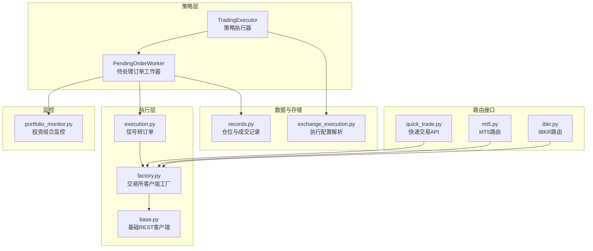
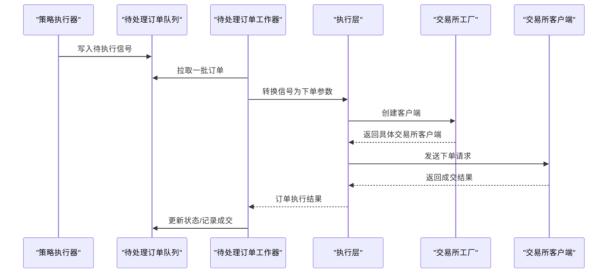
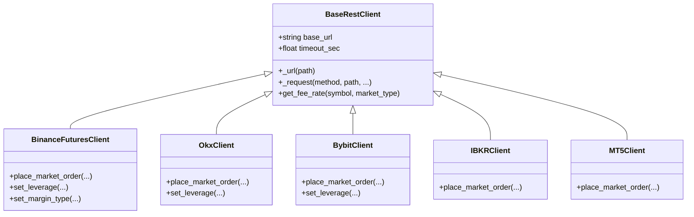
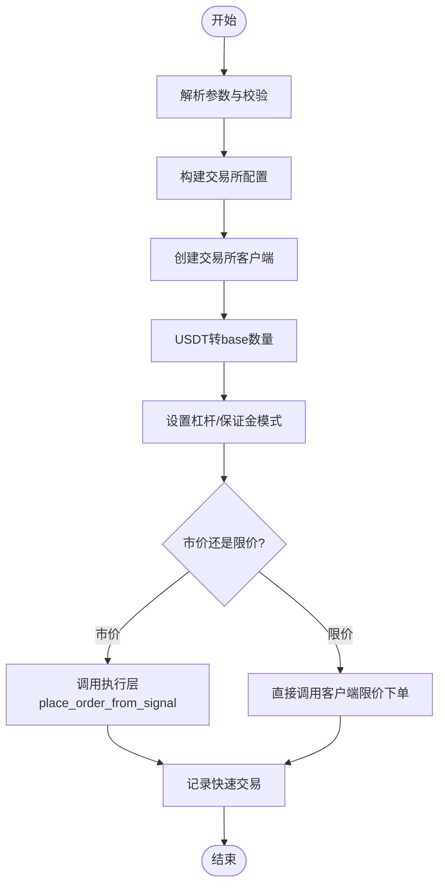
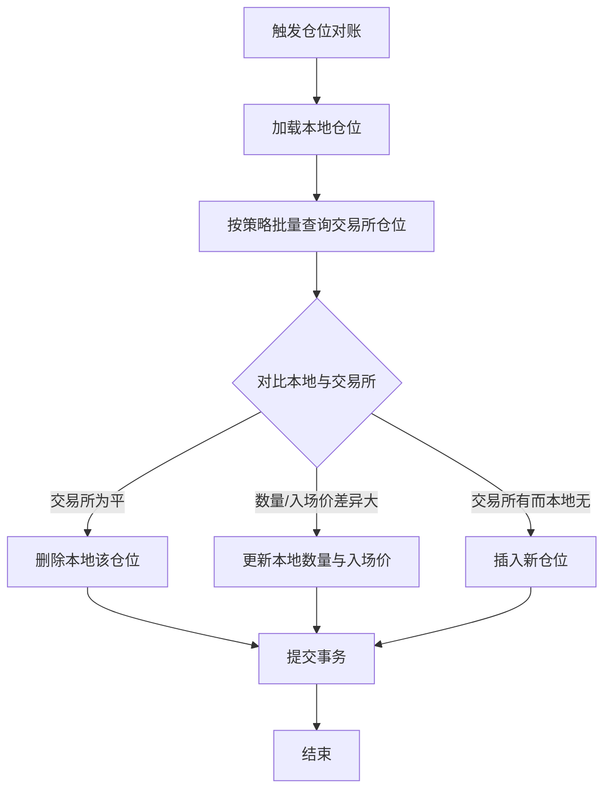
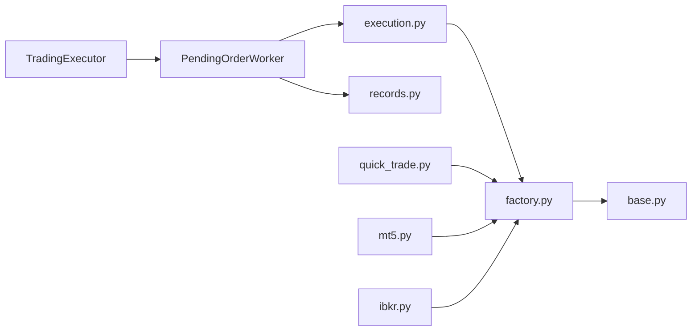

# 交易执行系统

<cite>
**本文档引用的文件**
- [factory.py](file://backend_api_python/app/services/live_trading/factory.py)
- [exchange_execution.py](file://backend_api_python/app/services/exchange_execution.py)
- [trading_executor.py](file://backend_api_python/app/services/trading_executor.py)
- [base.py](file://backend_api_python/app/services/live_trading/base.py)
- [execution.py](file://backend_api_python/app/services/live_trading/execution.py)
- [pending_order_worker.py](file://backend_api_python/app/services/pending_order_worker.py)
- [quick_trade.py](file://backend_api_python/app/routes/quick_trade.py)
- [portfolio_monitor.py](file://backend_api_python/app/services/portfolio_monitor.py)
- [binance.py](file://backend_api_python/app/services/live_trading/binance.py)
- [records.py](file://backend_api_python/app/services/live_trading/records.py)
- [mt5.py](file://backend_api_python/app/routes/mt5.py)
- [ibkr.py](file://backend_api_python/app/routes/ibkr.py)
- [README.md](file://backend_api_python/app/services/ibkr_trading/README.md)
</cite>

## 目录
1. [简介](#简介)
2. [项目结构](#项目结构)
3. [核心组件](#核心组件)
4. [架构总览](#架构总览)
5. [详细组件分析](#详细组件分析)
6. [依赖关系分析](#依赖关系分析)
7. [性能考虑](#性能考虑)
8. [故障排除指南](#故障排除指南)
9. [结论](#结论)
10. [附录](#附录)

## 简介
QuantDinger交易执行系统是一个统一的多市场执行平台，支持加密货币、传统股票与外汇等多种市场的实时交易。系统通过统一的信号到订单转换机制，将策略信号转化为各交易所的原生下单请求，并提供快速交易、仓位管理、风险控制与资金监控能力。本文档深入解析统一执行层架构、多交易所集成、快速交易功能以及仓位管理系统的实现细节，并给出IBKR与MT5的具体配置指南。

## 项目结构
后端采用Python Flask应用，核心交易逻辑集中在`app/services/live_trading`目录下，配合路由层`app/routes`提供REST接口。关键模块包括：
- 统一工厂：根据配置动态创建各交易所客户端
- 执行层：将信号转换为具体交易所下单请求
- 待处理订单工作器：轮询待执行队列并执行真实交易
- 快速交易：面向用户的直接下单接口
- 仓位与记录：本地仓位快照与成交记录
- 监控与通知：AI驱动的投资组合监控与告警

**图表来源**
- [trading_executor.py:1-800](file://backend_api_python/app/services/trading_executor.py#L1-L800)
- [pending_order_worker.py:1-800](file://backend_api_python/app/services/pending_order_worker.py#L1-L800)
- [execution.py:1-426](file://backend_api_python/app/services/live_trading/execution.py#L1-L426)
- [factory.py:1-355](file://backend_api_python/app/services/live_trading/factory.py#L1-L355)
- [base.py:1-158](file://backend_api_python/app/services/live_trading/base.py#L1-L158)
- [records.py:1-280](file://backend_api_python/app/services/live_trading/records.py#L1-L280)
- [exchange_execution.py:1-150](file://backend_api_python/app/services/exchange_execution.py#L1-L150)
- [quick_trade.py:1-800](file://backend_api_python/app/routes/quick_trade.py#L1-L800)
- [mt5.py:1-200](file://backend_api_python/app/routes/mt5.py#L1-L200)
- [ibkr.py:1-200](file://backend_api_python/app/routes/ibkr.py#L1-L200)
- [portfolio_monitor.py:1-800](file://backend_api_python/app/services/portfolio_monitor.py#L1-L800)

**章节来源**
- [factory.py:1-355](file://backend_api_python/app/services/live_trading/factory.py#L1-L355)
- [exchange_execution.py:1-150](file://backend_api_python/app/services/exchange_execution.py#L1-L150)
- [trading_executor.py:1-800](file://backend_api_python/app/services/trading_executor.py#L1-L800)
- [pending_order_worker.py:1-800](file://backend_api_python/app/services/pending_order_worker.py#L1-L800)
- [execution.py:1-426](file://backend_api_python/app/services/live_trading/execution.py#L1-L426)
- [quick_trade.py:1-800](file://backend_api_python/app/routes/quick_trade.py#L1-L800)
- [portfolio_monitor.py:1-800](file://backend_api_python/app/services/portfolio_monitor.py#L1-L800)
- [binance.py:1-200](file://backend_api_python/app/services/live_trading/binance.py#L1-L200)
- [records.py:1-280](file://backend_api_python/app/services/live_trading/records.py#L1-L280)
- [mt5.py:1-200](file://backend_api_python/app/routes/mt5.py#L1-L200)
- [ibkr.py:1-200](file://backend_api_python/app/routes/ibkr.py#L1-L200)

## 核心组件
- 统一工厂（factory.py）：根据exchange_id与market_type选择合适的交易所客户端，支持加密货币（Binance、OKX、Bitget、Bybit、Coinbase、Kraken、KuCoin、Gate、Deepcoin、HTX）、传统股票（IBKR US Stock）与外汇（MT5）。
- 执行层（execution.py）：将策略信号（开多、开空、加仓、减仓、平仓）映射为各交易所的下单参数，处理现货/永续差异与风控标志（reduce_only）。
- 待处理订单工作器（pending_order_worker.py）：轮询数据库中的待执行订单，按execution_mode分派通知或真实下单，并进行仓位对账与自愈。
- 快速交易（quick_trade.py）：允许用户直接从分析页面一键下单，自动转换USDT金额为各交易所的base数量，设置杠杆与保证金模式。
- 仓位与记录（records.py）：维护本地仓位快照，记录成交明细，支持模糊匹配符号以兼容多种格式。
- 交易所基础（base.py）：统一的HTTP请求封装、证书验证策略与错误类型，确保所有直连客户端的一致行为。
- 路由接口：quick_trade.py、mt5.py、ibkr.py分别提供快速交易、MT5与IBKR的REST接口。

**章节来源**
- [factory.py:59-218](file://backend_api_python/app/services/live_trading/factory.py#L59-L218)
- [execution.py:123-310](file://backend_api_python/app/services/live_trading/execution.py#L123-L310)
- [pending_order_worker.py:52-82](file://backend_api_python/app/services/pending_order_worker.py#L52-L82)
- [quick_trade.py:348-608](file://backend_api_python/app/routes/quick_trade.py#L348-L608)
- [records.py:150-200](file://backend_api_python/app/services/live_trading/records.py#L150-L200)
- [base.py:95-157](file://backend_api_python/app/services/live_trading/base.py#L95-L157)

## 架构总览
系统采用“策略信号 → 待处理队列 → 执行器 → 交易所”的流水线式设计。策略线程负责计算信号并写入待处理队列；工作器批量拉取并执行，实时交易通过直连客户端完成；本地数据库维护仓位快照与成交记录，同时进行最佳努力的仓位对账。

**图表来源**
- [trading_executor.py:775-800](file://backend_api_python/app/services/trading_executor.py#L775-L800)
- [pending_order_worker.py:100-122](file://backend_api_python/app/services/pending_order_worker.py#L100-L122)
- [execution.py:123-310](file://backend_api_python/app/services/live_trading/execution.py#L123-L310)
- [factory.py:59-218](file://backend_api_python/app/services/live_trading/factory.py#L59-L218)

## 详细组件分析

### 统一执行层与多交易所集成
- 支持市场类型：swap（永续/期货）、spot（现货）。工厂会根据market_type与exchange_id选择对应客户端。
- 加密货币支持：Binance USDT-M、OKX、Bitget混合、Bybit v5、Coinbase Exchange、Kraken（现货/期货）、KuCoin（现货/期货）、Gate（现货/USDT期货）、Deepcoin、HTX。
- 传统股票：IBKR US Stock，仅支持多头信号。
- 外汇：MT5，严格限定为Forex市场类别。
- 客户端创建：工厂按配置动态导入并初始化，支持演示模式与自定义base_url。

**图表来源**
- [base.py:95-157](file://backend_api_python/app/services/live_trading/base.py#L95-L157)
- [binance.py:24-50](file://backend_api_python/app/services/live_trading/binance.py#L24-L50)
- [execution.py:153-308](file://backend_api_python/app/services/live_trading/execution.py#L153-L308)

**章节来源**
- [factory.py:59-218](file://backend_api_python/app/services/live_trading/factory.py#L59-L218)
- [execution.py:123-310](file://backend_api_python/app/services/live_trading/execution.py#L123-L310)
- [base.py:95-157](file://backend_api_python/app/services/live_trading/base.py#L95-L157)

### 快速交易功能
- 输入：credential_id、symbol、side、order_type（市价/限价）、amount（USDT）、leverage、market_type、tp/sl、margin_mode。
- 自动转换：将USDT金额转换为各交易所的base数量，优先使用交易所ticker，否则回退到公开API。
- 杠杆设置：针对Binance Futures等交易所设置保证金模式（cross/isolated）。
- 订单落库：记录原始USDT金额与成交详情，便于审计与报表。

**图表来源**
- [quick_trade.py:348-608](file://backend_api_python/app/routes/quick_trade.py#L348-L608)
- [execution.py:123-310](file://backend_api_python/app/services/live_trading/execution.py#L123-L310)

**章节来源**
- [quick_trade.py:348-608](file://backend_api_python/app/routes/quick_trade.py#L348-L608)
- [execution.py:123-310](file://backend_api_python/app/services/live_trading/execution.py#L123-L310)

### 仓位管理系统
- 符号规范化：统一BTC/USDT格式，兼容多种输入形式，避免历史查询失败。
- 本地快照：通过upsert_position维护策略级仓位，记录入场价、当前价与最高/最低价。
- 成交记录：record_trade记录每笔成交的价值、手续费与利润。
- 仓位对账：工作器定期从交易所拉取仓位，与本地快照对比，自动删除平仓、更新数量与入场价，并在策略允许范围内自动插入新仓位。

**图表来源**
- [pending_order_worker.py:138-636](file://backend_api_python/app/services/pending_order_worker.py#L138-L636)
- [records.py:150-200](file://backend_api_python/app/services/live_trading/records.py#L150-L200)

**章节来源**
- [records.py:150-200](file://backend_api_python/app/services/live_trading/records.py#L150-L200)
- [pending_order_worker.py:138-636](file://backend_api_python/app/services/pending_order_worker.py#L138-L636)

### 订单管理与风险控制
- 信号状态机：严格的状态转移（flat → open；long/short → add/reduce/close），避免重复下单与错误状态。
- 去重机制：基于策略ID、符号、信号类型与时间戳的去重键，防止同一K线信号重复执行。
- 风控标志：reduce_only在多交易所下单中被正确传递，确保只减仓不增仓。
- SSL/TLS验证：集中管理HTTPS证书验证，支持企业代理与自定义CA Bundle。

**章节来源**
- [trading_executor.py:201-288](file://backend_api_python/app/services/trading_executor.py#L201-L288)
- [execution.py:85-100](file://backend_api_python/app/services/live_trading/execution.py#L85-L100)
- [base.py:34-79](file://backend_api_python/app/services/live_trading/base.py#L34-L79)

### 资金管理与交易监控
- 资金查询：快速交易API提供余额查询，适配多家交易所的账户接口。
- 投资组合监控：AI驱动的组合分析报告，支持HTML与Telegram格式，提供技术/基本面/情绪分析与风险提示。
- 通知通道：邮件、Telegram、Webhook与站内通知的统一调度。

**章节来源**
- [quick_trade.py:662-765](file://backend_api_python/app/routes/quick_trade.py#L662-L765)
- [portfolio_monitor.py:281-386](file://backend_api_python/app/services/portfolio_monitor.py#L281-L386)

### IBKR与MT5配置指南
- IBKR（US股票）
  - 安装依赖：pip install ib_insync
  - TWS/IB Gateway启用Socket API，设置端口（实盘7497/纸盘7496）
  - 通过路由连接：/api/ibkr/connect，断开：/api/ibkr/disconnect
  - 重要：多账户需指定account，只读模式可设readonly
- MT5（外汇）
  - 仅支持Forex市场类别，不支持加密货币或股票
  - 通过路由连接：/api/mt5/connect，断开：/api/mt5/disconnect
  - 注意：MetaTrader5库仅支持Windows

**章节来源**
- [README.md:1-136](file://backend_api_python/app/services/ibkr_trading/README.md#L1-L136)
- [ibkr.py:73-163](file://backend_api_python/app/routes/ibkr.py#L73-L163)
- [mt5.py:92-200](file://backend_api_python/app/routes/mt5.py#L92-L200)
- [factory.py:264-335](file://backend_api_python/app/services/live_trading/factory.py#L264-L335)

## 依赖关系分析
- 组件耦合
  - TradingExecutor与PendingOrderWorker通过数据库队列解耦，降低耦合度
  - Execution层依赖工厂创建具体客户端，保持对新增交易所的低侵入扩展
  - 基础客户端统一了HTTP请求与证书验证，减少重复代码
- 外部依赖
  - 交易所REST SDK与第三方库（如ib_insync、MetaTrader5）通过延迟导入避免强制依赖
  - 数据库：PostgreSQL，使用连接池与事务保证一致性
- 循环依赖
  - 通过延迟导入与模块拆分避免循环导入问题

**图表来源**
- [trading_executor.py:1-800](file://backend_api_python/app/services/trading_executor.py#L1-L800)
- [pending_order_worker.py:1-800](file://backend_api_python/app/services/pending_order_worker.py#L1-L800)
- [execution.py:1-426](file://backend_api_python/app/services/live_trading/execution.py#L1-L426)
- [factory.py:1-355](file://backend_api_python/app/services/live_trading/factory.py#L1-L355)
- [base.py:1-158](file://backend_api_python/app/services/live_trading/base.py#L1-L158)
- [records.py:1-280](file://backend_api_python/app/services/live_trading/records.py#L1-L280)
- [quick_trade.py:1-800](file://backend_api_python/app/routes/quick_trade.py#L1-L800)
- [mt5.py:1-200](file://backend_api_python/app/routes/mt5.py#L1-L200)
- [ibkr.py:1-200](file://backend_api_python/app/routes/ibkr.py#L1-L200)

**章节来源**
- [factory.py:1-355](file://backend_api_python/app/services/live_trading/factory.py#L1-L355)
- [execution.py:1-426](file://backend_api_python/app/services/live_trading/execution.py#L1-L426)
- [pending_order_worker.py:1-800](file://backend_api_python/app/services/pending_order_worker.py#L1-L800)

## 性能考虑
- 线程与资源
  - 策略执行器限制最大线程数，避免资源耗尽
  - 本地价格缓存与信号去重，减少重复计算与网络请求
- 数据库
  - 仓位对账按策略聚合查询，减少多次往返
  - 使用ON CONFLICT更新本地仓位，降低写放大
- 网络与安全
  - 统一SSL验证策略，支持企业代理与自定义CA Bundle
  - 请求超时与重试策略（由具体客户端实现）

[本节为通用指导，无需特定文件引用]

## 故障排除指南
- 常见错误与提示
  - 快速交易：资金不足、最小下单量、无效价格、限流、API权限、仓位冲突、网络超时、交易所维护
- 排查步骤
  - 检查交易所连接状态与凭证
  - 核对symbol格式与交易所要求（含swap后缀）
  - 查看SSL/TLS证书配置与代理设置
  - 关注待处理订单队列状态与重试次数
- 日志与审计
  - 通过策略日志与错误提示定位问题
  - 快速交易失败会记录原始请求与错误信息

**章节来源**
- [quick_trade.py:34-69](file://backend_api_python/app/routes/quick_trade.py#L34-L69)
- [base.py:34-79](file://backend_api_python/app/services/live_trading/base.py#L34-L79)
- [pending_order_worker.py:637-683](file://backend_api_python/app/services/pending_order_worker.py#L637-L683)

## 结论
QuantDinger交易执行系统通过统一工厂与执行层，实现了多市场、多类型的标准化交易流程。配合快速交易、仓位管理与AI监控，系统在保证安全性的同时提供了灵活的实盘执行能力。IBKR与MT5的专用配置与路由进一步拓展了传统市场的接入能力。建议在生产环境中合理配置SSL证书、网络代理与数据库参数，并结合监控与告警体系持续优化执行性能与稳定性。

[本节为总结性内容，无需特定文件引用]

## 附录
- 关键环境变量
  - LIVE_TRADING_SSL_VERIFY：禁用HTTPS证书验证（开发/测试）
  - LIVE_TRADING_CA_BUNDLE：自定义CA Bundle路径
  - STRATEGY_MAX_THREADS：策略执行线程上限
  - PRICE_CACHE_TTL_SEC：本地价格缓存TTL
  - PENDING_ORDER_STALE_SEC：待处理订单回收阈值
  - POSITION_SYNC_ENABLED/INTERVAL_SEC：仓位对账开关与间隔
- 数据库表
  - qd_strategy_positions：策略仓位快照
  - qd_strategy_trades：成交明细
  - qd_quick_trades：快速交易记录
  - qd_strategies_trading：策略配置与状态
  - pending_orders：待处理订单队列

[本节为补充说明，无需特定文件引用]