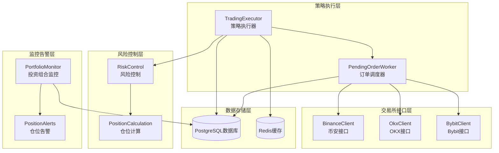
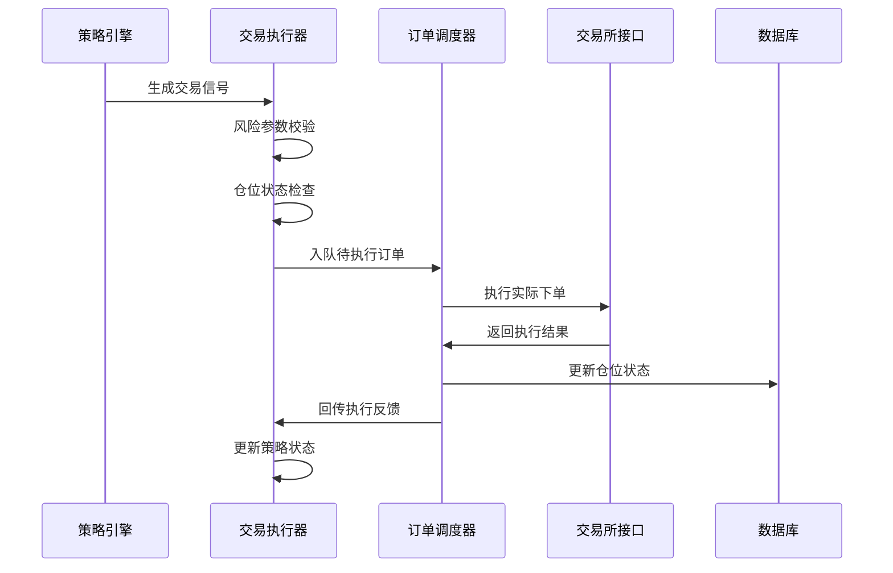
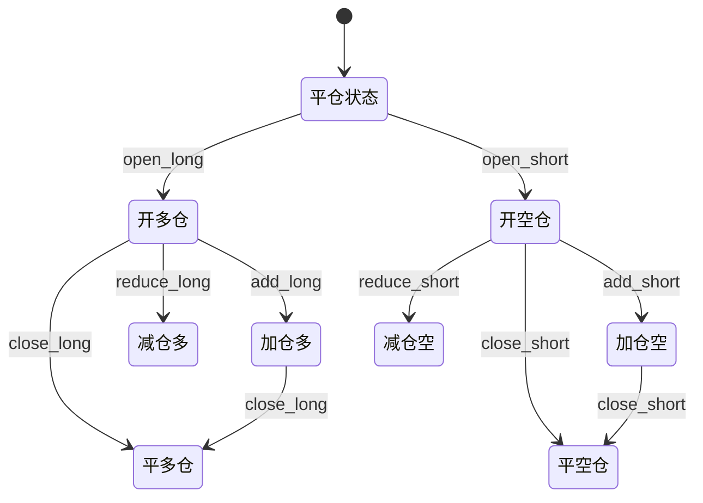
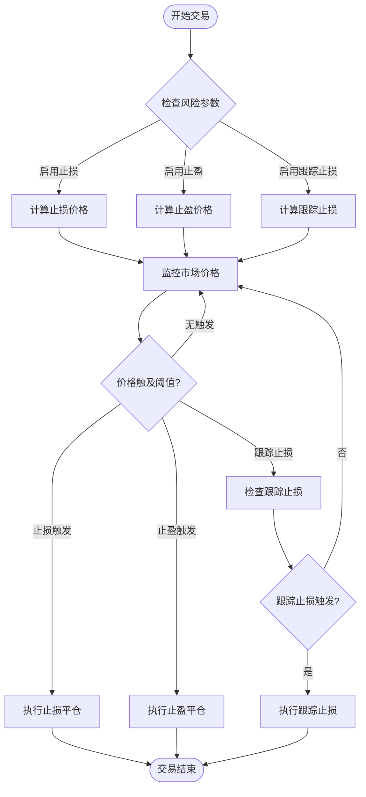
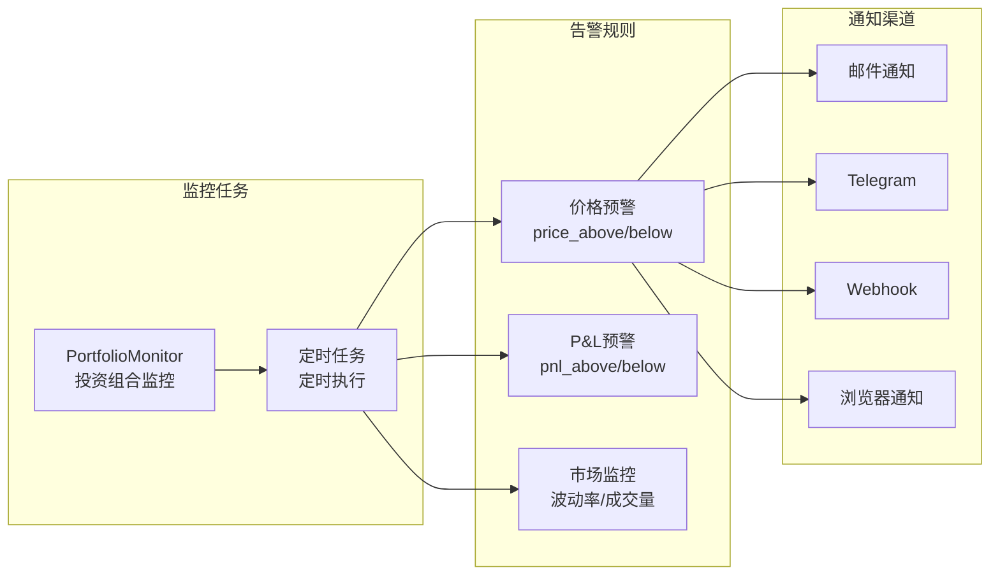
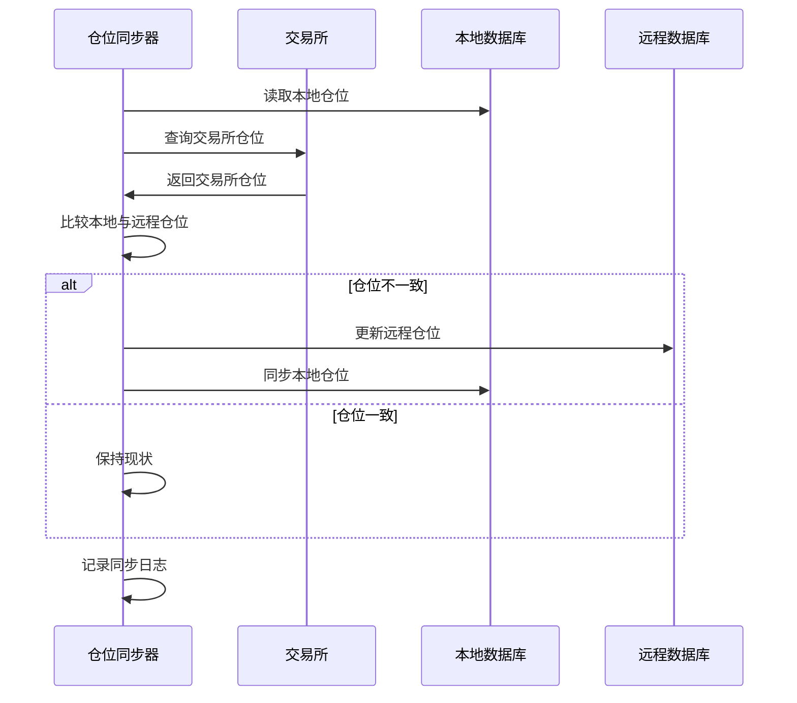
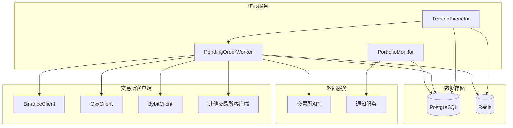
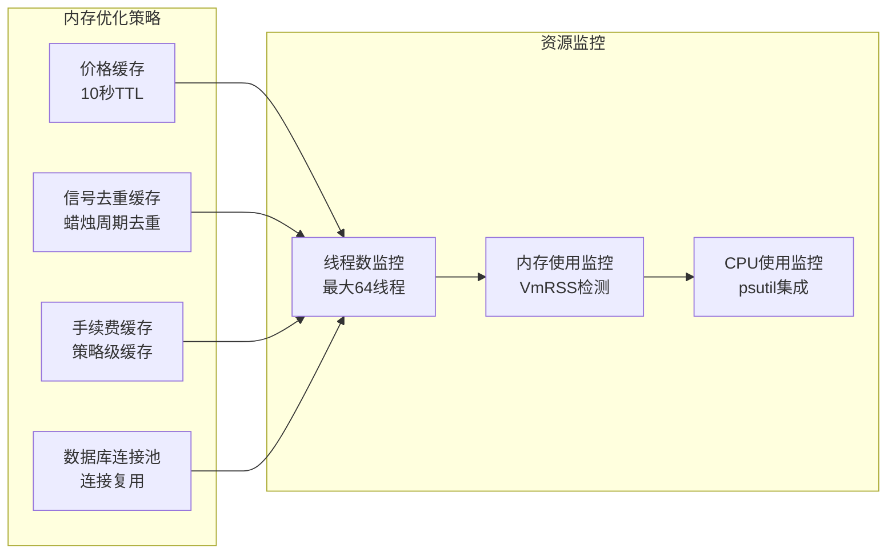
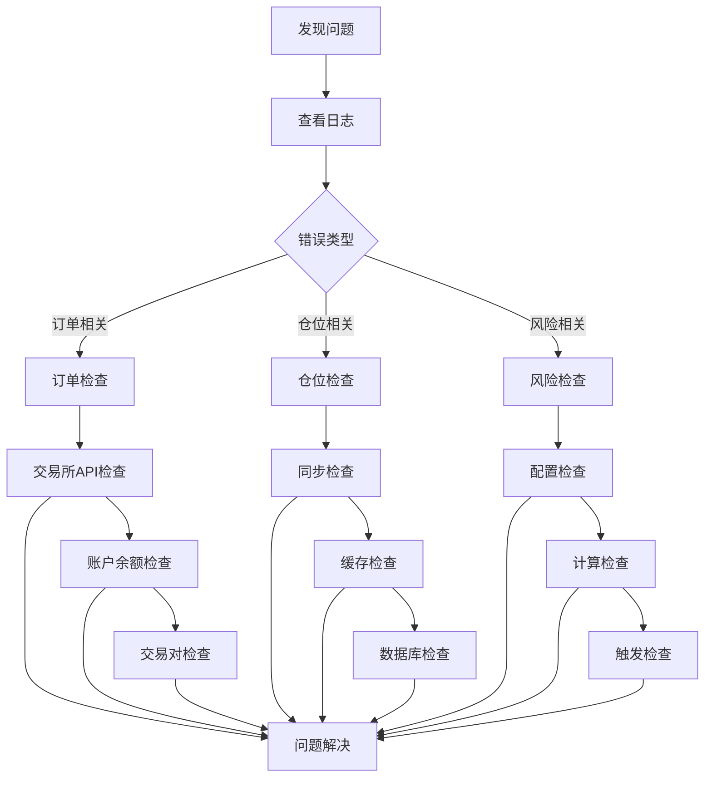

# 仓位管理系统

<cite>
**本文档引用的文件**
- [trading_executor.py](file://backend_api_python/app/services/trading_executor.py)
- [pending_order_worker.py](file://backend_api_python/app/services/pending_order_worker.py)
- [portfolio_monitor.py](file://backend_api_python/app/services/portfolio_monitor.py)
- [portfolio.py](file://backend_api_python/app/routes/portfolio.py)
- [binance.py](file://backend_api_python/app/services/live_trading/binance.py)
- [okx.py](file://backend_api_python/app/services/live_trading/okx.py)
- [bybit.py](file://backend_api_python/app/services/live_trading/bybit.py)
- [quick_trade.py](file://backend_api_python/app/routes/quick_trade.py)
- [init.sql](file://backend_api_python/migrations/init.sql)
- [backtest.py](file://backend_api_python/app/services/backtest.py)
</cite>

## 目录
1. [简介](#简介)
2. [项目结构](#项目结构)
3. [核心组件](#核心组件)
4. [架构概览](#架构概览)
5. [详细组件分析](#详细组件分析)
6. [依赖关系分析](#依赖关系分析)
7. [性能考虑](#性能考虑)
8. [故障排除指南](#故障排除指南)
9. [结论](#结论)

## 简介

仓位管理系统是QuantDinger量化交易系统的核心组成部分，负责多市场、多币种的仓位管理。该系统实现了完整的仓位生命周期管理，包括单仓模式和多仓模式的切换、开平仓逻辑、加减仓策略以及强制平仓触发条件。

系统采用分层架构设计，通过策略执行器、订单调度器、风险控制系统和监控告警系统协同工作，为用户提供安全、高效的自动化交易体验。支持多种主流交易所接口，包括Binance、OKX、Bybit等，确保跨市场的统一仓位管理能力。

## 项目结构



**图表来源**
- [trading_executor.py:37-80](file://backend_api_python/app/services/trading_executor.py#L37-L80)
- [pending_order_worker.py:52-72](file://backend_api_python/app/services/pending_order_worker.py#L52-L72)

**章节来源**
- [trading_executor.py:1-800](file://backend_api_python/app/services/trading_executor.py#L1-L800)
- [pending_order_worker.py:1-200](file://backend_api_python/app/services/pending_order_worker.py#L1-L200)

## 核心组件

### 1. 策略执行器 (TradingExecutor)

策略执行器是仓位管理系统的核心控制器，负责：
- 策略信号的接收和处理
- 仓位状态机管理
- 风险参数配置解析
- 交易指令的生成和执行

关键特性：
- 支持单仓模式和多仓模式
- 实现严格的状态机控制
- 提供灵活的风险控制参数
- 支持多种加减仓策略

### 2. 订单调度器 (PendingOrderWorker)

订单调度器负责：
- 待执行订单的轮询处理
- 交易所接口的统一管理
- 仓位同步和对账
- 异常订单的恢复处理

### 3. 风险控制系统

风险控制系统包含：
- 止损止盈机制
- 动态跟踪止损
- 强制平仓触发条件
- 仓位规模控制

### 4. 监控告警系统

监控告警系统提供：
- 实时仓位监控
- 多维度告警规则
- 多渠道通知推送
- 异常情况人工干预

**章节来源**
- [trading_executor.py:307-392](file://backend_api_python/app/services/trading_executor.py#L307-L392)
- [pending_order_worker.py:52-72](file://backend_api_python/app/services/pending_order_worker.py#L52-L72)

## 架构概览



**图表来源**
- [trading_executor.py:3069-3105](file://backend_api_python/app/services/trading_executor.py#L3069-L3105)
- [pending_order_worker.py:99-122](file://backend_api_python/app/services/pending_order_worker.py#L99-L122)

## 详细组件分析

### 仓位管理核心算法

#### 1. 仓位状态机设计



**图表来源**
- [trading_executor.py:201-217](file://backend_api_python/app/services/trading_executor.py#L201-L217)

#### 2. 仓位计算方法

系统采用统一的仓位计算框架：

**基础仓位计算公式：**
```
仓位规模 = 资金 × 杠杆 × 仓位比例 ÷ 当前价格
```

**风险控制调整：**
- 止损触发时按价格差额计算
- 止盈触发时按目标价格计算
- 动态跟踪止损根据最高/最低价计算

**章节来源**
- [trading_executor.py:2592-2615](file://backend_api_python/app/services/trading_executor.py#L2592-L2615)
- [backtest.py:4170-4195](file://backend_api_python/app/services/backtest.py#L4170-L4195)

#### 3. 加减仓策略实现

系统支持四种主要的加减仓策略：

**趋势加仓 (Trend Add)：**
- 在有利趋势中增加仓位
- 基于价格回调幅度触发
- 可设置最大加仓次数

**平均成本加仓 (DCA)：**
- 成本摊薄策略
- 在价格下跌时按固定比例加仓
- 支持步进式加仓

**趋势减仓 (Trend Reduce)：**
- 在价格上涨时逐步减仓
- 保护已实现利润
- 可设置最大减仓次数

**不利减仓 (Adverse Reduce)：**
- 在不利情况下主动减仓
- 控制潜在损失
- 紧急避险机制

**章节来源**
- [trading_executor.py:336-350](file://backend_api_python/app/services/trading_executor.py#L336-L350)

### 风险控制机制

#### 1. 止损止盈系统



**图表来源**
- [trading_executor.py:1708-1928](file://backend_api_python/app/services/trading_executor.py#L1708-L1928)

#### 2. 强制平仓触发条件

系统定义了多重强制平仓触发条件：

**保证金不足触发：**
- 维持保证金率低于阈值
- 系统自动强制平仓
- 防止穿仓风险

**市场异常触发：**
- 价格闪崩或断崖式下跌
- 交易量异常放大
- 系统自动保护性平仓

**用户手动触发：**
- 人工干预指令
- 风险紧急处置
- 手动强制平仓

**章节来源**
- [backtest.py:3480-3503](file://backend_api_python/app/services/backtest.py#L3480-L3503)
- [backtest.py:4593-4615](file://backend_api_python/app/services/backtest.py#L4593-L4615)

### 监控告警系统

#### 1. 仓位监控架构



**图表来源**
- [portfolio_monitor.py:1527-1596](file://backend_api_python/app/services/portfolio_monitor.py#L1527-L1596)

#### 2. 告警规则配置

系统支持多维度的告警规则配置：

**价格类告警：**
- 当前价格突破阈值
- 价格跌破阈值
- 百分比变化告警

**收益类告警：**
- 盈亏百分比达到目标
- 盈亏百分比触及止损线
- 浮动盈亏变化

**市场类告警：**
- 波动率异常放大
- 成交量异常放大
- 市场流动性变化

**章节来源**
- [portfolio_monitor.py:30-45](file://backend_api_python/app/services/portfolio_monitor.py#L30-L45)

### 交易所集成

#### 1. 多交易所支持

系统支持多家主流交易所的统一接口：

**币安 (Binance)：**
- 支持USDT-M期货
- 现货交易接口
- 杠杆设置和管理模式

**OKX：**
- 永续合约接口
- 保证金模式切换
- 多币种支持

**Bybit：**
- 线性合约支持
- 杠杆上限管理
- 实盘模拟交易

**章节来源**
- [binance.py:24-50](file://backend_api_python/app/services/live_trading/binance.py#L24-L50)
- [okx.py:25-63](file://backend_api_python/app/services/live_trading/okx.py#L25-L63)
- [bybit.py:734-746](file://backend_api_python/app/services/live_trading/bybit.py#L734-L746)

#### 2. 仓位同步机制



**图表来源**
- [pending_order_worker.py:138-200](file://backend_api_python/app/services/pending_order_worker.py#L138-L200)

**章节来源**
- [quick_trade.py:967-999](file://backend_api_python/app/routes/quick_trade.py#L967-L999)

## 依赖关系分析



**图表来源**
- [pending_order_worker.py:23-48](file://backend_api_python/app/services/pending_order_worker.py#L23-L48)

**章节来源**
- [init.sql:258-277](file://backend_api_python/migrations/init.sql#L258-L277)

## 性能考虑

### 1. 并发控制

系统采用多线程并发模型：
- 策略执行线程池管理
- 订单处理批量处理
- 监控任务异步执行
- 缓存机制优化查询性能

### 2. 内存管理



### 3. 数据库优化

- 索引优化：为常用查询字段建立索引
- 连接池管理：避免频繁连接创建
- 批量操作：减少数据库往返次数
- 缓存策略：热点数据缓存

## 故障排除指南

### 1. 常见问题诊断

**订单执行失败：**
- 检查交易所API密钥配置
- 验证账户余额和保证金
- 确认交易对是否支持
- 查看错误码和错误信息

**仓位同步异常：**
- 检查网络连接状态
- 验证交易所接口可用性
- 确认权限配置正确
- 查看同步日志

**风险控制失效：**
- 检查风险参数配置
- 验证止损止盈价格计算
- 确认跟踪止损设置
- 查看风控日志

### 2. 排错步骤



### 3. 紧急处理流程

**手动干预：**
- 立即停止相关策略
- 手动平仓处理
- 调整风险参数
- 系统重启恢复

**系统恢复：**
- 检查服务状态
- 重新初始化连接
- 同步仓位状态
- 恢复正常运行

**章节来源**
- [pending_order_worker.py:73-90](file://backend_api_python/app/services/pending_order_worker.py#L73-L90)

## 结论

QuantDinger的仓位管理系统通过模块化设计和分层架构，实现了多市场、多币种的高效仓位管理。系统具备以下核心优势：

1. **全面的风险控制**：多层次的风险控制机制，包括止损止盈、动态跟踪止损和强制平仓
2. **灵活的加减仓策略**：支持趋势加仓、平均成本加仓、趋势减仓和不利减仓
3. **强大的监控告警**：多维度监控和告警机制，支持多种通知渠道
4. **高效的执行系统**：基于事件驱动的订单执行架构，支持高并发处理
5. **完善的交易所集成**：统一的多交易所接口，支持主流加密货币交易所

系统通过严格的测试和持续优化，在保证安全性的同时提供了优秀的性能表现，为量化交易提供了可靠的技术支撑。