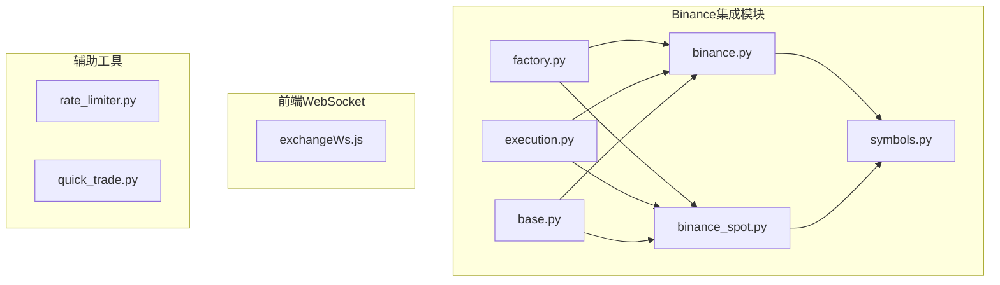
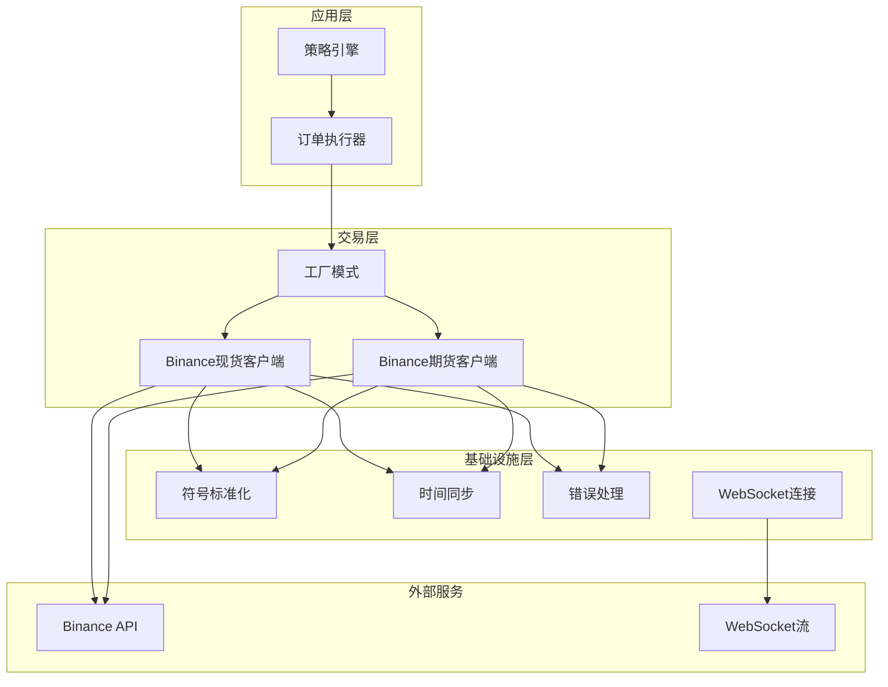
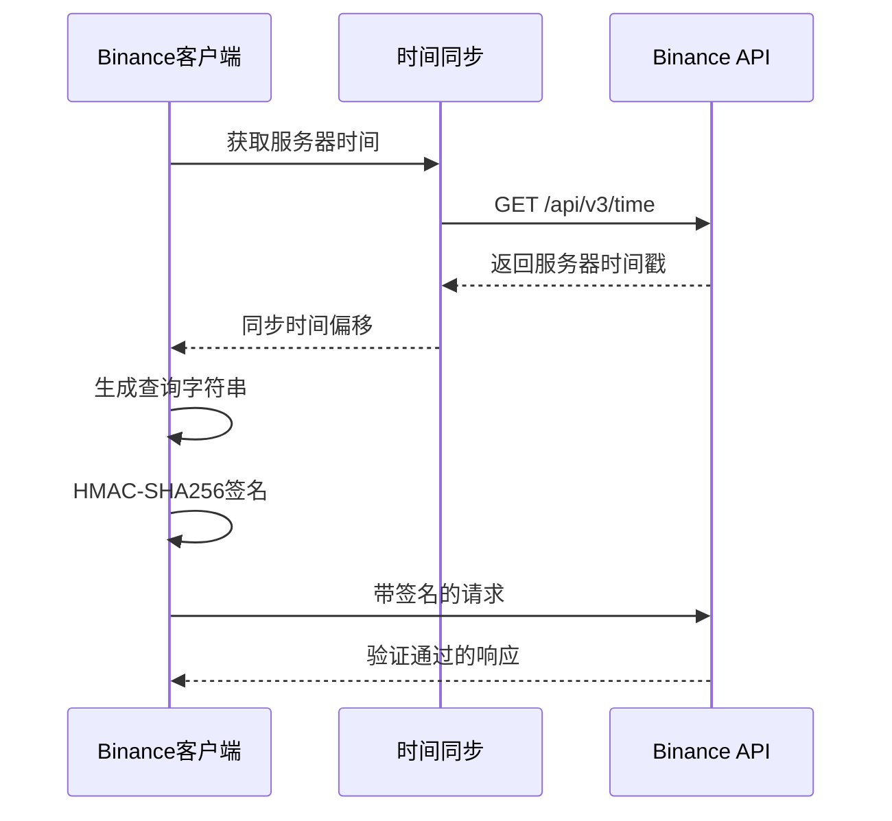
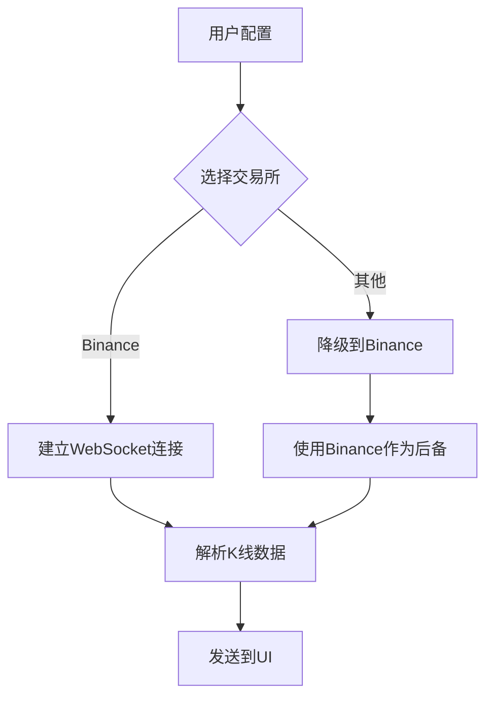
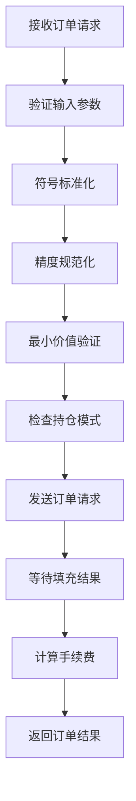
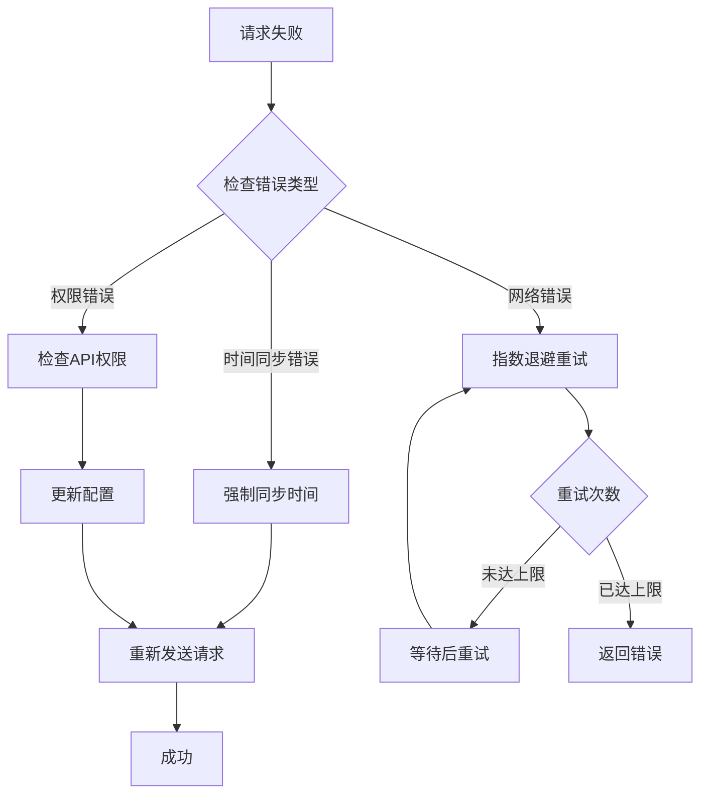
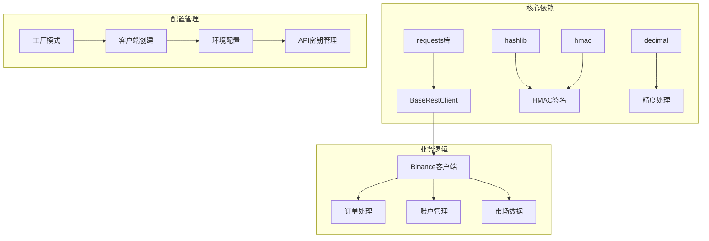

# Binance交易所集成

<cite>
**本文档引用的文件**
- [binance.py](file://backend_api_python/app/services/live_trading/binance.py)
- [binance_spot.py](file://backend_api_python/app/services/live_trading/binance_spot.py)
- [factory.py](file://backend_api_python/app/services/live_trading/factory.py)
- [base.py](file://backend_api_python/app/services/live_trading/base.py)
- [symbols.py](file://backend_api_python/app/services/live_trading/symbols.py)
- [execution.py](file://backend_api_python/app/services/live_trading/execution.py)
- [exchangeWs.js](file://frontend/src/utils/exchangeWs.js)
- [rate_limiter.py](file://backend_api_python/app/data_sources/rate_limiter.py)
- [quick_trade.py](file://backend_api_python/app/routes/quick_trade.py)
</cite>

## 目录
1. [简介](#简介)
2. [项目结构](#项目结构)
3. [核心组件](#核心组件)
4. [架构概览](#架构概览)
5. [详细组件分析](#详细组件分析)
6. [依赖关系分析](#依赖关系分析)
7. [性能考虑](#性能考虑)
8. [故障排除指南](#故障排除指南)
9. [结论](#结论)
10. [附录](#附录)

## 简介
本文档详细介绍了QuantDinger项目中Binance交易所的完整集成方案。该集成支持Binance现货和期货交易，实现了安全的API认证、精确的订单处理和完善的错误处理机制。文档涵盖了认证机制、RESTful接口配置、WebSocket连接、订单提交流程以及错误码处理等关键功能。

## 项目结构
Binance集成位于后端服务的`live_trading`模块中，采用模块化设计，支持多种市场类型和交易模式。



**图表来源**
- [factory.py:59-83](file://backend_api_python/app/services/live_trading/factory.py#L59-L83)
- [binance.py:24-49](file://backend_api_python/app/services/live_trading/binance.py#L24-L49)
- [binance_spot.py:21-39](file://backend_api_python/app/services/live_trading/binance_spot.py#L21-L39)

**章节来源**
- [factory.py:1-355](file://backend_api_python/app/services/live_trading/factory.py#L1-L355)
- [base.py:1-158](file://backend_api_python/app/services/live_trading/base.py#L1-L158)

## 核心组件
Binance集成由多个核心组件构成，每个组件负责特定的功能领域：

### 认证与安全组件
- **BaseRestClient**: 提供基础的HTTP请求功能和SSL证书验证
- **BinanceFuturesClient**: Binance USDT-M期货交易客户端
- **BinanceSpotClient**: Binance现货交易客户端

### 数据处理组件
- **Symbol Normalization**: 符号标准化工具，处理不同格式的交易对
- **Order Execution**: 订单执行引擎，将策略信号转换为实际订单

### 连接管理组件
- **WebSocket客户端**: 前端WebSocket连接管理
- **Rate Limiter**: 请求频率限制器，防止API限流

**章节来源**
- [base.py:95-158](file://backend_api_python/app/services/live_trading/base.py#L95-L158)
- [binance.py:24-1036](file://backend_api_python/app/services/live_trading/binance.py#L24-L1036)
- [binance_spot.py:21-717](file://backend_api_python/app/services/live_trading/binance_spot.py#L21-L717)

## 架构概览
Binance集成采用分层架构设计，确保了代码的可维护性和扩展性。



**图表来源**
- [execution.py:123-311](file://backend_api_python/app/services/live_trading/execution.py#L123-L311)
- [factory.py:59-83](file://backend_api_python/app/services/live_trading/factory.py#L59-L83)

## 详细组件分析

### 认证机制与时间同步

Binance集成实现了严格的安全认证机制，确保API请求的安全性和准确性。

#### HMAC签名实现


**图表来源**
- [binance.py:166-191](file://backend_api_python/app/services/live_trading/binance.py#L166-L191)
- [binance_spot.py:161-183](file://backend_api_python/app/services/live_trading/binance_spot.py#L161-L183)

#### 时间同步机制
系统实现了自动时间同步功能，解决时钟偏差问题：

**章节来源**
- [binance.py:173-191](file://backend_api_python/app/services/live_trading/binance.py#L173-L191)
- [binance_spot.py:167-183](file://backend_api_python/app/services/live_trading/binance_spot.py#L167-L183)

### RESTful接口配置

#### 现货交易接口
Binance现货客户端提供了完整的RESTful接口支持：

**章节来源**
- [binance_spot.py:251-266](file://backend_api_python/app/services/live_trading/binance_spot.py#L251-L266)
- [binance_spot.py:432-522](file://backend_api_python/app/services/live_trading/binance_spot.py#L432-L522)

#### 期货交易接口
Binance期货客户端支持USDT-M合约交易：

**章节来源**
- [binance.py:428-430](file://backend_api_python/app/services/live_trading/binance.py#L428-L430)
- [binance.py:735-892](file://backend_api_python/app/services/live_trading/binance.py#L735-L892)

### WebSocket连接配置

前端实现了多交易所的WebSocket连接管理，支持Binance实时数据流。



**图表来源**
- [exchangeWs.js:10-33](file://frontend/src/utils/exchangeWs.js#L10-L33)
- [exchangeWs.js:295-383](file://frontend/src/utils/exchangeWs.js#L295-L383)

**章节来源**
- [exchangeWs.js:1-500](file://frontend/src/utils/exchangeWs.js#L1-L500)

### 订单提交流程

#### 市价单处理流程


**图表来源**
- [binance.py:735-892](file://backend_api_python/app/services/live_trading/binance.py#L735-L892)
- [binance_spot.py:483-522](file://backend_api_python/app/services/live_trading/binance_spot.py#L483-L522)

#### 限价单处理流程
限价单处理与市价单类似，但需要额外的价格规范化步骤。

**章节来源**
- [binance.py:894-985](file://backend_api_python/app/services/live_trading/binance.py#L894-L985)
- [binance_spot.py:432-481](file://backend_api_python/app/services/live_trading/binance_spot.py#L432-L481)

### 错误处理与重试机制

#### 错误码处理
系统实现了全面的错误码处理机制：

**章节来源**
- [binance.py:218-236](file://backend_api_python/app/services/live_trading/binance.py#L218-L236)
- [binance_spot.py:228-249](file://backend_api_python/app/services/live_trading/binance_spot.py#L228-L249)

#### 重试策略


**图表来源**
- [binance.py:218-236](file://backend_api_python/app/services/live_trading/binance.py#L218-L236)
- [rate_limiter.py:170-231](file://backend_api_python/app/data_sources/rate_limiter.py#L170-L231)

### API限流应对策略

#### 请求频率控制
系统实现了智能的请求频率控制机制：

**章节来源**
- [rate_limiter.py:109-164](file://backend_api_python/app/data_sources/rate_limiter.py#L109-L164)

## 依赖关系分析



**图表来源**
- [base.py:18-19](file://backend_api_python/app/services/live_trading/base.py#L18-L19)
- [binance.py:10-16](file://backend_api_python/app/services/live_trading/binance.py#L10-L16)
- [factory.py:17-31](file://backend_api_python/app/services/live_trading/factory.py#L17-L31)

**章节来源**
- [factory.py:17-31](file://backend_api_python/app/services/live_trading/factory.py#L17-L31)
- [base.py:18-19](file://backend_api_python/app/services/live_trading/base.py#L18-L19)

## 性能考虑

### 精度处理优化
系统实现了精确的数值处理机制，确保与Binance的精度要求完全匹配：

**章节来源**
- [binance.py:57-147](file://backend_api_python/app/services/live_trading/binance.py#L57-L147)
- [binance_spot.py:47-142](file://backend_api_python/app/services/live_trading/binance_spot.py#L47-L142)

### 缓存策略
系统实现了多层缓存机制来提升性能：

**章节来源**
- [binance.py:36-49](file://backend_api_python/app/services/live_trading/binance.py#L36-L49)
- [binance_spot.py:33-38](file://backend_api_python/app/services/live_trading/binance_spot.py#L33-L38)

## 故障排除指南

### 常见错误诊断
系统提供了详细的错误诊断信息：

**章节来源**
- [binance_spot.py:200-216](file://backend_api_python/app/services/live_trading/binance_spot.py#L200-L216)
- [binance.py:845-879](file://backend_api_python/app/services/live_trading/binance.py#L845-L879)

### 配置检查清单
- API密钥权限验证
- IP白名单配置
- Demo模式切换
- 服务器时间同步

**章节来源**
- [quick_trade.py:37-59](file://backend_api_python/app/routes/quick_trade.py#L37-L59)

## 结论
QuantDinger项目的Binance集成功现了以下关键特性：
- 完整的API认证和安全机制
- 支持现货和期货交易的双模式架构
- 精确的订单处理和错误处理
- 智能的时间同步和限流控制
- 灵活的WebSocket连接管理

该集成方案为量化交易提供了稳定可靠的基础，支持从简单策略到复杂算法的各种应用场景。

## 附录

### API配置模板
```yaml
# Binance现货配置示例
exchange_id: binance
api_key: YOUR_API_KEY
secret_key: YOUR_SECRET_KEY
market_type: spot
enable_demo_trading: false
base_url: https://api.binance.com

# Binance期货配置示例  
exchange_id: binance
api_key: YOUR_API_KEY
secret_key: YOUR_SECRET_KEY
market_type: swap
enable_demo_trading: false
base_url: https://fapi.binance.com
```

### 订单参数说明
- **symbol**: 交易对标识符（如BTC/USDT）
- **side**: 交易方向（BUY/SELL）
- **quantity**: 数量或金额
- **price**: 价格（限价单）
- **reduce_only**: 是否为减仓订单
- **position_side**: 持仓方向（LONG/SHORT）

### 错误码参考
- **-1021**: 时间戳过期，自动重试
- **-2015**: API密钥无效，检查权限
- **-1111**: 精度过高，调整精度
- **-4061**: 持仓模式冲突，检查模式设置