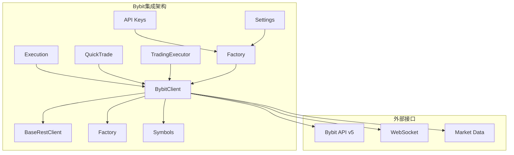
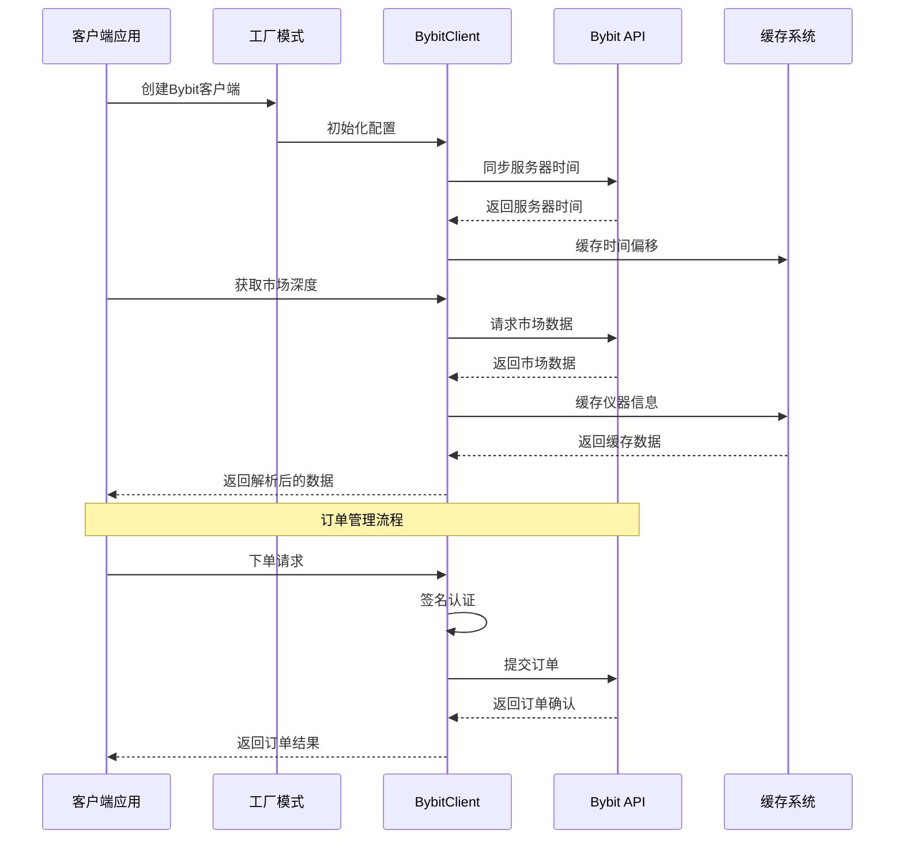
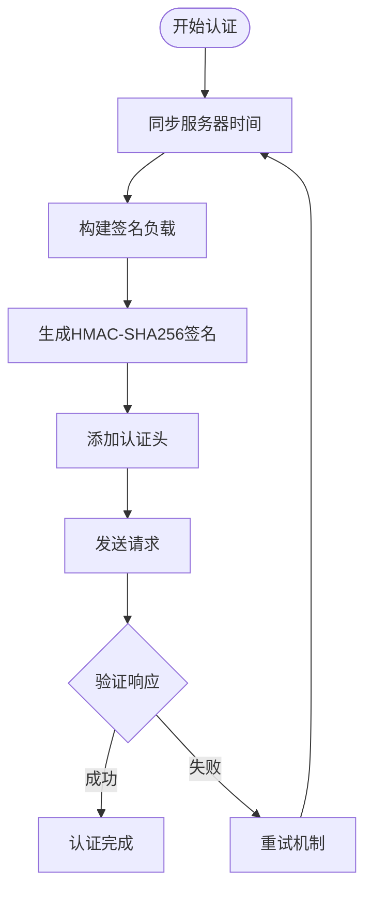
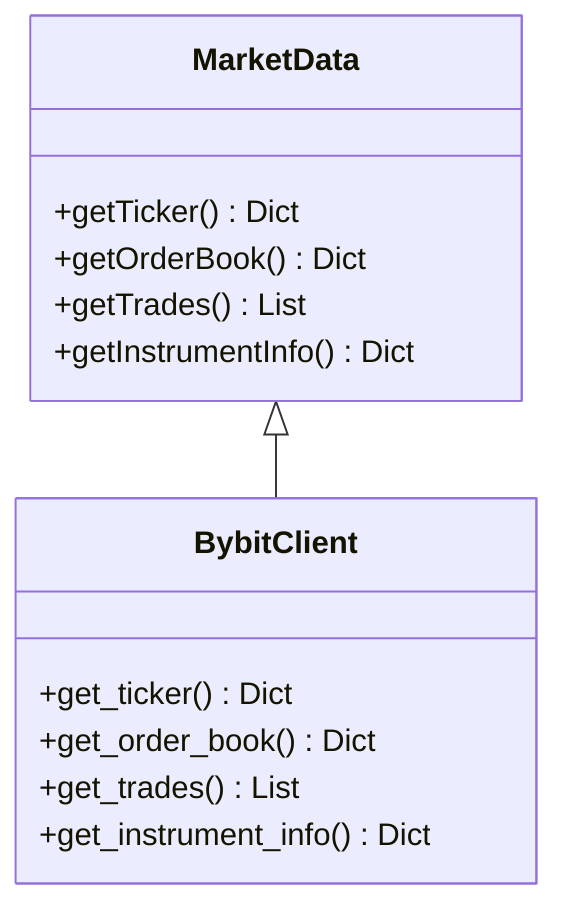
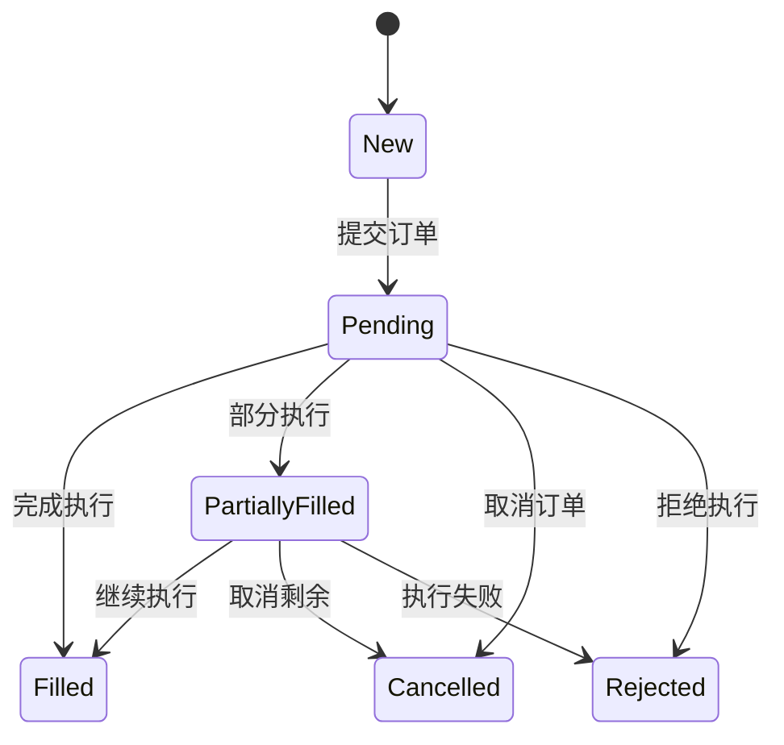
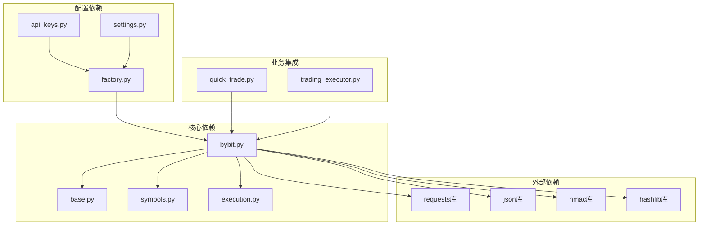

# Bybit交易所集成

<cite>
**本文档引用的文件**
- [bybit.py](file://backend_api_python/app/services/live_trading/bybit.py)
- [base.py](file://backend_api_python/app/services/live_trading/base.py)
- [factory.py](file://backend_api_python/app/services/live_trading/factory.py)
- [symbols.py](file://backend_api_python/app/services/live_trading/symbols.py)
- [execution.py](file://backend_api_python/app/services/live_trading/execution.py)
- [quick_trade.py](file://backend_api_python/app/routes/quick_trade.py)
- [trading_executor.py](file://backend_api_python/app/services/trading_executor.py)
- [api_keys.py](file://backend_api_python/app/config/api_keys.py)
- [settings.py](file://backend_api_python/app/config/settings.py)
</cite>

## 目录
1. [简介](#简介)
2. [项目结构](#项目结构)
3. [核心组件](#核心组件)
4. [架构概览](#架构概览)
5. [详细组件分析](#详细组件分析)
6. [依赖关系分析](#依赖关系分析)
7. [性能考虑](#性能考虑)
8. [故障排除指南](#故障排除指南)
9. [结论](#结论)

## 简介

本文档详细介绍了QuantDinger项目中Bybit交易所的完整集成方案。该集成涵盖了Bybit API的连接配置、认证流程、WebSocket订阅机制、创新功能实现以及订单管理的完整生命周期。

Bybit集成为QuantDinger提供了强大的加密货币交易能力，支持现货和永续合约交易，具备以下核心特性：

- **多市场支持**：现货交易和USDT永续合约交易
- **高级认证**：基于时间戳的HMAC签名认证
- **实时数据**：市场深度、成交记录和账户余额查询
- **订单管理**：完整的订单生命周期管理
- **风险管理**：杠杆设置和保证金管理
- **网络容错**：自动重连和心跳检测机制

## 项目结构

QuantDinger采用模块化的架构设计，Bybit集成位于`backend_api_python/app/services/live_trading/`目录下，通过工厂模式统一管理各个交易所的客户端。

**图表来源**
- [bybit.py:1-747](file://backend_api_python/app/services/live_trading/bybit.py#L1-L747)
- [factory.py:118-142](file://backend_api_python/app/services/live_trading/factory.py#L118-L142)

**章节来源**
- [bybit.py:1-747](file://backend_api_python/app/services/live_trading/bybit.py#L1-L747)
- [factory.py:59-218](file://backend_api_python/app/services/live_trading/factory.py#L59-L218)

## 核心组件

### BybitClient类

BybitClient是整个集成的核心类，继承自BaseRestClient，实现了Bybit交易所的所有REST API功能。

#### 主要特性
- **认证机制**：基于HMAC-SHA256的时间戳签名
- **市场类型**：支持现货和USDT永续合约
- **精度控制**：自动处理数量和价格的小数位精度
- **缓存机制**：仪器信息和服务器时间同步缓存

#### 关键配置参数
- `api_key`：Bybit API密钥
- `secret_key`：Bybit私钥
- `base_url`：API基础URL（主网或测试网）
- `category`：市场类型（"linear"或"spot"）
- `recv_window_ms`：接收窗口（毫秒）
- `hedge_mode`：对冲模式开关

**章节来源**
- [bybit.py:27-72](file://backend_api_python/app/services/live_trading/bybit.py#L27-L72)

### BaseRestClient基类

BaseRestClient提供了所有交易所客户端的基础功能，包括HTTP请求处理、SSL证书验证和错误处理。

#### 核心功能
- **HTTP请求封装**：统一的请求处理逻辑
- **SSL证书管理**：灵活的证书验证配置
- **错误处理**：标准化的异常处理机制
- **超时控制**：可配置的请求超时时间

**章节来源**
- [base.py:95-157](file://backend_api_python/app/services/live_trading/base.py#L95-L157)

### 工厂模式集成

工厂模式负责根据配置动态创建合适的交易所客户端，支持Bybit的测试网和主网切换。

#### 支持的配置选项
- `exchange_id`：交易所标识符（"bybit"）
- `enable_demo_trading`：启用演示交易模式
- `market_type`：市场类型（"spot"或"swap"）
- `recv_window_ms`：接收窗口设置
- `hedge_mode`：对冲模式配置

**章节来源**
- [factory.py:118-142](file://backend_api_python/app/services/live_trading/factory.py#L118-L142)

## 架构概览

Bybit集成采用了分层架构设计，确保了代码的可维护性和扩展性。

**图表来源**
- [bybit.py:202-297](file://backend_api_python/app/services/live_trading/bybit.py#L202-L297)
- [factory.py:118-142](file://backend_api_python/app/services/live_trading/factory.py#L118-L142)

## 详细组件分析

### 认证与安全机制

Bybit的认证系统基于HMAC-SHA256签名，确保了交易的安全性。

#### 认证流程
1. **时间同步**：获取服务器时间并计算时间偏移
2. **负载构建**：按规范构建签名负载
3. **HMAC签名**：使用SHA256算法生成签名
4. **请求发送**：包含认证头的请求发送到API

**图表来源**
- [bybit.py:202-297](file://backend_api_python/app/services/live_trading/bybit.py#L202-L297)

**章节来源**
- [bybit.py:172-297](file://backend_api_python/app/services/live_trading/bybit.py#L172-L297)

### WebSocket订阅机制

虽然当前版本主要使用REST API，但Bybit的WebSocket订阅机制为实时数据传输提供了强大支持。

#### WebSocket特性
- **多主题订阅**：支持市场深度、成交记录、账户信息等多个主题
- **自动重连**：网络中断后自动恢复连接
- **心跳检测**：定期发送ping消息保持连接活跃
- **消息路由**：根据主题类型分发到相应的处理器

**章节来源**
- [bybit.py:309-314](file://backend_api_python/app/services/live_trading/bybit.py#L309-L314)

### 市场数据获取

Bybit提供了丰富的市场数据接口，支持多种数据类型的获取。

#### 数据类型支持
- **价格数据**：最新价格、开盘价、最高价、最低价
- **市场深度**：买卖盘口深度数据
- **成交记录**：历史成交明细
- **仪器信息**：合约规格和交易规则

**图表来源**
- [bybit.py:332-417](file://backend_api_python/app/services/live_trading/bybit.py#L332-L417)

**章节来源**
- [bybit.py:332-417](file://backend_api_python/app/services/live_trading/bybit.py#L332-L417)

### 订单管理系统

Bybit的订单管理系统支持完整的订单生命周期管理。

#### 订单类型
- **市价单**：立即以市场价格执行
- **限价单**：指定价格或更好的价格执行
- **止损单**：达到止损价格时触发
- **止盈单**：达到止盈价格时触发

**图表来源**
- [bybit.py:509-593](file://backend_api_python/app/services/live_trading/bybit.py#L509-L593)

**章节来源**
- [bybit.py:509-685](file://backend_api_python/app/services/live_trading/bybit.py#L509-L685)

### 账户管理功能

Bybit集成了全面的账户管理功能，支持多种账户类型和交易模式。

#### 账户功能
- **钱包余额查询**：支持多种币种的余额查询
- **持仓管理**：实时持仓信息和风险控制
- **手续费率查询**：动态获取交易手续费率
- **杠杆设置**：支持不同杠杆倍数的设置

**章节来源**
- [bybit.py:419-745](file://backend_api_python/app/services/live_trading/bybit.py#L419-L745)

### 符号转换系统

为了支持多种输入格式，Bybit集成了智能的符号转换系统。

#### 支持的格式
- **标准格式**：BTC/USDT
- **简化格式**：BTCUSDT
- **带冒号格式**：BTC/USDT:USDT
- **其他格式**：自动识别和转换

**章节来源**
- [symbols.py:83-88](file://backend_api_python/app/services/live_trading/symbols.py#L83-L88)

## 依赖关系分析

Bybit集成的依赖关系清晰明确，遵循了单一职责原则。

**图表来源**
- [bybit.py:21-24](file://backend_api_python/app/services/live_trading/bybit.py#L21-L24)
- [factory.py:17-30](file://backend_api_python/app/services/live_trading/factory.py#L17-L30)

### 外部依赖管理

系统对外部依赖进行了严格的管理，确保了部署的灵活性。

#### 依赖特性
- **可选依赖**：某些功能的依赖可根据需要安装
- **版本兼容**：支持不同版本的依赖库
- **降级处理**：当依赖不可用时提供替代方案

**章节来源**
- [base.py:18-19](file://backend_api_python/app/services/live_trading/base.py#L18-L19)

## 性能考虑

Bybit集成在设计时充分考虑了性能优化，采用了多种策略来提升系统的响应速度和稳定性。

### 缓存策略
- **时间同步缓存**：服务器时间偏移每55秒刷新一次
- **仪器信息缓存**：合约信息缓存5分钟
- **请求结果缓存**：热点数据的短期缓存

### 并发处理
- **异步请求**：支持并发的API请求
- **连接池管理**：HTTP连接的复用和管理
- **线程安全**：多线程环境下的数据一致性

### 错误处理
- **重试机制**：网络错误时的自动重试
- **超时控制**：防止请求阻塞
- **降级策略**：关键功能的降级处理

## 故障排除指南

### 常见问题诊断

#### 认证失败
**症状**：出现签名错误或权限不足
**解决方案**：
1. 检查API密钥和私钥的有效性
2. 验证接收窗口设置（默认12000ms）
3. 确认服务器时间同步正常

#### 网络连接问题
**症状**：请求超时或连接失败
**解决方案**：
1. 检查网络连接状态
2. 验证代理设置（如果使用）
3. 调整超时参数

#### 数据精度问题
**症状**：订单量或价格精度不符合预期
**解决方案**：
1. 检查合约的最小交易量和价格精度
2. 验证小数位处理逻辑
3. 确认四舍五入规则

**章节来源**
- [bybit.py:257-297](file://backend_api_python/app/services/live_trading/bybit.py#L257-L297)

### 调试工具

系统提供了完善的调试工具来帮助开发者诊断问题。

#### 调试功能
- **请求日志**：详细的API请求和响应日志
- **错误追踪**：完整的异常堆栈信息
- **性能监控**：请求耗时和成功率统计

## 结论

Bybit交易所集成为QuantDinger项目提供了完整、稳定且高性能的加密货币交易解决方案。通过精心设计的架构和完善的错误处理机制，该集成能够满足专业交易的需求。

### 主要优势
- **安全性**：基于HMAC-SHA256的强认证机制
- **可靠性**：完善的错误处理和重试机制
- **可扩展性**：模块化的架构设计便于功能扩展
- **易用性**：简洁的API接口和配置方式

### 未来发展方向
- **WebSocket支持**：增强实时数据传输能力
- **更多功能**：扩展更多的交易功能和工具
- **性能优化**：持续改进系统的响应速度
- **监控增强**：提供更详细的性能和使用统计

通过本文档的详细说明，开发者可以快速理解和使用Bybit集成的各项功能，为构建专业的量化交易系统奠定坚实基础。