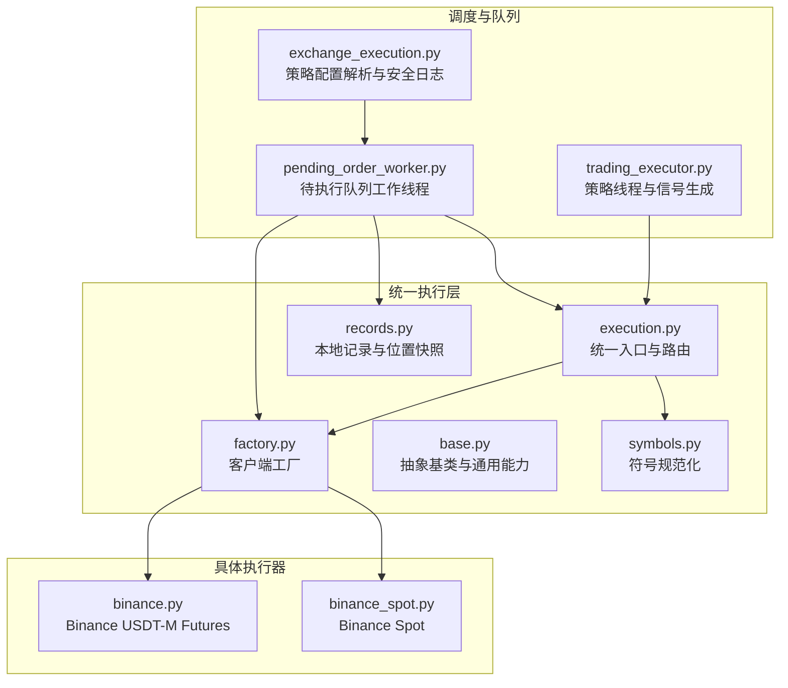
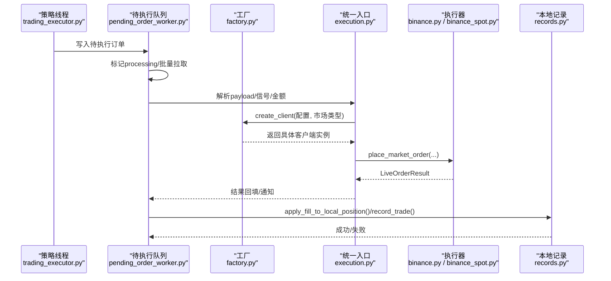
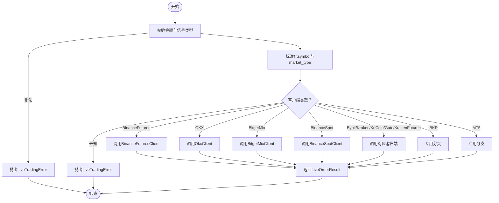
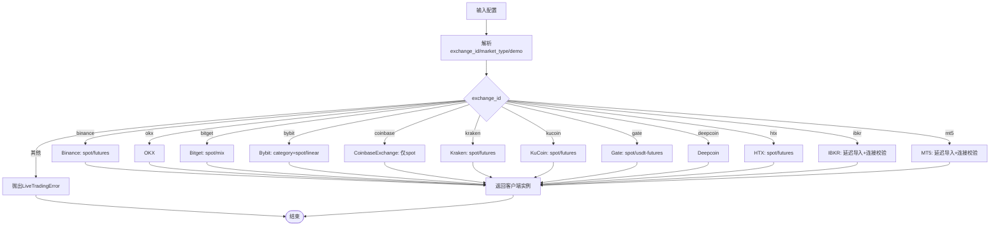
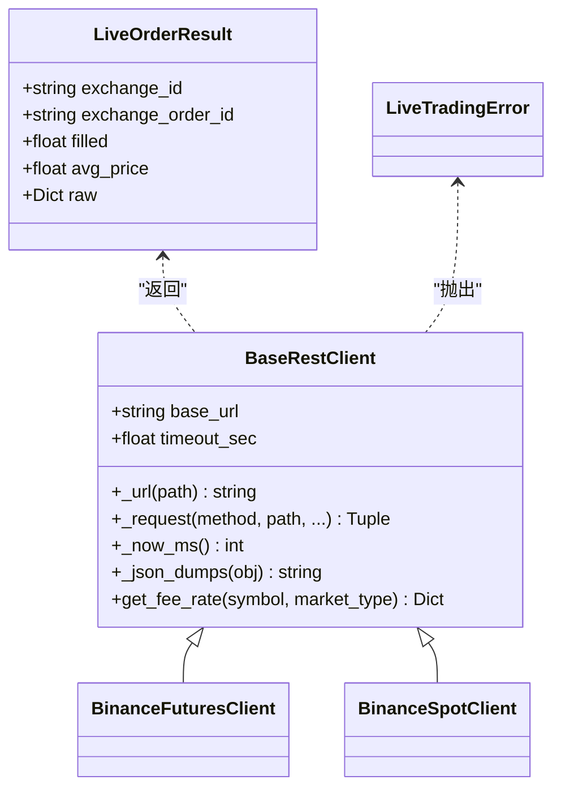
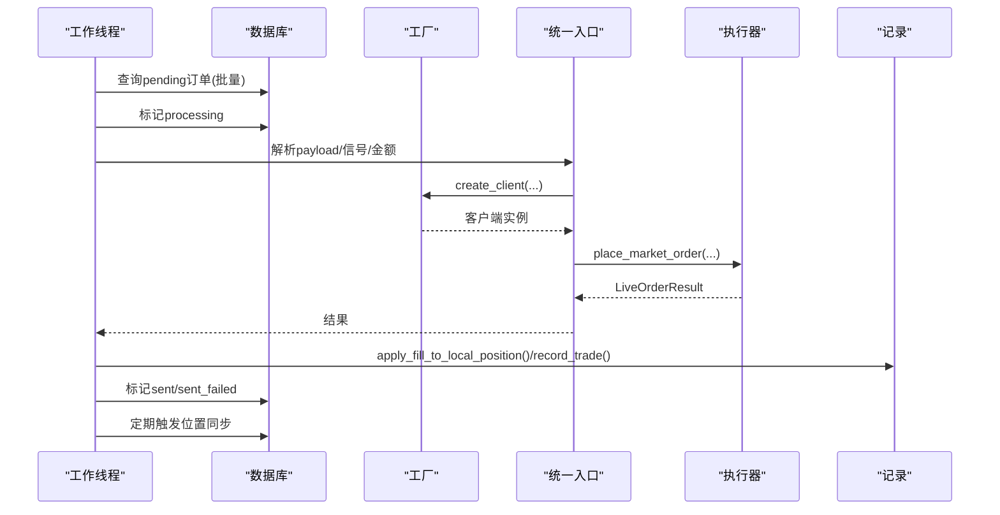
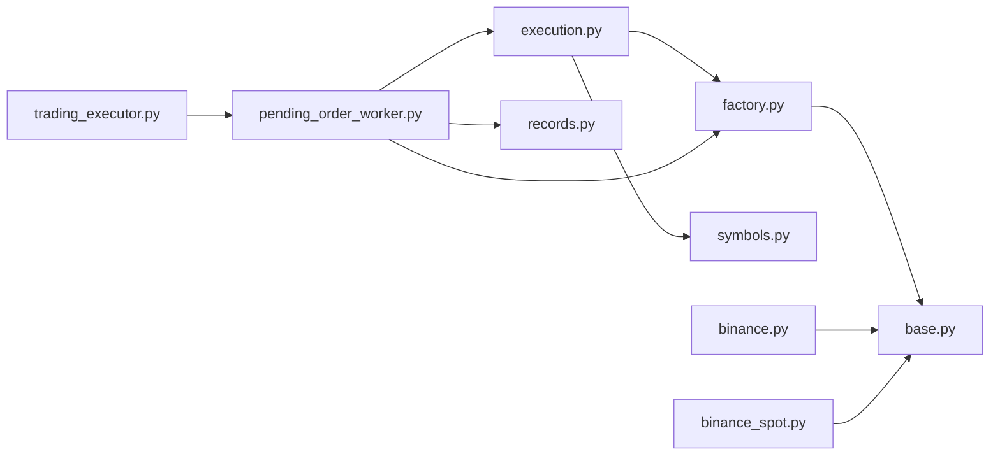

# 交易执行引擎

<cite>
**本文引用的文件**
- [execution.py](file://backend_api_python/app/services/live_trading/execution.py)
- [factory.py](file://backend_api_python/app/services/live_trading/factory.py)
- [base.py](file://backend_api_python/app/services/live_trading/base.py)
- [pending_order_worker.py](file://backend_api_python/app/services/pending_order_worker.py)
- [exchange_execution.py](file://backend_api_python/app/services/exchange_execution.py)
- [trading_executor.py](file://backend_api_python/app/services/trading_executor.py)
- [binance.py](file://backend_api_python/app/services/live_trading/binance.py)
- [binance_spot.py](file://backend_api_python/app/services/live_trading/binance_spot.py)
- [symbols.py](file://backend_api_python/app/services/live_trading/symbols.py)
- [records.py](file://backend_api_python/app/services/live_trading/records.py)
</cite>

## 目录
1. [引言](#引言)
2. [项目结构](#项目结构)
3. [核心组件](#核心组件)
4. [架构总览](#架构总览)
5. [详细组件分析](#详细组件分析)
6. [依赖分析](#依赖分析)
7. [性能考虑](#性能考虑)
8. [故障排查指南](#故障排查指南)
9. [结论](#结论)
10. [附录](#附录)

## 引言
本文件面向交易执行引擎的统一执行层，系统性阐述其设计理念与实现原理，重点覆盖：
- 工厂模式在多交易所客户端创建中的应用
- 抽象基类与具体执行器的关系
- 订单路由机制与执行队列管理
- 并发控制策略与资源限制
- 不同交易所的API差异与协议转换
- 执行器生命周期管理、状态跟踪与日志记录
- 性能优化、内存管理与资源清理
- 扩展新执行器与集成自定义交易逻辑的方法
- 完整配置示例与调试指南

## 项目结构
统一执行层位于后端服务的“实盘交易”子模块，围绕“工厂 + 统一入口 + 执行器 + 记录”的职责划分组织：
- 工厂负责根据配置创建具体交易所客户端
- 统一入口将策略信号映射为交易所订单参数
- 执行器负责策略线程与信号去重、优先级与位置状态机
- 待执行队列由独立工作线程轮询并派发
- 记录模块维护本地位置快照与成交流水

图示来源
- [execution.py:123-311](file://backend_api_python/app/services/live_trading/execution.py#L123-L311)
- [factory.py:59-218](file://backend_api_python/app/services/live_trading/factory.py#L59-L218)
- [base.py:95-157](file://backend_api_python/app/services/live_trading/base.py#L95-L157)
- [symbols.py:16-200](file://backend_api_python/app/services/live_trading/symbols.py#L16-L200)
- [records.py:17-200](file://backend_api_python/app/services/live_trading/records.py#L17-L200)
- [pending_order_worker.py:52-800](file://backend_api_python/app/services/pending_order_worker.py#L52-L800)
- [exchange_execution.py:59-150](file://backend_api_python/app/services/exchange_execution.py#L59-L150)
- [trading_executor.py:37-800](file://backend_api_python/app/services/trading_executor.py#L37-L800)

章节来源
- [execution.py:1-426](file://backend_api_python/app/services/live_trading/execution.py#L1-L426)
- [factory.py:1-355](file://backend_api_python/app/services/live_trading/factory.py#L1-L355)
- [base.py:1-158](file://backend_api_python/app/services/live_trading/base.py#L1-L158)
- [pending_order_worker.py:1-800](file://backend_api_python/app/services/pending_order_worker.py#L1-L800)
- [exchange_execution.py:1-150](file://backend_api_python/app/services/exchange_execution.py#L1-L150)
- [trading_executor.py:1-800](file://backend_api_python/app/services/trading_executor.py#L1-L800)
- [binance.py:1-200](file://backend_api_python/app/services/live_trading/binance.py#L1-L200)
- [binance_spot.py:1-200](file://backend_api_python/app/services/live_trading/binance_spot.py#L1-L200)
- [symbols.py:1-200](file://backend_api_python/app/services/live_trading/symbols.py#L1-L200)
- [records.py:1-200](file://backend_api_python/app/services/live_trading/records.py#L1-L200)

## 核心组件
- 统一入口与路由：将策略信号转换为交易所订单请求，按客户端类型分派到具体执行器，并进行符号与方向归一化
- 客户端工厂：依据配置动态创建各交易所REST客户端，支持模拟/实盘切换与参数校验
- 抽象基类：封装HTTP请求、签名、时间对齐、证书验证与结果模型
- 符号规范化：统一不同来源符号格式，适配各交易所标识
- 待执行队列工作线程：轮询数据库队列，标记处理、派发通知或实盘下单，支持位置同步与去重
- 策略执行器：策略线程管理、信号去重、优先级排序、位置状态机与资源监控
- 本地记录：位置与成交流水的本地快照，支撑UI与状态一致性

章节来源
- [execution.py:123-311](file://backend_api_python/app/services/live_trading/execution.py#L123-L311)
- [factory.py:59-218](file://backend_api_python/app/services/live_trading/factory.py#L59-L218)
- [base.py:95-157](file://backend_api_python/app/services/live_trading/base.py#L95-L157)
- [symbols.py:16-200](file://backend_api_python/app/services/live_trading/symbols.py#L16-L200)
- [pending_order_worker.py:52-800](file://backend_api_python/app/services/pending_order_worker.py#L52-L800)
- [trading_executor.py:37-800](file://backend_api_python/app/services/trading_executor.py#L37-L800)
- [records.py:17-200](file://backend_api_python/app/services/live_trading/records.py#L17-L200)

## 架构总览
统一执行层采用“策略信号 → 统一入口 → 工厂 → 执行器 → 本地记录”的链路，配合待执行队列实现异步派发与位置同步。

图示来源
- [trading_executor.py:775-800](file://backend_api_python/app/services/trading_executor.py#L775-L800)
- [pending_order_worker.py:100-800](file://backend_api_python/app/services/pending_order_worker.py#L100-L800)
- [factory.py:59-218](file://backend_api_python/app/services/live_trading/factory.py#L59-L218)
- [execution.py:123-311](file://backend_api_python/app/services/live_trading/execution.py#L123-L311)
- [binance.py:24-200](file://backend_api_python/app/services/live_trading/binance.py#L24-L200)
- [binance_spot.py:21-200](file://backend_api_python/app/services/live_trading/binance_spot.py#L21-L200)
- [records.py:186-200](file://backend_api_python/app/services/live_trading/records.py#L186-L200)

## 详细组件分析

### 统一入口与路由（execution.py）
- 职责
  - 将策略信号类型映射为交易所侧的side/pos_side/reduce_only
  - 归一化symbol与market_type，处理spot短仓限制
  - 按客户端类型分派至对应交易所下单逻辑
  - 支持延迟导入以避免循环依赖
- 关键点
  - 信号到方向映射函数保证跨市场的语义一致
  - 金额到报价量转换在特定交易所（如币安现货、Gate、KuCoin）按买方场景自动换算
  - 对IBKR与MT5提供专用下单分支，确保市场类别与符号格式合规
- 错误处理
  - 非法信号/金额/客户端类型均抛出统一错误类型

图示来源
- [execution.py:123-311](file://backend_api_python/app/services/live_trading/execution.py#L123-L311)

章节来源
- [execution.py:123-311](file://backend_api_python/app/services/live_trading/execution.py#L123-L311)

### 客户端工厂（factory.py）
- 职责
  - 根据exchange_id与market_type创建具体客户端实例
  - 支持模拟交易开关与基础URL选择
  - 参数解析与默认值设置（recv_window_ms、broker_referer、hedge_mode等）
  - 对IBKR与MT5进行延迟导入与连接校验
- 关键点
  - 统一的配置键名兼容（apiKey/secretKey/passphrase等）
  - 对不支持的exchange_id抛出明确错误
  - fee查询辅助方法通过临时客户端快速获取费率

图示来源
- [factory.py:59-218](file://backend_api_python/app/services/live_trading/factory.py#L59-L218)

章节来源
- [factory.py:59-218](file://backend_api_python/app/services/live_trading/factory.py#L59-L218)

### 抽象基类与通用能力（base.py）
- 职责
  - 提供最小依赖的HTTP请求封装与签名工具
  - 统一SSL证书验证策略，支持代理与企业根证书
  - 定义LiveOrderResult与LiveTradingError
  - 提供时间戳对齐与JSON序列化工具
- 关键点
  - 请求超时、异常处理与响应解析
  - 证书验证优先级：环境变量 > 系统CA > certifi
  - 可扩展的get_fee_rate接口

图示来源
- [base.py:95-157](file://backend_api_python/app/services/live_trading/base.py#L95-L157)
- [binance.py:24-200](file://backend_api_python/app/services/live_trading/binance.py#L24-L200)
- [binance_spot.py:21-200](file://backend_api_python/app/services/live_trading/binance_spot.py#L21-L200)

章节来源
- [base.py:95-157](file://backend_api_python/app/services/live_trading/base.py#L95-L157)

### 符号规范化（symbols.py）
- 职责
  - 将策略输入符号转换为交易所期望格式
  - 提供Binance/OKX/Bybit/KuCoin/Kraken/Gate等映射函数
- 关键点
  - 统一处理“BASE/QUOTE:SETTLE”、“BASEQUOTE”等多样式
  - 对Kraken/Bybit等特殊命名规则提供最佳努力映射

章节来源
- [symbols.py:16-200](file://backend_api_python/app/services/live_trading/symbols.py#L16-L200)

### 待执行队列工作线程（pending_order_worker.py）
- 职责
  - 轮询待执行订单，批量处理并标记状态
  - 支持信号模式（仅通知）与实盘模式（下单）
  - 位置同步：定期比对本地与交易所头寸，修复差异
  - 崩溃恢复：将长时间处于processing的订单重新入队
- 关键点
  - 去重与优先级：按priority与id顺序处理
  - 位置同步：按策略聚合，按交易所客户端差异化处理
  - 通知：通过SignalNotifier发送到各渠道

图示来源
- [pending_order_worker.py:91-800](file://backend_api_python/app/services/pending_order_worker.py#L91-L800)

章节来源
- [pending_order_worker.py:52-800](file://backend_api_python/app/services/pending_order_worker.py#L52-L800)

### 策略执行器（trading_executor.py）
- 职责
  - 策略线程生命周期管理：启动/停止/资源上限
  - 信号去重：基于策略+符号+信号+时间戳的去重窗口
  - 优先级：关闭/减仓优先于开仓/加仓
  - 位置状态机：flat/long/short严格转换
  - 资源监控：线程数、内存、活跃线程统计
- 关键点
  - 信号到执行信号的转换：支持网格/定投等机器人脚本
  - 本地价格缓存与去抖：降低外部数据访问频率
  - 与脚本运行时上下文的衔接：平衡/权益刷新

章节来源
- [trading_executor.py:37-800](file://backend_api_python/app/services/trading_executor.py#L37-L800)

### 本地记录与位置快照（records.py）
- 职责
  - 成交流水入库：symbol、price、amount、value、commission等
  - 位置快照UPSERT：按策略+符号+side去重更新
  - 位置应用：根据成交回报更新本地头寸与历史最高/最低价
- 关键点
  - 符号规范化：统一存储格式，避免“BTCUSDT/BTC/USDT”混杂
  - 模糊匹配：查找已有头寸时尝试多种候选

章节来源
- [records.py:17-200](file://backend_api_python/app/services/live_trading/records.py#L17-L200)

## 依赖分析
- 组件耦合
  - execution.py依赖factory.py创建客户端，依赖symbols.py进行符号转换
  - pending_order_worker.py依赖execution.py与factory.py，依赖records.py维护本地状态
  - trading_executor.py与pending_order_worker.py通过数据库队列解耦
- 外部依赖
  - HTTP请求：requests（证书策略由base.py集中处理）
  - 数据库：PostgreSQL（位置与成交表）
  - 可选第三方库：ib_insync（IBKR）、MetaTrader5（MT5）

图示来源
- [execution.py:1-426](file://backend_api_python/app/services/live_trading/execution.py#L1-L426)
- [factory.py:1-355](file://backend_api_python/app/services/live_trading/factory.py#L1-L355)
- [base.py:1-158](file://backend_api_python/app/services/live_trading/base.py#L1-L158)
- [pending_order_worker.py:1-800](file://backend_api_python/app/services/pending_order_worker.py#L1-L800)
- [records.py:1-200](file://backend_api_python/app/services/live_trading/records.py#L1-L200)
- [trading_executor.py:1-800](file://backend_api_python/app/services/trading_executor.py#L1-L800)
- [binance.py:1-200](file://backend_api_python/app/services/live_trading/binance.py#L1-L200)
- [binance_spot.py:1-200](file://backend_api_python/app/services/live_trading/binance_spot.py#L1-L200)

章节来源
- [execution.py:1-426](file://backend_api_python/app/services/live_trading/execution.py#L1-L426)
- [factory.py:1-355](file://backend_api_python/app/services/live_trading/factory.py#L1-L355)
- [base.py:1-158](file://backend_api_python/app/services/live_trading/base.py#L1-L158)
- [pending_order_worker.py:1-800](file://backend_api_python/app/services/pending_order_worker.py#L1-L800)
- [records.py:1-200](file://backend_api_python/app/services/live_trading/records.py#L1-L200)
- [trading_executor.py:1-800](file://backend_api_python/app/services/trading_executor.py#L1-L800)
- [binance.py:1-200](file://backend_api_python/app/services/live_trading/binance.py#L1-L200)
- [binance_spot.py:1-200](file://backend_api_python/app/services/live_trading/binance_spot.py#L1-L200)

## 性能考虑
- 并发与资源限制
  - 策略线程上限：通过环境变量控制最大线程数，避免OOM
  - 线程池化：不再复用全局连接，按需从连接池获取
- 缓存与去抖
  - 本地价格缓存与TTL，减少重复查询
  - 信号去重窗口：避免同一K线内重复下单
- I/O与网络
  - 统一证书验证策略，减少TLS握手失败
  - 批量处理待执行订单，降低数据库压力
- 内存与清理
  - 去重桶定期清理过期键
  - 位置同步仅在必要时触发，避免频繁查询

[本节为通用指导，无需列出章节来源]

## 故障排查指南
- 常见问题
  - “不支持的exchange_id”：确认配置键名与值大小写
  - “不支持的信号类型”：检查策略脚本输出是否符合规范
  - “spot市场不支持short信号”：spot不允许做空
  - “IBKR/MT5连接失败”：检查TWS/终端运行与凭据
- 日志与诊断
  - 安全日志：敏感信息掩码输出
  - 资源状态：线程数、内存、VmRSS打印
  - 证书问题：LIVE_TRADING_SSL_VERIFY与CA路径
- 数据一致性
  - 位置同步：定期比对本地与交易所头寸
  - 崩溃恢复：将长时间processing的订单重新入队

章节来源
- [exchange_execution.py:39-57](file://backend_api_python/app/services/exchange_execution.py#L39-L57)
- [trading_executor.py:147-174](file://backend_api_python/app/services/trading_executor.py#L147-L174)
- [pending_order_worker.py:138-137](file://backend_api_python/app/services/pending_order_worker.py#L138-L137)

## 结论
统一执行层通过工厂模式与抽象基类实现了对多交易所的可插拔接入，结合待执行队列与位置同步机制，提供了稳定、可观测且可扩展的实盘执行能力。策略线程与工作线程的职责分离，辅以信号去重、优先级与资源限制，确保在高并发场景下的可靠性与性能。

[本节为总结，无需列出章节来源]

## 附录

### 配置示例（要点）
- 交易所配置键名（示例）
  - exchange_id：如binance/okx/bitget/bybit/coinbase/kraken/kucoin/gate/deepcoin/htx/ibkr/mt5
  - api_key/secret_key/passphrase：凭证
  - base_url/futures_base_url：自定义API地址（沙盒/主网）
  - enable_demo_trading：启用模拟交易
  - market_type：swap/spot
  - 其他：recv_window_ms、broker_referer、hedge_mode、channel_api_code、gate_channel_id、broker_id等
- 策略配置
  - trading_config：风控、止盈止损、追踪止损、加仓/减仓参数
  - execution_mode：signal/live
  - leverage/market_category：杠杆与市场类别（MT5限定Forex）

[本节为概览，无需列出章节来源]