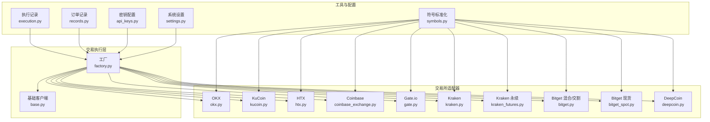
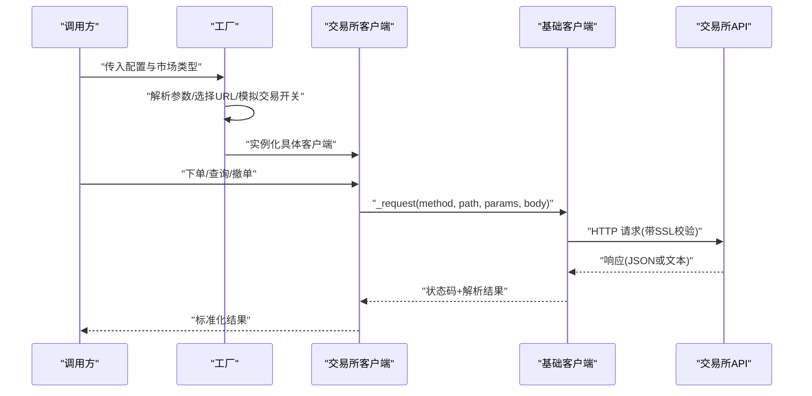
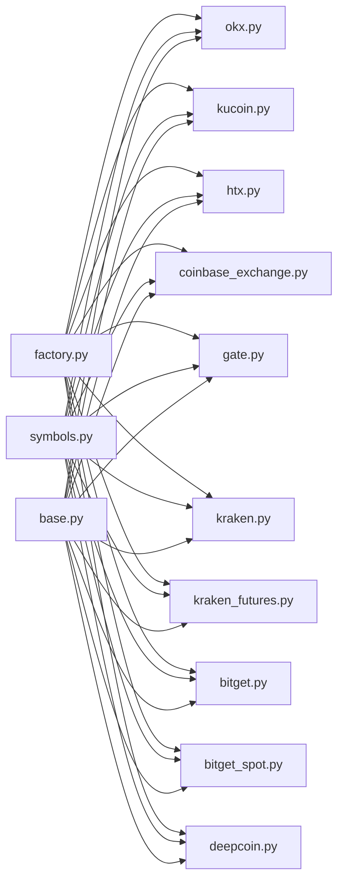

# 其他加密货币交易所集成

<cite>
**本文引用的文件**
- [factory.py](file://backend_api_python/app/services/live_trading/factory.py)
- [base.py](file://backend_api_python/app/services/live_trading/base.py)
- [symbols.py](file://backend_api_python/app/services/live_trading/symbols.py)
- [okx.py](file://backend_api_python/app/services/live_trading/okx.py)
- [kucoin.py](file://backend_api_python/app/services/live_trading/kucoin.py)
- [htx.py](file://backend_api_python/app/services/live_trading/htx.py)
- [coinbase_exchange.py](file://backend_api_python/app/services/live_trading/coinbase_exchange.py)
- [gate.py](file://backend_api_python/app/services/live_trading/gate.py)
- [kraken.py](file://backend_api_python/app/services/live_trading/kraken.py)
- [kraken_futures.py](file://backend_api_python/app/services/live_trading/kraken_futures.py)
- [bitget.py](file://backend_api_python/app/services/live_trading/bitget.py)
- [bitget_spot.py](file://backend_api_python/app/services/live_trading/bitget_spot.py)
- [deepcoin.py](file://backend_api_python/app/services/live_trading/deepcoin.py)
- [execution.py](file://backend_api_python/app/services/live_trading/execution.py)
- [records.py](file://backend_api_python/app/services/live_trading/records.py)
- [api_keys.py](file://backend_api_python/app/config/api_keys.py)
- [settings.py](file://backend_api_python/app/config/settings.py)
- [README.md](file://README.md)
</cite>

## 目录
1. [简介](#简介)
2. [项目结构](#项目结构)
3. [核心组件](#核心组件)
4. [架构总览](#架构总览)
5. [详细组件分析](#详细组件分析)
6. [依赖关系分析](#依赖关系分析)
7. [性能考虑](#性能考虑)
8. [故障排除指南](#故障排除指南)
9. [结论](#结论)
10. [附录](#附录)

## 简介
本文件面向需要在多个加密货币交易所之间进行统一集成与切换的开发者与量化团队，系统梳理了 OKX、KuCoin、HTX、Coinbase、Gate.io、Kraken、Bitget、DeepCoin 等主流交易所的 API 集成方式与差异点。内容涵盖：
- 统一接口抽象与工厂模式设计
- 各交易所的市场类型支持、认证参数与特有功能
- 符号标准化与多交易所标识转换
- 限流与错误处理策略
- 批量配置示例与最佳实践

## 项目结构
后端采用“工厂 + 基类 + 适配器”的分层设计：
- 工厂负责根据配置动态创建具体交易所客户端
- 基类提供通用的 HTTP 请求封装、SSL 校验与错误处理
- 适配器针对各交易所实现特定的 REST 接口与业务逻辑
- 符号工具模块提供跨交易所的标准化转换

图表来源
- [factory.py:59-218](file://backend_api_python/app/services/live_trading/factory.py#L59-L218)
- [base.py:95-157](file://backend_api_python/app/services/live_trading/base.py#L95-L157)
- [symbols.py:16-234](file://backend_api_python/app/services/live_trading/symbols.py#L16-L234)

章节来源
- [factory.py:1-355](file://backend_api_python/app/services/live_trading/factory.py#L1-L355)
- [base.py:1-158](file://backend_api_python/app/services/live_trading/base.py#L1-L158)
- [symbols.py:1-235](file://backend_api_python/app/services/live_trading/symbols.py#L1-L235)

## 核心组件
- 工厂函数 create_client：根据 exchange_id 与 market_type 动态创建对应交易所客户端；支持模拟交易开关、自定义 base_url 与特有参数（如 broker_code、channel_api_code、recv_window_ms 等）。
- 基类 BaseRestClient：封装 HTTP 请求、超时控制、SSL 校验解析、JSON 解析与错误回退；提供 get_fee_rate 抽象方法供子类实现。
- 符号标准化模块：提供 to_xxx_symbol 系列函数，将统一格式的交易对转换为各交易所所需的标识。

章节来源
- [factory.py:59-218](file://backend_api_python/app/services/live_trading/factory.py#L59-L218)
- [base.py:95-157](file://backend_api_python/app/services/live_trading/base.py#L95-L157)
- [symbols.py:16-234](file://backend_api_python/app/services/live_trading/symbols.py#L16-L234)

## 架构总览
统一的工厂入口负责路由到各交易所客户端，客户端通过基类完成网络请求与数据解析。符号标准化模块贯穿于下单、查询等流程，确保交易对在不同交易所间的一致性。

图表来源
- [factory.py:59-218](file://backend_api_python/app/services/live_trading/factory.py#L59-L218)
- [base.py:106-143](file://backend_api_python/app/services/live_trading/base.py#L106-L143)

## 详细组件分析

### 工厂与统一接口抽象
- 支持交易所列表：OKX、KuCoin、HTX、Coinbase、Gate.io、Kraken（含永续）、Bitget（混合/交割与现货）、Bybit、Binance（期货/现货）、DeepCoin。
- 市场类型映射：futures/future/perp/perpetual 统一映射为 swap；默认 futures（USDT-M）。
- 模拟交易：is_demo 由配置项 enable_demo_trading 或等价键决定，部分交易所使用独立测试网 URL。
- 特有参数：
  - OKX：broker_code、passphrase
  - Bitget：channel_api_code、passphrase
  - Bybit：category（spot/linear）、recv_window_ms、broker_referer、hedge_mode
  - KuCoin：passphrase、futures_base_url
  - Gate：gate_channel_id、futures_base_url
  - Kraken：futures_base_url
  - HTX：broker_id、futures_base_url
  - Coinbase：仅支持 spot
  - DeepCoin：passphrase、market_type

章节来源
- [factory.py:59-218](file://backend_api_python/app/services/live_trading/factory.py#L59-L218)

### OKX 集成要点
- 认证：API Key、Secret、Passphrase、Broker Code
- 市场类型：支持 swap（永续）
- 测试网：可通过 base_url 指向沙盒地址
- 特有功能：期权交易、资金划转、账户层级等（需在子类中实现）

章节来源
- [factory.py:84-94](file://backend_api_python/app/services/live_trading/factory.py#L84-L94)
- [okx.py](file://backend_api_python/app/services/live_trading/okx.py)

### KuCoin 集成要点
- 认证：API Key、Secret、Passphrase
- 市场类型：spot 与 futures（USDT 永续）
- 测试网：独立的 openapi sandbox 与 futures sandbox
- 特有功能：可选 futures_base_url；支持期权与杠杆产品（需在子类中实现）

章节来源
- [factory.py:160-167](file://backend_api_python/app/services/live_trading/factory.py#L160-L167)
- [kucoin.py](file://backend_api_python/app/services/live_trading/kucoin.py)

### HTX 集成要点
- 认证：API Key、Secret、Broker ID
- 市场类型：spot 与 futures（合约）
- 测试网：需显式提供 base_url 与 futures_base_url，否则抛错提示
- 特有功能：支持期权与多种合约类型（需在子类中实现）

章节来源
- [factory.py:191-204](file://backend_api_python/app/services/live_trading/factory.py#L191-L204)
- [htx.py](file://backend_api_python/app/services/live_trading/htx.py)

### Coinbase 集成要点
- 认证：API Key、Secret、Passphrase
- 市场类型：仅支持 spot
- 测试网：sandbox URL 可通过 base_url 指定
- 特有功能：支持多币种钱包与限额管理（需在子类中实现）

章节来源
- [factory.py:144-149](file://backend_api_python/app/services/live_trading/factory.py#L144-L149)
- [coinbase_exchange.py](file://backend_api_python/app/services/live_trading/coinbase_exchange.py)

### Gate.io 集成要点
- 认证：API Key、Secret、Channel ID
- 市场类型：spot 与 USDT futures
- 测试网：spot 使用 gateio ws 测试网，futures 使用 fx-api 测试网
- 特有功能：支持期权与杠杆产品（需在子类中实现）

章节来源
- [factory.py:169-177](file://backend_api_python/app/services/live_trading/factory.py#L169-L177)
- [gate.py](file://backend_api_python/app/services/live_trading/gate.py)

### Kraken 集成要点
- 认证：API Key、Secret
- 市场类型：spot 与 futures（永续）
- 测试网：spot 无独立公开沙盒；futures 提供 demo-futures.kraken.com
- 特有功能：支持多种保证金货币与高级订单类型（需在子类中实现）

章节来源
- [factory.py:151-158](file://backend_api_python/app/services/live_trading/factory.py#L151-L158)
- [kraken.py](file://backend_api_python/app/services/live_trading/kraken.py)
- [kraken_futures.py](file://backend_api_python/app/services/live_trading/kraken_futures.py)

### Bitget 集成要点
- 认证：API Key、Secret、Passphrase、Channel API Code
- 市场类型：spot 与 mix（混合/交割）
- 测试网：演示交易使用相同 REST 主机，需在平台创建演示账户
- 特有功能：支持期权与资金划转（需在子类中实现）

章节来源
- [factory.py:95-116](file://backend_api_python/app/services/live_trading/factory.py#L95-L116)
- [bitget.py](file://backend_api_python/app/services/live_trading/bitget.py)
- [bitget_spot.py](file://backend_api_python/app/services/live_trading/bitget_spot.py)

### DeepCoin 集成要点
- 认证：API Key、Secret、Passphrase
- 市场类型：支持 spot 与 swap（需在子类中实现）
- 测试网：当前未内置测试网，需显式提供 base_url，否则抛错
- 特有功能：支持期权与杠杆（需在子类中实现）

章节来源
- [factory.py:179-189](file://backend_api_python/app/services/live_trading/factory.py#L179-L189)
- [deepcoin.py](file://backend_api_python/app/services/live_trading/deepcoin.py)

### 符号标准化与多交易所映射
- 统一输入格式：如 "SOL/USDT:USDT"、"SOL/USDT"、"BTCUSDT"
- 输出格式按交易所约定：
  - OKX 永续：BASE-QUOTE-SWAP
  - OKX 现货：BASE-QUOTE
  - Bybit/KuCoin/Bitget：BASEQUOTE 或 BASE-QUOTE
  - Coinbase：BASE-QUOTE
  - Kraken：XBTUSDT 等（含映射）
  - KuCoin 永续：XBTUSDTM（含映射）
  - Kraken 永续：PF_XBTUSD（best-effort）
  - Gate：BASE_QUOTE
  - DeepCoin：BASE-QUOTE 或 BASE-QUOTE-SWAP
  - HTX：btcusdt 或 BTC-USDT

章节来源
- [symbols.py:16-234](file://backend_api_python/app/services/live_trading/symbols.py#L16-L234)

### 限流与错误处理策略
- 限流：各交易所限流策略不同，建议在上层统一接入速率限制器；工厂与客户端不直接实现限流，避免耦合。
- 错误处理：
  - 基类 _request 对 SSL 错误进行告警并透传异常
  - JSON 解析失败时保留前 2000 字符原始文本
  - 统一异常类型 LiveTradingError 用于工厂与调用方
- 异常恢复：建议结合指数退避重试与熔断保护；对网络瞬断与服务端过载进行区分处理。

章节来源
- [base.py:106-143](file://backend_api_python/app/services/live_trading/base.py#L106-L143)
- [base.py:91-92](file://backend_api_python/app/services/live_trading/base.py#L91-L92)
- [factory.py:218](file://backend_api_python/app/services/live_trading/factory.py#L218)

### 统一接口抽象与配置模板
- 统一字段：
  - exchange_id：小写交易所标识
  - api_key / secret_key / passphrase：认证凭据
  - base_url / futures_base_url：自定义 API 地址
  - market_type：spot / swap（futures/future/perp/perpetual 映射为 swap）
  - enable_demo_trading：启用模拟交易
  - 各交易所特有参数：broker_code、channel_api_code、recv_window_ms、gate_channel_id、hedge_mode 等
- 切换策略：通过修改 exchange_id 与 market_type 即可在不同交易所间无缝切换，无需改动上层调用代码。

章节来源
- [factory.py:59-218](file://backend_api_python/app/services/live_trading/factory.py#L59-L218)

### 批量配置示例与最佳实践
- 批量配置：为每个交易所准备一组最小可用配置（exchange_id、api_key、secret_key、passphrase、market_type），必要时补充 base_url/futures_base_url。
- 最佳实践：
  - 在生产环境禁用 SSL 校验（LIVE_TRADING_SSL_VERIFY=false）仅限开发调试
  - 使用统一的 SSL 校验证书链（LIVE_TRADING_CA_BUNDLE 或 REQUESTS_CA_BUNDLE）
  - 对高频请求设置合理的超时与重试策略
  - 将 fee 查询封装为可选步骤，避免阻塞主流程
  - 对不同交易所的错误码进行归一化处理，便于统一告警与恢复

章节来源
- [base.py:34-79](file://backend_api_python/app/services/live_trading/base.py#L34-L79)
- [factory.py:338-352](file://backend_api_python/app/services/live_trading/factory.py#L338-L352)

## 依赖关系分析
- 工厂对各交易所客户端存在直接依赖，但通过延迟导入避免在缺少依赖库时启动失败
- 基类仅依赖标准库与 requests，降低耦合度
- 符号模块为纯函数，无外部依赖，便于复用

图表来源
- [factory.py:17-30](file://backend_api_python/app/services/live_trading/factory.py#L17-L30)
- [symbols.py:16-234](file://backend_api_python/app/services/live_trading/symbols.py#L16-L234)
- [base.py:95-157](file://backend_api_python/app/services/live_trading/base.py#L95-L157)

## 性能考虑
- 连接池与并发：建议在上层引入连接池与并发队列，避免频繁握手与阻塞
- 缓存策略：对 fee、ticker、深度等高频数据进行本地缓存，减少重复请求
- 超时与重试：为不同交易所设置差异化超时与重试上限，避免雪崩效应
- 代理与证书：在容器或受限环境中优先使用 REQUESTS_CA_BUNDLE 指定证书路径，避免每次解析系统证书

## 故障排除指南
- SSL 证书问题：检查 LIVE_TRADING_CA_BUNDLE 是否指向有效 PEM 文件；必要时安装 ca-certificates
- 代理与 TLS 检查：若部署在企业网络中，需提供自定义 CA Bundle 并确保证书链完整
- 限流与熔断：监控 429/5xx 错误，实施指数退避与熔断保护
- 参数校验：确认 exchange_id、market_type、base_url、futures_base_url 等关键字段正确
- 模拟交易：部分交易所必须显式提供测试网 base_url，否则会抛出配置错误

章节来源
- [base.py:34-79](file://backend_api_python/app/services/live_trading/base.py#L34-L79)
- [factory.py:180-181](file://backend_api_python/app/services/live_trading/factory.py#L180-L181)
- [factory.py:192-193](file://backend_api_python/app/services/live_trading/factory.py#L192-L193)

## 结论
通过工厂模式与统一基类，项目实现了对多家交易所的统一接入与灵活切换。配合符号标准化与配置模板，用户可以在不修改上层逻辑的前提下快速迁移至任意受支持的交易所。建议在生产环境中完善限流、熔断与证书管理策略，并对各交易所的特有功能进行分层封装以提升可维护性。

## 附录
- 术语说明
  - 永续：Perpetual Swap，无到期日的衍生品
  - 现货：Spot，即买即卖的资产交易
  - 期权：Options，基于标的资产的衍生品
  - 资金划转：Funding transfer，账户间资金转移
  - 质押挖矿：Staking/DeFi，流动性提供与收益获取
- 参考资料
  - 项目 README 与相关文档

章节来源
- [README.md](file://README.md)