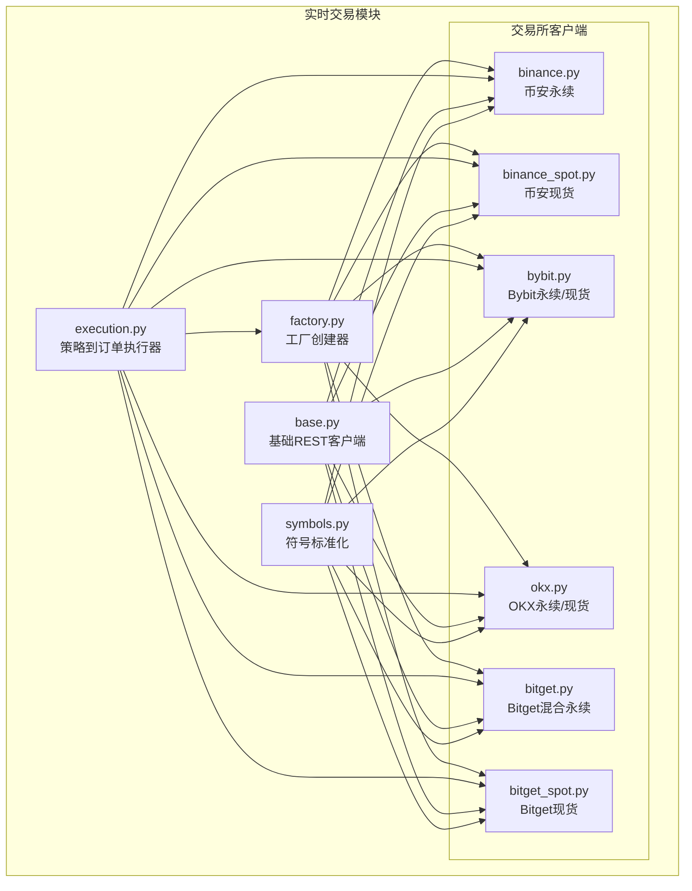
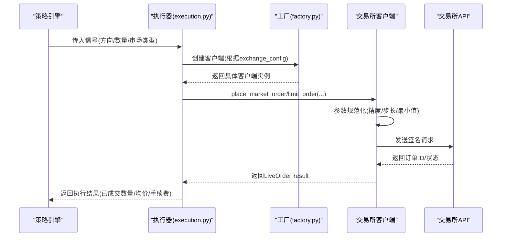
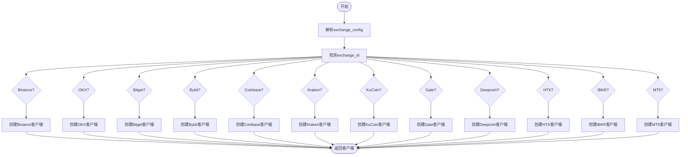
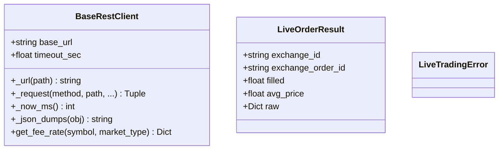
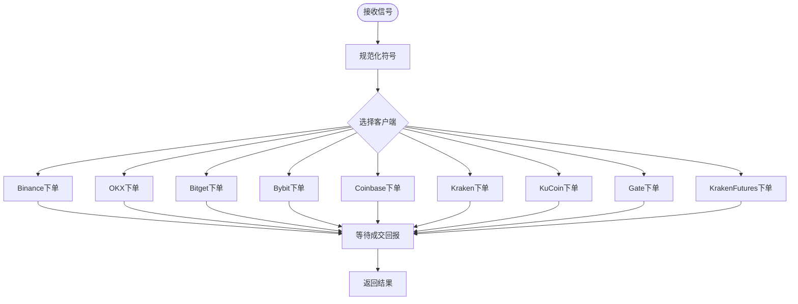
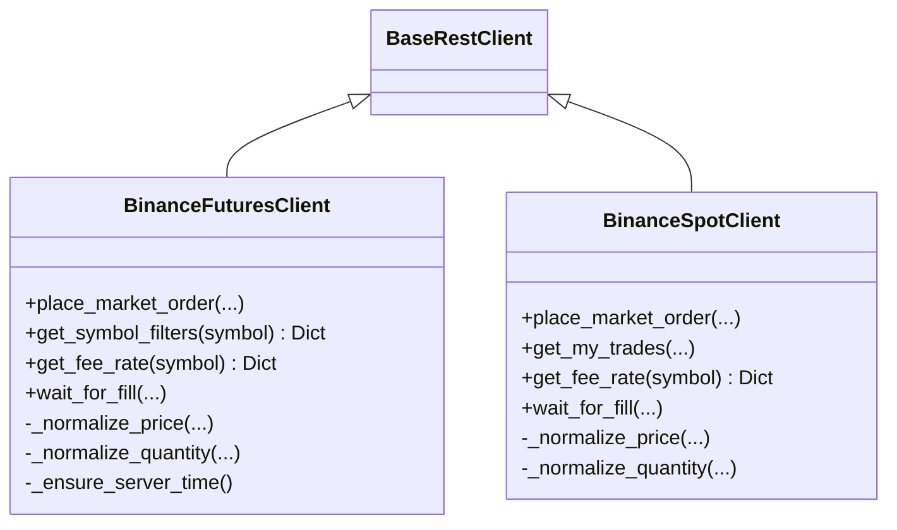
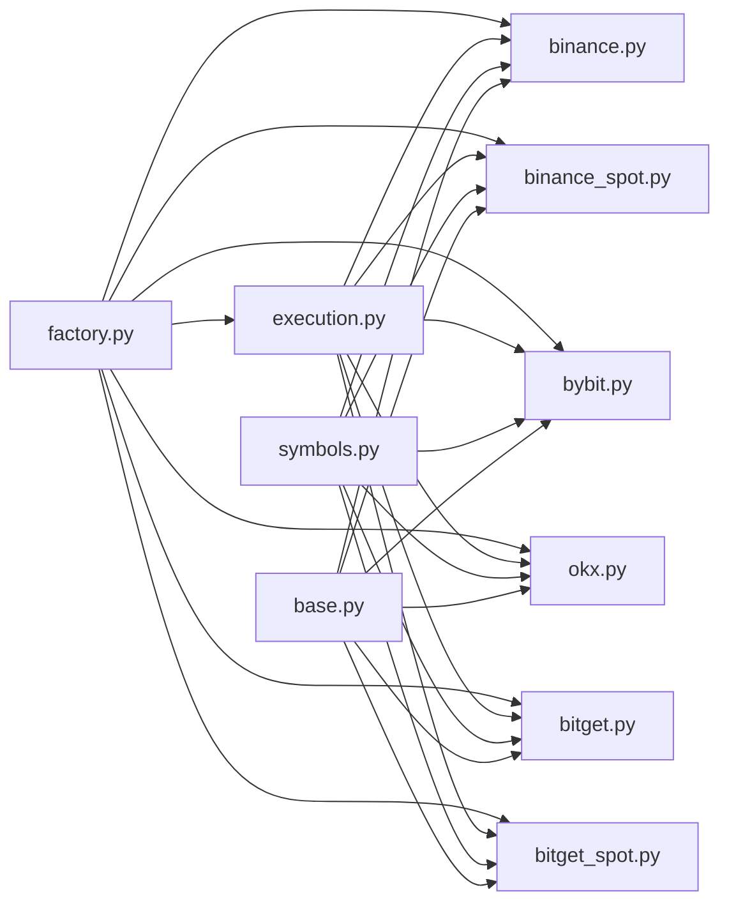

# 实时交易集成

<cite>
**本文档引用的文件**
- [factory.py](file://backend_api_python/app/services/live_trading/factory.py)
- [base.py](file://backend_api_python/app/services/live_trading/base.py)
- [execution.py](file://backend_api_python/app/services/live_trading/execution.py)
- [symbols.py](file://backend_api_python/app/services/live_trading/symbols.py)
- [binance.py](file://backend_api_python/app/services/live_trading/binance.py)
- [binance_spot.py](file://backend_api_python/app/services/live_trading/binance_spot.py)
- [bybit.py](file://backend_api_python/app/services/live_trading/bybit.py)
- [okx.py](file://backend_api_python/app/services/live_trading/okx.py)
- [bitget.py](file://backend_api_python/app/services/live_trading/bitget.py)
- [bitget_spot.py](file://backend_api_python/app/services/live_trading/bitget_spot.py)
</cite>

## 目录
1. [简介](#简介)
2. [项目结构](#项目结构)
3. [核心组件](#核心组件)
4. [架构总览](#架构总览)
5. [详细组件分析](#详细组件分析)
6. [依赖关系分析](#依赖关系分析)
7. [性能考虑](#性能考虑)
8. [故障排除指南](#故障排除指南)
9. [结论](#结论)

## 简介
本文件为 QuantDinger 实时交易集成系统的综合技术文档，覆盖多交易所直连客户端的统一抽象、工厂化创建、订单执行流程、错误处理与网络异常恢复策略，以及不同市场的交易规则差异（最小订单量、价格精度、保证金模式等）。系统支持加密货币交易所（Binance、OKX、Bitget、Bybit、Coinbase、Kraken、KuCoin、Gate、Deepcoin、HTX）、传统股票市场（Interactive Brokers）与外汇平台（MetaTrader 5）。

## 项目结构
后端交易模块位于 `backend_api_python/app/services/live_trading/`，采用“按交易所拆分”的文件组织方式，配合一个工厂类统一创建与配置，一个通用基类提供统一的 REST 请求封装与错误处理，以及一个执行器将策略信号转换为具体交易所的下单调用。

**图表来源**
- [factory.py:59-218](file://backend_api_python/app/services/live_trading/factory.py#L59-L218)
- [base.py:95-157](file://backend_api_python/app/services/live_trading/base.py#L95-L157)
- [execution.py:123-310](file://backend_api_python/app/services/live_trading/execution.py#L123-L310)
- [symbols.py:43-234](file://backend_api_python/app/services/live_trading/symbols.py#L43-L234)

**章节来源**
- [factory.py:1-355](file://backend_api_python/app/services/live_trading/factory.py#L1-L355)
- [base.py:1-158](file://backend_api_python/app/services/live_trading/base.py#L1-L158)
- [execution.py:1-426](file://backend_api_python/app/services/live_trading/execution.py#L1-L426)
- [symbols.py:1-235](file://backend_api_python/app/services/live_trading/symbols.py#L1-L235)

## 核心组件
- 工厂创建器：根据配置动态创建指定交易所的直连客户端，支持加密货币、股票与外汇场景，并提供费用查询辅助。
- 基础REST客户端：统一的HTTP请求封装、签名生成、时间同步、SSL验证策略与错误包装。
- 执行器：将策略信号映射为具体交易所的下单参数，自动处理不同市场的符号格式、方向与参数差异。
- 符号标准化：将用户输入的符号转换为各交易所期望的标识格式（如币安永续、OKX永续、Bybit现货等）。

**章节来源**
- [factory.py:59-218](file://backend_api_python/app/services/live_trading/factory.py#L59-L218)
- [base.py:95-157](file://backend_api_python/app/services/live_trading/base.py#L95-L157)
- [execution.py:123-310](file://backend_api_python/app/services/live_trading/execution.py#L123-L310)
- [symbols.py:43-234](file://backend_api_python/app/services/live_trading/symbols.py#L43-L234)

## 架构总览
系统通过工厂创建器选择合适的交易所客户端，执行器负责把策略信号转换为下单请求，客户端完成签名、参数规范化与请求发送，最后等待成交回报并计算手续费。

**图表来源**
- [execution.py:123-310](file://backend_api_python/app/services/live_trading/execution.py#L123-L310)
- [factory.py:59-218](file://backend_api_python/app/services/live_trading/factory.py#L59-L218)
- [binance.py:735-800](file://backend_api_python/app/services/live_trading/binance.py#L735-L800)
- [bybit.py:509-594](file://backend_api_python/app/services/live_trading/bybit.py#L509-L594)
- [okx.py:551-617](file://backend_api_python/app/services/live_trading/okx.py#L551-L617)

## 详细组件分析

### 工厂创建器（factory.py）
- 支持的交易所：Binance、OKX、Bitget（混合/现货）、Bybit（v5）、Coinbase、Kraken（现货/永续）、KuCoin（现货/永续）、Gate（现货/USDT永续）、Deepcoin、HTX、IBKR（股票）、MT5（外汇）。
- 关键能力：
  - 统一解析配置（API Key、Secret、Passphrase、Base URL、市场类型、是否模拟交易等）。
  - 按市场类型（swap/spot）选择对应客户端。
  - 对部分交易所提供额外参数（如Bybit的recvWindow、Broker Referer；OKX的Broker Code；HTX的Broker ID等）。
  - 提供费用查询辅助函数，临时创建客户端以查询账户费率。
  - 对IBKR与MT5进行延迟导入，避免未安装依赖时报错。

**图表来源**
- [factory.py:59-218](file://backend_api_python/app/services/live_trading/factory.py#L59-L218)

**章节来源**
- [factory.py:59-218](file://backend_api_python/app/services/live_trading/factory.py#L59-L218)

### 基础REST客户端（base.py）
- 统一封装HTTP请求，支持超时、SSL验证策略（支持PROXY_URL/SOCKS场景下的证书链配置）。
- 提供统一的错误包装（LiveTradingError），便于上层捕获与处理。
- 提供时间同步辅助（用于需要服务器时间戳的签名场景）。
- 提供费用查询接口占位，具体交易所实现按需覆盖。

**图表来源**
- [base.py:95-157](file://backend_api_python/app/services/live_trading/base.py#L95-L157)

**章节来源**
- [base.py:1-158](file://backend_api_python/app/services/live_trading/base.py#L1-L158)

### 执行器（execution.py）
- 将策略信号（开多/开空/平多/平空）映射为各交易所的下单参数。
- 自动规范化符号格式，适配不同交易所的标识规范。
- 针对不同市场类型（spot/swap）与不同交易所的参数差异（如OKX的posSide、tdMode；Bybit的positionIdx；Bitget的margin_mode/pos字段）进行适配。
- 对部分交易所（如Bitget/KuCoin/Gate/Kraken）在市价买单时支持“按报价金额”下单的特殊处理。

**图表来源**
- [execution.py:123-310](file://backend_api_python/app/services/live_trading/execution.py#L123-L310)

**章节来源**
- [execution.py:1-426](file://backend_api_python/app/services/live_trading/execution.py#L1-L426)

### 符号标准化（symbols.py）
- 提供跨交易所的符号转换函数，确保策略输入的符号能被各交易所识别。
- 支持常见格式（如“BTC/USDT”、“BTCUSDT”、“BTC/USDT:USDT”）的解析与转换。
- 为各交易所提供专用的标准化函数（如 to_binance_futures_symbol、to_okx_swap_inst_id、to_bybit_symbol 等）。

**章节来源**
- [symbols.py:1-235](file://backend_api_python/app/services/live_trading/symbols.py#L1-L235)

### 加密货币交易所客户端

#### 币安（Binance）
- 支持币安永续（USDT-M）与现货。
- 关键特性：
  - 严格的价格/数量精度控制，遵循LOT_SIZE/PRICE_FILTER与精度元数据。
  - 时间同步与签名（HMAC-SHA256），自动处理-1021时钟偏差。
  - 最小notional校验与最小下单量校验。
  - 支持多仓/单向模式下的positionSide处理。
  - 订单成交后通过userTrades或commissionRate计算手续费。

**图表来源**
- [binance.py:24-800](file://backend_api_python/app/services/live_trading/binance.py#L24-L800)
- [binance_spot.py:21-717](file://backend_api_python/app/services/live_trading/binance_spot.py#L21-L717)

**章节来源**
- [binance.py:1-1036](file://backend_api_python/app/services/live_trading/binance.py#L1-L1036)
- [binance_spot.py:1-717](file://backend_api_python/app/services/live_trading/binance_spot.py#L1-L717)

#### OKX
- 支持永续与现货。
- 关键特性：
  - 使用RFC3339时间戳与签名，支持模拟交易标记。
  - 位置模式（net_mode/long_short_mode）兼容，posSide自动推断。
  - SWAP成交数量与报价的换算（ctVal）。
  - 权限错误与保证金不足错误的友好提示。

**章节来源**
- [okx.py:1-865](file://backend_api_python/app/services/live_trading/okx.py#L1-L865)

#### Bitget
- 支持混合永续与现货。
- 关键特性：
  - 混合永续下单需区分 hedge_mode 与 one_way_mode 的 position 字段。
  - 支持通道API Code与模拟交易标记。
  - 通过feeDetail解析多条成交的手续费。

**章节来源**
- [bitget.py:1-1084](file://backend_api_python/app/services/live_trading/bitget.py#L1-L1084)
- [bitget_spot.py:1-598](file://backend_api_python/app/services/live_trading/bitget_spot.py#L1-L598)

#### Bybit（v5）
- 支持线性永续与现货。
- 关键特性：
  - 严格的服务器时间同步（retCode 10002）。
  - 精度控制与tickSize/qtyStep校验。
  - positionIdx与reduceOnly字段的组合使用。

**章节来源**
- [bybit.py:1-747](file://backend_api_python/app/services/live_trading/bybit.py#L1-L747)

#### 其他加密货币交易所
- Coinbase、Kraken（现货/永续）、KuCoin（现货/永续）、Gate（现货/USDT永续）、Deepcoin、HTX：均基于统一的BaseRestClient，实现各自的签名、参数规范化与订单查询逻辑。

**章节来源**
- [factory.py:17-31](file://backend_api_python/app/services/live_trading/factory.py#L17-L31)

### 传统与外汇市场

#### Interactive Brokers（IBKR，US股票）
- 通过工厂延迟导入，连接本地TWS/Gateway。
- 仅支持股票市场，不支持做空。

**章节来源**
- [factory.py:221-261](file://backend_api_python/app/services/live_trading/factory.py#L221-L261)
- [execution.py:313-366](file://backend_api_python/app/services/live_trading/execution.py#L313-L366)

#### MetaTrader 5（MT5，外汇）
- 通过工厂延迟导入，连接本地MT5终端。
- 仅支持外汇市场，信号映射包含多空方向与平仓逻辑。

**章节来源**
- [factory.py:264-335](file://backend_api_python/app/services/live_trading/factory.py#L264-L335)
- [execution.py:369-424](file://backend_api_python/app/services/live_trading/execution.py#L369-L424)

## 依赖关系分析
- 工厂创建器对各交易所客户端进行集中管理，执行器依赖工厂创建的客户端实例。
- 所有交易所客户端继承自基础REST客户端，共享统一的HTTP与签名基础设施。
- 符号标准化模块被所有交易所客户端复用，保证策略输入的一致性。

**图表来源**
- [factory.py:17-38](file://backend_api_python/app/services/live_trading/factory.py#L17-L38)
- [execution.py:14-38](file://backend_api_python/app/services/live_trading/execution.py#L14-L38)
- [symbols.py:13-23](file://backend_api_python/app/services/live_trading/symbols.py#L13-L23)
- [base.py:10-20](file://backend_api_python/app/services/live_trading/base.py#L10-L20)

**章节来源**
- [factory.py:1-355](file://backend_api_python/app/services/live_trading/factory.py#L1-L355)
- [execution.py:1-426](file://backend_api_python/app/services/live_trading/execution.py#L1-L426)
- [symbols.py:1-235](file://backend_api_python/app/services/live_trading/symbols.py#L1-L235)
- [base.py:1-158](file://backend_api_python/app/services/live_trading/base.py#L1-L158)

## 性能考虑
- 缓存策略：各交易所客户端普遍采用“最佳努力缓存”，如Binance/OKX的instrument信息、Bybit的合约元数据、Bitget的合约与杠杆设置等，减少重复请求。
- 精度与步长：通过exchangeInfo/合约元数据严格控制精度，避免因超出步长导致的下单失败与重试。
- 超时与轮询：执行器与客户端统一使用超时与轮询策略，平衡响应速度与准确性。
- 代理与证书：基础客户端支持SOCKS代理与自定义CA Bundle，满足企业网络与TLS检查需求。

[本节为通用指导，无需特定文件引用]

## 故障排除指南
- SSL/TLS证书问题：当HTTPS校验失败时，基础客户端会记录警告并抛出异常。可通过设置LIVE_TRADING_CA_BUNDLE或禁用校验（开发环境）解决。
- 时钟偏差：Binance/Bybit/Kraken等要求严格的时间同步，出现-1021/10002等错误时，客户端会自动重新同步时间并重试。
- 权限错误：OKX常见50120权限错误，需在交易所开启“交易”权限；币安2015错误需确认API具备现货权限。
- 最小下单量与精度：各交易所对步长、最小量、最小notional有严格限制，建议先查询filters/合约元数据再下单。
- 成交回报延迟：部分交易所（如OKX）成交回报可能滞后，执行器会通过轮询与fills接口获取更准确的成交均价与手续费。

**章节来源**
- [base.py:34-143](file://backend_api_python/app/services/live_trading/base.py#L34-L143)
- [binance.py:218-236](file://backend_api_python/app/services/live_trading/binance.py#L218-L236)
- [bybit.py:288-297](file://backend_api_python/app/services/live_trading/bybit.py#L288-L297)
- [okx.py:340-383](file://backend_api_python/app/services/live_trading/okx.py#L340-L383)

## 结论
该系统通过统一的工厂与执行器抽象，实现了多交易所、多市场的统一接入与订单执行。各交易所客户端在基础REST之上实现了签名、参数规范化与错误处理，确保在不同市场的交易规则下稳定运行。建议在生产环境中：
- 明确各交易所的API权限与限额，提前配置好Base URL与证书。
- 使用缓存与预热策略，减少首次请求延迟。
- 在部署代理与TLS检查的企业网络中，正确配置CA Bundle。
- 对关键错误（权限、时钟、精度、最小notional）建立监控与告警。