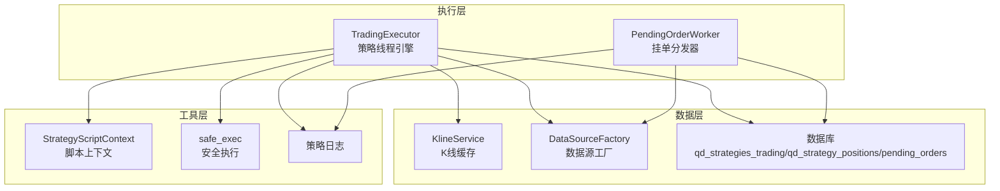
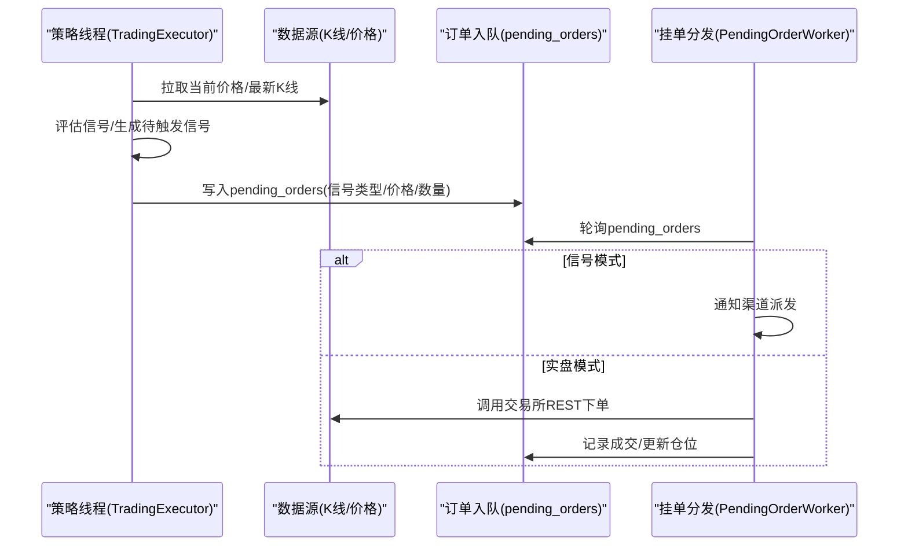
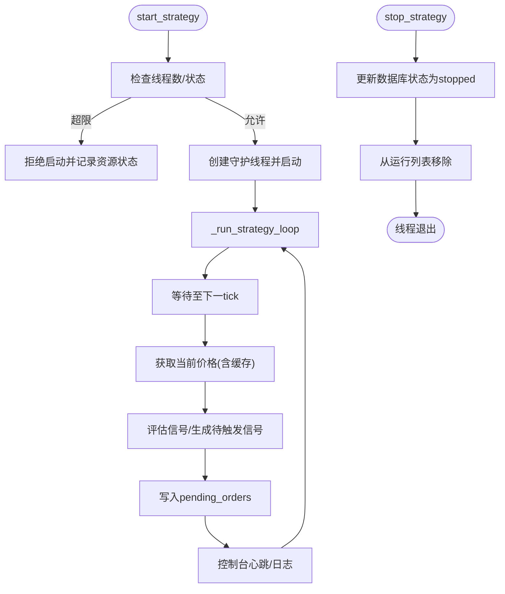
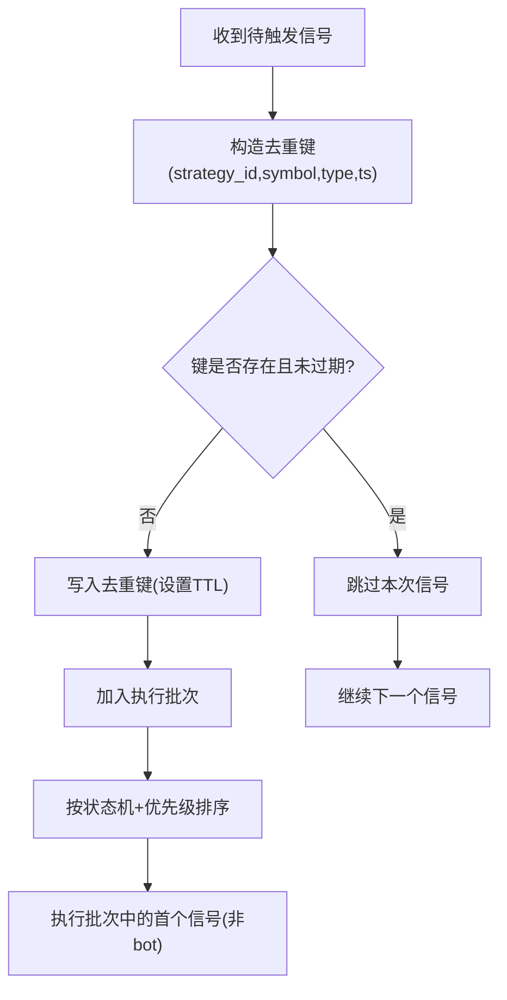
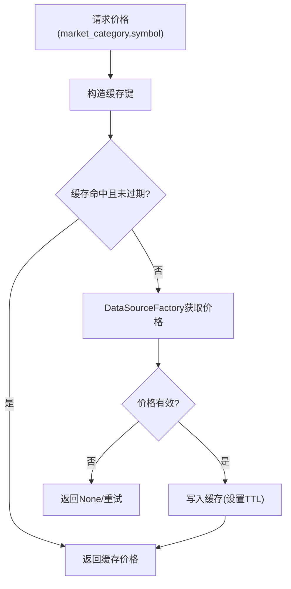
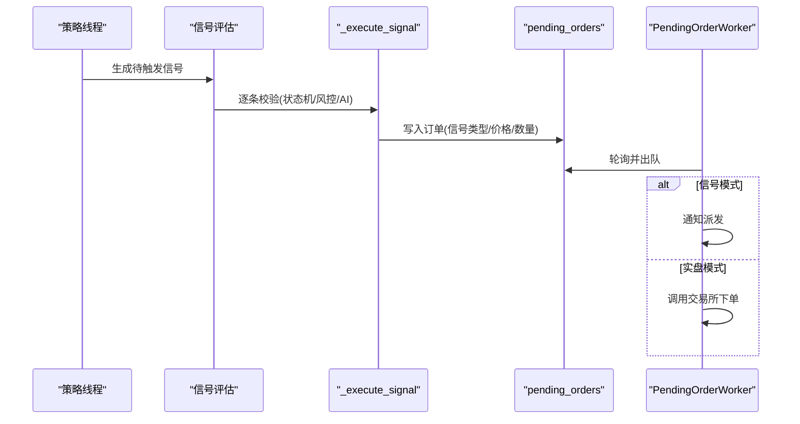
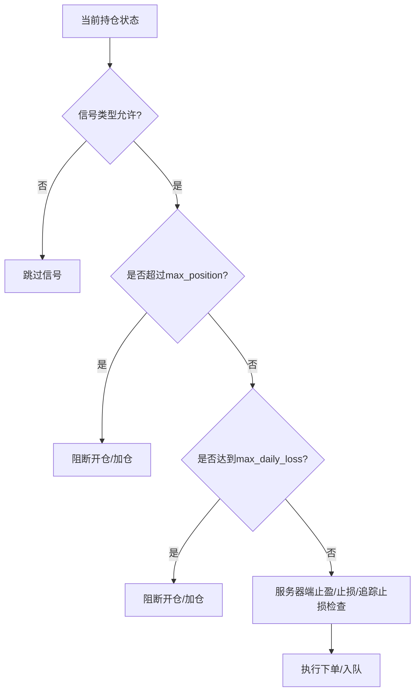
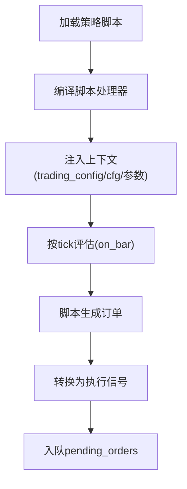
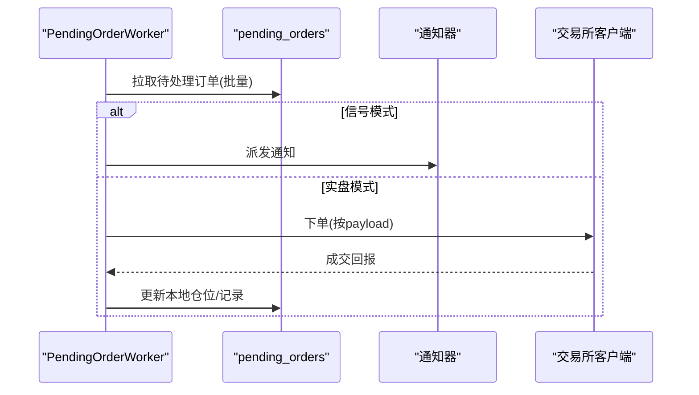
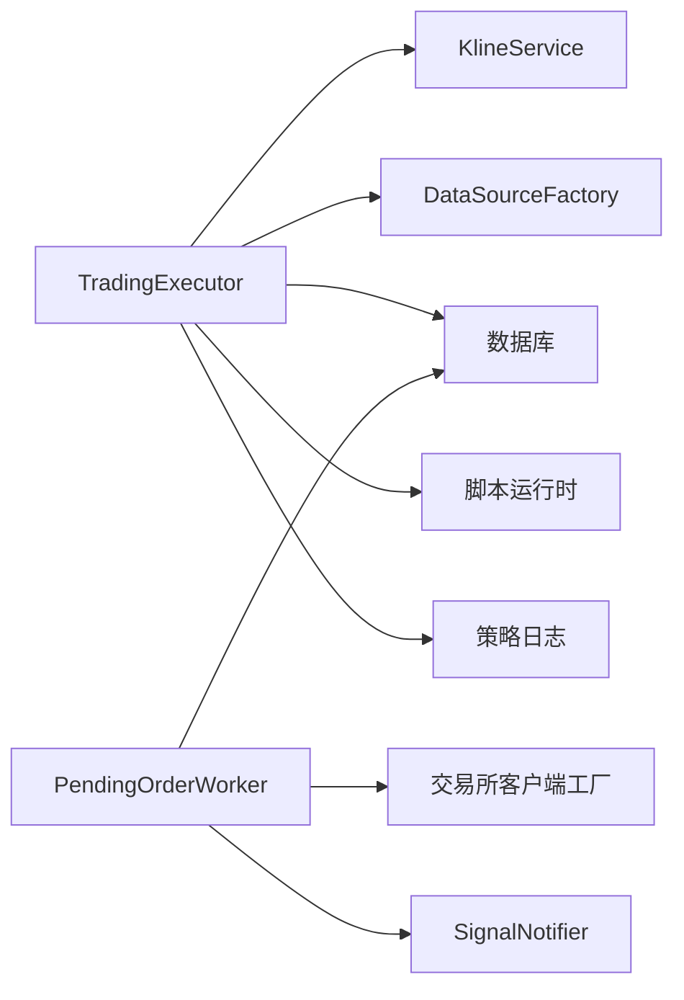

# 统一执行层架构

<cite>
**本文档引用的文件**
- [trading_executor.py](file://backend_api_python/app/services/trading_executor.py)
- [pending_order_worker.py](file://backend_api_python/app/services/pending_order_worker.py)
- [simulate_trading_executor.py](file://backend_api_python/scripts/simulate_trading_executor.py)
</cite>

## 目录
1. [简介](#简介)
2. [项目结构](#项目结构)
3. [核心组件](#核心组件)
4. [架构总览](#架构总览)
5. [详细组件分析](#详细组件分析)
6. [依赖关系分析](#依赖关系分析)
7. [性能考量](#性能考量)
8. [故障排查指南](#故障排查指南)
9. [结论](#结论)
10. [附录](#附录)

## 简介
本文件系统性阐述 QuantDinger 项目的统一执行层架构，重点围绕 TradingExecutor 类的设计理念、线程管理机制、信号去重系统与价格缓存策略展开，同时覆盖策略线程生命周期管理、资源限制机制与错误处理策略。执行器的核心功能包括：信号处理、订单生成、仓位管理与风险控制。文末提供使用示例与最佳实践，帮助读者正确进行线程安全操作、配置管理与性能优化。

## 项目结构
统一执行层位于后端服务层，主要由以下模块构成：
- TradingExecutor：策略线程引擎，负责信号生成、触发与执行调度
- PendingOrderWorker：挂单分发与实盘执行协调器
- 数据与工具：K线服务、数据源工厂、脚本运行时、日志与数据库工具
- 仿真脚本：本地模拟执行器，验证订单入队与信号行为

图表来源
- [trading_executor.py:37-68](file://backend_api_python/app/services/trading_executor.py#L37-L68)
- [pending_order_worker.py:52-72](file://backend_api_python/app/services/pending_order_worker.py#L52-L72)

章节来源
- [trading_executor.py:1-120](file://backend_api_python/app/services/trading_executor.py#L1-L120)
- [pending_order_worker.py:1-60](file://backend_api_python/app/services/pending_order_worker.py#L1-L60)

## 核心组件
- TradingExecutor：统一的实时交易执行器，支持指标策略与脚本策略，内置信号去重、价格缓存、风险控制与状态机约束，按统一 tick cadence 推进。
- PendingOrderWorker：轮询 pending_orders 表，按 execution_mode 分发通知或实盘下单，具备位置同步与挂单回收能力。
- 数据与脚本：K线服务、数据源工厂、脚本运行时（含安全执行与参数注入）、策略日志与数据库访问。

章节来源
- [trading_executor.py:37-68](file://backend_api_python/app/services/trading_executor.py#L37-L68)
- [pending_order_worker.py:52-72](file://backend_api_python/app/services/pending_order_worker.py#L52-L72)

## 架构总览
统一执行层采用“策略线程 + 挂单分发”的双层协作模式：
- 策略线程：每策略一个守护线程，按统一 tick cadence 拉取价格、评估信号、生成待触发信号并入队
- 挂单分发：独立线程扫描 pending_orders，按 execution_mode 执行通知或实盘下单

图表来源
- [trading_executor.py:775-1482](file://backend_api_python/app/services/trading_executor.py#L775-L1482)
- [pending_order_worker.py:91-122](file://backend_api_python/app/services/pending_order_worker.py#L91-L122)

## 详细组件分析

### TradingExecutor 设计与线程管理
- 线程模型
  - 每策略一个守护线程，使用锁保护运行中策略集合，避免重复启动与泄漏
  - 通过最大线程数限制（STRATEGY_MAX_THREADS）防止资源耗尽
  - 循环内按统一 tick cadence（默认 10s）推进，避免忙等
- 生命周期管理
  - start_strategy：校验线程数与状态，创建并启动线程
  - stop_strategy：标记数据库状态为 stopped，线程在下次循环检测到后优雅退出
  - _is_strategy_running：双检查（数据库状态 + 线程存活），修复重启后状态不一致问题
- 资源监控
  - _log_resource_status：尝试采集内存/线程数，辅助定位 can't start new thread 根因
  - _console_print：控制台可观测性输出，便于本地调试

图表来源
- [trading_executor.py:393-444](file://backend_api_python/app/services/trading_executor.py#L393-L444)
- [trading_executor.py:446-484](file://backend_api_python/app/services/trading_executor.py#L446-L484)
- [trading_executor.py:1063-1482](file://backend_api_python/app/services/trading_executor.py#L1063-L1482)

章节来源
- [trading_executor.py:393-484](file://backend_api_python/app/services/trading_executor.py#L393-L484)
- [trading_executor.py:1063-1482](file://backend_api_python/app/services/trading_executor.py#L1063-L1482)

### 信号去重系统
- 去重目标：避免同一根K线信号在后续 tick 中重复触发
- 去重策略
  - 以 (strategy_id, symbol, signal_type, signal_timestamp) 为键，结合时间窗口 TTL（至少两根K线周期）
  - 采用内存字典与锁保护，定期清理过期键，降低内存占用
  - 对于 bot 模式脚本，允许每 tick 评估，非 bot 模式每根K线最多触发一次
- 与状态机配合：先按状态机过滤，再按去重键判定，最后按优先级排序选择执行批次

图表来源
- [trading_executor.py:233-288](file://backend_api_python/app/services/trading_executor.py#L233-L288)
- [trading_executor.py:1343-1382](file://backend_api_python/app/services/trading_executor.py#L1343-L1382)

章节来源
- [trading_executor.py:233-288](file://backend_api_python/app/services/trading_executor.py#L233-L288)
- [trading_executor.py:1343-1382](file://backend_api_python/app/services/trading_executor.py#L1343-L1382)

### 价格缓存策略
- 缓存结构：内存字典，键为 "market_category:symbol"，值为 (price, expiry)
- TTL 策略：默认 10s（与统一 tick cadence 对齐），可通过环境变量 PRICE_CACHE_TTL_SEC 调整
- 命中流程：命中直接返回；过期删除；未命中通过 DataSourceFactory 获取并写入缓存
- 适用范围：当前价格获取，减少频繁数据源调用

图表来源
- [trading_executor.py:1646-1688](file://backend_api_python/app/services/trading_executor.py#L1646-L1688)

章节来源
- [trading_executor.py:1646-1688](file://backend_api_python/app/services/trading_executor.py#L1646-L1688)

### 信号处理、订单生成与执行
- 信号来源
  - 指标策略：执行指标脚本，提取 buy/sell 或 open_long/close_long 等信号
  - 脚本策略：按 tick 评估 bot 脚本，生成订单并转换为执行信号
- 触发条件
  - 价格条件：按信号方向比较当前价与触发价
  - 立即触发：平仓/止损止盈信号默认立即触发；也可通过配置切换为按价格条件
- 执行路径
  - _execute_signal：校验状态机、风控限额、AI 过滤、计算下单数量，最终入队 pending_orders
  - _execute_exchange_order：实际下单（信号模式仅入队，实盘模式由 PendingOrderWorker 执行）

图表来源
- [trading_executor.py:1236-1445](file://backend_api_python/app/services/trading_executor.py#L1236-L1445)
- [trading_executor.py:2456-2786](file://backend_api_python/app/services/trading_executor.py#L2456-L2786)
- [pending_order_worker.py:712-799](file://backend_api_python/app/services/pending_order_worker.py#L712-L799)

章节来源
- [trading_executor.py:1236-1445](file://backend_api_python/app/services/trading_executor.py#L1236-L1445)
- [trading_executor.py:2456-2786](file://backend_api_python/app/services/trading_executor.py#L2456-L2786)
- [pending_order_worker.py:712-799](file://backend_api_python/app/services/pending_order_worker.py#L712-L799)

### 仓位管理与风险控制
- 仓位状态机
  - flat/long/short 三态，严格限制信号类型与当前状态匹配
  - close_* 优先级高于 open_* / add_*，bot 模式允许跨状态多次转换
- 风险控制
  - 最大持仓额限制（max_position）
  - 最大单日亏损限制（max_daily_loss）
  - 服务器端止盈/止损/追踪止损：基于配置百分比与杠杆换算为价格阈值
- 仓位更新
  - 每 tick 更新本地数据库中的最高/最低价，支持重启后继续追踪

图表来源
- [trading_executor.py:1337-1342](file://backend_api_python/app/services/trading_executor.py#L1337-L1342)
- [trading_executor.py:1690-1937](file://backend_api_python/app/services/trading_executor.py#L1690-L1937)
- [trading_executor.py:2538-2561](file://backend_api_python/app/services/trading_executor.py#L2538-L2561)

章节来源
- [trading_executor.py:1337-1342](file://backend_api_python/app/services/trading_executor.py#L1337-L1342)
- [trading_executor.py:1690-1937](file://backend_api_python/app/services/trading_executor.py#L1690-L1937)
- [trading_executor.py:2538-2561](file://backend_api_python/app/services/trading_executor.py#L2538-L2561)

### 脚本策略与脚本运行时
- 脚本编译与执行
  - 编译脚本处理器，注入 trading_config、cfg（嵌套配置）、指标参数与调用器
  - 安全执行：限制内置函数与超时控制，兼容 pandas 2.x 填充语法
- 上下文与位置注入
  - _hydrate_script_ctx_from_positions：将数据库中当前持仓注入脚本上下文，刷新权益
  - _script_orders_to_execution_signals：将脚本订单转换为执行信号，支持 bot 模式与网格/定投逻辑

图表来源
- [trading_executor.py:536-560](file://backend_api_python/app/services/trading_executor.py#L536-L560)
- [trading_executor.py:600-717](file://backend_api_python/app/services/trading_executor.py#L600-L717)
- [trading_executor.py:2329-2418](file://backend_api_python/app/services/trading_executor.py#L2329-L2418)

章节来源
- [trading_executor.py:536-560](file://backend_api_python/app/services/trading_executor.py#L536-L560)
- [trading_executor.py:600-717](file://backend_api_python/app/services/trading_executor.py#L600-L717)
- [trading_executor.py:2329-2418](file://backend_api_python/app/services/trading_executor.py#L2329-L2418)

### 挂单分发与实盘执行
- 分发策略
  - 按优先级与ID升序批量拉取 pending_orders
  - 信号模式：派发通知；实盘模式：调用交易所客户端下单
- 位置同步
  - 定期与交易所对账，清理“幽灵持仓”，必要时插入本地缺失的仓位
  - 支持多交易所客户端适配与合约/币安等特殊映射

图表来源
- [pending_order_worker.py:91-122](file://backend_api_python/app/services/pending_order_worker.py#L91-L122)
- [pending_order_worker.py:712-799](file://backend_api_python/app/services/pending_order_worker.py#L712-L799)
- [pending_order_worker.py:138-636](file://backend_api_python/app/services/pending_order_worker.py#L138-L636)

章节来源
- [pending_order_worker.py:91-122](file://backend_api_python/app/services/pending_order_worker.py#L91-L122)
- [pending_order_worker.py:712-799](file://backend_api_python/app/services/pending_order_worker.py#L712-L799)
- [pending_order_worker.py:138-636](file://backend_api_python/app/services/pending_order_worker.py#L138-L636)

## 依赖关系分析
- 组件耦合
  - TradingExecutor 依赖 KlineService、DataSourceFactory、数据库与脚本运行时
  - PendingOrderWorker 依赖交易所客户端工厂与通知器，与数据库交互
- 外部集成
  - 交易所客户端：Binance、OKX、Bybit、Gate、KuCoin、Kraken、MT5 等
  - 通知渠道：Webhook、邮件、Telegram 等（由 SignalNotifier 管理）

图表来源
- [trading_executor.py:25-32](file://backend_api_python/app/services/trading_executor.py#L25-L32)
- [pending_order_worker.py:17-39](file://backend_api_python/app/services/pending_order_worker.py#L17-L39)

章节来源
- [trading_executor.py:25-32](file://backend_api_python/app/services/trading_executor.py#L25-L32)
- [pending_order_worker.py:17-39](file://backend_api_python/app/services/pending_order_worker.py#L17-L39)

## 性能考量
- 统一 tick cadence：默认 10s，平衡延迟与CPU占用
- 价格缓存：内存缓存 + TTL，减少数据源压力
- 信号去重：内存字典 + 定期清理，避免重复下单
- 批量处理：PendingOrderWorker 批量拉取与处理，降低数据库压力
- 资源限制：最大线程数与资源状态打印，防止 OOM 与线程耗尽

## 故障排查指南
- 线程启动失败
  - 检查 STRATEGY_MAX_THREADS 与系统线程上限，查看 _log_resource_status 输出
  - 关注 start_denied 与启动异常日志
- 信号未触发
  - 检查状态机过滤与去重键是否命中，确认信号模式与触发方式配置
  - 核对 tick cadence 与 K线更新周期
- 订单未入队
  - 确认 _execute_signal 返回成功，检查 pending_orders 写入与 PendingOrderWorker 是否正常运行
- 仓位不同步
  - 启用 POSITION_SYNC_ENABLED 并调整 POSITION_SYNC_INTERVAL_SEC
  - 查看 _sync_positions_best_effort 日志，确认交易所客户端与映射正确

章节来源
- [trading_executor.py:147-174](file://backend_api_python/app/services/trading_executor.py#L147-L174)
- [trading_executor.py:1337-1342](file://backend_api_python/app/services/trading_executor.py#L1337-L1342)
- [pending_order_worker.py:63-71](file://backend_api_python/app/services/pending_order_worker.py#L63-L71)
- [pending_order_worker.py:138-636](file://backend_api_python/app/services/pending_order_worker.py#L138-L636)

## 结论
统一执行层通过 TradingExecutor 与 PendingOrderWorker 的协同，实现了高可靠、可扩展的实时交易执行框架。其设计强调：
- 明确的状态机与优先级，确保信号执行的确定性
- 内存级价格缓存与信号去重，兼顾性能与一致性
- 完善的风险控制与位置同步，保障资产安全
- 脚本化策略与安全执行，提升策略开发效率

## 附录

### 使用示例与最佳实践
- 正确使用执行器
  - 启动策略：调用 start_strategy，确保 STRATEGY_MAX_THREADS 足够
  - 停止策略：调用 stop_strategy，或在数据库中将状态置为 stopped
  - 配置管理：通过 trading_config 与 indicator_config 注入参数与风控
- 线程安全操作
  - 使用内部锁保护共享状态（如运行中策略集合、去重缓存）
  - 避免在策略线程中进行阻塞 IO，将网络请求委托给数据层
- 性能优化技巧
  - 合理设置 STRATEGY_TICK_INTERVAL_SEC 与 PRICE_CACHE_TTL_SEC
  - 控制信号生成频率，避免过度频繁的 K线重算
  - 使用批处理与批量写入，减少数据库往返

章节来源
- [simulate_trading_executor.py:303-395](file://backend_api_python/scripts/simulate_trading_executor.py#L303-L395)
- [trading_executor.py:393-444](file://backend_api_python/app/services/trading_executor.py#L393-L444)
- [trading_executor.py:446-484](file://backend_api_python/app/services/trading_executor.py#L446-L484)