# 订单管理系统

<cite>
**本文档引用的文件**
- [pending_order_worker.py](file://backend_api_python/app/services/pending_order_worker.py)
- [execution.py](file://backend_api_python/app/services/live_trading/execution.py)
- [records.py](file://backend_api_python/app/services/live_trading/records.py)
- [factory.py](file://backend_api_python/app/services/live_trading/factory.py)
- [base.py](file://backend_api_python/app/services/live_trading/base.py)
- [binance.py](file://backend_api_python/app/services/live_trading/binance.py)
- [okx.py](file://backend_api_python/app/services/live_trading/okx.py)
- [trading_executor.py](file://backend_api_python/app/services/trading_executor.py)
- [backtest.py](file://backend_api_python/app/services/backtest.py)
</cite>

## 目录
1. [项目概述](#项目概述)
2. [项目结构](#项目结构)
3. [核心组件](#核心组件)
4. [架构概览](#架构概览)
5. [详细组件分析](#详细组件分析)
6. [依赖关系分析](#依赖关系分析)
7. [性能考虑](#性能考虑)
8. [故障排除指南](#故障排除指南)
9. [结论](#结论)

## 项目概述

QuantDinger 是一个综合性的量化交易系统，专注于订单生命周期管理和实时交易执行。该系统提供了完整的订单管理功能，包括订单创建、执行、跟踪和历史记录管理。

### 主要功能特性

- **多交易所支持**：支持 Binance、OKX、Bitget、Bybit、Coinbase、Kraken、KuCoin、Gate 等主流加密货币交易所
- **订单类型支持**：支持市价单、限价单、止损单、止盈单等多种订单类型
- **实时执行**：通过直接 REST API 连接交易所进行实时订单执行
- **风险控制**：内置杠杆管理、仓位调整、尾部保护等风控机制
- **订单跟踪**：完整的订单生命周期跟踪和历史记录管理
- **异常处理**：完善的错误处理和恢复机制

## 项目结构

系统采用模块化的架构设计，主要分为以下几个核心模块：

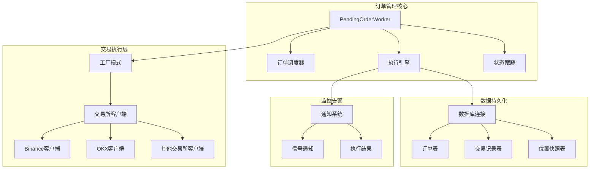

**图表来源**
- [pending_order_worker.py:1-2439](file://backend_api_python/app/services/pending_order_worker.py#L1-L2439)
- [factory.py:1-355](file://backend_api_python/app/services/live_trading/factory.py#L1-L355)

**章节来源**
- [pending_order_worker.py:1-2439](file://backend_api_python/app/services/pending_order_worker.py#L1-L2439)
- [factory.py:1-355](file://backend_api_python/app/services/live_trading/factory.py#L1-L355)

## 核心组件

### PendingOrderWorker 订单工作器

PendingOrderWorker 是整个订单管理系统的核心组件，负责订单的调度、执行和状态跟踪。

#### 主要职责

- **订单轮询**：定期检查待处理订单队列
- **订单执行**：根据订单类型和配置执行相应的交易操作
- **状态管理**：维护订单的完整生命周期状态
- **错误处理**：处理执行过程中的各种异常情况
- **通知发送**：向用户发送订单执行结果通知

#### 关键特性

- **批量处理**：支持批量获取和处理多个订单
- **并发安全**：使用线程锁确保多线程环境下的安全性
- **超时处理**：自动回收长时间处于处理状态的订单
- **位置同步**：定期与交易所对账，保持本地位置数据准确

**章节来源**
- [pending_order_worker.py:52-122](file://backend_api_python/app/services/pending_order_worker.py#L52-L122)
- [pending_order_worker.py:637-710](file://backend_api_python/app/services/pending_order_worker.py#L637-L710)

### 交易执行引擎

交易执行引擎负责将策略信号转换为实际的交易所订单，并处理订单的完整生命周期。

#### 执行流程

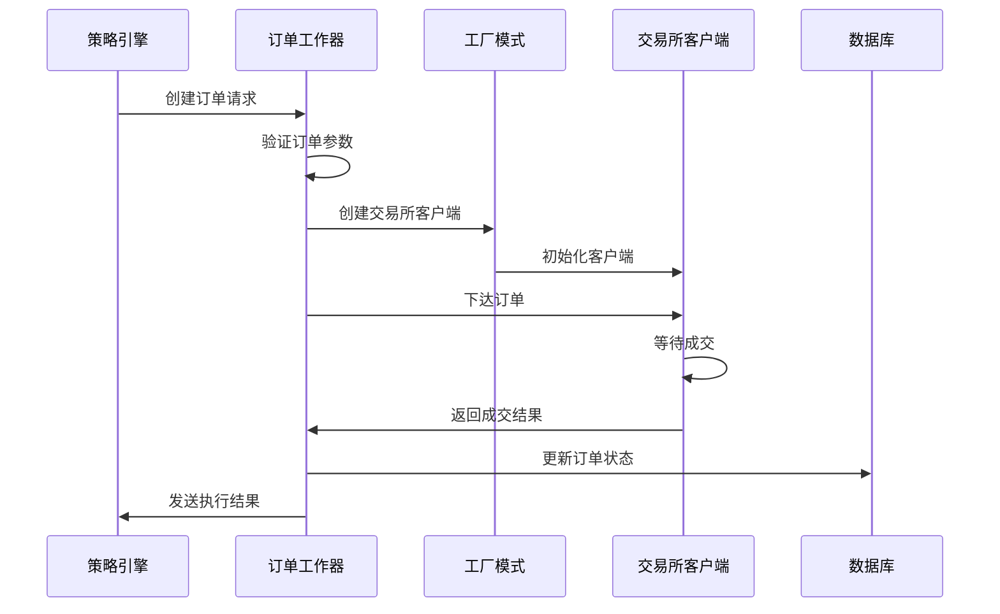

**图表来源**
- [execution.py:123-311](file://backend_api_python/app/services/live_trading/execution.py#L123-L311)
- [pending_order_worker.py:834-1022](file://backend_api_python/app/services/pending_order_worker.py#L834-L1022)

**章节来源**
- [execution.py:1-426](file://backend_api_python/app/services/live_trading/execution.py#L1-L426)
- [pending_order_worker.py:834-1022](file://backend_api_python/app/services/pending_order_worker.py#L834-L1022)

### 订单状态跟踪系统

系统实现了完整的订单状态跟踪机制，包括订单创建、执行、成交、完成等各个阶段的状态管理。

#### 状态流转图

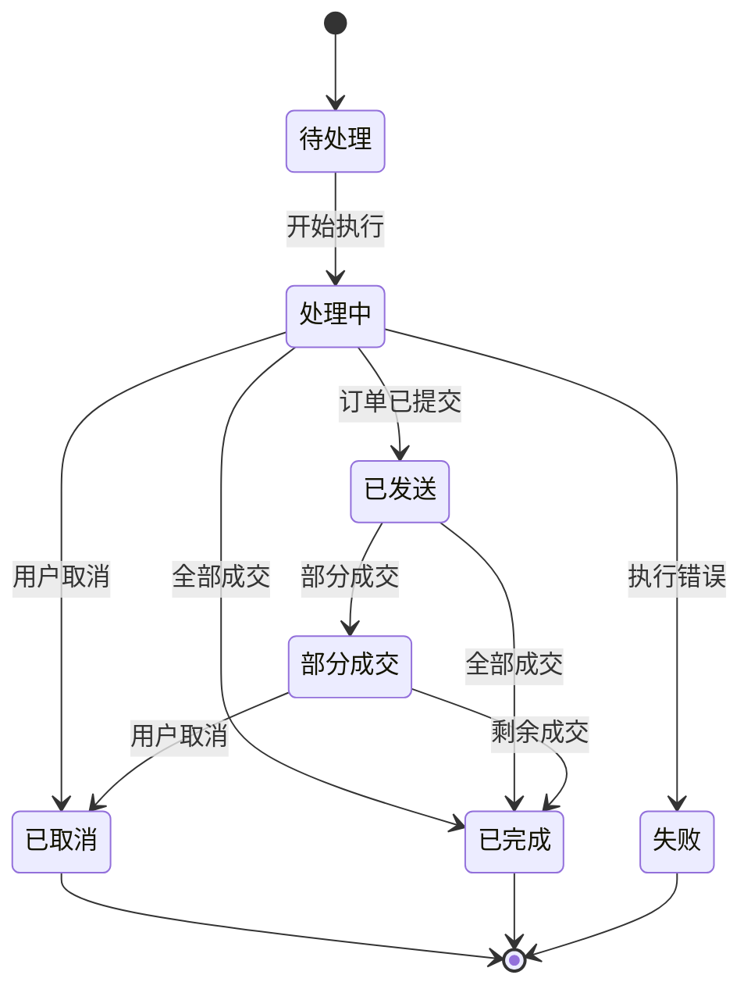

**图表来源**
- [pending_order_worker.py:2361-2438](file://backend_api_python/app/services/pending_order_worker.py#L2361-L2438)

**章节来源**
- [pending_order_worker.py:2361-2438](file://backend_api_python/app/services/pending_order_worker.py#L2361-L2438)

## 架构概览

系统采用分层架构设计，确保各组件之间的松耦合和高内聚。

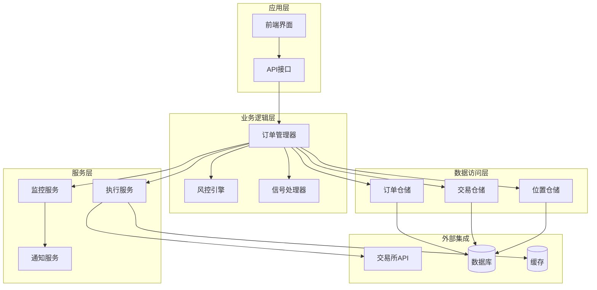

**图表来源**
- [pending_order_worker.py:1-2439](file://backend_api_python/app/services/pending_order_worker.py#L1-L2439)
- [execution.py:1-426](file://backend_api_python/app/services/live_trading/execution.py#L1-L426)

### 组件间交互流程

系统内部组件通过清晰的消息传递和事件驱动机制进行交互：

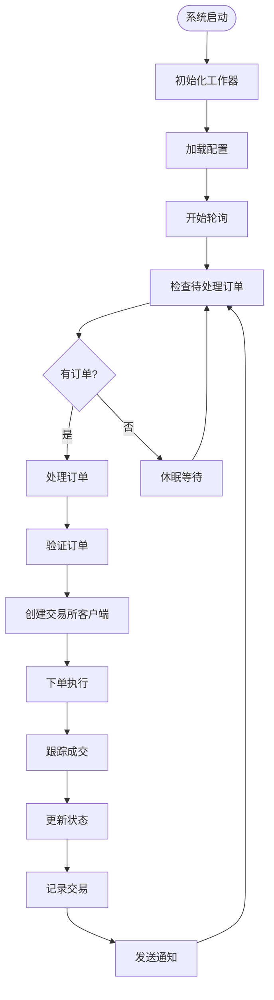

**图表来源**
- [pending_order_worker.py:91-122](file://backend_api_python/app/services/pending_order_worker.py#L91-L122)
- [pending_order_worker.py:107-121](file://backend_api_python/app/services/pending_order_worker.py#L107-L121)

**章节来源**
- [pending_order_worker.py:91-122](file://backend_api_python/app/services/pending_order_worker.py#L91-L122)
- [pending_order_worker.py:107-121](file://backend_api_python/app/services/pending_order_worker.py#L107-L121)

## 详细组件分析

### 订单生命周期管理

#### 订单创建阶段

订单创建阶段负责接收来自策略引擎的订单请求，并进行初步验证和预处理。

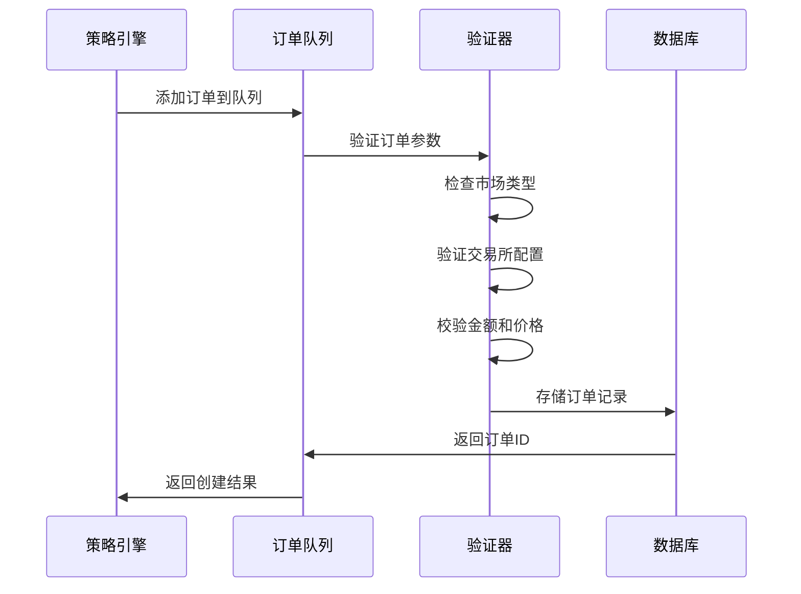

**图表来源**
- [pending_order_worker.py:637-683](file://backend_api_python/app/services/pending_order_worker.py#L637-L683)
- [pending_order_worker.py:834-920](file://backend_api_python/app/services/pending_order_worker.py#L834-L920)

#### 订单执行阶段

订单执行阶段是整个系统最核心的部分，负责与交易所进行实时交互。

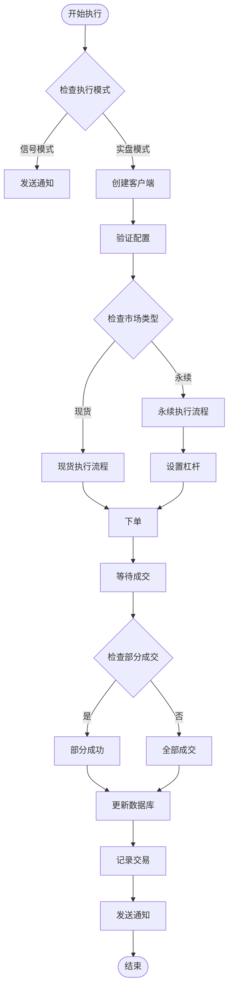

**图表来源**
- [pending_order_worker.py:1310-1681](file://backend_api_python/app/services/pending_order_worker.py#L1310-L1681)
- [pending_order_worker.py:1682-1976](file://backend_api_python/app/services/pending_order_worker.py#L1682-L1976)

**章节来源**
- [pending_order_worker.py:1310-1681](file://backend_api_python/app/services/pending_order_worker.py#L1310-L1681)
- [pending_order_worker.py:1682-1976](file://backend_api_python/app/services/pending_order_worker.py#L1682-L1976)

### 订单类型处理机制

系统支持多种订单类型的处理，每种订单类型都有其特定的处理逻辑和参数要求。

#### 市价单处理

市价单是最简单的订单类型，系统会直接以当前市场价格下单。

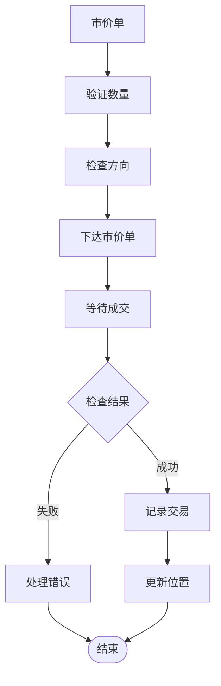

**图表来源**
- [execution.py:153-273](file://backend_api_python/app/services/live_trading/execution.py#L153-L273)
- [pending_order_worker.py:1682-1871](file://backend_api_python/app/services/pending_order_worker.py#L1682-L1871)

#### 限价单处理

限价单需要设置特定的价格，系统会在价格达到指定水平时自动成交。

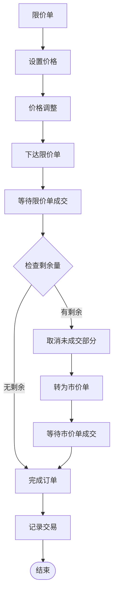

**图表来源**
- [pending_order_worker.py:1320-1681](file://backend_api_python/app/services/pending_order_worker.py#L1320-L1681)
- [pending_order_worker.py:1682-1976](file://backend_api_python/app/services/pending_order_worker.py#L1682-L1976)

**章节来源**
- [execution.py:153-273](file://backend_api_python/app/services/live_trading/execution.py#L153-L273)
- [pending_order_worker.py:1320-1681](file://backend_api_python/app/services/pending_order_worker.py#L1320-L1681)

### 订单取消、修改和重试机制

系统提供了完善的订单管理功能，包括取消、修改和自动重试机制。

#### 订单取消流程

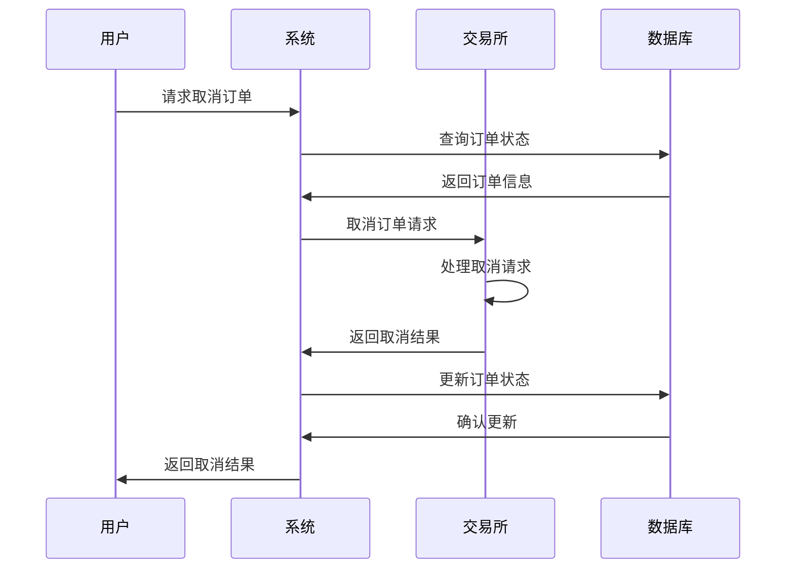

**图表来源**
- [pending_order_worker.py:1633-1669](file://backend_api_python/app/services/pending_order_worker.py#L1633-L1669)

#### 订单修改流程

系统支持对未成交订单进行修改，主要包括修改价格、数量等参数。

#### 自动重试机制

系统实现了智能的自动重试机制，能够在网络异常或交易所暂时不可用时自动重试。

**章节来源**
- [pending_order_worker.py:1633-1669](file://backend_api_python/app/services/pending_order_worker.py#L1633-L1669)

### 订单匹配算法和填充报告

系统实现了高效的订单匹配算法，并提供详细的填充报告功能。

#### 订单匹配算法

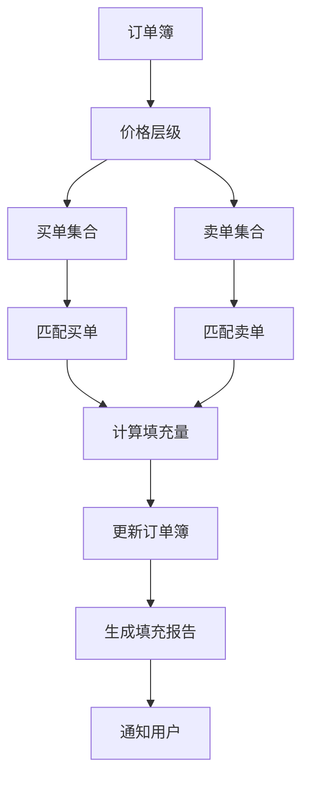

**图表来源**
- [pending_order_worker.py:1178-1216](file://backend_api_python/app/services/pending_order_worker.py#L1178-L1216)

#### 填充报告生成

系统能够生成详细的填充报告，包括成交时间、价格、数量、手续费等信息。

**章节来源**
- [pending_order_worker.py:1178-1216](file://backend_api_python/app/services/pending_order_worker.py#L1178-L1216)

### 执行确认处理流程

系统提供了完整的执行确认机制，确保订单执行的可靠性和可追溯性。

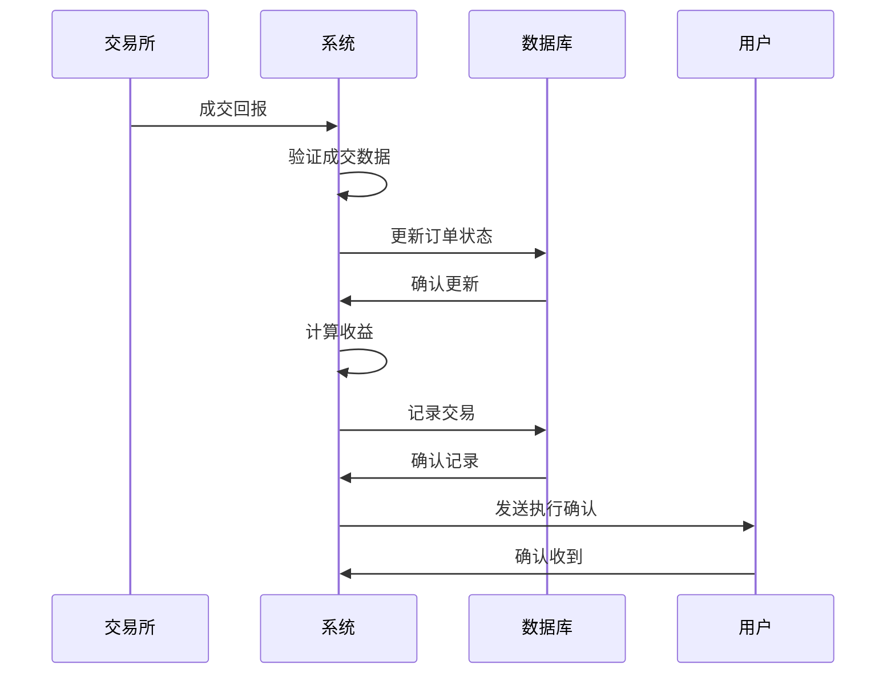

**图表来源**
- [pending_order_worker.py:2008-2068](file://backend_api_python/app/services/pending_order_worker.py#L2008-L2068)

**章节来源**
- [pending_order_worker.py:2008-2068](file://backend_api_python/app/services/pending_order_worker.py#L2008-L2068)

### 异常情况处理和恢复策略

系统针对订单执行过程中可能出现的各种异常情况提供了完善的处理和恢复策略。

#### 订单超时处理

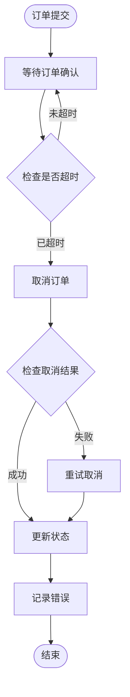

**图表来源**
- [pending_order_worker.py:1670-1681](file://backend_api_python/app/services/pending_order_worker.py#L1670-L1681)

#### 网络中断处理

系统实现了智能的网络中断检测和恢复机制，能够在网络恢复后自动重新执行被中断的订单。

#### 交易所异常处理

针对交易所API异常，系统提供了多重保护措施，包括重试机制、降级处理和错误上报。

**章节来源**
- [pending_order_worker.py:1670-1681](file://backend_api_python/app/services/pending_order_worker.py#L1670-L1681)

## 依赖关系分析

系统采用了清晰的依赖层次结构，确保各组件之间的松耦合。

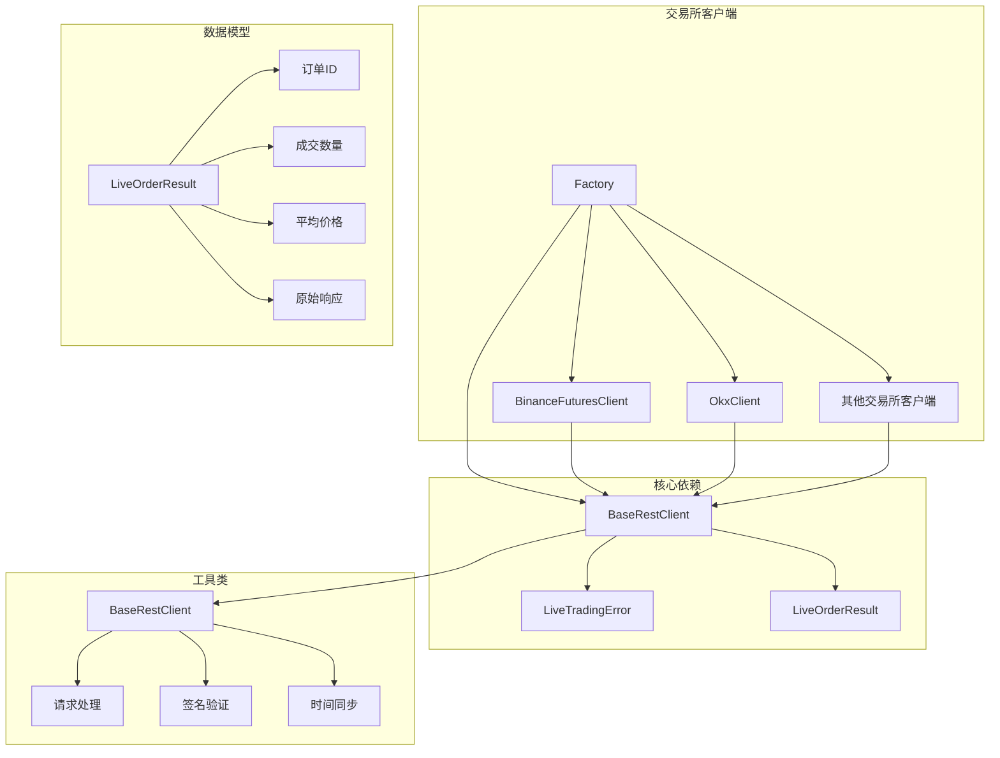

**图表来源**
- [base.py:82-158](file://backend_api_python/app/services/live_trading/base.py#L82-L158)
- [factory.py:59-218](file://backend_api_python/app/services/live_trading/factory.py#L59-L218)

### 外部依赖

系统对外部依赖进行了最小化设计，主要依赖包括：

- **requests**：HTTP请求库，用于与交易所API通信
- **decimal**：高精度数值计算库
- **json**：JSON数据处理
- **logging**：日志记录

**章节来源**
- [base.py:11-18](file://backend_api_python/app/services/live_trading/base.py#L11-L18)
- [factory.py:17-39](file://backend_api_python/app/services/live_trading/factory.py#L17-L39)

## 性能考虑

系统在设计时充分考虑了性能优化，采用了多种技术手段来提升系统的整体性能。

### 并发处理

系统使用多线程架构来处理多个订单的并发执行：

- **线程池管理**：合理控制并发线程数量
- **资源限制**：避免过度消耗系统资源
- **优雅降级**：在高负载情况下自动降级处理能力

### 缓存策略

系统实现了多层次的缓存机制：

- **交易所配置缓存**：减少重复的配置查询
- **订单簿缓存**：提高订单匹配效率
- **时间同步缓存**：减少与交易所的时间同步频率

### 网络优化

- **连接复用**：复用HTTP连接减少建立连接的开销
- **批量请求**：支持批量获取订单状态
- **异步处理**：非阻塞的网络请求处理

## 故障排除指南

### 常见问题诊断

#### 订单无法执行

**可能原因**：
- 交易所API密钥配置错误
- 账户余额不足
- 交易所维护或网络中断
- 订单参数不符合交易所要求

**解决步骤**：
1. 检查交易所API配置
2. 验证账户资金状况
3. 确认交易所服务状态
4. 校验订单参数格式

#### 订单部分成交

**可能原因**：
- 市场流动性不足
- 价格波动超出预期
- 交易所订单簿深度不够

**处理建议**：
- 调整订单大小
- 设置更合理的止损止盈
- 选择流动性更好的交易对

#### 订单超时

**处理方法**：
- 检查网络连接稳定性
- 调整超时参数设置
- 实施订单重试机制

### 日志分析

系统提供了详细的日志记录功能，便于问题诊断和性能分析：

- **执行日志**：记录订单执行的完整过程
- **错误日志**：详细记录错误信息和堆栈跟踪
- **性能日志**：监控系统性能指标
- **调试日志**：提供详细的调试信息

**章节来源**
- [pending_order_worker.py:95-97](file://backend_api_python/app/services/pending_order_worker.py#L95-L97)
- [base.py:128-136](file://backend_api_python/app/services/live_trading/base.py#L128-L136)

## 结论

QuantDinger 订单管理系统是一个功能完善、架构清晰的量化交易基础设施。系统通过模块化的设计和完善的异常处理机制，为用户提供了一个稳定可靠的订单管理解决方案。

### 主要优势

1. **全面的订单支持**：支持多种订单类型和交易所
2. **强大的扩展性**：模块化设计便于功能扩展
3. **完善的监控**：提供全面的订单状态跟踪和日志记录
4. **健壮的异常处理**：针对各种异常情况提供恢复机制
5. **高性能设计**：优化的并发处理和缓存策略

### 技术特色

- **实时执行**：通过直接REST API实现低延迟的订单执行
- **智能匹配**：高效的订单匹配算法和填充报告
- **风险控制**：内置的杠杆管理和仓位控制机制
- **多交易所支持**：统一的接口适配多家交易所

该系统为量化交易策略的实施提供了坚实的技术基础，能够满足专业交易者对订单管理的各种需求。