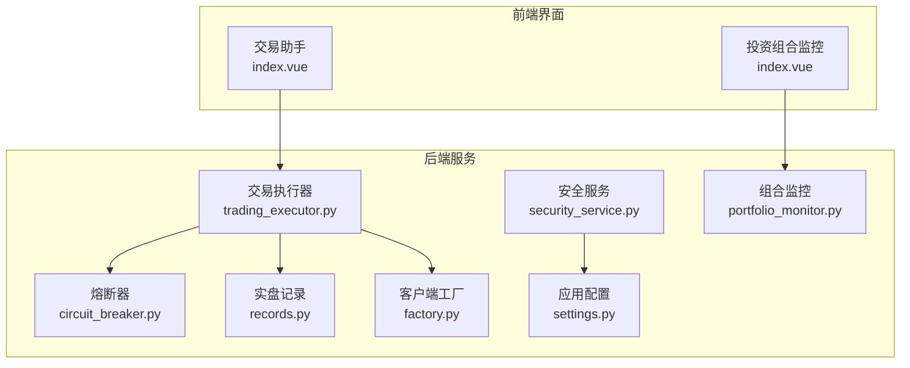
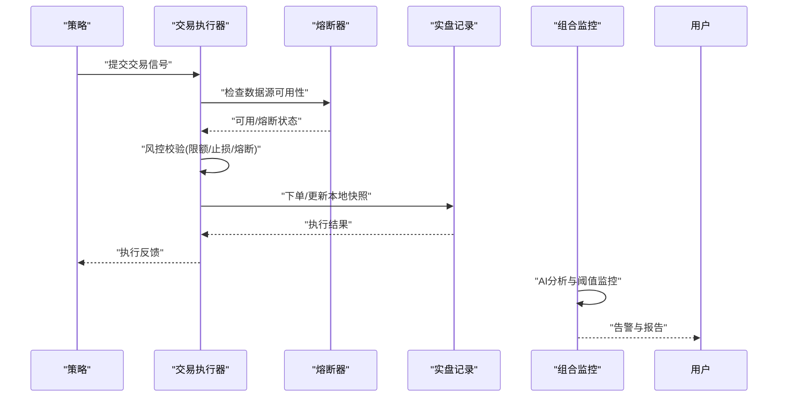
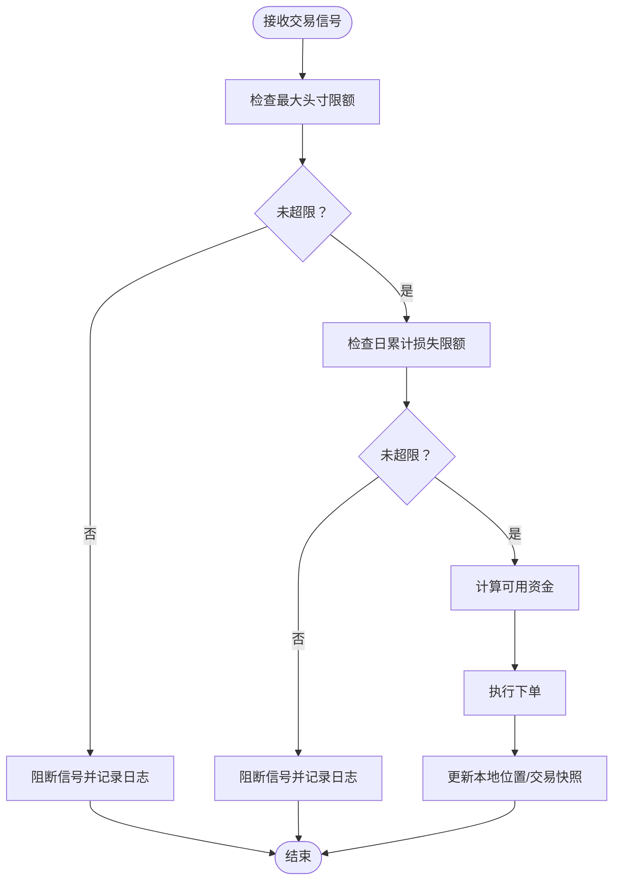
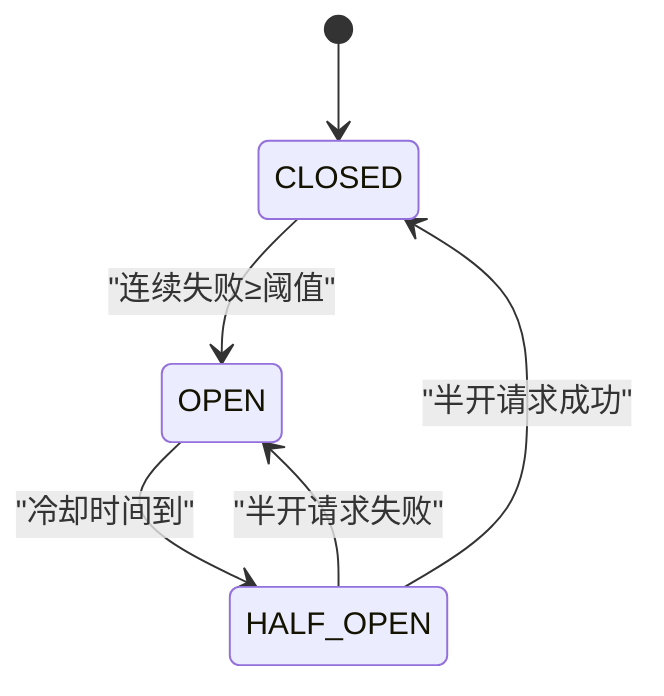
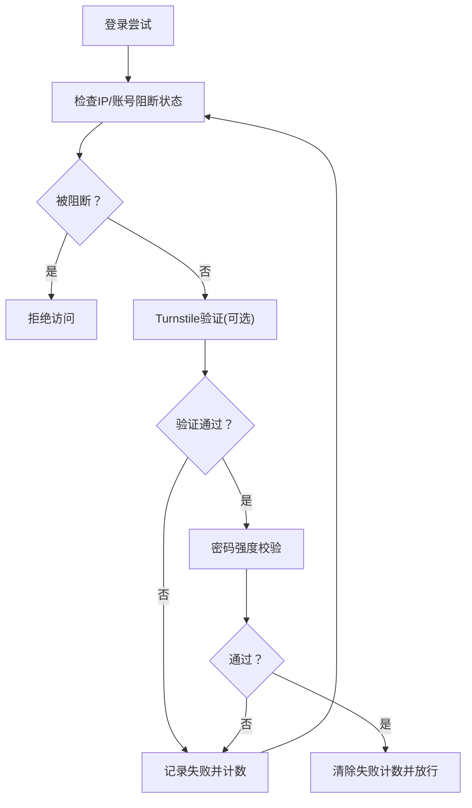
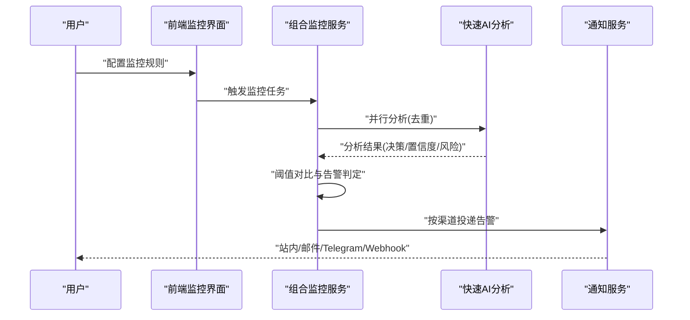
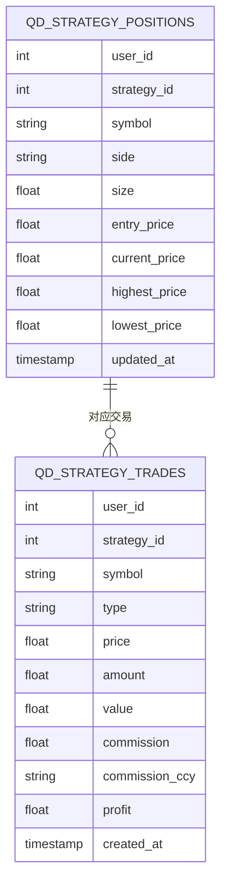
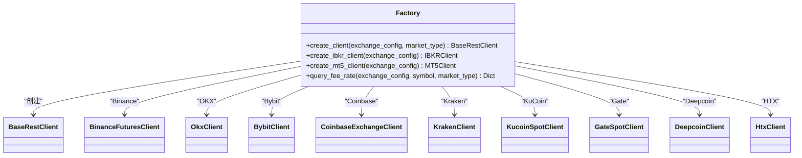
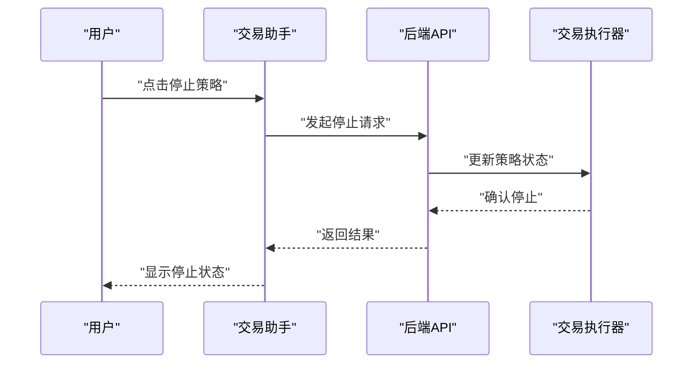
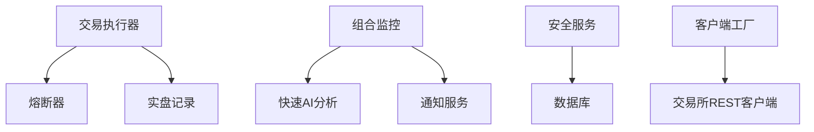

# 风控控制系统

<cite>
**本文档引用的文件**
- [trading_executor.py](file://backend_api_python/app/services/trading_executor.py)
- [circuit_breaker.py](file://backend_api_python/app/data_sources/circuit_breaker.py)
- [security_service.py](file://backend_api_python/app/services/security_service.py)
- [portfolio_monitor.py](file://backend_api_python/app/services/portfolio_monitor.py)
- [records.py](file://backend_api_python/app/services/live_trading/records.py)
- [factory.py](file://backend_api_python/app/services/live_trading/factory.py)
- [settings.py](file://backend_api_python/app/config/settings.py)
- [index.vue](file://frontend/src/views/trading-assistant/index.vue)
- [index.vue](file://frontend/src/views/portfolio/index.vue)
</cite>

## 目录
1. [简介](#简介)
2. [项目结构](#项目结构)
3. [核心组件](#核心组件)
4. [架构总览](#架构总览)
5. [详细组件分析](#详细组件分析)
6. [依赖关系分析](#依赖关系分析)
7. [性能考虑](#性能考虑)
8. [故障排查指南](#故障排查指南)
9. [结论](#结论)

## 简介
本文件面向量化交易系统的风控控制体系，系统性梳理交易执行过程中的各类风控机制与监控能力，覆盖单笔/日累计限额、连续失败保护、熔断机制、暂停与紧急停止、实时监控、异常检测与自动防护、人工干预通道、风险评估与压力测试等。文档以代码为依据，结合可视化图示帮助读者快速理解系统设计与实现要点。

## 项目结构
风控相关代码主要分布在后端Python服务层与前端监控界面中：
- 后端核心执行与风控：交易执行器、实时行情熔断器、安全服务、组合监控、实盘记录与客户端工厂
- 前端监控与交互：交易助手面板、投资组合监控界面

**图表来源**
- [trading_executor.py](file://backend_api_python/app/services/trading_executor.py)
- [circuit_breaker.py](file://backend_api_python/app/data_sources/circuit_breaker.py)
- [security_service.py](file://backend_api_python/app/services/security_service.py)
- [portfolio_monitor.py](file://backend_api_python/app/services/portfolio_monitor.py)
- [records.py](file://backend_api_python/app/services/live_trading/records.py)
- [factory.py](file://backend_api_python/app/services/live_trading/factory.py)
- [settings.py](file://backend_api_python/app/config/settings.py)
- [index.vue](file://frontend/src/views/trading-assistant/index.vue)
- [index.vue](file://frontend/src/views/portfolio/index.vue)

**章节来源**
- [trading_executor.py](file://backend_api_python/app/services/trading_executor.py)
- [circuit_breaker.py](file://backend_api_python/app/data_sources/circuit_breaker.py)
- [security_service.py](file://backend_api_python/app/services/security_service.py)
- [portfolio_monitor.py](file://backend_api_python/app/services/portfolio_monitor.py)
- [records.py](file://backend_api_python/app/services/live_trading/records.py)
- [factory.py](file://backend_api_python/app/services/live_trading/factory.py)
- [settings.py](file://backend_api_python/app/config/settings.py)
- [index.vue](file://frontend/src/views/trading-assistant/index.vue)
- [index.vue](file://frontend/src/views/portfolio/index.vue)

## 核心组件
- 交易执行器：负责信号过滤、风控校验、下单执行与本地快照更新
- 实时行情熔断器：对数据源进行熔断/冷却管理，避免连续失败放大系统风险
- 安全服务：登录/验证码限流、暴力破解防护、安全审计
- 组合监控：基于AI分析的实时监控与告警，支持价格/盈亏阈值提醒
- 实盘记录：本地位置与交易记录的标准化与持久化
- 客户端工厂：按交易所类型创建REST客户端，统一接入点
- 应用配置：集中式配置加载与功能开关

**章节来源**
- [trading_executor.py](file://backend_api_python/app/services/trading_executor.py)
- [circuit_breaker.py](file://backend_api_python/app/data_sources/circuit_breaker.py)
- [security_service.py](file://backend_api_python/app/services/security_service.py)
- [portfolio_monitor.py](file://backend_api_python/app/services/portfolio_monitor.py)
- [records.py](file://backend_api_python/app/services/live_trading/records.py)
- [factory.py](file://backend_api_python/app/services/live_trading/factory.py)
- [settings.py](file://backend_api_python/app/config/settings.py)

## 架构总览
风控系统围绕“信号-风控-执行-记录-监控”闭环构建，关键节点包括：
- 信号入口：策略产生交易信号
- 风控校验：限额、止损止盈、熔断、失败保护、暂停/停止
- 执行与记录：下单、本地位置/交易快照
- 监控与告警：价格/盈亏阈值、通知渠道
- 安全与审计：登录/验证码限流、暴力破解防护

**图表来源**
- [trading_executor.py](file://backend_api_python/app/services/trading_executor.py)
- [circuit_breaker.py](file://backend_api_python/app/data_sources/circuit_breaker.py)
- [records.py](file://backend_api_python/app/services/live_trading/records.py)
- [portfolio_monitor.py](file://backend_api_python/app/services/portfolio_monitor.py)

## 详细组件分析

### 交易执行器与风控校验
交易执行器在下单前执行多维度风控校验，包括：
- 最大单笔头寸限额：基于当前头寸价值与配置阈值比较，超过即阻断
- 日累计损失限额：基于当日已实现/未实现损益，超过即阻断新开仓/加仓
- 可用资金计算：结合初始资本、已有头寸与保证金占用，动态计算可下单金额
- 本地位置校验：针对平仓量与实际持有量进行比对，防止超平

**图表来源**
- [trading_executor.py](file://backend_api_python/app/services/trading_executor.py)

**章节来源**
- [trading_executor.py](file://backend_api_python/app/services/trading_executor.py)

### 实时行情熔断机制
系统采用熔断器模式管理数据源可用性，状态包括：
- CLOSED：正常
- OPEN：熔断（冷却中）
- HALF_OPEN：半开（试探性请求）

策略要点：
- 连续失败达到阈值后进入熔断
- 冷却时间到达后进入半开，允许单次试探
- 半开成功则完全恢复，失败则继续熔断
- 提供全局熔断器实例与状态查询/重置接口

**图表来源**
- [circuit_breaker.py](file://backend_api_python/app/data_sources/circuit_breaker.py)

**章节来源**
- [circuit_breaker.py](file://backend_api_python/app/data_sources/circuit_breaker.py)

### 安全服务与暴力破解防护
安全服务提供以下能力：
- 登录尝试记录与阻断：按IP/账号统计失败次数，超过阈值进入阻断期
- 验证码发送限流：按邮箱/IP维度限制发送频率与小时配额
- Turnstile人机验证：可选启用，通过Cloudflare验证
- 密码强度校验：长度与字符集要求
- 安全审计日志：记录关键安全事件

**图表来源**
- [security_service.py](file://backend_api_python/app/services/security_service.py)

**章节来源**
- [security_service.py](file://backend_api_python/app/services/security_service.py)

### 组合监控与实时告警
组合监控通过并行AI分析对持仓进行实时评估，支持：
- 价格突破/跌破阈值告警
- 盈亏百分比目标/止损告警
- 多语言消息模板与多渠道投递（浏览器/邮件/Telegram/Webhook）
- 基于用户设置的渠道合并与可达性保障

**图表来源**
- [portfolio_monitor.py](file://backend_api_python/app/services/portfolio_monitor.py)

**章节来源**
- [portfolio_monitor.py](file://backend_api_python/app/services/portfolio_monitor.py)
- [index.vue](file://frontend/src/views/portfolio/index.vue)

### 实盘记录与位置管理
实盘记录负责本地位置与交易的标准化存储，关键点：
- 符号规范化：统一BTC/USDT等格式，避免查找失败
- 位置UPSERT：按策略+符号+方向维护最新头寸
- 成交应用：根据开仓/平仓/增减仓更新头寸与最高/最低价格
- 交易记录：记录成交价格、数量、手续费、利润等

**图表来源**
- [records.py](file://backend_api_python/app/services/live_trading/records.py)

**章节来源**
- [records.py](file://backend_api_python/app/services/live_trading/records.py)

### 客户端工厂与多交易所接入
客户端工厂按交易所ID创建对应的REST客户端，支持：
- 加密货币交易所：Binance、OKX、Bybit、Coinbase、Kraken、KuCoin、Gate、Deepcoin、HTX等
- 传统券商：Interactive Brokers（IBKR）美股
- 外汇平台：MetaTrader 5（MT5）外汇

**图表来源**
- [factory.py](file://backend_api_python/app/services/live_trading/factory.py)

**章节来源**
- [factory.py](file://backend_api_python/app/services/live_trading/factory.py)

### 前端交互与人工干预
前端提供交易助手与投资组合监控界面，支持：
- 交易助手：运行中策略一键暂停/停止
- 投资组合监控：选择通知渠道、监控范围、启用/禁用监控

**图表来源**
- [index.vue](file://frontend/src/views/trading-assistant/index.vue)

**章节来源**
- [index.vue](file://frontend/src/views/trading-assistant/index.vue)
- [index.vue](file://frontend/src/views/portfolio/index.vue)

## 依赖关系分析
- 交易执行器依赖熔断器进行数据源可用性判断，依赖实盘记录进行本地快照维护
- 组合监控依赖快速AI分析服务与通知服务
- 安全服务依赖数据库记录登录尝试与验证码发送历史
- 客户端工厂为交易执行器提供统一的交易所接入点

**图表来源**
- [trading_executor.py](file://backend_api_python/app/services/trading_executor.py)
- [circuit_breaker.py](file://backend_api_python/app/data_sources/circuit_breaker.py)
- [records.py](file://backend_api_python/app/services/live_trading/records.py)
- [portfolio_monitor.py](file://backend_api_python/app/services/portfolio_monitor.py)
- [security_service.py](file://backend_api_python/app/services/security_service.py)
- [factory.py](file://backend_api_python/app/services/live_trading/factory.py)

**章节来源**
- [trading_executor.py](file://backend_api_python/app/services/trading_executor.py)
- [circuit_breaker.py](file://backend_api_python/app/data_sources/circuit_breaker.py)
- [records.py](file://backend_api_python/app/services/live_trading/records.py)
- [portfolio_monitor.py](file://backend_api_python/app/services/portfolio_monitor.py)
- [security_service.py](file://backend_api_python/app/services/security_service.py)
- [factory.py](file://backend_api_python/app/services/live_trading/factory.py)

## 性能考虑
- 并行分析：组合监控使用线程池对重复标的进行去重分析，减少LLM调用与冗余报告
- 本地缓存：交易执行器内置轻量级价格缓存与信号去重，降低重复下单与查询压力
- 熔断冷却：熔断器冷却时间避免雪崩式重试，保护上游数据源
- 数据库写入节流：策略日志心跳节流，避免高频写入UI日志表

[本节为通用指导，无需特定文件引用]

## 故障排查指南
- 熔断器状态查询：通过熔断器状态接口查看各数据源失败次数与最后错误
- 登录失败阻断：检查IP/账号失败计数与阻断剩余时间
- 验证码发送限制：确认邮箱/IP维度的发送频率与小时配额
- 交易阻断排查：查看策略日志中关于最大头寸/日累计损失的阻断记录
- 位置与交易记录：核对本地位置与交易表的符号规范化与UPSERT逻辑

**章节来源**
- [circuit_breaker.py](file://backend_api_python/app/data_sources/circuit_breaker.py)
- [security_service.py](file://backend_api_python/app/services/security_service.py)
- [trading_executor.py](file://backend_api_python/app/services/trading_executor.py)
- [records.py](file://backend_api_python/app/services/live_trading/records.py)

## 结论
本风控控制系统通过“信号-风控-执行-记录-监控-安全”的闭环设计，实现了从限额、熔断、失败保护到实时监控与人工干预的全链路风险管控。系统具备良好的扩展性与可维护性，既可通过配置调整风控参数，又能在异常情况下快速人工介入，满足生产环境对稳定性与安全性的高要求。