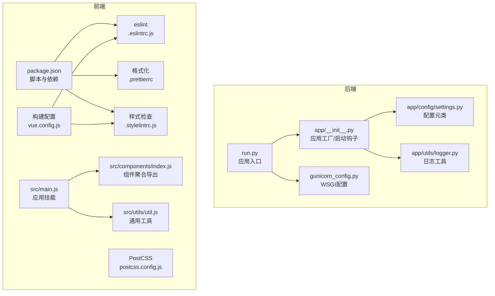
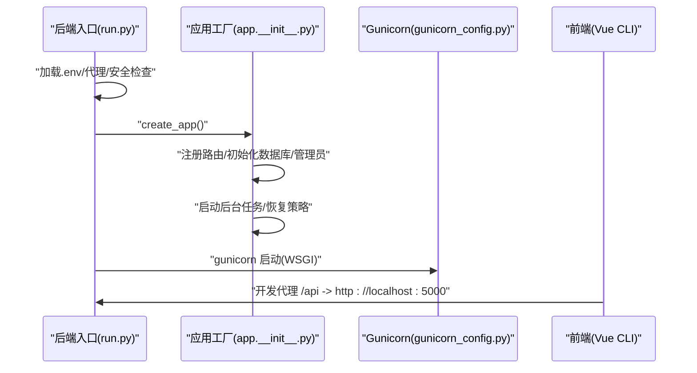
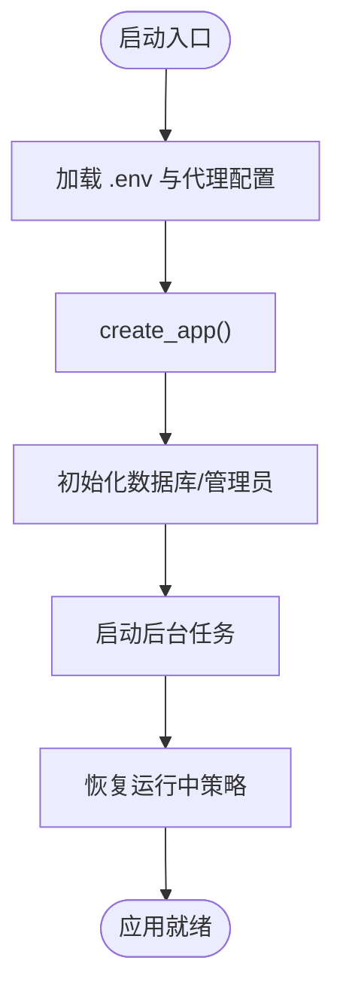
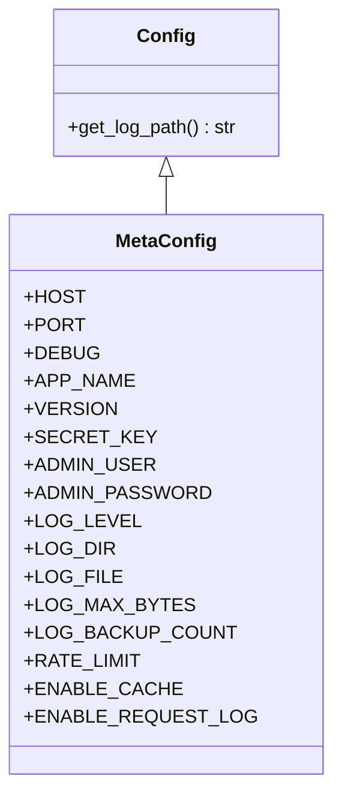
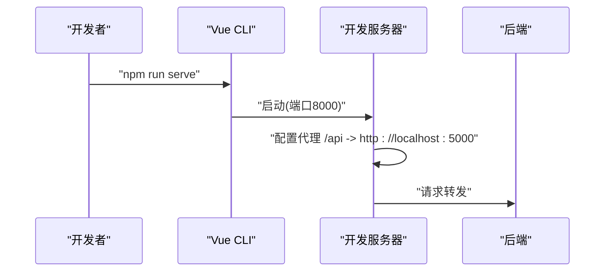
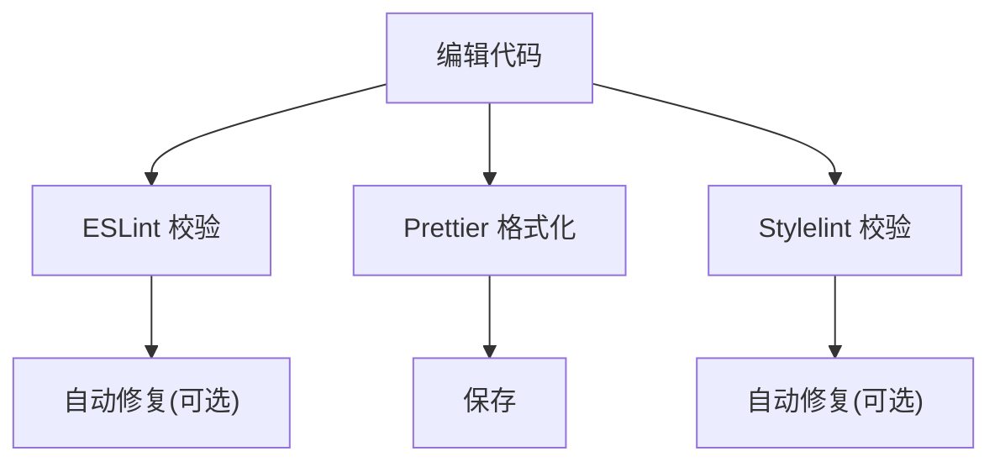
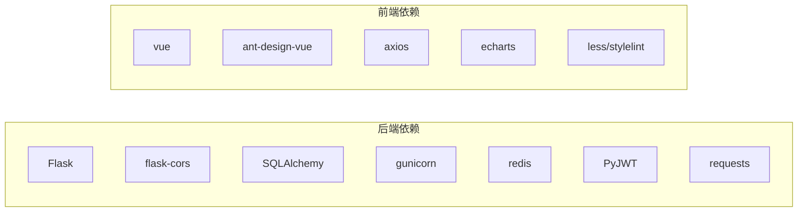

# 代码规范

<cite>
**本文引用的文件**
- [run.py](file://backend_api_python/run.py)
- [gunicorn_config.py](file://backend_api_python/gunicorn_config.py)
- [app/__init__.py](file://backend_api_python/app/__init__.py)
- [settings.py](file://backend_api_python/app/config/settings.py)
- [logger.py](file://backend_api_python/app/utils/logger.py)
- [package.json](file://frontend/package.json)
- [.eslintrc.js](file://frontend/.eslintrc.js)
- [.prettierrc](file://frontend/.prettierrc)
- [.stylelintrc.js](file://frontend/.stylelintrc.js)
- [vue.config.js](file://frontend/vue.config.js)
- [postcss.config.js](file://frontend/postcss.config.js)
- [src/main.js](file://frontend/src/main.js)
- [src/components/index.js](file://frontend/src/components/index.js)
- [src/utils/util.js](file://frontend/src/utils/util.js)
- [.gitignore](file://backend_api_python/.gitignore)
</cite>

## 目录
1. [简介](#简介)
2. [项目结构](#项目结构)
3. [核心组件](#核心组件)
4. [架构总览](#架构总览)
5. [详细组件分析](#详细组件分析)
6. [依赖分析](#依赖分析)
7. [性能考虑](#性能考虑)
8. [故障排查指南](#故障排查指南)
9. [结论](#结论)
10. [附录](#附录)

## 简介
本文件为 QuantDinger 的统一代码规范文档，面向后端 Python 与前端 JavaScript/Vue 团队，明确风格标准、命名约定、注释规范、导入组织、文件结构要求，并提供 IDE 配置建议、代码格式化与自动化检查配置指引，以及代码审查重点与最佳实践。目标是提升代码一致性、可维护性与协作效率。

## 项目结构
- 后端采用 Flask 应用工厂模式，入口脚本负责加载环境变量、代理配置与应用实例创建；生产通过 Gunicorn 托管。
- 前端基于 Vue 2 + Ant Design Vue 生态，使用 Vue CLI 构建，ESLint + Stylelint + Prettier 统一格式化与质量检查。
- 日志与配置通过环境变量驱动，支持多环境部署与功能开关。

图表来源
- [run.py:1-134](file://backend_api_python/run.py#L1-L134)
- [gunicorn_config.py:1-36](file://backend_api_python/gunicorn_config.py#L1-L36)
- [app/__init__.py:1-288](file://backend_api_python/app/__init__.py#L1-L288)
- [settings.py:1-99](file://backend_api_python/app/config/settings.py#L1-L99)
- [logger.py:1-63](file://backend_api_python/app/utils/logger.py#L1-L63)
- [package.json:1-85](file://frontend/package.json#L1-L85)
- [.eslintrc.js:1-76](file://frontend/.eslintrc.js#L1-L76)
- [.prettierrc:1-7](file://frontend/.prettierrc#L1-L7)
- [.stylelintrc.js:1-103](file://frontend/.stylelintrc.js#L1-L103)
- [vue.config.js:1-166](file://frontend/vue.config.js#L1-L166)
- [postcss.config.js:1-6](file://frontend/postcss.config.js#L1-L6)
- [src/main.js:1-59](file://frontend/src/main.js#L1-L59)
- [src/components/index.js:1-57](file://frontend/src/components/index.js#L1-L57)
- [src/utils/util.js:1-96](file://frontend/src/utils/util.js#L1-L96)

章节来源
- [run.py:1-134](file://backend_api_python/run.py#L1-L134)
- [gunicorn_config.py:1-36](file://backend_api_python/gunicorn_config.py#L1-L36)
- [app/__init__.py:1-288](file://backend_api_python/app/__init__.py#L1-L288)
- [settings.py:1-99](file://backend_api_python/app/config/settings.py#L1-L99)
- [logger.py:1-63](file://backend_api_python/app/utils/logger.py#L1-L63)
- [package.json:1-85](file://frontend/package.json#L1-L85)
- [.eslintrc.js:1-76](file://frontend/.eslintrc.js#L1-L76)
- [.prettierrc:1-7](file://frontend/.prettierrc#L1-L7)
- [.stylelintrc.js:1-103](file://frontend/.stylelintrc.js#L1-L103)
- [vue.config.js:1-166](file://frontend/vue.config.js#L1-L166)
- [postcss.config.js:1-6](file://frontend/postcss.config.js#L1-L6)
- [src/main.js:1-59](file://frontend/src/main.js#L1-L59)
- [src/components/index.js:1-57](file://frontend/src/components/index.js#L1-L57)
- [src/utils/util.js:1-96](file://frontend/src/utils/util.js#L1-L96)

## 核心组件
- 后端应用工厂与启动流程：应用工厂负责注册路由、初始化数据库与管理员用户、启动后台任务与恢复运行中的策略；入口脚本负责加载 .env、设置代理、打印安全提示与启动开发服务器。
- 前端应用入口与构建配置：入口文件挂载全局组件、权限与国际化，构建配置定义别名、SVG 处理、CDN 外链、LESS 主题变量与开发代理等。
- 日志与配置：日志按模块分级过滤并落盘；配置通过元类读取环境变量，支持扩展配置加载。

章节来源
- [app/__init__.py:213-288](file://backend_api_python/app/__init__.py#L213-L288)
- [run.py:104-134](file://backend_api_python/run.py#L104-L134)
- [vue.config.js:52-161](file://frontend/vue.config.js#L52-L161)
- [logger.py:9-63](file://backend_api_python/app/utils/logger.py#L9-L63)
- [settings.py:66-99](file://backend_api_python/app/config/settings.py#L66-L99)

## 架构总览
后端以 Flask 工厂函数创建应用，注册路由与 Swagger 文档，启动多个后台工作线程（订单处理、组合监控、USDT 支付、Polymarket 分析、AI 校准与反思），并在启动时尝试恢复运行中的策略。前端通过 Vue CLI 构建，开发时通过本地代理转发到后端 API，生产构建注入版本信息与 Git 版本。

图表来源
- [run.py:104-134](file://backend_api_python/run.py#L104-L134)
- [app/__init__.py:213-288](file://backend_api_python/app/__init__.py#L213-L288)
- [gunicorn_config.py:10-36](file://backend_api_python/gunicorn_config.py#L10-L36)
- [vue.config.js:136-148](file://frontend/vue.config.js#L136-L148)

## 详细组件分析

### 后端：应用工厂与启动流程
- 应用工厂职责
  - 注册路由与 Flasgger 文档
  - 初始化数据库与管理员账户
  - 启动后台任务：待处理订单、组合监控、USDT 订单、Polymarket 分析、AI 校准与反思
  - 启动时恢复运行中的策略（仅支持部分类型）
- 入口脚本职责
  - 加载 .env 并回退到仓库根目录 .env
  - 设置代理与 NO_PROXY 白名单（规避国内金融数据源绕路）
  - 安全检查：生产环境必须替换默认 SECRET_KEY
  - 启动开发服务器（仅用于本地）

图表来源
- [run.py:17-91](file://backend_api_python/run.py#L17-L91)
- [app/__init__.py:253-287](file://backend_api_python/app/__init__.py#L253-L287)

章节来源
- [run.py:17-134](file://backend_api_python/run.py#L17-L134)
- [app/__init__.py:78-211](file://backend_api_python/app/__init__.py#L78-L211)

### 后端：日志与配置
- 日志
  - 全局基础配置与文件滚动日志
  - 按模块过滤（如 werkzeug、kline、USDT 对账、计费）
- 配置
  - 通过元类读取环境变量，支持扩展配置加载
  - 提供日志路径拼接方法

图表来源
- [settings.py:66-99](file://backend_api_python/app/config/settings.py#L66-L99)

章节来源
- [logger.py:9-63](file://backend_api_python/app/utils/logger.py#L9-L63)
- [settings.py:66-99](file://backend_api_python/app/config/settings.py#L66-L99)

### 前端：构建与开发配置
- 构建配置
  - 别名与 SVG 处理（区分内联与常规 SVG）
  - LESS 主题变量与 Ant Design 样式定制
  - 开发代理将 /api 转发至后端
  - 生产注入版本、Git 哈希与构建时间
- 应用入口
  - 挂载全局组件、权限、国际化与全局样式
  - 屏蔽 ResizeObserver 循环错误噪声

图表来源
- [vue.config.js:136-148](file://frontend/vue.config.js#L136-L148)
- [src/main.js:28-40](file://frontend/src/main.js#L28-L40)

章节来源
- [vue.config.js:52-161](file://frontend/vue.config.js#L52-L161)
- [src/main.js:1-59](file://frontend/src/main.js#L1-L59)

### 前端：代码质量与格式化
- ESLint
  - 扩展标准与 Vue 强制推荐规则
  - 控制台与调试器规则按环境切换
  - 属性换行、引号、分号、缩进等规则
- Prettier
  - 行宽、分号、单引号、函数括号空格
- Stylelint
  - 标准与 CSS Modules 配置，属性顺序、缩进、嵌套深度、ID 数量限制等

图表来源
- [.eslintrc.js:1-76](file://frontend/.eslintrc.js#L1-L76)
- [.prettierrc:1-7](file://frontend/.prettierrc#L1-L7)
- [.stylelintrc.js:1-103](file://frontend/.stylelintrc.js#L1-L103)

章节来源
- [.eslintrc.js:1-76](file://frontend/.eslintrc.js#L1-L76)
- [.prettierrc:1-7](file://frontend/.prettierrc#L1-L7)
- [.stylelintrc.js:1-103](file://frontend/.stylelintrc.js#L1-L103)

### 前端：组件与工具组织
- 组件聚合导出：集中管理图表与业务组件，统一对外接口
- 通用工具：滚动方向检测、密码强度评分、IE 判断、页面尺寸事件触发等

章节来源
- [src/components/index.js:1-57](file://frontend/src/components/index.js#L1-L57)
- [src/utils/util.js:1-96](file://frontend/src/utils/util.js#L1-L96)

## 依赖分析
- 后端
  - Flask + CORS + Flasgger + SQLAlchemy + gunicorn + redis + bcrypt + ib_insync + MetaTrader5 等
  - 通过 requirements.txt 管理
- 前端
  - Vue 2 + Ant Design Vue + Axios + ECharts + Moment + Less + Stylelint 等
  - 通过 package.json 管理

图表来源
- [requirements.txt:1-40](file://backend_api_python/requirements.txt#L1-L40)
- [package.json:15-84](file://frontend/package.json#L15-L84)

章节来源
- [requirements.txt:1-40](file://backend_api_python/requirements.txt#L1-L40)
- [package.json:15-84](file://frontend/package.json#L15-L84)

## 性能考虑
- 后端
  - 使用 gthread 工作线程模型，提高并发 I/O；根据 CPU 核心数调整 workers 与 threads
  - 请求行与字段限制合理，避免过大请求导致资源占用
- 前端
  - 生产可启用 CDN 外链减少包体（已预留配置）
  - SVG 处理优化与 LESS 编译缓存
  - 关闭生产 Source Map 降低体积

章节来源
- [gunicorn_config.py:10-36](file://backend_api_python/gunicorn_config.py#L10-L36)
- [vue.config.js:112-118](file://frontend/vue.config.js#L112-L118)
- [vue.config.js:150-155](file://frontend/vue.config.js#L150-L155)

## 故障排查指南
- 后端
  - 日志级别与模块过滤：werkzeug、kline、USDT 对账、计费模块单独配置
  - 文件滚动日志：10MB 限制，保留 5 份备份
  - 启动恢复策略失败：会记录警告并尝试将策略状态置为 stopped，避免僵尸状态
- 前端
  - 开发代理超时：适当增大代理与请求超时时间
  - ResizeObserver 循环错误：入口已屏蔽该类错误，不影响功能

章节来源
- [logger.py:9-63](file://backend_api_python/app/utils/logger.py#L9-L63)
- [app/__init__.py:195-210](file://backend_api_python/app/__init__.py#L195-L210)
- [vue.config.js:136-148](file://frontend/vue.config.js#L136-L148)
- [src/main.js:28-40](file://frontend/src/main.js#L28-L40)

## 结论
本规范明确了后端与前端的风格、质量与工程化标准，结合现有配置文件与代码实现，形成可执行的落地方案。建议团队在 PR 审查中重点检查：命名一致性、注释完整性、导入顺序与模块边界、日志与错误处理、格式化与静态检查通过情况、以及跨端兼容性与性能影响。

## 附录

### Python 后端代码规范要点
- 命名约定
  - 模块与包：小写下划线
  - 类：大驼峰；常量：全大写+下划线；函数/变量：小写下划线
  - 私有成员：前缀下划线
- 注释与文档
  - 模块与公共类/函数需含 docstring
  - 复杂逻辑添加行内注释说明
- 导入组织
  - 标准库 → 第三方库 → 项目内部模块（分组空行）
  - 避免相对导入，使用绝对导入
- 文件结构
  - routes/services/utils 按职责分层，避免循环依赖
  - 配置通过环境变量与元类读取，必要时支持扩展配置文件
- 错误处理
  - 明确捕获异常范围，记录上下文与堆栈
  - 启动阶段失败不中断进程，记录警告
- 安全
  - 生产环境必须替换默认 SECRET_KEY
  - 代理配置仅对必要域名生效，国内金融数据源绕过代理

章节来源
- [run.py:109-120](file://backend_api_python/run.py#L109-L120)
- [app/__init__.py:205-210](file://backend_api_python/app/__init__.py#L205-L210)
- [settings.py:66-99](file://backend_api_python/app/config/settings.py#L66-L99)

### JavaScript/Vue 前端代码规范要点
- 命名约定
  - 组件：大驼峰；方法/变量：小驼峰；常量：全大写+下划线
  - 文件与目录：小写短横线或小驼峰，组件目录与文件同名
- 注释与文档
  - 复杂函数/组件添加注释说明用途与参数
- 导入组织
  - 依赖 → 组件/工具 → 样式（分组空行）
  - 统一使用别名 @$
- 文件结构
  - 组件按功能拆分，避免单文件过长
  - 公共样式集中于 global.less 与主题插件配置
- 代码格式化与检查
  - ESLint + Prettier + Stylelint 统一规则
  - 提交前确保通过 lint 与格式化
- 开发体验
  - 开发代理超时与 WebSocket 支持
  - 屏蔽无害错误噪声，保证控制台整洁

章节来源
- [.eslintrc.js:1-76](file://frontend/.eslintrc.js#L1-L76)
- [.prettierrc:1-7](file://frontend/.prettierrc#L1-L7)
- [.stylelintrc.js:1-103](file://frontend/.stylelintrc.js#L1-L103)
- [vue.config.js:136-148](file://frontend/vue.config.js#L136-L148)
- [src/main.js:28-40](file://frontend/src/main.js#L28-L40)

### CSS 样式规范要点
- 书写规范
  - 单引号字符串、禁用零单位、小数点前不加 0
  - 属性顺序固定，缩进警告级别
- 结构约束
  - 限制选择器嵌套深度与 ID 数量，避免过度特异性
  - 使用 CSS Modules 与 BEM 或类似命名体系
- 主题与变量
  - 通过 LESS 变量统一主题色与间距
  - PostCSS 自动补全浏览器前缀

章节来源
- [.stylelintrc.js:8-101](file://frontend/.stylelintrc.js#L8-L101)
- [vue.config.js:120-134](file://frontend/vue.config.js#L120-L134)
- [postcss.config.js:1-6](file://frontend/postcss.config.js#L1-L6)

### IDE 配置与自动化检查建议
- VSCode（后端）
  - 推荐扩展：Python、Pylance、Black/Isort、flake8、SQLAlchemy
  - 设置：UTF-8 编码、行尾换行、保存时格式化
- VSCode（前端）
  - 推荐扩展：ESLint、Prettier、Vetur/Volar、Stylelint
  - 设置：保存时自动修复 ESLint/Stylelint、格式化使用 Prettier
- 提交前检查
  - 后端：pytest + flake8/isort/black（如启用）
  - 前端：npm run lint 与 npm run build（关闭 lint 校验仅限临时场景）

章节来源
- [.eslintrc.js:1-76](file://frontend/.eslintrc.js#L1-L76)
- [.prettierrc:1-7](file://frontend/.prettierrc#L1-L7)
- [.stylelintrc.js:1-103](file://frontend/.stylelintrc.js#L1-L103)
- [package.json:5-14](file://frontend/package.json#L5-L14)

### 代码审查重点关注
- 后端
  - 配置项是否来自环境变量或受控配置源
  - 日志级别与敏感信息脱敏
  - 启动钩子幂等性与异常隔离
  - 数据库连接与事务边界清晰
- 前端
  - 组件职责单一、Props 与事件边界清晰
  - 样式模块化与主题一致性
  - 代理与网络请求超时合理
  - 无副作用的全局状态变更

章节来源
- [app/__init__.py:268-287](file://backend_api_python/app/__init__.py#L268-L287)
- [logger.py:9-63](file://backend_api_python/app/utils/logger.py#L9-L63)
- [vue.config.js:136-148](file://frontend/vue.config.js#L136-L148)

### 文件与目录忽略建议
- 后端
  - Python 编译产物、虚拟环境、日志与本地数据目录
  - IDE 与系统临时文件
- 前端
  - 构建产物、node_modules（如未使用 pnpm）、IDE 临时文件

章节来源
- [.gitignore:1-44](file://backend_api_python/.gitignore#L1-L44)