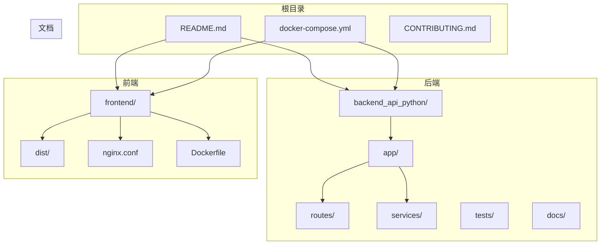
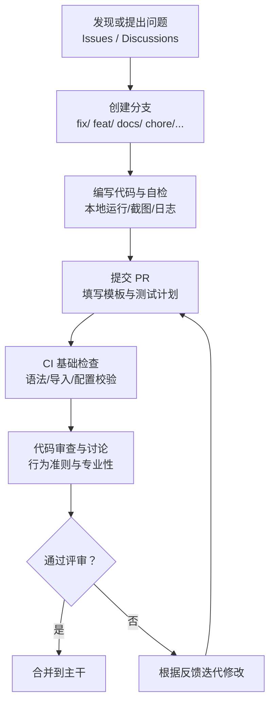
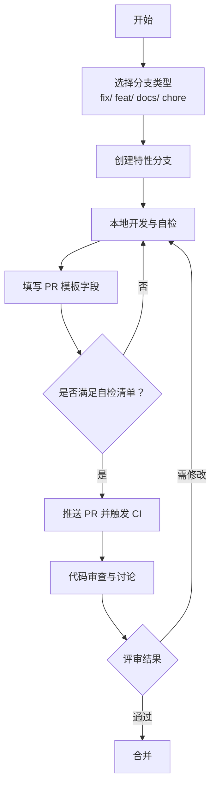
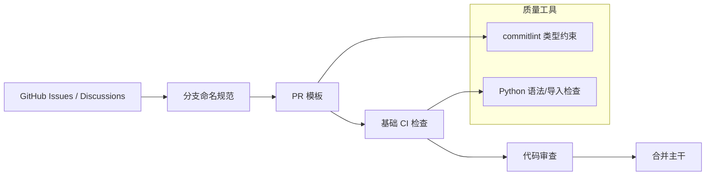

# 代码贡献流程

<cite>
**本文引用的文件**
- [CONTRIBUTING.md](file://CONTRIBUTING.md)
- [.github/PULL_REQUEST_TEMPLATE.md](file://.github/PULL_REQUEST_TEMPLATE.md)
- [CODE_OF_CONDUCT.md](file://CODE_OF_CONDUCT.md)
- [SECURITY.md](file://SECURITY.md)
- [DEVELOPMENT.md](file://DEVELOPMENT.md)
- [README.md](file://README.md)
- [frontend/commitlint.config.js](file://frontend/commitlint.config.js)
- [.github/ISSUE_TEMPLATE/bug_report.yml](file://.github/ISSUE_TEMPLATE/bug_report.yml)
- [.github/ISSUE_TEMPLATE/feature_request.yml](file://.github/ISSUE_TEMPLATE/feature_request.yml)
- [.github/workflows/basic-ci.yml](file://.github/workflows/basic-ci.yml)
- [backend_api_python/tests/conftest.py](file://backend_api_python/tests/conftest.py)
- [frontend/src/views/indicator-ide/index.vue](file://frontend/src/views/indicator-ide/index.vue)
</cite>

## 目录
1. [简介](#简介)
2. [项目结构](#项目结构)
3. [核心组件](#核心组件)
4. [架构总览](#架构总览)
5. [详细组件分析](#详细组件分析)
6. [依赖关系分析](#依赖关系分析)
7. [性能与质量保障](#性能与质量保障)
8. [故障排查指南](#故障排查指南)
9. [结论](#结论)
10. [附录](#附录)

## 简介
本文件面向希望参与 QuantDinger 项目的贡献者，系统化说明贡献入口、分支命名规范、Pull Request 提交流程、代码审查标准与合并要求；同时覆盖不同类型的贡献（Bug 修复、新功能、文档改进等）处理方式，以及提交前自检清单、测试要求与文档更新规范，并提供社区沟通渠道与协作最佳实践。

## 项目结构
QuantDinger 采用前后端分离的仓库布局：
- 后端 Python API 与策略运行时位于 backend_api_python/
- 前端为预构建静态资源，位于 frontend/dist/（Vue 源码在独立私有仓库维护）
- 文档与示例位于 docs/
- 根目录提供 Docker Compose 编排与开发脚本

图表来源
- [README.md:466-484](file://README.md#L466-L484)
- [DEVELOPMENT.md:38-62](file://DEVELOPMENT.md#L38-L62)

章节来源
- [README.md:466-484](file://README.md#L466-L484)
- [DEVELOPMENT.md:38-62](file://DEVELOPMENT.md#L38-L62)

## 核心组件
- 贡献入口与行为准则
  - 贡献指南明确贡献类型（工程、策略研究、文档、内容与倡导）、沟通渠道与开发环境搭建。
  - 行为准则强调尊重、专业与长期价值导向。
- 分支与 PR 规范
  - 统一分支命名前缀：fix/xxx、feat/xxx、docs/xxx、chore/xxx。
  - PR 模板包含变更摘要、测试计划、UI 截图等要求。
- 安全披露政策
  - 明确漏洞报告流程、响应预期与责任边界。
- 开发与测试
  - 提供 Docker 快速启动、本地后端运行、前端同步流程与基础测试命令。
- 质量与合规
  - 前端 commitlint 类型约束与 CI 基础检查（语法、导入）。

章节来源
- [CONTRIBUTING.md:120-150](file://CONTRIBUTING.md#L120-L150)
- [.github/PULL_REQUEST_TEMPLATE.md:1-18](file://.github/PULL_REQUEST_TEMPLATE.md#L1-L18)
- [CODE_OF_CONDUCT.md:1-117](file://CODE_OF_CONDUCT.md#L1-L117)
- [SECURITY.md:1-110](file://SECURITY.md#L1-L110)
- [DEVELOPMENT.md:11-27](file://DEVELOPMENT.md#L11-L27)
- [DEVELOPMENT.md:137-143](file://DEVELOPMENT.md#L137-L143)
- [frontend/commitlint.config.js:1-26](file://frontend/commitlint.config.js#L1-L26)
- [.github/workflows/basic-ci.yml:1-69](file://.github/workflows/basic-ci.yml#L1-L69)

## 架构总览
贡献流程围绕“问题发现—讨论—实现—验证—评审—合并”的闭环展开，结合仓库内现有模板与工作流，确保贡献可追踪、可复现、可审计。

图表来源
- [CONTRIBUTING.md:120-150](file://CONTRIBUTING.md#L120-L150)
- [.github/PULL_REQUEST_TEMPLATE.md:1-18](file://.github/PULL_REQUEST_TEMPLATE.md#L1-L18)
- [CODE_OF_CONDUCT.md:26-50](file://CODE_OF_CONDUCT.md#L26-L50)
- [.github/workflows/basic-ci.yml:10-69](file://.github/workflows/basic-ci.yml#L10-L69)

## 详细组件分析

### 分支命名与 PR 提交流程
- 分支命名规范
  - fix/xxx：用于 Bug 修复
  - feat/xxx：用于新增功能
  - docs/xxx：用于文档改进
  - chore/xxx：用于维护类改动
- PR 提交要求
  - 说明变更原因与影响范围
  - 提供可复现实验步骤
  - UI 变更附带前后截图
  - 兼容性说明（如有）
  - 保持 PR 聚焦、可读、可审
- PR 模板字段
  - 摘要、变更点、测试计划、UI 截图

图表来源
- [CONTRIBUTING.md:122-139](file://CONTRIBUTING.md#L122-L139)
- [.github/PULL_REQUEST_TEMPLATE.md:1-18](file://.github/PULL_REQUEST_TEMPLATE.md#L1-L18)

章节来源
- [CONTRIBUTING.md:120-150](file://CONTRIBUTING.md#L120-L150)
- [.github/PULL_REQUEST_TEMPLATE.md:1-18](file://.github/PULL_REQUEST_TEMPLATE.md#L1-L18)

### 代码审查标准与合并要求
- 审查标准
  - 清晰的变更说明与动机
  - 代码可读性与一致性（遵循项目风格）
  - 测试覆盖与回归风险控制
  - 安全与隐私（密钥、凭证、敏感路径）
  - 行为准则与社区礼仪
- 合并要求
  - 至少一次通过的代码审查
  - CI 基础检查通过
  - 遵循分支命名与 PR 模板
  - 对于安全相关改动，优先在 Discussions 中沟通

章节来源
- [CODE_OF_CONDUCT.md:26-50](file://CODE_OF_CONDUCT.md#L26-L50)
- [.github/workflows/basic-ci.yml:10-69](file://.github/workflows/basic-ci.yml#L10-L69)
- [CONTRIBUTING.md:120-150](file://CONTRIBUTING.md#L120-L150)

### 不同类型贡献的处理方式
- Bug 修复
  - 使用 fix/xxx 分支
  - 在 PR 中提供最小回归测试建议
  - 如涉及安全，参考安全披露流程
- 新功能开发
  - 使用 feat/xxx 分支
  - 在 Discussions 中先行沟通设计思路
  - 提供测试计划与兼容性说明
- 文档改进
  - 使用 docs/xxx 分支
  - 更新对应文档并提供变更说明
- 维护类改动
  - 使用 chore/xxx 分支
  - 说明改动背景与影响范围

章节来源
- [CONTRIBUTING.md:122-139](file://CONTRIBUTING.md#L122-L139)
- [SECURITY.md:49-67](file://SECURITY.md#L49-L67)

### 提交前自检清单
- 本地验证
  - 后端：启动 API 并验证受影响端点
  - 前端：启动开发服务器并验证受影响页面/组件
- 代码质量
  - 遵循 commit 类型（feat/fix/docs/style/refactor/test/chore/revert）
  - 通过 CI 基础检查（语法、导入、配置）
- 文档与测试
  - 更新相关文档
  - 补充或完善测试用例
- 安全与合规
  - 未泄露密钥或敏感信息
  - 符合行为准则与法律合规要求

章节来源
- [CONTRIBUTING.md:142-149](file://CONTRIBUTING.md#L142-L149)
- [DEVELOPMENT.md:137-143](file://DEVELOPMENT.md#L137-L143)
- [frontend/commitlint.config.js:15-25](file://frontend/commitlint.config.js#L15-L25)
- [.github/workflows/basic-ci.yml:41-69](file://.github/workflows/basic-ci.yml#L41-L69)

### 测试要求与文档更新规范
- 测试要求
  - 后端：使用 pytest 运行测试套件
  - 前端：运行开发服务器验证 UI 变更
  - Bug 修复建议包含最小回归测试
- 文档更新
  - 新功能需同步更新相关文档
  - 示例与指南保持与实现一致
- 质量工具
  - 前端支持 ESLint、Stylelint、Prettier 与 commitlint
  - 后端 CI 执行语法与导入检查

章节来源
- [DEVELOPMENT.md:137-143](file://DEVELOPMENT.md#L137-L143)
- [frontend/commitlint.config.js:15-25](file://frontend/commitlint.config.js#L15-L25)
- [.github/workflows/basic-ci.yml:41-69](file://.github/workflows/basic-ci.yml#L41-L69)

### 社区沟通渠道与协作最佳实践
- 沟通渠道
  - Issues：缺陷报告与功能请求
  - Discussions：提问、想法与设计讨论
  - README 列表的官方社区链接
- 协作最佳实践
  - 大改动先在 Discussions 中沟通
  - 遵循行为准则，保持尊重与专业
  - 使用清晰标题与描述，附带必要上下文

章节来源
- [CONTRIBUTING.md:88-95](file://CONTRIBUTING.md#L88-L95)
- [README.md:613-624](file://README.md#L613-L624)
- [CODE_OF_CONDUCT.md:26-50](file://CODE_OF_CONDUCT.md#L26-L50)

## 依赖关系分析
贡献流程中的关键依赖与交互如下：

图表来源
- [CONTRIBUTING.md:120-150](file://CONTRIBUTING.md#L120-L150)
- [.github/PULL_REQUEST_TEMPLATE.md:1-18](file://.github/PULL_REQUEST_TEMPLATE.md#L1-L18)
- [.github/workflows/basic-ci.yml:10-69](file://.github/workflows/basic-ci.yml#L10-L69)
- [frontend/commitlint.config.js:15-25](file://frontend/commitlint.config.js#L15-L25)

章节来源
- [CONTRIBUTING.md:120-150](file://CONTRIBUTING.md#L120-L150)
- [.github/PULL_REQUEST_TEMPLATE.md:1-18](file://.github/PULL_REQUEST_TEMPLATE.md#L1-L18)
- [.github/workflows/basic-ci.yml:10-69](file://.github/workflows/basic-ci.yml#L10-L69)
- [frontend/commitlint.config.js:15-25](file://frontend/commitlint.config.js#L15-L25)

## 性能与质量保障
- 性能考量
  - 保持 PR 聚焦，避免引入不必要的复杂度
  - 对性能敏感的改动应提供基准对比与说明
- 质量保障
  - CI 基础检查覆盖语法与导入错误
  - 前端代码质量可通过 commitlint、ESLint、Stylelint 与 Prettier 统一
  - 后端测试通过 pytest 套件执行

章节来源
- [.github/workflows/basic-ci.yml:41-69](file://.github/workflows/basic-ci.yml#L41-L69)
- [DEVELOPMENT.md:137-143](file://DEVELOPMENT.md#L137-L143)
- [frontend/commitlint.config.js:15-25](file://frontend/commitlint.config.js#L15-L25)

## 故障排查指南
- 常见问题定位
  - 后端健康检查失败：查看容器日志与环境变量配置
  - 数据源异常：核对 API Key 与服务可用性
  - 前端静态资源不更新：确认前端构建产物已同步至 dist/
- 安全问题
  - 发现安全漏洞请勿公开 Issue，按安全披露流程私下报告
- 代码质量提示
  - 前端指标 IDE 支持代码质量提示接口，可在本地触发质量检查

章节来源
- [README.md:354-370](file://README.md#L354-L370)
- [SECURITY.md:49-67](file://SECURITY.md#L49-L67)
- [frontend/src/views/indicator-ide/index.vue:3127-3150](file://frontend/src/views/indicator-ide/index.vue#L3127-L3150)

## 结论
QuantDinger 的贡献流程以“清晰规范、可追溯、可审计”为核心，通过分支命名、PR 模板、CI 基础检查与行为准则共同保障贡献质量。建议贡献者在提交前完成自检清单，遵循不同贡献类型的处理方式，并在 Discussions 中进行充分沟通，以提升协作效率与代码质量。

## 附录
- 贡献类型与处理建议
  - Bug 修复：优先 fix/xxx 分支，附最小回归测试
  - 新功能：feat/xxx 分支，先 Discussions 讨论
  - 文档改进：docs/xxx 分支，同步更新相关文档
  - 维护类：chore/xxx 分支，说明背景与影响
- 沟通与协作
  - Issues 用于缺陷与需求
  - Discussions 用于设计与思想碰撞
  - 遵守行为准则，保持尊重与专业

章节来源
- [CONTRIBUTING.md:120-150](file://CONTRIBUTING.md#L120-L150)
- [CODE_OF_CONDUCT.md:26-50](file://CODE_OF_CONDUCT.md#L26-L50)
- [README.md:613-624](file://README.md#L613-L624)