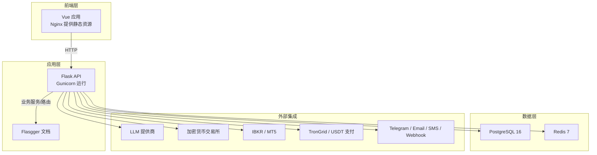
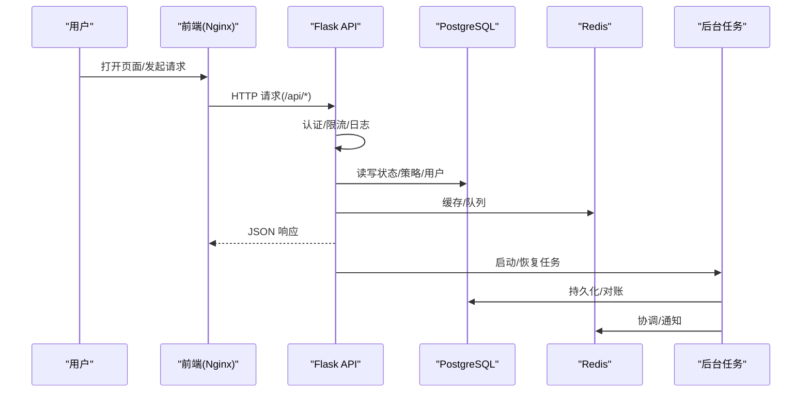
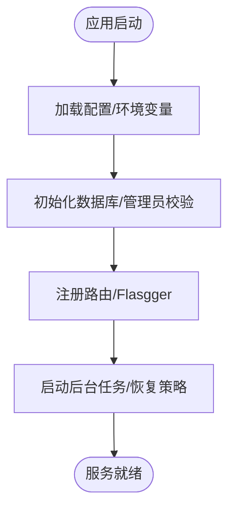
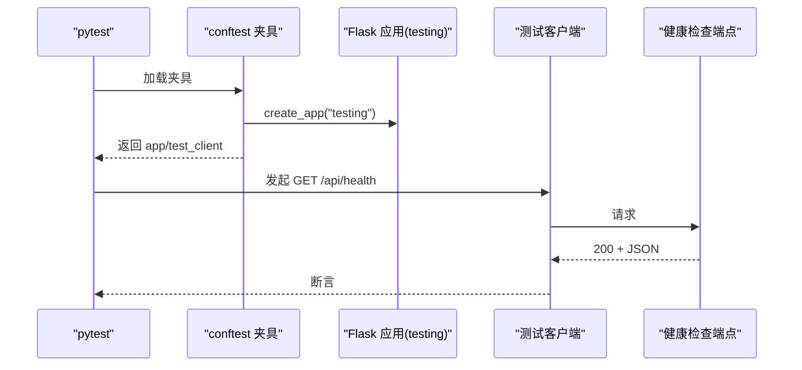

# 开发指南

<cite>
**本文引用的文件**   
- [CONTRIBUTING.md](file://CONTRIBUTING.md)
- [DEVELOPMENT.md](file://DEVELOPMENT.md)
- [README.md](file://README.md)
- [requirements.txt](file://backend_api_python/requirements.txt)
- [package.json](file://frontend/package.json)
- [run.py](file://backend_api_python/run.py)
- [vue.config.js](file://frontend/vue.config.js)
- [docker-compose.yml](file://docker-compose.yml)
- [conftest.py](file://backend_api_python/tests/conftest.py)
- [test_health.py](file://backend_api_python/tests/test_health.py)
- [jest.config.js](file://frontend/jest.config.js)
- [app/__init__.py](file://backend_api_python/app/__init__.py)
- [settings.py](file://backend_api_python/app/config/settings.py)
- [.eslintrc.js](file://frontend/.eslintrc.js)
- [gunicorn_config.py](file://backend_api_python/gunicorn_config.py)
</cite>

## 目录
1. [简介](#简介)
2. [项目结构](#项目结构)
3. [核心组件](#核心组件)
4. [架构总览](#架构总览)
5. [详细组件分析](#详细组件分析)
6. [依赖关系分析](#依赖关系分析)
7. [性能考虑](#性能考虑)
8. [故障排查指南](#故障排查指南)
9. [结论](#结论)
10. [附录](#附录)

## 简介
本开发指南面向希望参与 QuantDinger 的开发者，覆盖开发环境搭建、代码贡献流程、测试策略与调试技巧、代码规范与命名约定、架构原则、单元/集成/端到端测试实施方法、IDE 配置与开发工作流、以及代码审查与发布流程。内容基于仓库中的贡献说明、开发指南、快速开始与配置文件整理而成，帮助你以一致的方式构建、验证与交付功能。

## 项目结构
QuantDinger 采用前后端分离的容器化部署模型：前端通过 Nginx 提供静态资源；后端使用 Flask + Gunicorn 托管 API；数据库与缓存分别由 PostgreSQL 与 Redis 提供；通过 Docker Compose 统一编排。后端源码位于 backend_api_python，前端静态资源位于 frontend/dist（Vue 源码在私有仓库维护，需同步构建产物）。

图表来源
- [docker-compose.yml:23-150](file://docker-compose.yml#L23-L150)
- [run.py:96-101](file://backend_api_python/run.py#L96-L101)
- [app/__init__.py:213-288](file://backend_api_python/app/__init__.py#L213-L288)

章节来源
- [README.md:236-321](file://README.md#L236-L321)
- [DEVELOPMENT.md:38-62](file://DEVELOPMENT.md#L38-L62)
- [docker-compose.yml:23-150](file://docker-compose.yml#L23-L150)

## 核心组件
- 后端入口与应用工厂
  - 入口脚本负责加载 .env、设置代理与编码、注入项目根路径，并创建 Flask 应用实例。
  - 应用工厂负责注册路由、初始化数据库与管理员账户、挂载 Flasgger 文档、启动后台任务与恢复运行中策略等。
- 配置体系
  - 通过环境变量驱动的元类配置，集中管理主机、端口、调试模式、密钥、日志、安全与功能开关等。
- 前端开发与代理
  - Vue CLI 开发服务器默认端口可配置；本地开发通过代理将 /api 请求转发至后端 5000 端口。
- 测试基础
  - 后端使用 pytest，提供共享夹具与最小化测试环境；前端使用 Jest + Vue Test Utils 进行单元测试。

章节来源
- [run.py:17-95](file://backend_api_python/run.py#L17-L95)
- [app/__init__.py:213-288](file://backend_api_python/app/__init__.py#L213-L288)
- [settings.py:1-99](file://backend_api_python/app/config/settings.py#L1-L99)
- [vue.config.js:136-148](file://frontend/vue.config.js#L136-L148)
- [conftest.py:1-31](file://backend_api_python/tests/conftest.py#L1-L31)
- [jest.config.js:1-24](file://frontend/jest.config.js#L1-L24)

## 架构总览
下图展示从用户交互到后端服务、数据库与外部系统的典型调用链路，以及后台任务与恢复逻辑。

图表来源
- [docker-compose.yml:79-127](file://docker-compose.yml#L79-L127)
- [app/__init__.py:268-287](file://backend_api_python/app/__init__.py#L268-L287)
- [run.py:104-129](file://backend_api_python/run.py#L104-L129)

## 详细组件分析

### 后端应用工厂与启动流程
- 关键职责
  - 安全 JSON 序列化（替换 NaN/Inf），避免前端解析错误。
  - 初始化数据库、确保管理员账户存在。
  - 注册路由蓝图、启用 CORS 与 Flasgger 文档。
  - 启动后台任务：挂单处理、组合投资监控、USDT 订单检查、Polymarket 分析、AI 校准与反思。
  - 恢复运行中策略（当前支持 IndicatorStrategy）。
- 启动钩子与守护进程
  - 通过环境变量控制是否启用各后台任务。
  - 在开发模式下避免重复启动（Flask 重载器保护）。
- 安全与密钥
  - 生产环境若使用默认 SECRET_KEY 将自动生成随机值并提示持久化。

图表来源
- [app/__init__.py:213-288](file://backend_api_python/app/__init__.py#L213-L288)
- [run.py:109-120](file://backend_api_python/run.py#L109-L120)

章节来源
- [app/__init__.py:16-52](file://backend_api_python/app/__init__.py#L16-L52)
- [app/__init__.py:268-287](file://backend_api_python/app/__init__.py#L268-L287)
- [run.py:109-120](file://backend_api_python/run.py#L109-L120)

### 配置与环境变量
- 主要配置项
  - 服务：HOST、PORT、DEBUG、APP_NAME、VERSION
  - 认证：SECRET_KEY、ADMIN_USER、ADMIN_PASSWORD
  - 日志：LOG_LEVEL、LOG_DIR、LOG_FILE、LOG_MAX_BYTES、LOG_BACKUP_COUNT
  - 安全：RATE_LIMIT
  - 功能开关：ENABLE_CACHE、ENABLE_REQUEST_LOG
- 环境变量优先级
  - 通过 os.getenv 读取；部分值可通过附加配置加载器覆盖。

章节来源
- [settings.py:10-99](file://backend_api_python/app/config/settings.py#L10-L99)

### 前端开发与代理
- 开发服务器
  - 默认端口 8000；代理将 /api 请求转发到后端 5000 端口，支持长请求（如回测）。
- 构建与主题
  - 使用 DefinePlugin 注入版本、Git 版本与构建时间；支持动态主题色插件。
- 代码质量
  - ESLint 规则偏向宽松但保留关键约束；生产环境禁用 debugger。

章节来源
- [vue.config.js:136-155](file://frontend/vue.config.js#L136-L155)
- [.eslintrc.js:1-76](file://frontend/.eslintrc.js#L1-L76)

### 测试策略与实施

#### 后端测试（pytest）
- 夹具与环境
  - 在会话级别创建应用实例，设置最小化测试环境变量（如 SECRET_KEY、ADMIN_*、缓存关闭等）。
- 示例测试
  - 健康检查端点返回 200 并能解析 JSON。
- 运行方式
  - 在 backend_api_python 目录安装 pytest 后执行 pytest tests/ -v。

图表来源
- [conftest.py:19-31](file://backend_api_python/tests/conftest.py#L19-L31)
- [test_health.py:4-10](file://backend_api_python/tests/test_health.py#L4-L10)

章节来源
- [conftest.py:1-31](file://backend_api_python/tests/conftest.py#L1-L31)
- [test_health.py:1-10](file://backend_api_python/tests/test_health.py#L1-L10)

#### 前端测试（Jest + Vue Test Utils）
- 配置要点
  - 模块映射、Vue/JSX/Babel 转换、快照序列化、测试匹配规则。
- 建议实践
  - 为关键组件编写单元测试，结合模拟 API 响应进行断言。
  - 使用快照测试稳定 UI 结构变更。

章节来源
- [jest.config.js:1-24](file://frontend/jest.config.js#L1-L24)

### 集成与端到端测试
- 集成测试
  - 建议围绕关键业务流程（登录、策略保存/回测、下单、支付回调）编写集成测试，使用测试数据库或内存数据库镜像。
- 端到端测试
  - 可使用 Cypress 或 Playwright 对主要用户路径进行自动化验证，覆盖登录、策略编辑、图表渲染、回测执行与结果查看。
- 数据与外部依赖
  - 针对市场数据、LLM、支付网关与交易所接口，建议通过 Mock 或沙盒环境隔离外部不确定性。

[本节为通用指导，无需列出具体文件来源]

## 依赖关系分析
- 后端依赖
  - Web 框架与扩展：Flask、Flask-CORS、Flasgger
  - 数据与网络：SQLAlchemy、PyMySQL/psycopg2、requests、certifi、PySocks
  - 执行与并发：gunicorn、bcrypt、ccxt、yfinance、finnhub-python
  - 可选：ib_insync（US 股）、MetaTrader5（Windows 专有）
- 前端依赖
  - Vue 2 生态：Vue、Vue Router、Vuex、Ant Design Vue、ECharts、K线图等。
  - 开发工具：@vue/cli-service、ESLint、Stylelint、Jest、Vue Test Utils。

章节来源
- [requirements.txt:1-40](file://backend_api_python/requirements.txt#L1-L40)
- [package.json:15-83](file://frontend/package.json#L15-L83)

## 性能考虑
- 并发与线程
  - 生产使用 gthread 工人模型，默认 1 个工人 × 4 线程；可根据 CPU 核数提升 GUNICORN_WORKERS。
- 数据库连接池
  - 通过环境变量调整 DB_POOL_MIN/MAX、获取超时与健康检查，避免连接池耗尽。
- 缓存与队列
  - Redis 作为可选缓存与协调层，建议在多工人场景开启；注意内存上限与淘汰策略。
- I/O 密集型任务
  - 后台任务（挂单、监控、USDT 订单、Polymarket）具备幂等性与数据库锁协调，尽量避免重复执行。

章节来源
- [gunicorn_config.py:10-36](file://backend_api_python/gunicorn_config.py#L10-L36)
- [docker-compose.yml:108-120](file://docker-compose.yml#L108-L120)

## 故障排查指南
- 常见问题
  - Twelves Data 授权错误：检查 .env 中 TWELVE_DATA_API_KEY；中国股票数据需付费计划。
  - 热力图“暂无数据”：通常由 yfinance NaN 引起；全局 JSON 编码已转为 null。
  - Redis 连接失败：确认 redis 服务运行；可设置 CACHE_ENABLED=false 回退到内存缓存。
- 启动与健康
  - 后端健康检查端点：http://localhost:5000/api/health
  - Docker 常用命令：查看状态、跟随日志、重启、重建、停止。

章节来源
- [DEVELOPMENT.md:145-149](file://DEVELOPMENT.md#L145-L149)
- [README.md:361-369](file://README.md#L361-L369)

## 结论
本指南提供了从环境搭建到测试与运维的完整路径。建议在贡献前先完成本地一键部署与基础测试验证，遵循分支命名与 PR 规范，配合代码审查与持续集成，确保改动的稳定性与可维护性。

## 附录

### 开发环境搭建
- 快速开始（Docker）
  - 复制并编辑 .env，生成安全 SECRET_KEY，使用 docker-compose 启动。
- 本地后端（非 Docker）
  - 创建虚拟环境，安装 requirements.txt，复制 env.example 到 .env，运行 run.py。
- 前端（私有 Vue 源码）
  - 在私有仓库构建后同步 dist 至 frontend/dist，再构建/启动前端镜像。

章节来源
- [DEVELOPMENT.md:11-27](file://DEVELOPMENT.md#L11-L27)
- [DEVELOPMENT.md:64-74](file://DEVELOPMENT.md#L64-L74)
- [DEVELOPMENT.md:76-107](file://DEVELOPMENT.md#L76-L107)

### 代码贡献流程
- 贡献类型
  - 核心工程、策略研究、文档与解释、内容与倡导。
- 交流渠道
  - Issues、Discussions、社区链接。
- 分支与 PR
  - 分支命名：fix/xxx、feat/xxx、docs/xxx、chore/xxx
  - PR 要求：变更说明、测试方法、UI 截图、兼容性说明。

章节来源
- [CONTRIBUTING.md:46-140](file://CONTRIBUTING.md#L46-L140)

### 测试策略与调试技巧
- 后端
  - pytest 测试套件；最小化测试环境变量；针对关键端点编写断言。
- 前端
  - Jest 单测；ESLint 规则；生产禁用 debugger。
- 调试
  - 后端：gunicorn + Flask 调试；日志级别与文件配置；健康检查端点。
  - 前端：开发服务器代理到后端；长请求（如回测）需适当超时。

章节来源
- [conftest.py:8-14](file://backend_api_python/tests/conftest.py#L8-L14)
- [test_health.py:4-10](file://backend_api_python/tests/test_health.py#L4-L10)
- [vue.config.js:136-148](file://frontend/vue.config.js#L136-L148)
- [gunicorn_config.py:20-23](file://backend_api_python/gunicorn_config.py#L20-L23)

### 代码规范与命名约定
- Python
  - 使用 .env 管理配置；Flasgger 文档模板；统一 JSON 序列化（SafeJSONProvider）。
- 前端
  - ESLint 规则与 Vue 标准；模块别名 @/；禁用 console 仅在开发环境严格。
- 命名
  - 分支命名：fix/feat/docs/chore；变量与函数清晰表达意图；配置项以大写常量风格。

章节来源
- [app/__init__.py:16-52](file://backend_api_python/app/__init__.py#L16-L52)
- [.eslintrc.js:10-60](file://frontend/.eslintrc.js#L10-L60)
- [CONTRIBUTING.md:122-128](file://CONTRIBUTING.md#L122-L128)

### 架构原则
- 自托管与数据主权：所有凭证、策略与数据由用户掌控。
- 研究到执行一体化：AI 分析、图表、策略、回测、快捷交易与实盘执行贯通。
- 可操作的产品：Docker Compose、PostgreSQL、Redis、Nginx、健康检查、按环境配置。

章节来源
- [README.md:63-79](file://README.md#L63-L79)

### IDE 配置与开发工作流
- 后端
  - 使用 Python 3.10+；Flask 开发服务器用于本地调试；gunicorn 用于生产。
- 前端
  - Vue CLI 开发服务器；代理到后端 5000 端口；Jest 单测脚本。
- 工作流
  - 本地 Docker 一键启动；修改后热更新；提交前运行测试；PR 包含测试说明。

章节来源
- [DEVELOPMENT.md:11-27](file://DEVELOPMENT.md#L11-L27)
- [run.py:124-129](file://backend_api_python/run.py#L124-L129)
- [vue.config.js:136-148](file://frontend/vue.config.js#L136-L148)
- [package.json:5-14](file://frontend/package.json#L5-L14)

### 代码审查与发布流程
- 代码审查
  - 保持 PR 聚焦、可审查；提供测试步骤与影响评估。
- 发布
  - Docker Compose 默认镜像与端口；根级 .env 支持镜像前缀与端口覆盖；健康检查保障可用性。

章节来源
- [CONTRIBUTING.md:129-139](file://CONTRIBUTING.md#L129-L139)
- [docker-compose.yml:1-22](file://docker-compose.yml#L1-L22)