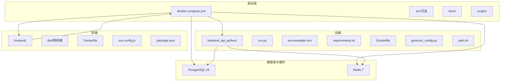
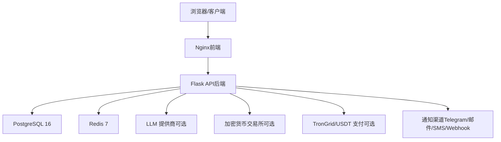
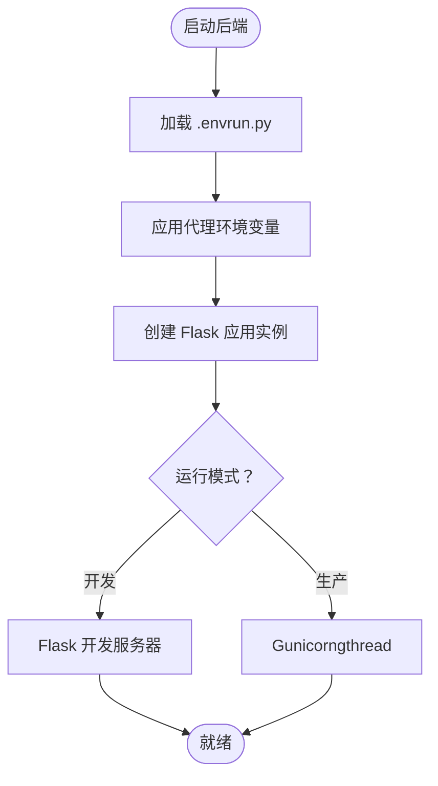
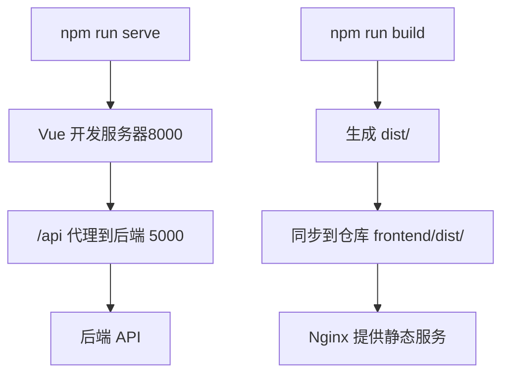
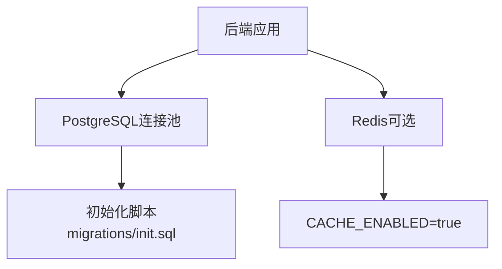
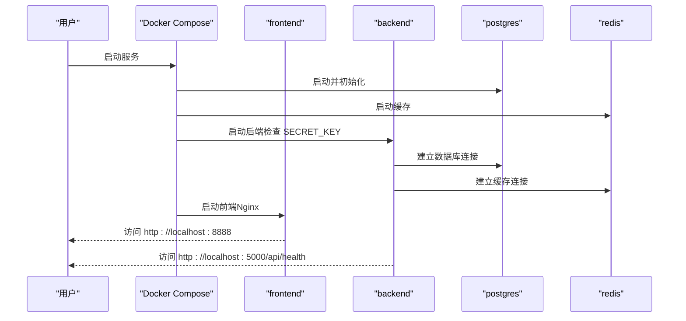
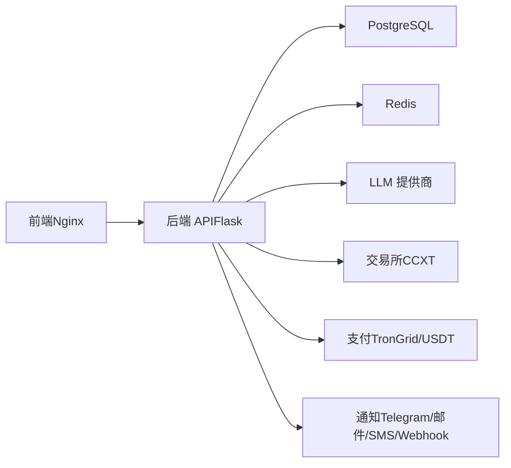

# 开发环境搭建

<cite>
**本文档引用的文件**
- [README.md](file://README.md)
- [DEVELOPMENT.md](file://DEVELOPMENT.md)
- [backend_api_python/README.md](file://backend_api_python/README.md)
- [frontend/README.md](file://frontend/README.md)
- [backend_api_python/env.example](file://backend_api_python/env.example)
- [backend_api_python/Dockerfile](file://backend_api_python/Dockerfile)
- [frontend/Dockerfile](file://frontend/Dockerfile)
- [docker-compose.yml](file://docker-compose.yml)
- [backend_api_python/run.py](file://backend_api_python/run.py)
- [backend_api_python/docker-entrypoint.sh](file://backend_api_python/docker-entrypoint.sh)
- [backend_api_python/requirements.txt](file://backend_api_python/requirements.txt)
- [frontend/package.json](file://frontend/package.json)
- [scripts/generate-secret-key.sh](file://scripts/generate-secret-key.sh)
- [scripts/build-frontend.sh](file://scripts/build-frontend.sh)
- [backend_api_python/gunicorn_config.py](file://backend_api_python/gunicorn_config.py)
- [frontend/vue.config.js](file://frontend/vue.config.js)
- [backend_api_python/start.sh](file://backend_api_python/start.sh)
</cite>

## 目录
1. [简介](#简介)
2. [项目结构](#项目结构)
3. [核心组件](#核心组件)
4. [架构总览](#架构总览)
5. [详细组件分析](#详细组件分析)
6. [依赖关系分析](#依赖关系分析)
7. [性能考虑](#性能考虑)
8. [故障排除指南](#故障排除指南)
9. [结论](#结论)
10. [附录](#附录)

## 简介
本指南面向希望在本地搭建 QuantDinger 开发环境的用户，覆盖以下内容：
- Python 后端环境准备与本地运行
- Node.js 前端环境准备与本地调试
- 数据库 PostgreSQL 与缓存 Redis 的配置
- Docker 容器化一键部署
- Windows、macOS、Linux 平台的具体安装命令与配置
- 环境变量配置、依赖安装与项目初始化流程
- 常见问题排查与性能优化建议

QuantDinger 是一个自托管的量化交易与算法交易平台，采用前后端分离架构：前端为预构建的 Vue 应用，后端为基于 Flask 的 Python API，数据库使用 PostgreSQL，缓存使用 Redis，通过 Docker Compose 提供一键部署。

## 项目结构
仓库采用多模块组织方式：
- backend_api_python：Flask 后端 API，包含路由、服务、数据源、工具等
- frontend：预构建的 Vue 前端交付包，由 Nginx 提供静态服务
- docs：产品、策略与部署相关文档
- scripts：辅助脚本，如密钥生成、前端构建同步等
- 根目录配置：docker-compose.yml、根 .env 等

**图表来源**
- [docker-compose.yml:23-163](file://docker-compose.yml#L23-L163)
- [backend_api_python/Dockerfile:1-56](file://backend_api_python/Dockerfile#L1-L56)
- [frontend/Dockerfile:1-33](file://frontend/Dockerfile#L1-L33)

**章节来源**
- [README.md: 466-484:466-484](file://README.md#L466-L484)
- [DEVELOPMENT.md: 38-62:38-62](file://DEVELOPMENT.md#L38-L62)

## 核心组件
- 后端 API（Flask + Gunicorn）
  - 使用 gunicorn 作为生产 WSGI 服务器，默认线程模型（gthread），支持并发请求处理
  - 通过 run.py 加载 .env，应用代理环境变量，启动应用
  - Docker 入口脚本负责检查并自动设置安全密钥
- 数据库（PostgreSQL）
  - 默认使用 docker-compose 中的 postgres:16-alpine
  - 初始化脚本位于 migrations/init.sql
- 缓存（Redis）
  - 默认使用 redis:7-alpine，最大内存 128MB，LRU 策略
- 前端（Nginx 预构建）
  - 使用 nginx:1.25-alpine 提供静态文件服务
  - 前端构建产物来自独立的 Vue 源码仓库，通过脚本同步到 dist/

**章节来源**
- [backend_api_python/gunicorn_config.py: 1-36:1-36](file://backend_api_python/gunicorn_config.py#L1-L36)
- [backend_api_python/run.py: 96-134:96-134](file://backend_api_python/run.py#L96-L134)
- [backend_api_python/docker-entrypoint.sh: 1-49:1-49](file://backend_api_python/docker-entrypoint.sh#L1-L49)
- [docker-compose.yml: 27-150:27-150](file://docker-compose.yml#L27-L150)
- [frontend/Dockerfile: 1-33:1-33](file://frontend/Dockerfile#L1-L33)

## 架构总览
下图展示了从浏览器到后端 API、数据库与缓存的整体交互路径，以及可选的外部集成（LLM、交易所、支付等）。

**图表来源**
- [README.md: 269-321:269-321](file://README.md#L269-L321)
- [backend_api_python/env.example: 64-118:64-118](file://backend_api_python/env.example#L64-L118)

## 详细组件分析

### 后端环境（Python + Flask + Gunicorn）
- 运行模式
  - 开发：直接运行 run.py，支持热重载
  - 生产：使用 gunicorn，按 gunicorn_config.py 配置启动
- 环境变量
  - 主要配置文件 backend_api_python/.env，包含认证、数据库、AI/LLM、OAuth、计费、代理、安全等
  - Docker 环境通过 docker-compose 注入环境变量，如 DATABASE_URL、REDIS_HOST/PORT、DB 连接池参数等
- 依赖安装
  - 使用 requirements.txt 安装后端依赖，包含 Flask、SQLAlchemy、psycopg2、redis、gunicorn 等
- 启动脚本
  - start.sh 用于本地开发启动；run.py 负责加载 .env、应用代理、创建应用实例

**图表来源**
- [backend_api_python/run.py: 17-134:17-134](file://backend_api_python/run.py#L17-L134)
- [backend_api_python/gunicorn_config.py: 10-36:10-36](file://backend_api_python/gunicorn_config.py#L10-L36)

**章节来源**
- [backend_api_python/README.md: 74-134:74-134](file://backend_api_python/README.md#L74-L134)
- [backend_api_python/run.py: 17-134:17-134](file://backend_api_python/run.py#L17-L134)
- [backend_api_python/start.sh: 1-27:1-27](file://backend_api_python/start.sh#L1-L27)
- [backend_api_python/requirements.txt: 1-40:1-40](file://backend_api_python/requirements.txt#L1-L40)

### 前端环境（Node.js + Vue）
- 运行模式
  - 本地开发：使用 Vue CLI 开发服务器，端口 8000，通过代理转发 /api 到后端 5000
  - 生产：使用 Nginx 提供静态文件服务
- 依赖安装
  - 使用 package.json 管理依赖，包含 Vue 2、Ant Design Vue、ECharts、KLineCharts 等
- 构建与同步
  - 前端源码不在本仓库，需在私有仓库构建后，通过脚本将 dist 同步到本仓库的 frontend/dist

**图表来源**
- [frontend/README.md: 88-125:88-125](file://frontend/README.md#L88-L125)
- [frontend/vue.config.js: 136-148:136-148](file://frontend/vue.config.js#L136-L148)
- [frontend/package.json: 1-85:1-85](file://frontend/package.json#L1-L85)

**章节来源**
- [frontend/README.md: 88-125:88-125](file://frontend/README.md#L88-L125)
- [frontend/vue.config.js: 136-148:136-148](file://frontend/vue.config.js#L136-L148)
- [frontend/package.json: 1-85:1-85](file://frontend/package.json#L1-L85)

### 数据库与缓存（PostgreSQL + Redis）
- PostgreSQL
  - 版本：16-alpine；默认数据库名、用户名、密码可在 docker-compose 中配置
  - 初始化：通过挂载 init.sql 自动执行
  - 连接池：可通过环境变量调整最小/最大连接数、获取超时、健康检查等
- Redis
  - 版本：7-alpine；最大内存 128MB，LRU 策略
  - 可通过环境变量启用缓存功能（CACHE_ENABLED）

**图表来源**
- [docker-compose.yml: 27-75:27-75](file://docker-compose.yml#L27-L75)
- [backend_api_python/env.example: 42-57:42-57](file://backend_api_python/env.example#L42-L57)
- [backend_api_python/env.example: 261-265:261-265](file://backend_api_python/env.example#L261-L265)

**章节来源**
- [docker-compose.yml: 27-75:27-75](file://docker-compose.yml#L27-L75)
- [backend_api_python/env.example: 42-57:42-57](file://backend_api_python/env.example#L42-L57)
- [backend_api_python/env.example: 261-265:261-265](file://backend_api_python/env.example#L261-L265)

### Docker 容器化部署
- 一键部署
  - 复制示例环境文件、生成安全密钥、构建并启动所有服务
- 服务清单
  - postgres、redis、backend、frontend
- 端口映射
  - 前端：默认 8888 映射到容器 80
  - 后端：默认 5000 映射到容器 5000
  - 数据库：默认 5432 映射到宿主机
  - 缓存：默认 6379 映射到宿主机
- 健康检查
  - 后端与前端均配置了健康检查，确保服务可用性

**图表来源**
- [docker-compose.yml: 1-L163:1-163](file://docker-compose.yml#L1-L163)
- [backend_api_python/docker-entrypoint.sh: 25-42:25-42](file://backend_api_python/docker-entrypoint.sh#L25-L42)

**章节来源**
- [README.md: 327-379:327-379](file://README.md#L327-L379)
- [docker-compose.yml: 1-L163:1-163](file://docker-compose.yml#L1-L163)

## 依赖关系分析
- 后端对数据库与缓存的依赖
  - 通过环境变量 DATABASE_URL、REDIS_HOST/PORT 控制连接
  - 连接池参数与并发工作线程相互影响，需根据实际负载调整
- 前后端通信
  - 前端开发模式通过代理将 /api 请求转发至后端 5000
  - 生产模式由 Nginx 提供静态资源，后端提供 API
- 外部集成
  - LLM 提供商（OpenRouter、OpenAI、Gemini 等）
  - 加密货币交易所适配层（通过 CCXT）
  - 支付与通知通道（USDT TRC20、Telegram、邮件、短信、Webhook）

**图表来源**
- [backend_api_python/env.example: 64-118:64-118](file://backend_api_python/env.example#L64-L118)
- [backend_api_python/env.example: 134-163:134-163](file://backend_api_python/env.example#L134-L163)

**章节来源**
- [backend_api_python/env.example: 64-118:64-118](file://backend_api_python/env.example#L64-L118)
- [backend_api_python/env.example: 134-163:134-163](file://backend_api_python/env.example#L134-L163)

## 性能考虑
- 数据库连接池
  - 调整 DB_POOL_MIN、DB_POOL_MAX、DB_POOL_ACQUIRE_TIMEOUT、MARKET_EXECUTOR_WORKERS、PORTFOLIO_EXECUTOR_WORKERS，避免连接池耗尽错误
  - 确保 PostgreSQL 的 max_connections 高于 DB_POOL_MAX
- Gunicorn 并发
  - 在多核环境下适当增加 GUNICORN_WORKERS，保持 threads 合理范围
- 缓存策略
  - 启用 Redis（CACHE_ENABLED=true）以降低数据库压力，提升响应速度
- 代理与网络
  - 在代理环境下正确配置 PROXY_URL，并针对国内金融数据源设置 NO_PROXY 白名单
- 前端构建
  - 生产构建时禁用 Source Map，减少体积；必要时可引入 CDN 依赖以减小包体

**章节来源**
- [backend_api_python/env.example: 42-57:42-57](file://backend_api_python/env.example#L42-L57)
- [backend_api_python/gunicorn_config.py: 10-36:10-36](file://backend_api_python/gunicorn_config.py#L10-L36)
- [backend_api_python/env.example: 104-118:104-118](file://backend_api_python/env.example#L104-L118)
- [frontend/vue.config.js: 150-155:150-155](file://frontend/vue.config.js#L150-L155)

## 故障排除指南
- 后端无法启动或健康检查失败
  - 确认 .env 中 SECRET_KEY 已修改为随机值；Docker 入口脚本会自动检测并替换默认密钥
  - 检查数据库与缓存服务是否健康（docker-compose ps、logs）
- 数据库连接失败
  - 校验 DATABASE_URL 格式与 PostgreSQL 服务状态
  - 如出现连接池耗尽，调整 DB_POOL_MAX 与并发工作线程
- 代理导致的外网访问异常
  - 设置 PROXY_URL；国内金融数据源需加入 NO_PROXY 白名单
- 前端代理无效或跨域问题
  - 确认开发服务器代理目标为 http://localhost:5000
- 常见提示与修复
  - “apikey 参数不正确”：检查 TWELVE_DATA_API_KEY；中国股票数据需付费计划
  - “无数据”：yfinance 返回 NaN 时，JSON 编码器已进行空值清理
  - Redis 连接被拒：确认 redis 服务运行；可临时关闭缓存（CACHE_ENABLED=false）

**章节来源**
- [backend_api_python/docker-entrypoint.sh: 25-42:25-42](file://backend_api_python/docker-entrypoint.sh#L25-L42)
- [DEVELOPMENT.md: 145-150:145-150](file://DEVELOPMENT.md#L145-L150)
- [backend_api_python/README.md: 231-237:231-237](file://backend_api_python/README.md#L231-L237)

## 结论
通过本指南，您可以在 Windows、macOS、Linux 上完成 QuantDinger 的本地开发环境搭建与容器化部署。建议优先使用 Docker Compose 快速启动，随后根据需求调整环境变量与并发参数，逐步接入外部服务（LLM、交易所、支付、通知）。遇到问题时，优先检查密钥、数据库与缓存健康状态，并结合代理与连接池配置进行优化。

## 附录

### 平台安装与配置步骤

- Windows（PowerShell）
  - 克隆仓库并复制环境模板
  - 生成随机密钥并启动服务
  - 访问前端与后端健康检查地址
  - 参考命令路径：
    - [README.md: 337-346:337-346](file://README.md#L337-L346)
    - [scripts/generate-secret-key.sh: 1-L34:1-34](file://scripts/generate-secret-key.sh#L1-L34)

- macOS/Linux（Bash）
  - 克隆仓库、复制环境模板、生成密钥、启动服务
  - 访问前端与后端健康检查地址
  - 参考命令路径：
    - [README.md: 327-336:327-336](file://README.md#L327-L336)
    - [scripts/generate-secret-key.sh: 1-L34:1-34](file://scripts/generate-secret-key.sh#L1-L34)

- 本地开发（非 Docker）
  - 后端：创建虚拟环境、安装依赖、复制 .env、运行 run.py
  - 前端：安装依赖、运行开发服务器、配置代理
  - 参考路径：
    - [DEVELOPMENT.md: 64-74:64-74](file://DEVELOPMENT.md#L64-L74)
    - [frontend/README.md: 88-125:88-125](file://frontend/README.md#L88-L125)

### 环境变量配置要点
- 认证与安全
  - SECRET_KEY：必须修改为随机值；默认值将被自动替换
  - ADMIN_USER/ADMIN_PASSWORD：首次启动创建管理员账户
- 数据库与缓存
  - DATABASE_URL：PostgreSQL 连接字符串
  - DB_POOL_MIN/MAX、ACQUIRE_TIMEOUT：连接池参数
  - CACHE_ENABLED、REDIS_HOST/PORT：启用 Redis 缓存
- AI/LLM
  - LLM_PROVIDER 及对应 API Key（OpenRouter/OpenAI/Gemini/DeepSeek 等）
- OAuth 与注册
  - GOOGLE_CLIENT_ID/SECRET、GITHUB_CLIENT_ID/SECRET、ENABLE_REGISTRATION
- 计费与支付
  - BILLING_ENABLED、USDT 支付相关（USDT_PAY_ENABLED、XPUB、TRONGRID）
- 代理与网络
  - PROXY_URL、LIVE_TRADING_SSL_VERIFY/CA_BUNDLE、NO_PROXY 白名单
- 安全与验证
  - TURNSTILE_*、IP/账号尝试限制、验证码配置

**章节来源**
- [backend_api_python/env.example: 9-268:9-268](file://backend_api_python/env.example#L9-L268)

### 依赖包安装与项目初始化
- 后端依赖
  - 使用 requirements.txt 安装 Flask、SQLAlchemy、psycopg2、redis、gunicorn 等
  - 参考路径：
    - [backend_api_python/requirements.txt: 1-L40:1-40](file://backend_api_python/requirements.txt#L1-L40)
- 前端依赖
  - 使用 package.json 安装 Vue 生态相关依赖
  - 参考路径：
    - [frontend/package.json: 1-L85:1-85](file://frontend/package.json#L1-L85)
- 项目初始化
  - 复制 .env 模板、生成密钥、初始化数据库（migrations/init.sql）
  - 参考路径：
    - [backend_api_python/README.md: 74-94:74-94](file://backend_api_python/README.md#L74-L94)
    - [docker-compose.yml: 47-L48:47-48](file://docker-compose.yml#L47-L48)

### 常见问题与解决方案
- 密钥未修改导致后端不启动
  - Docker 入口脚本会自动替换默认密钥；生产环境需持久化设置
  - 参考路径：
    - [backend_api_python/docker-entrypoint.sh: 25-42:25-42](file://backend_api_python/docker-entrypoint.sh#L25-L42)
- 数据库连接池耗尽
  - 提升 DB_POOL_MAX 或降低并发工作线程
  - 参考路径：
    - [backend_api_python/env.example: 42-57:42-57](file://backend_api_python/env.example#L42-L57)
- 代理导致 SSL 验证失败
  - 设置 CA Bundle 或临时关闭验证（仅测试环境）
  - 参考路径：
    - [backend_api_python/env.example: 104-118:104-118](file://backend_api_python/env.example#L104-L118)
- 前端代理无效
  - 确认 vue.config.js 中 /api 代理目标为 http://localhost:5000
  - 参考路径：
    - [frontend/vue.config.js: 136-148:136-148](file://frontend/vue.config.js#L136-L148)