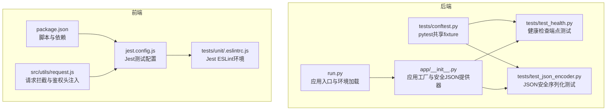
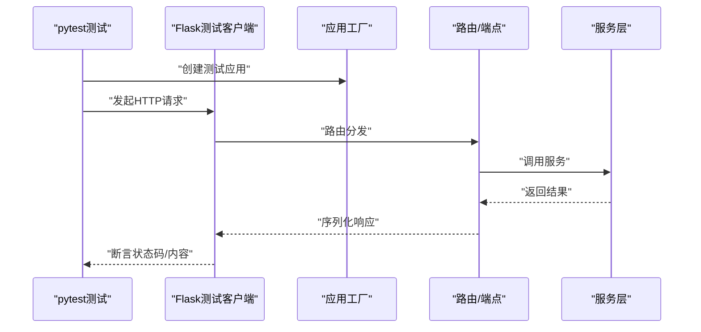
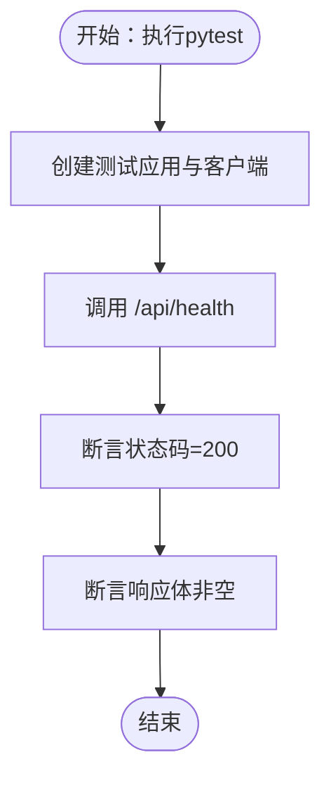
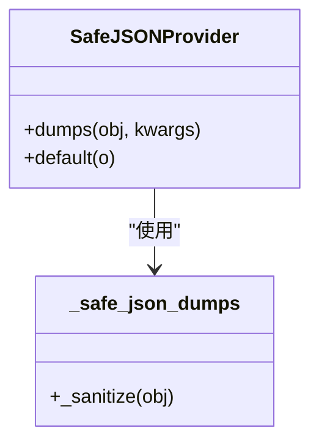
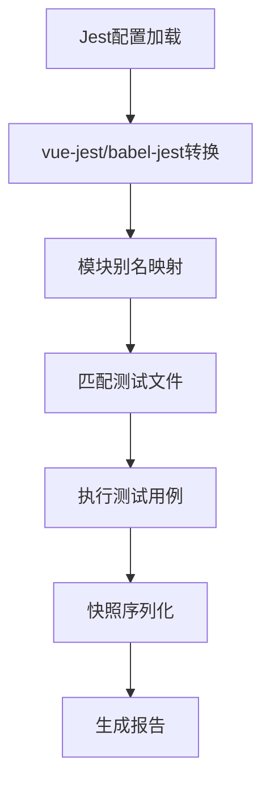
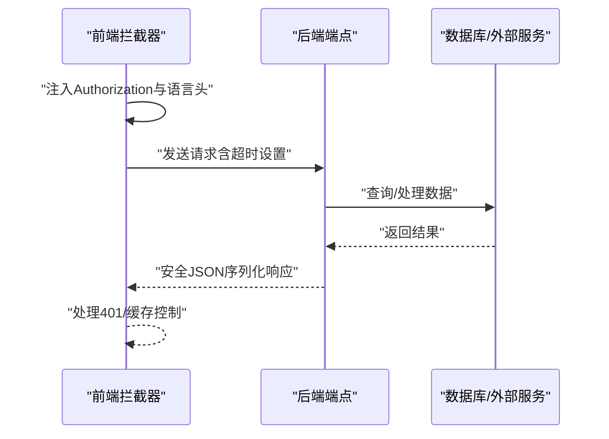
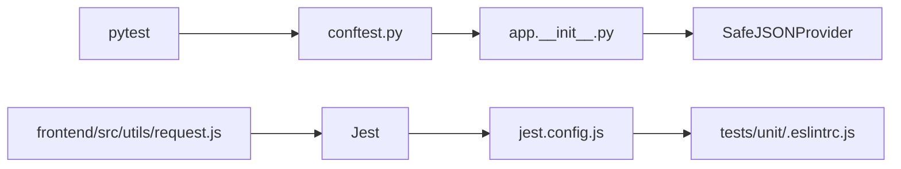

# 测试策略

<cite>
**本文引用的文件**
- [backend_api_python/tests/conftest.py](file://backend_api_python/tests/conftest.py)
- [backend_api_python/tests/test_health.py](file://backend_api_python/tests/test_health.py)
- [backend_api_python/tests/test_json_encoder.py](file://backend_api_python/tests/test_json_encoder.py)
- [backend_api_python/app/__init__.py](file://backend_api_python/app/__init__.py)
- [backend_api_python/run.py](file://backend_api_python/run.py)
- [frontend/jest.config.js](file://frontend/jest.config.js)
- [frontend/tests/unit/.eslintrc.js](file://frontend/tests/unit/.eslintrc.js)
- [frontend/package.json](file://frontend/package.json)
- [frontend/src/utils/request.js](file://frontend/src/utils/request.js)
</cite>

## 目录
1. [引言](#引言)
2. [项目结构](#项目结构)
3. [核心组件](#核心组件)
4. [架构总览](#架构总览)
5. [详细组件分析](#详细组件分析)
6. [依赖分析](#依赖分析)
7. [性能考虑](#性能考虑)
8. [故障排查指南](#故障排查指南)
9. [结论](#结论)
10. [附录](#附录)

## 引言
本文件面向QuantDinger项目的测试体系，系统化阐述后端Python测试框架（pytest）与前端Vue组件测试（Jest）的实施策略，覆盖单元测试、集成测试与端到端测试的落地方法；明确API接口测试流程、测试用例编写规范、测试数据准备与持续集成配置建议；并给出测试覆盖率目标与性能测试方法指引，帮助团队建立稳定、可维护、可扩展的测试工程能力。

## 项目结构
- 后端Python测试位于 backend_api_python/tests，采用pytest组织，通过conftest.py提供共享fixture与最小化测试环境。
- 前端测试位于 frontend/tests/unit，采用Jest + vue-jest进行单测，配合ESLint规则约束。
- 关键运行入口与应用工厂位于 backend_api_python/run.py 与 backend_api_python/app/__init__.py，负责应用初始化、JSON序列化安全与路由注册等。

图表来源
- [backend_api_python/tests/conftest.py:1-31](file://backend_api_python/tests/conftest.py#L1-L31)
- [backend_api_python/tests/test_health.py:1-10](file://backend_api_python/tests/test_health.py#L1-L10)
- [backend_api_python/tests/test_json_encoder.py:1-36](file://backend_api_python/tests/test_json_encoder.py#L1-L36)
- [backend_api_python/app/__init__.py:1-288](file://backend_api_python/app/__init__.py#L1-L288)
- [backend_api_python/run.py:1-134](file://backend_api_python/run.py#L1-L134)
- [frontend/jest.config.js:1-24](file://frontend/jest.config.js#L1-L24)
- [frontend/tests/unit/.eslintrc.js:1-6](file://frontend/tests/unit/.eslintrc.js#L1-L6)
- [frontend/package.json:1-85](file://frontend/package.json#L1-L85)
- [frontend/src/utils/request.js:1-217](file://frontend/src/utils/request.js#L1-L217)

章节来源
- [backend_api_python/tests/conftest.py:1-31](file://backend_api_python/tests/conftest.py#L1-L31)
- [backend_api_python/tests/test_health.py:1-10](file://backend_api_python/tests/test_health.py#L1-L10)
- [backend_api_python/tests/test_json_encoder.py:1-36](file://backend_api_python/tests/test_json_encoder.py#L1-L36)
- [backend_api_python/app/__init__.py:1-288](file://backend_api_python/app/__init__.py#L1-L288)
- [backend_api_python/run.py:1-134](file://backend_api_python/run.py#L1-L134)
- [frontend/jest.config.js:1-24](file://frontend/jest.config.js#L1-L24)
- [frontend/tests/unit/.eslintrc.js:1-6](file://frontend/tests/unit/.eslintrc.js#L1-L6)
- [frontend/package.json:1-85](file://frontend/package.json#L1-L85)
- [frontend/src/utils/request.js:1-217](file://frontend/src/utils/request.js#L1-L217)

## 核心组件
- 后端pytest共享fixture
  - 在会话级提供测试应用实例与测试客户端，确保测试隔离与最小化配置。
- 健康检查端点测试
  - 验证服务可用性与返回格式一致性。
- JSON安全序列化测试
  - 验证NaN/Inf被转换为null，保证前后端兼容性。
- 应用工厂与安全JSON提供器
  - 自定义JSON序列化器，递归替换非法数值，确保输出符合RFC 8259。
- 前端Jest测试配置
  - 支持Vue组件、JS/TS与静态资源的转换，模块别名映射与快照序列化。
- 请求拦截与鉴权头注入
  - 统一注入Authorization与多语言头，处理401重定向与缓存控制。

章节来源
- [backend_api_python/tests/conftest.py:1-31](file://backend_api_python/tests/conftest.py#L1-L31)
- [backend_api_python/tests/test_health.py:1-10](file://backend_api_python/tests/test_health.py#L1-L10)
- [backend_api_python/tests/test_json_encoder.py:1-36](file://backend_api_python/tests/test_json_encoder.py#L1-L36)
- [backend_api_python/app/__init__.py:16-52](file://backend_api_python/app/__init__.py#L16-L52)
- [frontend/jest.config.js:1-24](file://frontend/jest.config.js#L1-L24)
- [frontend/src/utils/request.js:36-177](file://frontend/src/utils/request.js#L36-L177)

## 架构总览
后端测试通过pytest驱动，利用应用工厂创建隔离的测试应用上下文；前端测试通过Jest与vue-jest解析组件，结合拦截器模拟网络行为与鉴权流程。整体测试架构强调：
- 单元测试：针对函数/类/模块的最小可验证单元。
- 集成测试：围绕API端点与服务交互，验证路由、序列化与业务逻辑。
- 端到端测试：结合前端拦截器与后端端点，验证用户场景闭环。

图表来源
- [backend_api_python/tests/conftest.py:19-31](file://backend_api_python/tests/conftest.py#L19-L31)
- [backend_api_python/app/__init__.py:213-288](file://backend_api_python/app/__init__.py#L213-L288)

## 详细组件分析

### 后端pytest测试套件
- 共享fixture
  - 会话级app fixture创建测试应用，开启TESTING标志，避免生产配置影响。
  - 客户端fixture提供测试客户端，支持GET/POST等HTTP方法。
- 健康检查端点测试
  - 覆盖GET /api/health，断言200状态与非空JSON响应。
- JSON安全序列化测试
  - 断言NaN/Inf在序列化后为null，普通浮点数保持不变，嵌套结构同样生效。

图表来源
- [backend_api_python/tests/conftest.py:19-31](file://backend_api_python/tests/conftest.py#L19-L31)
- [backend_api_python/tests/test_health.py:4-10](file://backend_api_python/tests/test_health.py#L4-L10)

章节来源
- [backend_api_python/tests/conftest.py:1-31](file://backend_api_python/tests/conftest.py#L1-L31)
- [backend_api_python/tests/test_health.py:1-10](file://backend_api_python/tests/test_health.py#L1-L10)
- [backend_api_python/tests/test_json_encoder.py:1-36](file://backend_api_python/tests/test_json_encoder.py#L1-L36)

### 安全JSON序列化实现
- 自定义JSON提供器SafeJSONProvider
  - 重写dumps与_sanitize递归处理NaN/Inf，确保输出合法JSON。
- 应用工厂启用自定义JSON提供器
  - 在应用初始化阶段设置app.json_provider_class与app.json。

图表来源
- [backend_api_python/app/__init__.py:16-52](file://backend_api_python/app/__init__.py#L16-L52)

章节来源
- [backend_api_python/app/__init__.py:16-52](file://backend_api_python/app/__init__.py#L16-L52)

### 前端Jest测试配置与用例编写
- Jest配置
  - 模块扩展、转换规则（vue-jest、babel-jest、样式/图片stub）、模块别名、快照序列化与测试匹配模式。
- ESLint环境
  - 为Jest启用jest环境变量，便于静态检查。
- 用例编写指南
  - 命名规范：以被测功能命名，如“should render correctly”。
  - 断言规范：优先使用语义化断言，避免脆弱断言；对异步操作使用await与超时控制。
  - Mock策略：对外部依赖（API、存储）进行合理Mock，隔离测试边界。
  - 快照测试：对UI组件快照进行版本管理，变更需审阅差异。
- 测试数据准备
  - 使用工厂函数生成稳定、可重复的数据；对随机性场景使用固定种子或显式伪随机。
  - 对鉴权与会话：通过拦截器注入Authorization头，或在测试中模拟登录状态。
- 前端拦截器与鉴权头
  - 统一注入Authorization与多语言头；处理401重定向与缓存控制；对AI分析、回测等长耗时接口设置合适超时。

图表来源
- [frontend/jest.config.js:1-24](file://frontend/jest.config.js#L1-L24)
- [frontend/tests/unit/.eslintrc.js:1-6](file://frontend/tests/unit/.eslintrc.js#L1-L6)

章节来源
- [frontend/jest.config.js:1-24](file://frontend/jest.config.js#L1-L24)
- [frontend/tests/unit/.eslintrc.js:1-6](file://frontend/tests/unit/.eslintrc.js#L1-L6)
- [frontend/src/utils/request.js:36-177](file://frontend/src/utils/request.js#L36-L177)

### API接口测试流程
- 端点发现与文档
  - 应用工厂集成Flasgger，提供Swagger文档；可在测试中访问文档端点辅助理解接口契约。
- 鉴权与会话
  - 前端拦截器统一注入Authorization头；后端端点需正确解析与校验令牌。
- 超时与稳定性
  - 针对AI分析、回测等长耗时接口，前端设置较长超时；后端端点需具备合理的超时与错误处理。
- 数据一致性
  - JSON序列化遵循RFC 8259，避免NaN/Inf导致的前端解析异常。

图表来源
- [frontend/src/utils/request.js:94-177](file://frontend/src/utils/request.js#L94-L177)
- [backend_api_python/app/__init__.py:232-249](file://backend_api_python/app/__init__.py#L232-L249)

章节来源
- [frontend/src/utils/request.js:36-177](file://frontend/src/utils/request.js#L36-L177)
- [backend_api_python/app/__init__.py:213-288](file://backend_api_python/app/__init__.py#L213-L288)

## 依赖分析
- 后端
  - pytest依赖于应用工厂与测试客户端；测试用例依赖共享fixture提供的app与client。
  - JSON安全序列化依赖应用工厂中的SafeJSONProvider。
- 前端
  - Jest配置依赖模块别名与转换规则；ESLint依赖jest环境；组件测试依赖vue-jest与@vue/test-utils。
  - 请求拦截器依赖存储与通知组件，用于鉴权与错误提示。

图表来源
- [backend_api_python/tests/conftest.py:1-31](file://backend_api_python/tests/conftest.py#L1-L31)
- [backend_api_python/app/__init__.py:16-52](file://backend_api_python/app/__init__.py#L16-L52)
- [frontend/jest.config.js:1-24](file://frontend/jest.config.js#L1-L24)
- [frontend/tests/unit/.eslintrc.js:1-6](file://frontend/tests/unit/.eslintrc.js#L1-L6)
- [frontend/src/utils/request.js:1-217](file://frontend/src/utils/request.js#L1-L217)

章节来源
- [backend_api_python/tests/conftest.py:1-31](file://backend_api_python/tests/conftest.py#L1-L31)
- [backend_api_python/app/__init__.py:16-52](file://backend_api_python/app/__init__.py#L16-L52)
- [frontend/jest.config.js:1-24](file://frontend/jest.config.js#L1-L24)
- [frontend/tests/unit/.eslintrc.js:1-6](file://frontend/tests/unit/.eslintrc.js#L1-L6)
- [frontend/src/utils/request.js:1-217](file://frontend/src/utils/request.js#L1-L217)

## 性能考虑
- 单元测试
  - 使用最小化fixture与内存态数据，避免外部依赖；对IO密集型逻辑进行Mock。
- 集成测试
  - 控制并发与超时，避免端点抖动；对长耗时端点（如AI分析、回测）设置合理超时。
- 前端测试
  - 合理拆分测试文件，减少不必要的渲染；对UI组件使用浅渲染与快照对比。
- 覆盖率
  - 建议后端与前端核心模块覆盖率不低于80%，关键路径不低于90%；对分支与异常路径进行专项覆盖。

## 故障排查指南
- 后端
  - 环境变量缺失：确保SECRET_KEY、ADMIN_USER、ADMIN_PASSWORD、TQDM_DISABLE、CACHE_ENABLED等在测试环境中设置。
  - JSON序列化异常：确认使用SafeJSONProvider，避免NaN/Inf直接输出。
  - 端点未响应：检查路由注册与应用工厂初始化顺序。
- 前端
  - 模块别名报错：核对jest.config.js中的moduleNameMapper与实际导入路径。
  - 鉴权失败：检查拦截器是否正确注入Authorization头，以及401重定向逻辑。
  - 超时问题：根据接口类型调整ANALYSIS_TIMEOUT、AI_GENERATE_TIMEOUT、BACKTEST_TIMEOUT。

章节来源
- [backend_api_python/tests/conftest.py:8-13](file://backend_api_python/tests/conftest.py#L8-L13)
- [backend_api_python/app/__init__.py:16-52](file://backend_api_python/app/__init__.py#L16-L52)
- [frontend/jest.config.js:13-22](file://frontend/jest.config.js#L13-L22)
- [frontend/src/utils/request.js:94-177](file://frontend/src/utils/request.js#L94-L177)

## 结论
QuantDinger的测试策略以pytest与Jest为核心，结合应用工厂的安全JSON序列化与前端拦截器，构建了从单元到集成再到端到端的完整测试闭环。建议在CI中强制执行测试与覆盖率检查，并针对长耗时接口与鉴权流程进行专项优化与回归验证，持续提升系统的稳定性与可维护性。

## 附录
- 测试脚本与命令
  - 后端pytest：通过pytest命令运行tests目录下的测试用例。
  - 前端Jest：通过package.json中的脚本运行单元测试。
- 持续集成配置建议
  - 在CI流水线中分别执行后端与前端测试；对覆盖率进行阈值检查；对关键分支（主干、发布分支）强制通过。

章节来源
- [frontend/package.json:5-14](file://frontend/package.json#L5-L14)