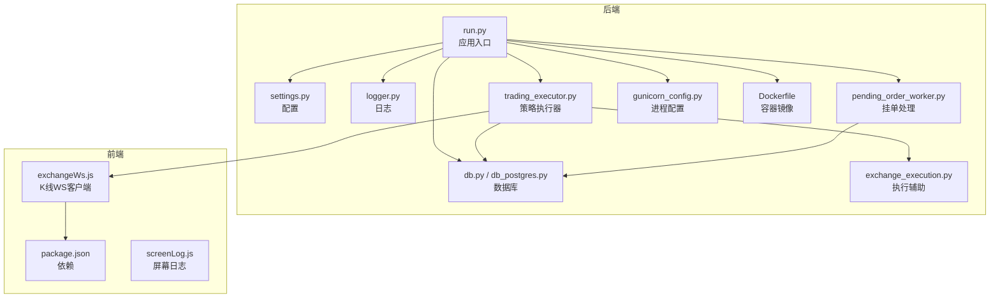
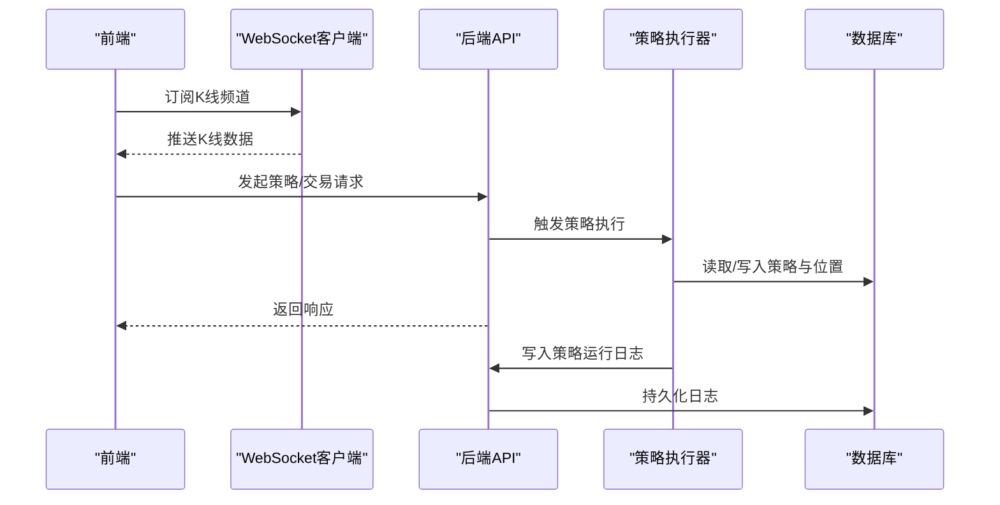
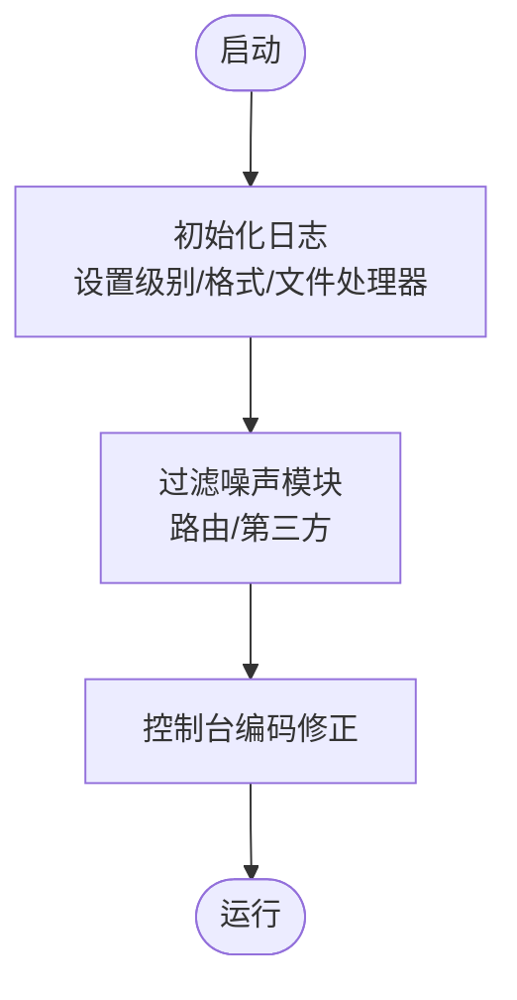
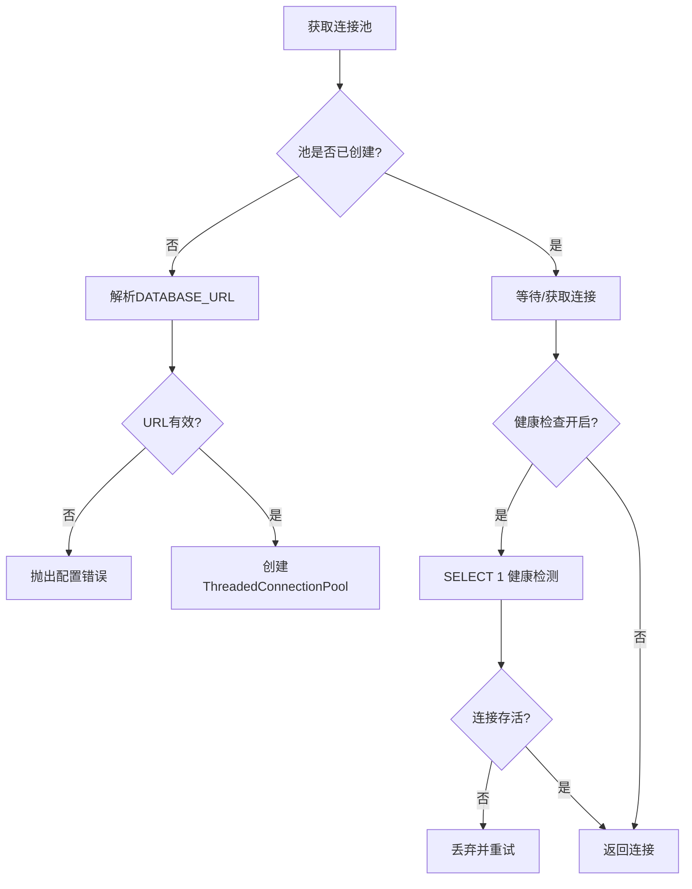
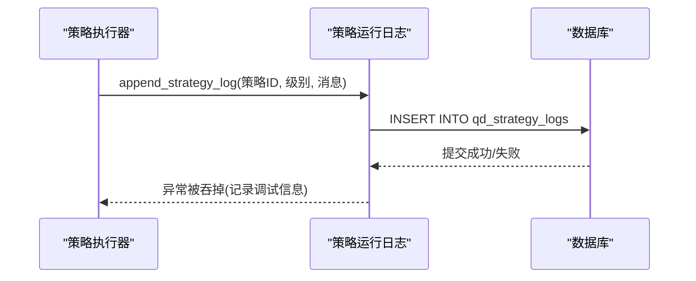
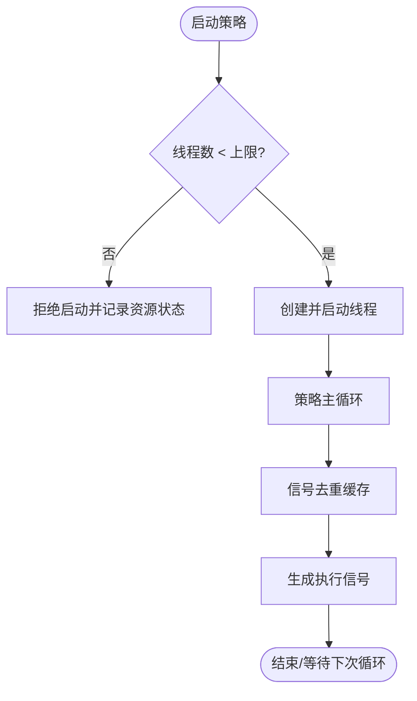
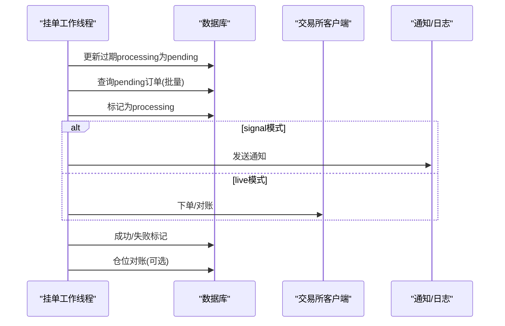
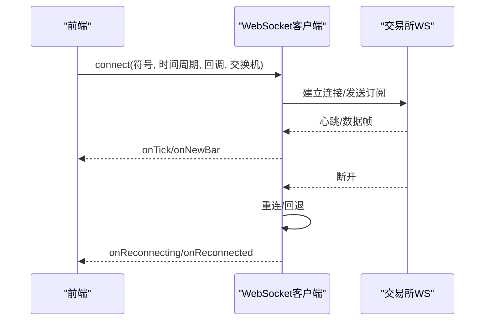
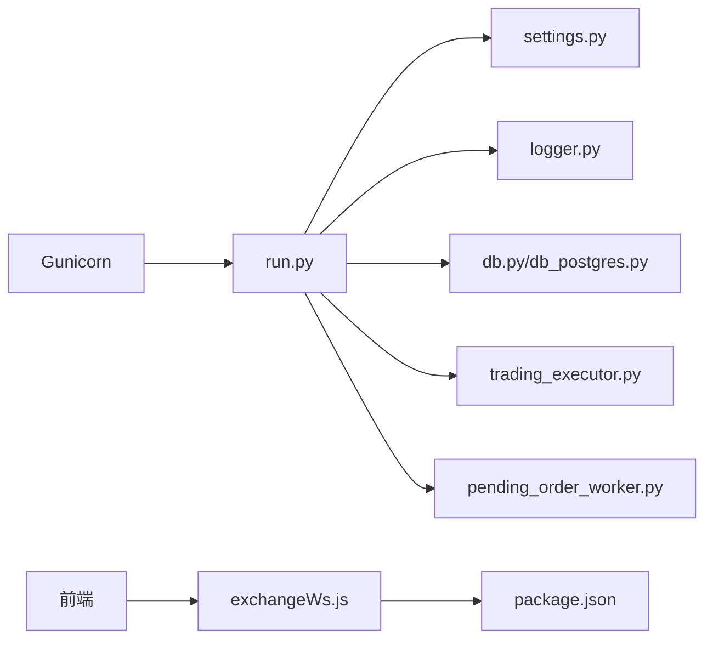

# 调试技巧

<cite>
**本文引用的文件**
- [run.py](file://backend_api_python/run.py)
- [logger.py](file://backend_api_python/app/utils/logger.py)
- [db.py](file://backend_api_python/app/utils/db.py)
- [db_postgres.py](file://backend_api_python/app/utils/db_postgres.py)
- [strategy_runtime_logs.py](file://backend_api_python/app/utils/strategy_runtime_logs.py)
- [settings.py](file://backend_api_python/app/config/settings.py)
- [gunicorn_config.py](file://backend_api_python/gunicorn_config.py)
- [Dockerfile](file://backend_api_python/Dockerfile)
- [exchange_execution.py](file://backend_api_python/app/services/exchange_execution.py)
- [trading_executor.py](file://backend_api_python/app/services/trading_executor.py)
- [pending_order_worker.py](file://backend_api_python/app/services/pending_order_worker.py)
- [exchangeWs.js](file://frontend/src/utils/exchangeWs.js)
- [screenLog.js](file://frontend/src/utils/screenLog.js)
- [package.json](file://frontend/package.json)
</cite>

## 目录
1. [简介](#简介)
2. [项目结构](#项目结构)
3. [核心组件](#核心组件)
4. [架构总览](#架构总览)
5. [详细组件分析](#详细组件分析)
6. [依赖分析](#依赖分析)
7. [性能考虑](#性能考虑)
8. [故障排查指南](#故障排查指南)
9. [结论](#结论)
10. [附录](#附录)

## 简介
本指南聚焦于QuantDinger在开发与运维过程中的调试方法与技巧，覆盖后端日志分析、前端控制台调试、数据库查询优化、策略运行时错误排查、WebSocket连接诊断以及性能瓶颈定位。文档同时给出常用调试命令、断点设置建议、错误追踪技巧，并提供常见问题的案例与解决方案，帮助开发者快速定位与解决问题。

## 项目结构
QuantDinger采用前后端分离架构：
- 后端：Python Flask应用，通过Gunicorn部署，提供REST API与实时交易执行能力；日志、数据库、WebSocket客户端等均在后端实现。
- 前端：Vue 2应用，负责可视化展示与交互，包含K线图、策略编辑器、通知面板等；WebSocket客户端封装了多交易所K线订阅。

图表来源
- [run.py:104-134](file://backend_api_python/run.py#L104-L134)
- [settings.py:1-99](file://backend_api_python/app/config/settings.py#L1-L99)
- [logger.py:9-63](file://backend_api_python/app/utils/logger.py#L9-L63)
- [db.py:19-66](file://backend_api_python/app/utils/db.py#L19-L66)
- [db_postgres.py:107-162](file://backend_api_python/app/utils/db_postgres.py#L107-L162)
- [exchange_execution.py:118-149](file://backend_api_python/app/services/exchange_execution.py#L118-L149)
- [trading_executor.py:37-102](file://backend_api_python/app/services/trading_executor.py#L37-L102)
- [pending_order_worker.py:52-90](file://backend_api_python/app/services/pending_order_worker.py#L52-L90)
- [gunicorn_config.py:1-36](file://backend_api_python/gunicorn_config.py#L1-L36)
- [Dockerfile:1-56](file://backend_api_python/Dockerfile#L1-L56)
- [exchangeWs.js:214-283](file://frontend/src/utils/exchangeWs.js#L214-L283)
- [package.json:1-85](file://frontend/package.json#L1-L85)
- [screenLog.js:1-5](file://frontend/src/utils/screenLog.js#L1-L5)

章节来源
- [run.py:104-134](file://backend_api_python/run.py#L104-L134)
- [settings.py:1-99](file://backend_api_python/app/config/settings.py#L1-L99)
- [gunicorn_config.py:1-36](file://backend_api_python/gunicorn_config.py#L1-L36)
- [Dockerfile:1-56](file://backend_api_python/Dockerfile#L1-L56)

## 核心组件
- 应用入口与启动：后端通过run.py加载环境变量、代理配置、安全检查并启动Flask应用；生产环境使用Gunicorn。
- 日志系统：logger.py统一配置日志级别、过滤噪声、输出到文件与控制台。
- 数据库层：db.py与db_postgres.py提供连接池、健康检查、占位符兼容与SQL执行封装。
- 策略运行日志：strategy_runtime_logs.py将策略运行时日志持久化至数据库，便于UI查看。
- 配置中心：settings.py集中管理主机、端口、日志、速率限制等功能开关。
- 实时交易执行：trading_executor.py负责策略线程管理、信号去重、资源监控与脚本执行上下文构建。
- 挂单处理：pending_order_worker.py轮询待处理订单，按执行模式分发通知或实盘执行。
- 前端WebSocket：exchangeWs.js封装多交易所K线订阅、心跳、重连与回退逻辑。

章节来源
- [run.py:104-134](file://backend_api_python/run.py#L104-L134)
- [logger.py:9-63](file://backend_api_python/app/utils/logger.py#L9-L63)
- [db.py:19-66](file://backend_api_python/app/utils/db.py#L19-L66)
- [db_postgres.py:107-162](file://backend_api_python/app/utils/db_postgres.py#L107-L162)
- [strategy_runtime_logs.py:11-30](file://backend_api_python/app/utils/strategy_runtime_logs.py#L11-L30)
- [settings.py:1-99](file://backend_api_python/app/config/settings.py#L1-L99)
- [trading_executor.py:37-102](file://backend_api_python/app/services/trading_executor.py#L37-L102)
- [pending_order_worker.py:52-90](file://backend_api_python/app/services/pending_order_worker.py#L52-L90)
- [exchangeWs.js:214-283](file://frontend/src/utils/exchangeWs.js#L214-L283)

## 架构总览
后端以Flask为核心，通过Gunicorn承载并发请求；实时交易由策略执行器与挂单工作线程协作完成；前端通过WebSocket订阅K线数据并与后端API交互。

图表来源
- [exchangeWs.js:214-283](file://frontend/src/utils/exchangeWs.js#L214-L283)
- [run.py:104-134](file://backend_api_python/run.py#L104-L134)
- [trading_executor.py:775-800](file://backend_api_python/app/services/trading_executor.py#L775-L800)
- [strategy_runtime_logs.py:11-30](file://backend_api_python/app/utils/strategy_runtime_logs.py#L11-L30)

## 详细组件分析

### 组件A：日志系统与调试入口
- 关键点
  - 全局日志初始化：设置级别、格式、文件处理器与滚动策略。
  - 特定模块降噪：如路由与第三方库噪声过滤。
  - 控制台输出：Windows下UTF-8编码修正，避免中文乱码。
- 调试建议
  - 临时提升日志级别观察细节。
  - 使用模块级日志器区分策略、执行器、数据库等子系统。
  - 结合文件轮转定位历史问题。

图表来源
- [logger.py:9-63](file://backend_api_python/app/utils/logger.py#L9-L63)
- [run.py:7-15](file://backend_api_python/run.py#L7-L15)

章节来源
- [logger.py:9-63](file://backend_api_python/app/utils/logger.py#L9-L63)
- [run.py:7-15](file://backend_api_python/run.py#L7-L15)

### 组件B：数据库连接与查询优化
- 关键点
  - 连接池：最小/最大连接、获取超时、健康检查可调。
  - URL解析与校验：缺失或格式错误会触发异常。
  - 占位符兼容：自动转换?为%。
  - 健康检查：空闲连接回收与重试。
- 调试建议
  - 观察池耗尽告警，调整DB_POOL_MAX与DB_POOL_ACQUIRE_TIMEOUT。
  - 使用慢查询日志与EXPLAIN分析热点SQL。
  - 避免长事务，及时提交或回滚。

图表来源
- [db_postgres.py:107-162](file://backend_api_python/app/utils/db_postgres.py#L107-L162)
- [db_postgres.py:184-235](file://backend_api_python/app/utils/db_postgres.py#L184-L235)
- [db_postgres.py:244-339](file://backend_api_python/app/utils/db_postgres.py#L244-L339)

章节来源
- [db.py:19-66](file://backend_api_python/app/utils/db.py#L19-L66)
- [db_postgres.py:107-162](file://backend_api_python/app/utils/db_postgres.py#L107-L162)
- [db_postgres.py:184-235](file://backend_api_python/app/utils/db_postgres.py#L184-L235)
- [db_postgres.py:244-339](file://backend_api_python/app/utils/db_postgres.py#L244-L339)

### 组件C：策略运行时日志与UI联动
- 关键点
  - 最佳努力插入：异常不向调用方传播。
  - 字段截断与清洗：长度限制与空白处理。
- 调试建议
  - 在UI中查看策略日志，结合后端日志定位脚本异常。
  - 使用低级别日志记录中间状态，避免过度打印。

图表来源
- [strategy_runtime_logs.py:11-30](file://backend_api_python/app/utils/strategy_runtime_logs.py#L11-L30)
- [trading_executor.py:438](file://backend_api_python/app/services/trading_executor.py#L438)

章节来源
- [strategy_runtime_logs.py:11-30](file://backend_api_python/app/utils/strategy_runtime_logs.py#L11-L30)
- [trading_executor.py:438](file://backend_api_python/app/services/trading_executor.py#L438)

### 组件D：实时交易执行器与资源监控
- 关键点
  - 线程上限与去重：防止线程爆炸与重复下单。
  - 资源状态打印：内存、线程数、运行策略数。
  - 符号规范化：不同交易所统一符号格式。
- 调试建议
  - 当出现“无法启动新线程”或OOM时，检查线程上限与资源使用。
  - 使用去重机制排查重复信号来源。

图表来源
- [trading_executor.py:393-445](file://backend_api_python/app/services/trading_executor.py#L393-L445)
- [trading_executor.py:239-289](file://backend_api_python/app/services/trading_executor.py#L239-L289)
- [trading_executor.py:147-174](file://backend_api_python/app/services/trading_executor.py#L147-L174)

章节来源
- [trading_executor.py:393-445](file://backend_api_python/app/services/trading_executor.py#L393-L445)
- [trading_executor.py:239-289](file://backend_api_python/app/services/trading_executor.py#L239-L289)
- [trading_executor.py:147-174](file://backend_api_python/app/services/trading_executor.py#L147-L174)

### 组件E：挂单处理与实盘执行
- 关键点
  - 批量轮询与去重：处理过期“处理中”订单。
  - 执行模式：signal通知与live实盘（当前为纸面模式）。
  - 仓位对账：按策略维度与允许符号集进行对账与修复。
- 调试建议
  - 观察“requeue stale processing”提示，调整PENDING_ORDER_STALE_SEC。
  - 对账失败时检查交易所客户端与符号映射。

图表来源
- [pending_order_worker.py:91-122](file://backend_api_python/app/services/pending_order_worker.py#L91-L122)
- [pending_order_worker.py:637-684](file://backend_api_python/app/services/pending_order_worker.py#L637-L684)
- [pending_order_worker.py:712-799](file://backend_api_python/app/services/pending_order_worker.py#L712-L799)
- [pending_order_worker.py:138-636](file://backend_api_python/app/services/pending_order_worker.py#L138-L636)

章节来源
- [pending_order_worker.py:91-122](file://backend_api_python/app/services/pending_order_worker.py#L91-L122)
- [pending_order_worker.py:637-684](file://backend_api_python/app/services/pending_order_worker.py#L637-L684)
- [pending_order_worker.py:712-799](file://backend_api_python/app/services/pending_order_worker.py#L712-L799)
- [pending_order_worker.py:138-636](file://backend_api_python/app/services/pending_order_worker.py#L138-L636)

### 组件F：前端WebSocket与K线流
- 关键点
  - 多交易所适配：Binance、OKX、Bitget、Bybit、Gate。
  - 回退机制：首选交换机失败时自动回退至Binance。
  - 心跳与重连：定时ping、指数退避重连。
- 调试建议
  - 观察onReconnecting/onReconnected回调，定位网络波动。
  - 若非Binance订阅无数据，检查订阅参数与时间周期映射。

图表来源
- [exchangeWs.js:246-264](file://frontend/src/utils/exchangeWs.js#L246-L264)
- [exchangeWs.js:318-384](file://frontend/src/utils/exchangeWs.js#L318-L384)
- [exchangeWs.js:453-465](file://frontend/src/utils/exchangeWs.js#L453-L465)
- [exchangeWs.js:386-410](file://frontend/src/utils/exchangeWs.js#L386-L410)

章节来源
- [exchangeWs.js:246-264](file://frontend/src/utils/exchangeWs.js#L246-L264)
- [exchangeWs.js:318-384](file://frontend/src/utils/exchangeWs.js#L318-L384)
- [exchangeWs.js:453-465](file://frontend/src/utils/exchangeWs.js#L453-L465)
- [exchangeWs.js:386-410](file://frontend/src/utils/exchangeWs.js#L386-L410)

## 依赖分析
- 后端依赖
  - 进程模型：Gunicorn gthread，避免预加载导致后台线程丢失。
  - 容器镜像：Python 3.12 Slim，最小化运行时依赖。
- 前端依赖
  - 图表与可视化：ECharts、轻量图表库等。
  - 请求与状态：Axios、Vuex、路由等。

图表来源
- [gunicorn_config.py:1-36](file://backend_api_python/gunicorn_config.py#L1-L36)
- [run.py:104-134](file://backend_api_python/run.py#L104-L134)
- [settings.py:1-99](file://backend_api_python/app/config/settings.py#L1-L99)
- [logger.py:9-63](file://backend_api_python/app/utils/logger.py#L9-L63)
- [db.py:19-66](file://backend_api_python/app/utils/db.py#L19-L66)
- [db_postgres.py:107-162](file://backend_api_python/app/utils/db_postgres.py#L107-L162)
- [trading_executor.py:37-102](file://backend_api_python/app/services/trading_executor.py#L37-L102)
- [pending_order_worker.py:52-90](file://backend_api_python/app/services/pending_order_worker.py#L52-L90)
- [exchangeWs.js:214-283](file://frontend/src/utils/exchangeWs.js#L214-L283)
- [package.json:1-85](file://frontend/package.json#L1-L85)

章节来源
- [gunicorn_config.py:1-36](file://backend_api_python/gunicorn_config.py#L1-L36)
- [Dockerfile:1-56](file://backend_api_python/Dockerfile#L1-L56)
- [package.json:1-85](file://frontend/package.json#L1-L85)

## 性能考虑
- 连接池与超时
  - 调整DB_POOL_MIN/DB_POOL_MAX与DB_POOL_ACQUIRE_TIMEOUT，避免池耗尽。
  - 开启健康检查会增加SELECT 1开销，按需启用。
- 线程与资源
  - 通过STRATEGY_MAX_THREADS限制策略线程数，避免“无法启动新线程”。
  - 使用资源状态打印定位内存与线程峰值。
- WebSocket
  - 合理的心跳间隔与指数退避，降低抖动带来的重连风暴。
- 日志
  - 控制台与文件输出，避免高频INFO刷屏；必要时临时提升级别。

[本节为通用指导，无需列出具体文件来源]

## 故障排查指南

### 后端日志分析
- 常见问题
  - 日志乱码：确认控制台编码已修正。
  - 路由噪音：特定模块日志级别已降噪。
  - 文件落盘：检查日志目录与轮转配置。
- 建议步骤
  - 查看启动日志中的安全密钥检查与服务绑定信息。
  - 定位数据库连接异常与池耗尽告警。
  - 结合策略运行日志与执行器错误堆栈定位脚本问题。

章节来源
- [run.py:7-15](file://backend_api_python/run.py#L7-L15)
- [logger.py:9-63](file://backend_api_python/app/utils/logger.py#L9-L63)
- [db_postgres.py:205-216](file://backend_api_python/app/utils/db_postgres.py#L205-L216)

### 前端控制台调试
- 常见问题
  - WebSocket断连：观察onReconnecting/onReconnected回调。
  - 订阅无数据：检查时间周期映射与交易所别名解析。
  - 屏幕日志：printANSI占位，可扩展为ANSI彩色输出。
- 建议步骤
  - 在浏览器控制台监听事件，验证URL构建与订阅消息。
  - 切换回退交换机，确认是否为特定交易所问题。

章节来源
- [exchangeWs.js:318-384](file://frontend/src/utils/exchangeWs.js#L318-L384)
- [exchangeWs.js:453-465](file://frontend/src/utils/exchangeWs.js#L453-L465)
- [exchangeWs.js:386-410](file://frontend/src/utils/exchangeWs.js#L386-L410)
- [screenLog.js:1-5](file://frontend/src/utils/screenLog.js#L1-L5)

### 数据库查询优化
- 常见问题
  - 连接池耗尽：提高最大连接或缩短获取超时。
  - 长事务：导致连接占用与死锁风险。
  - 占位符不兼容：使用内置转换逻辑。
- 建议步骤
  - 使用EXPLAIN分析慢查询，建立索引。
  - 分批处理与事务边界控制，避免长时间持有连接。
  - 通过健康检查与连接回收避免“坏连接”污染池。

章节来源
- [db_postgres.py:107-162](file://backend_api_python/app/utils/db_postgres.py#L107-L162)
- [db_postgres.py:184-235](file://backend_api_python/app/utils/db_postgres.py#L184-L235)
- [db_postgres.py:244-339](file://backend_api_python/app/utils/db_postgres.py#L244-L339)

### 策略运行时错误排查
- 常见症状
  - 线程数达到上限：拒绝启动新策略。
  - 重复下单：信号去重未生效。
  - 资源不足：内存/线程数异常。
- 建议步骤
  - 检查STRATEGY_MAX_THREADS与资源状态打印。
  - 核对去重键生成与时间窗口。
  - 查看策略运行日志与脚本异常堆栈。

章节来源
- [trading_executor.py:410-416](file://backend_api_python/app/services/trading_executor.py#L410-L416)
- [trading_executor.py:239-289](file://backend_api_python/app/services/trading_executor.py#L239-L289)
- [trading_executor.py:147-174](file://backend_api_python/app/services/trading_executor.py#L147-L174)
- [strategy_runtime_logs.py:11-30](file://backend_api_python/app/utils/strategy_runtime_logs.py#L11-L30)

### WebSocket连接问题诊断
- 常见症状
  - 连接超时：8秒超时后回退。
  - 无数据：非Binance订阅12秒内无数据回退。
  - 断连重连：指数退避与最大尝试次数。
- 建议步骤
  - 检查订阅参数与时间周期映射。
  - 观察onReconnecting回调频率，评估网络质量。
  - 切换回退交换机验证问题范围。

章节来源
- [exchangeWs.js:306-317](file://frontend/src/utils/exchangeWs.js#L306-L317)
- [exchangeWs.js:339-352](file://frontend/src/utils/exchangeWs.js#L339-L352)
- [exchangeWs.js:453-465](file://frontend/src/utils/exchangeWs.js#L453-L465)
- [exchangeWs.js:386-410](file://frontend/src/utils/exchangeWs.js#L386-L410)

### 常见问题案例与解决方案
- 案例1：数据库连接失败
  - 现象：启动时报错提示无法连接或URL格式错误。
  - 处理：检查DATABASE_URL、解析逻辑与psycopg2安装状态。
- 案例2：策略无法启动
  - 现象：线程数已达上限，拒绝启动。
  - 处理：降低并发策略数或提高STRATEGY_MAX_THREADS。
- 案例3：WebSocket无数据
  - 现象：连接成功但无K线推送。
  - 处理：切换回退交换机，检查订阅参数与时间周期映射。
- 案例4：挂单积压
  - 现象：订单长时间处于processing。
  - 处理：调整PENDING_ORDER_STALE_SEC，检查交易所客户端与网络。

章节来源
- [db_postgres.py:121-128](file://backend_api_python/app/utils/db_postgres.py#L121-L128)
- [trading_executor.py:410-416](file://backend_api_python/app/services/trading_executor.py#L410-L416)
- [exchangeWs.js:339-352](file://frontend/src/utils/exchangeWs.js#L339-L352)
- [pending_order_worker.py:637-684](file://backend_api_python/app/services/pending_order_worker.py#L637-L684)

## 结论
通过统一的日志体系、健壮的数据库连接池、精细化的策略执行与挂单处理、以及完善的前端WebSocket回退机制，QuantDinger在开发与运维中具备良好的可观测性与可调试性。遵循本文提供的调试流程与最佳实践，可快速定位并解决大多数运行时问题。

[本节为总结性内容，无需列出具体文件来源]

## 附录

### 常用调试命令与环境变量
- 后端
  - 启动开发服务器：python run.py
  - 生产部署：gunicorn -c gunicorn_config.py "run:app"
  - 环境变量示例：LOG_LEVEL、DATABASE_URL、DB_POOL_MAX、STRATEGY_MAX_THREADS、PENDING_ORDER_STALE_SEC
- 前端
  - 启动开发服务器：npm run serve
  - 构建产物：npm run build

章节来源
- [run.py:104-134](file://backend_api_python/run.py#L104-L134)
- [gunicorn_config.py:1-36](file://backend_api_python/gunicorn_config.py#L1-L36)
- [Dockerfile:47-55](file://backend_api_python/Dockerfile#L47-L55)
- [package.json:5-14](file://frontend/package.json#L5-L14)