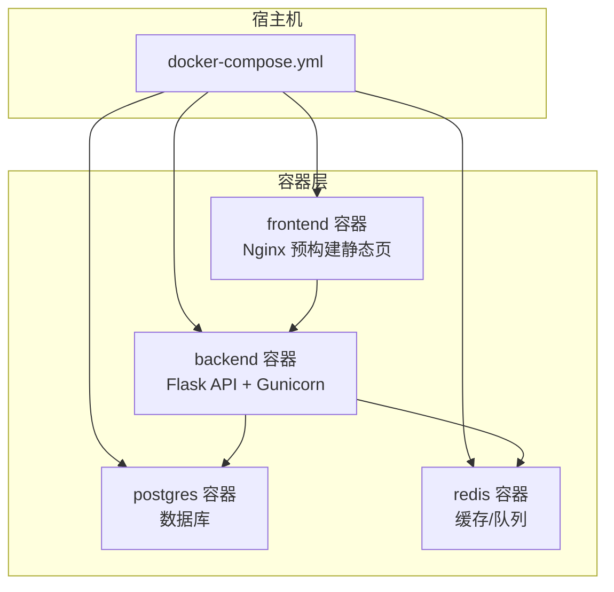
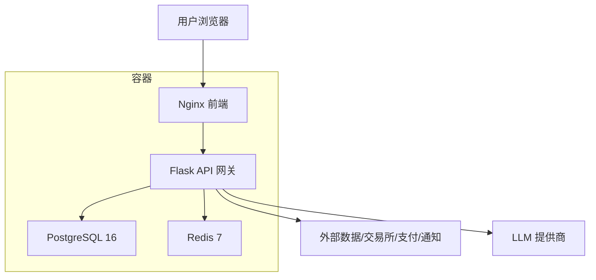
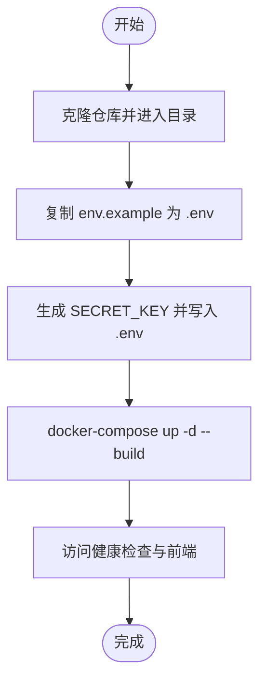
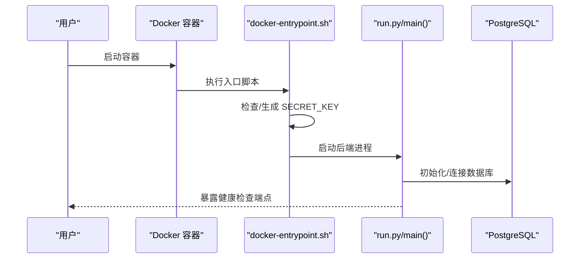
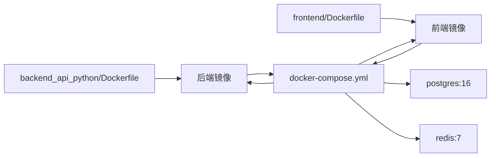

# 快速开始

<cite>
**本文引用的文件**
- [README.md](file://README.md)
- [backend_api_python/README.md](file://backend_api_python/README.md)
- [docker-compose.yml](file://docker-compose.yml)
- [backend_api_python/Dockerfile](file://backend_api_python/Dockerfile)
- [frontend/Dockerfile](file://frontend/Dockerfile)
- [backend_api_python/env.example](file://backend_api_python/env.example)
- [scripts/generate-secret-key.sh](file://scripts/generate-secret-key.sh)
- [scripts/generate-secret-key.ps1](file://scripts/generate-secret-key.ps1)
- [backend_api_python/docker-entrypoint.sh](file://backend_api_python/docker-entrypoint.sh)
- [backend_api_python/start.sh](file://backend_api_python/start.sh)
- [backend_api_python/run.py](file://backend_api_python/run.py)
- [backend_api_python/requirements.txt](file://backend_api_python/requirements.txt)
- [backend_api_python/requirements-windows.txt](file://backend_api_python/requirements-windows.txt)
- [frontend/build-docker.sh](file://frontend/build-docker.sh)
- [frontend/build-docker.ps1](file://frontend/build-docker.ps1)
</cite>

## 目录
1. [简介](#简介)
2. [项目结构](#项目结构)
3. [核心组件](#核心组件)
4. [架构总览](#架构总览)
5. [详细组件解析](#详细组件解析)
6. [依赖关系分析](#依赖关系分析)
7. [性能与资源建议](#性能与资源建议)
8. [故障排除指南](#故障排除指南)
9. [结论](#结论)
10. [附录](#附录)

## 简介
QuantDinger 是一个自托管、本地优先的量化交易与算法交易平台，支持 AI 市场研究、Python 指标与策略开发、回测、实盘执行、组合监控与告警，并内置多用户、计费与商业化能力。默认采用 Docker Compose 一键部署，包含前端、后端、PostgreSQL、Redis 与健康检查。

- 快速体验：复制示例配置、生成密钥、一键启动
- 默认访问：前端 http://localhost:8888；后端健康检查 http://localhost:5000/api/health
- 初始登录：quantumquant / 123456（首次启动时会创建管理员账户）

**章节来源**
- [README.md:36-49](file://README.md#L36-L49)
- [README.md:327-359](file://README.md#L327-L359)

## 项目结构
仓库采用前后端分离与容器化部署的组织方式：
- backend_api_python：Flask 后端、路由、服务、迁移脚本、Dockerfile、.env 示例
- frontend：预构建前端镜像（Nginx）与构建脚本
- docs：产品与部署文档
- docker-compose.yml：编排后端、前端、数据库、缓存与健康检查
- scripts：辅助脚本（如生成 SECRET_KEY）

**图表来源**
- [docker-compose.yml:23-163](file://docker-compose.yml#L23-L163)

**章节来源**
- [README.md:466-484](file://README.md#L466-L484)

## 核心组件
- 后端 API（Flask + Gunicorn）
  - 通过 .env 加载配置，支持代理、数据库连接池、并发参数等
  - 提供健康检查、认证、指标与回测、AI 分析、交易执行等接口
- 数据库（PostgreSQL 16）
  - 初始化脚本自动创建表结构；连接字符串由 DATABASE_URL 控制
- 缓存（Redis 7）
  - 可选缓存与队列支持，提升并发与任务处理能力
- 前端（Nginx 预构建）
  - 直接提供静态页面，无需本地 Node.js 构建

**章节来源**
- [backend_api_python/README.md:15-33](file://backend_api_python/README.md#L15-L33)
- [backend_api_python/README.md:135-141](file://backend_api_python/README.md#L135-L141)
- [docker-compose.yml:27-150](file://docker-compose.yml#L27-L150)

## 架构总览
下图展示从浏览器到后端、数据库与外部服务的整体交互路径。

**图表来源**
- [README.md:269-321](file://README.md#L269-L321)
- [docker-compose.yml:23-163](file://docker-compose.yml#L23-L163)

## 详细组件解析

### 安装与启动流程（Docker 一键部署）
- 克隆仓库并进入目录
- 复制后端示例配置为实际 .env
- 生成安全的 SECRET_KEY 并写入 .env
- 使用 docker-compose 启动全部服务（后台构建与运行）

**图表来源**
- [README.md:327-359](file://README.md#L327-L359)
- [scripts/generate-secret-key.sh:1-34](file://scripts/generate-secret-key.sh#L1-L34)
- [scripts/generate-secret-key.ps1:1-32](file://scripts/generate-secret-key.ps1#L1-L32)

**章节来源**
- [README.md:327-359](file://README.md#L327-L359)

### Windows 与 Linux/macOS 的不同安装方式
- Linux/macOS（Bash）
  - 使用 bash 脚本生成 SECRET_KEY 并启动
- Windows（PowerShell）
  - 使用 PowerShell 脚本生成 SECRET_KEY 并启动

提示：若需自定义端口或镜像源，可在根目录创建 .env（非必需），其中可设置 FRONTEND_PORT、BACKEND_PORT、IMAGE_PREFIX 等。

**章节来源**
- [README.md:327-359](file://README.md#L327-L359)
- [README.md:371-379](file://README.md#L371-L379)

### .env 关键配置项说明
以下为常用配置区域与要点（请以 backend_api_python/env.example 为准）：
- 认证与安全
  - SECRET_KEY：必须替换为随机安全密钥，否则生产模式拒绝启动
  - ADMIN_USER / ADMIN_PASSWORD：首次启动创建管理员账户
  - ENABLE_REGISTRATION：是否开放注册
- 数据库
  - DATABASE_URL：PostgreSQL 连接串（Docker 默认已注入）
  - DB_POOL_MIN / DB_POOL_MAX / DB_POOL_ACQUIRE_TIMEOUT：连接池参数
- AI/LLM
  - LLM_PROVIDER：选择提供商（OpenRouter/OpenAI/Gemini 等）
  - OPENROUTER_API_KEY / OPENAI_API_KEY / GOOGLE_API_KEY 等：对应提供商密钥
  - OPENROUTER_MODEL / OPENAI_MODEL / GOOGLE_MODEL：默认模型
- 工作线程与并发
  - GUNICORN_WORKERS / GUNICORN_THREADS：生产服务器并发模型
  - MARKET_EXECUTOR_WORKERS / PORTFOLIO_EXECUTOR_WORKERS：路由级并行取数执行器
- 缓存与代理
  - REDIS_HOST / REDIS_PORT / CACHE_ENABLED：启用 Redis 缓存
  - PROXY_URL：出站代理（请求库会自动设置 HTTP_PROXY/HTTPS_PROXY）
  - LIVE_TRADING_CA_BUNDLE / LIVE_TRADING_SSL_VERIFY：实盘交易证书校验
- OAuth 与验证码
  - TURNSTILE_SITE_KEY / TURNSTILE_SECRET_KEY：Cloudflare Turnstile
  - GOOGLE_CLIENT_ID / GOOGLE_CLIENT_SECRET / GITHUB_CLIENT_ID / GITHUB_CLIENT_SECRET：OAuth 客户端凭据
- 计费与会员
  - BILLING_ENABLED：开启计费功能
  - MEMBERSHIP_* 与 USDT 支付相关：会员价格、积分、USDT TRC20 收款与链上确认
- 其他
  - FRONTEND_URL / OAUTH_ALLOWED_REDIRECTS：前端地址与 OAuth 回跳白名单
  - RATE_LIMIT / ENABLE_CACHE / ENABLE_REQUEST_LOG：请求限流与日志开关

**章节来源**
- [backend_api_python/env.example:1-268](file://backend_api_python/env.example#L1-L268)

### 后端启动与安全检查
- Docker 入口脚本会在启动前检查并自动补全 SECRET_KEY，避免使用默认值
- run.py 在生产模式下若检测到默认 SECRET_KEY，会自动生成随机密钥并提示持久化配置
- 健康检查端点：http://localhost:5000/api/health

**图表来源**
- [backend_api_python/docker-entrypoint.sh:1-49](file://backend_api_python/docker-entrypoint.sh#L1-L49)
- [backend_api_python/run.py:104-134](file://backend_api_python/run.py#L104-L134)
- [docker-compose.yml:123-127](file://docker-compose.yml#L123-L127)

**章节来源**
- [backend_api_python/docker-entrypoint.sh:11-44](file://backend_api_python/docker-entrypoint.sh#L11-L44)
- [backend_api_python/run.py:109-120](file://backend_api_python/run.py#L109-L120)
- [docker-compose.yml:123-127](file://docker-compose.yml#L123-L127)

### 健康检查与初始登录
- 健康检查：http://localhost:5000/api/health
- 前端：http://localhost:8888
- 初始管理员账号：quantumquant / 123456（首次启动创建）

**章节来源**
- [README.md:348-353](file://README.md#L348-L353)

## 依赖关系分析
- 后端镜像基于 Python 3.12 slim，安装运行时依赖与生产服务器 Gunicorn
- 前端镜像基于 Nginx，直接提供预构建静态资源
- docker-compose 将后端挂载 .env 以便动态更新配置与管理员面板

**图表来源**
- [backend_api_python/Dockerfile:1-56](file://backend_api_python/Dockerfile#L1-L56)
- [frontend/Dockerfile:1-33](file://frontend/Dockerfile#L1-L33)
- [docker-compose.yml:23-163](file://docker-compose.yml#L23-L163)

**章节来源**
- [backend_api_python/Dockerfile:1-56](file://backend_api_python/Dockerfile#L1-L56)
- [frontend/Dockerfile:1-33](file://frontend/Dockerfile#L1-L33)
- [docker-compose.yml:23-163](file://docker-compose.yml#L23-L163)

## 性能与资源建议
- 数据库连接池
  - DB_POOL_MIN / DB_POOL_MAX：根据并发与机器人数量调整，确保 PG 最大连接数高于池上限
  - DB_POOL_ACQUIRE_TIMEOUT：连接池耗尽时的等待时间
- 并发与执行器
  - GUNICORN_WORKERS × GUNICORN_THREADS：生产环境并发模型
  - MARKET_EXECUTOR_WORKERS + PORTFOLIO_EXECUTOR_WORKERS：路由级并行取数执行器，应低于 DB_POOL_MAX
- 缓存
  - 启用 Redis 并设置 CACHE_ENABLED，有助于多工作节点共享状态与加速查询

**章节来源**
- [backend_api_python/env.example:42-62](file://backend_api_python/env.example#L42-L62)
- [docker-compose.yml:108-120](file://docker-compose.yml#L108-L120)

## 故障排除指南
- 后端无法启动（SECRET_KEY 默认值）
  - 症状：容器启动即退出或报错
  - 处理：生成并写入安全的 SECRET_KEY，或在 .env 中显式设置
  - 参考：入口脚本与 run.py 的安全检查逻辑
- 数据库连接失败
  - 症状：后端日志出现连接错误
  - 处理：检查 DATABASE_URL 格式、网络连通性与 PostgreSQL 健康状态
- 出站请求失败（代理/SSL）
  - 症状：访问外部数据/LLM/支付接口异常
  - 处理：设置 PROXY_URL；必要时配置 LIVE_TRADING_CA_BUNDLE 或关闭 SSL 校验（仅测试）
- 健康检查失败
  - 症状：curl 返回 5xx 或超时
  - 处理：查看后端日志、确认数据库与缓存可用、检查端口映射

**章节来源**
- [backend_api_python/docker-entrypoint.sh:25-44](file://backend_api_python/docker-entrypoint.sh#L25-L44)
- [backend_api_python/run.py:109-120](file://backend_api_python/run.py#L109-L120)
- [backend_api_python/README.md:231-237](file://backend_api_python/README.md#L231-L237)

## 结论
通过 Docker Compose 一键部署，QuantDinger 可在几分钟内完成安装与启动。建议在首次使用前完成 .env 的关键配置（尤其是 SECRET_KEY、数据库、LLM 提供商与可选的 OAuth/计费设置），并在生产环境中固定并妥善保管密钥与凭据。

## 附录

### 常用 Docker 命令
- 查看服务状态：docker-compose ps
- 实时查看后端日志：docker-compose logs -f backend
- 重启后端：docker-compose restart backend
- 重新构建并启动：docker-compose up -d --build
- 停止与清理：docker-compose down

**章节来源**
- [README.md:361-369](file://README.md#L361-L369)

### 本地开发（非 Docker）
- PostgreSQL 初始化：创建数据库与用户，并执行初始化 SQL
- 安装依赖：pip install -r requirements.txt
- 启动后端：python run.py
- 前端无需本地构建，使用预构建镜像即可

**章节来源**
- [backend_api_python/README.md:74-134](file://backend_api_python/README.md#L74-L134)

### Windows 特定依赖
- 若需要 MT5 交易支持，请在 Windows 系统安装 MetaTrader5 包

**章节来源**
- [backend_api_python/requirements-windows.txt:1-7](file://backend_api_python/requirements-windows.txt#L1-L7)