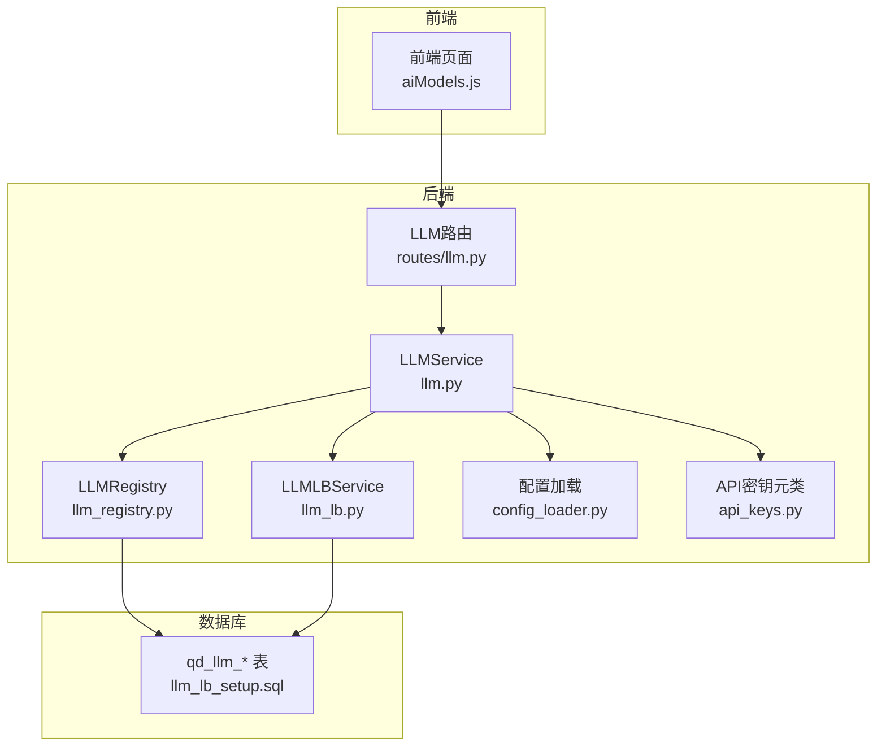
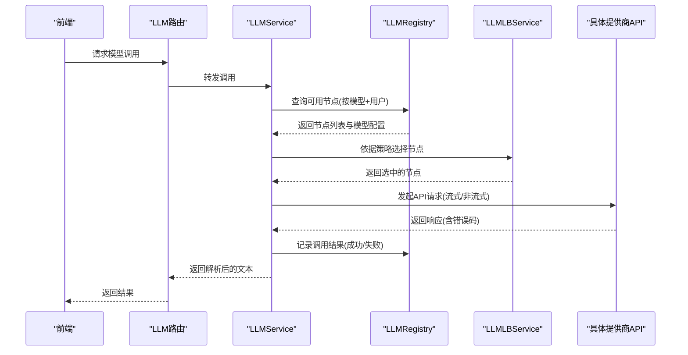
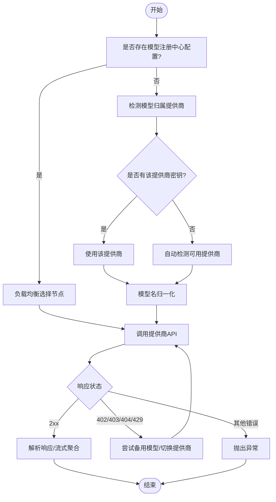
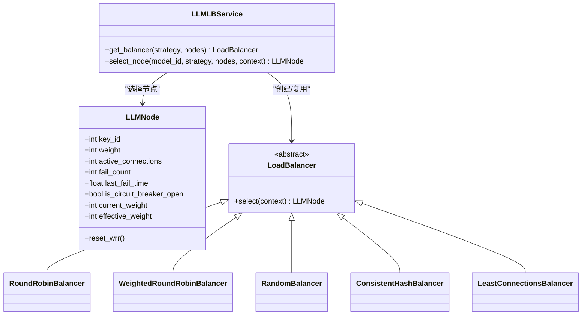
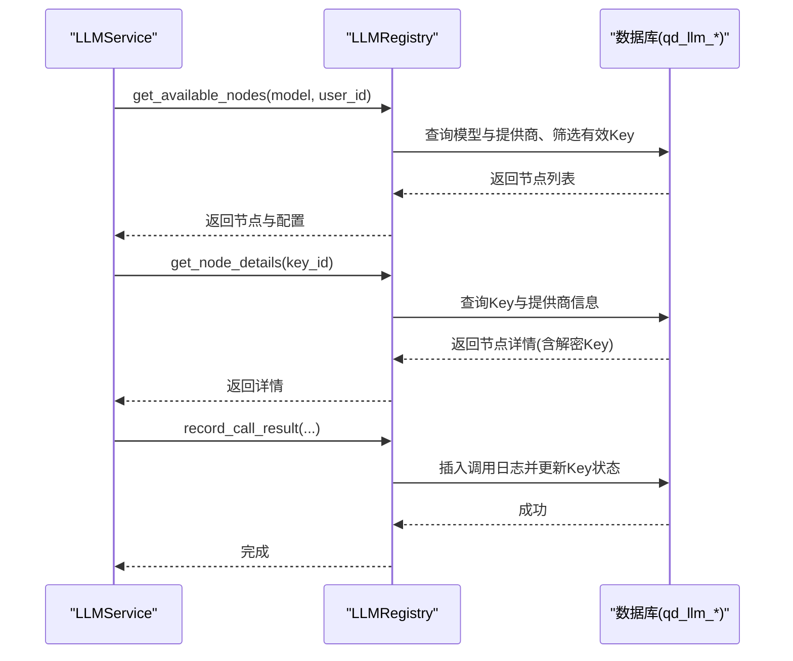
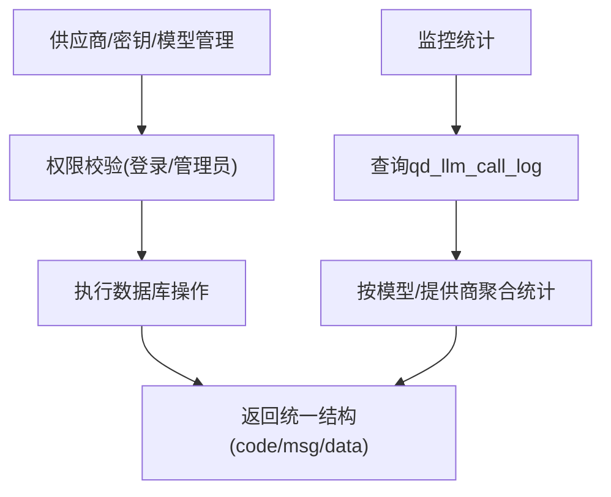
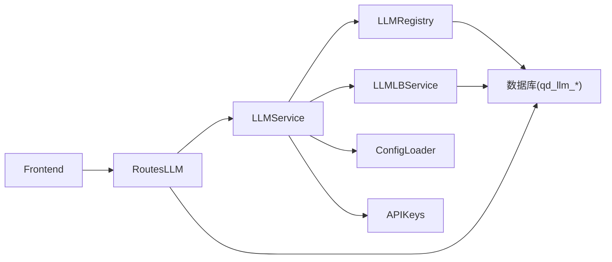

# AI模型集成

<cite>
**本文引用的文件**
- [llm.py](file://backend_api_python/app/services/llm.py)
- [llm_lb.py](file://backend_api_python/app/services/llm_lb.py)
- [llm_registry.py](file://backend_api_python/app/services/llm_registry.py)
- [llm.py（路由）](file://backend_api_python/app/routes/llm.py)
- [api_keys.py](file://backend_api_python/app/config/api_keys.py)
- [config_loader.py](file://backend_api_python/app/utils/config_loader.py)
- [llm_lb_setup.sql](file://backend_api_python/migrations/llm_lb_setup.sql)
- [aiModels.js](file://frontend/src/config/aiModels.js)
- [LLM 负载均衡调用系统设计方案.md](file://docs/LLM 负载均衡调用系统设计方案.md)
- [ai_chat.py](file://backend_api_python/app/route/ai_chat.py)
</cite>

## 目录
1. [简介](#简介)
2. [项目结构](#项目结构)
3. [核心组件](#核心组件)
4. [架构总览](#架构总览)
5. [组件详解](#组件详解)
6. [依赖关系分析](#依赖关系分析)
7. [性能考量](#性能考量)
8. [故障排查指南](#故障排查指南)
9. [结论](#结论)
10. [附录](#附录)

## 简介
本指南面向希望在QuantDinger中接入新的大语言模型或AI服务提供商的开发者，系统讲解如何实现LLMProvider接口、构建负载均衡与模型注册中心、完成配置与请求处理、响应解析与错误重试，并提供测试、性能监控与成本控制的最佳实践。文档以仓库现有实现为基础，结合数据库表结构与前后端交互，给出可操作的集成步骤与可视化图示。

## 项目结构
后端采用Python Flask微服务，AI模型集成主要分布在以下模块：
- 服务层：LLMService负责统一调用、模型归一化、错误处理与备用提供商切换；LLMLBService与LLMRegistry分别负责负载均衡与注册中心。
- 路由层：提供LLM供应商、API Key、模型与监控的REST接口。
- 配置层：通过环境变量与本地配置加载器读取LLM相关参数。
- 前端：提供模型映射与UI配置入口。

**图表来源**
- [llm.py:73-800](file://backend_api_python/app/services/llm.py#L73-L800)
- [llm_lb.py:143-169](file://backend_api_python/app/services/llm_lb.py#L143-L169)
- [llm_registry.py:11-169](file://backend_api_python/app/services/llm_registry.py#L11-L169)
- [llm.py（路由）:1-723](file://backend_api_python/app/routes/llm.py#L1-L723)
- [config_loader.py:24-161](file://backend_api_python/app/utils/config_loader.py#L24-L161)
- [api_keys.py:148-164](file://backend_api_python/app/config/api_keys.py#L148-L164)
- [llm_lb_setup.sql:1-67](file://backend_api_python/migrations/llm_lb_setup.sql#L1-L67)

**章节来源**
- [llm.py:1-813](file://backend_api_python/app/services/llm.py#L1-L813)
- [llm_lb.py:1-169](file://backend_api_python/app/services/llm_lb.py#L1-L169)
- [llm_registry.py:1-169](file://backend_api_python/app/services/llm_registry.py#L1-L169)
- [llm.py（路由）:1-723](file://backend_api_python/app/routes/llm.py#L1-L723)
- [config_loader.py:1-252](file://backend_api_python/app/utils/config_loader.py#L1-L252)
- [api_keys.py:1-164](file://backend_api_python/app/config/api_keys.py#L1-L164)
- [llm_lb_setup.sql:1-67](file://backend_api_python/migrations/llm_lb_setup.sql#L1-L67)

## 核心组件
- LLMService：统一LLM调用入口，支持多提供商、模型归一化、备用模型与备用提供商、流式与非流式响应、安全JSON解析与回退结构。
- LLMLBService：负载均衡调度器，提供多种策略（轮询、加权轮询、随机、一致性哈希、最少连接）。
- LLMRegistry：模型注册中心，提供可用节点查询、节点详情与调用结果记录、熔断与健康状态维护。
- 路由LLM：提供供应商、API Key、模型与监控接口，支持管理员与用户权限。
- 配置与密钥：通过环境变量与本地配置加载器读取LLM相关参数，APIKeys元类集中管理第三方密钥。

**章节来源**
- [llm.py:73-800](file://backend_api_python/app/services/llm.py#L73-L800)
- [llm_lb.py:143-169](file://backend_api_python/app/services/llm_lb.py#L143-L169)
- [llm_registry.py:11-169](file://backend_api_python/app/services/llm_registry.py#L11-L169)
- [llm.py（路由）:1-723](file://backend_api_python/app/routes/llm.py#L1-L723)
- [config_loader.py:24-161](file://backend_api_python/app/utils/config_loader.py#L24-L161)
- [api_keys.py:148-164](file://backend_api_python/app/config/api_keys.py#L148-L164)

## 架构总览
下图展示了从前端到后端服务、注册中心与数据库的整体调用链路，以及负载均衡与熔断机制的协作方式。

**图表来源**
- [llm.py:470-722](file://backend_api_python/app/services/llm.py#L470-L722)
- [llm_registry.py:18-168](file://backend_api_python/app/services/llm_registry.py#L18-L168)
- [llm_lb.py:143-169](file://backend_api_python/app/services/llm_lb.py#L143-L169)
- [llm.py（路由）:1-723](file://backend_api_python/app/routes/llm.py#L1-L723)

## 组件详解

### LLMService：统一LLM调用与模型归一化
- 提供多提供商支持与自动检测逻辑，优先使用显式配置，其次自动探测可用密钥，最后回退至OpenRouter。
- 支持OpenAI兼容与Google Gemini两类API调用路径，分别处理消息格式与响应结构。
- 流式响应处理：按Server-Sent Events逐块解析，聚合输出并具备部分结果回退能力。
- JSON模式请求：在兼容API上使用json_schema以提升稳定性。
- 模型归一化：将OpenRouter风格的“提供商/模型”映射到目标提供商的实际模型名，避免跨提供商模型名混用。
- 备用模型与备用提供商：当当前提供商返回402/403/404/429等可恢复错误时，按策略尝试备用模型或切换到其他提供商。
- 安全JSON解析：对LLM返回的Markdown夹带JSON进行清理与二次提取，失败时回退到默认结构并记录错误。

**图表来源**
- [llm.py:470-722](file://backend_api_python/app/services/llm.py#L470-L722)

**章节来源**
- [llm.py:22-800](file://backend_api_python/app/services/llm.py#L22-L800)

### LLMLBService：负载均衡策略与节点选择
- 节点抽象：LLMNode包含权重、活跃连接数、失败计数、熔断状态与平滑加权轮询所需字段。
- 策略实现：轮询、加权轮询、随机、一致性哈希、最少连接。
- 上下文感知：一致性哈希策略可接收用户ID等上下文键，保证同用户请求稳定落在同一节点。
- 节点复用：在节点集合未变化时复用已有负载均衡器实例，降低开销。

**图表来源**
- [llm_lb.py:7-169](file://backend_api_python/app/services/llm_lb.py#L7-L169)

**章节来源**
- [llm_lb.py:1-169](file://backend_api_python/app/services/llm_lb.py#L1-L169)

### LLMRegistry：模型注册中心与调用记录
- 可用节点查询：按模型名与用户ID筛选有效API Key，考虑公开密钥与拥有者权限。
- 节点详情：返回解密后的API Key与提供商基础信息。
- 模型配置：返回负载均衡策略、重试次数与超时等配置。
- 调用记录与熔断：插入调用日志，更新Key状态与失败计数，连续失败达到阈值时进入熔断状态，暂停使用一段时间。

**图表来源**
- [llm_registry.py:18-168](file://backend_api_python/app/services/llm_registry.py#L18-L168)

**章节来源**
- [llm_registry.py:1-169](file://backend_api_python/app/services/llm_registry.py#L1-L169)

### 路由LLM：供应商、API Key、模型与监控
- 供应商管理：列出、创建、更新供应商，支持API类型与基础URL配置。
- API Key管理：按用户权限列出、创建、更新密钥，支持权重、状态、备注与公私有切换。
- 模型管理：创建、更新模型，配置负载均衡策略、重试次数与超时。
- 监控统计：按模型与提供商统计最近24小时调用量、平均延迟与成功率。

**图表来源**
- [llm.py（路由）:13-723](file://backend_api_python/app/routes/llm.py#L13-L723)

**章节来源**
- [llm.py（路由）:1-723](file://backend_api_python/app/routes/llm.py#L1-L723)

### 配置与密钥：环境变量与本地配置
- 配置加载：将环境变量映射为嵌套配置结构，支持字符串、整数、浮点、布尔与JSON类型转换。
- API密钥：通过元类动态读取环境变量或本地配置，支持多提供商密钥。
- LLM Provider选择：优先使用显式配置，其次自动检测可用密钥，最后回退至OpenRouter。

**章节来源**
- [config_loader.py:24-252](file://backend_api_python/app/utils/config_loader.py#L24-L252)
- [api_keys.py:148-164](file://backend_api_python/app/config/api_keys.py#L148-L164)
- [llm.py:86-125](file://backend_api_python/app/services/llm.py#L86-L125)

### 数据库表结构：模型注册中心
- 供应商表：存储提供商基础信息与状态。
- API Key表：加密存储密钥，支持权重、状态、拥有者、公私有与失败计数。
- 模型表：存储模型名、显示名、负载均衡策略、重试次数与超时。
- 调用日志表：记录每次调用的Key、模型、用户、Token用量、延迟与状态码。

**章节来源**
- [llm_lb_setup.sql:1-67](file://backend_api_python/migrations/llm_lb_setup.sql#L1-L67)

### 前端模型映射：统一模型清单
- 前端提供统一的模型映射，采用OpenRouter风格的“提供商/模型”命名，便于后端进行模型归一化与提供商检测。

**章节来源**
- [aiModels.js:1-42](file://frontend/src/config/aiModels.js#L1-L42)

## 依赖关系分析
- LLMService依赖LLMRegistry进行节点与配置查询，依赖LLMLBService进行节点选择，依赖配置加载器与APIKeys元类读取环境变量与本地配置。
- LLMRegistry依赖数据库访问工具与加密工具进行密钥解密与状态更新。
- 路由LLM依赖认证与数据库访问工具，提供供应商、密钥、模型与监控接口。
- 前端通过模型映射与后端路由交互，实现模型选择与调用。

**图表来源**
- [llm.py:1-813](file://backend_api_python/app/services/llm.py#L1-L813)
- [llm_registry.py:1-169](file://backend_api_python/app/services/llm_registry.py#L1-L169)
- [llm_lb.py:1-169](file://backend_api_python/app/services/llm_lb.py#L1-L169)
- [llm.py（路由）:1-723](file://backend_api_python/app/routes/llm.py#L1-L723)
- [config_loader.py:1-252](file://backend_api_python/app/utils/config_loader.py#L1-L252)
- [api_keys.py:1-164](file://backend_api_python/app/config/api_keys.py#L1-L164)

**章节来源**
- [llm.py:1-813](file://backend_api_python/app/services/llm.py#L1-L813)
- [llm_registry.py:1-169](file://backend_api_python/app/services/llm_registry.py#L1-L169)
- [llm_lb.py:1-169](file://backend_api_python/app/services/llm_lb.py#L1-L169)
- [llm.py（路由）:1-723](file://backend_api_python/app/routes/llm.py#L1-L723)
- [config_loader.py:1-252](file://backend_api_python/app/utils/config_loader.py#L1-L252)
- [api_keys.py:1-164](file://backend_api_python/app/config/api_keys.py#L1-L164)

## 性能考量
- 负载均衡策略选择：在高并发场景建议使用“最少连接数”或“一致性哈希”，前者动态平衡压力，后者保证会话粘性。
- 超时与重试：根据模型特性与SLA设定合理超时与重试次数，避免雪崩效应。
- 流式响应：在支持流式的提供商上启用流式，减少首字节延迟，提升用户体验。
- 熔断与降级：当某Key连续失败达到阈值时自动熔断，避免拖垮整体服务；同时保留备用提供商与备用模型作为降级手段。
- 监控与告警：通过调用日志统计成功率、延迟与错误类型，结合阈值触发告警。

[本节为通用指导，无需特定文件来源]

## 故障排查指南
- API密钥问题（402/403）：检查对应提供商的API密钥是否配置正确、余额是否充足、模型权限是否开启。
- 模型不可用（404）：确认模型名是否正确、是否在目标提供商处可用。
- 网络超时（5xx/超时）：检查网络连通性、代理设置与超时配置。
- 流式解析错误：关注流式响应的SSE格式与部分结果回退逻辑，必要时关闭流式改用非流式。
- 熔断状态：查看API Key状态是否被标记为熔断，等待自动恢复或手动调整。

**章节来源**
- [llm.py:246-274](file://backend_api_python/app/services/llm.py#L246-L274)
- [llm.py:638-683](file://backend_api_python/app/services/llm.py#L638-L683)
- [llm_registry.py:113-168](file://backend_api_python/app/services/llm_registry.py#L113-L168)

## 结论
通过LLMService、LLMLBService与LLMRegistry的协同，QuantDinger实现了可扩展、可观测、可降级的AI模型集成体系。开发者只需遵循模型归一化规则、完善配置与密钥管理，并利用负载均衡与熔断机制，即可快速接入新的LLM提供商并实现稳定高效的生产级调用。

[本节为总结，无需特定文件来源]

## 附录

### 如何为新的LLM提供商创建AI模型集成插件
- 步骤1：在数据库中新增供应商记录（名称、编码、API类型、基础URL、状态）。
- 步骤2：在本地配置中设置该提供商的API密钥与可选参数（如base_url、model、timeout等）。
- 步骤3：在LLMService中扩展提供商枚举与默认配置，确保模型归一化与调用路径正确。
- 步骤4：在前端模型映射中添加该提供商的模型清单，确保“提供商/模型”命名规范。
- 步骤5：在路由LLM中创建/更新模型记录，配置负载均衡策略、重试次数与超时。
- 步骤6：部署并进行联调测试，观察监控面板的成功率、延迟与错误分布。

**章节来源**
- [llm.py（路由）:13-723](file://backend_api_python/app/routes/llm.py#L13-L723)
- [llm.py:22-70](file://backend_api_python/app/services/llm.py#L22-L70)
- [llm_lb_setup.sql:1-67](file://backend_api_python/migrations/llm_lb_setup.sql#L1-L67)
- [aiModels.js:1-42](file://frontend/src/config/aiModels.js#L1-L42)

### LLMProvider接口实现要求与负载均衡机制
- 接口实现要点：提供统一的调用入口、消息格式适配、响应解析与错误处理；支持流式与非流式两种模式；实现模型归一化与备用模型/提供商切换。
- 负载均衡机制：通过LLMLBService选择节点，结合LLMRegistry的节点状态与配置，实现多策略调度与熔断保护。

**章节来源**
- [llm.py:470-722](file://backend_api_python/app/services/llm.py#L470-L722)
- [llm_lb.py:143-169](file://backend_api_python/app/services/llm_lb.py#L143-L169)
- [llm_registry.py:18-168](file://backend_api_python/app/services/llm_registry.py#L18-L168)

### 完整AI模型集成示例（接入新提供商）
- 示例流程：新增供应商 → 配置密钥 → 更新模型 → 前端映射 → 路由管理 → 调用与监控。
- 关键点：确保“提供商/模型”命名与后端归一化逻辑一致；在路由中配置正确的负载均衡策略与重试次数；通过监控面板持续观测性能与成本。

**章节来源**
- [llm.py（路由）:523-659](file://backend_api_python/app/routes/llm.py#L523-L659)
- [llm.py:399-446](file://backend_api_python/app/services/llm.py#L399-L446)
- [aiModels.js:4-23](file://frontend/src/config/aiModels.js#L4-L23)

### 模型配置、请求处理、响应解析与错误重试
- 模型配置：在路由中创建/更新模型，设置lb_strategy、retries、timeout等。
- 请求处理：LLMService根据模型名与配置选择节点，构造请求并处理流式/非流式响应。
- 响应解析：统一解析JSON或文本，失败时回退到默认结构并记录错误。
- 错误重试：针对402/403/404/429等错误进行备用模型或备用提供商切换。

**章节来源**
- [llm.py（路由）:523-659](file://backend_api_python/app/routes/llm.py#L523-L659)
- [llm.py:470-722](file://backend_api_python/app/services/llm.py#L470-L722)

### AI模型测试、性能监控与成本控制最佳实践
- 测试：模拟不同错误码（402/403/404/429）、网络超时与流式解析异常，验证备用策略与回退逻辑。
- 监控：通过路由统计接口获取24小时调用指标，结合日志定位瓶颈。
- 成本控制：合理设置超时与重试，启用熔断避免无效调用；在前端限制高频请求；根据提供商价格策略选择合适模型。

**章节来源**
- [llm.py（路由）:663-723](file://backend_api_python/app/routes/llm.py#L663-L723)
- [llm.py:638-683](file://backend_api_python/app/services/llm.py#L638-L683)

### 模型注册中心与动态配置管理机制
- 注册中心：LLMRegistry提供节点查询、详情获取与调用记录，支撑负载均衡与熔断。
- 动态配置：通过环境变量与本地配置加载器实现运行时配置变更，支持LLM_PROVIDER与各提供商参数的热更新。

**章节来源**
- [llm_registry.py:18-168](file://backend_api_python/app/services/llm_registry.py#L18-L168)
- [config_loader.py:24-161](file://backend_api_python/app/utils/config_loader.py#L24-L161)