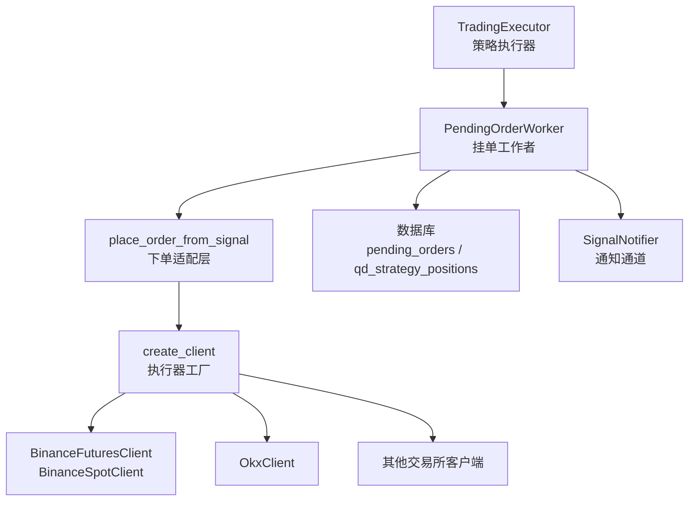
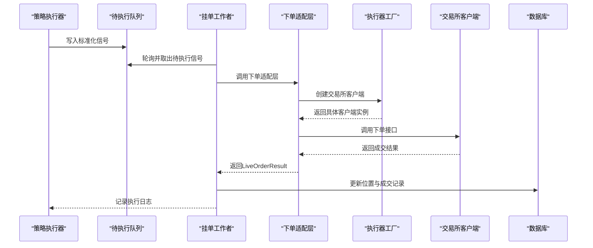
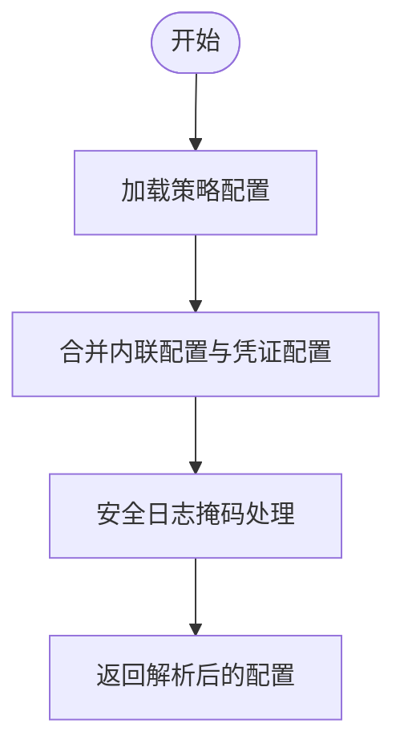
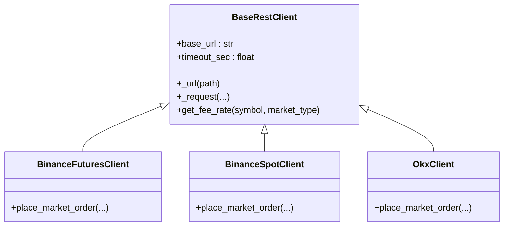
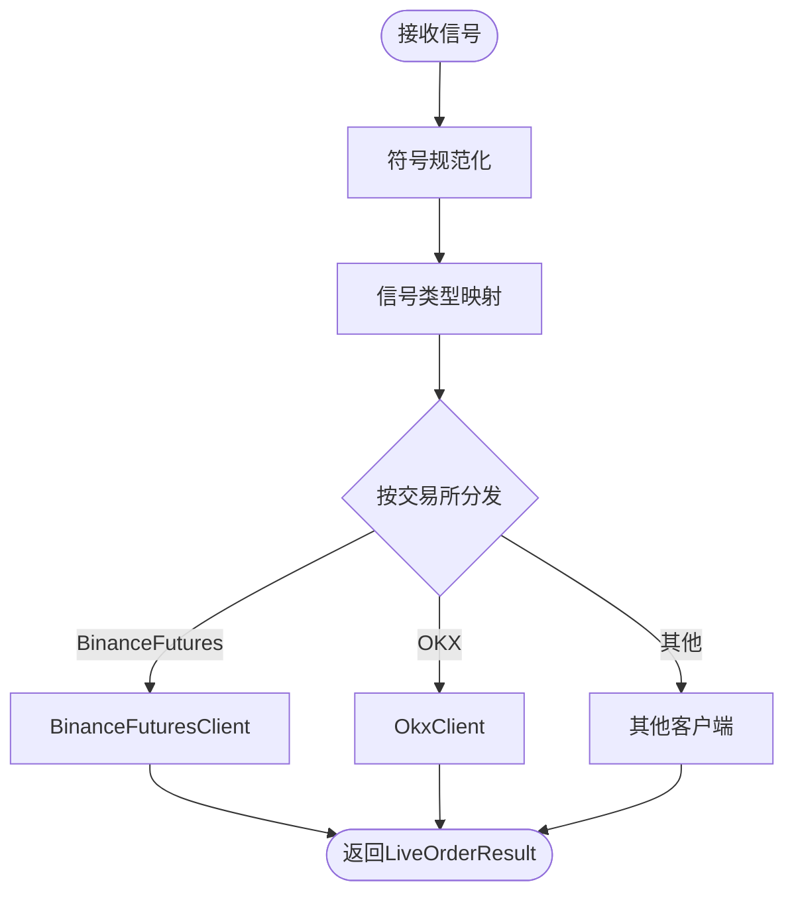
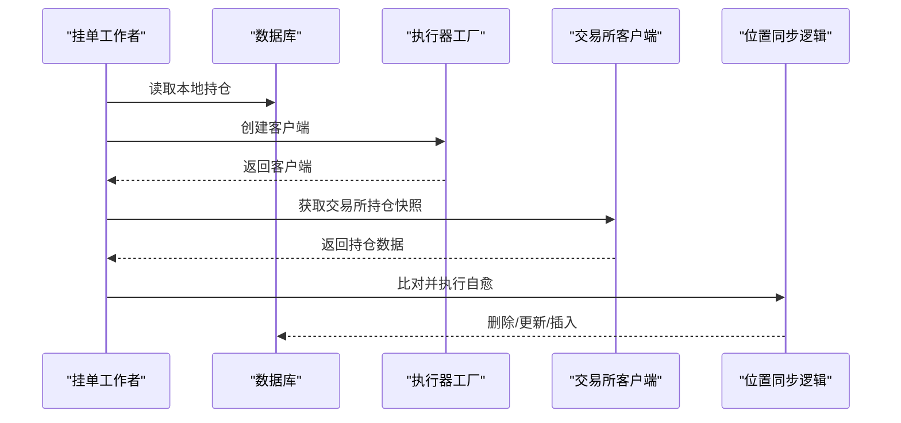
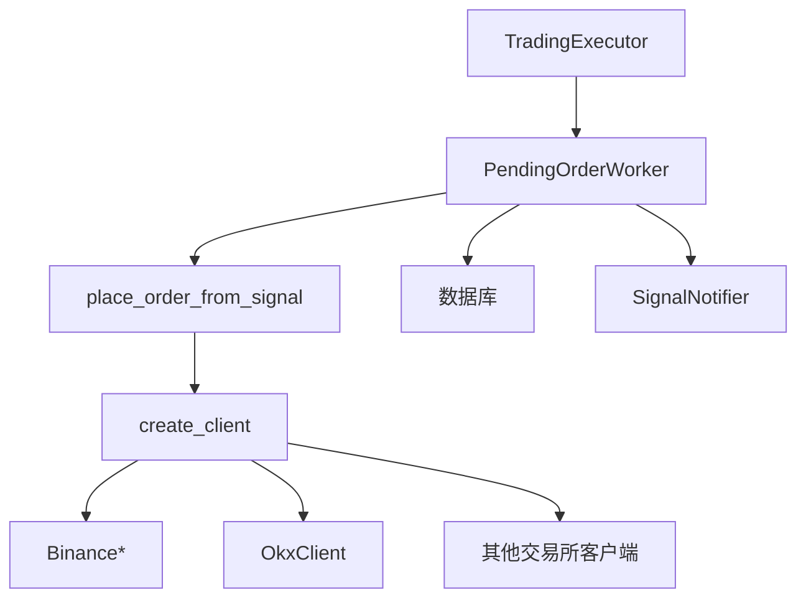

# 执行器插件开发

<cite>
**本文档引用的文件**
- [exchange_execution.py](file://backend_api_python/app/services/exchange_execution.py)
- [factory.py](file://backend_api_python/app/services/live_trading/factory.py)
- [base.py](file://backend_api_python/app/services/live_trading/base.py)
- [execution.py](file://backend_api_python/app/services/live_trading/execution.py)
- [binance.py](file://backend_api_python/app/services/live_trading/binance.py)
- [binance_spot.py](file://backend_api_python/app/services/live_trading/binance_spot.py)
- [okx.py](file://backend_api_python/app/services/live_trading/okx.py)
- [symbols.py](file://backend_api_python/app/services/live_trading/symbols.py)
- [pending_order_worker.py](file://backend_api_python/app/services/pending_order_worker.py)
- [records.py](file://backend_api_python/app/services/live_trading/records.py)
- [trading_executor.py](file://backend_api_python/app/services/trading_executor.py)
</cite>

## 目录
1. [简介](#简介)
2. [项目结构](#项目结构)
3. [核心组件](#核心组件)
4. [架构总览](#架构总览)
5. [详细组件分析](#详细组件分析)
6. [依赖分析](#依赖分析)
7. [性能考虑](#性能考虑)
8. [故障排查指南](#故障排查指南)
9. [结论](#结论)
10. [附录](#附录)

## 简介
本指南面向为新交易所或Broker开发“执行器插件”的工程师，目标是帮助你基于现有框架快速集成新的加密货币交易所或传统金融市场的交易接口。文档覆盖以下主题：
- ExchangeExecution 抽象与配置解析流程
- 执行器工厂模式与动态加载机制
- 订单提交、仓位管理、风险控制与资金管理的实现要点
- 执行器测试、模拟交易与生产部署最佳实践
- 以序列图和类图形式展示关键流程与组件关系

## 项目结构
QuantDinger 的实盘执行链路由“策略执行器”和“挂单工作者”协同完成：
- 策略执行器负责将策略信号转换为标准化的挂单请求，并写入待执行队列
- 挂单工作者轮询待执行队列，按执行模式（信号/实盘）进行通知或真实下单
- 实盘下单通过“执行器工厂”创建对应交易所客户端，再调用下单适配层完成下单

图表来源
- [trading_executor.py:775-800](file://backend_api_python/app/services/trading_executor.py#L775-L800)
- [pending_order_worker.py:100-122](file://backend_api_python/app/services/pending_order_worker.py#L100-L122)
- [execution.py:123-311](file://backend_api_python/app/services/live_trading/execution.py#L123-L311)
- [factory.py:59-218](file://backend_api_python/app/services/live_trading/factory.py#L59-L218)

章节来源
- [trading_executor.py:37-102](file://backend_api_python/app/services/trading_executor.py#L37-L102)
- [pending_order_worker.py:52-98](file://backend_api_python/app/services/pending_order_worker.py#L52-L98)
- [execution.py:123-311](file://backend_api_python/app/services/live_trading/execution.py#L123-L311)
- [factory.py:59-218](file://backend_api_python/app/services/live_trading/factory.py#L59-L218)

## 核心组件
- 策略执行器（TradingExecutor）
  - 负责将策略脚本生成的订单转换为标准化信号，写入待执行队列
  - 提供去重、优先级排序、资源监控与日志记录
- 挂单工作者（PendingOrderWorker）
  - 轮询待执行队列，根据执行模式进行通知或真实下单
  - 支持位置同步与自愈，保证本地快照与交易所一致
- 执行器工厂（create_client）
  - 根据 exchange_id 与市场类型选择具体交易所客户端
  - 支持延迟导入，避免非必要依赖
- 下单适配层（place_order_from_signal）
  - 统一不同交易所的下单参数映射
  - 支持现货/永续、开仓/加仓/减仓/平仓等信号类型
- 基础客户端（BaseRestClient）
  - 提供统一的HTTP请求封装、证书校验与错误处理
- 交易所客户端（如 Binance、OKX 等）
  - 实现签名、精度控制、时间对齐、下单与查询接口
- 位置与成交记录（records.py）
  - 维护本地位置快照与成交记录，支持模糊匹配与冲突修复

章节来源
- [trading_executor.py:37-102](file://backend_api_python/app/services/trading_executor.py#L37-L102)
- [pending_order_worker.py:52-98](file://backend_api_python/app/services/pending_order_worker.py#L52-L98)
- [factory.py:59-218](file://backend_api_python/app/services/live_trading/factory.py#L59-L218)
- [execution.py:123-311](file://backend_api_python/app/services/live_trading/execution.py#L123-L311)
- [base.py:95-157](file://backend_api_python/app/services/live_trading/base.py#L95-L157)
- [records.py:17-280](file://backend_api_python/app/services/live_trading/records.py#L17-L280)

## 架构总览
下图展示了从策略到交易所的真实下单路径，以及关键组件之间的交互。

图表来源
- [trading_executor.py:775-800](file://backend_api_python/app/services/trading_executor.py#L775-L800)
- [pending_order_worker.py:100-122](file://backend_api_python/app/services/pending_order_worker.py#L100-L122)
- [execution.py:123-311](file://backend_api_python/app/services/live_trading/execution.py#L123-L311)
- [factory.py:59-218](file://backend_api_python/app/services/live_trading/factory.py#L59-L218)

## 详细组件分析

### ExchangeExecution 配置解析与安全日志
- 安全日志：对密钥字段进行掩码输出，避免敏感信息泄露
- 配置合并：支持内联配置与凭证引用两种方式，后者从数据库解密后叠加
- 策略配置加载：统一读取策略的交易配置、杠杆、执行模式与市场类别

图表来源
- [exchange_execution.py:49-147](file://backend_api_python/app/services/exchange_execution.py#L49-L147)

章节来源
- [exchange_execution.py:118-147](file://backend_api_python/app/services/exchange_execution.py#L118-L147)

### 执行器工厂模式与动态加载
- 工厂函数根据 exchange_id 与市场类型返回对应客户端
- 支持延迟导入第三方库，避免非必要依赖
- 对 IBKR/MT5 等可选模块进行条件导入与连接校验

图表来源
- [base.py:95-157](file://backend_api_python/app/services/live_trading/base.py#L95-L157)
- [binance.py:24-50](file://backend_api_python/app/services/live_trading/binance.py#L24-L50)
- [binance_spot.py:21-40](file://backend_api_python/app/services/live_trading/binance_spot.py#L21-L40)
- [okx.py:25-63](file://backend_api_python/app/services/live_trading/okx.py#L25-L63)

章节来源
- [factory.py:59-218](file://backend_api_python/app/services/live_trading/factory.py#L59-L218)

### 下单适配层：信号到订单的映射
- 信号类型映射：open_long/add_long → buy；close_long/reduce_long → sell
- 符号规范化：统一处理裸符号、斜杠格式与合约后缀
- 交易所差异化参数：如 OKX 的保证金模式、Bitget 的产品类型等

图表来源
- [execution.py:123-311](file://backend_api_python/app/services/live_trading/execution.py#L123-L311)
- [symbols.py:43-87](file://backend_api_python/app/services/live_trading/symbols.py#L43-L87)

章节来源
- [execution.py:85-101](file://backend_api_python/app/services/live_trading/execution.py#L85-L101)
- [execution.py:150-161](file://backend_api_python/app/services/live_trading/execution.py#L150-L161)
- [execution.py:162-173](file://backend_api_python/app/services/live_trading/execution.py#L162-L173)

### 位置同步与自愈
- 挂单工作者定期拉取本地持仓，与交易所快照比对
- 自动删除“幽灵持仓”，更新尺寸与入场价，插入未落库的新仓
- 仅对策略实际交易的标的进行同步，避免误操作

图表来源
- [pending_order_worker.py:138-636](file://backend_api_python/app/services/pending_order_worker.py#L138-L636)

章节来源
- [pending_order_worker.py:138-636](file://backend_api_python/app/services/pending_order_worker.py#L138-L636)

### 交易所客户端实现要点（以 Binance/OKX 为例）
- 精度控制：下单量/价需严格匹配交易所过滤器步进，避免被拒
- 时间对齐：签名请求的时间戳需与交易所服务器时间偏差在允许范围内
- 参数映射：不同交易所的参数命名差异（如 pos_side、td_mode、margin_coin 等）

章节来源
- [binance.py:50-147](file://backend_api_python/app/services/live_trading/binance.py#L50-L147)
- [binance_spot.py:40-142](file://backend_api_python/app/services/live_trading/binance_spot.py#L40-L142)
- [okx.py:64-170](file://backend_api_python/app/services/live_trading/okx.py#L64-L170)

## 依赖分析
- 组件耦合
  - 策略执行器与挂单工作者通过数据库队列解耦
  - 下单适配层与执行器工厂通过接口隔离，便于扩展新交易所
- 外部依赖
  - 证书校验与代理支持：统一通过基础客户端处理
  - 可选模块（IBKR/MT5）采用延迟导入，降低默认安装复杂度

图表来源
- [trading_executor.py:37-102](file://backend_api_python/app/services/trading_executor.py#L37-L102)
- [pending_order_worker.py:52-98](file://backend_api_python/app/services/pending_order_worker.py#L52-L98)
- [execution.py:123-311](file://backend_api_python/app/services/live_trading/execution.py#L123-L311)
- [factory.py:59-218](file://backend_api_python/app/services/live_trading/factory.py#L59-L218)

章节来源
- [base.py:34-79](file://backend_api_python/app/services/live_trading/base.py#L34-L79)
- [factory.py:32-38](file://backend_api_python/app/services/live_trading/factory.py#L32-L38)

## 性能考虑
- 线程与资源限制：策略执行器对并发线程数进行上限控制，避免资源耗尽
- 价格缓存与去重：本地价格缓存与信号去重减少重复下单与查询压力
- 位置同步频率：可配置的同步间隔与“幽灵持仓”自愈，平衡准确性与开销
- 请求超时与证书校验：统一的超时与证书策略，避免阻塞与TLS异常

章节来源
- [trading_executor.py:40-68](file://backend_api_python/app/services/trading_executor.py#L40-L68)
- [pending_order_worker.py:67-71](file://backend_api_python/app/services/pending_order_worker.py#L67-L71)

## 故障排查指南
- SSL/TLS 证书问题
  - 现象：HTTPS 证书验证失败
  - 排查：设置环境变量指定CA包路径，或在容器镜像中安装系统CA证书
- 交易所时间偏差
  - 现象：签名请求报错（如 -1021）
  - 排查：启用服务器时间同步，确保本地时间与交易所时间偏差在阈值内
- 位置不一致
  - 现象：UI 显示与交易所不一致
  - 排查：开启位置同步，确认策略交易标的白名单，检查是否为“幽灵持仓”
- 下单失败
  - 现象：下单参数被拒或精度不匹配
  - 排查：核对符号规范化、精度控制与过滤器步进，确认市场类型与参数映射

章节来源
- [base.py:128-136](file://backend_api_python/app/services/live_trading/base.py#L128-L136)
- [binance.py:173-191](file://backend_api_python/app/services/live_trading/binance.py#L173-L191)
- [pending_order_worker.py:138-636](file://backend_api_python/app/services/pending_order_worker.py#L138-L636)

## 结论
通过工厂模式与适配层，QuantDinger 将“策略信号”与“交易所实现”解耦，使新增交易所或Broker变得简单可控。建议在实现新执行器时遵循以下原则：
- 严格遵循符号规范化与精度控制
- 实现时间对齐与参数映射
- 通过适配层统一下单入口
- 使用位置同步与自愈机制保障一致性
- 在测试环境充分验证后再上线生产

## 附录

### 开发步骤清单（为新交易所/Broker创建执行器插件）
- 步骤1：在执行器工厂中注册新客户端
  - 参考路径：[factory.py:59-218](file://backend_api_python/app/services/live_trading/factory.py#L59-L218)
- 步骤2：实现交易所客户端（继承基础客户端）
  - 参考路径：[base.py:95-157](file://backend_api_python/app/services/live_trading/base.py#L95-L157)，[binance.py:24-50](file://backend_api_python/app/services/live_trading/binance.py#L24-L50)
- 步骤3：在下单适配层增加参数映射
  - 参考路径：[execution.py:153-311](file://backend_api_python/app/services/live_trading/execution.py#L153-L311)
- 步骤4：完善符号规范化与精度控制
  - 参考路径：[symbols.py:43-87](file://backend_api_python/app/services/live_trading/symbols.py#L43-L87)
- 步骤5：测试与验证
  - 使用挂单工作者在信号模式下验证流程
  - 参考路径：[pending_order_worker.py:748-798](file://backend_api_python/app/services/pending_order_worker.py#L748-L798)
- 步骤6：生产部署
  - 配置证书与代理、设置执行模式、开启位置同步

章节来源
- [factory.py:59-218](file://backend_api_python/app/services/live_trading/factory.py#L59-L218)
- [execution.py:123-311](file://backend_api_python/app/services/live_trading/execution.py#L123-L311)
- [symbols.py:43-87](file://backend_api_python/app/services/live_trading/symbols.py#L43-L87)
- [pending_order_worker.py:748-798](file://backend_api_python/app/services/pending_order_worker.py#L748-L798)