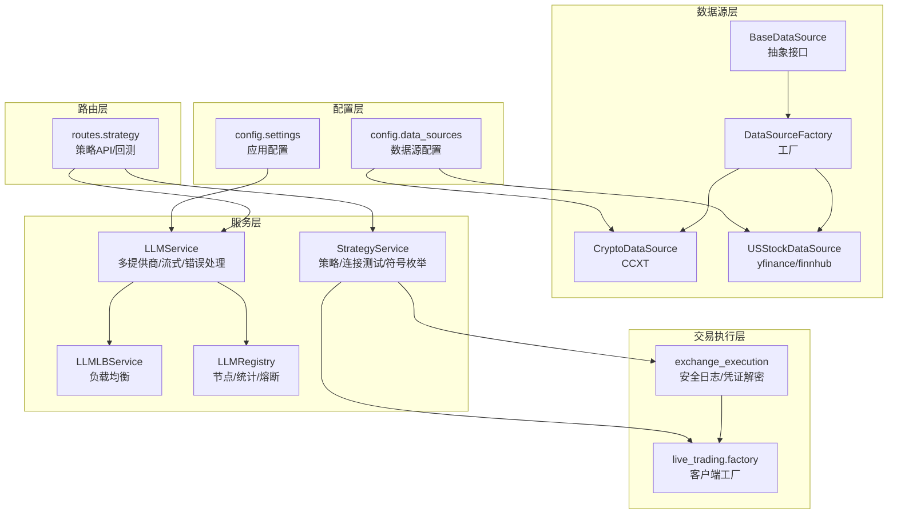
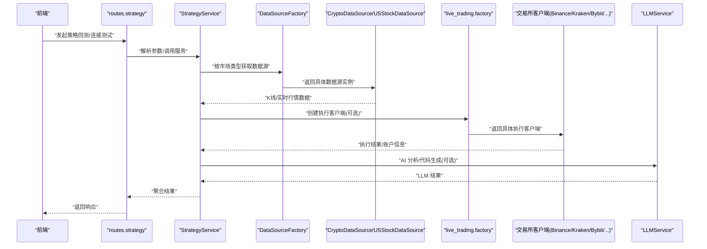
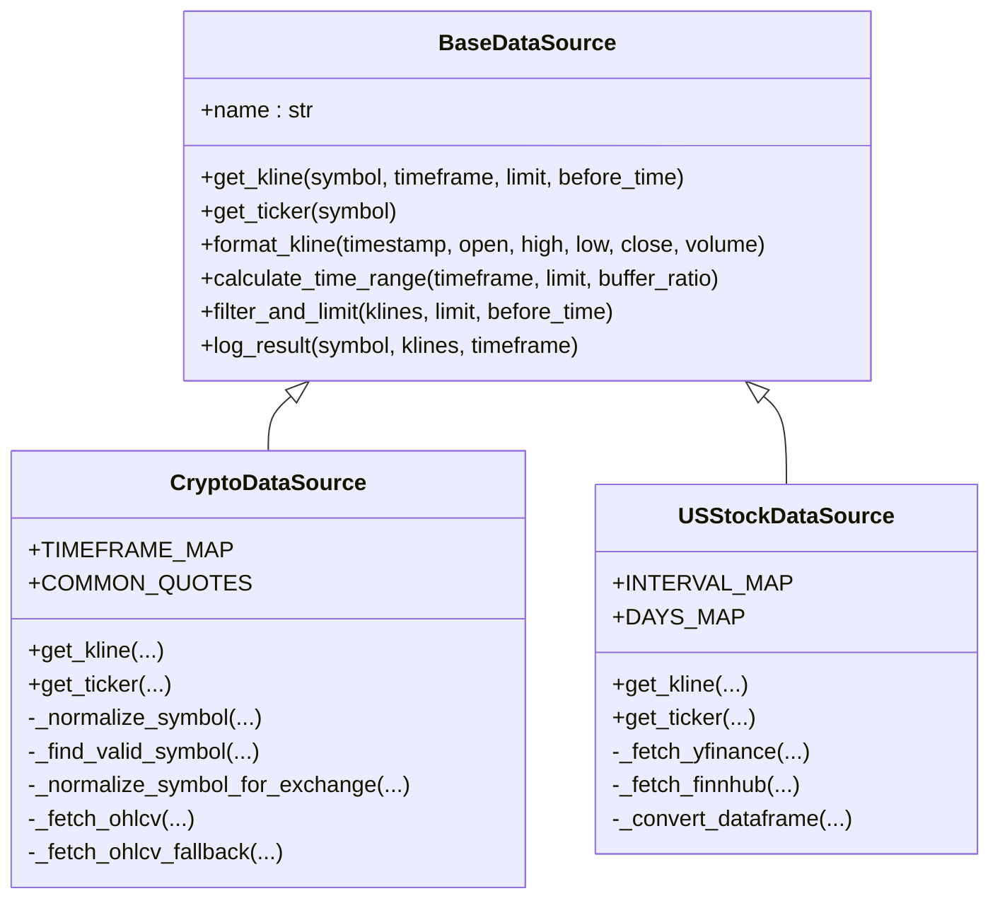
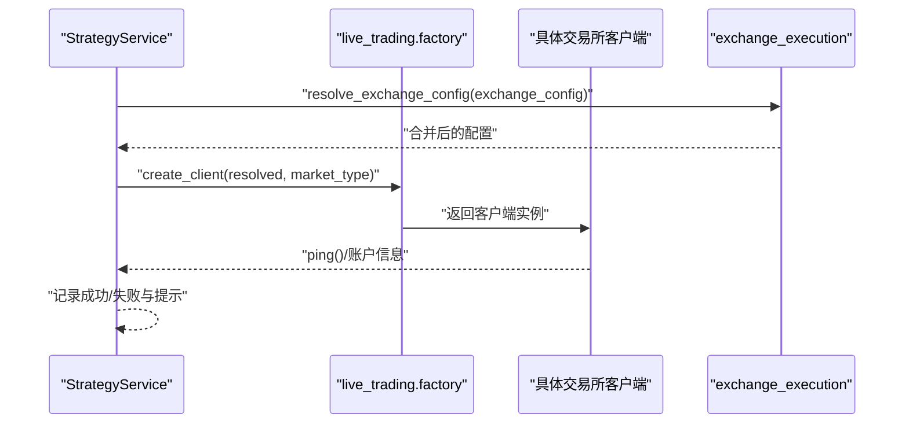
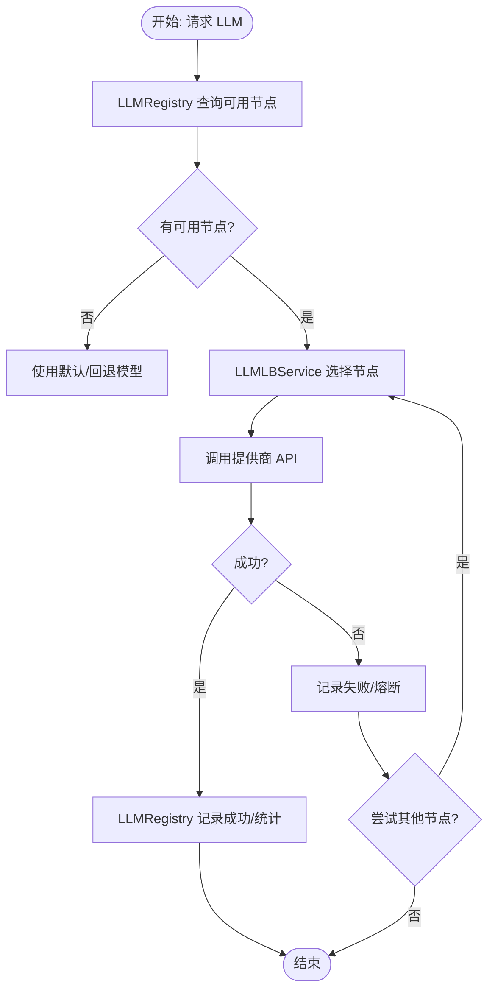
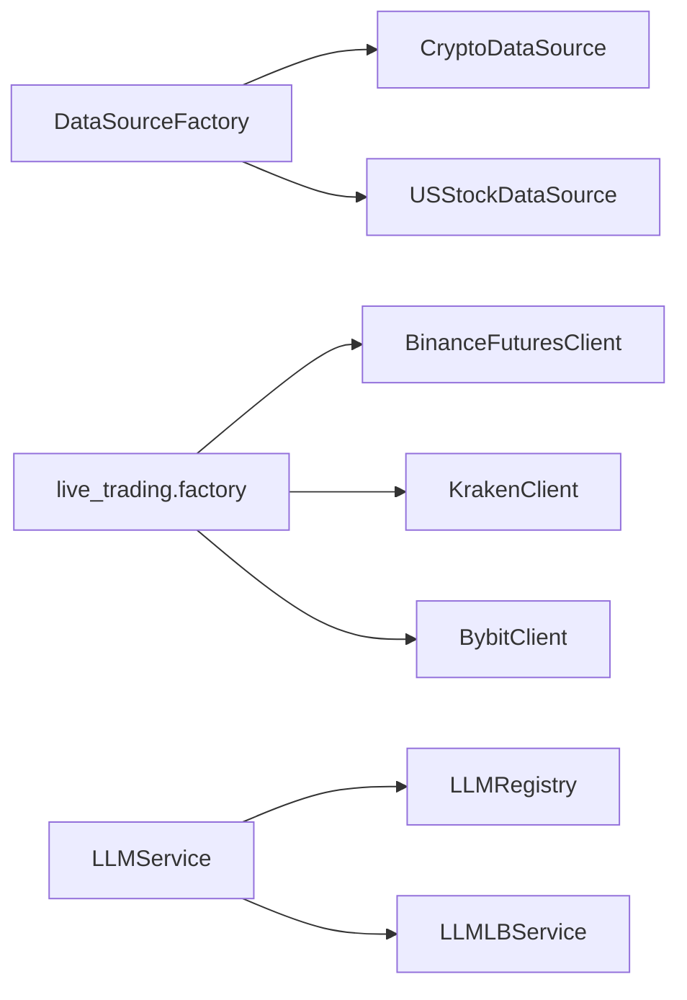

# 扩展开发

<cite>
**本文引用的文件**
- [backend_api_python/app/data_sources/base.py](file://backend_api_python/app/data_sources/base.py)
- [backend_api_python/app/data_sources/factory.py](file://backend_api_python/app/data_sources/factory.py)
- [backend_api_python/app/data_sources/crypto.py](file://backend_api_python/app/data_sources/crypto.py)
- [backend_api_python/app/data_sources/us_stock.py](file://backend_api_python/app/data_sources/us_stock.py)
- [backend_api_python/app/services/live_trading/factory.py](file://backend_api_python/app/services/live_trading/factory.py)
- [backend_api_python/app/services/strategy.py](file://backend_api_python/app/services/strategy.py)
- [backend_api_python/app/routes/strategy.py](file://backend_api_python/app/routes/strategy.py)
- [backend_api_python/app/services/llm.py](file://backend_api_python/app/services/llm.py)
- [backend_api_python/app/services/llm_registry.py](file://backend_api_python/app/services/llm_registry.py)
- [backend_api_python/app/services/llm_lb.py](file://backend_api_python/app/services/llm_lb.py)
- [backend_api_python/app/config/data_sources.py](file://backend_api_python/app/config/data_sources.py)
- [backend_api_python/app/config/settings.py](file://backend_api_python/app/config/settings.py)
- [backend_api_python/app/utils/logger.py](file://backend_api_python/app/utils/logger.py)
- [backend_api_python/app/services/exchange_execution.py](file://backend_api_python/app/services/exchange_execution.py)
</cite>

## 目录
1. [简介](#简介)
2. [项目结构](#项目结构)
3. [核心组件](#核心组件)
4. [架构总览](#架构总览)
5. [详细组件分析](#详细组件分析)
6. [依赖分析](#依赖分析)
7. [性能考虑](#性能考虑)
8. [故障排查指南](#故障排查指南)
9. [结论](#结论)
10. [附录](#附录)

## 简介
本指南面向希望在 QuantDinger 平台上进行扩展开发的工程师，涵盖以下主题：
- 插件开发框架与扩展点识别
- 新数据源集成（K线/实时行情）
- 新交易所支持（实盘交易客户端）
- 自定义功能开发（AI 模型集成、负载均衡与注册中心）
- 开发示例：数据源适配器、执行器插件、AI 模型集成
- 测试、部署与维护最佳实践

QuantDinger 后端采用 Python Flask 提供 API，前端 Vue 构建界面，核心能力包括：
- 统一数据源抽象与工厂模式
- 多交易所实盘执行客户端
- LLM 负载均衡与注册中心
- 策略编译、回测与运行管理

## 项目结构
后端核心位于 backend_api_python，主要子系统如下：
- 数据源层：抽象基类 + 工厂 + 具体实现（加密货币、美股等）
- 交易执行层：统一执行辅助 + 交易所客户端工厂 + 具体交易所客户端
- 服务层：策略服务、LLM 服务、LLM 注册与负载均衡
- 配置层：数据源、应用、API Key 等配置
- 路由层：策略相关 API

图表来源
- [backend_api_python/app/data_sources/base.py:27-171](file://backend_api_python/app/data_sources/base.py#L27-L171)
- [backend_api_python/app/data_sources/factory.py:13-134](file://backend_api_python/app/data_sources/factory.py#L13-L134)
- [backend_api_python/app/data_sources/crypto.py:16-388](file://backend_api_python/app/data_sources/crypto.py#L16-L388)
- [backend_api_python/app/data_sources/us_stock.py:17-318](file://backend_api_python/app/data_sources/us_stock.py#L17-L318)
- [backend_api_python/app/services/exchange_execution.py:118-150](file://backend_api_python/app/services/exchange_execution.py#L118-L150)
- [backend_api_python/app/services/live_trading/factory.py:59-355](file://backend_api_python/app/services/live_trading/factory.py#L59-L355)
- [backend_api_python/app/services/strategy.py:59-236](file://backend_api_python/app/services/strategy.py#L59-L236)
- [backend_api_python/app/services/llm.py:73-800](file://backend_api_python/app/services/llm.py#L73-L800)
- [backend_api_python/app/services/llm_registry.py:11-169](file://backend_api_python/app/services/llm_registry.py#L11-L169)
- [backend_api_python/app/services/llm_lb.py:7-169](file://backend_api_python/app/services/llm_lb.py#L7-L169)
- [backend_api_python/app/config/data_sources.py:26-171](file://backend_api_python/app/config/data_sources.py#L26-L171)
- [backend_api_python/app/config/settings.py:6-99](file://backend_api_python/app/config/settings.py#L6-L99)
- [backend_api_python/app/routes/strategy.py:1-800](file://backend_api_python/app/routes/strategy.py#L1-L800)

章节来源
- [backend_api_python/app/data_sources/base.py:27-171](file://backend_api_python/app/data_sources/base.py#L27-L171)
- [backend_api_python/app/data_sources/factory.py:13-134](file://backend_api_python/app/data_sources/factory.py#L13-L134)
- [backend_api_python/app/services/strategy.py:59-236](file://backend_api_python/app/services/strategy.py#L59-L236)
- [backend_api_python/app/services/llm.py:73-800](file://backend_api_python/app/services/llm.py#L73-L800)

## 核心组件
- 数据源抽象与工厂
  - 抽象接口定义统一的 K 线与实时行情获取能力，提供格式化、过滤、时间范围计算与延迟检测等通用逻辑。
  - 工厂根据市场类型返回对应数据源实例，支持便捷的 K 线与实时行情查询。
- 交易执行与客户端工厂
  - 提供统一的凭证解析、安全日志与执行配置加载。
  - 客户端工厂按交易所 ID 创建具体执行客户端，支持多交易所与多产品类型（现货/永续/期货）。
- 策略服务
  - 提供策略列表、回测、连接测试、符号枚举与运行时指标计算等能力。
- LLM 服务与注册中心
  - 支持多提供商（OpenRouter/OpenAI/Google/DeepSeek/Grok/Ollama）与模型自动选择/回退。
  - 提供负载均衡（轮询、加权轮询、随机、一致性哈希、最少连接）与节点熔断统计。

章节来源
- [backend_api_python/app/data_sources/base.py:27-171](file://backend_api_python/app/data_sources/base.py#L27-L171)
- [backend_api_python/app/data_sources/factory.py:13-134](file://backend_api_python/app/data_sources/factory.py#L13-L134)
- [backend_api_python/app/services/exchange_execution.py:118-150](file://backend_api_python/app/services/exchange_execution.py#L118-L150)
- [backend_api_python/app/services/live_trading/factory.py:59-355](file://backend_api_python/app/services/live_trading/factory.py#L59-L355)
- [backend_api_python/app/services/strategy.py:59-236](file://backend_api_python/app/services/strategy.py#L59-L236)
- [backend_api_python/app/services/llm.py:73-800](file://backend_api_python/app/services/llm.py#L73-L800)
- [backend_api_python/app/services/llm_registry.py:11-169](file://backend_api_python/app/services/llm_registry.py#L11-L169)
- [backend_api_python/app/services/llm_lb.py:7-169](file://backend_api_python/app/services/llm_lb.py#L7-L169)

## 架构总览
下图展示了从路由到服务、再到数据源与执行客户端的整体调用链路。

图表来源
- [backend_api_python/app/routes/strategy.py:1-800](file://backend_api_python/app/routes/strategy.py#L1-L800)
- [backend_api_python/app/services/strategy.py:237-533](file://backend_api_python/app/services/strategy.py#L237-L533)
- [backend_api_python/app/data_sources/factory.py:74-134](file://backend_api_python/app/data_sources/factory.py#L74-L134)
- [backend_api_python/app/services/live_trading/factory.py:59-355](file://backend_api_python/app/services/live_trading/factory.py#L59-L355)
- [backend_api_python/app/services/llm.py:470-728](file://backend_api_python/app/services/llm.py#L470-L728)

## 详细组件分析

### 数据源扩展：实现 BaseDataSource 子类
- 扩展点
  - 实现 get_kline(symbol, timeframe, limit, before_time) 获取 K 线。
  - 可选实现 get_ticker(symbol) 获取实时行情。
  - 复用基类提供的 format_kline、filter_and_limit、calculate_time_range、log_result 等工具。
- 关键实现要点
  - 符号规范化：将输入符号映射为交易所期望格式，必要时在 markets 中查找有效符号。
  - 时间窗口：利用 calculate_time_range 估算请求范围，结合 before_time 进行历史回溯。
  - 错误与降级：优先尝试 fetch_ohlcv，失败时回退到备用方法；实时行情优先使用更快的接口。
- 示例参考
  - 加密货币数据源：[CryptoDataSource.get_kline:232-298](file://backend_api_python/app/data_sources/crypto.py#L232-L298)，[CryptoDataSource.get_ticker:176-231](file://backend_api_python/app/data_sources/crypto.py#L176-L231)
  - 美股数据源：[USStockDataSource.get_kline:170-218](file://backend_api_python/app/data_sources/us_stock.py#L170-L218)，[USStockDataSource.get_ticker:58-168](file://backend_api_python/app/data_sources/us_stock.py#L58-L168)

图表来源
- [backend_api_python/app/data_sources/base.py:27-171](file://backend_api_python/app/data_sources/base.py#L27-L171)
- [backend_api_python/app/data_sources/crypto.py:16-388](file://backend_api_python/app/data_sources/crypto.py#L16-L388)
- [backend_api_python/app/data_sources/us_stock.py:17-318](file://backend_api_python/app/data_sources/us_stock.py#L17-L318)

章节来源
- [backend_api_python/app/data_sources/base.py:27-171](file://backend_api_python/app/data_sources/base.py#L27-L171)
- [backend_api_python/app/data_sources/crypto.py:16-388](file://backend_api_python/app/data_sources/crypto.py#L16-L388)
- [backend_api_python/app/data_sources/us_stock.py:17-318](file://backend_api_python/app/data_sources/us_stock.py#L17-L318)

### 交易所扩展：新增执行器插件
- 扩展点
  - 在 live_trading 目录新增具体交易所客户端类，继承 BaseRestClient 或复用现有客户端模式。
  - 在工厂中注册新交易所 ID，支持按 market_type（spot/swap）选择不同产品线。
- 关键实现要点
  - 凭证解析与安全日志：使用 resolve_exchange_config 解析 inline 或引用凭证；使用 safe_exchange_config_for_log 掩码敏感字段。
  - 连接测试：在 StrategyService.test_exchange_connection 中添加新客户端的 ping/账户校验逻辑。
  - 限流与错误处理：遵循现有客户端的签名、时间同步、错误码处理与重试策略。
- 示例参考
  - 客户端工厂：[create_client:59-219](file://backend_api_python/app/services/live_trading/factory.py#L59-L219)
  - 连接测试入口：[test_exchange_connection:237-533](file://backend_api_python/app/services/strategy.py#L237-L533)
  - 执行配置解析：[resolve_exchange_config:118-148](file://backend_api_python/app/services/exchange_execution.py#L118-L148)

图表来源
- [backend_api_python/app/services/strategy.py:237-533](file://backend_api_python/app/services/strategy.py#L237-L533)
- [backend_api_python/app/services/live_trading/factory.py:59-219](file://backend_api_python/app/services/live_trading/factory.py#L59-L219)
- [backend_api_python/app/services/exchange_execution.py:118-148](file://backend_api_python/app/services/exchange_execution.py#L118-L148)

章节来源
- [backend_api_python/app/services/live_trading/factory.py:59-355](file://backend_api_python/app/services/live_trading/factory.py#L59-L355)
- [backend_api_python/app/services/strategy.py:237-533](file://backend_api_python/app/services/strategy.py#L237-L533)
- [backend_api_python/app/services/exchange_execution.py:118-150](file://backend_api_python/app/services/exchange_execution.py#L118-L150)

### AI 模型集成：LLM 服务与负载均衡
- 扩展点
  - 在 LLMService 中新增提供商或模型配置，或通过环境变量/配置文件覆盖默认行为。
  - 使用 LLMRegistry 与 LLMLBService 实现多 Key 负载均衡与熔断统计。
- 关键实现要点
  - 多提供商支持：OpenRouter、OpenAI、Google Gemini、DeepSeek、Grok、Ollama。
  - 模型自动选择与回退：根据 provider/default_model/fallback_model 决策。
  - 负载均衡策略：轮询、加权轮询、随机、一致性哈希、最少连接。
  - 熔断与统计：基于失败次数与状态码动态调整节点权重与可用性。
- 示例参考
  - LLM 服务入口：[LLMService.call_llm_api:470-728](file://backend_api_python/app/services/llm.py#L470-L728)
  - 注册中心与统计：[LLMRegistry:11-169](file://backend_api_python/app/services/llm_registry.py#L11-L169)
  - 负载均衡策略：[LLMLBService:143-169](file://backend_api_python/app/services/llm_lb.py#L143-L169)

图表来源
- [backend_api_python/app/services/llm.py:470-728](file://backend_api_python/app/services/llm.py#L470-L728)
- [backend_api_python/app/services/llm_registry.py:11-169](file://backend_api_python/app/services/llm_registry.py#L11-L169)
- [backend_api_python/app/services/llm_lb.py:143-169](file://backend_api_python/app/services/llm_lb.py#L143-L169)

章节来源
- [backend_api_python/app/services/llm.py:73-800](file://backend_api_python/app/services/llm.py#L73-L800)
- [backend_api_python/app/services/llm_registry.py:11-169](file://backend_api_python/app/services/llm_registry.py#L11-L169)
- [backend_api_python/app/services/llm_lb.py:7-169](file://backend_api_python/app/services/llm_lb.py#L7-L169)

### 开发示例

#### 示例一：创建新的数据源适配器
- 步骤
  - 新建类继承 BaseDataSource，实现 get_kline 与可选 get_ticker。
  - 在工厂中注册新市场类型或扩展现有映射。
  - 在配置层增加超时、重试、代理等参数。
- 参考路径
  - [BaseDataSource 抽象:27-171](file://backend_api_python/app/data_sources/base.py#L27-L171)
  - [DataSourceFactory 工厂:13-134](file://backend_api_python/app/data_sources/factory.py#L13-L134)
  - [CryptoDataSource 实现:16-388](file://backend_api_python/app/data_sources/crypto.py#L16-L388)
  - [USStockDataSource 实现:17-318](file://backend_api_python/app/data_sources/us_stock.py#L17-L318)
  - [数据源配置:26-171](file://backend_api_python/app/config/data_sources.py#L26-L171)

#### 示例二：新增交易所执行器插件
- 步骤
  - 在 live_trading 目录新增客户端类，实现必要的 REST 接口与错误处理。
  - 在工厂中注册新 exchange_id，并在连接测试中添加 ping/账户校验。
  - 在策略服务中完善错误提示与自动探测逻辑。
- 参考路径
  - [live_trading.factory.create_client:59-219](file://backend_api_python/app/services/live_trading/factory.py#L59-L219)
  - [StrategyService.test_exchange_connection:237-533](file://backend_api_python/app/services/strategy.py#L237-L533)
  - [exchange_execution.safe_exchange_config_for_log:49-56](file://backend_api_python/app/services/exchange_execution.py#L49-L56)

#### 示例三：集成新的 AI 模型
- 步骤
  - 在 LLMService 中配置提供商与模型，或通过环境变量覆盖。
  - 使用 LLMRegistry 注册 API Key，配置权重与熔断阈值。
  - 选择合适的负载均衡策略，观察失败统计与自动切换。
- 参考路径
  - [LLMService.call_llm_api:470-728](file://backend_api_python/app/services/llm.py#L470-L728)
  - [LLMRegistry.get_available_nodes:18-68](file://backend_api_python/app/services/llm_registry.py#L18-L68)
  - [LLMLBService.select_node:164-169](file://backend_api_python/app/services/llm_lb.py#L164-L169)

章节来源
- [backend_api_python/app/data_sources/base.py:27-171](file://backend_api_python/app/data_sources/base.py#L27-L171)
- [backend_api_python/app/data_sources/factory.py:13-134](file://backend_api_python/app/data_sources/factory.py#L13-L134)
- [backend_api_python/app/data_sources/crypto.py:16-388](file://backend_api_python/app/data_sources/crypto.py#L16-L388)
- [backend_api_python/app/data_sources/us_stock.py:17-318](file://backend_api_python/app/data_sources/us_stock.py#L17-L318)
- [backend_api_python/app/config/data_sources.py:26-171](file://backend_api_python/app/config/data_sources.py#L26-L171)
- [backend_api_python/app/services/live_trading/factory.py:59-219](file://backend_api_python/app/services/live_trading/factory.py#L59-L219)
- [backend_api_python/app/services/strategy.py:237-533](file://backend_api_python/app/services/strategy.py#L237-L533)
- [backend_api_python/app/services/exchange_execution.py:49-56](file://backend_api_python/app/services/exchange_execution.py#L49-L56)
- [backend_api_python/app/services/llm.py:470-728](file://backend_api_python/app/services/llm.py#L470-L728)
- [backend_api_python/app/services/llm_registry.py:18-68](file://backend_api_python/app/services/llm_registry.py#L18-L68)
- [backend_api_python/app/services/llm_lb.py:164-169](file://backend_api_python/app/services/llm_lb.py#L164-L169)

## 依赖分析
- 组件耦合
  - 数据源层通过工厂解耦具体实现，便于替换与扩展。
  - 交易执行层通过工厂与配置解耦具体交易所客户端。
  - LLM 层通过注册中心与负载均衡实现多 Key 与多提供商的解耦。
- 外部依赖
  - 数据源：ccxt、yfinance、finnhub 等第三方库。
  - 交易执行：各交易所 REST SDK 与本地凭证加密。
  - LLM：requests、OpenRouter/OpenAI/Google/DeepSeek/Grok/Ollama 等。
- 循环依赖
  - 代码中未发现循环导入；服务层通过模块化组织避免循环依赖。

图表来源
- [backend_api_python/app/data_sources/factory.py:50-71](file://backend_api_python/app/data_sources/factory.py#L50-L71)
- [backend_api_python/app/services/live_trading/factory.py:73-205](file://backend_api_python/app/services/live_trading/factory.py#L73-L205)
- [backend_api_python/app/services/llm.py:498-507](file://backend_api_python/app/services/llm.py#L498-L507)
- [backend_api_python/app/services/llm_registry.py:18-68](file://backend_api_python/app/services/llm_registry.py#L18-L68)
- [backend_api_python/app/services/llm_lb.py:149-161](file://backend_api_python/app/services/llm_lb.py#L149-L161)

章节来源
- [backend_api_python/app/data_sources/factory.py:50-71](file://backend_api_python/app/data_sources/factory.py#L50-L71)
- [backend_api_python/app/services/live_trading/factory.py:73-205](file://backend_api_python/app/services/live_trading/factory.py#L73-L205)
- [backend_api_python/app/services/llm.py:498-507](file://backend_api_python/app/services/llm.py#L498-L507)
- [backend_api_python/app/services/llm_registry.py:18-68](file://backend_api_python/app/services/llm_registry.py#L18-L68)
- [backend_api_python/app/services/llm_lb.py:149-161](file://backend_api_python/app/services/llm_lb.py#L149-L161)

## 性能考虑
- 数据源
  - 合理设置超时与重试，避免阻塞请求；使用分页拉取历史 K 线，控制返回条数。
  - 利用 filter_and_limit 与 calculate_time_range 控制数据规模，减少内存占用。
- 交易执行
  - 严格遵守交易所限流规则，避免频繁请求导致限流或封禁。
  - 使用连接池与最小化请求体，降低网络开销。
- LLM
  - 通过负载均衡分散请求，避免单 Key 熔断影响整体吞吐。
  - 合理设置超时与回退模型，提升成功率与稳定性。

## 故障排查指南
- 数据源
  - 符号不匹配：检查 _normalize_symbol/_normalize_symbol_for_exchange 与 markets 查找逻辑。
  - 历史数据缺失：确认 calculate_time_range 与分页拉取逻辑，检查 before_time 与 limit。
  - 日志延迟告警：查看 log_result 的阈值判断与时间差计算。
- 交易执行
  - 凭证错误：使用 safe_exchange_config_for_log 掩码日志，避免泄露；检查 resolve_exchange_config 合并逻辑。
  - 连接失败：在 test_exchange_connection 中查看提示与 egress IP，核对 API Key 权限与 base_url。
- LLM
  - API Key 无效/余额不足：查看 LLMService 的错误提示与回退策略。
  - 负载均衡失败：检查 LLMRegistry 的 fail_count 与熔断状态，调整权重与策略。

章节来源
- [backend_api_python/app/data_sources/crypto.py:300-387](file://backend_api_python/app/data_sources/crypto.py#L300-L387)
- [backend_api_python/app/services/exchange_execution.py:39-56](file://backend_api_python/app/services/exchange_execution.py#L39-L56)
- [backend_api_python/app/services/strategy.py:425-494](file://backend_api_python/app/services/strategy.py#L425-L494)
- [backend_api_python/app/services/llm.py:638-684](file://backend_api_python/app/services/llm.py#L638-L684)
- [backend_api_python/app/services/llm_registry.py:113-164](file://backend_api_python/app/services/llm_registry.py#L113-L164)

## 结论
QuantDinger 提供了清晰的扩展点与成熟的基础设施，开发者可以：
- 通过数据源抽象快速接入新的市场与数据源；
- 通过工厂与配置快速扩展新的交易所执行器；
- 通过 LLM 服务与注册中心实现多提供商、多 Key 的高可用 AI 能力。

建议在扩展过程中遵循统一的错误处理、日志与配置管理规范，确保系统的稳定性与可观测性。

## 附录
- 配置与环境变量
  - 应用配置：主机、端口、调试、日志、速率限制、功能开关等。
  - 数据源配置：超时、重试、代理、时间周期映射等。
  - LLM 配置：提供商、模型、超时、base_url、API Key 等。
- 日志
  - 使用 get_logger 获取命名日志器，配合 RotatingFileHandler 输出到 logs 目录。

章节来源
- [backend_api_python/app/config/settings.py:6-99](file://backend_api_python/app/config/settings.py#L6-L99)
- [backend_api_python/app/config/data_sources.py:26-171](file://backend_api_python/app/config/data_sources.py#L26-L171)
- [backend_api_python/app/utils/logger.py:9-63](file://backend_api_python/app/utils/logger.py#L9-L63)