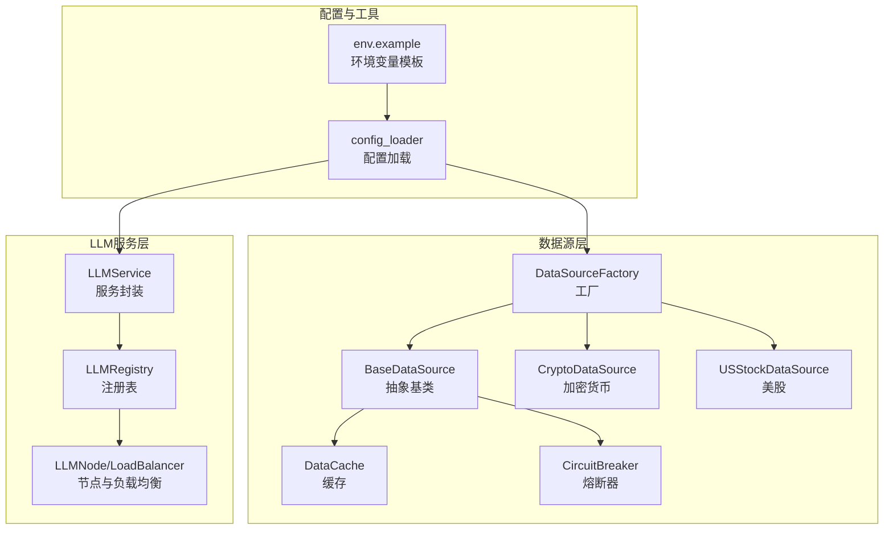
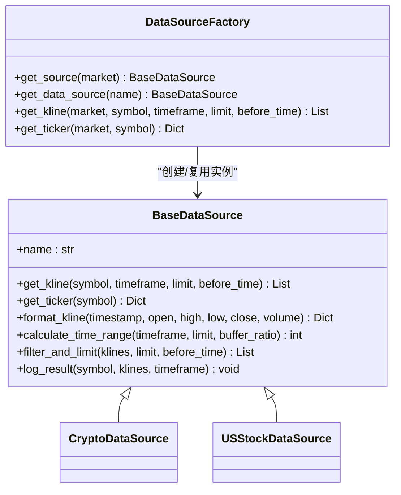
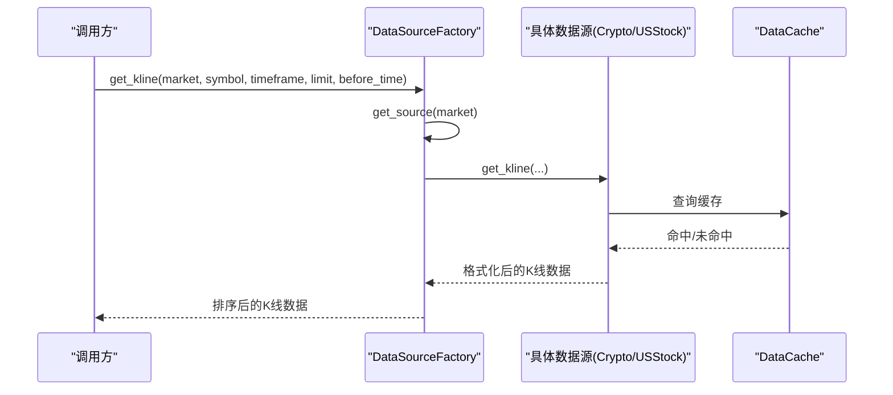
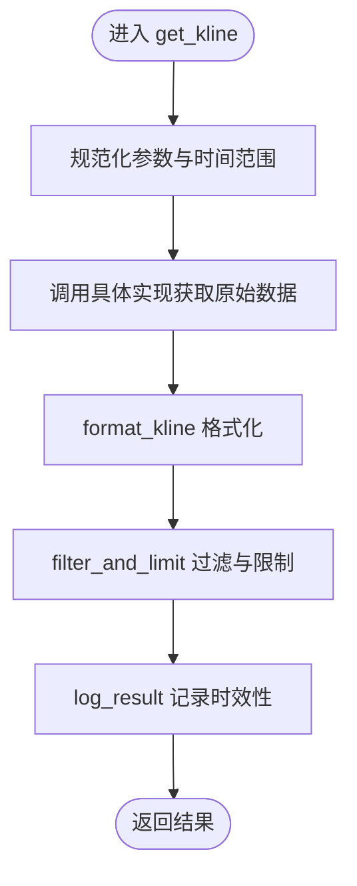
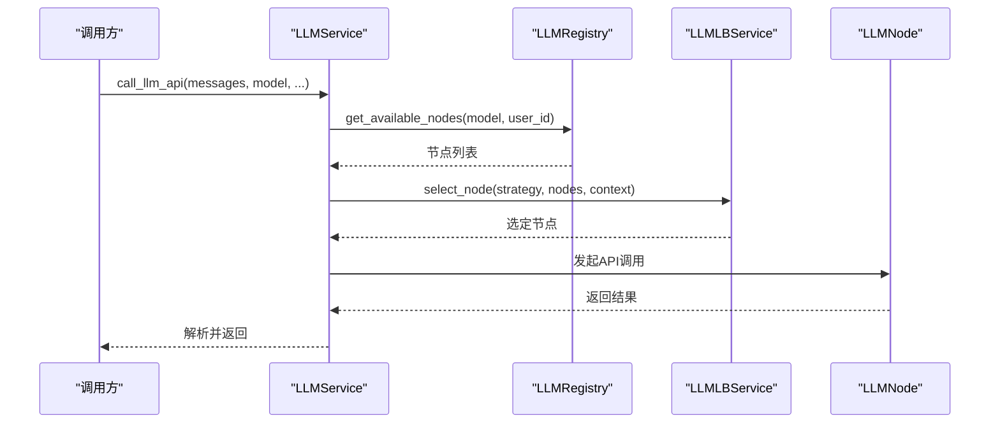
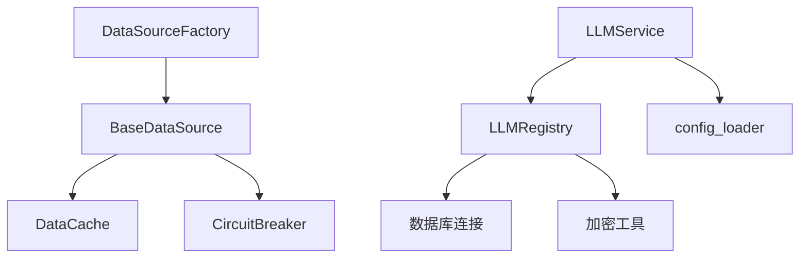

# 插件开发框架

<cite>
**本文档引用的文件**
- [backend_api_python/app/data_sources/factory.py](file://backend_api_python/app/data_sources/factory.py)
- [backend_api_python/app/data_sources/base.py](file://backend_api_python/app/data_sources/base.py)
- [backend_api_python/app/data_sources/crypto.py](file://backend_api_python/app/data_sources/crypto.py)
- [backend_api_python/app/data_sources/us_stock.py](file://backend_api_python/app/data_sources/us_stock.py)
- [backend_api_python/app/data_sources/cache_manager.py](file://backend_api_python/app/data_sources/cache_manager.py)
- [backend_api_python/app/data_sources/circuit_breaker.py](file://backend_api_python/app/data_sources/circuit_breaker.py)
- [backend_api_python/app/services/llm.py](file://backend_api_python/app/services/llm.py)
- [backend_api_python/app/services/llm_lb.py](file://backend_api_python/app/services/llm_lb.py)
- [backend_api_python/app/services/llm_registry.py](file://backend_api_python/app/services/llm_registry.py)
- [backend_api_python/app/utils/config_loader.py](file://backend_api_python/app/utils/config_loader.py)
- [backend_api_python/env.example](file://backend_api_python/env.example)
- [backend_api_python/README.md](file://backend_api_python/README.md)
- [docs/STRATEGY_DEV_GUIDE.md](file://docs/STRATEGY_DEV_GUIDE.md)
</cite>

## 目录
1. [简介](#简介)
2. [项目结构](#项目结构)
3. [核心组件](#核心组件)
4. [架构总览](#架构总览)
5. [详细组件分析](#详细组件分析)
6. [依赖关系分析](#依赖关系分析)
7. [性能考虑](#性能考虑)
8. [故障排查指南](#故障排查指南)
9. [结论](#结论)
10. [附录](#附录)

## 简介
本文件面向QuantDinger插件开发者，系统阐述基于工厂模式的数据源插件开发框架与AI模型插件扩展机制。内容涵盖：
- 工厂模式设计原理：DataSourceFactory的实现机制与BaseDataSource抽象基类的接口规范
- 插件注册、发现与加载流程：通过工厂映射与模块导出实现
- 插件开发标准步骤：接口实现、配置管理、错误处理
- 完整开发示例：自定义数据源插件与AI模型插件
- 测试、调试与部署最佳实践

## 项目结构
QuantDinger后端采用模块化组织，插件能力主要集中在数据源与LLM服务两大领域：
- 数据源插件：位于app/data_sources，通过工厂统一调度
- AI模型插件：位于app/services，通过LLMService与负载均衡注册表集成
- 配置与工具：app/utils提供配置加载与通用工具

**图示来源**
- [backend_api_python/app/data_sources/factory.py:13-72](file://backend_api_python/app/data_sources/factory.py#L13-L72)
- [backend_api_python/app/data_sources/base.py:27-53](file://backend_api_python/app/data_sources/base.py#L27-L53)
- [backend_api_python/app/data_sources/crypto.py:16-53](file://backend_api_python/app/data_sources/crypto.py#L16-L53)
- [backend_api_python/app/data_sources/us_stock.py:17-57](file://backend_api_python/app/data_sources/us_stock.py#L17-L57)
- [backend_api_python/app/data_sources/cache_manager.py:44-70](file://backend_api_python/app/data_sources/cache_manager.py#L44-L70)
- [backend_api_python/app/data_sources/circuit_breaker.py:31-54](file://backend_api_python/app/data_sources/circuit_breaker.py#L31-L54)
- [backend_api_python/app/services/llm.py:73-126](file://backend_api_python/app/services/llm.py#L73-L126)
- [backend_api_python/app/services/llm_registry.py:11-38](file://backend_api_python/app/services/llm_registry.py#L11-L38)
- [backend_api_python/app/utils/config_loader.py:24-60](file://backend_api_python/app/utils/config_loader.py#L24-L60)

**章节来源**
- [backend_api_python/README.md:15-33](file://backend_api_python/README.md#L15-L33)

## 核心组件
- DataSourceFactory：负责按市场类型创建与复用具体数据源实例，提供便捷的K线与实时报价获取方法
- BaseDataSource：定义统一接口规范，包括get_kline、可选get_ticker、数据格式化与时间范围计算等通用能力
- LLMService：多提供商LLM服务封装，支持自动探测、回退与负载均衡
- LLMRegistry：LLM节点注册与调用结果记录，配合LLMLBService进行负载均衡选择
- DataCache/CircuitBreaker：数据缓存与熔断保护，提升稳定性与性能

**章节来源**
- [backend_api_python/app/data_sources/factory.py:13-134](file://backend_api_python/app/data_sources/factory.py#L13-L134)
- [backend_api_python/app/data_sources/base.py:27-171](file://backend_api_python/app/data_sources/base.py#L27-L171)
- [backend_api_python/app/services/llm.py:73-126](file://backend_api_python/app/services/llm.py#L73-L126)
- [backend_api_python/app/services/llm_registry.py:11-169](file://backend_api_python/app/services/llm_registry.py#L11-L169)
- [backend_api_python/app/data_sources/cache_manager.py:44-233](file://backend_api_python/app/data_sources/cache_manager.py#L44-L233)
- [backend_api_python/app/data_sources/circuit_breaker.py:31-175](file://backend_api_python/app/data_sources/circuit_breaker.py#L31-L175)

## 架构总览
工厂模式在数据源层的应用：
- 工厂根据市场类型映射到具体数据源类
- BaseDataSource定义统一接口，子类实现差异化数据获取逻辑
- 通过缓存与熔断器增强鲁棒性
- LLM服务层以类似思路，通过注册表与负载均衡实现多提供商接入

**图示来源**
- [backend_api_python/app/data_sources/base.py:27-171](file://backend_api_python/app/data_sources/base.py#L27-L171)
- [backend_api_python/app/data_sources/factory.py:13-134](file://backend_api_python/app/data_sources/factory.py#L13-L134)
- [backend_api_python/app/data_sources/crypto.py:16-53](file://backend_api_python/app/data_sources/crypto.py#L16-L53)
- [backend_api_python/app/data_sources/us_stock.py:17-57](file://backend_api_python/app/data_sources/us_stock.py#L17-L57)

## 详细组件分析

### 工厂模式与数据源插件开发
- 设计要点
  - 工厂通过市场类型映射到具体数据源类，支持延迟创建与实例缓存
  - 子类遵循BaseDataSource接口，保证统一行为契约
  - 提供便捷方法获取K线与实时报价，并内置异常处理与日志记录

- 开发步骤
  1) 新建子类继承BaseDataSource，实现get_kline与可选get_ticker
  2) 在工厂映射中注册新市场类型
  3) 利用format_kline/filter_and_limit等工具方法标准化输出
  4) 结合DataCache/CircuitBreaker提升性能与稳定性

**图示来源**
- [backend_api_python/app/data_sources/factory.py:74-106](file://backend_api_python/app/data_sources/factory.py#L74-L106)
- [backend_api_python/app/data_sources/base.py:32-53](file://backend_api_python/app/data_sources/base.py#L32-L53)
- [backend_api_python/app/data_sources/cache_manager.py:71-98](file://backend_api_python/app/data_sources/cache_manager.py#L71-L98)

**章节来源**
- [backend_api_python/app/data_sources/factory.py:13-134](file://backend_api_python/app/data_sources/factory.py#L13-L134)
- [backend_api_python/app/data_sources/base.py:27-171](file://backend_api_python/app/data_sources/base.py#L27-L171)

### 抽象基类接口规范
- 必须实现
  - get_kline：返回标准化K线数据列表
- 可选实现
  - get_ticker：返回实时报价字典
- 工具方法
  - format_kline：统一格式化单条K线
  - calculate_time_range：按周期与数量估算时间窗口
  - filter_and_limit：按时间与数量过滤与截断
  - log_result：记录数据时效性与延迟情况

**图示来源**
- [backend_api_python/app/data_sources/base.py:64-131](file://backend_api_python/app/data_sources/base.py#L64-L131)

**章节来源**
- [backend_api_python/app/data_sources/base.py:27-171](file://backend_api_python/app/data_sources/base.py#L27-L171)

### 加密货币数据源插件示例
- 关键特性
  - 支持多种交易所（通过CCXT动态加载）
  - 符号规范化与市场映射
  - 分页拉取OHLCV，处理边界与异常
  - 实时报价获取与回退策略

- 开发要点
  - 在构造函数中配置超时与限流
  - 实现get_ticker与get_kline，注意时间戳转换与格式化
  - 利用父类工具方法统一输出

**章节来源**
- [backend_api_python/app/data_sources/crypto.py:16-388](file://backend_api_python/app/data_sources/crypto.py#L16-L388)

### 美股数据源插件示例
- 关键特性
  - 优先使用Finnhub实时数据，降级使用yfinance
  - 区间映射与日期范围计算
  - 多种数据源回退策略

- 开发要点
  - 在get_ticker中实现优先级与降级逻辑
  - 在get_kline中结合区间映射与日期范围
  - 注意API限额与错误处理

**章节来源**
- [backend_api_python/app/data_sources/us_stock.py:17-318](file://backend_api_python/app/data_sources/us_stock.py#L17-L318)

### LLM服务与模型插件扩展
- LLMService
  - 多提供商支持（OpenRouter、OpenAI、Google Gemini、DeepSeek、Grok、OLLAMA）
  - 自动探测与回退策略
  - JSON模式输出与流式响应支持

- LLMRegistry
  - 节点可用性查询与权重管理
  - 调用结果记录与熔断状态维护

- LLMLBService
  - 多种负载均衡算法（轮询、加权轮询、随机、一致性哈希、最少连接）

**图示来源**
- [backend_api_python/app/services/llm.py:470-558](file://backend_api_python/app/services/llm.py#L470-L558)
- [backend_api_python/app/services/llm_registry.py:18-68](file://backend_api_python/app/services/llm_registry.py#L18-L68)
- [backend_api_python/app/services/llm_lb.py:143-169](file://backend_api_python/app/services/llm_lb.py#L143-L169)

**章节来源**
- [backend_api_python/app/services/llm.py:73-813](file://backend_api_python/app/services/llm.py#L73-L813)
- [backend_api_python/app/services/llm_registry.py:11-169](file://backend_api_python/app/services/llm_registry.py#L11-L169)
- [backend_api_python/app/services/llm_lb.py:7-169](file://backend_api_python/app/services/llm_lb.py#L7-L169)

## 依赖关系分析
- 数据源层
  - DataSourceFactory依赖BaseDataSource与各具体数据源
  - BaseDataSource依赖缓存与熔断器以提升性能与稳定性
- LLM层
  - LLMService依赖配置加载与LLMRegistry
  - LLMRegistry依赖数据库连接与加密工具
  - LLMLBService提供负载均衡算法实现

**图示来源**
- [backend_api_python/app/data_sources/factory.py:13-72](file://backend_api_python/app/data_sources/factory.py#L13-L72)
- [backend_api_python/app/data_sources/base.py:27-53](file://backend_api_python/app/data_sources/base.py#L27-L53)
- [backend_api_python/app/services/llm.py:13-18](file://backend_api_python/app/services/llm.py#L13-L18)
- [backend_api_python/app/services/llm_registry.py:1-10](file://backend_api_python/app/services/llm_registry.py#L1-L10)

**章节来源**
- [backend_api_python/app/data_sources/cache_manager.py:44-233](file://backend_api_python/app/data_sources/cache_manager.py#L44-L233)
- [backend_api_python/app/data_sources/circuit_breaker.py:31-175](file://backend_api_python/app/data_sources/circuit_breaker.py#L31-L175)
- [backend_api_python/app/utils/config_loader.py:24-252](file://backend_api_python/app/utils/config_loader.py#L24-L252)

## 性能考虑
- 缓存策略
  - DataCache提供TTL与LRU淘汰，建议针对高频访问的K线与实时行情启用缓存
  - 合理设置TTL与最大容量，平衡内存占用与命中率
- 熔断保护
  - CircuitBreaker在连续失败后进入熔断状态，冷却后半开试探，降低雪崩效应
- 负载均衡
  - LLMRegistry结合LLMLBService实现多节点权重分配与故障隔离
- 配置优化
  - 通过环境变量调整超时、重试与限流参数，适应不同网络与业务场景

[本节为通用指导，无需特定文件来源]

## 故障排查指南
- 数据源相关
  - 检查工厂映射与具体数据源类是否正确注册
  - 关注get_kline异常捕获与日志记录，定位上游API问题
  - 使用DataCache.stats与CircuitBreaker.get_status查看运行状态
- LLM相关
  - 确认API密钥配置与提供商选择
  - 查看LLMRegistry记录的调用结果与熔断状态
  - 检查负载均衡策略与节点权重设置
- 配置相关
  - 通过config_loader确认环境变量解析与嵌套配置结构
  - 使用clear_config_cache刷新配置缓存

**章节来源**
- [backend_api_python/app/data_sources/factory.py:95-132](file://backend_api_python/app/data_sources/factory.py#L95-L132)
- [backend_api_python/app/data_sources/cache_manager.py:160-174](file://backend_api_python/app/data_sources/cache_manager.py#L160-L174)
- [backend_api_python/app/data_sources/circuit_breaker.py:138-157](file://backend_api_python/app/data_sources/circuit_breaker.py#L138-L157)
- [backend_api_python/app/services/llm_registry.py:112-168](file://backend_api_python/app/services/llm_registry.py#L112-L168)
- [backend_api_python/app/utils/config_loader.py:244-251](file://backend_api_python/app/utils/config_loader.py#L244-L251)

## 结论
QuantDinger插件开发框架以工厂模式为核心，结合抽象基类接口、缓存与熔断保护，构建了高扩展、高可靠的插件体系。数据源插件与AI模型插件均遵循统一契约，通过配置驱动与负载均衡实现灵活扩展。开发者可据此快速实现自定义插件并融入整体生态。

[本节为总结性内容，无需特定文件来源]

## 附录

### 插件开发标准步骤
- 数据源插件
  1) 继承BaseDataSource并实现get_kline/get_ticker
  2) 在DataSourceFactory中注册新市场类型
  3) 使用format_kline/filter_and_limit统一输出
  4) 结合DataCache/CircuitBreaker提升性能与稳定性
- AI模型插件
  1) 在LLMService中添加提供商枚举与默认配置
  2) 通过LLMRegistry注册可用节点与权重
  3) 使用LLMLBService选择节点并记录调用结果

**章节来源**
- [backend_api_python/app/data_sources/base.py:27-171](file://backend_api_python/app/data_sources/base.py#L27-L171)
- [backend_api_python/app/data_sources/factory.py:50-71](file://backend_api_python/app/data_sources/factory.py#L50-L71)
- [backend_api_python/app/services/llm.py:22-71](file://backend_api_python/app/services/llm.py#L22-L71)
- [backend_api_python/app/services/llm_registry.py:18-68](file://backend_api_python/app/services/llm_registry.py#L18-L68)
- [backend_api_python/app/services/llm_lb.py:143-169](file://backend_api_python/app/services/llm_lb.py#L143-L169)

### 配置管理与环境变量
- 使用.env文件集中管理敏感配置
- 通过config_loader将环境变量映射为嵌套配置结构
- 支持多提供商LLM与数据源的参数化配置

**章节来源**
- [backend_api_python/env.example:64-268](file://backend_api_python/env.example#L64-L268)
- [backend_api_python/app/utils/config_loader.py:24-161](file://backend_api_python/app/utils/config_loader.py#L24-L161)

### 测试、调试与部署最佳实践
- 测试
  - 单元测试覆盖get_kline与get_ticker的关键分支
  - 使用Mock模拟外部API，验证异常处理与回退逻辑
- 调试
  - 启用详细日志，关注工厂创建、缓存命中与熔断状态
  - 对比LLM调用结果与注册表记录，定位节点与权重问题
- 部署
  - 通过环境变量控制提供商与模型参数
  - 结合负载均衡与熔断保护，提升生产稳定性

**章节来源**
- [backend_api_python/README.md:231-241](file://backend_api_python/README.md#L231-L241)
- [docs/STRATEGY_DEV_GUIDE.md:783-800](file://docs/STRATEGY_DEV_GUIDE.md#L783-L800)