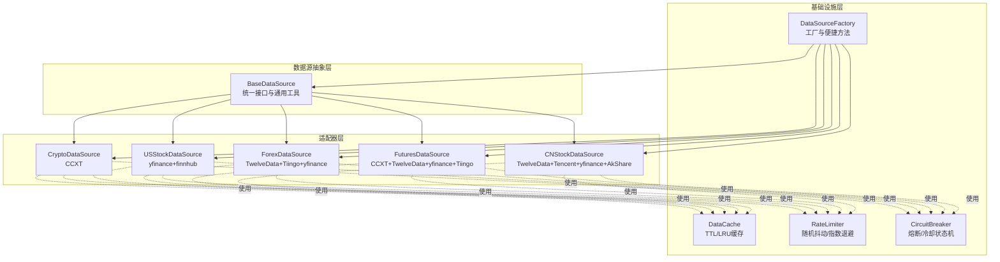
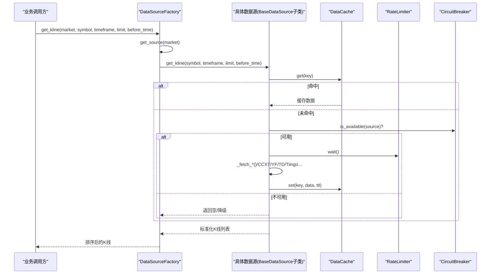
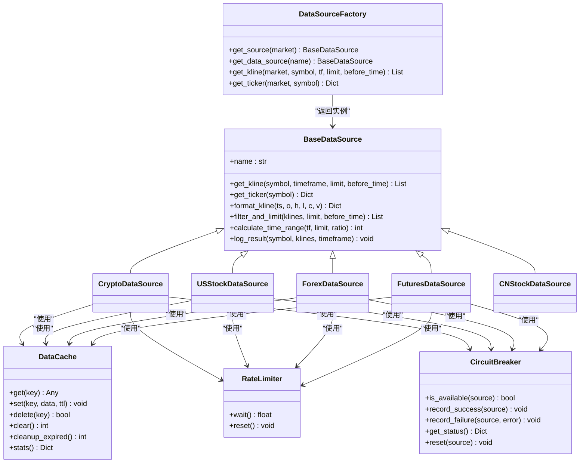
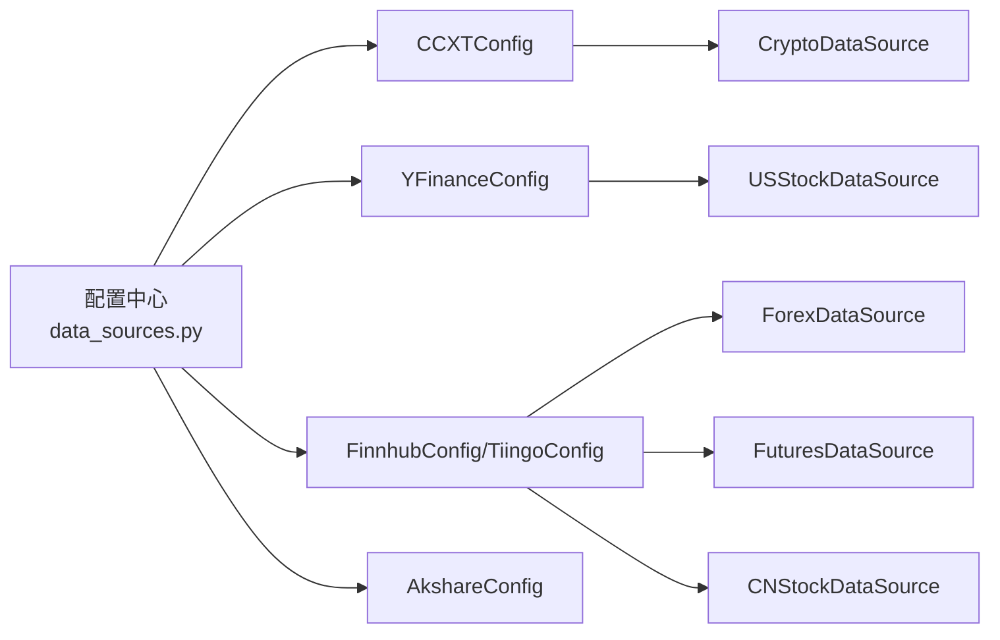

# 数据源集成

<cite>
**本文引用的文件**
- [backend_api_python/app/data_sources/base.py](file://backend_api_python/app/data_sources/base.py)
- [backend_api_python/app/data_sources/factory.py](file://backend_api_python/app/data_sources/factory.py)
- [backend_api_python/app/data_sources/cache_manager.py](file://backend_api_python/app/data_sources/cache_manager.py)
- [backend_api_python/app/data_sources/rate_limiter.py](file://backend_api_python/app/data_sources/rate_limiter.py)
- [backend_api_python/app/data_sources/circuit_breaker.py](file://backend_api_python/app/data_sources/circuit_breaker.py)
- [backend_api_python/app/data_sources/crypto.py](file://backend_api_python/app/data_sources/crypto.py)
- [backend_api_python/app/data_sources/us_stock.py](file://backend_api_python/app/data_sources/us_stock.py)
- [backend_api_python/app/data_sources/forex.py](file://backend_api_python/app/data_sources/forex.py)
- [backend_api_python/app/data_sources/futures.py](file://backend_api_python/app/data_sources/futures.py)
- [backend_api_python/app/data_sources/cn_stock.py](file://backend_api_python/app/data_sources/cn_stock.py)
- [backend_api_python/app/data_sources/__init__.py](file://backend_api_python/app/data_sources/__init__.py)
- [backend_api_python/app/config/data_sources.py](file://backend_api_python/app/config/data_sources.py)
- [backend_api_python/app/utils/logger.py](file://backend_api_python/app/utils/logger.py)
</cite>

## 目录
1. [简介](#简介)
2. [项目结构](#项目结构)
3. [核心组件](#核心组件)
4. [架构总览](#架构总览)
5. [详细组件分析](#详细组件分析)
6. [依赖分析](#依赖分析)
7. [性能考虑](#性能考虑)
8. [故障排查指南](#故障排查指南)
9. [结论](#结论)
10. [附录](#附录)

## 简介
本指南面向希望为新市场类型或数据提供商创建数据源适配器的开发者。文档基于现有代码库中的数据源抽象与实现，系统讲解如何遵循 BaseDataSource 抽象类规范，实现 get_kline、get_ticker 等核心方法，以及如何在工厂模式、缓存、限流与熔断机制下进行集成与优化。同时提供针对加密货币交易所、股票市场与外汇平台的完整开发示例路径与最佳实践。

## 项目结构
数据源相关代码集中在 backend_api_python/app/data_sources 目录，采用“抽象基类 + 市场适配器 + 工厂 + 基础设施”的分层设计：
- 抽象层：BaseDataSource 定义统一接口与通用工具（格式化、时间范围计算、过滤限制、结果日志）
- 适配器层：各市场专用实现（加密货币、美股、外汇、期货、A股等）
- 基础设施：缓存、限流、熔断、工厂
- 配置：集中管理各外部服务的超时、映射、代理等参数

图表来源
- [backend_api_python/app/data_sources/base.py:27-171](file://backend_api_python/app/data_sources/base.py#L27-L171)
- [backend_api_python/app/data_sources/factory.py:13-134](file://backend_api_python/app/data_sources/factory.py#L13-L134)
- [backend_api_python/app/data_sources/cache_manager.py:44-233](file://backend_api_python/app/data_sources/cache_manager.py#L44-L233)
- [backend_api_python/app/data_sources/rate_limiter.py:109-273](file://backend_api_python/app/data_sources/rate_limiter.py#L109-L273)
- [backend_api_python/app/data_sources/circuit_breaker.py:31-175](file://backend_api_python/app/data_sources/circuit_breaker.py#L31-L175)
- [backend_api_python/app/data_sources/crypto.py:16-388](file://backend_api_python/app/data_sources/crypto.py#L16-L388)
- [backend_api_python/app/data_sources/us_stock.py:17-318](file://backend_api_python/app/data_sources/us_stock.py#L17-L318)
- [backend_api_python/app/data_sources/forex.py:95-690](file://backend_api_python/app/data_sources/forex.py#L95-L690)
- [backend_api_python/app/data_sources/futures.py:60-465](file://backend_api_python/app/data_sources/futures.py#L60-L465)
- [backend_api_python/app/data_sources/cn_stock.py:30-100](file://backend_api_python/app/data_sources/cn_stock.py#L30-L100)

章节来源
- [backend_api_python/app/data_sources/__init__.py:1-45](file://backend_api_python/app/data_sources/__init__.py#L1-L45)

## 核心组件
- BaseDataSource：定义 get_kline、get_ticker 抽象方法，提供 format_kline、filter_and_limit、calculate_time_range、log_result 等通用能力，确保数据格式标准化与一致性。
- DataSourceFactory：按市场类型返回对应数据源实例，提供 get_kline、get_ticker 的便捷调用封装。
- DataCache：TTL/LRU 缓存，支持并发安全、命中率统计与过期清理。
- RateLimiter：请求间隔控制、随机抖动、指数退避重试，降低被封禁风险。
- CircuitBreaker：失败熔断、冷却时间、半开试探，避免雪崩效应。

章节来源
- [backend_api_python/app/data_sources/base.py:27-171](file://backend_api_python/app/data_sources/base.py#L27-L171)
- [backend_api_python/app/data_sources/factory.py:13-134](file://backend_api_python/app/data_sources/factory.py#L13-L134)
- [backend_api_python/app/data_sources/cache_manager.py:44-233](file://backend_api_python/app/data_sources/cache_manager.py#L44-L233)
- [backend_api_python/app/data_sources/rate_limiter.py:109-273](file://backend_api_python/app/data_sources/rate_limiter.py#L109-L273)
- [backend_api_python/app/data_sources/circuit_breaker.py:31-175](file://backend_api_python/app/data_sources/circuit_breaker.py#L31-L175)

## 架构总览
数据请求在业务层通过工厂获取目标市场数据源，适配器内部可结合缓存、限流与熔断策略，最终统一返回标准化的K线/实时报价数据。日志系统贯穿各环节，便于监控与排障。

图表来源
- [backend_api_python/app/data_sources/factory.py:74-106](file://backend_api_python/app/data_sources/factory.py#L74-L106)
- [backend_api_python/app/data_sources/cache_manager.py:71-128](file://backend_api_python/app/data_sources/cache_manager.py#L71-L128)
- [backend_api_python/app/data_sources/rate_limiter.py:135-159](file://backend_api_python/app/data_sources/rate_limiter.py#L135-L159)
- [backend_api_python/app/data_sources/circuit_breaker.py:67-100](file://backend_api_python/app/data_sources/circuit_breaker.py#L67-L100)

## 详细组件分析

### BaseDataSource 抽象类与实现规范
- 必须实现的方法
  - get_kline(symbol, timeframe, limit, before_time=None)：返回标准化K线列表，元素包含 time、open、high、low、close、volume。
  - get_ticker(symbol)：返回实时报价（可选）。若不支持，抛出 NotImplementedError 或返回兼容字段的默认值。
- 建议实现的方法
  - format_kline(timestamp, open, high, low, close, volume)：统一四舍五入精度与字段命名。
  - filter_and_limit(klines, limit, before_time=None)：按时间排序、过滤、截断。
  - calculate_time_range(timeframe, limit, buffer_ratio=1.2)：估算请求时间窗口。
  - log_result(symbol, klines, timeframe)：记录最新K线时间与延迟告警。
- 关键约束
  - 时间戳统一为 UTC 秒级；volume 统一为数值。
  - 字段命名与精度保持一致，便于上层策略与回测系统稳定消费。

章节来源
- [backend_api_python/app/data_sources/base.py:27-171](file://backend_api_python/app/data_sources/base.py#L27-L171)

### DataSourceFactory 工厂
- get_source(market)：按市场类型返回对应数据源实例（缓存实例）。
- get_data_source(name)：向后兼容旧调用（如“binance”等）。
- get_kline/get_ticker：统一封装调用、异常捕获与排序/默认值处理。

章节来源
- [backend_api_python/app/data_sources/factory.py:13-134](file://backend_api_python/app/data_sources/factory.py#L13-L134)

### 缓存策略（DataCache）
- 特性：TTL 过期、LRU 淘汰、最大容量限制、线程安全、命中率统计。
- 全局缓存实例：实时行情、K线数据、股票信息分别设置不同 TTL 与容量。
- 键生成：K线缓存键包含 symbol、timeframe、limit、before_time，避免交叉污染。

章节来源
- [backend_api_python/app/data_sources/cache_manager.py:44-233](file://backend_api_python/app/data_sources/cache_manager.py#L44-L233)

### 限流与防封禁（RateLimiter + retry_with_backoff）
- RateLimiter：最小间隔 + 随机抖动，避免固定节奏触发风控。
- retry_with_backoff：指数退避 + 随机抖动，支持自定义异常类型与回调。
- User-Agent 轮换与随机休眠：降低被识别为脚本的风险。

章节来源
- [backend_api_python/app/data_sources/rate_limiter.py:109-273](file://backend_api_python/app/data_sources/rate_limiter.py#L109-L273)

### 熔断机制（CircuitBreaker）
- 状态机：CLOSED → OPEN（冷却）→ HALF_OPEN（试探）→ CLOSED/OPEN。
- 配置：失败阈值、冷却时间、半开最大尝试次数。
- 作用：在外部服务不稳定时快速失败并冷却，避免放大故障。

章节来源
- [backend_api_python/app/data_sources/circuit_breaker.py:31-175](file://backend_api_python/app/data_sources/circuit_breaker.py#L31-L175)

### 加密货币数据源（CryptoDataSource）
- 符号规范化：支持 BTC/USDT、BTCUSDT、BTC/USDT:USDT 等多种输入，自动映射交易所符号。
- 时间周期映射：基于 CCXTConfig.TIMEFRAME_MAP。
- 备用获取：_fetch_ohlcv/_fetch_ohlcv_fallback 支持分页与降级。
- 熔断/限流：可复用全局熔断器与限流器实例。

章节来源
- [backend_api_python/app/data_sources/crypto.py:16-388](file://backend_api_python/app/data_sources/crypto.py#L16-L388)
- [backend_api_python/app/config/data_sources.py:101-150](file://backend_api_python/app/config/data_sources.py#L101-L150)

### 美股数据源（USStockDataSource）
- 优先级：Finnhub（实时）→ yfinance.fast_info → yfinance.info → 历史1分钟K线近似。
- 日内周期映射与天数估算：DAYS_MAP 基于交易小时与节假日比例估算。
- 降级链路：当某一层失败时自动切换到下一层。

章节来源
- [backend_api_python/app/data_sources/us_stock.py:17-318](file://backend_api_python/app/data_sources/us_stock.py#L17-L318)
- [backend_api_python/app/config/data_sources.py:75-99](file://backend_api_python/app/config/data_sources.py#L75-L99)

### 外汇数据源（ForexDataSource）
- 三级降级：Twelve Data → Tiingo → yfinance。
- 特殊处理：Tiingo 1分钟数据需付费；周线/月线通过日线聚合。
- 缓存：全局轻量缓存减少频繁请求。

章节来源
- [backend_api_python/app/data_sources/forex.py:95-690](file://backend_api_python/app/data_sources/forex.py#L95-L690)
- [backend_api_python/app/config/data_sources.py:58-73](file://backend_api_python/app/config/data_sources.py#L58-L73)

### 期货数据源（FuturesDataSource）
- 传统期货：Twelve Data → yfinance → Tiingo（贵金属）。
- 加密货币期货：CCXT Binance Futures。
- 符号与周期映射：区分传统合约与加密货币期货格式。

章节来源
- [backend_api_python/app/data_sources/futures.py:60-465](file://backend_api_python/app/data_sources/futures.py#L60-L465)
- [backend_api_python/app/config/data_sources.py:101-150](file://backend_api_python/app/config/data_sources.py#L101-L150)

### 中国A股数据源（CNStockDataSource）
- 多层降级：Twelve Data（主）→ 腾讯日/周线 → yfinance → AkShare。
- 分支逻辑：分钟/小时优先 yfinance/AkShare；日/周线优先腾讯。

章节来源
- [backend_api_python/app/data_sources/cn_stock.py:30-100](file://backend_api_python/app/data_sources/cn_stock.py#L30-L100)

### 类关系图（代码级）

图表来源
- [backend_api_python/app/data_sources/base.py:27-171](file://backend_api_python/app/data_sources/base.py#L27-L171)
- [backend_api_python/app/data_sources/factory.py:13-134](file://backend_api_python/app/data_sources/factory.py#L13-L134)
- [backend_api_python/app/data_sources/cache_manager.py:44-233](file://backend_api_python/app/data_sources/cache_manager.py#L44-L233)
- [backend_api_python/app/data_sources/rate_limiter.py:109-273](file://backend_api_python/app/data_sources/rate_limiter.py#L109-L273)
- [backend_api_python/app/data_sources/circuit_breaker.py:31-175](file://backend_api_python/app/data_sources/circuit_breaker.py#L31-L175)
- [backend_api_python/app/data_sources/crypto.py:16-388](file://backend_api_python/app/data_sources/crypto.py#L16-L388)
- [backend_api_python/app/data_sources/us_stock.py:17-318](file://backend_api_python/app/data_sources/us_stock.py#L17-L318)
- [backend_api_python/app/data_sources/forex.py:95-690](file://backend_api_python/app/data_sources/forex.py#L95-L690)
- [backend_api_python/app/data_sources/futures.py:60-465](file://backend_api_python/app/data_sources/futures.py#L60-L465)
- [backend_api_python/app/data_sources/cn_stock.py:30-100](file://backend_api_python/app/data_sources/cn_stock.py#L30-L100)

## 依赖分析
- 组件耦合
  - 适配器仅依赖 BaseDataSource 抽象，耦合度低，易于扩展。
  - 工厂负责实例化与调用封装，隔离上层与底层实现。
  - 缓存、限流、熔断作为横切关注点，通过组合注入到适配器中。
- 外部依赖
  - 加密货币：CCXT（交易所SDK）
  - 股票：yfinance、finnhub
  - 外汇：Twelve Data、Tiingo、yfinance
  - 期货：CCXT、Twelve Data、yfinance、Tiingo
  - A股：Twelve Data、Tencent、yfinance、AkShare
- 配置中心
  - 通过 MetaConfig 类型属性从环境变量或附加配置加载，统一管理超时、映射、代理等。

图表来源
- [backend_api_python/app/config/data_sources.py:26-171](file://backend_api_python/app/config/data_sources.py#L26-L171)

章节来源
- [backend_api_python/app/config/data_sources.py:26-171](file://backend_api_python/app/config/data_sources.py#L26-L171)

## 性能考虑
- 缓存策略
  - K线缓存：短TTL（5分钟）、低容量（500），适合高频请求场景。
  - 实时行情：中TTL（20分钟）、高容量（6000），平衡新鲜度与成本。
  - 股票信息：长TTL（24小时），降低外部API压力。
  - 建议：为每类数据源设置独立缓存键空间，避免冲突。
- 限流与退避
  - 使用 RateLimiter 控制最小请求间隔与抖动，降低触发限流概率。
  - retry_with_backoff 指数退避 + 随机抖动，提升失败恢复成功率。
- 熔断保护
  - CircuitBreaker 在连续失败后进入 OPEN，冷却后半开试探，防止级联故障。
- 数据预取与时间窗口
  - calculate_time_range 估算请求范围，结合 before_time 减少重复拉取。
  - filter_and_limit 保证返回数据量与时间边界可控。

章节来源
- [backend_api_python/app/data_sources/cache_manager.py:181-233](file://backend_api_python/app/data_sources/cache_manager.py#L181-L233)
- [backend_api_python/app/data_sources/rate_limiter.py:135-231](file://backend_api_python/app/data_sources/rate_limiter.py#L135-L231)
- [backend_api_python/app/data_sources/circuit_breaker.py:102-137](file://backend_api_python/app/data_sources/circuit_breaker.py#L102-L137)
- [backend_api_python/app/data_sources/base.py:83-131](file://backend_api_python/app/data_sources/base.py#L83-L131)

## 故障排查指南
- 日志定位
  - 使用 get_logger 获取模块日志，关注 WARNING/ERROR 级别输出。
  - BaseDataSource.log_result 会记录最新K线时间与延迟阈值，辅助判断数据时效性。
- 常见问题
  - 符号不匹配：加密货币符号规范化失败或交易所不支持，查看 _normalize_symbol/_find_valid_symbol 流程。
  - 限流/封禁：启用随机User-Agent、增加抖动、指数退避；必要时调整最小间隔。
  - 外部服务不可用：检查 API Key、网络代理、超时配置；观察熔断器状态。
- 监控建议
  - 启用 DataCache.stats 输出命中率与容量使用情况。
  - 定期检查 CircuitBreaker.get_status，确认熔断状态与失败原因。
  - 关注日志中的“延迟告警”与“降级返回”。

章节来源
- [backend_api_python/app/utils/logger.py:9-63](file://backend_api_python/app/utils/logger.py#L9-L63)
- [backend_api_python/app/data_sources/base.py:133-171](file://backend_api_python/app/data_sources/base.py#L133-L171)
- [backend_api_python/app/data_sources/cache_manager.py:160-174](file://backend_api_python/app/data_sources/cache_manager.py#L160-L174)
- [backend_api_python/app/data_sources/circuit_breaker.py:138-158](file://backend_api_python/app/data_sources/circuit_breaker.py#L138-L158)

## 结论
通过 BaseDataSource 抽象与工厂、缓存、限流、熔断等基础设施的协同，项目实现了对多市场、多提供商数据源的统一接入与稳健运行。开发者只需遵循统一接口与数据格式规范，即可快速集成新的市场类型或数据提供商，并在既有保障机制下获得良好的性能与可靠性。

## 附录

### 为新市场创建数据源适配器的步骤
- 新建适配器类
  - 继承 BaseDataSource，实现 get_kline 与 get_ticker（可选）。
  - 在类内定义 name、时间周期映射、符号规范化逻辑。
- 注册到工厂
  - 在 DataSourceFactory._create_source 中添加新市场的分支，返回你的适配器实例。
- 集成基础设施
  - 在适配器中使用 DataCache、RateLimiter、CircuitBreaker，按需启用。
- 配置与部署
  - 在 app/config/data_sources.py 中添加对应配置项（如TIMEOUT、TIMEFRAME_MAP、PROXY等）。
  - 在环境变量或附加配置中设置API Key与代理。
- 测试与验证
  - 使用 get_kline 与 get_ticker 的工厂便捷方法进行端到端测试。
  - 关注日志与缓存统计，评估延迟与命中率。

章节来源
- [backend_api_python/app/data_sources/factory.py:49-72](file://backend_api_python/app/data_sources/factory.py#L49-L72)
- [backend_api_python/app/config/data_sources.py:101-150](file://backend_api_python/app/config/data_sources.py#L101-L150)

### 数据格式标准化清单
- 字段
  - time：整数，UTC秒级时间戳
  - open/high/low/close：浮点数，按市场精度四舍五入
  - volume：浮点数，成交量或等效值
- 精度
  - 价格字段统一保留合理小数位（如4位），成交量2位
- 时间范围
  - before_time 传入时，确保返回数据严格早于该时间
  - limit 传入时，返回最新 limit 条数据

章节来源
- [backend_api_python/app/data_sources/base.py:64-82](file://backend_api_python/app/data_sources/base.py#L64-L82)
- [backend_api_python/app/data_sources/base.py:103-131](file://backend_api_python/app/data_sources/base.py#L103-L131)

### 错误处理与降级策略
- 外部调用失败
  - 使用 retry_with_backoff 指数退避重试
  - 记录 CircuitBreaker 失败并进入冷却
- 符号/周期不支持
  - 提供备用符号映射或降级周期
- 无数据
  - 返回空列表或默认值，避免上层崩溃
- 日志与监控
  - 使用 log_result 输出延迟告警
  - 使用 DataCache.stats 与 CircuitBreaker.get_status 进行观测

章节来源
- [backend_api_python/app/data_sources/rate_limiter.py:170-231](file://backend_api_python/app/data_sources/rate_limiter.py#L170-L231)
- [backend_api_python/app/data_sources/circuit_breaker.py:116-137](file://backend_api_python/app/data_sources/circuit_breaker.py#L116-L137)
- [backend_api_python/app/data_sources/base.py:133-171](file://backend_api_python/app/data_sources/base.py#L133-L171)

### 性能优化与缓存策略
- 缓存键设计
  - K线缓存键包含 symbol、timeframe、limit、before_time，避免交叉污染
- TTL与容量
  - 根据数据新鲜度需求选择TTL与容量
  - 定期清理过期条目，维持缓存健康
- 请求节流
  - 合理设置最小间隔与抖动幅度，避免触发风控
- 数据预取
  - 使用 calculate_time_range 估算窗口，减少多次往返

章节来源
- [backend_api_python/app/data_sources/cache_manager.py:218-233](file://backend_api_python/app/data_sources/cache_manager.py#L218-L233)
- [backend_api_python/app/data_sources/base.py:83-102](file://backend_api_python/app/data_sources/base.py#L83-L102)
- [backend_api_python/app/data_sources/rate_limiter.py:135-159](file://backend_api_python/app/data_sources/rate_limiter.py#L135-L159)

### 测试、监控与维护指引
- 单元测试
  - 验证 get_kline 返回格式与边界条件（空数据、越界时间）
  - 验证 get_ticker 的降级链路与默认值
- 集成测试
  - 使用 DataSourceFactory.get_kline 进行端到端验证
  - 模拟熔断与限流，验证降级行为
- 监控指标
  - 缓存命中率、过期清理数量
  - 熔断器状态与失败原因
  - 日志延迟告警频次
- 维护建议
  - 定期评估外部API稳定性与费用，调整降级策略
  - 根据实际使用情况优化TTL与容量
  - 为新增市场补充配置与日志埋点

章节来源
- [backend_api_python/app/data_sources/cache_manager.py:160-174](file://backend_api_python/app/data_sources/cache_manager.py#L160-L174)
- [backend_api_python/app/data_sources/circuit_breaker.py:138-158](file://backend_api_python/app/data_sources/circuit_breaker.py#L138-L158)
- [backend_api_python/app/data_sources/factory.py:74-106](file://backend_api_python/app/data_sources/factory.py#L74-L106)