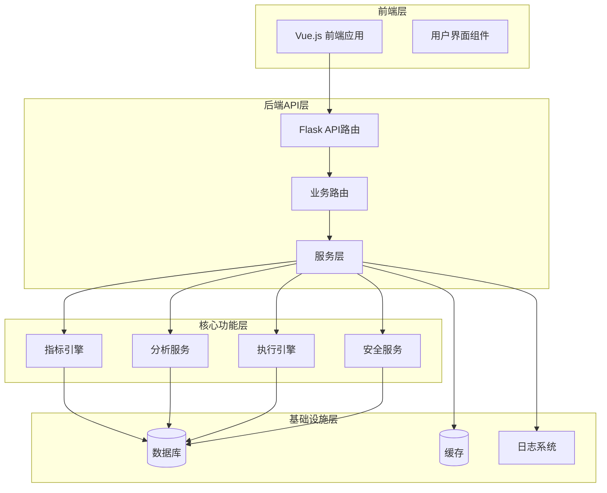
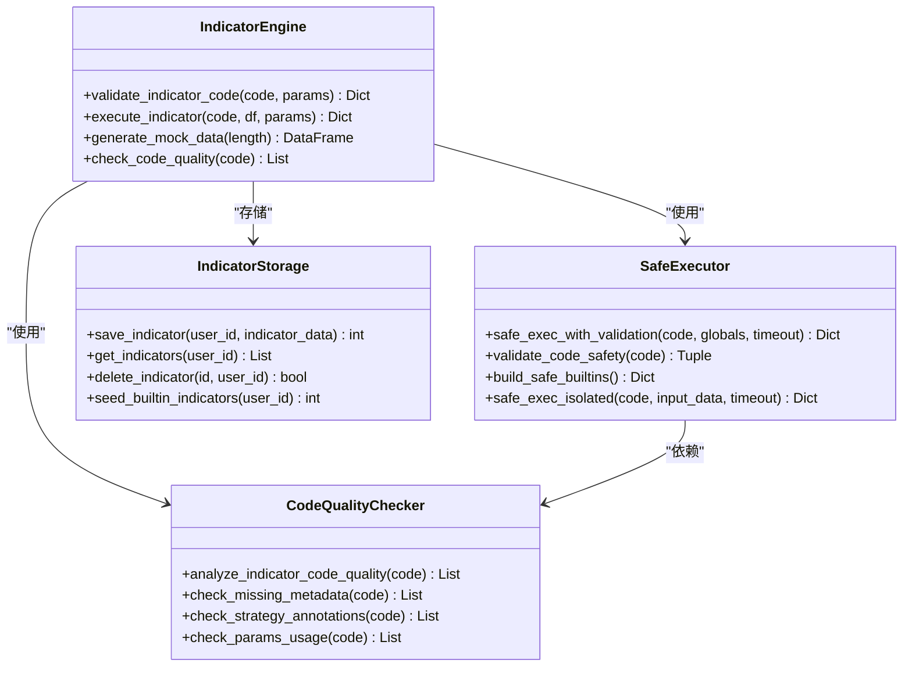
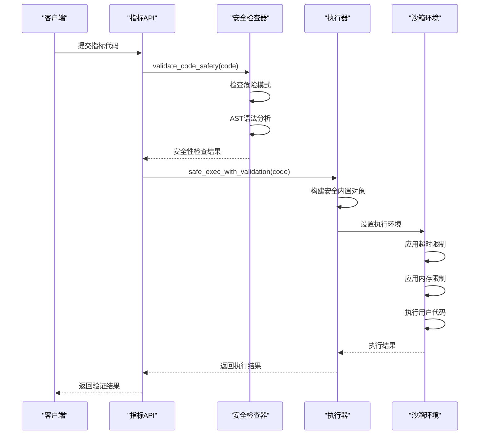
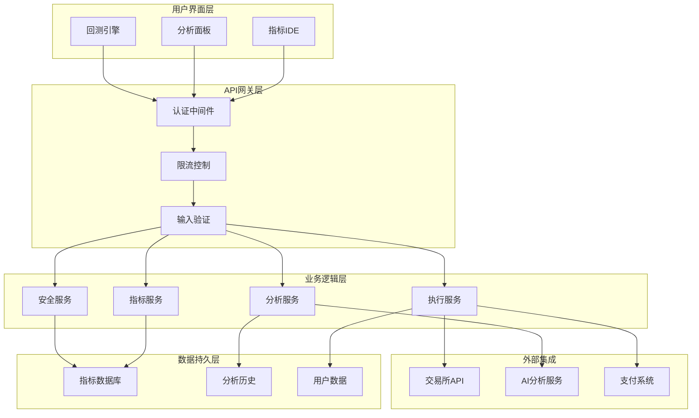
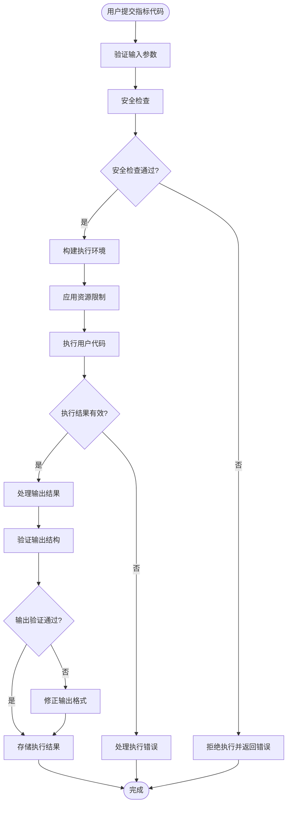
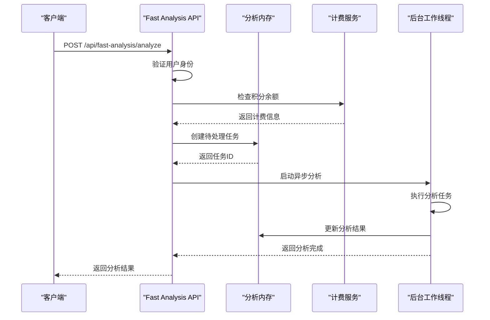
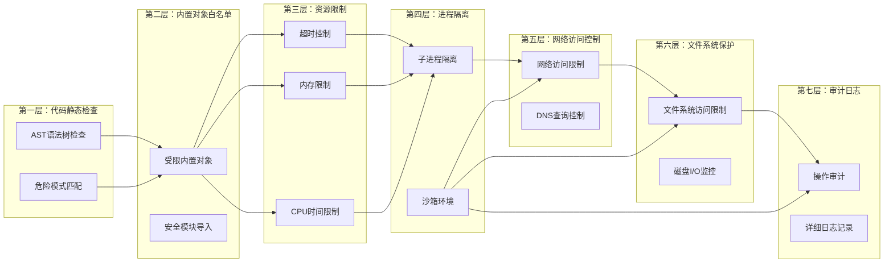
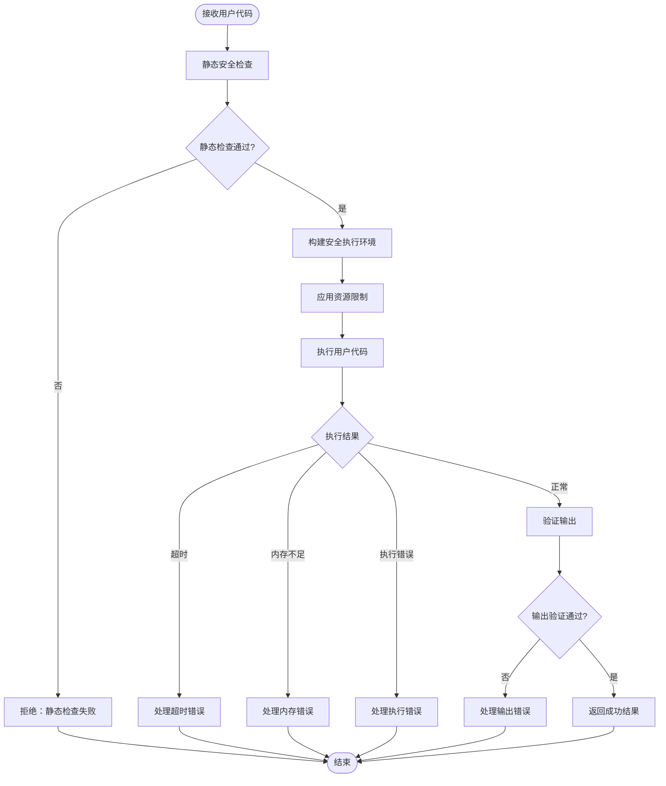
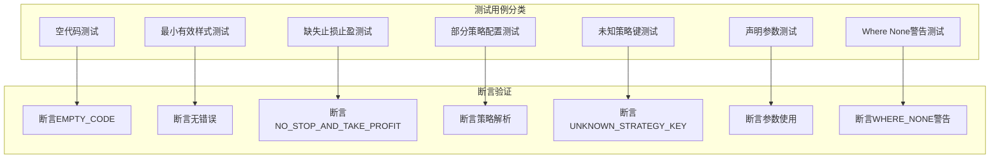
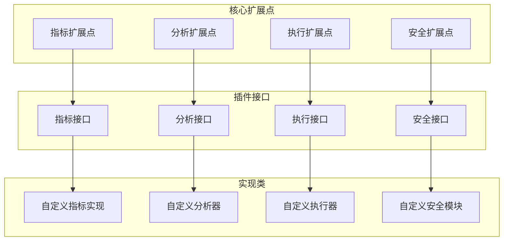

# 自定义功能开发

<cite>
**本文档引用的文件**
- [builtin_indicators.py](file://backend_api_python/app/services/builtin_indicators.py)
- [safe_exec.py](file://backend_api_python/app/utils/safe_exec.py)
- [indicator_code_quality.py](file://backend_api_python/app/services/indicator_code_quality.py)
- [indicator.py](file://backend_api_python/app/routes/indicator.py)
- [security_service.py](file://backend_api_python/app/services/security_service.py)
- [indicator_params.py](file://backend_api_python/app/services/indicator_params.py)
- [logger.py](file://backend_api_python/app/utils/logger.py)
- [test_indicator_code_quality.py](file://backend_api_python/tests/test_indicator_code_quality.py)
- [cross_sectional_momentum_rsi.py](file://docs/examples/cross_sectional_momentum_rsi.py)
- [dual_ma_with_params.py](file://docs/examples/dual_ma_with_params.py)
- [reflection.py](file://backend_api_python/app/services/reflection.py)
- [fast_analysis.py](file://backend_api_python/app/routes/fast_analysis.py)
- [STRATEGY_DEV_GUIDE.md](file://docs/STRATEGY_DEV_GUIDE.md)
</cite>

## 目录
1. [简介](#简介)
2. [项目结构概览](#项目结构概览)
3. [核心组件分析](#核心组件分析)
4. [架构设计](#架构设计)
5. [自定义指标开发指南](#自定义指标开发指南)
6. [分析工具扩展](#分析工具扩展)
7. [安全执行机制](#安全执行机制)
8. [代码质量检查系统](#代码质量检查系统)
9. [完整开发示例](#完整开发示例)
10. [性能优化与兼容性](#性能优化与兼容性)
11. [部署与配置](#部署与配置)
12. [扩展点与插件化架构](#扩展点与插件化架构)
13. [故障排除指南](#故障排除指南)
14. [结论](#结论)

## 简介

QuantDinger是一个功能强大的量化交易开发平台，提供了完整的自定义功能开发框架。本文档详细介绍了如何开发自定义指标、分析工具和扩展功能，包括安全执行机制、代码质量检查系统、性能优化和兼容性保证等方面。

该平台支持两种主要的开发模型：
- **IndicatorStrategy**: 基于数据框的指标研究、图表渲染和信号风格回测
- **ScriptStrategy**: 事件驱动的运行时执行、策略回测和实盘交易

## 项目结构概览

QuantDinger采用模块化的架构设计，主要分为以下几个核心层次：



**图表来源**
- [indicator.py:1-800](file://backend_api_python/app/routes/indicator.py#L1-L800)
- [safe_exec.py:1-471](file://backend_api_python/app/utils/safe_exec.py#L1-L471)

**章节来源**
- [indicator.py:1-800](file://backend_api_python/app/routes/indicator.py#L1-L800)
- [safe_exec.py:1-471](file://backend_api_python/app/utils/safe_exec.py#L1-L471)

## 核心组件分析

### 指标引擎核心组件

指标引擎是QuantDinger的核心功能模块，负责处理用户自定义指标的创建、验证和执行。



**图表来源**
- [indicator.py:126-277](file://backend_api_python/app/routes/indicator.py#L126-L277)
- [safe_exec.py:157-244](file://backend_api_python/app/utils/safe_exec.py#L157-L244)
- [indicator_code_quality.py:79-205](file://backend_api_python/app/services/indicator_code_quality.py#L79-L205)

### 安全执行系统

QuantDinger实现了多层次的安全执行机制，确保用户代码在受控环境中运行。



**图表来源**
- [safe_exec.py:207-244](file://backend_api_python/app/utils/safe_exec.py#L207-L244)
- [indicator.py:169-174](file://backend_api_python/app/routes/indicator.py#L169-L174)

**章节来源**
- [builtin_indicators.py:192-250](file://backend_api_python/app/services/builtin_indicators.py#L192-L250)
- [indicator_code_quality.py:79-205](file://backend_api_python/app/services/indicator_code_quality.py#L79-L205)
- [safe_exec.py:157-244](file://backend_api_python/app/utils/safe_exec.py#L157-L244)

## 架构设计

### 整体架构图



**图表来源**
- [indicator.py:411-744](file://backend_api_python/app/routes/indicator.py#L411-L744)
- [security_service.py:26-399](file://backend_api_python/app/services/security_service.py#L26-L399)

### 数据流架构



**图表来源**
- [indicator.py:126-277](file://backend_api_python/app/routes/indicator.py#L126-L277)
- [safe_exec.py:157-205](file://backend_api_python/app/utils/safe_exec.py#L157-L205)

**章节来源**
- [indicator.py:1-800](file://backend_api_python/app/routes/indicator.py#L1-L800)
- [security_service.py:1-399](file://backend_api_python/app/services/security_service.py#L1-L399)

## 自定义指标开发指南

### 指标开发基础

#### 1. 指标元数据声明

每个自定义指标必须包含以下元数据：

```python
my_indicator_name = "我的指标名称"
my_indicator_description = "指标功能描述"
```

#### 2. 参数声明系统

使用`# @param`声明可配置参数：

```python
# @param fast_period int 14 快速均线周期
# @param slow_period int 28 慢速均线周期  
# @param threshold float 0.5 触发阈值
# @param use_filter bool true 是否使用过滤器
```

#### 3. 策略配置声明

使用`# @strategy`声明默认策略参数：

```python
# @strategy stopLossPct 0.03 止损比例
# @strategy takeProfitPct 0.06 止盈比例
# @strategy entryPct 0.25 仓位比例
# @strategy tradeDirection long 交易方向
# @strategy trailingEnabled false 追踪止损
```

### 指标开发最佳实践

#### 1. 数据处理规范

```python
# 必须复制数据框以避免修改原始数据
df = df.copy()

# 确保必要的列存在
required_columns = ['open', 'high', 'low', 'close', 'volume']
for col in required_columns:
    if col not in df.columns:
        df[col] = 0.0
```

#### 2. 信号生成模式

```python
# 使用边缘触发避免重复信号
raw_buy = condition & ~condition.shift(1)
raw_sell = condition & ~condition.shift(1)

df['buy'] = (raw_buy.fillna(False) & ~raw_buy.shift(1).fillna(False)).astype(bool)
df['sell'] = (raw_sell.fillna(False) & ~raw_sell.shift(1).fillna(False)).astype(bool)
```

#### 3. 图表输出格式

```python
output = {
    "name": my_indicator_name,
    "plots": [
        {
            "name": "指标名称",
            "data": calculated_series.tolist(),
            "color": "#RRGGBB",
            "overlay": True,
            "type": "line"
        }
    ],
    "signals": [
        {
            "type": "buy",
            "text": "B",
            "data": [price if condition else None for price, condition in zip(df['close'], df['buy'])],
            "color": "#00E676"
        }
    ]
}
```

**章节来源**
- [dual_ma_with_params.py:17-64](file://docs/examples/dual_ma_with_params.py#L17-L64)
- [indicator.py:38-55](file://backend_api_python/app/routes/indicator.py#L38-L55)

## 分析工具扩展

### 快速分析API

QuantDinger提供了高性能的分析工具扩展能力：



**图表来源**
- [fast_analysis.py:113-340](file://backend_api_python/app/routes/fast_analysis.py#L113-L340)

### 分析内存管理

分析工具使用内存管理系统来跟踪分析历史和状态：

```python
class AnalysisMemory:
    def create_pending_task(self, market, symbol, language, model, timeframe, user_id):
        # 创建待处理分析任务
        pass
    
    def finalize_pending_task(self, task_id, result):
        # 完成分析任务并存储结果
        pass
    
    def get_recent(self, market, symbol, days, limit):
        # 获取最近的分析历史
        pass
    
    def delete_history(self, memory_id, user_id):
        # 删除分析历史记录
        pass
```

**章节来源**
- [fast_analysis.py:1-800](file://backend_api_python/app/routes/fast_analysis.py#L1-L800)
- [reflection.py:22-101](file://backend_api_python/app/services/reflection.py#L22-L101)

## 安全执行机制

### 多层安全防护

QuantDinger实现了七层安全防护机制：



**图表来源**
- [safe_exec.py:24-62](file://backend_api_python/app/utils/safe_exec.py#L24-L62)
- [safe_exec.py:95-154](file://backend_api_python/app/utils/safe_exec.py#L95-L154)

### 安全执行流程



**图表来源**
- [safe_exec.py:157-205](file://backend_api_python/app/utils/safe_exec.py#L157-L205)

**章节来源**
- [safe_exec.py:1-471](file://backend_api_python/app/utils/safe_exec.py#L1-L471)
- [security_service.py:26-399](file://backend_api_python/app/services/security_service.py#L26-L399)

## 代码质量检查系统

### 质量检查规则

QuantDinger实现了全面的代码质量检查系统，包括：

#### 1. 元数据完整性检查

```python
def analyze_indicator_code_quality(code):
    hints = []
    
    # 检查指标名称
    if not _has_my_indicator_meta(code):
        hints.append({
            "severity": "warn",
            "code": "MISSING_INDICATOR_NAME",
            "params": {}
        })
    
    # 检查描述信息
    if not _has_my_indicator_description(code):
        hints.append({
            "severity": "info", 
            "code": "MISSING_INDICATOR_DESCRIPTION",
            "params": {}
        })
    
    # 检查数据复制
    if not _has_df_copy(code):
        hints.append({
            "severity": "info",
            "code": "MISSING_DF_COPY",
            "params": {}
        })
    
    return hints
```

#### 2. 参数使用检查

```python
def check_params_usage(code):
    declared_params = _declared_param_names(code)
    unread_params = []
    
    for param in declared_params:
        if not _uses_params_get(code, param):
            unread_params.append(param)
    
    if unread_params:
        return {
            "severity": "warn",
            "code": "DECLARED_PARAMS_NOT_READ_VIA_PARAMS_GET",
            "params": {"names": unread_params}
        }
    
    return None
```

#### 3. 策略配置验证

```python
def validate_strategy_config(code):
    hints = []
    cfg = StrategyConfigParser.parse(code)
    
    if cfg:
        # 检查止损和止盈配置
        sl = cfg.get("stopLossPct")
        tp = cfg.get("takeProfitPct")
        
        if sl is None and tp is None:
            hints.append({
                "severity": "warn",
                "code": "NO_STOP_AND_TAKE_PROFIT",
                "params": {}
            })
        elif sl is None:
            hints.append({
                "severity": "info", 
                "code": "NO_STOP_LOSS",
                "params": {}
            })
        elif tp is None:
            hints.append({
                "severity": "info",
                "code": "NO_TAKE_PROFIT", 
                "params": {}
            })
    
    return hints
```

### 质量检查测试



**图表来源**
- [test_indicator_code_quality.py:7-135](file://backend_api_python/tests/test_indicator_code_quality.py#L7-L135)

**章节来源**
- [indicator_code_quality.py:1-206](file://backend_api_python/app/services/indicator_code_quality.py#L1-L206)
- [test_indicator_code_quality.py:1-135](file://backend_api_python/tests/test_indicator_code_quality.py#L1-L135)

## 完整开发示例

### 示例1：双均线交叉策略

这是一个完整的双均线交叉策略开发示例：

```python
# 指标元数据
my_indicator_name = "双均线交叉策略"
my_indicator_description = "使用短期/长期均线金叉与死叉生成买卖信号"

# 参数声明
# @param sma_short int 14 短期均线周期
# @param sma_long int 28 长期均线周期

# 策略配置
# @strategy stopLossPct 0.02
# @strategy takeProfitPct 0.05  
# @strategy entryPct 0.25
# @strategy trailingEnabled false
# @strategy tradeDirection both

# 数据处理
df = df.copy()

# 从params读取参数
sma_short_period = int(params.get('sma_short', 14))
sma_long_period = int(params.get('sma_long', 28))

# 计算均线
sma_short = df["close"].rolling(sma_short_period).mean()
sma_long = df["close"].rolling(sma_long_period).mean()

# 生成边缘触发信号
raw_buy = (sma_short > sma_long) & (sma_short.shift(1) <= sma_long.shift(1))
raw_sell = (sma_short < sma_long) & (sma_short.shift(1) >= sma_long.shift(1))

df["buy"] = (raw_buy.fillna(False) & ~raw_buy.shift(1).fillna(False)).astype(bool)
df["sell"] = (raw_sell.fillna(False) & ~raw_sell.shift(1).fillna(False)).astype(bool)

# 买卖标记点
buy_marks = [df["low"].iloc[i] * 0.995 if df["buy"].iloc[i] else None for i in range(len(df))]
sell_marks = [df["high"].iloc[i] * 1.005 if df["sell"].iloc[i] else None for i in range(len(df))]

# 图表输出
output = {
    "name": my_indicator_name,
    "plots": [
        {"name": f"SMA{sma_short_period}", "data": sma_short.fillna(0).tolist(), "color": "#FF9800", "overlay": True},
        {"name": f"SMA{sma_long_period}", "data": sma_long.fillna(0).tolist(), "color": "#3F51B5", "overlay": True}
    ],
    "signals": [
        {"type": "buy", "text": "B", "data": buy_marks, "color": "#00E676"},
        {"type": "sell", "text": "S", "data": sell_marks, "color": "#FF5252"}
    ]
}
```

**章节来源**
- [dual_ma_with_params.py:17-64](file://docs/examples/dual_ma_with_params.py#L17-L64)

### 示例2：截面动量策略

这是一个截面策略的开发示例：

```python
# 截面策略指标
# 输入: data = {symbol1: df1, symbol2: df2, ...}
# 输出: scores = {symbol1: score1, symbol2: score2, ...}

scores = {}

# 遍历全部标的
for symbol, df in data.items():
    # 确保数据长度足够
    if len(df) < 20:
        scores[symbol] = 0
        continue
    
    # 计算动量因子 (20周期)
    momentum = (df['close'].iloc[-1] / df['close'].iloc[-20] - 1) * 100
    
    # 计算RSI指标 (14周期)
    def calculate_rsi(prices, period=14):
        delta = prices.diff()
        gain = (delta.where(delta > 0, 0)).rolling(window=period).mean()
        loss = (-delta.where(delta < 0, 0)).rolling(window=period).mean()
        rs = gain / loss
        rsi = 100 - (100 / (1 + rs))
        return rsi.iloc[-1]
    
    rsi_value = calculate_rsi(df['close'], 14)
    
    # 综合评分 (70% 动量 + 30% RSI反转值)
    momentum_score = momentum
    rsi_score = 100 - rsi_value  # 反转 RSI
    
    composite_score = momentum_score * 0.7 + rsi_score * 0.3
    
    scores[symbol] = composite_score
```

**章节来源**
- [cross_sectional_momentum_rsi.py:22-71](file://docs/examples/cross_sectional_momentum_rsi.py#L22-L71)

## 性能优化与兼容性

### 性能优化策略

#### 1. 内存优化

```python
# 使用适当的数据类型减少内存占用
df['close'] = df['close'].astype('float32')
df['volume'] = df['volume'].astype('float32')

# 及时释放不需要的中间变量
del intermediate_calculation
```

#### 2. 计算优化

```python
# 使用向量化操作替代循环
# 不推荐
for i in range(len(df)):
    df.loc[i, 'signal'] = condition_func(df.iloc[i])

# 推荐
df['signal'] = df.apply(condition_func, axis=1)
```

#### 3. 缓存策略

```python
# 对于重复计算的结果进行缓存
@lru_cache(maxsize=128)
def expensive_calculation(param1, param2):
    # 复杂计算逻辑
    pass
```

### 兼容性保证

#### 1. 版本兼容性

```python
# 检查依赖版本
import pandas as pd
import numpy as np

# 确保最低版本要求
if tuple(map(int, pd.__version__.split('.'))) < (1, 3, 0):
    raise ImportError("Pandas version must be >= 1.3.0")

if tuple(map(int, np.__version__.split('.'))) < (1, 20, 0):
    raise ImportError("NumPy version must be >= 1.20.0")
```

#### 2. 数据格式兼容性

```python
# 处理不同的时间格式
def normalize_timestamp(timestamp):
    if isinstance(timestamp, str):
        return pd.to_datetime(timestamp).timestamp()
    elif isinstance(timestamp, pd.Timestamp):
        return timestamp.timestamp()
    else:
        return float(timestamp)
```

**章节来源**
- [STRATEGY_DEV_GUIDE.md:1-800](file://docs/STRATEGY_DEV_GUIDE.md#L1-L800)

## 部署与配置

### 环境配置

#### 1. 安全配置

```python
# 安全服务配置
class SecurityConfig:
    def __init__(self):
        self.turnstile_site_key = os.getenv('TURNSTILE_SITE_KEY', '')
        self.turnstile_secret_key = os.getenv('TURNSTILE_SECRET_KEY', '')
        self.ip_max_attempts = int(os.getenv('SECURITY_IP_MAX_ATTEMPTS', '10'))
        self.account_max_attempts = int(os.getenv('SECURITY_ACCOUNT_MAX_ATTEMPTS', '5'))
        self.code_rate_limit_seconds = int(os.getenv('VERIFICATION_CODE_RATE_LIMIT', '60'))
```

#### 2. 资源限制配置

```python
# 安全执行配置
class SafeExecConfig:
    def __init__(self):
        self.timeout = int(os.getenv('SAFE_EXEC_TIMEOUT', '30'))
        self.max_memory_mb = int(os.getenv('SAFE_EXEC_MAX_MEMORY_MB', '500'))
        self.enable_rlimit = os.getenv('SAFE_EXEC_ENABLE_RLIMIT', 'false').lower() == 'true'
```

#### 3. 日志配置

```python
# 日志配置
def setup_logging():
    log_level = os.getenv('LOG_LEVEL', 'INFO')
    log_format = '%(asctime)s - %(name)s - %(levelname)s - %(message)s'
    
    logging.basicConfig(
        level=getattr(logging, log_level.upper()),
        format=log_format
    )
    
    # 过滤特定模块的日志
    logging.getLogger('werkzeug').setLevel(logging.WARNING)
    logging.getLogger('app.routes.kline').setLevel(logging.WARNING)
```

### 部署最佳实践

#### 1. Docker容器化部署

```dockerfile
FROM python:3.9-slim

WORKDIR /app

COPY requirements.txt .
RUN pip install --no-cache-dir -r requirements.txt

COPY . .

EXPOSE 8000

CMD ["gunicorn", "--bind", "0.0.0.0:8000", "run:app"]
```

#### 2. 环境变量配置

```bash
# 安全相关
export TURNSTILE_SITE_KEY="your_site_key"
export TURNSTILE_SECRET_KEY="your_secret_key"
export ENABLE_REGISTRATION=true

# 资源限制
export SAFE_EXEC_TIMEOUT=60
export SAFE_EXEC_MAX_MEMORY_MB=1000

# 日志配置
export LOG_LEVEL=INFO
export LOG_LEVEL=DEBUG
```

**章节来源**
- [security_service.py:26-52](file://backend_api_python/app/services/security_service.py#L26-L52)
- [safe_exec.py:181-188](file://backend_api_python/app/utils/safe_exec.py#L181-L188)
- [logger.py:9-48](file://backend_api_python/app/utils/logger.py#L9-L48)

## 扩展点与插件化架构

### 扩展点识别

QuantDinger提供了多个扩展点来支持功能扩展：



**图表来源**
- [builtin_indicators.py:17-189](file://backend_api_python/app/services/builtin_indicators.py#L17-L189)
- [indicator_params.py:218-355](file://backend_api_python/app/services/indicator_params.py#L218-L355)

### 插件化架构设计

#### 1. 指标调用器

```python
class IndicatorCaller:
    def __init__(self, user_id, current_indicator_id=None):
        self.user_id = user_id
        self.current_indicator_id = current_indicator_id
        self._call_stack = []
    
    def call_indicator(self, indicator_ref, df, params=None, _depth=0):
        # 检查调用深度
        if _depth >= self.MAX_CALL_DEPTH:
            return df.copy()
        
        # 获取指标代码
        indicator_code, indicator_id = self._get_indicator_code(indicator_ref)
        
        # 递归调用支持
        local_vars = {
            'call_indicator': lambda ref, d, p=None: self.call_indicator(ref, d, p, _depth + 1)
        }
        
        # 安全执行
        exec_result = safe_exec_with_validation(
            code=indicator_code,
            exec_globals=local_vars,
            timeout=30,
        )
        
        return exec_env.get('df', df_copy)
```

#### 2. 参数解析器

```python
class IndicatorParamsParser:
    @classmethod
    def parse_params(cls, indicator_code):
        params = []
        for line in indicator_code.split('\n'):
            line = line.strip()
            match = cls.PARAM_PATTERN.match(line)
            if match:
                # 解析参数声明
                name = match.group(1)
                param_type = match.group(2).lower()
                default_str = match.group(3)
                description = match.group(4).strip() if match.group(4) else ''
                
                params.append({
                    "name": name,
                    "type": param_type,
                    "default": default_str,
                    "description": description
                })
        return params
```

#### 3. 策略配置解析器

```python
class StrategyConfigParser:
    VALID_KEYS = {
        'stopLossPct': {'type': 'float', 'min': 0, 'max': 1},
        'takeProfitPct': {'type': 'float', 'min': 0, 'max': 5},
        'entryPct': {'type': 'float', 'min': 0.01, 'max': 1},
        'trailingEnabled': {'type': 'bool'},
        'trailingStopPct': {'type': 'float', 'min': 0, 'max': 1},
        'tradeDirection': {'type': 'str', 'enum': ['long', 'short', 'both']},
    }
    
    @classmethod
    def parse(cls, code):
        config = {}
        for line in code.split('\n'):
            line = line.strip()
            m = cls.STRATEGY_PATTERN.match(line)
            if m:
                key = m.group(1)
                raw_val = m.group(2)
                if key in cls.VALID_KEYS:
                    val = cls._convert(raw_val, cls.VALID_KEYS[key])
                    if val is not None:
                        config[key] = val
        return config
```

**章节来源**
- [indicator_params.py:119-380](file://backend_api_python/app/services/indicator_params.py#L119-L380)

## 故障排除指南

### 常见问题诊断

#### 1. 安全执行错误

```python
def diagnose_safe_exec_error(error_code):
    error_map = {
        'Unsafe code rejected': '代码包含危险模式',
        '代码执行超时': '执行时间超过限制',
        '代码执行内存不足': '内存使用超过限制',
        '代码执行错误': '代码语法或运行时错误'
    }
    
    return error_map.get(error_code, '未知错误')
```

#### 2. 指标验证失败

```python
def analyze_validation_failure(validation_result):
    hints = validation_result.get('hints', [])
    error_type = validation_result.get('error_type')
    
    if error_type == 'SecurityError':
        return "安全检查失败：代码包含不允许的操作"
    elif error_type == 'RuntimeError':
        return "运行时错误：代码执行过程中发生异常"
    elif error_type == 'MissingOutput':
        return "输出错误：缺少必需的output变量"
    elif error_type == 'InvalidOutputStructure':
        return "输出结构错误：output字典格式不正确"
    else:
        return "验证失败：请检查代码格式和内容"
```

#### 3. 性能问题诊断

```python
def diagnose_performance_issues(code):
    issues = []
    
    # 检查循环使用
    if re.search(r'for.*in.*range\(len\(', code):
        issues.append("使用循环遍历DataFrame，建议使用向量化操作")
    
    # 检查多次重复计算
    if len(re.findall(r'rolling\(|ewm\(', code)) > 5:
        issues.append("重复计算过多，建议缓存中间结果")
    
    # 检查大数据集处理
    if 'len(df)' in code and not hasattr(code, 'head'):
        issues.append("可能处理大数据集，建议分批处理或使用采样")
    
    return issues
```

### 调试工具

#### 1. 日志配置

```python
def setup_detailed_logging():
    # 创建详细的日志配置
    logging.basicConfig(
        level=logging.DEBUG,
        format='%(asctime)s - %(name)s - %(levelname)s - %(message)s',
        handlers=[
            logging.FileHandler('debug.log', encoding='utf-8'),
            logging.StreamHandler()
        ]
    )
    
    # 启用详细日志
    logging.getLogger('app.utils.safe_exec').setLevel(logging.DEBUG)
    logging.getLogger('app.services.indicator_code_quality').setLevel(logging.DEBUG)
```

#### 2. 性能监控

```python
import time
import psutil

def monitor_performance():
    process = psutil.Process()
    memory_usage = process.memory_info().rss / 1024 / 1024  # MB
    cpu_percent = process.cpu_percent()
    
    return {
        'memory_mb': memory_usage,
        'cpu_percent': cpu_percent,
        'timestamp': time.time()
    }
```

**章节来源**
- [indicator.py:126-277](file://backend_api_python/app/routes/indicator.py#L126-L277)
- [safe_exec.py:194-205](file://backend_api_python/app/utils/safe_exec.py#L194-L205)
- [logger.py:9-48](file://backend_api_python/app/utils/logger.py#L9-L48)

## 结论

QuantDinger提供了完整的自定义功能开发框架，具有以下特点：

### 核心优势

1. **安全性优先**：多层安全防护机制确保用户代码在受控环境中运行
2. **开发友好**：提供丰富的开发工具和示例，降低开发门槛
3. **性能优化**：内置性能监控和优化建议，确保高效运行
4. **扩展性强**：支持插件化架构，便于功能扩展和定制
5. **质量保证**：完善的代码质量检查系统，确保代码可靠性

### 开发建议

1. **遵循最佳实践**：严格按照指标开发规范编写代码
2. **充分利用工具**：善用内置的参数声明、策略配置等功能
3. **重视安全性**：始终考虑代码安全性和性能影响
4. **持续测试**：定期进行功能测试和性能测试
5. **文档完善**：为自定义功能编写清晰的文档说明

### 未来发展

QuantDinger将继续演进，计划增加更多高级功能，包括：
- 更强大的AI辅助开发工具
- 更灵活的插件生态系统
- 更完善的性能监控和优化工具
- 更丰富的可视化和交互功能

通过遵循本文档的指导原则和最佳实践，开发者可以充分利用QuantDinger的强大功能，快速开发高质量的自定义功能。