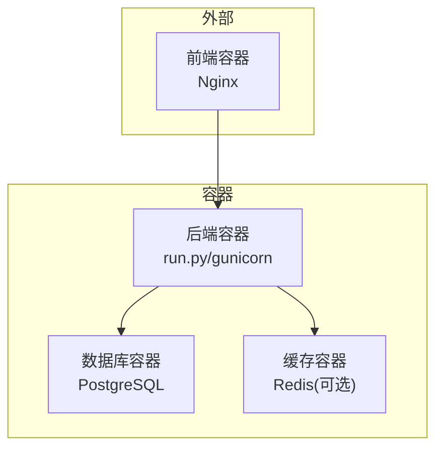
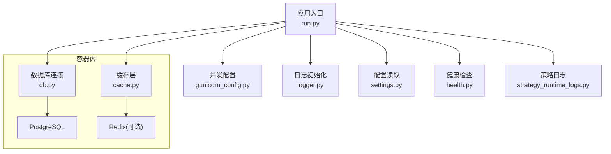
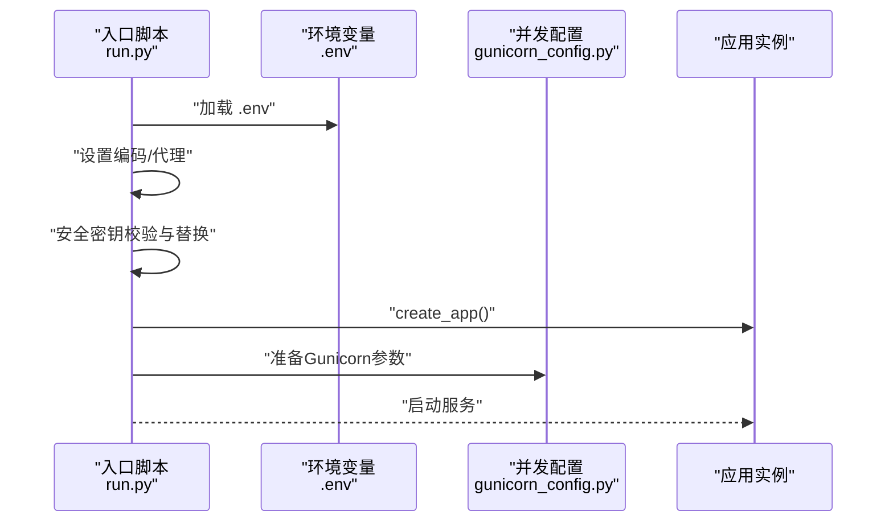
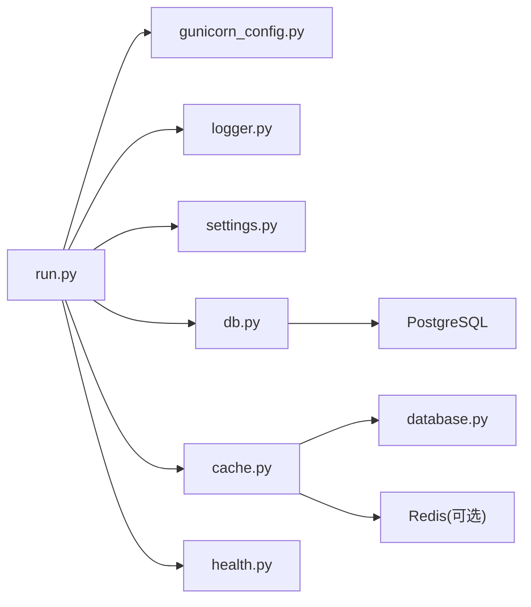

# 故障排除

<cite>
**本文引用的文件**
- [run.py](file://backend_api_python/run.py)
- [gunicorn_config.py](file://backend_api_python/gunicorn_config.py)
- [logger.py](file://backend_api_python/app/utils/logger.py)
- [settings.py](file://backend_api_python/app/config/settings.py)
- [database.py](file://backend_api_python/app/config/database.py)
- [cache.py](file://backend_api_python/app/utils/cache.py)
- [health.py](file://backend_api_python/app/routes/health.py)
- [db.py](file://backend_api_python/app/utils/db.py)
- [strategy_runtime_logs.py](file://backend_api_python/app/utils/strategy_runtime_logs.py)
- [env.example](file://backend_api_python/env.example)
- [Dockerfile](file://backend_api_python/Dockerfile)
- [docker-compose.yml](file://docker-compose.yml)
</cite>

## 目录
1. [简介](#简介)
2. [项目结构](#项目结构)
3. [核心组件](#核心组件)
4. [架构总览](#架构总览)
5. [详细组件分析](#详细组件分析)
6. [依赖分析](#依赖分析)
7. [性能考虑](#性能考虑)
8. [故障排除指南](#故障排除指南)
9. [结论](#结论)
10. [附录](#附录)

## 简介
本指南面向运维与开发人员，聚焦QuantDinger后端Python API在安装、配置、运行、性能与功能异常方面的系统化排障方法。内容涵盖：
- 常见问题诊断与解决步骤
- 日志分析方法与错误定位技巧
- 错误代码与状态码对照
- 性能分析与容量规划工具
- 系统监控与健康检查
- 紧急情况处理流程与恢复策略

## 项目结构
后端采用Flask + Gunicorn部署模型，配合PostgreSQL与可选Redis缓存，通过Docker Compose实现一键编排。关键入口与配置如下：
- 应用入口与启动：run.py
- 并发与日志：gunicorn_config.py
- 日志与配置：logger.py、settings.py
- 数据库与缓存：database.py、cache.py、db.py
- 健康检查：health.py
- 运行时策略日志：strategy_runtime_logs.py
- 环境变量模板：env.example
- 容器镜像与编排：Dockerfile、docker-compose.yml

**图表来源**
- [docker-compose.yml:79-127](file://docker-compose.yml#L79-L127)
- [Dockerfile:52-55](file://backend_api_python/Dockerfile#L52-L55)

**章节来源**
- [run.py:104-134](file://backend_api_python/run.py#L104-L134)
- [gunicorn_config.py:10-36](file://backend_api_python/gunicorn_config.py#L10-L36)
- [docker-compose.yml:23-163](file://docker-compose.yml#L23-L163)

## 核心组件
- 启动与安全校验：run.py负责加载.env、设置编码、代理、安全密钥校验与Flask/Gunicorn启动。
- 并发与稳定性：gunicorn_config.py定义绑定地址、工作进程与线程、超时与请求限制。
- 日志体系：logger.py统一配置控制台与文件日志、过滤器与滚动文件。
- 配置中心：settings.py集中管理主机、端口、调试、认证、日志、速率限制与功能开关。
- 数据库与缓存：database.py提供Redis配置；cache.py实现本地优先的缓存层；db.py封装PostgreSQL连接。
- 健康检查：health.py提供多条健康检查路径，便于容器探针与反向代理使用。
- 策略运行日志：strategy_runtime_logs.py将策略执行日志持久化到数据库。

**章节来源**
- [run.py:17-91](file://backend_api_python/run.py#L17-L91)
- [gunicorn_config.py:10-36](file://backend_api_python/gunicorn_config.py#L10-L36)
- [logger.py:9-63](file://backend_api_python/app/utils/logger.py#L9-L63)
- [settings.py:66-91](file://backend_api_python/app/config/settings.py#L66-L91)
- [database.py:6-89](file://backend_api_python/app/config/database.py#L6-L89)
- [cache.py:49-129](file://backend_api_python/app/utils/cache.py#L49-L129)
- [db.py:38-49](file://backend_api_python/app/utils/db.py#L38-L49)
- [health.py:10-109](file://backend_api_python/app/routes/health.py#L10-L109)
- [strategy_runtime_logs.py:11-30](file://backend_api_python/app/utils/strategy_runtime_logs.py#L11-L30)

## 架构总览
下图展示后端服务在容器内的职责与交互，以及健康检查与日志落盘位置。

**图表来源**
- [run.py:96-101](file://backend_api_python/run.py#L96-L101)
- [gunicorn_config.py:12-23](file://backend_api_python/gunicorn_config.py#L12-L23)
- [logger.py:41-48](file://backend_api_python/app/utils/logger.py#L41-L48)
- [settings.py:92-98](file://backend_api_python/app/config/settings.py#L92-L98)
- [db.py:20-25](file://backend_api_python/app/utils/db.py#L20-L25)
- [cache.py:77-99](file://backend_api_python/app/utils/cache.py#L77-L99)
- [health.py:10-109](file://backend_api_python/app/routes/health.py#L10-L109)
- [strategy_runtime_logs.py:20-26](file://backend_api_python/app/utils/strategy_runtime_logs.py#L20-L26)

## 详细组件分析

### 启动与安全校验（run.py）
- 加载.env优先级与回退策略，确保配置可被应用读取。
- 设置UTF-8输出避免Windows控制台编码问题。
- 应用代理环境变量以适配国内数据源直连需求。
- 生产模式强制替换默认密钥，打印提示并更新环境变量。
- 使用Flask开发服务器启动（仅限本地），生产使用Gunicorn。

**图表来源**
- [run.py:17-91](file://backend_api_python/run.py#L17-L91)
- [run.py:104-134](file://backend_api_python/run.py#L104-L134)
- [gunicorn_config.py:12-23](file://backend_api_python/gunicorn_config.py#L12-L23)

**章节来源**
- [run.py:17-91](file://backend_api_python/run.py#L17-L91)
- [run.py:104-134](file://backend_api_python/run.py#L104-L134)

### 并发与稳定性（gunicorn_config.py）
- 绑定地址与端口来自环境变量。
- 默认1个工作进程+4线程，适合单机I/O并发。
- 超时、优雅退出、keepalive与请求行限制可调。
- 禁止预加载以保证后台线程在工作进程中启动。

**章节来源**
- [gunicorn_config.py:10-36](file://backend_api_python/gunicorn_config.py#L10-L36)

### 日志体系（logger.py）
- 支持通过环境变量设置日志级别，默认INFO。
- 控制台格式统一，添加滚动文件处理器至logs/app.log。
- 过滤特定子系统噪声（如Werkzeug、K线路由）。
- 保留部分模块INFO级别以便排查（如USDT对账与计费）。

**章节来源**
- [logger.py:9-63](file://backend_api_python/app/utils/logger.py#L9-L63)

### 配置中心（settings.py）
- 主机、端口、调试模式、版本信息。
- 认证相关：密钥、管理员账户密码。
- 日志：日志级别、目录、文件名、轮转大小与备份数。
- 安全与功能开关：速率限制、缓存开关、请求日志开关。
- 提供日志文件路径拼接辅助方法。

**章节来源**
- [settings.py:66-98](file://backend_api_python/app/config/settings.py#L66-L98)

### 数据库与缓存（database.py、cache.py、db.py）
- Redis配置：主机、端口、密码、DB、连接/套接字超时、最大连接数。
- 缓存业务配置：启用开关、默认过期、K线/分析/价格缓存TTL。
- 缓存管理器：本地优先策略，启用Redis时尝试连接并Ping验证，失败则回退内存缓存。
- PostgreSQL连接：统一接口与可用性检测，初始化时验证连接。

**章节来源**
- [database.py:6-89](file://backend_api_python/app/config/database.py#L6-L89)
- [cache.py:49-129](file://backend_api_python/app/utils/cache.py#L49-L129)
- [db.py:38-49](file://backend_api_python/app/utils/db.py#L38-L49)

### 健康检查（health.py）
- 提供根路径、/health、/api/health三条健康检查接口。
- 返回服务名称、版本、状态与时间戳，便于容器探针与监控系统识别。

**章节来源**
- [health.py:10-109](file://backend_api_python/app/routes/health.py#L10-L109)

### 策略运行日志（strategy_runtime_logs.py）
- 将策略执行日志写入数据库表，采用最佳努力插入，异常静默不抛出。
- 字段裁剪与类型清洗，避免异常阻断业务。

**章节来源**
- [strategy_runtime_logs.py:11-30](file://backend_api_python/app/utils/strategy_runtime_logs.py#L11-L30)

## 依赖分析
- 启动链路：run.py依赖dotenv加载.env，随后创建应用实例并交由Gunicorn托管。
- 日志链路：logger.py在应用启动早期初始化，结合settings.py中的日志配置落地。
- 数据链路：cache.py根据settings与database配置选择Redis或内存缓存；db.py封装PostgreSQL连接。
- 健康链路：health.py作为蓝图路由，由Flask应用注册，容器通过/api/health进行探针检查。

**图表来源**
- [run.py:96-101](file://backend_api_python/run.py#L96-L101)
- [gunicorn_config.py:12-23](file://backend_api_python/gunicorn_config.py#L12-L23)
- [logger.py:41-48](file://backend_api_python/app/utils/logger.py#L41-L48)
- [settings.py:92-98](file://backend_api_python/app/config/settings.py#L92-L98)
- [db.py:20-25](file://backend_api_python/app/utils/db.py#L20-L25)
- [cache.py:77-99](file://backend_api_python/app/utils/cache.py#L77-L99)
- [health.py:10-109](file://backend_api_python/app/routes/health.py#L10-L109)

**章节来源**
- [run.py:96-101](file://backend_api_python/run.py#L96-L101)
- [gunicorn_config.py:12-23](file://backend_api_python/gunicorn_config.py#L12-L23)
- [logger.py:41-48](file://backend_api_python/app/utils/logger.py#L41-L48)
- [settings.py:92-98](file://backend_api_python/app/config/settings.py#L92-L98)
- [db.py:20-25](file://backend_api_python/app/utils/db.py#L20-L25)
- [cache.py:77-99](file://backend_api_python/app/utils/cache.py#L77-L99)
- [health.py:10-109](file://backend_api_python/app/routes/health.py#L10-L109)

## 性能考虑
- 数据库连接池：根据并发交易机器人数量与路由执行器配置，合理设置最小/最大连接数与获取超时。
- 缓存策略：启用Redis可显著降低热点查询压力；未启用时使用内存缓存，注意进程内共享与容量。
- 并发模型：默认gthread（单进程多线程）适合I/O密集型；CPU密集任务需评估线程数与工作进程数。
- 请求限制：调整请求行长度与字段数上限以适配复杂请求。
- 日志级别：生产环境建议提升日志级别，减少磁盘IO与噪声。

[本节为通用指导，无需具体文件引用]

## 故障排除指南

### 一、安装与部署问题
- 症状：容器启动即退出或健康检查失败
  - 检查后端容器健康检查探针指向与端口映射是否正确
  - 确认数据库与缓存容器均处于健康状态
  - 查看后端容器日志目录中的app.log
- 症状：启动时报错提示SECRET_KEY为默认值
  - 在.env中生成并设置安全密钥，重启容器
  - Docker编排中确保环境变量已注入
- 症状：前端无法访问后端API
  - 检查端口映射与防火墙
  - 确认后端容器对外绑定地址与端口配置一致

**章节来源**
- [docker-compose.yml:123-127](file://docker-compose.yml#L123-L127)
- [docker-compose.yml:98-107](file://docker-compose.yml#L98-L107)
- [run.py:109-120](file://backend_api_python/run.py#L109-L120)
- [Dockerfile:51-55](file://backend_api_python/Dockerfile#L51-L55)

### 二、配置错误
- 症状：数据库连接失败
  - 检查DATABASE_URL格式与可达性
  - 确认PostgreSQL容器健康状态与最大连接数
- 症状：Redis缓存不可用
  - 检查Redis容器健康状态
  - 确认CACHE_ENABLED与Redis连接参数
- 症状：日志级别无效或日志文件未生成
  - 检查LOG_LEVEL、LOG_DIR、LOG_FILE与轮转参数
  - 确认logs目录权限与磁盘空间

**章节来源**
- [env.example:21](file://backend_api_python/env.example#L21)
- [docker-compose.yml:42-44](file://docker-compose.yml#L42-L44)
- [database.py:42-46](file://backend_api_python/app/config/database.py#L42-L46)
- [settings.py:46-64](file://backend_api_python/app/config/settings.py#L46-L64)
- [logger.py:35-48](file://backend_api_python/app/utils/logger.py#L35-L48)

### 三、性能问题
- 症状：数据库连接池耗尽
  - 提升DB_POOL_MAX并确保PostgreSQL max_connections足够
  - 降低MARKET_EXECUTOR_WORKERS与PORTFOLIO_EXECUTOR_WORKERS
- 症状：响应延迟高
  - 启用Redis缓存并优化TTL
  - 调整GUNICORN_WORKERS与GUNICORN_THREADS
  - 降低日志级别或优化日志落盘策略
- 症状：K线/分析接口慢
  - 检查K线缓存TTL与价格缓存TTL
  - 评估数据源超时与重试策略

**章节来源**
- [env.example:48-57](file://backend_api_python/env.example#L48-L57)
- [env.example:168-184](file://backend_api_python/env.example#L168-L184)
- [database.py:62-84](file://backend_api_python/app/config/database.py#L62-L84)
- [cache.py:77-99](file://backend_api_python/app/utils/cache.py#L77-L99)
- [gunicorn_config.py:17-18](file://backend_api_python/gunicorn_config.py#L17-L18)

### 四、功能异常
- 症状：健康检查返回非健康
  - 访问/api/health确认服务状态
  - 检查数据库与缓存可用性
- 症状：策略日志缺失
  - 确认数据库连接正常
  - 检查策略日志写入逻辑异常是否被静默

**章节来源**
- [health.py:80-109](file://backend_api_python/app/routes/health.py#L80-L109)
- [db.py:43-48](file://backend_api_python/app/utils/db.py#L43-L48)
- [strategy_runtime_logs.py:28-30](file://backend_api_python/app/utils/strategy_runtime_logs.py#L28-L30)

### 五、日志分析方法
- 定位启动与安全校验问题：查看启动日志中关于SECRET_KEY替换与端口绑定信息
- 定位数据库问题：关注db.py初始化与连接可用性检测日志
- 定位缓存问题：关注cache.py中Redis连接与回退内存缓存的日志
- 定位请求与路由问题：结合Werkzeug与K线路由过滤后的日志
- 定位策略日志：检查strategy_runtime_logs写入是否被静默跳过

**章节来源**
- [run.py:109-120](file://backend_api_python/run.py#L109-L120)
- [db.py:43-48](file://backend_api_python/app/utils/db.py#L43-L48)
- [cache.py:94-98](file://backend_api_python/app/utils/cache.py#L94-L98)
- [logger.py:19-33](file://backend_api_python/app/utils/logger.py#L19-L33)
- [strategy_runtime_logs.py:28-30](file://backend_api_python/app/utils/strategy_runtime_logs.py#L28-L30)

### 六、错误代码与状态码对照
- 健康检查接口
  - 成功：返回服务状态与时间戳
  - 失败：返回错误描述（Bad Request/500）
- 建议在监控系统中将/api/health作为关键探针，异常时触发告警

**章节来源**
- [health.py:10-109](file://backend_api_python/app/routes/health.py#L10-L109)

### 七、调试技巧
- 临时提升日志级别：在.env中设置LOG_LEVEL=DEBUG（谨慎用于生产）
- 本地开发：使用run.py直接启动，观察控制台输出与错误堆栈
- 代理与证书：在代理环境下确保LIVE_TRADING_CA_BUNDLE或SSL验证配置正确
- 策略日志：通过数据库表查看策略运行细节，必要时增加更细粒度日志

**章节来源**
- [env.example:110-117](file://backend_api_python/env.example#L110-L117)
- [run.py:104-134](file://backend_api_python/run.py#L104-L134)

### 八、系统监控与健康检查
- 容器探针：后端容器健康检查指向/api/health
- 健康检查路由：根路径、/health、/api/health
- 日志落盘：统一到logs/app.log，支持滚动与清理

**章节来源**
- [docker-compose.yml:123-127](file://docker-compose.yml#L123-L127)
- [health.py:10-109](file://backend_api_python/app/routes/health.py#L10-L109)
- [logger.py:41-48](file://backend_api_python/app/utils/logger.py#L41-L48)

### 九、紧急情况处理流程
- 快速隔离
  - 停止异常工作进程，降低GUNICORN_WORKERS与GUNICORN_THREADS
  - 关闭高开销功能（如缓存、请求日志）
- 降级恢复
  - 关闭Redis缓存，切换为内存缓存
  - 降低数据库连接池上限，释放连接
- 根因修复
  - 修复配置（数据库URL、密钥、代理）
  - 升级依赖或回滚变更
- 验证恢复
  - 观察/api/health与关键接口响应
  - 检查日志级别恢复正常

**章节来源**
- [gunicorn_config.py:17-18](file://backend_api_python/gunicorn_config.py#L17-L18)
- [cache.py:77-99](file://backend_api_python/app/utils/cache.py#L77-L99)
- [env.example:48-57](file://backend_api_python/env.example#L48-L57)

### 十、容量规划与性能分析工具
- 数据库容量
  - 依据并发机器人数量与路由执行器配置，设定DB_POOL_MIN/MAX与获取超时
  - 留有余量于PostgreSQL max_connections
- 缓存容量
  - Redis最大内存与淘汰策略由编排文件设定
  - 合理设置各类缓存TTL，平衡命中率与内存占用
- 并发与吞吐
  - 通过GUNICORN_WORKERS与GUNICORN_THREADS调节
  - 结合请求行与字段限制，避免过大请求导致超时

**章节来源**
- [env.example:48-57](file://backend_api_python/env.example#L48-L57)
- [docker-compose.yml:65-66](file://docker-compose.yml#L65-L66)
- [gunicorn_config.py:17-18](file://backend_api_python/gunicorn_config.py#L17-L18)

## 结论
通过规范的环境变量管理、合理的并发与缓存配置、完善的日志与健康检查机制，QuantDinger后端可在生产环境中稳定运行。遇到问题时，建议按“配置—连接—缓存—日志—健康检查”的顺序逐项排查，并结合容器探针与数据库日志快速定位根因。

## 附录

### A. 常用环境变量速查
- 应用与网络：PYTHON_API_HOST、PYTHON_API_PORT、PYTHON_API_DEBUG
- 认证与安全：SECRET_KEY、ADMIN_USER、ADMIN_PASSWORD
- 数据库：DATABASE_URL、DB_POOL_MIN、DB_POOL_MAX、DB_POOL_ACQUIRE_TIMEOUT、DB_POOL_HEALTH_CHECK
- 缓存：CACHE_ENABLED、REDIS_HOST、REDIS_PORT、REDIS_PASSWORD、REDIS_DB
- 并发：GUNICORN_WORKERS、GUNICORN_THREADS、GRACEFUL_TIMEOUT
- 日志：LOG_LEVEL、LOG_DIR、LOG_FILE、LOG_MAX_BYTES、LOG_BACKUP_COUNT
- 代理与证书：PROXY_URL、LIVE_TRADING_CA_BUNDLE、LIVE_TRADING_SSL_VERIFY

**章节来源**
- [env.example:168-268](file://backend_api_python/env.example#L168-L268)