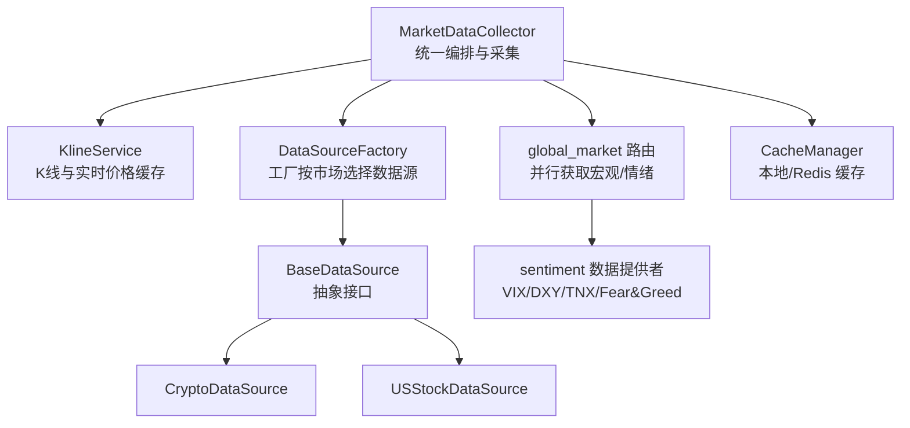
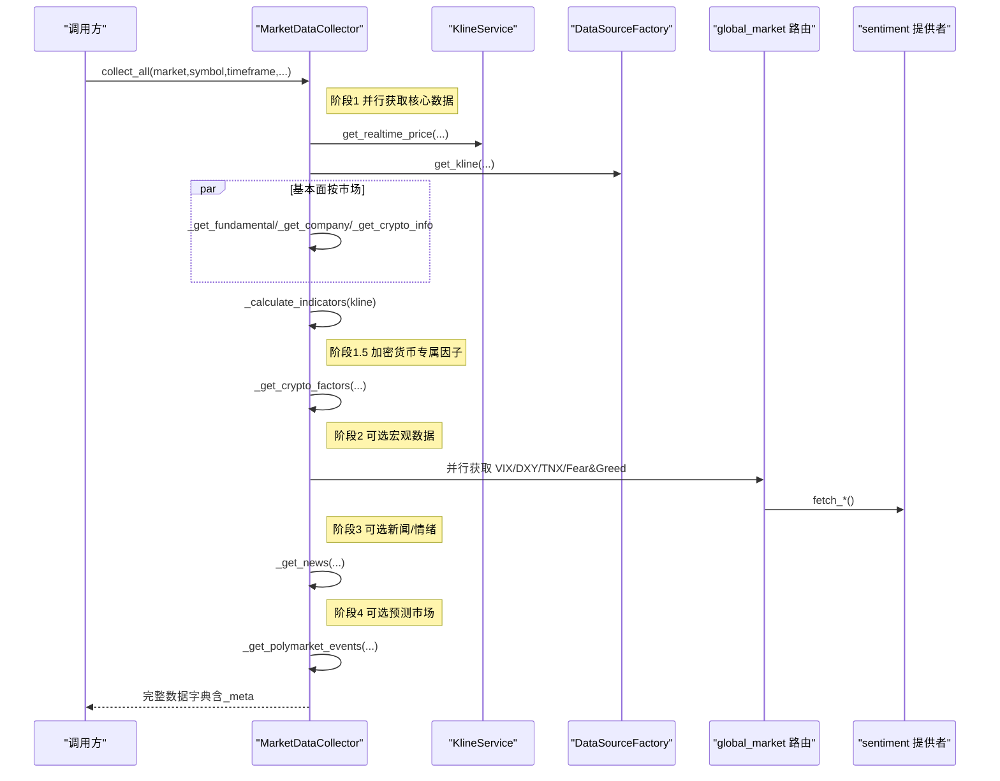
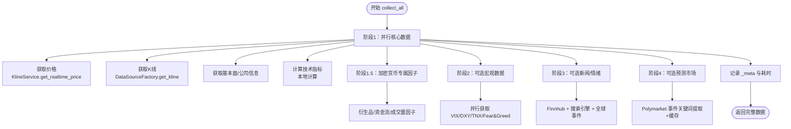
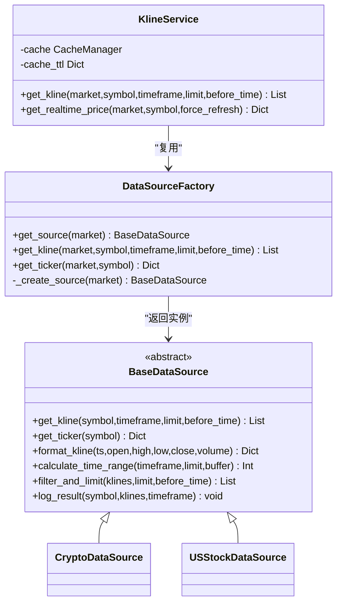
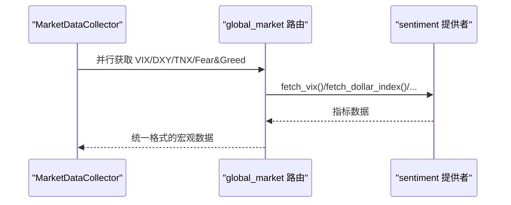
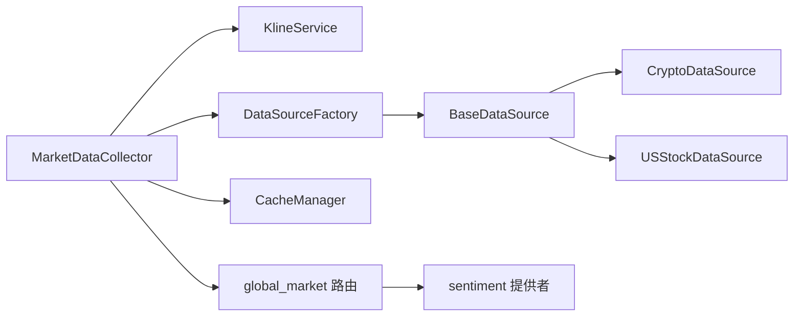

# 市场数据采集

<cite>
**本文引用的文件**
- [market_data_collector.py](file://backend_api_python/app/services/market_data_collector.py)
- [kline.py](file://backend_api_python/app/services/kline.py)
- [factory.py](file://backend_api_python/app/data_sources/factory.py)
- [base.py](file://backend_api_python/app/data_sources/base.py)
- [crypto.py](file://backend_api_python/app/data_sources/crypto.py)
- [us_stock.py](file://backend_api_python/app/data_sources/us_stock.py)
- [cache.py](file://backend_api_python/app/utils/cache.py)
- [global_market.py](file://backend_api_python/app/routes/global_market.py)
- [sentiment.py](file://backend_api_python/app/data_providers/sentiment.py)
</cite>

## 目录
1. [简介](#简介)
2. [项目结构](#项目结构)
3. [核心组件](#核心组件)
4. [架构总览](#架构总览)
5. [详细组件分析](#详细组件分析)
6. [依赖关系分析](#依赖关系分析)
7. [性能考量](#性能考量)
8. [故障排查指南](#故障排查指南)
9. [结论](#结论)
10. [附录](#附录)

## 简介
本文件面向“市场数据采集系统”，聚焦 MarketDataCollector 类的设计理念、架构模式与实现细节，系统阐述其并行数据获取、分阶段数据收集策略，并覆盖核心数据（价格、K线）、分析数据（技术指标）、宏观数据、情绪数据、预测市场数据的采集流程。同时提供数据质量保证机制、异常处理策略与性能优化方案，并给出 API 调用示例与错误处理最佳实践。

## 项目结构
- 服务层：MarketDataCollector 负责统一调度与编排，KlineService 提供 K 线与实时价格缓存。
- 数据源层：DataSourceFactory 工厂按市场类型返回具体数据源；BaseDataSource 定义统一接口；各市场数据源（如 Crypto、USStock）实现具体获取逻辑。
- 缓存层：CacheManager 提供本地内存或 Redis 缓存能力。
- 宏观与情绪：复用全局路由 global_market.py 的缓存与并行拉取逻辑，数据提供者 sentiment.py 提供 VIX、DXY、TNX、Fear&Greed 等指标。
- 文件组织遵循“按功能域划分”的模块化设计，便于扩展与维护。

图表来源
- [market_data_collector.py:34-225](file://backend_api_python/app/services/market_data_collector.py#L34-L225)
- [kline.py:14-65](file://backend_api_python/app/services/kline.py#L14-L65)
- [factory.py:13-106](file://backend_api_python/app/data_sources/factory.py#L13-L106)
- [base.py:27-82](file://backend_api_python/app/data_sources/base.py#L27-L82)
- [crypto.py:16-53](file://backend_api_python/app/data_sources/crypto.py#L16-L53)
- [us_stock.py:17-57](file://backend_api_python/app/data_sources/us_stock.py#L17-L57)
- [global_market.py:28-51](file://backend_api_python/app/routes/global_market.py#L28-L51)
- [sentiment.py:12-42](file://backend_api_python/app/data_providers/sentiment.py#L12-L42)
- [cache.py:49-128](file://backend_api_python/app/utils/cache.py#L49-L128)

章节来源
- [market_data_collector.py:1-15](file://backend_api_python/app/services/market_data_collector.py#L1-L15)
- [factory.py:13-106](file://backend_api_python/app/data_sources/factory.py#L13-L106)
- [kline.py:14-65](file://backend_api_python/app/services/kline.py#L14-L65)
- [cache.py:49-128](file://backend_api_python/app/utils/cache.py#L49-L128)
- [global_market.py:28-51](file://backend_api_python/app/routes/global_market.py#L28-L51)

## 核心组件
- MarketDataCollector：AI 分析专用的统一采集器，负责分阶段并行获取核心数据、计算技术指标、采集基本面、宏观与情绪数据、预测市场数据，并记录元数据与耗时。
- KlineService：封装 K 线与实时价格获取，内置缓存与降级策略，确保高可用与低延迟。
- DataSourceFactory：按市场类型返回具体数据源，屏蔽底层差异。
- BaseDataSource：定义统一接口，含 K 线格式化、时间范围计算、过滤限制与延迟检测。
- CacheManager：本地内存或 Redis 缓存，支持 TTL 与并发安全。
- 宏观与情绪：通过 global_market 路由并行抓取，sentiment 提供多指标与降级策略。

章节来源
- [market_data_collector.py:34-225](file://backend_api_python/app/services/market_data_collector.py#L34-L225)
- [kline.py:14-191](file://backend_api_python/app/services/kline.py#L14-L191)
- [factory.py:13-134](file://backend_api_python/app/data_sources/factory.py#L13-L134)
- [base.py:27-171](file://backend_api_python/app/data_sources/base.py#L27-L171)
- [cache.py:49-129](file://backend_api_python/app/utils/cache.py#L49-L129)
- [global_market.py:28-382](file://backend_api_python/app/routes/global_market.py#L28-L382)
- [sentiment.py:12-377](file://backend_api_python/app/data_providers/sentiment.py#L12-L377)

## 架构总览
MarketDataCollector 采用“分阶段 + 并行”的采集策略：
- 阶段1：核心数据（价格、K线、基本面）并行获取，失败即记录失败项，不影响其他任务。
- 阶段1.5：加密货币专属交易大数据因子（衍生品、资金流、成交量等）。
- 阶段2：可选宏观数据（VIX、DXY、TNX、Fear&Greed），复用 global_market 的缓存与并行逻辑。
- 阶段3：可选新闻/情绪（Finnhub + 搜索引擎 + 全球重大事件）。
- 阶段4：可选预测市场（Polymarket）事件，关键词提取与缓存优化。

图表来源
- [market_data_collector.py:72-224](file://backend_api_python/app/services/market_data_collector.py#L72-L224)
- [kline.py:74-191](file://backend_api_python/app/services/kline.py#L74-L191)
- [factory.py:74-134](file://backend_api_python/app/data_sources/factory.py#L74-L134)
- [global_market.py:339-382](file://backend_api_python/app/routes/global_market.py#L339-L382)
- [sentiment.py:45-111](file://backend_api_python/app/data_providers/sentiment.py#L45-L111)

## 详细组件分析

### MarketDataCollector 设计与实现
- 设计理念
  - 数据为王：优先保证数据获取的稳定性与准确性。
  - 统一数据源：完全复用 DataSourceFactory 与 KlineService，确保与 K 线模块、自选列表一致。
  - 复用全球金融板块：宏观与情绪数据复用 global_market 的缓存。
  - 快速稳定：避免依赖慢速外部服务（如 Jina Reader）。
- 数据层次
  - 核心数据（必须成功）：价格、K线、技术指标。
  - 分析数据（增强）：基本面、公司信息、加密货币专属因子。
  - 宏观数据（可选）：VIX、DXY、TNX、Fear&Greed。
  - 情绪数据（可选）：新闻、社交媒体情绪。
  - 预测市场数据（可选）：Polymarket 事件。
- 并行与超时控制
  - 阶段1 使用 ThreadPoolExecutor(max_workers=4) 并行获取价格、K线与基本面。
  - 各子任务设置独立超时（如 15s 总超时、单项 3s 超时），避免阻塞。
  - 阶段2 宏观数据并行获取，单项超时 5s，总超时 10s。
  - 阶段3 新闻/情绪单项超时 8s。
  - 阶段4 预测市场事件按关键词数量限制，最多 2 个关键词，使用缓存加速。
- 数据质量与降级
  - 价格优先使用 KlineService.get_realtime_price，失败则回退到 K 线最后一根。
  - 实时价格来源标注（ticker/kline_1m/kline_1d），便于溯源。
  - 技术指标本地计算，不依赖外部 API，口径与常见终端对齐。
  - 宏观数据复用 global_market 的缓存，6 小时有效期，显著降低 API 调用。
  - 新闻/情绪通过 Finnhub 与搜索引擎互补，去重与排序，保证时效与覆盖面。
- 元数据与可观测性
  - _meta.success_items/_meta.failed_items 记录每个阶段的成功/失败项。
  - _meta.duration_ms 记录总耗时，便于性能监控与告警。

图表来源
- [market_data_collector.py:72-224](file://backend_api_python/app/services/market_data_collector.py#L72-L224)

章节来源
- [market_data_collector.py:34-225](file://backend_api_python/app/services/market_data_collector.py#L34-L225)

### KlineService 与 DataSourceFactory
- KlineService
  - 提供 get_realtime_price 优先使用 ticker API，失败回退到 1 分钟 K 线，最终回退到日线。
  - 内置 CacheManager，短 TTL 缓存实时价格，避免频繁请求。
- DataSourceFactory
  - 按市场类型返回具体数据源（Crypto、USStock、HKStock、CNStock、Forex、Futures）。
  - 提供便捷方法 get_kline/get_ticker，内部排序与异常处理。

图表来源
- [kline.py:14-191](file://backend_api_python/app/services/kline.py#L14-L191)
- [factory.py:13-134](file://backend_api_python/app/data_sources/factory.py#L13-L134)
- [base.py:27-171](file://backend_api_python/app/data_sources/base.py#L27-L171)
- [crypto.py:16-200](file://backend_api_python/app/data_sources/crypto.py#L16-L200)
- [us_stock.py:17-200](file://backend_api_python/app/data_sources/us_stock.py#L17-L200)

章节来源
- [kline.py:14-191](file://backend_api_python/app/services/kline.py#L14-L191)
- [factory.py:13-134](file://backend_api_python/app/data_sources/factory.py#L13-L134)
- [base.py:27-171](file://backend_api_python/app/data_sources/base.py#L27-L171)
- [crypto.py:16-200](file://backend_api_python/app/data_sources/crypto.py#L16-L200)
- [us_stock.py:17-200](file://backend_api_python/app/data_sources/us_stock.py#L17-L200)

### 技术指标计算（本地实现）
- 指标清单与口径
  - RSI(14)：Wilder 平滑，首段均幅为前 14 期简单平均，其后递推。
  - MACD：收盘 EMA12/EMA26（首值=SMA），信号线=MACD 的 EMA9（SMA 种子）。
  - MA：SMA；枢轴：上一根 K 的 H/L/C；摆动高低：近 20 根 H/L 窗口极值。
  - 布林：20 收盘 SMA ± 2×总体标准差；ATR(14)：Wilder 递推。
  - 支撑/阻力：枢轴点、近期高低点、布林上下轨三者平均。
  - 波动率：ATR 百分比分级。
  - 止损止盈建议：基于 2x/3x ATR 与支撑/阻力，结合风险回报比。
  - 成交量比率：最近 20 根成交量与均值比。
  - 价格位置：20 日区间相对位置百分比。
- 复杂度与健壮性
  - 时间复杂度：O(n)，n 为 K 线长度；空间复杂度 O(n)。
  - 输入校验与默认值：缺省返回空字典，避免上游崩溃。
  - 严格边界检查：不足周期时不计算相应指标。

章节来源
- [market_data_collector.py:299-510](file://backend_api_python/app/services/market_data_collector.py#L299-L510)

### 宏观与情绪数据采集
- 宏观数据
  - 复用 global_market 路由的缓存（6 小时），并行获取 VIX、DXY、TNX、Fear&Greed。
  - 若缓存不存在，则使用 ThreadPoolExecutor(max_workers=4) 并行抓取，单项超时 5s。
- 情绪数据
  - Finnhub 新闻与社交媒体情绪（Reddit/Twitter）。
  - 搜索引擎补充（当新闻不足时），并进行去重与排序。
  - 全球重大事件（地缘政治、战争等）关键词筛选，仅返回重要事件。

图表来源
- [market_data_collector.py:1731-1876](file://backend_api_python/app/services/market_data_collector.py#L1731-L1876)
- [global_market.py:339-382](file://backend_api_python/app/routes/global_market.py#L339-L382)
- [sentiment.py:45-251](file://backend_api_python/app/data_providers/sentiment.py#L45-L251)

章节来源
- [market_data_collector.py:1731-1876](file://backend_api_python/app/services/market_data_collector.py#L1731-L1876)
- [global_market.py:297-382](file://backend_api_python/app/routes/global_market.py#L297-L382)
- [sentiment.py:12-377](file://backend_api_python/app/data_providers/sentiment.py#L12-L377)

### 预测市场数据（Polymarket）
- 关键词提取与优化
  - 从符号提取基础关键词，必要时映射加密货币全名，最多保留 3 个关键词。
  - 限制搜索关键词数量（最多 2 个），减少 API 调用。
- 缓存与去重
  - 使用 use_cache=True 启用缓存，减少重复请求。
  - 基于 market_id 去重，构建 Polymarket URL（优先 slug，否则 markets 端点）。
- 错误处理
  - 单个关键词失败不阻断整体流程，记录警告并继续。

章节来源
- [market_data_collector.py:2086-2205](file://backend_api_python/app/services/market_data_collector.py#L2086-L2205)

## 依赖关系分析
- 组件耦合
  - MarketDataCollector 与 KlineService、DataSourceFactory 强耦合，确保核心数据获取一致性。
  - 宏观与情绪模块通过 global_market 路由与 sentiment 提供者解耦，便于替换与扩展。
- 外部依赖
  - yfinance、requests、ccxt、finnhub、akshare 等第三方库。
  - Redis（可选）用于分布式缓存，本地模式下自动降级为内存缓存。
- 循环依赖
  - 未发现循环导入；模块间通过接口与工厂模式解耦。

图表来源
- [market_data_collector.py:26-29](file://backend_api_python/app/services/market_data_collector.py#L26-L29)
- [kline.py:6-9](file://backend_api_python/app/services/kline.py#L6-L9)
- [factory.py:7-10](file://backend_api_python/app/data_sources/factory.py#L7-L10)
- [base.py:5-8](file://backend_api_python/app/data_sources/base.py#L5-L8)
- [cache.py:12-12](file://backend_api_python/app/utils/cache.py#L12-L12)
- [global_market.py:34-49](file://backend_api_python/app/routes/global_market.py#L34-L49)
- [sentiment.py:4-7](file://backend_api_python/app/data_providers/sentiment.py#L4-L7)

章节来源
- [market_data_collector.py:26-29](file://backend_api_python/app/services/market_data_collector.py#L26-L29)
- [factory.py:7-10](file://backend_api_python/app/data_sources/factory.py#L7-L10)
- [kline.py:6-9](file://backend_api_python/app/services/kline.py#L6-L9)
- [cache.py:12-12](file://backend_api_python/app/utils/cache.py#L12-L12)
- [global_market.py:34-49](file://backend_api_python/app/routes/global_market.py#L34-L49)
- [sentiment.py:4-7](file://backend_api_python/app/data_providers/sentiment.py#L4-L7)

## 性能考量
- 并行策略
  - 阶段1 并行获取核心数据，max_workers=4，缩短总等待时间。
  - 阶段2 宏观数据并行，单项超时 5s，避免阻塞。
- 缓存优化
  - K 线与实时价格缓存：K 线按周期配置 TTL，实时价格短 TTL（30s/300s）。
  - 宏观数据缓存：global_market 路由 6 小时缓存，显著降低 API 调用。
  - 加密货币专属因子缓存：Coinglass/CryptoQuant 接口设置合理 TTL（90~600s）。
- 降级与容错
  - 价格获取多级回退（ticker → 1m K → 1D K），保证可用性。
  - 新闻不足时使用搜索引擎补充，关键词精简减少 API 调用。
- 算法效率
  - 技术指标 O(n) 实现，避免不必要的重复计算。
  - K 线过滤与限制在数据源层完成，减少传输与处理开销。

章节来源
- [market_data_collector.py:127-224](file://backend_api_python/app/services/market_data_collector.py#L127-L224)
- [kline.py:42-65](file://backend_api_python/app/services/kline.py#L42-L65)
- [cache.py:49-129](file://backend_api_python/app/utils/cache.py#L49-L129)
- [global_market.py:92-136](file://backend_api_python/app/routes/global_market.py#L92-L136)

## 故障排查指南
- 常见问题与定位
  - 价格为空：检查 KlineService 回退链路与数据源可用性；查看日志中的 source 标注。
  - K 线为空：确认 DataSourceFactory 返回的数据源与市场类型匹配；检查时间范围与过滤逻辑。
  - 宏观数据缺失：确认 global_market 缓存是否命中；关注并行任务超时与异常。
  - 新闻/情绪不足：检查 Finnhub 可用性与搜索引擎服务状态；确认关键词提取与去重逻辑。
  - 预测市场事件为空：检查 Polymarket 关键词提取与缓存开关；确认 market_id 去重逻辑。
- 异常处理策略
  - 每个阶段/子任务均设置独立超时与异常捕获，失败项记录在 _meta.failed_items。
  - 宏观数据与新闻模块对单项失败进行降级与继续执行，避免整体阻塞。
  - CacheManager 读写异常静默记录日志，不影响主流程。
- 最佳实践
  - 为关键接口设置合理的超时与重试策略。
  - 使用 _meta.duration_ms 与 success_items/failed_items 进行性能与稳定性监控。
  - 对外部 API 密钥与配额进行集中管理与轮换。

章节来源
- [market_data_collector.py:142-157](file://backend_api_python/app/services/market_data_collector.py#L142-L157)
- [kline.py:132-187](file://backend_api_python/app/services/kline.py#L132-L187)
- [cache.py:100-123](file://backend_api_python/app/utils/cache.py#L100-L123)

## 结论
MarketDataCollector 通过“分阶段 + 并行”的采集策略，结合统一数据源、本地指标计算与多级缓存/降级机制，实现了对核心数据、分析数据、宏观与情绪数据、预测市场数据的高效、稳定与可扩展采集。其设计兼顾性能与可靠性，适合在 AI 分析场景中提供高质量、低延迟的市场数据基础。

## 附录
- API 调用示例（路径引用）
  - 采集入口：[collect_all:72-224](file://backend_api_python/app/services/market_data_collector.py#L72-L224)
  - 实时价格：[get_realtime_price:74-191](file://backend_api_python/app/services/kline.py#L74-L191)
  - K 线获取：[get_kline:74-106](file://backend_api_python/app/data_sources/factory.py#L74-L106)
  - 宏观数据：[market_sentiment:297-382](file://backend_api_python/app/routes/global_market.py#L297-L382)
  - 情绪指标：[fetch_vix:45-111](file://backend_api_python/app/data_providers/sentiment.py#L45-L111)、[fetch_dollar_index:114-181](file://backend_api_python/app/data_providers/sentiment.py#L114-L181)、[fetch_yield_curve:184-250](file://backend_api_python/app/data_providers/sentiment.py#L184-L250)、[fetch_fear_greed_index:12-42](file://backend_api_python/app/data_providers/sentiment.py#L12-L42)
  - 预测市场：[search_markets:2115-2120](file://backend_api_python/app/services/market_data_collector.py#L2115-L2120)