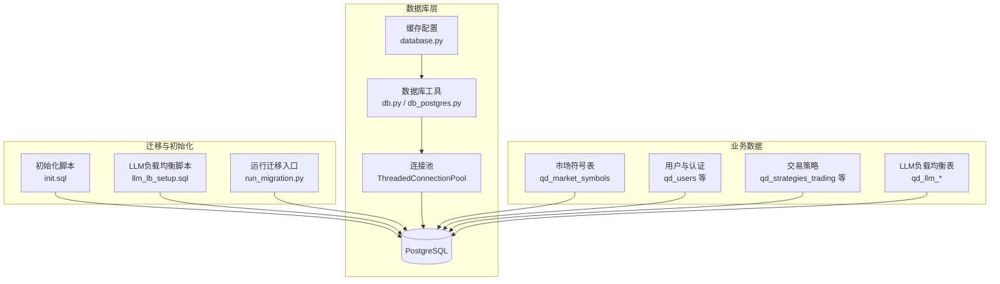
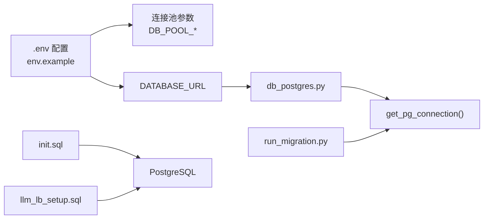

# 数据库设计

<cite>
**本文引用的文件**
- [migrations/init.sql](file://backend_api_python/migrations/init.sql)
- [migrations/llm_lb_setup.sql](file://backend_api_python/migrations/llm_lb_setup.sql)
- [run_migration.py](file://backend_api_python/run_migration.py)
- [app/utils/db.py](file://backend_api_python/app/utils/db.py)
- [app/utils/db_postgres.py](file://backend_api_python/app/utils/db_postgres.py)
- [app/config/database.py](file://backend_api_python/app/config/database.py)
- [app/data/market_symbols_seed.py](file://backend_api_python/app/data/market_symbols_seed.py)
- [env.example](file://backend_api_python/env.example)
</cite>

## 目录
1. [简介](#简介)
2. [项目结构](#项目结构)
3. [核心组件](#核心组件)
4. [架构总览](#架构总览)
5. [详细组件分析](#详细组件分析)
6. [依赖分析](#依赖分析)
7. [性能考虑](#性能考虑)
8. [故障排查指南](#故障排查指南)
9. [结论](#结论)
10. [附录](#附录)

## 简介
本文件系统化梳理 QuantDinger 的数据库设计与实现，覆盖 PostgreSQL 初始化脚本、表结构、索引与约束、迁移管理、缓存策略、性能优化与最佳实践，并给出典型数据访问模式与 SQL 示例路径，帮助开发者与运维人员快速理解与维护数据库。

## 项目结构
QuantDinger 的数据库层以 PostgreSQL 为核心，采用“初始化迁移 + 运行时迁移”的方式管理模式演进；数据访问通过统一的连接池工具封装，配合缓存配置模块提升高频查询性能。



图示来源
- [migrations/init.sql:1-1026](file://backend_api_python/migrations/init.sql#L1-L1026)
- [migrations/llm_lb_setup.sql:1-67](file://backend_api_python/migrations/llm_lb_setup.sql#L1-L67)
- [run_migration.py:1-33](file://backend_api_python/run_migration.py#L1-L33)
- [app/utils/db.py:1-66](file://backend_api_python/app/utils/db.py#L1-L66)
- [app/utils/db_postgres.py:1-495](file://backend_api_python/app/utils/db_postgres.py#L1-L495)
- [app/config/database.py:1-90](file://backend_api_python/app/config/database.py#L1-L90)

章节来源
- [migrations/init.sql:1-1026](file://backend_api_python/migrations/init.sql#L1-L1026)
- [migrations/llm_lb_setup.sql:1-67](file://backend_api_python/migrations/llm_lb_setup.sql#L1-L67)
- [run_migration.py:1-33](file://backend_api_python/run_migration.py#L1-L33)
- [app/utils/db.py:1-66](file://backend_api_python/app/utils/db.py#L1-L66)
- [app/utils/db_postgres.py:1-495](file://backend_api_python/app/utils/db_postgres.py#L1-L495)
- [app/config/database.py:1-90](file://backend_api_python/app/config/database.py#L1-L90)

## 核心组件
- 初始化与业务表
  - 用户与认证：qd_users、qd_credits_log、qd_membership_orders、qd_usdt_orders、qd_oauth_states、qd_verification_codes、qd_login_attempts、qd_oauth_links、qd_security_logs
  - 交易策略与持仓：qd_strategies_trading、qd_strategy_positions、qd_strategy_trades、pending_orders、qd_strategy_notifications、qd_strategy_logs
  - 指标与分析：qd_indicator_codes、qd_analysis_tasks、qd_backtest_runs、qd_backtest_trades、qd_backtest_equity_points
  - 交换机凭证与手动头寸：qd_exchange_credentials、qd_manual_positions、qd_position_alerts、qd_position_monitors
  - 市场符号种子：qd_market_symbols（含热榜与排序）
  - 快速分析记忆：qd_analysis_memory（JSON/JSONB 字段）
- LLM 负载均衡表：qd_llm_provider、qd_llm_api_key、qd_llm_model、qd_llm_call_log
- 数据访问与缓存
  - PostgreSQL 工具：连接池、占位符兼容、事务封装
  - 缓存配置：Redis、TTL 策略、开关控制

章节来源
- [migrations/init.sql:8-800](file://backend_api_python/migrations/init.sql#L8-L800)
- [migrations/llm_lb_setup.sql:1-67](file://backend_api_python/migrations/llm_lb_setup.sql#L1-L67)
- [app/utils/db_postgres.py:1-495](file://backend_api_python/app/utils/db_postgres.py#L1-L495)
- [app/config/database.py:1-90](file://backend_api_python/app/config/database.py#L1-L90)

## 架构总览
下图展示数据库架构与关键表的关系，突出用户、策略、交易、回测、LLM 负载均衡与市场符号等核心实体。

```mermaid
erDiagram
QD_USERS {
int id PK
varchar username UK
varchar email UK
varchar role
decimal credits
timestamp created_at
timestamp updated_at
}
QD_CREDITS_LOG {
int id PK
int user_id FK
varchar action
decimal amount
decimal balance_after
varchar feature
varchar reference_id
timestamp created_at
}
QD_MEMBERSHIP_ORDERS {
int id PK
int user_id FK
varchar plan
decimal price_usd
varchar status
timestamp created_at
timestamp paid_at
}
QD_USDT_ORDERS {
int id PK
int user_id FK
varchar plan
varchar chain
decimal amount_usdt
int address_index
varchar address UK
varchar status
varchar tx_hash
timestamp paid_at
timestamp confirmed_at
timestamp expires_at
timestamp created_at
timestamp updated_at
}
QD_OAUTH_STATES {
varchar state PK
varchar provider
text redirect
timestamp created_at
timestamp expires_at
}
QD_VERIFICATION_CODES {
int id PK
varchar email
varchar code
varchar type
timestamp expires_at
timestamp used_at
varchar ip_address
int attempts
timestamp last_attempt_at
timestamp created_at
}
QD_LOGIN_ATTEMPTS {
int id PK
varchar identifier
varchar identifier_type
timestamp attempt_time
boolean success
varchar ip_address
text user_agent
}
QD_OAUTH_LINKS {
int id PK
int user_id FK
varchar provider
varchar provider_user_id
varchar provider_email
varchar provider_name
varchar provider_avatar
text access_token
text refresh_token
timestamp created_at
timestamp updated_at
}
QD_SECURITY_LOGS {
int id PK
int user_id
varchar action
varchar ip_address
text user_agent
text details
timestamp created_at
}
QD_STRATEGIES_TRADING {
int id PK
int user_id FK
varchar strategy_name
varchar strategy_type
varchar market_category
varchar execution_mode
varchar status
varchar symbol
varchar timeframe
decimal initial_capital
int leverage
varchar market_type
text exchange_config
text indicator_config
text trading_config
text ai_model_config
int decide_interval
varchar strategy_group_id
varchar group_base_name
varchar strategy_mode
text strategy_code
timestamp created_at
timestamp updated_at
}
QD_STRATEGY_POSITIONS {
int id PK
int user_id FK
int strategy_id FK
varchar symbol
varchar side
decimal size
decimal entry_price
decimal current_price
decimal highest_price
decimal lowest_price
decimal unrealized_pnl
decimal pnl_percent
decimal equity
timestamp updated_at
unique strategy_id_symbol_side
}
QD_STRATEGY_TRADES {
int id PK
int user_id FK
int strategy_id FK
varchar symbol
varchar type
decimal price
decimal amount
decimal value
decimal commission
varchar commission_ccy
decimal profit
timestamp created_at
}
PENDING_ORDERS {
int id PK
int user_id FK
int strategy_id FK
varchar symbol
varchar signal_type
bigint signal_ts
varchar market_type
varchar order_type
decimal amount
decimal price
varchar execution_mode
varchar status
int priority
int attempts
int max_attempts
text last_error
text payload_json
text dispatch_note
varchar exchange_id
varchar exchange_order_id
text exchange_response_json
decimal filled
decimal avg_price
timestamp executed_at
timestamp created_at
timestamp updated_at
timestamp processed_at
timestamp sent_at
}
QD_STRATEGY_NOTIFICATIONS {
int id PK
int user_id FK
int strategy_id FK
varchar symbol
varchar signal_type
varchar channels
varchar title
text message
text payload_json
int is_read
timestamp created_at
}
QD_STRATEGY_LOGS {
int id PK
int strategy_id FK
varchar level
text message
timestamp timestamp
}
QD_INDICATOR_CODES {
int id PK
int user_id FK
int is_buy
bigint end_time
varchar name
text code
text description
int publish_to_community
varchar pricing_type
decimal price
int is_encrypted
varchar preview_image
boolean vip_free
bigint createtime
bigint updatetime
timestamp created_at
timestamp updated_at
int purchase_count
decimal avg_rating
int rating_count
int view_count
varchar review_status
text review_note
timestamp reviewed_at
int reviewed_by
int source_indicator_id
}
QD_WATCHLIST {
int id PK
int user_id FK
varchar market
varchar symbol
varchar name
timestamp created_at
timestamp updated_at
unique user_id_market_symbol
}
QD_ANALYSIS_TASKS {
int id PK
int user_id FK
varchar market
varchar symbol
varchar model
varchar language
varchar status
text result_json
text error_message
timestamp created_at
timestamp completed_at
}
QD_BACKTEST_RUNS {
int id PK
int user_id FK
int indicator_id
int strategy_id
varchar strategy_name
varchar run_type
varchar market
varchar symbol
varchar timeframe
varchar start_date
varchar end_date
decimal initial_capital
decimal commission
decimal slippage
int leverage
varchar trade_direction
text strategy_config
text config_snapshot
varchar engine_version
varchar code_hash
varchar status
text error_message
text result_json
timestamp created_at
}
QD_BACKTEST_TRADES {
int id PK
int run_id FK
int user_id FK
int strategy_id
int trade_index
varchar trade_time
varchar trade_type
varchar side
double precision price
double precision amount
double precision profit
double precision balance
varchar reason
text payload_json
timestamp created_at
}
QD_BACKTEST_EQUITY_POINTS {
int id PK
int run_id FK
int point_index
varchar point_time
double precision point_value
timestamp created_at
}
QD_EXCHANGE_CREDENTIALS {
int id PK
int user_id FK
varchar name
varchar exchange_id
varchar api_key_hint
text encrypted_config
timestamp created_at
timestamp updated_at
}
QD_MANUAL_POSITIONS {
int id PK
int user_id FK
varchar market
varchar symbol
varchar name
varchar side
decimal quantity
decimal entry_price
bigint entry_time
text notes
text tags
varchar group_name
timestamp created_at
timestamp updated_at
unique user_id_market_symbol_side_group_name
}
QD_POSITION_ALERTS {
int id PK
int user_id FK
int position_id
varchar market
varchar symbol
varchar alert_type
decimal threshold
text notification_config
int is_active
int is_triggered
timestamp last_triggered_at
int trigger_count
int repeat_interval
text notes
timestamp created_at
timestamp updated_at
}
QD_POSITION_MONITORS {
int id PK
int user_id FK
varchar name
text position_ids
varchar monitor_type
text config
text notification_config
int is_active
timestamp last_run_at
timestamp next_run_at
text last_result
int run_count
timestamp created_at
timestamp updated_at
}
QD_MARKET_SYMBOLS {
int id PK
varchar market
varchar symbol UK
varchar name
varchar exchange
varchar currency
int is_active
int is_hot
int sort_order
timestamp created_at
}
QD_ANALYSIS_MEMORY {
int id PK
int user_id
varchar market
varchar symbol
varchar decision
int confidence
decimal price_at_analysis
text summary
jsonb reasons
jsonb scores
jsonb indicators_snapshot
jsonb raw_result
decimal consensus_score
decimal consensus_abs
decimal agreement_ratio
decimal quality_multiplier
timestamp created_at
timestamp validated_at
varchar actual_outcome
decimal actual_return_pct
boolean was_correct
}
QD_LLM_PROVIDER {
int id PK
varchar name
varchar code UK
varchar base_url
varchar api_type
smallint status
jsonb config
timestamp created_at
timestamp updated_at
}
QD_LLM_API_KEY {
int id PK
int provider_id FK
varchar name
text api_key_enc
smallint status
int weight
bigint owner_id
smallint is_public
int fail_count
timestamp last_used_at
jsonb metrics
timestamp created_at
timestamp updated_at
}
QD_LLM_MODEL {
int id PK
int provider_id FK
varchar model_name
varchar display_name
varchar lb_strategy
int retries
int timeout
smallint status
timestamp created_at
timestamp updated_at
}
QD_LLM_CALL_LOG {
bigint id PK
int api_key_id FK
int model_id FK
bigint user_id
int prompt_tokens
int completion_tokens
int total_tokens
int latency_ms
int status_code
text error_msg
timestamp created_at
}
QD_USERS ||--o{ QD_CREDITS_LOG : "拥有"
QD_USERS ||--o{ QD_MEMBERSHIP_ORDERS : "拥有"
QD_USERS ||--o{ QD_USDT_ORDERS : "拥有"
QD_USERS ||--o{ QD_OAUTH_LINKS : "拥有"
QD_USERS ||--o{ QD_STRATEGIES_TRADING : "拥有"
QD_USERS ||--o{ QD_STRATEGY_POSITIONS : "拥有"
QD_USERS ||--o{ QD_STRATEGY_TRADES : "拥有"
QD_USERS ||--o{ QD_ANALYSIS_TASKS : "拥有"
QD_USERS ||--o{ QD_EXCHANGE_CREDENTIALS : "拥有"
QD_USERS ||--o{ QD_MANUAL_POSITIONS : "拥有"
QD_USERS ||--o{ QD_POSITION_ALERTS : "拥有"
QD_USERS ||--o{ QD_POSITION_MONITORS : "拥有"
QD_STRATEGIES_TRADING ||--o{ QD_STRATEGY_POSITIONS : "包含"
QD_STRATEGIES_TRADING ||--o{ QD_STRATEGY_TRADES : "产生"
QD_STRATEGIES_TRADING ||--o{ QD_STRATEGY_NOTIFICATIONS : "触发"
QD_STRATEGIES_TRADING ||--o{ QD_STRATEGY_LOGS : "记录"
QD_STRATEGIES_TRADING ||--o{ QD_BACKTEST_RUNS : "驱动"
QD_BACKTEST_RUNS ||--o{ QD_BACKTEST_TRADES : "包含"
QD_BACKTEST_RUNS ||--o{ QD_BACKTEST_EQUITY_POINTS : "生成"
QD_LLM_PROVIDER ||--o{ QD_LLM_API_KEY : "提供"
QD_LLM_API_KEY ||--o{ QD_LLM_CALL_LOG : "调用"
QD_LLM_MODEL ||--o{ QD_LLM_CALL_LOG : "被调用"
```

图示来源
- [migrations/init.sql:8-800](file://backend_api_python/migrations/init.sql#L8-L800)
- [migrations/llm_lb_setup.sql:1-67](file://backend_api_python/migrations/llm_lb_setup.sql#L1-L67)

## 详细组件分析

### 用户与认证表族
- qd_users：用户主表，包含身份、角色、状态、积分、VIP 信息、时区、通知设置、图表模板等；提供邀请人外键、唯一用户名/邮箱、默认头像、时间戳。
- qd_credits_log：积分流水，记录充值、消费、退款、管理员调整、VIP 赠送等动作，支持按用户、动作、时间索引。
- qd_membership_orders：会员订单（Mock），记录计划、价格、状态、支付时间。
- qd_usdt_orders：USDT 收款订单，链、地址唯一性、状态机、过期时间、支付/确认时间。
- qd_oauth_states：OAuth CSRF 状态，跨多实例共享，带过期时间。
- qd_verification_codes：邮箱验证码，类型、过期、尝试次数、IP 限制。
- qd_login_attempts：登录尝试记录，支持按标识+类型与时间索引。
- qd_oauth_links：第三方账号关联，唯一 provider+provider_user_id。
- qd_security_logs：安全审计日志，记录登录/登出/注册/重置密码等行为。

索引与约束要点
- 唯一索引：username、email、address(链+地址)、provider+provider_user_id、(user_id, market, symbol)、(strategy_id, symbol, side)
- 时间索引：created_at、expires_at、attempt_time 等
- 外键：所有子表均引用 qd_users(id) 或相关主表，部分支持级联删除

章节来源
- [migrations/init.sql:8-190](file://backend_api_python/migrations/init.sql#L8-L190)

### 交易策略与执行
- qd_strategies_trading：策略元数据，支持信号/网格/套利等多种模式，含组名、脚本策略字段、最后再平衡时间等。
- qd_strategy_positions：策略内头寸，唯一约束保证同一策略-标的-方向仅一条记录。
- qd_strategy_trades：策略产生的交易明细，含手续费、币种、利润。
- pending_orders：待执行订单队列，支持优先级、重试、状态机、交易所响应存储。
- qd_strategy_notifications：策略信号通知，按用户、策略、已读状态索引。
- qd_strategy_logs：策略运行日志，按策略+时间索引。

章节来源
- [migrations/init.sql:195-380](file://backend_api_python/migrations/init.sql#L195-L380)

### 分析与回测
- qd_analysis_tasks：AI 快速分析任务，结果 JSON 存储，状态与错误信息。
- qd_backtest_runs/trades/equity_points：回测运行、逐笔交易与净值点序列，支持按用户、策略、运行类型索引。

章节来源
- [migrations/init.sql:444-525](file://backend_api_python/migrations/init.sql#L444-L525)

### 市场符号与种子数据
- qd_market_symbols：市场符号清单，包含交易所、货币、活跃/热门标记、排序字段；初始化脚本插入多市场热榜种子数据，唯一约束 market+symbol。
- 查询辅助：提供热榜、搜索、名称解析等函数，基于 PostgreSQL 实现大小写无关匹配与排序。

章节来源
- [migrations/init.sql:621-772](file://backend_api_python/migrations/init.sql#L621-L772)
- [app/data/market_symbols_seed.py:1-193](file://backend_api_python/app/data/market_symbols_seed.py#L1-L193)

### LLM 负载均衡表族
- qd_llm_provider：供应商，含基础 URL、类型、状态、配置。
- qd_llm_api_key：API Key，权重、状态、熔断、失败计数、最近使用时间、指标统计。
- qd_llm_model：模型，LB 策略、重试、超时、状态。
- qd_llm_call_log：调用日志，记录耗时、令牌用量、状态码、错误信息，按创建时间索引。

章节来源
- [migrations/llm_lb_setup.sql:1-67](file://backend_api_python/migrations/llm_lb_setup.sql#L1-L67)

### 数据访问与缓存
- 连接池与占位符兼容：db_postgres 提供线程池、健康检查、占位符转换（? -> %s）、自动 RETURNING id 兼容、上下文管理器。
- 缓存配置：Redis 主机/端口/密码/DB、连接超时、最大连接数；缓存开关、默认过期、K线/分析/价格 TTL 明细。

章节来源
- [app/utils/db_postgres.py:1-495](file://backend_api_python/app/utils/db_postgres.py#L1-L495)
- [app/utils/db.py:1-66](file://backend_api_python/app/utils/db.py#L1-L66)
- [app/config/database.py:1-90](file://backend_api_python/app/config/database.py#L1-L90)

## 依赖分析
- 运行时迁移入口
  - run_migration.py 读取 SQL 文件内容，通过 get_pg_connection 执行，支持一次性执行多语句。
- 连接池与并发
  - DB_POOL_MIN/MAX/ACQUIRE_TIMEOUT/HEALTH_CHECK 通过环境变量控制，确保高并发场景下连接可用与健康。
- 环境配置
  - env.example 提供 DATABASE_URL、DB_POOL_*、LLM 供应商、缓存开关等关键参数。



图示来源
- [env.example:21-51](file://backend_api_python/env.example#L21-L51)
- [app/utils/db_postgres.py:52-161](file://backend_api_python/app/utils/db_postgres.py#L52-L161)
- [run_migration.py:9-32](file://backend_api_python/run_migration.py#L9-L32)
- [migrations/init.sql:1-10](file://backend_api_python/migrations/init.sql#L1-L10)
- [migrations/llm_lb_setup.sql:1-14](file://backend_api_python/migrations/llm_lb_setup.sql#L1-L14)

章节来源
- [env.example:21-51](file://backend_api_python/env.example#L21-L51)
- [run_migration.py:1-33](file://backend_api_python/run_migration.py#L1-L33)
- [app/utils/db_postgres.py:1-495](file://backend_api_python/app/utils/db_postgres.py#L1-L495)

## 性能考虑
- 连接池调优
  - DB_POOL_MIN/MAX：根据工作进程与并发任务量设置，确保 MARKET_EXECUTOR_WORKERS + PORTFOLIO_EXECUTOR_WORKERS << DB_POOL_MAX。
  - DB_POOL_ACQUIRE_TIMEOUT：连接池耗尽时等待时长，避免瞬时高并发导致请求失败。
  - DB_POOL_HEALTH_CHECK：启用健康检查，剔除死连接，降低慢查询影响。
- 索引与查询
  - 高频过滤字段建立索引：user_id、status、strategy_id、created_at、expires_at、identifier+identifier_type 等。
  - 使用 ILIKE/大小写无关匹配时注意索引策略，必要时结合表达式索引或全文索引。
- 写入优化
  - 批量写入：回测交易与净值点序列可批量插入。
  - 唯一约束冲突处理：INSERT ... ON CONFLICT DO NOTHING 用于种子数据与幂等写入。
- 缓存策略
  - Redis TTL：K线、分析、价格分别设定不同 TTL，降低数据库压力。
  - 缓存开关：通过环境变量统一控制，便于灰度与降级。
- 数据类型与精度
  - 金额与价格使用 decimal(p,s) 保证精度；时间戳统一 UTC 时区。
- I/O 与网络
  - PostgreSQL 选项设置 timezone=UTC，避免时区转换开销；启用 keepalives 降低 NAT/中间件断连风险。

章节来源
- [app/utils/db_postgres.py:52-161](file://backend_api_python/app/utils/db_postgres.py#L52-L161)
- [app/config/database.py:58-84](file://backend_api_python/app/config/database.py#L58-L84)
- [env.example:48-61](file://backend_api_python/env.example#L48-L61)

## 故障排查指南
- 连接池耗尽
  - 现象：PoolError: connection pool exhausted
  - 排查：检查 DB_POOL_MAX 与实际并发（工作进程数、执行器并行度）；适当增大 DB_POOL_MAX 并核对 PostgreSQL max_connections。
- 占位符与语法差异
  - 症状：? 占位符报错或 undefined column id
  - 处理：db_postgres 自动转换 ? -> %s，并在 INSERT 时尝试 RETURNING id，失败则回退普通 INSERT。
- 迁移执行失败
  - 现象：执行 SQL 报错或未生效
  - 处理：确认 DATABASE_URL、SQL 文件存在、run_migration.py 权限；查看日志输出的错误信息定位。
- 健康检查与死连接
  - 现象：偶发查询失败或连接异常
  - 处理：启用 DB_POOL_HEALTH_CHECK；观察日志中“pool exhausted”警告并优化并发或连接数。
- 缓存不可用
  - 现象：Redis 连接失败或无法命中
  - 处理：检查 REDIS_HOST/PORT/PASSWORD/DB、CACHE_ENABLED、连接超时；确认 Redis 服务可达。

章节来源
- [app/utils/db_postgres.py:184-234](file://backend_api_python/app/utils/db_postgres.py#L184-L234)
- [app/utils/db_postgres.py:244-338](file://backend_api_python/app/utils/db_postgres.py#L244-L338)
- [run_migration.py:9-32](file://backend_api_python/run_migration.py#L9-L32)
- [env.example:261-264](file://backend_api_python/env.example#L261-L264)

## 结论
QuantDinger 的数据库设计围绕“用户-策略-交易-分析-LLM 负载均衡”构建，通过初始化迁移与运行时迁移保障演进能力；借助连接池、索引与缓存策略实现高并发与低延迟。遵循本文的配置与优化建议，可在生产环境中稳定运行并持续扩展。

## 附录

### 数据库迁移管理
- 初始化迁移
  - 位置：migrations/init.sql
  - 作用：创建用户、认证、策略、交易、回测、市场符号、LLM 表族等核心表与索引
- 运行时迁移
  - 位置：migrations/llm_lb_setup.sql
  - 作用：LLM 负载均衡相关表结构
- 执行入口
  - 位置：run_migration.py
  - 用法：加载 .env，读取 SQL 文件，通过 get_pg_connection 执行

章节来源
- [migrations/init.sql:1-10](file://backend_api_python/migrations/init.sql#L1-L10)
- [migrations/llm_lb_setup.sql:1-14](file://backend_api_python/migrations/llm_lb_setup.sql#L1-L14)
- [run_migration.py:9-32](file://backend_api_python/run_migration.py#L9-L32)

### 环境变量与配置
- 数据库连接
  - DATABASE_URL：PostgreSQL 连接串
  - DB_POOL_MIN/MAX/ACQUIRE_TIMEOUT/HEALTH_CHECK：连接池参数
- 缓存
  - REDIS_HOST/PORT/PASSWORD/DB/CACHE_ENABLED/CACHE_EXPIRE
  - K线/分析/价格 TTL 明细
- 其他
  - LLM 供应商与模型、OAuth 状态 TTL、注册开关、速率限制等

章节来源
- [env.example:21-51](file://backend_api_python/env.example#L21-L51)
- [app/config/database.py:10-84](file://backend_api_python/app/config/database.py#L10-L84)

### 典型数据访问模式与 SQL 示例路径
- 获取热榜符号
  - SQL 路径：[migrations/init.sql:639-772](file://backend_api_python/migrations/init.sql#L639-L772)
  - 查询函数：[app/data/market_symbols_seed.py:44-55](file://backend_api_python/app/data/market_symbols_seed.py#L44-L55)
- 搜索符号
  - SQL 路径：[migrations/init.sql:639-772](file://backend_api_python/migrations/init.sql#L639-L772)
  - 查询函数：[app/data/market_symbols_seed.py:84-96](file://backend_api_python/app/data/market_symbols_seed.py#L84-L96)
- 获取符号名称
  - SQL 路径：[migrations/init.sql:639-772](file://backend_api_python/migrations/init.sql#L639-L772)
  - 查询函数：[app/data/market_symbols_seed.py:140-147](file://backend_api_python/app/data/market_symbols_seed.py#L140-L147)
- 插入回测交易（批量）
  - SQL 路径：[migrations/init.sql:496-512](file://backend_api_python/migrations/init.sql#L496-L512)
- 插入分析记忆（JSON/JSONB）
  - SQL 路径：[migrations/init.sql:779-800](file://backend_api_python/migrations/init.sql#L779-L800)

章节来源
- [app/data/market_symbols_seed.py:44-152](file://backend_api_python/app/data/market_symbols_seed.py#L44-L152)
- [migrations/init.sql:496-512](file://backend_api_python/migrations/init.sql#L496-L512)
- [migrations/init.sql:779-800](file://backend_api_python/migrations/init.sql#L779-L800)