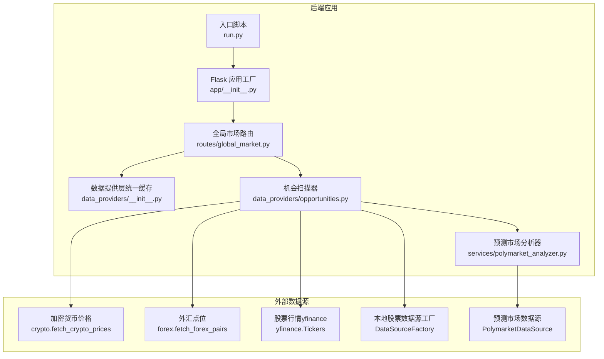
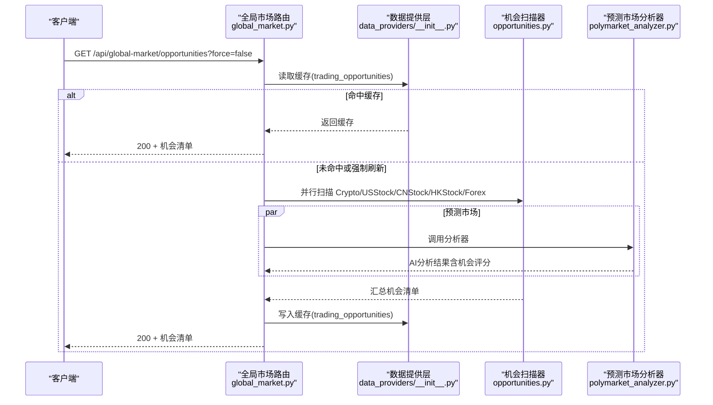
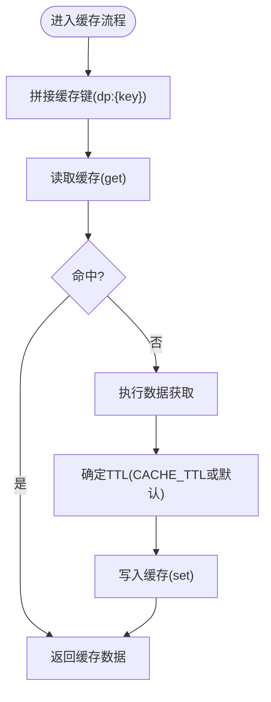
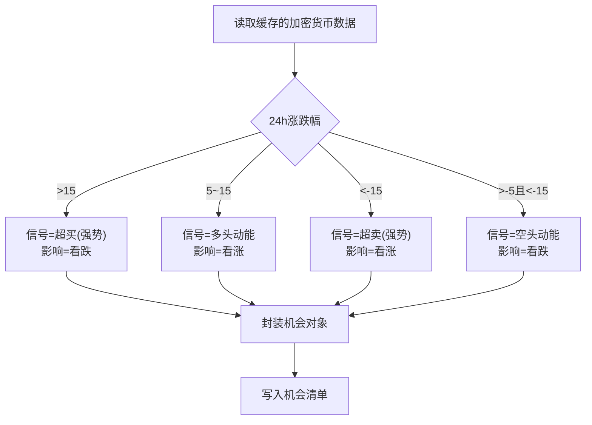
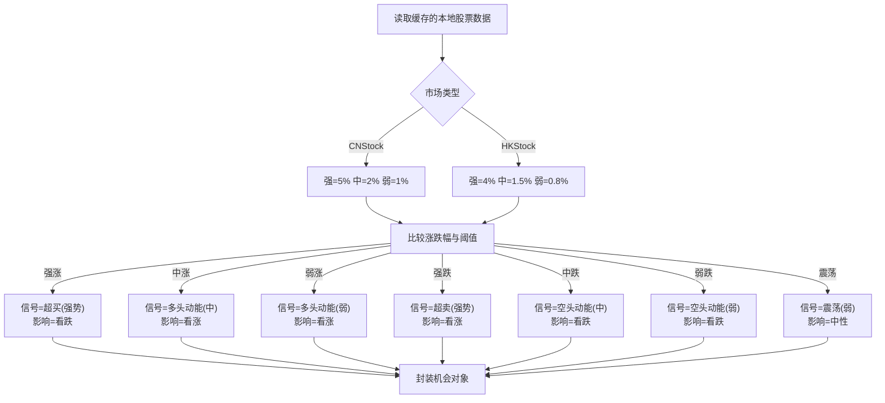
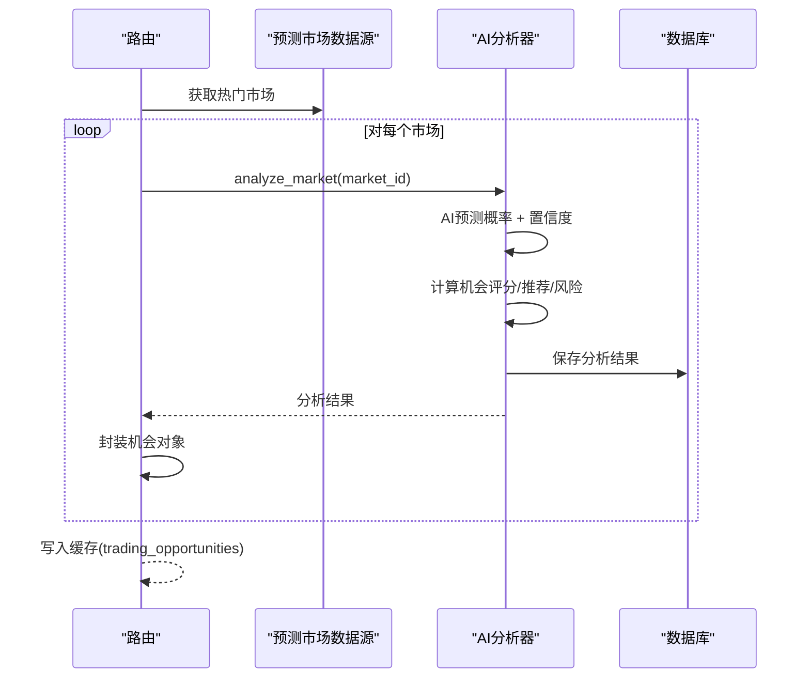
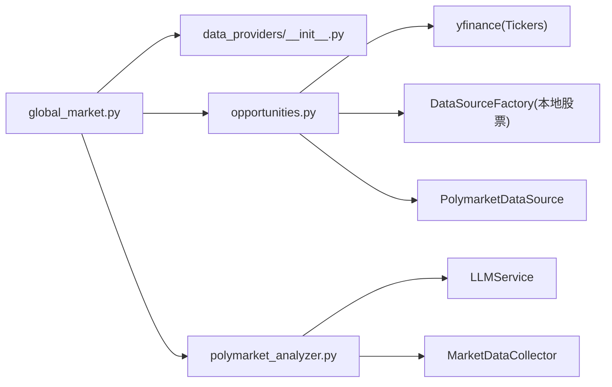

# 交易机会提供者

<cite>
**本文引用的文件**
- [opportunities.py](file://backend_api_python/app/data_providers/opportunities.py)
- [__init__.py（数据提供层）](file://backend_api_python/app/data_providers/__init__.py)
- [polymarket_analyzer.py](file://backend_api_python/app/services/polymarket_analyzer.py)
- [global_market.py（路由）](file://backend_api_python/app/routes/global_market.py)
- [__init__.py（应用工厂）](file://backend_api_python/app/__init__.py)
- [run.py（入口）](file://backend_api_python/run.py)
- [NOTIFICATION_EMAIL_CONFIG_EN.md](file://docs/NOTIFICATION_EMAIL_CONFIG_EN.md)
- [NOTIFICATION_TELEGRAM_CONFIG_EN.md](file://docs/NOTIFICATION_TELEGRAM_CONFIG_EN.md)
- [NOTIFICATION_SMS_CONFIG_EN.md](file://docs/NOTIFICATION_SMS_CONFIG_EN.md)
</cite>

## 目录
1. [简介](#简介)
2. [项目结构](#项目结构)
3. [核心组件](#核心组件)
4. [架构总览](#架构总览)
5. [详细组件分析](#详细组件分析)
6. [依赖关系分析](#依赖关系分析)
7. [性能考量](#性能考量)
8. [故障排查指南](#故障排查指南)
9. [结论](#结论)
10. [附录](#附录)

## 简介
本文件面向“交易机会提供者”的使用者与维护者，系统化阐述交易机会的识别算法、筛选标准与风险评估方法；详解套利机会、突破机会与反转机会的检测机制；并提供交易机会的实时监控与预警系统配置指南。该能力由后端数据提供层统一调度，通过多市场扫描与AI辅助分析，输出标准化的交易机会清单，支持多种通知渠道推送。

## 项目结构
交易机会提供者位于后端数据提供层，对外通过全局市场路由暴露统一接口，内部按市场类型拆分扫描器，并对预测市场引入AI分析器增强机会评分与风险评估。

图表来源
- [global_market.py（路由）:466-544](file://backend_api_python/app/routes/global_market.py#L466-L544)
- [opportunities.py:131-360](file://backend_api_python/app/data_providers/opportunities.py#L131-L360)
- [polymarket_analyzer.py:19-112](file://backend_api_python/app/services/polymarket_analyzer.py#L19-L112)
- [__init__.py（数据提供层）:45-86](file://backend_api_python/app/data_providers/__init__.py#L45-L86)

章节来源
- [global_market.py（路由）:466-544](file://backend_api_python/app/routes/global_market.py#L466-L544)
- [opportunities.py:1-360](file://backend_api_python/app/data_providers/opportunities.py#L1-L360)
- [__init__.py（数据提供层）:1-86](file://backend_api_python/app/data_providers/__init__.py#L1-L86)

## 核心组件
- 统一缓存与安全转换：提供统一的缓存读写与浮点安全转换，保障跨模块一致性与稳定性。
- 多市场机会扫描器：
  - 加密货币：基于24小时涨跌幅与7日涨跌幅阈值判定趋势强度与影响方向。
  - 美股：基于日涨跌幅阈值识别超买/超卖与动量信号。
  - 港/美股票：区分市场设定不同阈值，识别强势/温和/弱势上涨与下跌及震荡。
  - 外汇：基于汇率日涨跌幅阈值识别趋势与波动性。
  - 预测市场：结合AI预测概率、市场概率与置信度计算机会评分与风险等级。
- 路由与触发：全局市场路由提供统一入口，支持强制刷新与缓存控制。

章节来源
- [__init__.py（数据提供层）:45-86](file://backend_api_python/app/data_providers/__init__.py#L45-L86)
- [opportunities.py:131-360](file://backend_api_python/app/data_providers/opportunities.py#L131-L360)
- [global_market.py（路由）:466-544](file://backend_api_python/app/routes/global_market.py#L466-L544)

## 架构总览
交易机会提供者采用“路由驱动 + 数据提供层 + 市场扫描器 + AI分析器”的分层设计。路由负责鉴权与参数解析，数据提供层负责缓存与通用工具，扫描器按市场类型执行阈值规则，预测市场分析器引入LLM进行概率预测与机会评分。

图表来源
- [global_market.py（路由）:466-544](file://backend_api_python/app/routes/global_market.py#L466-L544)
- [opportunities.py:131-360](file://backend_api_python/app/data_providers/opportunities.py#L131-L360)
- [polymarket_analyzer.py:19-112](file://backend_api_python/app/services/polymarket_analyzer.py#L19-L112)

## 详细组件分析

### 统一缓存与安全转换
- 缓存键命名规范：统一加前缀“dp:”，便于清理与隔离。
- TTL策略：针对不同数据域设置合理过期时间，交易机会缓存默认1小时。
- 安全转换：提供浮点安全转换工具，避免异常输入导致崩溃。

图表来源
- [__init__.py（数据提供层）:45-86](file://backend_api_python/app/data_providers/__init__.py#L45-L86)

章节来源
- [__init__.py（数据提供层）:23-86](file://backend_api_python/app/data_providers/__init__.py#L23-L86)

### 加密货币机会扫描
- 输入：缓存的加密货币价格列表（包含24小时涨跌幅、7日涨跌幅、价格）。
- 规则：
  - 强势上涨：24小时涨幅 > 15%，信号“超买（强势）”，影响“看跌”。
  - 中等上涨：24小时涨幅 > 5%，信号“多头动能”，影响“看涨”。
  - 强势下跌：24小时跌幅 > 15%，信号“超卖（强势）”，影响“看涨”。
  - 中等下跌：24小时跌幅 > 5%，信号“空头动能”，影响“看跌”。
- 输出：标准化机会对象（含信号、强度、影响、原因、时间戳等）。

图表来源
- [opportunities.py:131-176](file://backend_api_python/app/data_providers/opportunities.py#L131-L176)

章节来源
- [opportunities.py:131-176](file://backend_api_python/app/data_providers/opportunities.py#L131-L176)

### 美股机会扫描
- 输入：缓存的美股价格列表（包含日涨跌幅、名称、价格）。
- 规则：
  - 超买：日涨幅 > 5%，信号“超买（强势）”，影响“看跌”。
  - 动能：日涨幅 > 2%，信号“多头动能”，影响“看涨”。
  - 超卖：日跌幅 > 5%，信号“超卖（强势）”，影响“看涨”。
  - 动能：日跌幅 > 2%，信号“空头动能”，影响“看跌”。

章节来源
- [opportunities.py:178-216](file://backend_api_python/app/data_providers/opportunities.py#L178-L216)

### 港/美股票机会扫描
- 输入：缓存的本地股票价格列表（包含日涨跌幅、名称、价格、市场标识）。
- 规则（区分市场）：
  - A股（CNStock）：强阈值5%，中阈值2%，弱阈值1%；港股（HKStock）：强阈值4%，中阈值1.5%，弱阈值0.8%。
  - 上涨：强/中/弱三档；下跌：强/中/弱三档；温和区间内归类“震荡（弱）”。
- 输出：标准化机会对象（含信号、强度、影响、原因、时间戳等）。

图表来源
- [opportunities.py:218-277](file://backend_api_python/app/data_providers/opportunities.py#L218-L277)

章节来源
- [opportunities.py:218-277](file://backend_api_python/app/data_providers/opportunities.py#L218-L277)

### 外汇机会扫描
- 输入：缓存的外汇点位列表（包含日涨跌幅、名称、价格）。
- 规则：
  - 强势上涨：日涨幅 > 1.5%，信号“超买（强势）”，影响“看跌”。
  - 动能：日涨幅 > 0.5%，信号“多头动能”，影响“看涨”。
  - 强势下跌：日跌幅 > 1.5%，信号“超卖（强势）”，影响“看涨”。
  - 动能：日跌幅 > 0.5%，信号“空头动能”，影响“看跌”。

章节来源
- [opportunities.py:279-319](file://backend_api_python/app/data_providers/opportunities.py#L279-L319)

### 预测市场机会扫描（AI增强）
- 流程概览：
  1) 从预测市场数据源获取热门市场；
  2) 调用AI分析器计算AI预测概率、市场概率、分歧度、置信度与机会评分；
  3) 生成推荐（YES/NO/HOLD）与风险等级；
  4) 封装机会对象并写入数据库与统一缓存。
- 关键指标：
  - 机会评分 = 分歧度得分（最大40）+ 置信度得分（最大60）；
  - 推荐：当分歧 > 5 且置信 > 60 时给出明确方向，否则持有；
  - 风险：根据置信度与分歧度综合评估。

图表来源
- [opportunities.py:321-360](file://backend_api_python/app/data_providers/opportunities.py#L321-L360)
- [polymarket_analyzer.py:19-112](file://backend_api_python/app/services/polymarket_analyzer.py#L19-L112)
- [polymarket_analyzer.py:338-370](file://backend_api_python/app/services/polymarket_analyzer.py#L338-L370)
- [polymarket_analyzer.py:371-382](file://backend_api_python/app/services/polymarket_analyzer.py#L371-L382)

章节来源
- [opportunities.py:321-360](file://backend_api_python/app/data_providers/opportunities.py#L321-L360)
- [polymarket_analyzer.py:19-112](file://backend_api_python/app/services/polymarket_analyzer.py#L19-L112)
- [polymarket_analyzer.py:338-382](file://backend_api_python/app/services/polymarket_analyzer.py#L338-L382)

### 路由与触发机制
- 路由入口：GET /api/global-market/opportunities
- 参数：
  - force：是否强制刷新（绕过缓存）。
- 执行流程：
  - 若未强制刷新且缓存命中，直接返回；
  - 否则并行扫描各市场机会，汇总后排序并写入缓存；
  - 返回标准化JSON（code/msg/data）。

章节来源
- [global_market.py（路由）:466-544](file://backend_api_python/app/routes/global_market.py#L466-L544)

## 依赖关系分析
- 组件耦合：
  - 路由依赖数据提供层缓存与扫描器；
  - 扫描器依赖具体数据源（yfinance、本地数据源工厂、预测市场数据源）；
  - 预测市场分析器依赖LLM服务与市场数据采集器。
- 外部依赖：
  - yfinance（美股价格）；
  - Redis/内存缓存（统一缓存）；
  - 数据库（持久化AI分析与机会记录）。

图表来源
- [global_market.py（路由）:46-49](file://backend_api_python/app/routes/global_market.py#L46-L49)
- [opportunities.py:8-12](file://backend_api_python/app/data_providers/opportunities.py#L8-L12)
- [polymarket_analyzer.py:12-25](file://backend_api_python/app/services/polymarket_analyzer.py#L12-L25)

章节来源
- [global_market.py（路由）:46-49](file://backend_api_python/app/routes/global_market.py#L46-L49)
- [opportunities.py:8-12](file://backend_api_python/app/data_providers/opportunities.py#L8-L12)
- [polymarket_analyzer.py:12-25](file://backend_api_python/app/services/polymarket_analyzer.py#L12-L25)

## 性能考量
- 并发扫描：路由侧对多市场扫描使用线程池并发执行，缩短整体延迟。
- 缓存策略：交易机会缓存默认1小时，热点数据（如指数、外汇、加密货币）另有独立缓存，降低重复拉取成本。
- 安全转换：统一的浮点安全转换避免异常输入导致的重复计算与异常开销。
- 可扩展性：新增市场只需在扫描器中增加阈值规则与输出封装，路由侧保持一致的触发与缓存策略。

章节来源
- [global_market.py（路由）:108-125](file://backend_api_python/app/routes/global_market.py#L108-L125)
- [__init__.py（数据提供层）:23-36](file://backend_api_python/app/data_providers/__init__.py#L23-L36)

## 故障排查指南
- 无法获取数据源：
  - 检查网络代理与数据源可用性（如yfinance）。
  - 查看路由日志中的异常堆栈定位失败模块。
- 缓存未生效：
  - 确认缓存键前缀与TTL配置正确；
  - 使用“强制刷新”参数验证缓存写入逻辑。
- 预测市场分析失败：
  - 检查LLM服务可用性与模型参数；
  - 核对数据库连接与表结构（AI分析与机会记录表）。
- 通知通道未送达：
  - 按照通知配置文档检查SMTP/Telegram/Twilio参数；
  - 确认策略已启用相应通知通道并填写正确目标地址/ID/号码。

章节来源
- [global_market.py（路由）:506-543](file://backend_api_python/app/routes/global_market.py#L506-L543)
- [NOTIFICATION_EMAIL_CONFIG_EN.md:67-99](file://docs/NOTIFICATION_EMAIL_CONFIG_EN.md#L67-L99)
- [NOTIFICATION_TELEGRAM_CONFIG_EN.md:77-87](file://docs/NOTIFICATION_TELEGRAM_CONFIG_EN.md#L77-L87)
- [NOTIFICATION_SMS_CONFIG_EN.md:87-110](file://docs/NOTIFICATION_SMS_CONFIG_EN.md#L87-L110)

## 结论
交易机会提供者通过统一的数据提供层与路由入口，实现了多市场的阈值扫描与预测市场的AI增强分析。其标准化输出便于接入策略引擎与通知系统，形成从“发现机会—评估风险—发出预警”的闭环。建议在生产环境中结合缓存策略与并发扫描，持续优化阈值与风险评估参数，以提升机会质量与稳定性。

## 附录

### 交易机会识别算法与筛选标准
- 加密货币：以24小时涨跌幅为核心，7日涨跌幅辅助判断趋势持续性。
- 美股：以日涨跌幅阈值划分超买/超卖与多头/空头动能。
- 港/美股票：按市场设定差异化阈值，覆盖强/中/弱三档与震荡区间。
- 外汇：以汇率日涨跌幅阈值识别波动与趋势。
- 预测市场：AI预测概率与市场概率的分歧度与置信度共同决定机会评分与推荐方向。

章节来源
- [opportunities.py:131-319](file://backend_api_python/app/data_providers/opportunities.py#L131-L319)
- [polymarket_analyzer.py:338-370](file://backend_api_python/app/services/polymarket_analyzer.py#L338-L370)

### 风险评估方法
- 机会评分：分歧度×2 + 置信度×0.6（上限100），用于衡量机会吸引力。
- 推荐方向：分歧>5且置信>60时给出明确方向，否则持有。
- 风险等级：综合置信度与分歧度，区分高低中三级。

章节来源
- [polymarket_analyzer.py:338-382](file://backend_api_python/app/services/polymarket_analyzer.py#L338-L382)

### 套利、突破、反转机会检测机制
- 套利机会：预测市场分析器通过AI与市场概率的分歧度识别潜在套利空间，结合置信度与风险等级辅助决策。
- 突破机会：多市场扫描器依据阈值规则识别强势上涨/下跌与动能信号，作为突破确认的先行指标。
- 反转机会：超买/超卖阈值触发反转预期，结合影响方向与震荡区间判断回调或反弹概率。

章节来源
- [opportunities.py:131-319](file://backend_api_python/app/data_providers/opportunities.py#L131-L319)
- [polymarket_analyzer.py:338-370](file://backend_api_python/app/services/polymarket_analyzer.py#L338-L370)

### 实时监控与预警系统配置指南
- 邮件通知：配置SMTP参数并在策略中启用邮件通道，支持HTML富文本与多收件人。
- Telegram通知：创建Bot、获取Token与用户ID，配置环境变量并启用Telegram通道。
- 短信通知：通过Twilio配置账户SID、认证Token与发送号码，启用短信通道并填写正确格式的手机号。

章节来源
- [NOTIFICATION_EMAIL_CONFIG_EN.md:67-99](file://docs/NOTIFICATION_EMAIL_CONFIG_EN.md#L67-L99)
- [NOTIFICATION_TELEGRAM_CONFIG_EN.md:77-87](file://docs/NOTIFICATION_TELEGRAM_CONFIG_EN.md#L77-L87)
- [NOTIFICATION_SMS_CONFIG_EN.md:87-110](file://docs/NOTIFICATION_SMS_CONFIG_EN.md#L87-L110)