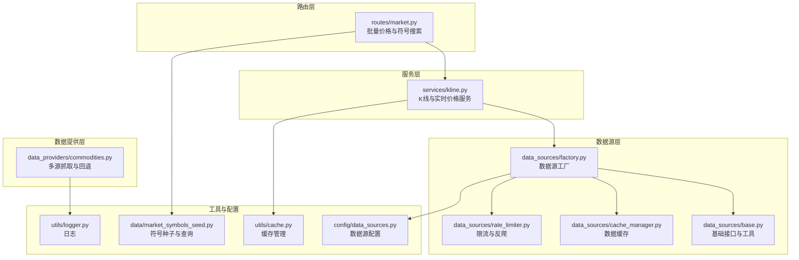
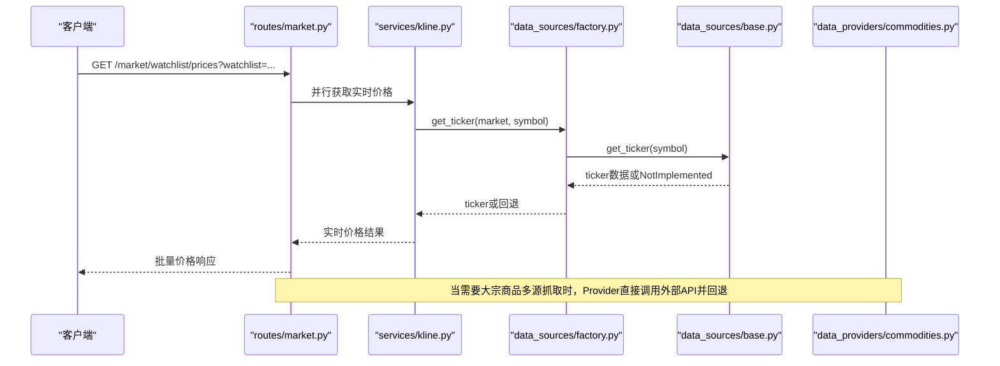
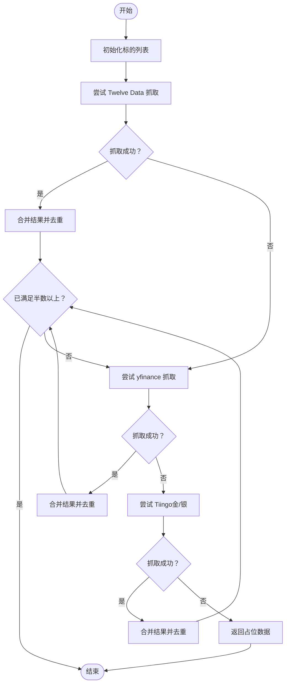
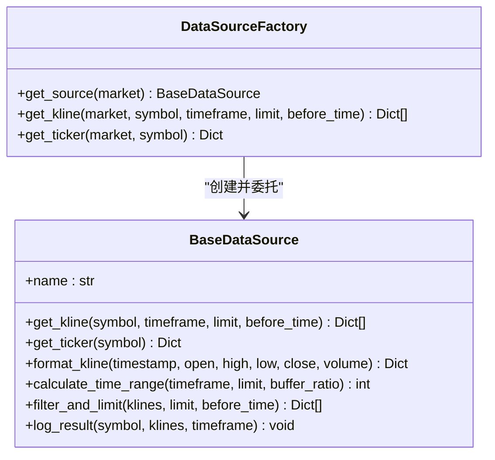
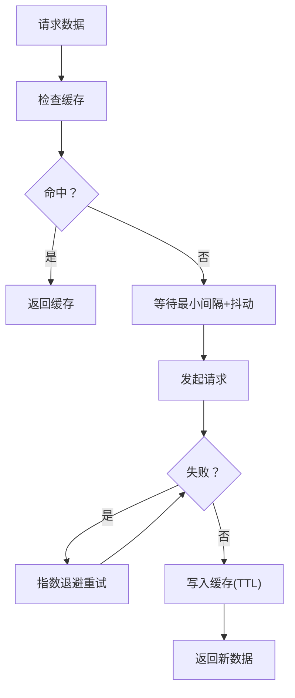
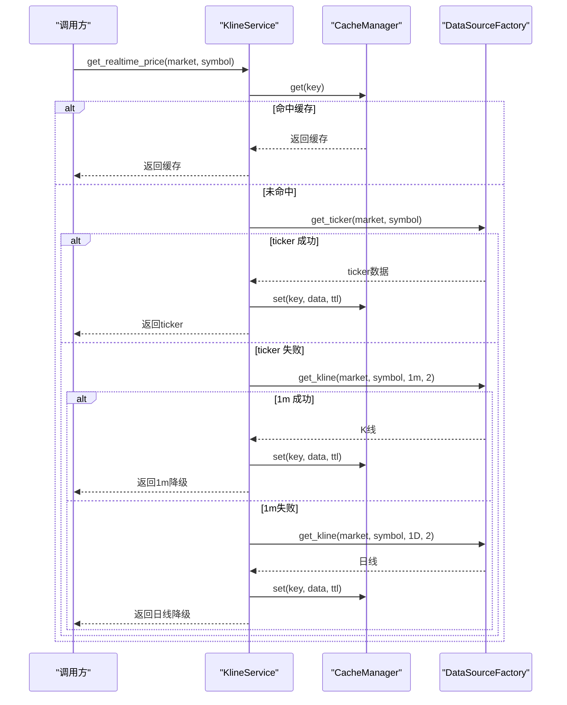
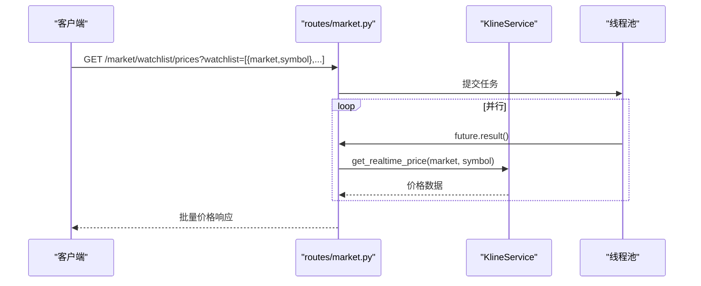
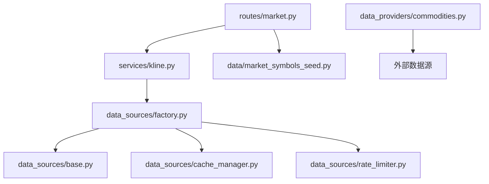

# 大宗商品数据提供者

<cite>
**本文档引用的文件**
- [commodities.py](file://backend_api_python/app/data_providers/commodities.py)
- [factory.py](file://backend_api_python/app/data_sources/factory.py)
- [base.py](file://backend_api_python/app/data_sources/base.py)
- [cache_manager.py](file://backend_api_python/app/data_sources/cache_manager.py)
- [rate_limiter.py](file://backend_api_python/app/data_sources/rate_limiter.py)
- [data_sources.py](file://backend_api_python/app/config/data_sources.py)
- [market.py](file://backend_api_python/app/routes/market.py)
- [market_symbols_seed.py](file://backend_api_python/app/data/market_symbols_seed.py)
- [kline.py](file://backend_api_python/app/services/kline.py)
- [logger.py](file://backend_api_python/app/utils/logger.py)
- [cache.py](file://backend_api_python/app/utils/cache.py)
- [test_data_providers.py](file://backend_api_python/tests/test_data_providers.py)
</cite>

## 目录
1. [简介](#简介)
2. [项目结构](#项目结构)
3. [核心组件](#核心组件)
4. [架构总览](#架构总览)
5. [详细组件分析](#详细组件分析)
6. [依赖分析](#依赖分析)
7. [性能考虑](#性能考虑)
8. [故障排除指南](#故障排除指南)
9. [结论](#结论)
10. [附录](#附录)

## 简介
本文件面向大宗商品数据提供者，系统性阐述数据获取策略、价格数据处理与趋势分析方法，并详细说明各类大宗商品的标识符、数据频率与历史数据查询接口。同时提供基于现有代码能力的预测模型与交易策略建议，帮助用户在本地或容器化环境中高效、稳定地获取大宗商品价格数据并进行分析。

## 项目结构
大宗商品相关功能主要分布在以下模块：
- 数据提供层：提供多源聚合的大宗商品价格抓取与回退策略
- 数据源层：抽象统一的数据源接口，支持缓存、限流与错误处理
- 服务层：封装K线与实时价格获取，提供缓存与降级策略
- 路由层：对外暴露查询接口，支持批量价格获取与符号搜索
- 工具与配置：缓存、限流、日志与配置加载

**图表来源**
- [market.py:642-752](file://backend_api_python/app/routes/market.py#L642-L752)
- [kline.py:14-191](file://backend_api_python/app/services/kline.py#L14-L191)
- [factory.py:13-134](file://backend_api_python/app/data_sources/factory.py#L13-L134)
- [base.py:27-171](file://backend_api_python/app/data_sources/base.py#L27-L171)
- [cache_manager.py:44-233](file://backend_api_python/app/data_sources/cache_manager.py#L44-L233)
- [rate_limiter.py:109-273](file://backend_api_python/app/data_sources/rate_limiter.py#L109-L273)
- [commodities.py:155-181](file://backend_api_python/app/data_providers/commodities.py#L155-L181)
- [market_symbols_seed.py:26-193](file://backend_api_python/app/data/market_symbols_seed.py#L26-L193)
- [logger.py:9-63](file://backend_api_python/app/utils/logger.py#L9-L63)
- [cache.py:49-129](file://backend_api_python/app/utils/cache.py#L49-L129)
- [data_sources.py:26-171](file://backend_api_python/app/config/data_sources.py#L26-L171)

**章节来源**
- [market.py:642-752](file://backend_api_python/app/routes/market.py#L642-L752)
- [kline.py:14-191](file://backend_api_python/app/services/kline.py#L14-L191)
- [factory.py:13-134](file://backend_api_python/app/data_sources/factory.py#L13-L134)
- [base.py:27-171](file://backend_api_python/app/data_sources/base.py#L27-L171)
- [cache_manager.py:44-233](file://backend_api_python/app/data_sources/cache_manager.py#L44-L233)
- [rate_limiter.py:109-273](file://backend_api_python/app/data_sources/rate_limiter.py#L109-L273)
- [commodities.py:155-181](file://backend_api_python/app/data_providers/commodities.py#L155-L181)
- [market_symbols_seed.py:26-193](file://backend_api_python/app/data/market_symbols_seed.py#L26-L193)
- [logger.py:9-63](file://backend_api_python/app/utils/logger.py#L9-L63)
- [cache.py:49-129](file://backend_api_python/app/utils/cache.py#L49-L129)
- [data_sources.py:26-171](file://backend_api_python/app/config/data_sources.py#L26-L171)

## 核心组件
- 大宗商品多源抓取器：优先从 Twelve Data 获取，失败时回退至 yfinance，再回退至 Tiingo（金/银），最后兜底返回占位数据
- 数据源工厂：按市场类型返回对应数据源，提供 K 线与实时报价的便捷方法
- 基础数据源：统一 K 线接口、时间范围计算、过滤与日志延迟检测
- 缓存与限流：内置 TTL/LRU 缓存与随机抖动、指数退避等反爬策略
- 服务层：K 线与实时价格服务，优先使用 ticker，失败时降级到分钟/日线 K 线
- 路由层：批量价格获取、符号搜索与热门符号查询
- 符号种子：数据库驱动的符号表，支持搜索与名称解析

**章节来源**
- [commodities.py:155-181](file://backend_api_python/app/data_providers/commodities.py#L155-L181)
- [factory.py:13-134](file://backend_api_python/app/data_sources/factory.py#L13-L134)
- [base.py:27-171](file://backend_api_python/app/data_sources/base.py#L27-L171)
- [cache_manager.py:44-233](file://backend_api_python/app/data_sources/cache_manager.py#L44-L233)
- [rate_limiter.py:109-273](file://backend_api_python/app/data_sources/rate_limiter.py#L109-L273)
- [kline.py:14-191](file://backend_api_python/app/services/kline.py#L14-L191)
- [market.py:642-752](file://backend_api_python/app/routes/market.py#L642-L752)
- [market_symbols_seed.py:26-193](file://backend_api_python/app/data/market_symbols_seed.py#L26-L193)

## 架构总览
大宗商品数据流从路由层进入，经服务层与数据源工厂，最终落到多源抓取器。数据在返回前端前经过缓存与降级策略，确保稳定性与性能。

**图表来源**
- [market.py:642-752](file://backend_api_python/app/routes/market.py#L642-L752)
- [kline.py:74-191](file://backend_api_python/app/services/kline.py#L74-L191)
- [factory.py:108-133](file://backend_api_python/app/data_sources/factory.py#L108-L133)
- [base.py:55-62](file://backend_api_python/app/data_sources/base.py#L55-L62)
- [commodities.py:155-181](file://backend_api_python/app/data_providers/commodities.py#L155-L181)

## 详细组件分析

### 大宗商品多源抓取器
- 支持的标的与标识符
  - 黄金：td 标识为 GC，yf 标识为 GC=F，tiingo 标识为 xauusd
  - 白银：td 标识为 SI，yf 标识为 SI=F，tiingo 标识为 xagusd
  - 原油 WTI：td 标识为 CL，yf 标识为 CL=F，tiingo 未提供
  - 原油 Brent：td 标识为 BZ，yf 标识为 BZ=F，tiingo 未提供
  - 铜：td 标识为 HG，yf 标识为 HG=F，tiingo 未提供
  - 天然气：td 标识为 NG，yf 标识为 NG=F，tiingo 未提供
- 数据获取优先级：Twelve Data → yfinance → Tiingo（金/银）
- 回退策略：任一层成功即合并去重，达到至少半数标的后停止；全部失败则返回占位数据
- 输出字段：symbol、name_cn、name_en、price、change、unit、category

**图表来源**
- [commodities.py:155-181](file://backend_api_python/app/data_providers/commodities.py#L155-L181)

**章节来源**
- [commodities.py:13-20](file://backend_api_python/app/data_providers/commodities.py#L13-L20)
- [commodities.py:23-58](file://backend_api_python/app/data_providers/commodities.py#L23-L58)
- [commodities.py:61-105](file://backend_api_python/app/data_providers/commodities.py#L61-L105)
- [commodities.py:108-152](file://backend_api_python/app/data_providers/commodities.py#L108-L152)
- [commodities.py:155-181](file://backend_api_python/app/data_providers/commodities.py#L155-L181)

### 数据源工厂与基础接口
- 工厂方法
  - get_source(market)：按市场类型返回数据源实例
  - get_kline(market, symbol, timeframe, limit, before_time)：统一 K 线获取入口，自动排序与异常处理
  - get_ticker(market, symbol)：统一实时报价入口，未实现时返回默认值
- 基础接口
  - get_kline(symbol, timeframe, limit, before_time)：抽象接口，子类实现具体抓取
  - get_ticker(symbol)：可选接口，返回类似 CCXT 的报价结构
  - format_kline：标准化 K 线字段
  - calculate_time_range：基于周期与数量估算时间窗口
  - filter_and_limit：按时间与数量过滤与截断
  - log_result：检测数据延迟并发出警告

**图表来源**
- [base.py:27-171](file://backend_api_python/app/data_sources/base.py#L27-L171)
- [factory.py:13-134](file://backend_api_python/app/data_sources/factory.py#L13-L134)

**章节来源**
- [factory.py:13-134](file://backend_api_python/app/data_sources/factory.py#L13-L134)
- [base.py:27-171](file://backend_api_python/app/data_sources/base.py#L27-L171)

### 缓存与限流
- 缓存
  - DataCache：TTL 过期、LRU 淘汰、线程安全、命中率统计
  - 全局缓存实例：实时行情、K 线、股票信息分别配置不同 TTL 与容量
  - 键生成：K 线缓存键包含 symbol、timeframe、limit、before_time
- 限流与反爬
  - RateLimiter：最小间隔、随机抖动、重置
  - 指数退避重试：可配置最大尝试次数与延迟上限
  - 随机 UA 与请求头：降低被封禁风险

**图表来源**
- [cache_manager.py:44-233](file://backend_api_python/app/data_sources/cache_manager.py#L44-L233)
- [rate_limiter.py:109-273](file://backend_api_python/app/data_sources/rate_limiter.py#L109-L273)

**章节来源**
- [cache_manager.py:44-233](file://backend_api_python/app/data_sources/cache_manager.py#L44-L233)
- [rate_limiter.py:109-273](file://backend_api_python/app/data_sources/rate_limiter.py#L109-L273)

### 服务层：K 线与实时价格
- get_kline：构建缓存键，优先读取缓存，否则通过工厂获取并写入缓存
- get_realtime_price：优先使用 ticker，失败则降级到 1 分钟 K 线，再降级到日线 K 线；分别设置不同 TTL
- 日志延迟检测：根据周期设定阈值，识别数据更新延迟

**图表来源**
- [kline.py:74-191](file://backend_api_python/app/services/kline.py#L74-L191)
- [factory.py:108-133](file://backend_api_python/app/data_sources/factory.py#L108-L133)
- [cache.py:100-124](file://backend_api_python/app/utils/cache.py#L100-L124)

**章节来源**
- [kline.py:14-191](file://backend_api_python/app/services/kline.py#L14-L191)
- [cache.py:49-129](file://backend_api_python/app/utils/cache.py#L49-L129)

### 路由层：批量价格与符号搜索
- 批量价格接口：/market/watchlist/prices，支持并发线程池，带超时保护与默认兜底
- 单个价格接口：/market/price，参数 market 与 symbol
- 符号搜索：/market/symbols/search，支持关键字与市场过滤
- 热门符号：/market/symbols/hot，按市场返回精选列表

**图表来源**
- [market.py:642-752](file://backend_api_python/app/routes/market.py#L642-L752)
- [kline.py:74-191](file://backend_api_python/app/services/kline.py#L74-L191)

**章节来源**
- [market.py:617-800](file://backend_api_python/app/routes/market.py#L617-L800)
- [market_symbols_seed.py:26-193](file://backend_api_python/app/data/market_symbols_seed.py#L26-L193)

## 依赖分析
- 组件耦合
  - 路由层依赖服务层；服务层依赖数据源工厂；工厂依赖基础接口与缓存/限流模块
  - 大宗商品抓取器独立于数据源层，直接调用外部 API，具备回退能力
- 外部依赖
  - Twelve Data、yfinance、Tiingo（金/银）等第三方数据源
  - Redis（可选）与本地内存缓存
  - CCXT（用于加密货币市场，间接影响大宗商品相关路由）

**图表来源**
- [market.py:642-752](file://backend_api_python/app/routes/market.py#L642-L752)
- [kline.py:14-191](file://backend_api_python/app/services/kline.py#L14-L191)
- [factory.py:13-134](file://backend_api_python/app/data_sources/factory.py#L13-L134)
- [base.py:27-171](file://backend_api_python/app/data_sources/base.py#L27-L171)
- [cache_manager.py:44-233](file://backend_api_python/app/data_sources/cache_manager.py#L44-L233)
- [rate_limiter.py:109-273](file://backend_api_python/app/data_sources/rate_limiter.py#L109-L273)
- [commodities.py:155-181](file://backend_api_python/app/data_providers/commodities.py#L155-L181)
- [market_symbols_seed.py:26-193](file://backend_api_python/app/data/market_symbols_seed.py#L26-L193)

**章节来源**
- [market.py:642-752](file://backend_api_python/app/routes/market.py#L642-L752)
- [kline.py:14-191](file://backend_api_python/app/services/kline.py#L14-L191)
- [factory.py:13-134](file://backend_api_python/app/data_sources/factory.py#L13-L134)
- [base.py:27-171](file://backend_api_python/app/data_sources/base.py#L27-L171)
- [cache_manager.py:44-233](file://backend_api_python/app/data_sources/cache_manager.py#L44-L233)
- [rate_limiter.py:109-273](file://backend_api_python/app/data_sources/rate_limiter.py#L109-L273)
- [commodities.py:155-181](file://backend_api_python/app/data_providers/commodities.py#L155-L181)
- [market_symbols_seed.py:26-193](file://backend_api_python/app/data/market_symbols_seed.py#L26-L193)

## 性能考虑
- 并发与超时：批量价格接口使用线程池并发获取，设置超时保护，避免阻塞
- 缓存策略：实时价格短 TTL（30s）、日线数据较长 TTL（5 分钟），K 线按周期配置 TTL，减少重复请求
- 降级路径：优先 ticker，失败降级到分钟 K 线，再降级到日线 K 线，保证可用性
- 反爬与限流：随机抖动、指数退避、UA 轮换，降低被限速或封禁风险
- 日志与监控：延迟检测与日志分级，便于定位问题

[本节为通用性能讨论，无需特定文件引用]

## 故障排除指南
- 批量价格失败
  - 检查线程池工作数与超时设置
  - 查看路由层日志与异常返回
- 实时价格为空
  - 确认 ticker 接口是否实现与可用
  - 观察降级路径是否生效（1 分钟/日线）
- 缓存异常
  - 检查缓存启用状态与 Redis 连接
  - 关注 TTL 与命中率统计
- 外部数据源失败
  - 查看 Twelve Data、yfinance、Tiingo 的可用性与配额
  - 启用指数退避与随机抖动以规避限流

**章节来源**
- [market.py:690-752](file://backend_api_python/app/routes/market.py#L690-L752)
- [kline.py:115-191](file://backend_api_python/app/services/kline.py#L115-L191)
- [cache.py:77-98](file://backend_api_python/app/utils/cache.py#L77-L98)
- [rate_limiter.py:170-231](file://backend_api_python/app/data_sources/rate_limiter.py#L170-L231)
- [logger.py:9-63](file://backend_api_python/app/utils/logger.py#L9-L63)

## 结论
大宗商品数据提供者通过多源抓取与回退策略、统一的数据源接口、完善的缓存与限流机制，以及服务层的降级与日志检测，实现了高可用、高性能的大宗商品价格数据服务。结合路由层的批量价格与符号搜索能力，可满足日常分析与交易场景的需求。对于预测与策略建议，可在现有数据基础上扩展指标与模型，但需注意数据质量与延迟控制。

[本节为总结性内容，无需特定文件引用]

## 附录

### 大宗商品标识符与单位
- 黄金：td=GC，yf=GC=F，tiingo=xauusd，单位=USD/oz
- 白银：td=SI，yf=SI=F，tiingo=xagusd，单位=USD/oz
- 原油 WTI：td=CL，yf=CL=F，tiingo=未提供，单位=USD/bbl
- 原油 Brent：td=BZ，yf=BZ=F，tiingo=未提供，单位=USD/bbl
- 铜：td=HG，yf=HG=F，tiingo=未提供，单位=USD/lb
- 天然气：td=NG，yf=NG=F，tiingo=未提供，单位=USD/MMBtu

**章节来源**
- [commodities.py:13-20](file://backend_api_python/app/data_providers/commodities.py#L13-L20)

### 数据频率与历史查询接口
- K 线周期映射（秒）：1m=60、5m=300、15m=900、30m=1800、1H=3600、4H=14400、1D=86400、1W=604800
- 历史查询接口：/market/watchlist/prices 支持传入 watchlist 列表，批量获取价格
- 实时价格接口：/market/price 支持传入 market 与 symbol 获取单个价格

**章节来源**
- [base.py:15-24](file://backend_api_python/app/data_sources/base.py#L15-L24)
- [market.py:642-800](file://backend_api_python/app/routes/market.py#L642-L800)

### 测试与验证
- 提供了缓存与辅助函数的单元测试样例，可作为扩展测试的基础

**章节来源**
- [test_data_providers.py:1-193](file://backend_api_python/tests/test_data_providers.py#L1-L193)