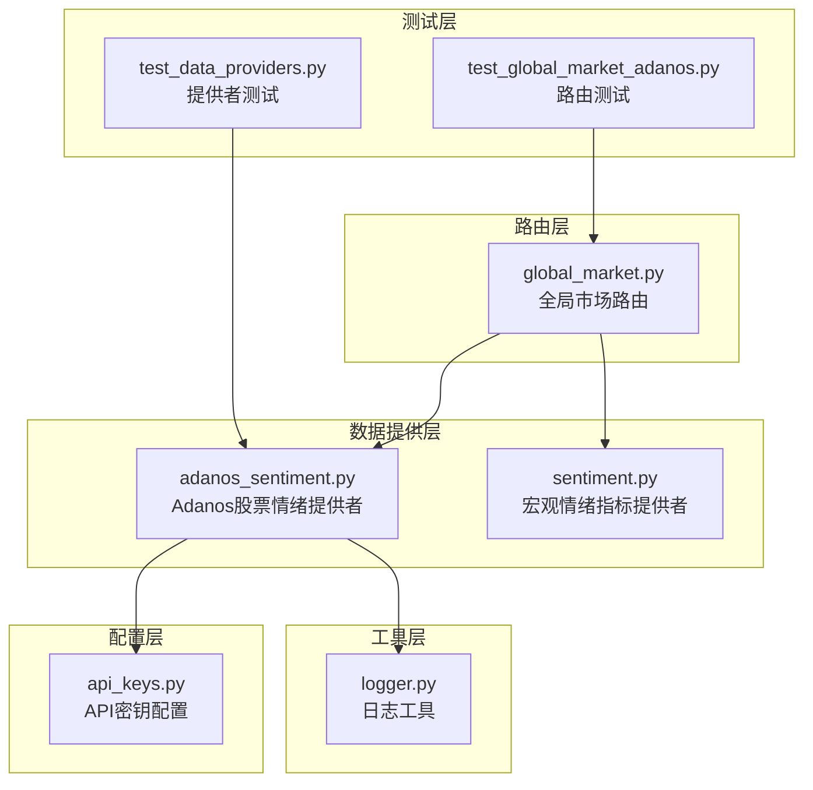
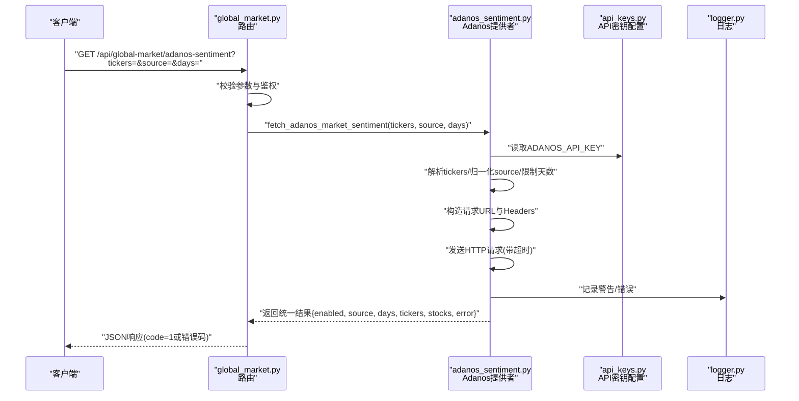
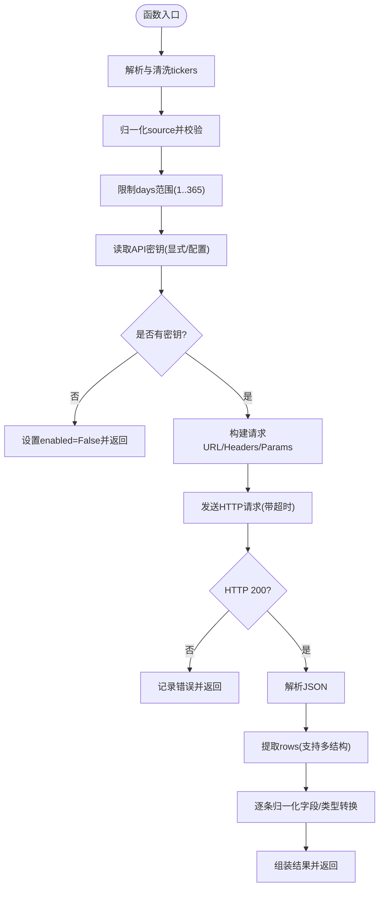
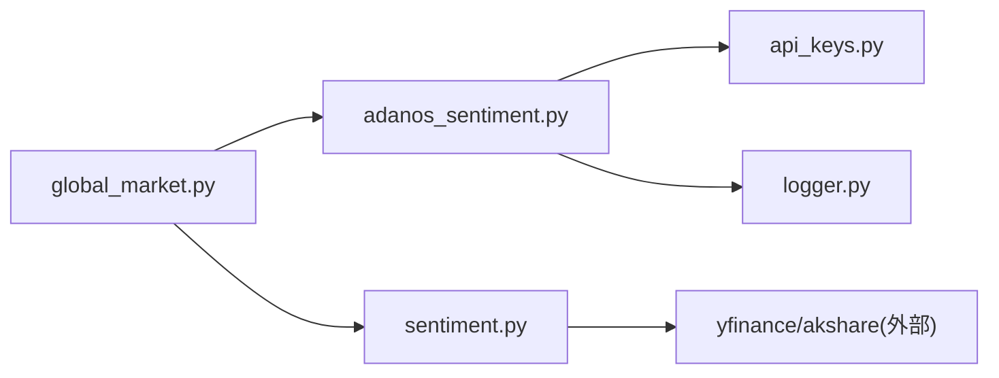

# 市场情绪提供者

<cite>
**本文引用的文件**
- [adanos_sentiment.py](file://backend_api_python/app/data_providers/adanos_sentiment.py)
- [sentiment.py](file://backend_api_python/app/data_providers/sentiment.py)
- [api_keys.py](file://backend_api_python/app/config/api_keys.py)
- [global_market.py](file://backend_api_python/app/routes/global_market.py)
- [test_data_providers.py](file://backend_api_python/tests/test_data_providers.py)
- [test_global_market_adanos.py](file://backend_api_python/tests/test_global_market_adanos.py)
- [logger.py](file://backend_api_python/app/utils/logger.py)
</cite>

## 目录
1. [简介](#简介)
2. [项目结构](#项目结构)
3. [核心组件](#核心组件)
4. [架构总览](#架构总览)
5. [详细组件分析](#详细组件分析)
6. [依赖关系分析](#依赖关系分析)
7. [性能考量](#性能考量)
8. [故障排除指南](#故障排除指南)
9. [结论](#结论)
10. [附录](#附录)

## 简介
本文件面向“市场情绪提供者”，聚焦于QuantDinger后端中对Adanos情感分析系统的可选集成与统一情绪指标体系。内容涵盖：
- 市场情绪指标的计算方法与数据来源
- Adanos情感分析系统的API调用流程、数据格式与响应处理
- 指标解读指南与典型应用场景
- 代码级架构与关键流程图示

## 项目结构
围绕市场情绪相关的代码主要分布在以下模块：
- 数据提供层：负责从外部服务抓取并标准化情绪指标
  - Adanos股票情绪提供者：[adanos_sentiment.py](file://backend_api_python/app/data_providers/adanos_sentiment.py)
  - 传统宏观情绪指标提供者：[sentiment.py](file://backend_api_python/app/data_providers/sentiment.py)
- 配置层：集中管理第三方API密钥与环境变量
  - API密钥配置：[api_keys.py](file://backend_api_python/app/config/api_keys.py)
- 路由层：对外暴露REST接口，聚合情绪数据
  - 全球市场路由（含Adanos情绪端点）：[global_market.py](file://backend_api_python/app/routes/global_market.py)
- 测试层：验证Adanos情绪端点行为与错误处理
  - 提供者单元测试：[test_data_providers.py](file://backend_api_python/tests/test_data_providers.py)
  - 端到端路由测试：[test_global_market_adanos.py](file://backend_api_python/tests/test_global_market_adanos.py)
- 工具层：日志工具
  - 日志工具：[logger.py](file://backend_api_python/app/utils/logger.py)

图表来源
- [global_market.py:33-49](file://backend_api_python/app/routes/global_market.py#L33-L49)
- [adanos_sentiment.py:11-14](file://backend_api_python/app/data_providers/adanos_sentiment.py#L11-L14)
- [api_keys.py:54-61](file://backend_api_python/app/config/api_keys.py#L54-L61)
- [test_data_providers.py:34-42](file://backend_api_python/tests/test_data_providers.py#L34-L42)
- [test_global_market_adanos.py:27-55](file://backend_api_python/tests/test_global_market_adanos.py#L27-L55)

章节来源
- [global_market.py:1-587](file://backend_api_python/app/routes/global_market.py#L1-L587)
- [adanos_sentiment.py:1-205](file://backend_api_python/app/data_providers/adanos_sentiment.py#L1-L205)
- [sentiment.py:1-377](file://backend_api_python/app/data_providers/sentiment.py#L1-L377)
- [api_keys.py:1-164](file://backend_api_python/app/config/api_keys.py#L1-L164)
- [test_data_providers.py:1-193](file://backend_api_python/tests/test_data_providers.py#L1-L193)
- [test_global_market_adanos.py:1-66](file://backend_api_python/tests/test_global_market_adanos.py#L1-L66)
- [logger.py:1-63](file://backend_api_python/app/utils/logger.py#L1-L63)

## 核心组件
- Adanos股票情绪提供者
  - 功能：按股票代码列表查询Adanos情感分析结果，支持多来源（Reddit/X/新闻/预测市场），并进行字段归一化与类型转换。
  - 关键能力：输入解析、来源归一化、请求构建与异常处理、响应归一化。
- 宏观情绪指标提供者
  - 功能：统一获取恐惧与贪婪指数、VIX、美元指数、收益率曲线、科技股/黄金波动率等指标，并提供中文/英文解读。
- 全球市场路由
  - 功能：对外提供/adanos-sentiment端点，接收tickers/source/days参数，鉴权后调用Adanos提供者并返回统一格式。

章节来源
- [adanos_sentiment.py:135-205](file://backend_api_python/app/data_providers/adanos_sentiment.py#L135-L205)
- [sentiment.py:12-377](file://backend_api_python/app/data_providers/sentiment.py#L12-L377)
- [global_market.py:385-464](file://backend_api_python/app/routes/global_market.py#L385-L464)

## 架构总览
下图展示从客户端到Adanos情绪端点的完整调用链路与数据流：

图表来源
- [global_market.py:385-464](file://backend_api_python/app/routes/global_market.py#L385-L464)
- [adanos_sentiment.py:135-205](file://backend_api_python/app/data_providers/adanos_sentiment.py#L135-L205)
- [api_keys.py:54-61](file://backend_api_python/app/config/api_keys.py#L54-L61)
- [logger.py:9-34](file://backend_api_python/app/utils/logger.py#L9-L34)

## 详细组件分析

### Adanos情感分析系统集成
- 输入参数与默认值
  - tickers：支持逗号分隔字符串或可迭代对象；内部进行去重、清洗与长度上限控制（最多20只）。
  - source：支持"reddit"/"x"/"news"/"polymarket"；"twitter"映射为"x"；不支持的来源抛出异常。
  - days：范围限制在1~365之间，默认7天。
  - API密钥：优先使用显式传入，否则从配置中读取；若未配置则返回禁用状态而非抛错（fail-open设计）。
  - 超时与基础URL：可通过环境变量覆盖默认值。
- 请求构建与调用
  - 基础URL默认为"https://api.adanos.org"，endpoint根据source选择对应路径，最终拼接为“/compare”对比接口。
  - 请求头包含Accept与X-API-Key；超时可配置。
- 响应处理与归一化
  - 支持多种payload结构（list/dict中的stocks/data/results），提取records并逐条归一化。
  - 归一化字段包括：ticker、公司名、来源、情绪分数、热度分数、多头/空头比例、提及次数、各类计数与趋势历史等。
  - 类型转换：数值字段采用安全转换，非有限数转为None；缺失字段统一为None。
- 错误处理策略
  - 无有效tickers：返回错误提示。
  - 无API密钥：返回禁用状态与错误信息。
  - HTTP非200：记录错误并返回。
  - JSON解析失败：返回无效JSON错误。
  - 失败时保持fail-open，保证系统可用性。

图表来源
- [adanos_sentiment.py:135-205](file://backend_api_python/app/data_providers/adanos_sentiment.py#L135-L205)
- [adanos_sentiment.py:32-51](file://backend_api_python/app/data_providers/adanos_sentiment.py#L32-L51)
- [adanos_sentiment.py:54-61](file://backend_api_python/app/data_providers/adanos_sentiment.py#L54-L61)
- [adanos_sentiment.py:86-121](file://backend_api_python/app/data_providers/adanos_sentiment.py#L86-L121)

章节来源
- [adanos_sentiment.py:135-205](file://backend_api_python/app/data_providers/adanos_sentiment.py#L135-L205)
- [api_keys.py:54-61](file://backend_api_python/app/config/api_keys.py#L54-L61)
- [logger.py:9-34](file://backend_api_python/app/utils/logger.py#L9-L34)

### 宏观情绪指标与解读
- 指标集合
  - 恐惧与贪婪指数（Alternative.me）
  - VIX（CBOE波动率）、VXN（纳斯达克波动率）、GVZ（黄金波动率）
  - 美元指数（DXY）
  - 收益率曲线（10年-2年利差）
  - 期权期限结构（Put/Call比率代理）
- 数据来源与回退策略
  - 多数指标通过yfinance获取；若失败则尝试akshare等替代方案；均提供默认值以保证可用性。
- 解读与信号
  - 每个指标返回数值、变化、等级、中文/英文解读以及信号（如牛市/熊市/中性）。
- 应用场景
  - 风险偏好判断、宏观择时、跨资产轮动、波动率交易策略辅助。

章节来源
- [sentiment.py:12-377](file://backend_api_python/app/data_providers/sentiment.py#L12-L377)

### 全球市场路由与端点
- 端点定义
  - GET /api/global-market/adanos-sentiment
  - 参数：tickers（可选）、source（可选，默认reddit/x/news/polymarket之一）、days（可选，默认7，范围1~365）
  - 返回：统一结构，包含enabled、provider、source、days、tickers、stocks、error等字段
- 缓存策略
  - 使用缓存键“adanos_sentiment:{source}:{days}:{tickers.upper()}”，默认缓存5分钟
- 鉴权
  - 所有端点需登录态（Bearer Token）

章节来源
- [global_market.py:385-464](file://backend_api_python/app/routes/global_market.py#L385-L464)

## 依赖关系分析
- 组件耦合
  - 路由层仅依赖数据提供者接口，解耦良好
  - Adanos提供者依赖API密钥配置与日志工具，耦合度低
- 外部依赖
  - Adanos提供者依赖requests库与外部API
  - 宏观情绪提供者依赖yfinance/akshare等第三方库
- 环境变量与配置
  - ADANOS_API_KEY、ADANOS_API_BASE_URL、ADANOS_API_TIMEOUT等
  - 通过APIKeys类统一读取，支持环境变量与附加配置文件

图表来源
- [global_market.py:33-49](file://backend_api_python/app/routes/global_market.py#L33-L49)
- [adanos_sentiment.py:11-14](file://backend_api_python/app/data_providers/adanos_sentiment.py#L11-L14)
- [api_keys.py:54-61](file://backend_api_python/app/config/api_keys.py#L54-L61)

章节来源
- [global_market.py:33-49](file://backend_api_python/app/routes/global_market.py#L33-L49)
- [adanos_sentiment.py:11-14](file://backend_api_python/app/data_providers/adanos_sentiment.py#L11-L14)
- [api_keys.py:54-61](file://backend_api_python/app/config/api_keys.py#L54-L61)

## 性能考量
- 并发与缓存
  - 路由层对多个指标的拉取采用线程池并发执行，降低整体延迟
  - Adanos情绪端点默认缓存5分钟，避免频繁外部调用
- 超时与容错
  - Adanos请求支持超时配置；失败时fail-open，不影响主流程
- 数据量控制
  - 单次请求最多20只股票，防止过度负载

章节来源
- [global_market.py:108-125](file://backend_api_python/app/routes/global_market.py#L108-L125)
- [adanos_sentiment.py:128-133](file://backend_api_python/app/data_providers/adanos_sentiment.py#L128-L133)
- [adanos_sentiment.py:20-20](file://backend_api_python/app/data_providers/adanos_sentiment.py#L20-L20)

## 故障排除指南
- 无API密钥
  - 现象：返回enabled=False且error包含“ADANOS_API_KEY is not configured”
  - 处理：在环境变量中设置ADANOS_API_KEY或通过配置文件提供
- HTTP错误
  - 现象：返回error包含“Adanos API returned HTTP {status}”
  - 处理：检查网络连通性、配额限制与基础URL
- 无效JSON
  - 现象：返回error包含“Adanos API returned invalid JSON”
  - 处理：确认Adanos服务端返回格式正确
- 无有效tickers
  - 现象：返回error包含“No valid stock tickers provided”
  - 处理：确保tickers为合法的大写字母与数字组合，且不超过20个
- 不支持的source
  - 现象：抛出ValueError
  - 处理：使用支持的source（reddit/x/news/polymarket），或使用“twitter”映射为“x”

章节来源
- [test_data_providers.py:34-42](file://backend_api_python/tests/test_data_providers.py#L34-L42)
- [test_data_providers.py:115-131](file://backend_api_python/tests/test_data_providers.py#L115-L131)
- [test_data_providers.py:134-183](file://backend_api_python/tests/test_data_providers.py#L134-L183)
- [test_data_providers.py:186-193](file://backend_api_python/tests/test_data_providers.py#L186-L193)
- [adanos_sentiment.py:165-197](file://backend_api_python/app/data_providers/adanos_sentiment.py#L165-L197)
- [adanos_sentiment.py:54-61](file://backend_api_python/app/data_providers/adanos_sentiment.py#L54-L61)

## 结论
- Adanos情感分析系统作为可选增强模块，通过fail-open设计确保系统稳定性
- 统一的参数校验、来源归一化与响应归一化，提升了跨数据源的一致性
- 路由层提供标准端点与缓存机制，适合在仪表盘与策略系统中复用
- 宏观情绪指标与Adanos个股情绪形成互补，可支撑更全面的市场情绪分析

## 附录

### API定义与参数说明
- 端点：GET /api/global-market/adanos-sentiment
- 查询参数
  - tickers：可选，逗号分隔的股票代码（最多20个）
  - source：可选，支持"reddit"/"x"/"news"/"polymarket"（"twitter"映射为"x"）
  - days：可选，默认7，范围1~365
- 返回结构
  - enabled：布尔，是否启用Adanos提供者
  - provider：字符串，提供者标识
  - source/days/tickers：原始请求参数
  - stocks：数组，每项为归一化后的股票情绪记录
  - error：字符串，错误信息（若存在）

章节来源
- [global_market.py:385-464](file://backend_api_python/app/routes/global_market.py#L385-L464)

### 数据模型（关键字段）
- 股票情绪记录（部分字段）
  - ticker：股票代码
  - company_name：公司名称
  - source：数据来源
  - sentiment_score：情绪分数
  - buzz_score：热度分数
  - bullish_pct/bearish_pct：多头/空头比例
  - mentions：提及次数
  - trend/trend_history：趋势与历史序列
  - 其他统计字段：subreddit_count、unique_posts、total_upvotes、total_liquidity等

章节来源
- [adanos_sentiment.py:96-121](file://backend_api_python/app/data_providers/adanos_sentiment.py#L96-L121)

### 指标解读与应用场景
- 恐惧与贪婪指数
  - 场景：判断短期市场情绪与逆向机会
- VIX/VXN/GVZ
  - 场景：波动率交易、风险预算调整
- 美元指数
  - 场景：汇率敏感资产配置、大宗商品定价
- 收益率曲线
  - 场景：经济周期判断、久期策略
- Put/Call比率代理
  - 场景：隐含期限结构分析、波动率预期

章节来源
- [sentiment.py:12-377](file://backend_api_python/app/data_providers/sentiment.py#L12-L377)