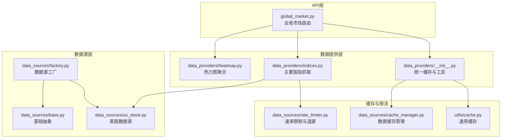
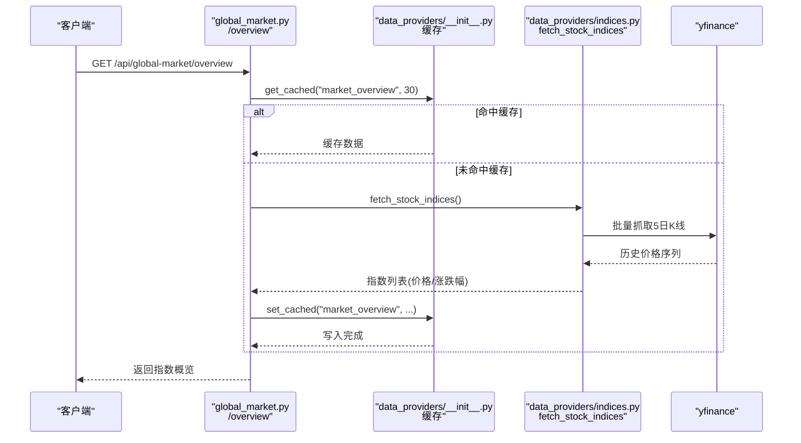
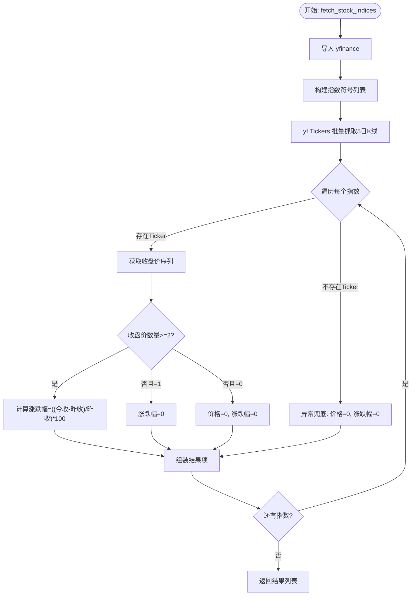
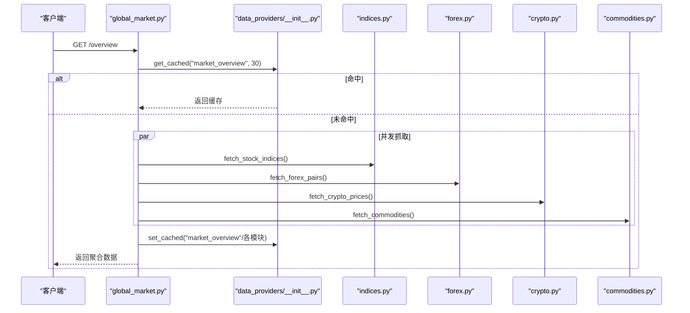
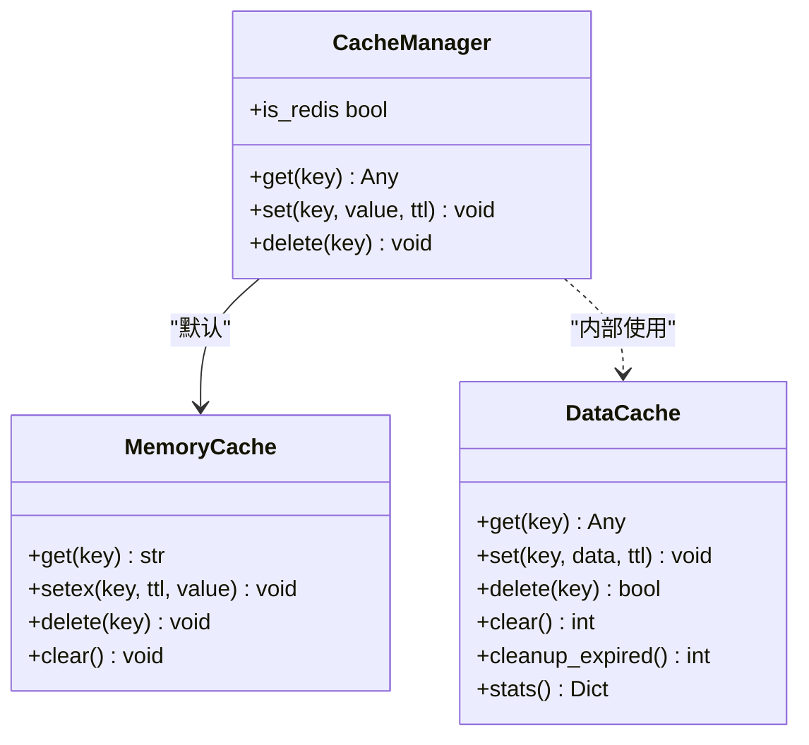
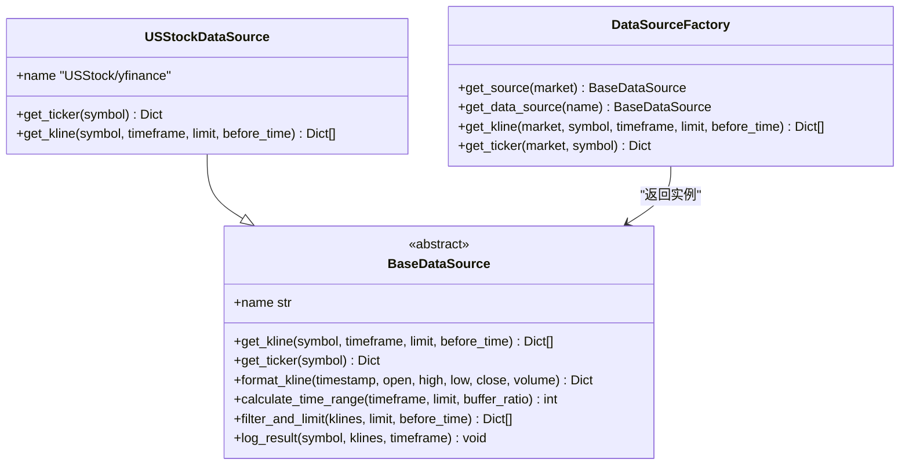
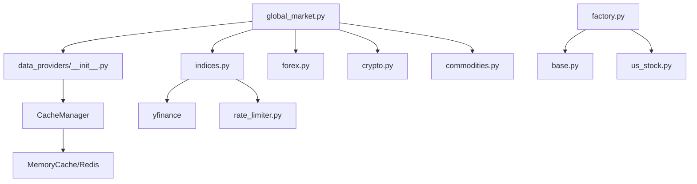

# 指数数据提供者

<cite>
**本文档引用的文件**
- [indices.py](file://backend_api_python/app/data_providers/indices.py)
- [global_market.py](file://backend_api_python/app/routes/global_market.py)
- [__init__.py](file://backend_api_python/app/data_providers/__init__.py)
- [cache.py](file://backend_api_python/app/utils/cache.py)
- [factory.py](file://backend_api_python/app/data_sources/factory.py)
- [base.py](file://backend_api_python/app/data_sources/base.py)
- [us_stock.py](file://backend_api_python/app/data_sources/us_stock.py)
- [rate_limiter.py](file://backend_api_python/app/data_sources/rate_limiter.py)
- [cache_manager.py](file://backend_api_python/app/data_sources/cache_manager.py)
- [market_data_collector.py](file://backend_api_python/app/services/market_data_collector.py)
- [heatmap.py](file://backend_api_python/app/data_providers/heatmap.py)
</cite>

## 目录
1. [简介](#简介)
2. [项目结构](#项目结构)
3. [核心组件](#核心组件)
4. [架构概览](#架构概览)
5. [详细组件分析](#详细组件分析)
6. [依赖分析](#依赖分析)
7. [性能考量](#性能考量)
8. [故障排查指南](#故障排查指南)
9. [结论](#结论)
10. [附录](#附录)

## 简介
本文件面向“指数数据提供者”的设计与实现，聚焦以下目标：
- 解释主要股指与经济指数的数据获取机制、计算方法与发布周期
- 说明全球主要指数的标识符、权重计算与成分股调整规则
- 提供指数分析工具与投资组合构建建议
- 结合现有代码库中的数据提供层、缓存层与API路由，给出可操作的实现路径与最佳实践

在当前代码库中，指数数据由独立的数据提供者负责，通过统一的缓存与路由层对外提供服务，并与K线数据源工厂、限流与缓存管理器协同工作。

## 项目结构
围绕指数数据的关键目录与文件如下：
- 数据提供层：app/data_providers/indices.py（主要股指抓取）、app/data_providers/__init__.py（统一缓存与工具）
- API路由层：app/routes/global_market.py（全局市场聚合接口，包含指数概览）
- 数据源层：app/data_sources/factory.py（数据源工厂）、app/data_sources/base.py（基础抽象）、app/data_sources/us_stock.py（美股数据源）
- 缓存与限流：app/utils/cache.py（通用缓存）、app/data_sources/cache_manager.py（数据缓存管理）、app/data_sources/rate_limiter.py（速率限制与指数退避）
- 辅助模块：app/services/market_data_collector.py（AI分析专用采集器）、app/data_providers/heatmap.py（热力图聚合）

**图表来源**
- [global_market.py:58-142](file://backend_api_python/app/routes/global_market.py#L58-L142)
- [indices.py:30-88](file://backend_api_python/app/data_providers/indices.py#L30-L88)
- [__init__.py:45-86](file://backend_api_python/app/data_providers/__init__.py#L45-L86)
- [cache.py:49-129](file://backend_api_python/app/utils/cache.py#L49-L129)
- [cache_manager.py:44-233](file://backend_api_python/app/data_sources/cache_manager.py#L44-L233)
- [rate_limiter.py:109-273](file://backend_api_python/app/data_sources/rate_limiter.py#L109-L273)
- [factory.py:13-134](file://backend_api_python/app/data_sources/factory.py#L13-L134)
- [base.py:27-171](file://backend_api_python/app/data_sources/base.py#L27-L171)
- [us_stock.py:17-318](file://backend_api_python/app/data_sources/us_stock.py#L17-L318)
- [heatmap.py:20-147](file://backend_api_python/app/data_providers/heatmap.py#L20-L147)

**章节来源**
- [global_market.py:58-142](file://backend_api_python/app/routes/global_market.py#L58-L142)
- [indices.py:11-88](file://backend_api_python/app/data_providers/indices.py#L11-L88)
- [__init__.py:23-86](file://backend_api_python/app/data_providers/__init__.py#L23-L86)
- [cache.py:49-129](file://backend_api_python/app/utils/cache.py#L49-L129)
- [cache_manager.py:44-233](file://backend_api_python/app/data_sources/cache_manager.py#L44-L233)
- [rate_limiter.py:109-273](file://backend_api_python/app/data_sources/rate_limiter.py#L109-L273)
- [factory.py:13-134](file://backend_api_python/app/data_sources/factory.py#L13-L134)
- [base.py:27-171](file://backend_api_python/app/data_sources/base.py#L27-L171)
- [us_stock.py:17-318](file://backend_api_python/app/data_sources/us_stock.py#L17-L318)
- [heatmap.py:20-147](file://backend_api_python/app/data_providers/heatmap.py#L20-L147)

## 核心组件
- 指数数据提供者（indices.py）
  - 定义全球主要股指清单（符号、中文/英文名称、地区、地理坐标、旗帜）
  - 使用yfinance批量抓取5日K线，计算当日收盘价与涨跌幅
  - 对缺失或异常数据进行兜底填充
- 统一缓存与工具（data_providers/__init__.py）
  - 提供统一的缓存读写接口与TTL配置
  - 通过CacheManager透明使用Redis或内存缓存
- 全局市场路由（routes/global_market.py）
  - 暴露指数概览接口，聚合指数、外汇、加密、商品等数据
  - 使用线程池并发抓取，缓存结果并返回
- 数据源工厂与基础抽象（data_sources/factory.py, base.py）
  - 工厂模式按市场类型返回具体数据源实例
  - 基类定义K线与实时报价接口、时间范围计算、过滤与日志
- 缓存与限流（utils/cache.py, data_sources/cache_manager.py, data_sources/rate_limiter.py）
  - 通用缓存支持Redis与内存双栈
  - 数据缓存管理器提供TTL、LRU与统计
  - 速率限制器提供随机抖动、指数退避与请求节流

**章节来源**
- [indices.py:11-88](file://backend_api_python/app/data_providers/indices.py#L11-L88)
- [__init__.py:45-86](file://backend_api_python/app/data_providers/__init__.py#L45-L86)
- [global_market.py:58-142](file://backend_api_python/app/routes/global_market.py#L58-L142)
- [factory.py:13-134](file://backend_api_python/app/data_sources/factory.py#L13-L134)
- [base.py:27-171](file://backend_api_python/app/data_sources/base.py#L27-L171)
- [cache.py:49-129](file://backend_api_python/app/utils/cache.py#L49-L129)
- [cache_manager.py:44-233](file://backend_api_python/app/data_sources/cache_manager.py#L44-L233)
- [rate_limiter.py:109-273](file://backend_api_python/app/data_sources/rate_limiter.py#L109-L273)

## 架构概览
指数数据提供流程从API路由触发，经过统一缓存层，调用指数数据提供者抓取yfinance数据，最终返回给前端。并发抓取与缓存策略确保低延迟与高可用。

**图表来源**
- [global_market.py:58-142](file://backend_api_python/app/routes/global_market.py#L58-L142)
- [__init__.py:45-86](file://backend_api_python/app/data_providers/__init__.py#L45-L86)
- [indices.py:30-88](file://backend_api_python/app/data_providers/indices.py#L30-L88)

## 详细组件分析

### 指数数据提供者（indices.py）
- 主要股指清单
  - 包含美国（标普500、道琼斯、纳斯达克）、欧洲（DAX、富时100、CAC40）、日本（日经225）、韩国（KOSPI）、澳洲（ASX200）、印度（SENSEX）等
  - 字段包括：符号、中文名、英文名、地区、旗帜emoji、经纬度、分类
- 数据抓取与计算
  - 使用yfinance.Tickers批量拉取历史数据（5日）
  - 从收盘价序列计算当前价格与涨跌幅（若仅有1日则涨跌幅为0）
  - 异常与缺失数据进行安全填充（价格/涨跌幅为0）
- 输出结构
  - 返回包含符号、名称、价格、涨跌幅、地区、地理信息与分类的列表

**图表来源**
- [indices.py:30-88](file://backend_api_python/app/data_providers/indices.py#L30-L88)

**章节来源**
- [indices.py:11-88](file://backend_api_python/app/data_providers/indices.py#L11-L88)

### 全局市场路由（global_market.py）
- 指数概览接口
  - 使用线程池并发抓取指数、外汇、加密、商品数据
  - 对各模块结果进行缓存（TTL=30秒），并聚合返回
- 缓存策略
  - 统一使用data_providers/__init__.py提供的缓存接口
  - 支持强制刷新（/refresh）清除缓存

**图表来源**
- [global_market.py:58-142](file://backend_api_python/app/routes/global_market.py#L58-L142)
- [__init__.py:45-86](file://backend_api_python/app/data_providers/__init__.py#L45-L86)

**章节来源**
- [global_market.py:58-142](file://backend_api_python/app/routes/global_market.py#L58-L142)
- [__init__.py:45-86](file://backend_api_python/app/data_providers/__init__.py#L45-L86)

### 缓存与工具（data_providers/__init__.py, utils/cache.py, data_sources/cache_manager.py）
- 统一缓存接口
  - get_cached/set_cached/clear_cache封装CacheManager
  - TTL按模块配置，默认60秒
- 通用缓存（utils/cache.py）
  - MemoryCache：内存缓存（默认）
  - Redis：当启用时自动连接并切换
- 数据缓存管理（data_sources/cache_manager.py）
  - DataCache：TTL、LRU、线程安全
  - 提供实时行情、K线、股票信息三类缓存实例

**图表来源**
- [cache.py:49-129](file://backend_api_python/app/utils/cache.py#L49-L129)
- [cache_manager.py:44-233](file://backend_api_python/app/data_sources/cache_manager.py#L44-L233)

**章节来源**
- [__init__.py:45-86](file://backend_api_python/app/data_providers/__init__.py#L45-L86)
- [cache.py:49-129](file://backend_api_python/app/utils/cache.py#L49-L129)
- [cache_manager.py:44-233](file://backend_api_python/app/data_sources/cache_manager.py#L44-L233)

### 数据源工厂与基础抽象（factory.py, base.py）
- 工厂模式
  - DataSourceFactory按市场类型返回具体数据源（USStock、Crypto、Forex、Futures等）
  - 提供便捷方法：get_kline、get_ticker
- 基类接口
  - BaseDataSource定义K线与实时报价接口、时间范围计算、过滤与日志
  - 提供K线格式化与时间范围估算

**图表来源**
- [base.py:27-171](file://backend_api_python/app/data_sources/base.py#L27-L171)
- [us_stock.py:17-318](file://backend_api_python/app/data_sources/us_stock.py#L17-L318)
- [factory.py:13-134](file://backend_api_python/app/data_sources/factory.py#L13-L134)

**章节来源**
- [factory.py:13-134](file://backend_api_python/app/data_sources/factory.py#L13-L134)
- [base.py:27-171](file://backend_api_python/app/data_sources/base.py#L27-L171)
- [us_stock.py:17-318](file://backend_api_python/app/data_sources/us_stock.py#L17-L318)

### 限流与稳定性（rate_limiter.py）
- 随机抖动与指数退避
  - RateLimiter：最小间隔、抖动范围控制
  - retry_with_backoff：指数退避重试，支持回调与日志
- 用户代理轮换
  - 随机UA提升反爬稳定性

**章节来源**
- [rate_limiter.py:109-273](file://backend_api_python/app/data_sources/rate_limiter.py#L109-L273)

### 指数分析工具与热力图（market_data_collector.py, heatmap.py）
- AI分析采集器（market_data_collector.py）
  - 为AI分析提供完整数据：价格/K线、技术指标、基本面、宏观、情绪、预测市场
  - 并行获取核心数据，本地计算技术指标（RSI、MACD、布林带、ATR等）
- 热力图聚合（heatmap.py）
  - 聚合加密、外汇、商品、指数等板块涨跌幅，支持ETF板块（如科技、金融等）

**章节来源**
- [market_data_collector.py:72-225](file://backend_api_python/app/services/market_data_collector.py#L72-L225)
- [heatmap.py:20-147](file://backend_api_python/app/data_providers/heatmap.py#L20-L147)

## 依赖分析
- 指数数据提供者依赖
  - yfinance：批量抓取历史K线
  - 日志：异常与兜底记录
- API路由依赖
  - data_providers/__init__.py：统一缓存
  - 多数据提供者：forex、crypto、commodities、indices
- 数据源层依赖
  - BaseDataSource：统一接口与工具
  - DataSourceFactory：按市场类型分发
- 缓存与限流
  - CacheManager：统一缓存
  - DataCache：指数退避与抖动策略

**图表来源**
- [indices.py:30-88](file://backend_api_python/app/data_providers/indices.py#L30-L88)
- [global_market.py:58-142](file://backend_api_python/app/routes/global_market.py#L58-L142)
- [__init__.py:45-86](file://backend_api_python/app/data_providers/__init__.py#L45-L86)
- [cache.py:49-129](file://backend_api_python/app/utils/cache.py#L49-L129)
- [rate_limiter.py:109-273](file://backend_api_python/app/data_sources/rate_limiter.py#L109-L273)
- [factory.py:13-134](file://backend_api_python/app/data_sources/factory.py#L13-L134)
- [base.py:27-171](file://backend_api_python/app/data_sources/base.py#L27-L171)
- [us_stock.py:17-318](file://backend_api_python/app/data_sources/us_stock.py#L17-L318)

**章节来源**
- [indices.py:30-88](file://backend_api_python/app/data_providers/indices.py#L30-L88)
- [global_market.py:58-142](file://backend_api_python/app/routes/global_market.py#L58-L142)
- [__init__.py:45-86](file://backend_api_python/app/data_providers/__init__.py#L45-L86)
- [cache.py:49-129](file://backend_api_python/app/utils/cache.py#L49-L129)
- [rate_limiter.py:109-273](file://backend_api_python/app/data_sources/rate_limiter.py#L109-L273)
- [factory.py:13-134](file://backend_api_python/app/data_sources/factory.py#L13-L134)
- [base.py:27-171](file://backend_api_python/app/data_sources/base.py#L27-L171)
- [us_stock.py:17-318](file://backend_api_python/app/data_sources/us_stock.py#L17-L318)

## 性能考量
- 并发抓取：global_market.py使用线程池并发抓取多类数据，缩短整体响应时间
- 缓存策略：指数概览缓存30秒，其他模块按需缓存，降低重复请求压力
- 数据源优化：USStockDataSource优先使用Finnhub（实时）与yfinance fast_info，降级策略保证可用性
- 限流与退避：指数退避与随机抖动降低被限流风险，提高成功率

[本节为通用性能讨论，无需特定文件分析]

## 故障排查指南
- 指数抓取失败
  - 检查yfinance可用性与网络连通
  - 查看indices.py中的异常日志与兜底逻辑
- 缓存问题
  - 使用/refresh端点清除缓存，确认CacheManager初始化（Redis或内存）
  - 检查TTL配置与缓存键命名
- 数据源异常
  - 确认DataSourceFactory正确返回目标市场数据源
  - 检查BaseDataSource接口实现与日志输出
- 限流与退避
  - 调整RateLimiter参数或指数退避策略
  - 关注日志中的重试与等待提示

**章节来源**
- [indices.py:69-87](file://backend_api_python/app/data_providers/indices.py#L69-L87)
- [global_market.py:546-587](file://backend_api_python/app/routes/global_market.py#L546-L587)
- [cache.py:78-98](file://backend_api_python/app/utils/cache.py#L78-L98)
- [factory.py:13-134](file://backend_api_python/app/data_sources/factory.py#L13-L134)
- [base.py:133-171](file://backend_api_python/app/data_sources/base.py#L133-L171)
- [rate_limiter.py:170-231](file://backend_api_python/app/data_sources/rate_limiter.py#L170-L231)

## 结论
本指数数据提供者通过统一的缓存与路由层，结合稳健的数据源工厂与限流策略，实现了对全球主要股指的高效抓取与展示。现有实现聚焦于价格与涨跌幅计算，便于进一步扩展权重与成分股调整规则，以满足更深入的指数分析与投资组合构建需求。

[本节为总结性内容，无需特定文件分析]

## 附录

### 指数标识符与区域对照
- 美国：^GSPC（标普500）、^DJI（道琼斯）、^IXIC（纳斯达克）
- 欧洲：^GDAXI（DAX）、^FTSE（富时100）、^FCHI（CAC40）
- 亚洲：^N225（日经225）、^KS11（KOSPI）、^AXJO（ASX200）、^BSESN（SENSEX）

**章节来源**
- [indices.py:11-22](file://backend_api_python/app/data_providers/indices.py#L11-L22)

### 计算方法与发布周期
- 计算方法
  - 当日价格：取最近一个有效收盘价
  - 涨跌幅：((当日收盘-昨日收盘)/昨日收盘)*100；仅1日数据时涨跌幅为0
- 发布周期
  - 指数概览接口缓存30秒，适合高频展示
  - K线数据按数据源策略获取，日线/分钟级分别适用不同时间窗口

**章节来源**
- [indices.py:46-55](file://backend_api_python/app/data_providers/indices.py#L46-L55)
- [global_market.py:92-136](file://backend_api_python/app/routes/global_market.py#L92-L136)

### 投资组合构建建议
- 指数分析工具
  - 利用AI分析采集器的技术指标（RSI、MACD、布林带、ATR）辅助择时
  - 通过热力图观察板块轮动与跨市场联动
- 权重与成分股
  - 建议引入市值权重与流动性权重，定期（如季度）调整
  - 关注成分股调整公告，结合事件驱动策略进行动态再平衡

**章节来源**
- [market_data_collector.py:299-510](file://backend_api_python/app/services/market_data_collector.py#L299-L510)
- [heatmap.py:94-129](file://backend_api_python/app/data_providers/heatmap.py#L94-L129)