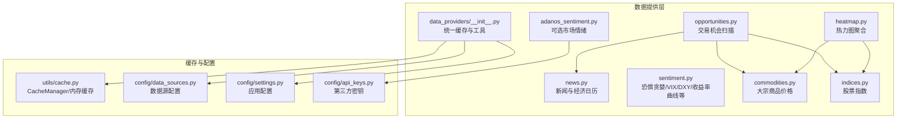
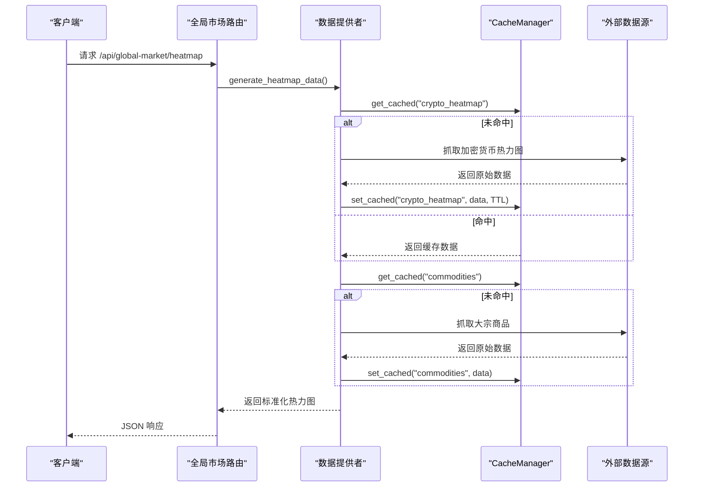
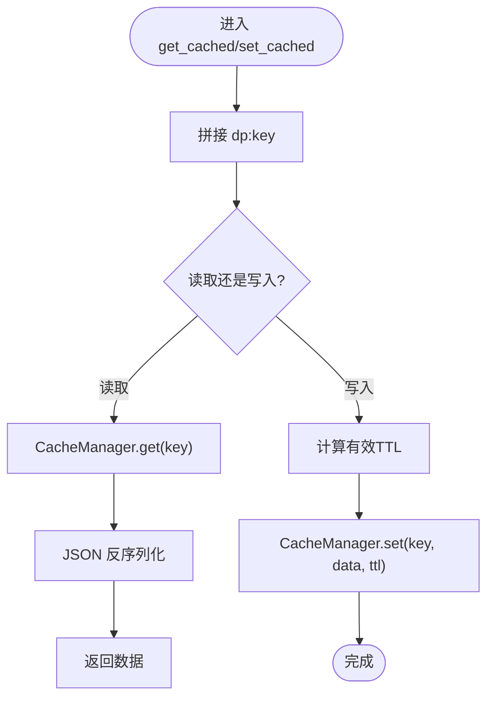
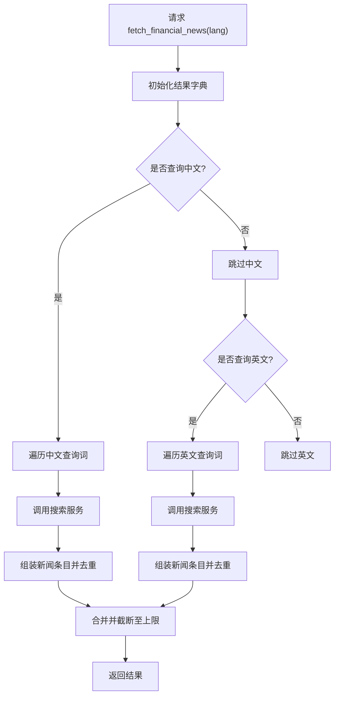
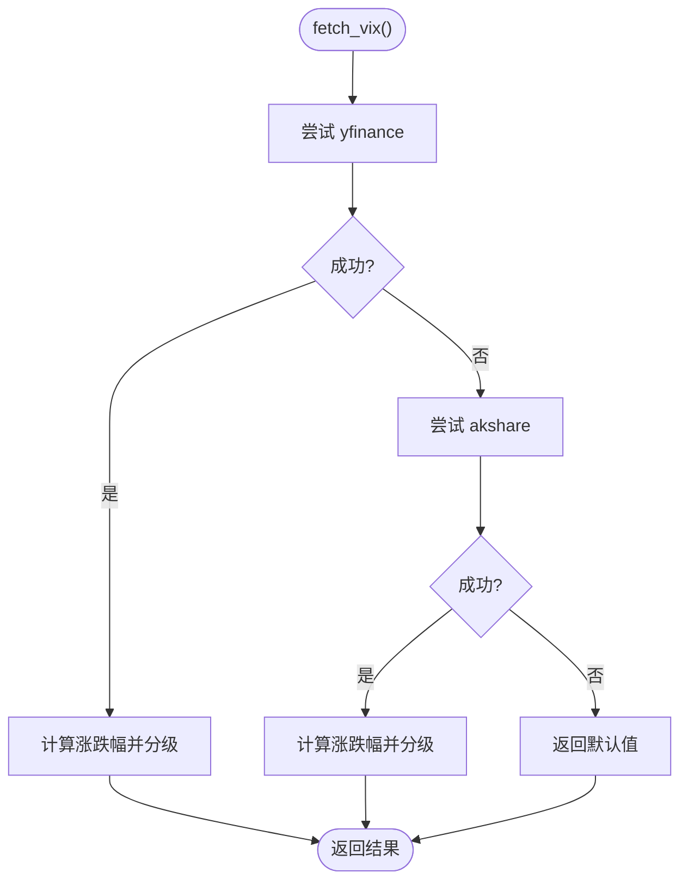
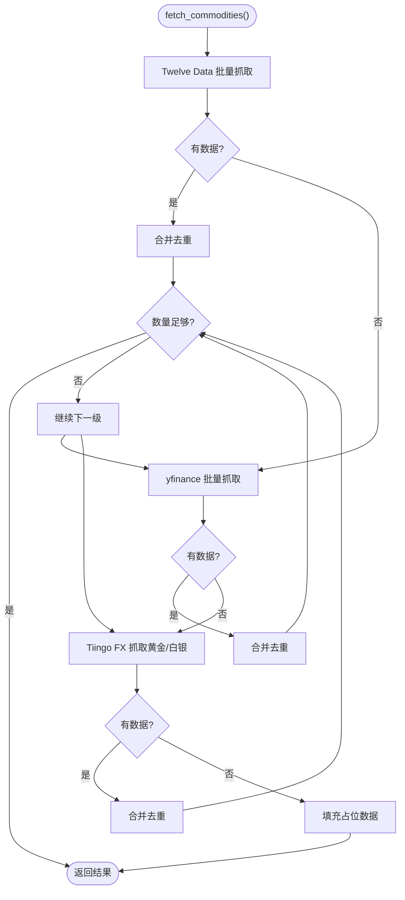
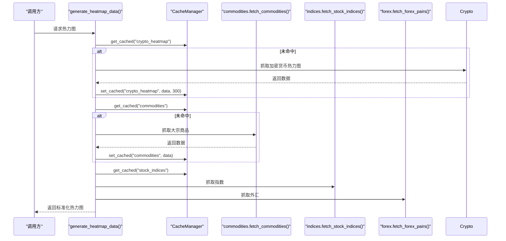
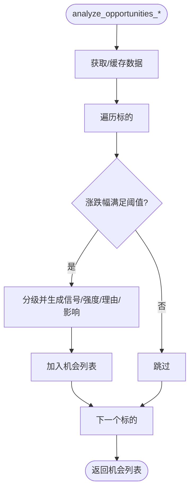
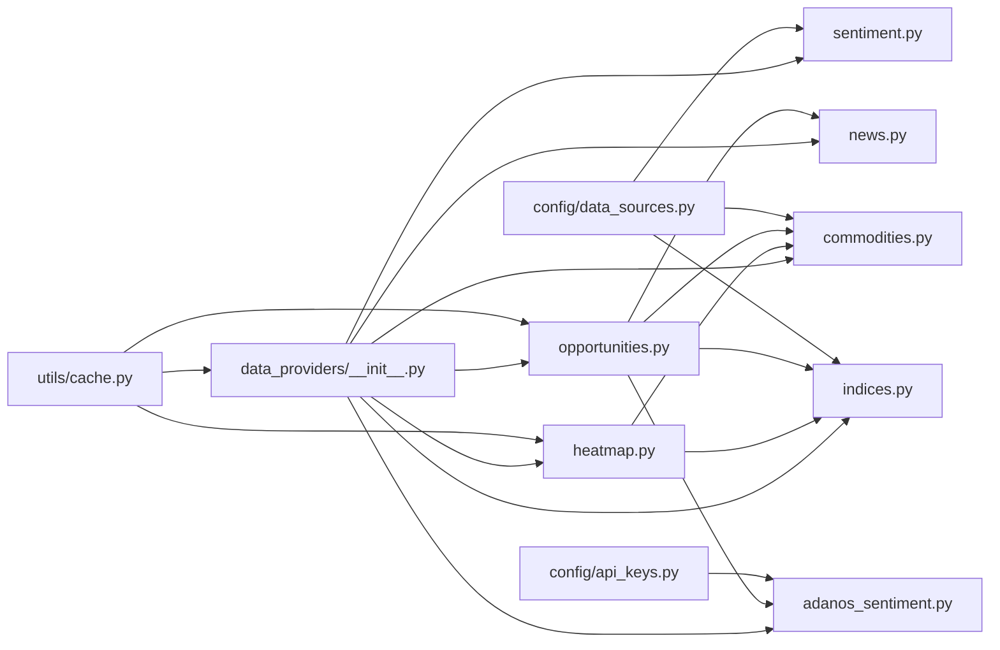

# 数据提供服务

<cite>
**本文引用的文件**
- [app/data_providers/__init__.py](file://backend_api_python/app/data_providers/__init__.py)
- [app/data_providers/news.py](file://backend_api_python/app/data_providers/news.py)
- [app/data_providers/sentiment.py](file://backend_api_python/app/data_providers/sentiment.py)
- [app/data_providers/commodities.py](file://backend_api_python/app/data_providers/commodities.py)
- [app/data_providers/indices.py](file://backend_api_python/app/data_providers/indices.py)
- [app/data_providers/heatmap.py](file://backend_api_python/app/data_providers/heatmap.py)
- [app/data_providers/opportunities.py](file://backend_api_python/app/data_providers/opportunities.py)
- [app/data_providers/adanos_sentiment.py](file://backend_api_python/app/data_providers/adanos_sentiment.py)
- [app/utils/cache.py](file://backend_api_python/app/utils/cache.py)
- [app/config/data_sources.py](file://backend_api_python/app/config/data_sources.py)
- [app/config/settings.py](file://backend_api_python/app/config/settings.py)
- [app/config/api_keys.py](file://backend_api_python/app/config/api_keys.py)
- [app/routes/global_market.py](file://backend_api_python/app/routes/global_market.py)
</cite>

## 目录
1. [简介](#简介)
2. [项目结构](#项目结构)
3. [核心组件](#核心组件)
4. [架构总览](#架构总览)
5. [详细组件分析](#详细组件分析)
6. [依赖分析](#依赖分析)
7. [性能考虑](#性能考虑)
8. [故障排查指南](#故障排查指南)
9. [结论](#结论)
10. [附录：API 接口规范与配置](#附录api-接口规范与配置)

## 简介
本文件系统化梳理后端“数据提供服务”的设计与实现，覆盖以下主题：
- 各数据提供者的功能定位与数据来源
- 数据获取策略（多源回退、批量抓取）
- 缓存机制（本地内存与 Redis 双栈）
- 数据格式标准化与统一输出
- API 接口规范、配置项与使用示例

目标是帮助开发者快速理解与扩展数据层能力，同时为前端与上层服务提供一致、可靠的数据契约。

## 项目结构
数据提供服务位于后端 Python 工程的 app/data_providers 目录，采用“按领域分模块 + 统一缓存工具”的组织方式：
- 统一入口与缓存：data_providers/__init__.py 提供缓存键前缀、TTL 映射、安全转换等通用能力
- 领域子模块：news、sentiment、commodities、indices、heatmap、opportunities、adanos_sentiment 等
- 缓存实现：utils/cache.py 提供本地内存与 Redis 的透明缓存管理器
- 配置体系：config/settings.py、config/api_keys.py、config/data_sources.py 提供运行时配置与第三方密钥管理

图表来源
- [app/data_providers/__init__.py:1-86](file://backend_api_python/app/data_providers/__init__.py#L1-L86)
- [app/data_providers/heatmap.py:1-147](file://backend_api_python/app/data_providers/heatmap.py#L1-L147)
- [app/data_providers/opportunities.py:1-360](file://backend_api_python/app/data_providers/opportunities.py#L1-L360)
- [app/utils/cache.py:1-129](file://backend_api_python/app/utils/cache.py#L1-L129)
- [app/config/data_sources.py:1-171](file://backend_api_python/app/config/data_sources.py#L1-L171)
- [app/config/settings.py:1-99](file://backend_api_python/app/config/settings.py#L1-L99)
- [app/config/api_keys.py:1-164](file://backend_api_python/app/config/api_keys.py#L1-L164)

章节来源
- [app/data_providers/__init__.py:1-86](file://backend_api_python/app/data_providers/__init__.py#L1-L86)
- [app/utils/cache.py:1-129](file://backend_api_python/app/utils/cache.py#L1-L129)
- [app/config/data_sources.py:1-171](file://backend_api_python/app/config/data_sources.py#L1-L171)
- [app/config/settings.py:1-99](file://backend_api_python/app/config/settings.py#L1-L99)
- [app/config/api_keys.py:1-164](file://backend_api_python/app/config/api_keys.py#L1-L164)

## 核心组件
- 统一缓存与工具
  - 缓存键命名空间：dp: 前缀隔离业务缓存
  - TTL 映射：针对不同数据域设定默认过期时间
  - 安全数值转换：safe_float 提升解析健壮性
  - 清理接口：clear_cache 支持 Redis 与内存两种清理路径
- CacheManager
  - 本地优先：默认使用线程安全内存缓存
  - Redis 可选：通过配置启用，自动 ping 校验连通性
  - 序列化：统一 JSON 序列化/反序列化
- 领域提供者
  - 新闻与日历：聚合搜索结果并去重，生成经济事件模板
  - 情绪指标：Fear & Greed、VIX、DXY、收益率曲线、VXN、GVZ、Put/Call Proxy
  - 商品：黄金/白银/原油/铜/天然气，多源回退（Twelve Data/yfinance/Tiingo）
  - 指数：主要全球股指，批量抓取并计算涨跌幅
  - 热力图：聚合加密货币、外汇、商品、指数与板块ETF
  - 机会扫描：跨市场（加密、美股、港股/美股）趋势识别
  - 可选情绪：Adanos 第三方情绪数据（需密钥）

章节来源
- [app/data_providers/__init__.py:23-86](file://backend_api_python/app/data_providers/__init__.py#L23-L86)
- [app/utils/cache.py:49-129](file://backend_api_python/app/utils/cache.py#L49-L129)
- [app/data_providers/news.py:13-150](file://backend_api_python/app/data_providers/news.py#L13-L150)
- [app/data_providers/sentiment.py:12-377](file://backend_api_python/app/data_providers/sentiment.py#L12-L377)
- [app/data_providers/commodities.py:13-181](file://backend_api_python/app/data_providers/commodities.py#L13-L181)
- [app/data_providers/indices.py:11-88](file://backend_api_python/app/data_providers/indices.py#L11-L88)
- [app/data_providers/heatmap.py:20-147](file://backend_api_python/app/data_providers/heatmap.py#L20-L147)
- [app/data_providers/opportunities.py:19-360](file://backend_api_python/app/data_providers/opportunities.py#L19-L360)
- [app/data_providers/adanos_sentiment.py:135-205](file://backend_api_python/app/data_providers/adanos_sentiment.py#L135-L205)

## 架构总览
数据提供服务遵循“领域模块 + 统一缓存 + 多源回退”的设计模式：
- 领域模块负责具体数据域的抓取与清洗
- 统一缓存层屏蔽底层存储细节，提供透明读写
- 多源回退提升可用性：当上游数据源失败时，自动切换到备用源
- 输出标准化：所有提供者返回统一字段集合，便于上层聚合

图表来源
- [app/data_providers/heatmap.py:20-92](file://backend_api_python/app/data_providers/heatmap.py#L20-L92)
- [app/utils/cache.py:100-117](file://backend_api_python/app/utils/cache.py#L100-L117)
- [app/routes/global_market.py:3-14](file://backend_api_python/app/routes/global_market.py#L3-L14)

## 详细组件分析

### 统一缓存与工具（data_providers/__init__.py）
- 缓存键命名：统一以 dp: 前缀，避免与业务其他键冲突
- TTL 映射：针对不同数据域设置合理过期时间，兼顾实时性与成本
- 安全转换：safe_float 将异常值转为默认值，降低下游处理复杂度
- 清理策略：clear_cache 支持 Redis 扫描删除与内存字典清空

图表来源
- [app/data_providers/__init__.py:45-58](file://backend_api_python/app/data_providers/__init__.py#L45-L58)
- [app/utils/cache.py:100-117](file://backend_api_python/app/utils/cache.py#L100-L117)

章节来源
- [app/data_providers/__init__.py:23-86](file://backend_api_python/app/data_providers/__init__.py#L23-L86)
- [app/utils/cache.py:49-129](file://backend_api_python/app/utils/cache.py#L49-L129)

### 新闻与经济日历（news.py）
- 新闻抓取：基于搜索服务，按语言分组查询并去重，限制每语言上限
- 经济日历：模板化生成事件，包含重要性、影响方向与描述；根据当前时间动态标记已发布/预期影响

图表来源
- [app/data_providers/news.py:13-70](file://backend_api_python/app/data_providers/news.py#L13-L70)

章节来源
- [app/data_providers/news.py:13-150](file://backend_api_python/app/data_providers/news.py#L13-L150)

### 市场情绪（sentiment.py）
- Fear & Greed：从替代数据源获取，失败时返回默认值
- VIX：优先 yfinance，失败回退 akshare；计算涨跌幅并分级
- DXY：优先 yfinance，失败回退 akshare；分级解读美元强弱
- 收益率曲线：TNX 历史计算 10Y-2Y 利差与斜率变化，分级判断经济前景
- VXN/GVZ：个股/黄金波动率指数，分级解读市场情绪
- Put/Call Proxy：基于 VIX 期限结构比值判断恐慌/自满状态

图表来源
- [app/data_providers/sentiment.py:45-112](file://backend_api_python/app/data_providers/sentiment.py#L45-L112)

章节来源
- [app/data_providers/sentiment.py:12-377](file://backend_api_python/app/data_providers/sentiment.py#L12-L377)

### 大宗商品（commodities.py）
- 数据域：黄金、白银、原油（WTI/Brent）、铜、天然气
- 获取策略：Twelve Data → yfinance → Tiingo（FX 黄金/白银），逐级回退
- 输出标准化：统一字段（符号、名称、价格、涨跌幅、单位、类别）

图表来源
- [app/data_providers/commodities.py:155-181](file://backend_api_python/app/data_providers/commodities.py#L155-L181)

章节来源
- [app/data_providers/commodities.py:13-181](file://backend_api_python/app/data_providers/commodities.py#L13-L181)

### 股票指数（indices.py）
- 数据域：主要全球股指（标普、道琼斯、纳指、DAX、富时100、CAC40、日经225、KOSPI、ASX200、SENSEX）
- 获取策略：yfinance 批量抓取，计算涨跌幅
- 输出标准化：统一字段（符号、名称、价格、涨跌幅、地区、经纬度、类别）

章节来源
- [app/data_providers/indices.py:30-88](file://backend_api_python/app/data_providers/indices.py#L30-L88)

### 热力图聚合（heatmap.py）
- 聚合维度：加密货币、外汇、大宗商品、指数、板块ETF
- 缓存策略：优先读取缓存，未命中则抓取并写入；对加密货币按市值排序取前25
- 输出结构：按域划分数组，统一字段（名称、数值、价格、单位等）

图表来源
- [app/data_providers/heatmap.py:20-147](file://backend_api_python/app/data_providers/heatmap.py#L20-L147)

章节来源
- [app/data_providers/heatmap.py:20-147](file://backend_api_python/app/data_providers/heatmap.py#L20-L147)

### 交易机会扫描（opportunities.py）
- 跨市场扫描：加密、美股、港股/美股、外汇、预测市场
- 评分规则：基于涨跌幅阈值与强度分级，输出信号、影响方向与理由
- 缓存策略：对常用数据域设置缓存，减少重复抓取
- 输出结构：统一字段（符号、名称、价格、涨跌幅、信号、强度、影响、市场、时间戳）

图表来源
- [app/data_providers/opportunities.py:178-216](file://backend_api_python/app/data_providers/opportunities.py#L178-L216)
- [app/data_providers/opportunities.py:218-277](file://backend_api_python/app/data_providers/opportunities.py#L218-L277)
- [app/data_providers/opportunities.py:279-319](file://backend_api_python/app/data_providers/opportunities.py#L279-L319)

章节来源
- [app/data_providers/opportunities.py:19-360](file://backend_api_python/app/data_providers/opportunities.py#L19-L360)

### 可选市场情绪（adanos_sentiment.py）
- 输入：支持逗号分隔或可迭代的股票代码，自动清洗与校验
- 来源：支持 Reddit/X/News/Polymarket 等来源
- 输出：标准化记录（代码、公司名、来源、情绪分数、提及数、趋势历史等）
- 错误策略：无密钥时 fail-open，返回 disabled 结果，不影响系统运行

章节来源
- [app/data_providers/adanos_sentiment.py:135-205](file://backend_api_python/app/data_providers/adanos_sentiment.py#L135-L205)

## 依赖分析
- 组件耦合
  - data_providers/__init__.py 作为统一入口，被各领域模块广泛依赖
  - heatmap 依赖 commodities、indices、forex 等模块；opportunities 依赖多个模块进行跨市场扫描
  - utils/cache.py 作为基础设施被所有提供者共享
- 外部依赖
  - yfinance、requests、akshare、tiingo、redis 等
- 配置依赖
  - APIKeys 提供第三方密钥注入
  - data_sources.py 提供数据源超时、重试、限流等参数
  - settings.py 提供应用级开关（如缓存开关）

图表来源
- [app/data_providers/__init__.py:1-86](file://backend_api_python/app/data_providers/__init__.py#L1-L86)
- [app/data_providers/heatmap.py:1-147](file://backend_api_python/app/data_providers/heatmap.py#L1-L147)
- [app/data_providers/opportunities.py:1-360](file://backend_api_python/app/data_providers/opportunities.py#L1-L360)
- [app/utils/cache.py:1-129](file://backend_api_python/app/utils/cache.py#L1-L129)
- [app/config/api_keys.py:1-164](file://backend_api_python/app/config/api_keys.py#L1-L164)
- [app/config/data_sources.py:1-171](file://backend_api_python/app/config/data_sources.py#L1-L171)

章节来源
- [app/data_providers/__init__.py:1-86](file://backend_api_python/app/data_providers/__init__.py#L1-L86)
- [app/utils/cache.py:1-129](file://backend_api_python/app/utils/cache.py#L1-L129)
- [app/config/api_keys.py:1-164](file://backend_api_python/app/config/api_keys.py#L1-L164)
- [app/config/data_sources.py:1-171](file://backend_api_python/app/config/data_sources.py#L1-L171)

## 性能考虑
- 缓存优先：热点数据（如加密货币热力图、商品、指数、机会扫描）均设置缓存，显著降低外部依赖压力
- 多源回退：在上游失败时自动切换，提升可用性与稳定性
- 批量抓取：yfinance 支持批量 ticker，减少网络往返
- TTL 设计：根据数据时效性设置不同过期时间，平衡新鲜度与成本
- Redis 可选：在生产环境启用 Redis，可实现多实例共享缓存

## 故障排查指南
- 缓存问题
  - 现象：数据长时间不变
  - 排查：确认缓存开关与 TTL 设置；必要时调用清理接口
  - 参考：clear_cache、CACHE_TTL
- 第三方 API 失败
  - 现象：情绪/商品/指数等抓取为空或报错
  - 排查：检查对应 API 密钥与配额；查看回退链路是否生效
  - 参考：APIKeys、data_sources 配置
- Redis 连接失败
  - 现象：启动日志提示 Redis 不可用，回落内存缓存
  - 排查：核对 Redis 地址、端口、密码与超时配置
  - 参考：CacheManager 初始化逻辑
- 数据格式异常
  - 现象：字段缺失或类型错误
  - 排查：使用 safe_float 等工具函数；检查上游返回结构变化
  - 参考：safe_float、标准化输出字段

章节来源
- [app/data_providers/__init__.py:61-86](file://backend_api_python/app/data_providers/__init__.py#L61-L86)
- [app/utils/cache.py:77-98](file://backend_api_python/app/utils/cache.py#L77-L98)
- [app/config/api_keys.py:148-164](file://backend_api_python/app/config/api_keys.py#L148-L164)
- [app/config/data_sources.py:26-171](file://backend_api_python/app/config/data_sources.py#L26-L171)

## 结论
数据提供服务通过“统一入口 + 多源回退 + 统一缓存 + 标准化输出”的架构，实现了对新闻、情绪、大宗商品、指数、热力图与交易机会等多维数据的高效供给。该设计在保证稳定性的同时，兼顾了扩展性与可维护性，适合在多租户与高并发场景下部署。

## 附录：API 接口规范与配置

### API 接口规范（基于现有路由）
- 获取全球市场概览
  - 方法：GET
  - 路径：/api/global-market/overview
  - 说明：返回市场概览数据（由上层聚合提供）
- 获取市场热力图
  - 方法：GET
  - 路径：/api/global-market/heatmap
  - 说明：返回加密货币、外汇、商品、指数与板块ETF的涨跌幅热力图
- 刷新缓存
  - 方法：POST
  - 路径：/refresh
  - 说明：清空缓存（dp:* 或内存字典），触发重新抓取

章节来源
- [app/routes/global_market.py:3-14](file://backend_api_python/app/routes/global_market.py#L3-L14)

### 配置选项
- 应用配置（settings.py）
  - 主机与端口、调试模式、版本信息
  - 日志级别、日志轮转参数
  - 全局速率限制、缓存开关、请求日志开关
- 数据源配置（data_sources.py）
  - 通用超时、重试次数、退避系数
  - Finnhub、Tiingo、YFinance、CCXT、Akshare 等配置项
- API 密钥（api_keys.py）
  - 第三方服务密钥：Finnhub、Coinglass、CryptoQuant、Tiingo、Twelve Data、Alpha Vantage、Adanos、OpenAI/Gemini/DeepSeek/Grok/OpenRouter 等
  - 支持环境变量与附加配置文件两种注入方式

章节来源
- [app/config/settings.py:10-99](file://backend_api_python/app/config/settings.py#L10-L99)
- [app/config/data_sources.py:26-171](file://backend_api_python/app/config/data_sources.py#L26-L171)
- [app/config/api_keys.py:148-164](file://backend_api_python/app/config/api_keys.py#L148-L164)

### 使用示例（概念性说明）
- 获取热力图
  - 调用 /api/global-market/heatmap，后端会按需抓取并缓存加密货币、商品、指数与外汇数据，返回统一结构
- 扫描交易机会
  - 在业务侧调用机会扫描函数，传入标的池与阈值，得到带信号与强度的列表
- 配置密钥
  - 在环境变量中设置所需密钥（如 TWELVE_DATA_API_KEY、ADANOS_API_KEY 等），重启服务后生效

[本节为概念性说明，不直接分析具体文件]