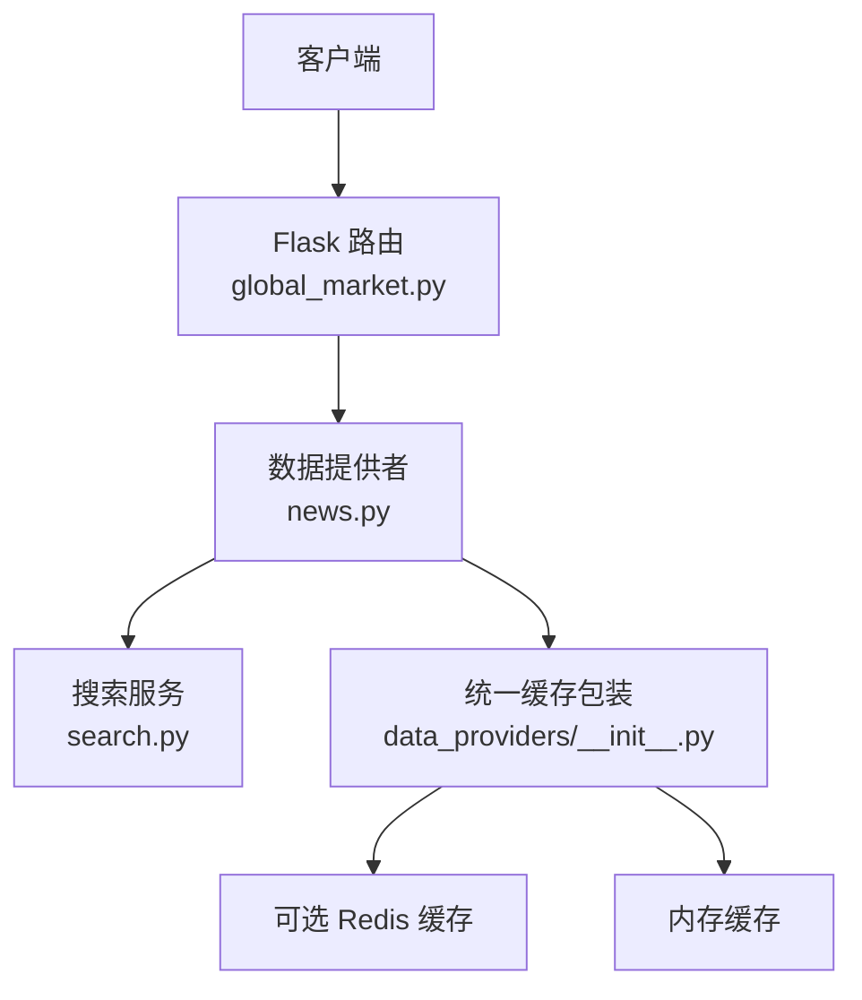
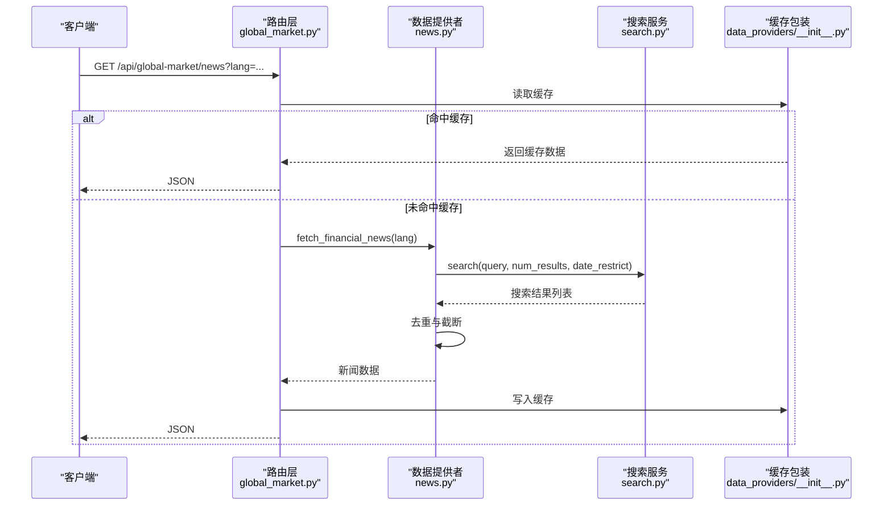
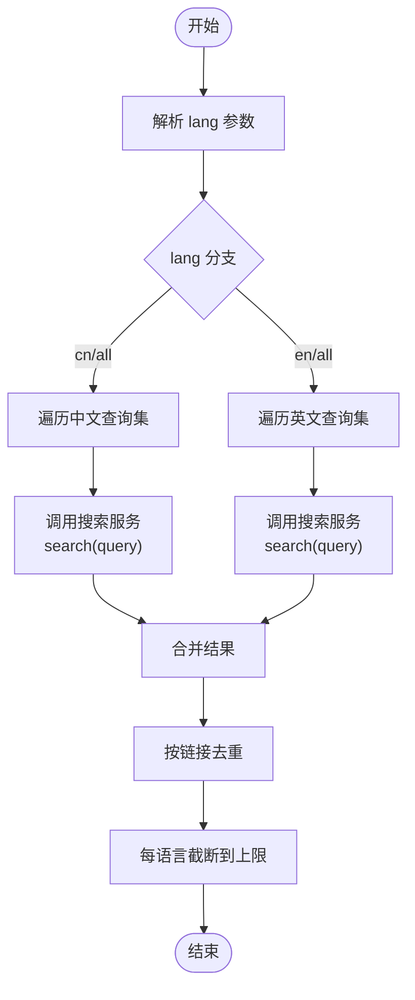
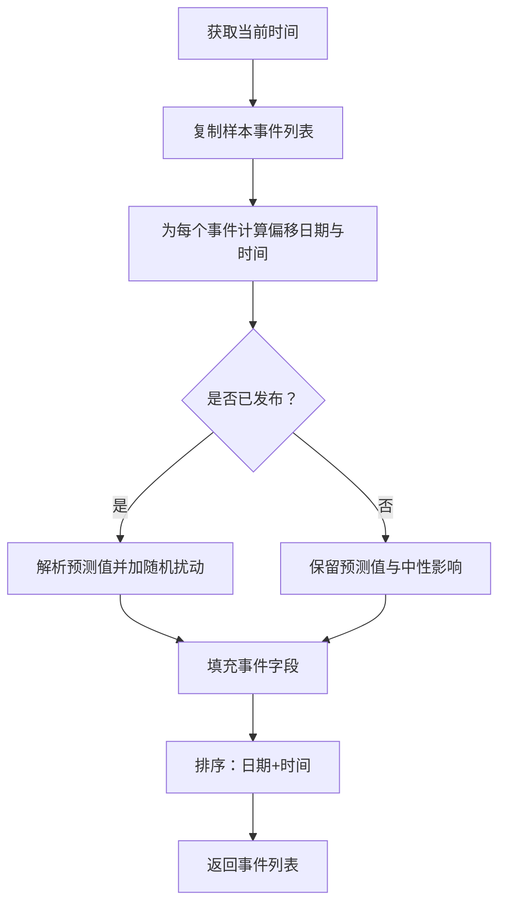
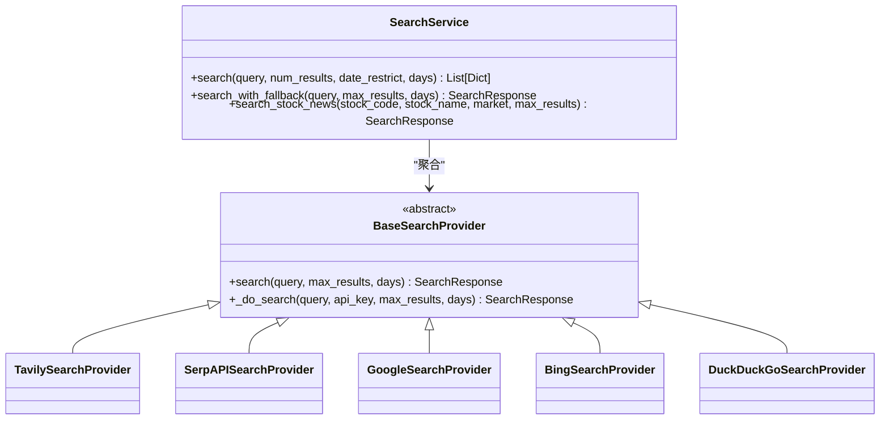
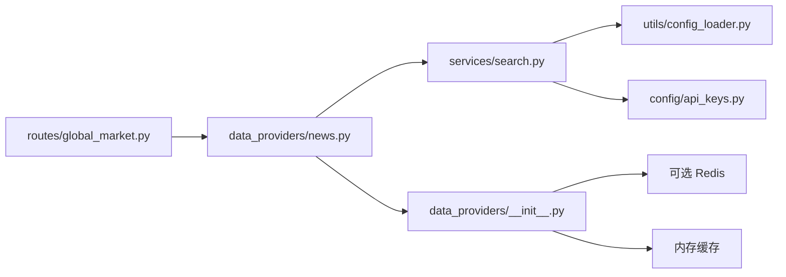

# 新闻数据提供者

<cite>
**本文引用的文件**
- [news.py](file://backend_api_python/app/data_providers/news.py)
- [search.py](file://backend_api_python/app/services/search.py)
- [global_market.py](file://backend_api_python/app/routes/global_market.py)
- [__init__.py](file://backend_api_python/app/data_providers/__init__.py)
- [cache_manager.py](file://backend_api_python/app/data_sources/cache_manager.py)
- [api_keys.py](file://backend_api_python/app/config/api_keys.py)
- [data_sources.py](file://backend_api_python/app/config/data_sources.py)
- [config_loader.py](file://backend_api_python/app/utils/config_loader.py)
- [env.example](file://backend_api_python/env.example)
- [test_data_providers.py](file://backend_api_python/tests/test_data_providers.py)
</cite>

## 目录
1. [简介](#简介)
2. [项目结构](#项目结构)
3. [核心组件](#核心组件)
4. [架构总览](#架构总览)
5. [详细组件分析](#详细组件分析)
6. [依赖关系分析](#依赖关系分析)
7. [性能考量](#性能考量)
8. [故障排查指南](#故障排查指南)
9. [结论](#结论)
10. [附录](#附录)

## 简介
本文档面向“新闻数据提供者”的使用者与维护者，系统阐述金融新闻与经济日历的数据获取机制、数据源整合策略、API 接口规范、分类/过滤/排序逻辑，以及在多来源新闻内容下的处理方式。同时提供配置选项、使用示例与性能优化建议，帮助读者快速理解并高效集成该能力。

## 项目结构
新闻数据提供者位于后端 Python 服务中，采用“路由层 → 数据提供者层 → 搜索服务层”的分层设计：
- 路由层负责对外暴露 REST API，并进行鉴权与缓存控制
- 数据提供者层封装具体业务逻辑（金融新闻抓取、经济日历生成）
- 搜索服务层整合多搜索引擎（Tavily、SerpAPI、Google CSE、Bing、DuckDuckGo），实现高可用与故障转移

图表来源
- [global_market.py:192-246](file://backend_api_python/app/routes/global_market.py#L192-L246)
- [news.py:13-70](file://backend_api_python/app/data_providers/news.py#L13-L70)
- [search.py:716-839](file://backend_api_python/app/services/search.py#L716-L839)
- [__init__.py:45-58](file://backend_api_python/app/data_providers/__init__.py#L45-L58)

章节来源
- [global_market.py:192-246](file://backend_api_python/app/routes/global_market.py#L192-L246)
- [news.py:13-70](file://backend_api_python/app/data_providers/news.py#L13-L70)
- [search.py:716-839](file://backend_api_python/app/services/search.py#L716-L839)
- [__init__.py:23-34](file://backend_api_python/app/data_providers/__init__.py#L23-L34)

## 核心组件
- 金融新闻抓取函数：按语言维度（中文/英文/全部）检索并去重，返回统一结构的新闻列表
- 经济日历生成函数：基于模板生成事件，结合当前时间计算发布状态与影响方向
- 搜索服务：多引擎聚合、API Key 轮换、故障转移、超时与配额处理
- 路由接口：/api/global-market/news 提供新闻数据，支持 lang 查询参数
- 统一缓存：基于 CacheManager 的 TTL 与命中统计，支持 Redis 或内存回退

章节来源
- [news.py:13-70](file://backend_api_python/app/data_providers/news.py#L13-L70)
- [news.py:90-149](file://backend_api_python/app/data_providers/news.py#L90-L149)
- [search.py:716-839](file://backend_api_python/app/services/search.py#L716-L839)
- [global_market.py:192-246](file://backend_api_python/app/routes/global_market.py#L192-L246)
- [__init__.py:45-58](file://backend_api_python/app/data_providers/__init__.py#L45-L58)

## 架构总览
新闻数据提供者整体流程如下：
- 客户端请求 /api/global-market/news?lang=...
- 路由层鉴权并读取缓存
- 数据提供者层调用搜索服务，按语言分别执行多组查询
- 搜索服务按优先级尝试各搜索引擎，自动故障转移
- 返回结果经去重与截断，写入缓存并返回

图表来源
- [global_market.py:192-246](file://backend_api_python/app/routes/global_market.py#L192-L246)
- [news.py:13-70](file://backend_api_python/app/data_providers/news.py#L13-L70)
- [search.py:780-805](file://backend_api_python/app/services/search.py#L780-L805)
- [__init__.py:45-58](file://backend_api_python/app/data_providers/__init__.py#L45-L58)

## 详细组件分析

### 金融新闻抓取（fetch_financial_news）
- 输入参数：lang（"cn"|"en"|"all"）
- 查询策略：
  - 中文查询集与英文查询集分别执行
  - 每个查询调用搜索服务，限制结果数量与时间窗口
- 结果处理：
  - 统一字段：标题、链接、摘要、来源、发布时间、分类、语言
  - 去重：以链接为键，避免重复
  - 截断：每种语言保留前 N 条
- 异常处理：内部异常被捕获并记录，不影响其他语言分支

图表来源
- [news.py:13-70](file://backend_api_python/app/data_providers/news.py#L13-L70)

章节来源
- [news.py:13-70](file://backend_api_python/app/data_providers/news.py#L13-L70)

### 经济日历生成（get_economic_calendar）
- 数据来源：内置样本事件集合
- 时间安排：以当前时间为基准，按固定间隔分配日期与时间
- 发布状态：根据当前时间判断事件是否已发布
- 影响模拟：对数值型指标加入随机扰动，生成实际值与影响方向
- 排序：按日期与时间排序输出

图表来源
- [news.py:90-149](file://backend_api_python/app/data_providers/news.py#L90-L149)

章节来源
- [news.py:90-149](file://backend_api_python/app/data_providers/news.py#L90-L149)

### 搜索服务（SearchService）
- 多引擎聚合：Tavily → SerpAPI → Google CSE → Bing → DuckDuckGo
- API Key 轮换：循环使用，错误过多的 Key 会被暂时跳过
- 故障转移：任一引擎成功即返回，否则记录错误并尝试下一个
- 配置来源：通过配置加载器读取环境变量与 .env
- 输出格式：统一为列表字典，包含标题、链接、摘要、来源、发布时间等

图表来源
- [search.py:716-839](file://backend_api_python/app/services/search.py#L716-L839)
- [search.py:88-210](file://backend_api_python/app/services/search.py#L88-L210)
- [search.py:211-331](file://backend_api_python/app/services/search.py#L211-L331)
- [search.py:333-467](file://backend_api_python/app/services/search.py#L333-L467)
- [search.py:469-550](file://backend_api_python/app/services/search.py#L469-L550)
- [search.py:552-599](file://backend_api_python/app/services/search.py#L552-L599)
- [search.py:602-714](file://backend_api_python/app/services/search.py#L602-L714)

章节来源
- [search.py:716-839](file://backend_api_python/app/services/search.py#L716-L839)
- [search.py:88-210](file://backend_api_python/app/services/search.py#L88-L210)

### 路由接口（/api/global-market/news）
- 方法与路径：GET /api/global-market/news
- 查询参数：lang（可选，"cn"|"en"|"all"，默认"all"）
- 缓存策略：按 lang 维度缓存，TTL 通常为 3 分钟
- 鉴权：需要登录态（Bearer Token）

章节来源
- [global_market.py:192-246](file://backend_api_python/app/routes/global_market.py#L192-L246)

### 统一缓存包装（data_providers/__init__.py）
- 缓存键命名：dp: 前缀 + key
- TTL 映射：针对新闻与日历设置专用 TTL
- 后端选择：优先 Redis，否则使用内存字典
- 清理：支持按前缀批量清理

章节来源
- [__init__.py:23-34](file://backend_api_python/app/data_providers/__init__.py#L23-L34)
- [__init__.py:45-58](file://backend_api_python/app/data_providers/__init__.py#L45-L58)
- [__init__.py:61-78](file://backend_api_python/app/data_providers/__init__.py#L61-L78)

## 依赖关系分析
- 数据提供者依赖搜索服务进行新闻检索
- 路由层依赖数据提供者与统一缓存包装
- 搜索服务依赖配置加载器与 API Key 配置
- 缓存层可选 Redis，也可回退至内存

图表来源
- [global_market.py:192-246](file://backend_api_python/app/routes/global_market.py#L192-L246)
- [news.py:13-70](file://backend_api_python/app/data_providers/news.py#L13-L70)
- [search.py:716-839](file://backend_api_python/app/services/search.py#L716-L839)
- [__init__.py:45-58](file://backend_api_python/app/data_providers/__init__.py#L45-L58)
- [config_loader.py:24-161](file://backend_api_python/app/utils/config_loader.py#L24-L161)
- [api_keys.py:124-145](file://backend_api_python/app/config/api_keys.py#L124-L145)

章节来源
- [global_market.py:192-246](file://backend_api_python/app/routes/global_market.py#L192-L246)
- [news.py:13-70](file://backend_api_python/app/data_providers/news.py#L13-L70)
- [search.py:716-839](file://backend_api_python/app/services/search.py#L716-L839)
- [__init__.py:45-58](file://backend_api_python/app/data_providers/__init__.py#L45-L58)
- [config_loader.py:24-161](file://backend_api_python/app/utils/config_loader.py#L24-L161)
- [api_keys.py:124-145](file://backend_api_python/app/config/api_keys.py#L124-L145)

## 性能考量
- 并发与缓存
  - 路由层对多数据源拉取采用并发执行，降低总体延迟
  - 新闻接口按 lang 维度缓存，TTL 通常为 3 分钟，兼顾新鲜度与性能
- 搜索服务优化
  - 多引擎聚合与故障转移提升成功率与稳定性
  - API Key 轮换与错误计数避免热点 Key 导致的失败风暴
- 数据去重与截断
  - 基于链接去重，避免重复内容污染
  - 每语言截断上限，控制响应体积
- 缓存后端
  - Redis 可显著提升高并发场景下的命中率与吞吐
  - 内存回退保证无外部依赖时的可用性

章节来源
- [global_market.py:108-125](file://backend_api_python/app/routes/global_market.py#L108-L125)
- [news.py:57-70](file://backend_api_python/app/data_providers/news.py#L57-L70)
- [search.py:114-146](file://backend_api_python/app/services/search.py#L114-L146)
- [__init__.py:23-34](file://backend_api_python/app/data_providers/__init__.py#L23-L34)

## 故障排查指南
- 搜索引擎不可用
  - 现象：返回空结果或错误提示
  - 排查：确认 API Key 是否配置、配额是否耗尽、网络连通性
  - 参考：搜索服务的错误记录与故障转移逻辑
- 缓存未生效
  - 现象：每次请求均触发真实抓取
  - 排查：确认 CACHE_ENABLED 与 Redis 连接；检查缓存键命名与 TTL
- 语言参数无效
  - 现象：仅返回默认语言新闻
  - 排查：确认请求参数 lang 的取值与路由层解析逻辑
- 性能问题
  - 现象：响应时间较长
  - 排查：启用 Redis 缓存、减少 num_results、缩短时间范围

章节来源
- [search.py:164-198](file://backend_api_python/app/services/search.py#L164-L198)
- [search.py:820-838](file://backend_api_python/app/services/search.py#L820-L838)
- [global_market.py:232-237](file://backend_api_python/app/routes/global_market.py#L232-L237)
- [__init__.py:61-78](file://backend_api_python/app/data_providers/__init__.py#L61-L78)

## 结论
新闻数据提供者通过“路由层 + 数据提供者层 + 搜索服务层”的清晰分层，实现了多搜索引擎聚合、高可用与高性能的新闻获取能力。配合统一缓存与灵活的配置体系，能够在不同部署环境下稳定运行并满足多样化的业务需求。

## 附录

### API 接口规范
- 路径：/api/global-market/news
- 方法：GET
- 查询参数：
  - lang：可选，"cn"|"en"|"all"，默认"all"
- 返回字段（示例）：
  - code：1 表示成功
  - msg：描述信息
  - data：按语言分组的新闻列表，每条新闻包含标题、链接、摘要、来源、发布时间、分类、语言等字段

章节来源
- [global_market.py:192-246](file://backend_api_python/app/routes/global_market.py#L192-L246)

### 配置选项
- 搜索引擎配置（来自 .env 与配置加载器）
  - SEARCH_PROVIDER：搜索引擎提供商（如 google）
  - SEARCH_MAX_RESULTS：最大返回结果数
  - SEARCH_GOOGLE_API_KEY / SEARCH_GOOGLE_CX：Google CSE API Key 与 CX
  - SEARCH_BING_API_KEY：Bing Search API Key
  - TAVILY_API_KEYS：Tavily API Key（逗号分隔）
  - SERPAPI_KEYS：SerpAPI Key（逗号分隔）
- 数据源通用配置
  - DATA_SOURCE_TIMEOUT：数据源超时（秒）
  - DATA_SOURCE_RETRY：重试次数
  - DATA_SOURCE_RETRY_BACKOFF：指数退避系数

章节来源
- [env.example:221-228](file://backend_api_python/env.example#L221-L228)
- [config_loader.py:136-147](file://backend_api_python/app/utils/config_loader.py#L136-L147)
- [data_sources.py:6-28](file://backend_api_python/app/config/data_sources.py#L6-L28)

### 使用示例
- 获取全部语言新闻
  - 请求：GET /api/global-market/news
  - 响应：包含中文与英文新闻的字典
- 获取中文新闻
  - 请求：GET /api/global-market/news?lang=cn
  - 响应：仅中文新闻
- 获取英文新闻
  - 请求：GET /api/global-market/news?lang=en
  - 响应：仅英文新闻

章节来源
- [global_market.py:192-246](file://backend_api_python/app/routes/global_market.py#L192-L246)

### 测试要点
- 缓存读写一致性与清理
- 经济日历返回非空且包含关键字段
- 未配置 Adanos Key 时返回禁用状态

章节来源
- [test_data_providers.py:16-23](file://backend_api_python/tests/test_data_providers.py#L16-L23)
- [test_data_providers.py:25-32](file://backend_api_python/tests/test_data_providers.py#L25-L32)